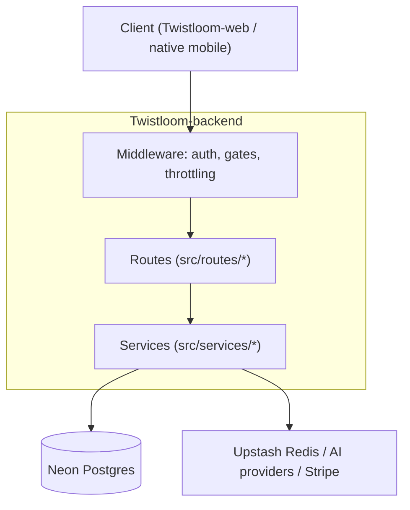

# Architecture MD Document Skill (Twistloom Backend)

Use this skill whenever creating, editing, restructuring, or reviewing any
`*_ARCHITECTURE.md` file under `docs/architecture/`. It enforces the canonical
structure, the living-header status vocabulary, the section-anchor contract that
source comments depend on, the Mermaid-only diagram policy, evidence honesty,
and the validation commands this repository actually runs.

This skill owns **architecture document format**. It does not own:

- **Roadmap format** (`docs/roadmap/*_ROADMAP.md`) — see [roadmap-doc](../roadmap-doc/SKILL.md).
  Roadmaps *propose* gated future work; architecture docs *record* how the
  system works today. Never mix the formats or invent decision IDs (`ARCH-NNN`
  is not used in this repo).
- **Post-hoc auditing** — see
  [architecture-doc-audit](../architecture-doc-audit/SKILL.md) (run before
  merge) and [doc-sync-audit](../doc-sync-audit/SKILL.md) (run after code
  changes invalidate docs).
- **Architectural invariants of the system** — those live in
  [AGENTS.md](../../../AGENTS.md), the architectural constitution. This skill's
  docs *elaborate and illustrate* those invariants and must never contradict
  them or re-home a rule that belongs in `AGENTS.md`.

---

## Trigger

- Creating a new architecture document under `docs/architecture/`
- A shipped subsystem (SSE, payments, auth, middleware, branch traversal, …)
  deserves a durable as-built record
- Updating, restructuring, or reviewing an existing `*_ARCHITECTURE.md`
- Source comments cite this doc's `§N` sections and the doc is being renumbered
  (anchor-contract hazard — see below)
- A doc is being written to back-reference a claim in `AGENTS.md` or a roadmap

---

## Location & Naming

| Rule | Value |
|------|-------|
| **Directory** | `docs/architecture/` only — never `docs/roadmap/`, `docs/middleware/`, `docs/` root, or repo root |
| **Filename** | `SCREAMING_SNAKE_CASE` topic + `_ARCHITECTURE.md` suffix (e.g. `MIDDLEWARE_ARCHITECTURE.md`) |
| **Scope** | One focused architectural surface per file; never empty or speculative docs |
| **Sibling pairing** | Link the owning roadmap in the header when one exists; link companion architecture docs both ways |
| **Relative links only** | `./SIBLING.md`, `../roadmap/X.md`, `../../AGENTS.md` — portable across clones and CI |

Legacy non-conforming names exist (`CSRF_PROTECTION.md`, `DUAL_AUTH_ARCHITECTURE.md`,
`GUEST_USER_FLOW.md`, `docs/middleware/MIDDLEWARE_GUIDE.md`). Do not imitate them
for new files and do not rename them as a side effect of an unrelated edit.

---

## Canonical Structure

Every architecture MD **must** follow this section order. Sections marked
**(required)** always appear; **(conditional)** sections appear only when the
surface has that content. Middle deep-dive sections are topic-driven and may
expand into multiple numbered sections — renumber subsequent sections so the
document always ends with **Verification → FAQ → Gaps → Anchor Map & Related
Documents** in that relative order.

```
# <Title> Architecture

> Living header blockquote                          ← (required)

## Table of Contents                                 ← (required for docs > ~400 lines)

## 1.  Executive Summary & Design Rationale         ← (required)
## 2.  System Boundaries & Overview Diagram         ← (required)
## 3.  Key Architectural Invariants                 ← (required)
## 4.  Deep Dive / How It Works                     ← (required — one or more topic sections)
## N.  Failure Modes & Recovery Matrix              ← (conditional — any surface with user-facing failures)
## N.  Industry Standard Comparison                 ← (required)
## N.  File Map & Ownership                         ← (required)
## N.  Verification & Evidence                      ← (required)
## N.  FAQ                                          ← (required)
## N.  Known Gaps & Future Enhancements             ← (conditional)
## N.  Section Anchor Map & Related Documents       ← (required — always last)
```

---

## Living Header Blockquote (required)

First content after the `#` title:

```markdown
> Living architecture document · Twistloom Backend · <YYYY-MM-DD>
> Scope: <one dense sentence: what surface this document covers>
> Status: **<status word>** · last verified against the working tree on <YYYY-MM-DD>
> Anchor contract: source files cite this document's `§N` sections in their
> doc comments — see the Section Anchor Map at the end. Renumbering requires
> updating those comments in the same change.
> Companion: [<Doc>](./<FILE>.md) · ...
```

Rules:

- **Date** = last substantive-edit date (YYYY-MM-DD).
- **Status vocabulary** — only these words, never "Done"/"WIP"/"Beta":
  - **Implemented & verified** — code exists and `file:line` evidence was
    re-checked in the current tree during this edit.
  - **Implemented** — code exists; line numbers may drift, patterns verified.
  - **Partial** — some paths shipped; name what is missing in §1.
  - **Planned (gated)** — direction selected, not shipped; name the gate.
  - **Deferred / Superseded** — out of scope / replaced by another doc.
- **Anchor contract** line is mandatory whenever sections are (or may become)
  cited from source. This repo really does this: `src/services/trust-score.ts`,
  `src/services/evaluate-trust.ts`, `src/services/fraud-detection.ts`,
  `src/middleware/age-gate.ts` cite `TRUST_AND_SAFETY_ARCHITECTURE.md §…`,
  `src/middleware/vip.ts` cites `MIDDLEWARE_ARCHITECTURE.md §6.15`, and
  `src/utils/ai-chat.ts` cites `AI_ORCHESTRATION_ARCHITECTURE.md §17`.
- Header status and the §1 "current reality" paragraph must agree. The doc must
  never claim more than the code supports.

---

## Section Anchor Contract

1. **Section numbers are a public API.** When adding a section, append at the
   end of its group or accept the renumber cost.
2. **Renumbering is an atomic change.** Moving/renumbering `## N.` headings
   requires grepping source in the same change:
   `grep -rn "<DOC_NAME>.md §" src/` and updating every citing comment.
3. **Maintain the Section Anchor Map** (final section): `§ → section title →
   citing source files`. A doc with no citations may collapse the table to a
   one-liner, but the section must exist.
4. **Never cite a section that does not exist.** A dangling `§10.3` is a real
   defect class — after editing, verify every `§` in the map resolves to an
   actual heading. (Known live example of a worse variant: four source files
   cite `TRUST_AND_SAFETY_ARCHITECTURE.md`, which does not exist — do not add
   more of these; log them in the gap table of the nearest doc instead.)

---

## 1. Executive Summary & Design Rationale (required)

### 1a. Summary (3–8 sentences)
What the surface is, who owns it (backend / both repos), and the **current
reality** using the status vocabulary. End with an honest "what is not covered"
sentence when scope is fuzzy.

### 1b. Design rationale — why this design and not another

| Element | Expectation |
|---------|-------------|
| **Decision** | What was chosen, bolded on first mention |
| **Alternatives considered** | The obvious runner-up (inline prose or table cell) |
| **Why it wins here** | Tied to a Twistloom constraint: an AGENTS.md invariant, the 10M-concurrent assumption, serverless CPU quotas, the two-repo contract, credit-economy rules |
| **Cost accepted** | The trade-off — every decision with rationale names what it gives up |

Rules:
- Rationale must cite the **constraint that forced the choice**. "Because AGENTS.md
  §1 requires type safety at every boundary" is valid; "because it is cleaner" is not.
- If the argument already lives in a roadmap, summarize in 1–3 sentences and
  link — roadmaps own proposals, this doc owns as-built justification.
- Non-goals belong here ("this doc is not about X").

---

## 2. System Boundaries & Overview Diagram (required)

State what the surface owns, what it must not own, and where authority sits
(backend route/middleware layer, `executeWithCredits` transaction, third-party
gateway, Vercel edge).

**Mermaid diagram required in §2** showing the boundary: layers, ownership
direction, external authority. Example shape (backend layering):



**Diagram rules (document-wide):**

1. **Mermaid only for complex diagrams.** ASCII box/flow diagrams are
   forbidden. Small inline lists and Markdown tables remain fine.
2. Pick the right type: `flowchart TB` (layers, gate pipelines), `sequenceDiagram`
   (multi-actor request/response), `stateDiagram-v2` (lifecycles),
   `erDiagram` (schema), `flowchart LR` (short pipelines).
3. Nodes are self-contained — no `file:line` or links inside node text; put
   those in surrounding prose/tables. Use `\n`/`<br/>` for line breaks and
   quote labels containing punctuation.
4. **Show failure branches, gates and rejected paths** (dotted `-.->` where
   helpful), not only the happy path. A gate pipeline must diagram its rejections.
5. When a flow is already fully diagrammed in a companion doc, one summary
   diagram + a link beats duplicating a large diagram.

---

## 3. Key Architectural Invariants (required)

Numbered, testable claims a future change must not silently break — ownership,
authority, identity, ordering, safety. One invariant per number, each may cite
the deep dive that proves it.

- **Not aspirations.** "The system should be fast" is not an invariant; "rate
  limiting fails open when Redis is unavailable (`src/middleware/rate-limit.ts`)"
  is.
- **Inherit, don't fork.** If `AGENTS.md` already states it (no `as` casts
  across boundaries, `executeWithCredits` for credit paths, `.js` import
  extensions), cite AGENTS.md instead of restating a weakened version.
- Keep it honest: 4–10 invariants is typical; 30 means split the section.

---

## 4. Deep Dive / How It Works (required — one or more topic sections)

Topic sections explaining **how** the surface works end-to-end. Expected
patterns (include those that apply):

- **Request/interaction flows** with a `sequenceDiagram` per major protocol
  (one per pipeline — not one mega-diagram)
- **Gate/pipeline walkthroughs**: ordered list of each gate, its inputs, its
  rejection status/body, and the `file:line` implementing it
- **Data model**: `erDiagram` or typed-shape tables
- **State machines** (`stateDiagram-v2`) for lifecycle-bearing surfaces
- **Ownership tables** — responsibility vs must-not, per layer
- **Edge cases** — races, empty states, cold starts, concurrent claims
- **Failure handling** — where errors surface, exact status codes, how the
  client translates them (backend machine `code` fields are the contract)

Rules:
- Cite real paths with line numbers. Backend files as `src/...` (this repo);
  frontend files explicitly as `Twistloom-web/src/...`.
- Distinguish **Implemented** vs **Planned (gated)** inside the section, not
  only in the header.
- Short snippets (≤15 lines) only when the invariant or contract is non-obvious.
  Never paste whole implementations.
- Line-number drift is expected; stamp the header date instead of per-line dates.

---

## 5. Failure Modes & Recovery Matrix (conditional — near-required)

Any surface with user-facing failure paths includes a numbered matrix:

| # | Failure | Detection / error | Recovery / client behavior |
|---|---------|-------------------|---------------------------|
| 1 | <what goes wrong> | <`file:line` + **exact** HTTP status> | <what the user/client can do> |

- Verify statuses against the route/middleware file, never from memory;
  hedged words like "409-style" are a defect.
- Include client-gate rejections, server-gate rejections, auth/race windows,
  network loss, and provider/Redis outages where the surface depends on them.

---

## 6. Industry Standard Comparison (required)

Five parts, no exceptions:

### The standard (or the de-facto practice)
Name the recognized pattern/RFC/OWASP guidance/product with a **link**. If
Twistloom is deliberately ahead, say so. Never write "industry standard"
without naming one.

### How this design compares
- **Matches the standard** — what aligns and why it matters here.
- **Deliberately ahead / divergent** — with the Twistloom constraint that
  justifies it.
- **Behind / gap** — weaker than the standard; name the gate (roadmap step,
  known gap, missing evidence).

### Comparison
| Aspect | Industry practice | This design | Alignment / rationale |
|--------|-------------------|-------------|----------------------|
| <dimension> | <practice + link> | <what Twistloom does, `file:line` if apt> | Aligned · Ahead (<why>) · Gap (<gate>) |

### Assessment
One short paragraph: what is already best-in-class, the honest distance from
peers, and what is ordinary backlog versus an architectural gap.

---

## 7. File Map & Ownership (required)

A table of every meaningful file for the surface: path, layer, one-line
responsibility. Split into sub-tables (global/route/service, or backend vs
frontend with a Repo column) for cross-cutting surfaces.

- **Verify each path exists at save time** — broken paths are the most common
  audit finding.
- Include *negative* rows only when load-bearing: "no `src/middleware/guest.ts`
  — guest middleware was removed in the Hono migration".

---

## 8. Verification & Evidence (required)

What was actually verified, at what layer, with honest limits:

| Layer | Status | Evidence |
|-------|--------|----------|
| Static check | **Implemented & verified** | `bun run typecheck` green on <date> |
| Lint / import extensions | **Implemented & verified** | `bun run lint` / `bun run lint:imports` on <date> |
| Unit/integration tests | **Implemented** / **Not claimed** | <real test path, or explicit absence> |
| Manual/E2E | **Not claimed** | <explicitly what was not run> |

Rules:
- This repo's validation commands are **`bun run typecheck`**, **`bun run
  lint`**, **`bun run lint:imports`**, and **`bun run check`** (all three).
  Do not write `pnpm`/`npm` commands.
- Cite real test paths when implemented; otherwise **Not claimed** — never
  imply coverage that does not exist, and never invent suite counts.
- Documentation-only changes do not change test counts — do not narrate them.

---

## 9. FAQ (required)

Minimum **3**, 8–12 for a complex surface. Strong candidates: why not
alternative X; what happens on failure/race/outage; which layer owns a given
decision; what evidence exists vs is explicitly not claimed; which roadmap
gate still controls behavior.

```markdown
### FAQ 1. <Question>
<Answer: 1–4 sentences. Cite `file:line`, an AGENTS.md invariant, or a roadmap gate.>
```

Answers must agree with the status vocabulary and gap inventory — no stronger
guarantee than the evidence supports. When an answer is an open owner decision,
cite the roadmap item instead of deciding it in the FAQ.

---

## 10. Known Gaps & Future Enhancements (conditional)

```markdown
| # | Gap / enhancement | Why it matters | Entry gate | Status |
|---|-------------------|----------------|------------|--------|
| 1 | <short name> | <risk/impact> | <roadmap step / dependency / evidence threshold> | <status word> |
```

- Gates are references, not self-authorization: writing a row does not permit
  implementing it.
- **Documented drift belongs here too**: sibling docs that contradict this one,
  stale source comments, dangling `§` citations, dead exports — as findings with
  `file:line`, so the next reader inherits the hazard list.
- When a gap closes, update the row in place with evidence rather than deleting
  the history.

---

## 11. Section Anchor Map & Related Documents (required — always last)

Two tables:

```markdown
### Section Anchor Map
| Anchor | Section | Cited by |
|--------|---------|----------|
| §6.15 | VIP entitlement gates | `src/middleware/vip.ts:29` |

### Related Documents
| Document | Role |
|----------|------|
| [<Roadmap>](../roadmap/<path>.md) | Proposal, gates |
| [<Companion Doc>](./<FILE>.md) | The adjacent surface |
| [AGENTS.md](../../AGENTS.md) | Invariants this doc elaborates |
```

- Relative links only; **verify every target exists before saving** — a dead
  relative link is a Critical audit finding.
- Related Documents must include the owning roadmap when one exists, plus
  companion skills (`architecture-doc-audit`, `doc-sync-audit`).

---

## Editing Existing Docs (delta rules)

1. **Read before edit.** Confirm current structure; preserve the doc's status
   vocabulary. Migrate a legacy header to the living-header format only when
   the doc is already being substantively changed.
2. **Renumber atomically** — anchor-contract rules apply to every restructure.
3. **Re-verify, don't inherit.** Every `file:line` you touch or repeat is
   re-checked against the working tree; stale line numbers you merely carried
   forward are now yours to fix. Stamp the header date.
4. **Status downgrade is a valid edit.** If code no longer matches the doc,
   change the status word and add a gap row — do not soften prose to preserve
   a stale claim.
5. **After code changes**, run [doc-sync-audit](../doc-sync-audit/SKILL.md) to
   find docs the change invalidated.

---

## Formatting Rules

1. **Section numbering** — `## N. Title` incrementing through the document;
   subsections `### N.M`.
2. **Horizontal rules** — `---` between major sections.
3. **Mermaid, not ASCII** — complex diagrams always Mermaid-fenced.
4. **Status vocabulary** — only the six words defined above.
5. **File references** — backtick paths with line numbers where relevant;
   frontend paths labeled `Twistloom-web/...`.
6. **Tables** for invariants, ownership, comparisons, failure matrices, file
   maps, gap inventories, anchor maps, related documents.
7. **No emojis in prose** — statuses are words in architecture docs.
8. **Evidence honesty** — every Implemented claim ties to code/tests; every
   unverified surface is explicitly **Not claimed**.
9. **Language** — English. This backend serves translated content, but docs
   themselves are not translated.
10. **Bold key terms** — first mention of critical invariants, gates and
    decisions.
11. **Imports in example snippets must carry the `.js` extension** — this repo
    is ESM with explicit extensions (AGENTS.md §3.6), and `bun run lint:imports`
    enforces it.

---

## Checklist Before Saving

- [ ] File lives in `docs/architecture/` with a `*_ARCHITECTURE.md` name
- [ ] Living header: date, scope, status word, anchor-contract line, companions
- [ ] Table of contents present for long docs; anchors match headings
- [ ] §1 summary + design rationale with alternatives and the cost accepted
- [ ] §2 Mermaid system-boundary diagram; §3 invariants numbered and testable
- [ ] ≥1 deep dive per major mechanism; failure matrix for user-facing paths
- [ ] Industry comparison: named+linked reference, comparison table, honest
      assessment (no naked "best practice" claims)
- [ ] File map: every path exists; frontend paths labeled `Twistloom-web/`
- [ ] Verification table with an explicit **Not claimed** row; no invented
      test counts
- [ ] FAQ ≥3 substantive answers consistent with the status vocabulary
- [ ] Gap table with entry gates (plus documented sibling-doc drift)
- [ ] Section Anchor Map + Related Documents last; every relative link live;
      every `§` in the map resolves to a real heading
- [ ] `grep -rn "<DOC_NAME>.md §" src/` matches the anchor map exactly
- [ ] No `ARCH-NNN`-style IDs invented; owner decisions referenced as roadmap
      items only
- [ ] Mermaid blocks parse (balanced quotes/brackets; quoted labels with
      punctuation; `<br/>` not raw newlines)
- [ ] Ran [architecture-doc-audit](../architecture-doc-audit/SKILL.md); ran
      [doc-sync-audit](../doc-sync-audit/SKILL.md) if code changed
- [ ] If any source comment was touched: `bun run check`

---

## Reference Documents

| Document | Best For |
|----------|----------|
| [MIDDLEWARE_ARCHITECTURE.md](../../../docs/architecture/MIDDLEWARE_ARCHITECTURE.md) | Living header + anchor contract, per-middleware Mermaid catalog, failure matrix, gap inventory with documented drift |
| [SERVER_SENT_EVENTS_STREAMING_ARCHITECTURE.md](../../../docs/architecture/SERVER_SENT_EVENTS_STREAMING_ARCHITECTURE.md) | Long-form spec with table of contents, wire-protocol tables, anti-pattern/pitfall sections, implementation recipes |
| [DUAL_AUTH_ARCHITECTURE.md](../../../docs/architecture/DUAL_AUTH_ARCHITECTURE.md) | Two-credential identity surface, protocol-level flows |
| [PAYMENTS_ARCHITECTURE_BACKEND.md](../../../docs/architecture/PAYMENTS_ARCHITECTURE_BACKEND.md) | Transactional invariants, gateway-agnostic layering, file:line heavy evidence |
| [BOOK_EXPLORE_FILTER_SORTING_ARCHITECTURE.md](../../../docs/architecture/BOOK_EXPLORE_FILTER_SORTING_ARCHITECTURE.md) | Cache-tier documentation with per-key namespaces |
| [roadmap-doc skill](../roadmap-doc/SKILL.md) | Sibling format skill for `docs/roadmap/*_ROADMAP.md` (do not mix formats) |
| [architecture-doc-audit skill](../architecture-doc-audit/SKILL.md) | Post-draft verification procedure — run before merge |
| [AGENTS.md](../../../AGENTS.md) | Architectural constitution every doc must elaborate, never contradict |
