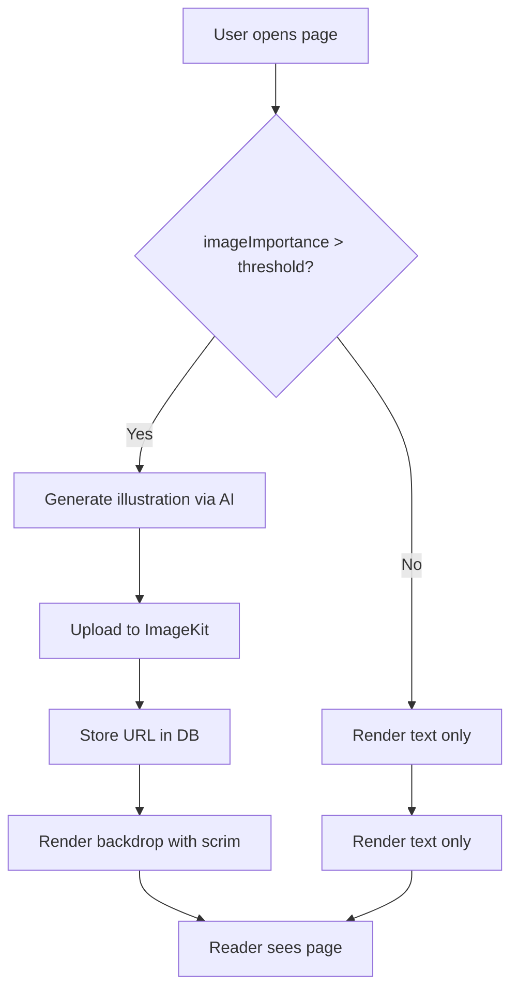

# Roadmap MD Document Skill

Use this skill when creating, editing, or reviewing any `*_ROADMAP.md` file under `docs/roadmap/`. This skill enforces the canonical structure, formatting, and emoji conventions used across the Twistloom codebase.

---

## Trigger

- User asks to create a new roadmap document
- User asks to update or restructure an existing roadmap
- User references a roadmap file for review or alignment

---

## Canonical Structure

Every roadmap MD **must** follow this exact section order. Sections marked **(required)** must always appear; sections marked **(conditional)** appear only when applicable.

```
# <Title> Roadmap

> **Status:** <Proposed | In Progress | Completed>
> **Date:** <YYYY-MM-DD>
> **Owner:** <Team / Person>

---

## 1. Summary Table                                      ← (required)
## 2. Problem Statement                                   ← (required)
## 3. Intended Design & Rationale                         ← (required)
## 4. Feasibility Analysis                                ← (required)
## 5. Flow Diagram (Mermaid)                              ← (required)
## 6. Implementation Plan                                 ← (required)
## 7. Open Questions                                      ← (conditional — if decisions pending)
## 8. References & File Touch List                        ← (required)
## 9. Completion Status                                   ← (required)
```

---

## 1. Summary Table (required)

A **top-level at-a-glance table** placed immediately after the header metadata. This is the first thing a reader sees.

### Format

```markdown
## 1. Summary Table

| # | Item | Priority | Status |
|---|------|----------|--------|
| 1 | <Short description> | `P0` / `P1` / `P2` | ⬜ Planned |
| 2 | <Short description> | `P0` / `P1` / `P2` | ⏳ In Progress |
| 3 | <Short description> | `P0` / `P1` / `P2` | ✅ Completed |
| 4 | <Short description> | `P0` / `P1` / `P2` | ⏩ Skipped |
```

### Emoji Legend (use consistently everywhere)

| Emoji | Meaning |
|-------|---------|
| ⬜ | Planned — not started |
| ⏳ | In Progress — actively being worked |
| ✅ | Completed — implemented and verified |
| ⏩ | Skipped — intentionally deferred or no longer needed |

**Rules:**
- The Summary Table **must** include the Status column with one of the four emojis above.
- Every row in the Summary Table corresponds to a numbered item in the Implementation Plan (§6).
- If the roadmap has an Open Questions section, each question also gets a status emoji (see §7).

---

## 2. Problem Statement (required)

A clear, factual description of **what is broken, missing, or suboptimal**. Must include:

1. **Current state** — what exists today, with specific file/line references where possible.
2. **Pain points** — numbered list of specific issues (reader fatigue, security gap, performance bottleneck, etc.).
3. **Goal** — one sentence stating the desired end state.

### Template

```markdown
## 2. Problem Statement

### Current State
- <What exists today — cite files, line numbers, schema columns, API endpoints>
- <Concrete data points: "touchPage fires on every scroll segment" / "50+ pages of uniform text">

### Pain Points
1. <Specific issue with impact>
2. <Specific issue with impact>
3. <Specific issue with impact>

### Goal
<One sentence: "Add X so that Y" / "Reduce Z by N%" / "Enable W capability">
```

---

## 3. Intended Design & Rationale (required)

Present the chosen design with clear justification. For non-trivial designs, include **design alternatives** with pros/cons before stating the recommendation.

### Format

```markdown
## 3. Intended Design & Rationale

### Design Alternatives (if applicable)

#### Alternative A: <Name>
<Description, ASCII diagram if helpful>

**Pros:** ...
**Cons:** ...

#### Alternative B: <Name>
...

### Recommended: Alternative <X>

<Why this is superior — reference existing architecture, precedent patterns, non-breaking guarantees>

### Non-Breaking Guarantees
| Change | What it does NOT change | Why safe |
|--------|------------------------|----------|
| <change> | <unchanged aspect> | <reason> |
```

**Rules:**
- If there is only one obvious design, skip alternatives and go straight to the description.
- Always state what the design does **not** change (non-breaking guarantees).
- Reference existing codebase patterns (e.g., "follows the pattern in `src/utils/pen-prompt.ts:213-260`").

---

## 4. Feasibility Analysis (required)

A brief assessment of effort, risk, and dependencies.

### Template

```markdown
## 4. Feasibility Analysis

| Dimension | Assessment |
|-----------|------------|
| **Effort** | Low / Medium / High (<N days/hours>) |
| **Risk** | Low / Medium / High — <one-line justification> |
| **Backend changes** | None / Minimal / Significant |
| **Dependencies** | <List any blockers or prerequisite work> |
| **Reversibility** | Fully reversible / Partially / Irreversible |
```

---

## 5. Flow Diagram (Mermaid) (required)

A Mermaid diagram showing the end-to-end flow. Use `flowchart TD` (top-down) for process flows, or `sequenceDiagram` for multi-actor interactions.

### Rules
- Every roadmap **must** include at least one Mermaid diagram.
- Diagrams must be self-contained (no external links or references inside nodes).
- Use descriptive node labels, not abbreviations.
- If the flow has branches, show them.
- Wrap in a fenced code block with `mermaid` language tag.

### Example

````markdown
## 5. Flow Diagram


````

---

## 6. Implementation Plan (required)

A numbered, ordered list of implementation steps. Each step maps to a row in the Summary Table (§1).

### Format

```markdown
## 6. Implementation Plan

### Step 1: <Name> — ⬜ Planned

**Files:** `path/to/file.ts:line`, `path/to/other.ts`
**Effort:** <Low/Medium/High>

<Description of what to do, with code sketches if helpful>

**Non-breaking:** <what stays the same>

---

### Step 2: <Name> — ⏳ In Progress

...
```

**Rules:**
- Each step must include its status emoji in the heading.
- Each step must list affected files with line numbers where relevant.
- Steps should be ordered by priority (highest impact / lowest risk first).
- Include code sketches or pseudocode for non-trivial changes.
- Mark the end of each step with a horizontal rule (`---`).

---

## 7. Open Questions (conditional)

Include this section **only** when there are unresolved design decisions. If all decisions are made, skip this section entirely.

### Format

```markdown
## 7. Open Questions

### Q1. <Question> — ⬜ Open

<Context and options>

- **(A)** <Option 1> — <pros/cons>
- **(B)** <Option 2> — <pros/cons>
- **(C)** <Option 3> — <pros/cons>

**Recommendation:** Option <X>. <Reasoning>.

---

### Q2. <Question> — ✅ Decided

**Decision:** <What was decided>. <Rationale>.
```

### Rules
- Each question **must** have a status emoji: ⬜ Open, ⏳ Discussed, ✅ Decided, ⏩ Deferred.
- Present **options** as lettered choices (A, B, C...) with pros/cons.
- Always include a **Recommendation** line with the best option and reasoning.
- Once a decision is made, update the emoji to ✅ and record the decision.
- Questions should be numbered sequentially (Q1, Q2, Q3...).

---

## 8. References & File Touch List (required)

A comprehensive list of all files that will be or were modified.

### Format

```markdown
## 8. References & File Touch List

| File | Change |
|------|--------|
| `src/path/to/file.ts:123-456` | <What changes> |
| `src/path/to/config.ts` | **NEW** — <description> |
| `src/path/to/schema.ts:74-75` | Existing — <reference only> |
```

### Rules
- Group by area (Backend, Frontend, Config, Schema, etc.) if the list is long.
- Mark **NEW** files explicitly.
- Include line numbers for existing files where the change lands.
- Include a **Codebase Findings** subsection if bugs, inefficiencies, or architectural gaps were discovered during analysis (see `CANDIDATE_GENERATION_ENHANCEMENT_ROADMAP.md` or `LLM_OPTIMIZATION_ROADMAP.md` for examples).

---

## 9. Completion Status (required)

A final section summarizing what is done and what remains.

### Format

```markdown
## 9. Completion Status

Legend: ✅ Implemented & verified · ⏳ Partial / scoped down · ⬜ Future work · ⏩ Deferred

### Completed
- ✅ <Item 1> — <brief note>
- ✅ <Item 2> — <brief note>

### In Progress
- ⏳ <Item 3> — <brief note>

### Future / Deferred
- ⬜ <Item 4>
- ⏩ <Item 5> — <reason deferred>
```

---

## Formatting Rules

1. **Section numbering** — Always use `## N. Title` format (e.g., `## 1. Summary Table`).
2. **Horizontal rules** — Use `---` between major sections and between implementation steps.
3. **Code blocks** — Use triple backticks with language tags (`ts`, `tsx`, `sql`, `mermaid`).
4. **File references** — Always use backtick-wrapped paths with line numbers: `` `src/lib/hooks/useFoo.ts:42` ``.
5. **Tables** — Use Markdown tables for structured data (summary, feasibility, file touch list).
6. **Bold key terms** — Bold the first mention of important concepts, file names, and decisions.
7. **No emojis in prose** — Emojis are only used in status columns and completion markers. Never use emojis in body text, descriptions, or explanations.
8. **Status emoji consistency** — The same item must use the same emoji across the Summary Table, Implementation Plan steps, and Completion Status section.

---

## Checklist Before Saving

Use this checklist to verify the roadmap is complete:

- [ ] Summary Table present with Status emoji column
- [ ] Problem Statement with Current State, Pain Points, Goal
- [ ] Intended Design with rationale (and alternatives if non-trivial)
- [ ] Feasibility Analysis table
- [ ] At least one Mermaid flow diagram
- [ ] Implementation Plan with numbered steps, each with status emoji
- [ ] Open Questions section (if applicable) with options + recommendation
- [ ] References & File Touch List
- [ ] Completion Status with legend
- [ ] All status emojis are consistent across sections
- [ ] No emojis in prose text (only in status columns)
- [ ] File paths include line numbers where relevant
- [ ] Both `messages/en.json` and `messages/id.json` updated if any i18n keys were added (frontend roadmaps)

---

## Reference Documents

These existing roadmaps exemplify the canonical structure. Consult them for edge cases:

| Document | Best For |
|----------|----------|
| `AI_ORCHESTRATION_ROADMAP.md` | Multi-provider architecture, design alternatives with pros/cons, Mermaid diagrams |
| `BRANCH_TRAVERSAL_FUTURE_IMPROVEMENTS.md` | Implementation plan with prioritized steps, non-breaking guarantees |
| `ASYNC_BOOK_CREATION_ROADMAP.md` | Problem statement with current state, phased implementation plan |
| `CANDIDATE_GENERATION_ENHANCEMENT_ROADMAP.md` | Feasibility analysis, tiered implementation, codebase findings |
| `LLM_OPTIMIZATION_ROADMAP.md` | Performance-focused design rationale, priority overview table |
| `STRIPE_AND_XENDIT_GATEWAY_AGNOSTIC_ROADMAP.md` | Open Questions with options/decisions, integration architecture |
| `TWISTLOOM_SCALABILITY_BIBLE.md` | Comprehensive problem statement, design alternatives, completion status |
