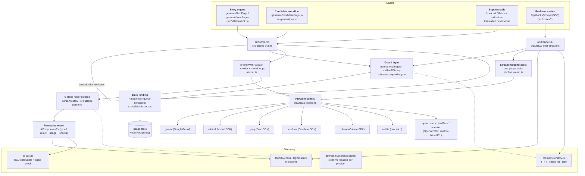
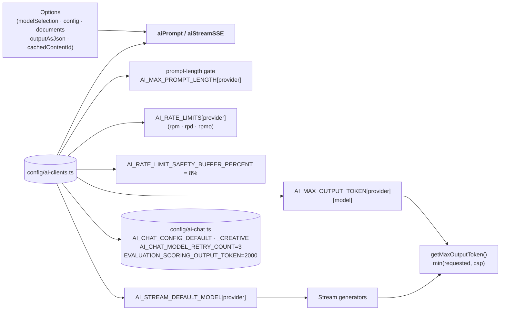
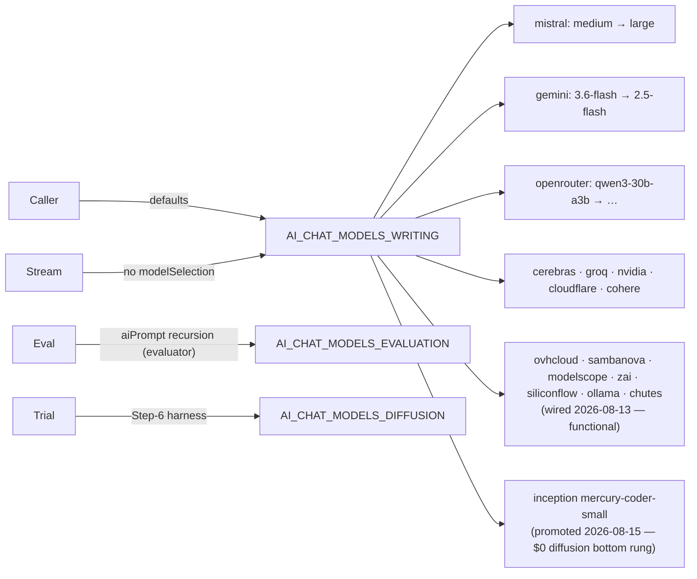
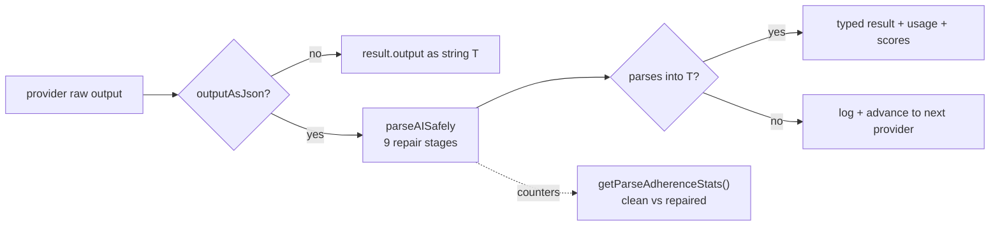
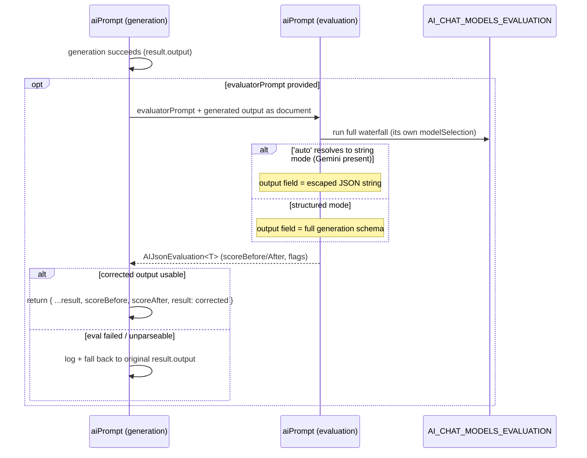
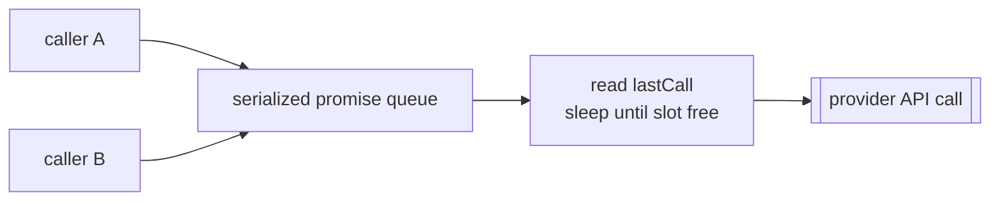
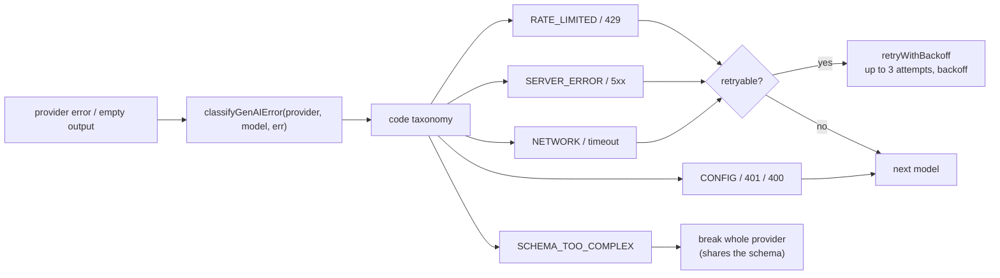
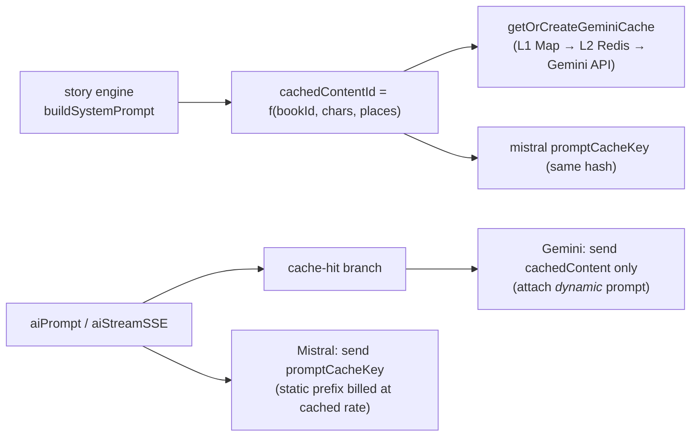
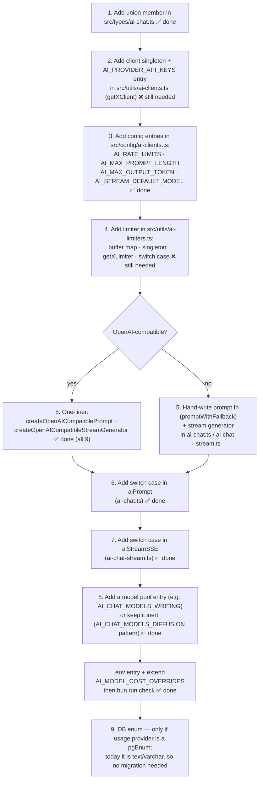

# Twistloom — AI Orchestration Architecture

> **Revision:** v3 — updated 2026-08-15 to reflect the Inception diffusion-LLM promotion (was v2, 2026-08-13 DRY refactor + 9-provider wiring pass).
> **Stack:** TypeScript / Node.js (Bun) · Hono · PostgreSQL (Neon) · Redis (Upstash)
> **Primary sources:** `src/utils/ai-chat.ts` · `src/utils/ai-chat-stream.ts` · `src/types/ai-chat.ts` ·
> `src/config/ai-chat.ts` · `src/config/ai-clients.ts` · `src/utils/ai-limiters.ts` · `src/utils/ai-clients.ts`
>
> This document is the **current-state architecture** the three older roadmaps sketched toward:
> [`docs/roadmap/AI_ORCHESTRATION_ROADMAP.md`](../roadmap/AI_ORCHESTRATION_ROADMAP.md),
> [`docs/roadmap/LLM_OPTIMIZATION_ROADMAP.md`](../roadmap/LLM_OPTIMIZATION_ROADMAP.md),
> [`docs/roadmap/LLM_OPTIMIZATION_PATCHES.md`](../roadmap/LLM_OPTIMIZATION_PATCHES.md).
> Those docs describe the *build order*; this one describes *what is running today*.
> It complements (does not replace) `docs/architecture/AI_LLM_ARCHITECTURE.md` (caching/prompt-cost
> engineering) and `docs/architecture/AI_CHAT_STREAM_ARCHITECTURE.md` (SSE event wire format).
>
> **What changed in this revision:** all 9 providers §17 flagged as "registered but unwired"
> (`ovhcloud`, `sambanova`, `ollama`, `modelscope`, `zai`, `siliconflow`, `aionlabs`, `chutes`, `llm7`)
> are now fully wired — 19 total chat-capable providers, up from 10. The 14-item DRY audit referenced
> throughout this document (`TWISTLOOM_AI_DRY_OPPORTUNITIES.md`) is now a completion report, not a
> proposal — every refactor in it is implemented. §3, §5, §15, and §17 are updated accordingly; see
> each section for what specifically changed.

---

## Table of Contents

1. [Overview](#1-overview)
2. [Layered Architecture](#2-layered-architecture)
3. [Provider Registry & Transport Clients](#3-provider-registry--transport-clients)
4. [Configuration Maps](#4-configuration-maps)
5. [Model Selection Pools](#5-model-selection-pools)
6. [Non-Streaming Orchestrator — `aiPrompt`](#6-non-streaming-orchestrator--aiprompt)
7. [Two-Level Fallback — `promptWithFallback`](#7-two-level-fallback--promptwithfallback)
8. [Structured Output & the 9-Stage Parse Pipeline](#8-structured-output--the-9-stage-parse-pipeline)
9. [Evaluation Phase (score → correct → re-emit)](#9-evaluation-phase)
10. [Streaming Orchestrator — `aiStreamSSE`](#10-streaming-orchestrator--aistreamsse)
11. [Rate Limiting & Budget Gates](#11-rate-limiting--budget-gates)
12. [Error Classification, Retry & Backoff](#12-error-classification-retry--backoff)
13. [Telemetry & Observability](#13-telemetry--observability)
14. [Cache Interplay](#14-cache-interplay)
15. [Adding a New Provider (checklist)](#15-adding-a-new-provider-checklist)
16. [Old Roadmap → Current Reality](#16-old-roadmap--current-reality)
17. [Known Gaps & Future Work](#17-known-gaps--future-work)
18. [File Map & Quick Reference](#18-file-map--quick-reference)

---

## 1. Overview

Twistloom's AI engine is a **free-tier-first, multi-provider LLM waterfall** with **two
orchestrators** sharing one mental model:

| Orchestrator | File | Shape | Used by |
|---|---|---|---|
| `aiPrompt<T>()` | `src/utils/ai-chat.ts` | One-shot, returns a complete `AIResponse<T>` | Background page/candidate generation, book init, theme/validation, evaluation |
| `aiStreamSSE()` | `src/utils/ai-chat-stream.ts` | SSE `ReadableStream<Uint8Array>` | Real-time `/api/books/prompt` and other streaming routes |

Both orchestrators implement the same **3-layer failure doctrine**:

1. **Provider layer** — iterate `modelSelection` in priority order; skip providers that are
   ineligible for this call (no key, no models, prompt too long, budget exhausted, schema too complex).
2. **Model layer** — inside each provider, try each model in order with per-model
   retry-with-backoff on transient errors.
3. **Repair layer** — after a provider succeeds, run the 9-stage JSON repair/parse pipeline
   (`parseAISafely`); if the output can't be parsed into the target type, treat the provider
   as failed and continue down the waterfall.

The difference between the orchestrators is **where** the model loop lives:

- `aiPrompt` delegates the model loop to a shared `promptWithFallback()` core (per-provider,
  encapsulated, and reused by every provider function).
- `aiStreamSSE` keeps the model loop **in the orchestrator** (streaming generators are single-model
  and stateless; fallback bookkeeping is centralized so SSE `start`/`error` events are uniform).

---

## 2. Layered Architecture



**Reader's note for the diagram above.** The `Switch` from an orchestrator to a provider function is
the single junction every provider must pass through. `aiPrompt` uses a `switch (provider)` that maps
to 18 provider prompt functions (was 9 before the 2026-08-13 wiring pass — see §17.5); `aiStreamSSE`
uses a matching `switch` that constructs the corresponding generator. A provider that exists only in
the type union and config maps but has no case in either switch (the state all 9 newer providers were
in before that pass) behaves as a silent no-op in the waterfall — present in the pool, never actually
callable.

---

## 3. Provider Registry & Transport Clients

`AIChatProvider` (src/types/ai-chat.ts:11) is the enumeration that forces every
`Record<AIChatProvider, …>` in the codebase to stay complete. It currently lists **19 providers**.

| Provider | Transport / SDK | Base URL / client | Wired at runtime? |
|---|---|---|---|
| `gemini` | `@google/genai` `GoogleGenAI` | `ai.clients` singleton | ✅ prompt + stream (`generateContent`; Interactions parked) |
| `mistral` | `@mistralai/mistralai` | singleton; timeout 60s + SDK backoff | ✅ prompt + stream; `promptCacheKey` caching |
| `groq` | `groq-sdk` | singleton | ✅ prompt + stream |
| `cerebras` | `@cerebras/cerebras_cloud_sdk` | singleton | ✅ prompt + stream |
| `cohere` | `cohere-ai` `CohereClientV2` | singleton; **native RAG** `documents` field | ✅ prompt + stream |
| `nvidia` | raw `fetch` | `https://integrate.api.nvidia.com/v1/chat/completions`, 60s `AbortSignal.timeout` | ✅ prompt + stream (no structured-output support) |
| `openrouter` | OpenAI SDK | `https://openrouter.ai/api/v1`; `response-healing` plugin | ✅ prompt + stream (factory) |
| `cloudflare` | OpenAI SDK | `…/client/v4/accounts/{ACCOUNT_ID}/ai/v1` | ✅ prompt + stream (factory) |
| `inception` | OpenAI SDK | `https://api.inceptionlabs.ai/v1` (diffusion LLM) | ✅ prompt + stream (factory); **promoted 2026-08-15** into `AI_CHAT_MODELS_WRITING` bottom rung ($0 diffusion decoder) |
| `ovhcloud`, `sambanova`, `ollama`, `modelscope`, `zai`, `siliconflow`, `aionlabs`, `chutes`, `llm7` | OpenAI SDK (all 9 confirmed OpenAI Chat Completions–compatible) | provider-specific base URLs, see `.env.example` | ✅ **prompt + stream, wired 2026-08-13** (factory) — see note below |
| `jina` | (own embed path) | embeddings only — not chat | ⚠️ embeddings-only; own limiter, never in chat switches |

> **2026-08-13 wiring note.** `ai-chat.ts`/`ai-chat-stream.ts` are fully wired for all 9 — each is a
> one-line `createOpenAICompatiblePrompt`/`createOpenAICompatibleStreamGenerator` call, identical in
> shape to openrouter/cloudflare/inception, plus a switch case in both `aiPrompt` and `aiStreamSSE`.
> What's **still needed outside those two files** for these calls to actually succeed at runtime:
> client-getter functions (`getOvhcloudClient()`, etc.) + `AI_PROVIDER_API_KEYS` entries in
> `src/utils/ai-clients.ts`, rate limiter entries in `src/utils/ai-limiters.ts`, and `.env` values.
> `AI_RATE_LIMITS`/`AI_MAX_PROMPT_LENGTH`/`AI_MAX_OUTPUT_TOKEN`/`AI_STREAM_DEFAULT_MODEL` config
> entries and the `AI_CHAT_MODELS_*` pool placements were already done in an earlier pass — see §5.
> One gotcha worth flagging explicitly: `getChutesClient()`'s `baseURL` needs to be
> `https://llm.chutes.ai/v1` (**not** including `/chat/completions` — the OpenAI SDK appends that
> itself; Chutes' own docs publish the full path, which double-appends if pasted as-is).

**Client life cycle** (`src/utils/ai-clients.ts`): every client is a lazy-loading module-level
singleton (`getGeminiClient()`, `getMistralClient()`, …, `getInceptionClient()`). First call
constructs with `requireEnv()`, every later call returns the cached instance. `warmAIProviders()`
pre-initialises the six primary clients and is called from the `/health` route, which Vercel
monitors every 5 minutes — this is the cold-start mitigation.

---

## 4. Configuration Maps

All per-provider knobs live in `src/config/ai-clients.ts` (chat sampling lives in
`src/config/ai-chat.ts`). Every map is keyed by the same `AIChatProvider` union, so union math and
map math stay in lock-step.



| Map | Content | Consumed by |
|---|---|---|
| `AI_RATE_LIMITS` | per-provider `{ rpm, rpd?, rpmo? }` (see §11) | `RateLimiter` (rpm), `canUseAIToday` (rpd/rpmo) |
| `AI_MAX_PROMPT_LENGTH` | chars allowed for `systemPrompt + user + documents` (gemini 3.6M down to cloudflare 12K; inception 120K placeholder) | pre-call skip gate in both orchestrators |
| `AI_MAX_OUTPUT_TOKEN` | optional per-model `max_tokens` **caps** (cohere/groq today) | `getMaxOutputToken()` clamps every request |
| `AI_STREAM_DEFAULT_MODEL` | fallback model id per provider when a stream gets no `options.models` | stream generators |
| `AI_CHAT_CONFIG_DEFAULT` | temp 0.7 / topP 0.9 / topK 40 / max 4000 | default sampling |
| `AI_CHAT_CONFIG_CREATIVE` | temp 0.78 / topP 0.92 / topK 50 / max 4000 | story writing |

> **Output-token clamp.** `getMaxOutputToken(provider, model, requested)` (src/utils/ai-chat.ts:177)
> returns `min(requested, AI_MAX_OUTPUT_TOKEN[provider]?.[model])`. Every provider function calls it
> before filling `max_tokens`/`maxOutputTokens`/`maxTokens`.

---

## 5. Model Selection Pools

`AIModelSelection = Partial<Record<AIChatProvider, string[]>>` is a **priority-ordered waterfall**,
not a set: the first provider is the "best prose", later providers are progressively cheaper/weaker
capacity. `aiPrompt` answers with whichever provider/model succeeds first.

| Pool | Purpose | Notable members |
|---|---|---|
| `AI_CHAT_MODELS_WRITING` | full story-page generation (17 providers!) | mistral (top), gemini, openrouter, cerebras, groq, nvidia, cloudflare, cohere, then the newly-wired batch (ovhcloud, sambanova, modelscope, zai, siliconflow, ollama, chutes), then **inception** (`mercury-coder-small`, promoted 2026-08-15 — $0 diffusion bottom rung, just above the absolute-last-resort llm7) |
| `AI_CHAT_MODELS_FAST` | theme/custom-action validation | groq, cerebras, sambanova |
| `AI_CHAT_MODELS_IDEA` | brainstorming / big-idea prompts | gemini, mistral, openrouter, groq, cloudflare, nvidia, cohere + tiny-quota newcomers (aionlabs, llm7, modelscope, siliconflow — now functional) |
| `AI_CHAT_MODELS_THEME` | theme idea + meta directives | `IDEA` + `FAST` spread |
| `AI_CHAT_MODELS_VALIDATION` | policy/content compliance | `IDEA` + groq `gpt-oss-safeguard-20b` |
| `AI_CHAT_MODELS_TRANSLATION` | multilingual book/page translation | mistral, gemini, cohere, qwen routes, zai/modelscope/ovhcloud/siliconflow direct Qwen/GLM access (now functional) |
| `AI_CHAT_MODELS_EVALUATION` | evaluator pass inside `aiPrompt` | gemini, mistral, cerebras, groq, openrouter, cohere + throughput-heavy newcomers (ovhcloud, sambanova, modelscope — now functional) |
| `AI_CHAT_MODELS_DIFFUSION` | **experimental** diffusion single-shot | inception `mercury-coder-small` — now **also** promoted into WRITING as a bottom rung (2026-08-15); this pool remains the isolated way to drive the trial harness / single-shot diffusion calls without touching the writing waterfall |



---

## 6. Non-Streaming Orchestrator — `aiPrompt`

`aiPrompt<T>(prompt, options, evaluatorPrompt?, onProgress?, onGenerationProgress?) →
Promise<AIResponse<T>>` (src/utils/ai-chat.ts:1136) is the heart of every non-streaming generation.

```mermaid
flowchart TD
    Start([aiPrompt]) --> Opt[destructure options + defaults]
    Opt --> Prov{modelSelection providers?}
    Prov -- none --> None[return provider:'none']
    Prov --> EmitStart["onProgress ai_generation_start<br/>onGenerationProgress ai_generation"]
    EmitStart --> Loop{next provider in order}
    Loop -- exhausted --> Done["emit ai_generation_complete<br/>return provider:'none'"]
    Loop -- providers --> Chain{provider in modelSelection?<br/>models configured?}
    Chain -- no --> Skip1[skip provider]
    Chain -- yes --> Len["promptLen = systemPrompt + prompt + Σ documents"]
    Len --> MaxLen{promptLen ≤ AI_MAX_PROMPT_LENGTH[provider]?}
    MaxLen -- no --> Skip2["⏩ prompt too long — skip"]
    MaxLen -- yes --> Budget{canUseAIToday(provider)?}
    Budget -- no --> Skip3["⏩ daily/monthly budget hit — skip"]
    Budget -- yes --> GemGate{gemini &&<br/>isSchemaTooComplex(schema)?}
    GemGate -- yes --> Skip4["⏩ constrained-decoder too complex — skip"]
    GemGate -- no --> Swtch{switch provider}
    Swtch --> PF["provider prompt fn<br/>geminiPrompt / mistralPrompt / … "]
    PF --> Res{result?.output present?}
    Res -- no --> Next1[continue to next provider]
    Res -- yes --> EvalQ{options.evaluatorPrompt?}
    EvalQ -- yes --> Eval[aiPrompt evaluator @ AI_CHAT_MODELS_EVALUATION]
    Eval --> Corr{corrected output?}
    Corr -- yes --> RetEval[return with scoreBefore / scoreAfter / evalProvider]
    Corr -- no --> Fallback1[fall back to raw generation output]
    EvalQ -- no --> Fallback1
    Fallback1 --> ParseQ{outputAsJson?}
    ParseQ -- no --> Raw[result.output as T]
    ParseQ -- yes --> Parse[parseAISafely 9-stage pipeline<br/>logContext = provider-context]
    Raw --> Result
    Parse --> Ok{parsed object?}
    Ok -- yes --> Result[return {...result, result: parsed}]
    Ok -- no --> Next2["⚠️ parse failed → treat provider as failed"]
    Next2 --> AnyMore{more providers?}
    AnyMore -- yes --> Loop
    AnyMore -- no --> Done
```

**Key behaviors to remember:**

- **Default selection** is `AI_CHAT_MODELS_WRITING`; callers that need a different pool pass
  `options.modelSelection` (e.g. evaluator passes `AI_CHAT_MODELS_EVALUATION`).
- **The shared fallback counter.** If `options.fallbackLimit` is set, a single `{ count }` object is
  created at the top of `aiPrompt` and threaded into every `promptWithFallback` call as
  `_fallbackCounter`. It is incremented on *every model failure* (empty output or error) plus every
  `SCHEMA_TOO_COMPLEX` break, across **all** providers — this is how `evaluatorFallbackLimit`
  bounds total spend.
- **`outputFormat` appending** (src/utils/ai-chat.ts:1180): when
  `options.outputFormat` is set *and* the call is structured (`supportsStructuredOutput`) *or* the
  provider is gemini, the format block is appended to the system prompt. This is how
  `executePromptForJSON` lives the JSON schema in the system message (cacheable prefix) rather than
  the dynamic user message.
- **`logPrompts` is throttled** to the first provider iteration and (inside the core) to the first
  model index, to avoid dumping megabytes of context on every fallback attempt.
- **Provider functions return `AIResponse<string> | null`.** The orchestrator only proceeds for
  `result?.output`. Anything else (no key, no models, error, empty output) is logged and skipped.
- `switch (provider)` has **no `default`**. A provider that isn't a case (e.g. `jina`,
  `ovhcloud`, …) leaves `result === null` and the loop simply falls through to the next provider.

---

## 7. Two-Level Fallback — `promptWithFallback`

`promptWithFallback<T>(provider, prompt, options, apiCall, extractOutput, extractUsage,
extractFinishReason)` (src/utils/ai-chat.ts:40) is the shared core every prompt function uses. It
combines per-model iteration, rate-limiting, retry, extraction, and usage bookkeeping.

```mermaid
flowchart TD
    Start([promptWithFallback]) --> Key{API key present?}
    Key -- no --> Null[⚠️ return null]
    Key -- yes --> ModelsL{models configured?}
    ModelsL -- no --> Null
    ModelsL -- yes --> Mloop{for each model}
    Mloop -- exhausted --> Null
    Mloop --> Counter{_fallbackCounter &&<br/>count ≥ fallbackLimit?}
    Counter -- yes --> Break[🛑 stop everything]
    Counter -- no --> Throttle[getRateLimiter(provider).throttle]
    Throttle --> ApiCall["retryWithBackoff(apiCall)<br/>maxRetries = AI_CHAT_MODEL_RETRY_COUNT=3<br/>retry if isGenAIErrorRetryable"]
    ApiCall --> Out{extractOutput → content?}
    Out -- yes --> Usage["extractUsage + extractFinishReason<br/>durationMs"]
    Usage --> LogS["logAISuccess<br/>incrementDailyUsageCount(provider, context, metrics)"]
    LogS --> Ret[return AIResponse with usage]
    Out -- empty --> LogF[logAIFailure: no output]
    ApiCall -- error --> Class[classifyGenAIError]
    Class -- SCHEMA_TOO_COMPLEX --> BCounter[_fallbackCounter++<br/>break provider — schema is shared by all models]
    Class -- other --> TryN{more models?}
    TryN -- yes --> Mloop
    TryN -- no --> LogAll[error: all models failed]
    LogF --> Jammer
```

- **Rate limiting happens per model attempt** (`await getRateLimiter(provider).throttle()` inside the
  loop), so repeated fallback models within one provider are spaced too.
- **Retry is per model.** `retryWithBackoff` retries *the same model* up to
  `AI_CHAT_MODEL_RETRY_COUNT` (3) on transient errors only (rate-limit, 5xx, network). Non-retryable
  errors (bad request, 401, schema violations) throw immediately. Only after retries are exhausted
  does the loop advance to the next model.
- **`SCHEMA_TOO_COMPLEX` is special-cased** as a permanent failure with a provider-wide `break`
  (all models in a provider receive the same schema, so trying the next one is pointless) and bumps
  the shared fallback counter.
- Every model attempt — success *or* failure — contributes to the shared `_fallbackCounter`, which is
  what enforces `options.fallbackLimit` across the whole waterfall.

**OpenAI-compatible providers** (`openrouter`, `cloudflare`, `inception`) are *one-liners*:
`createOpenAICompatiblePrompt('openrouter', getOpenRouterClient)` builds the full prompt function
(JSON-schema `response_format`, output/usage/finish extractors). The sibling stream factory
`createOpenAICompatibleStreamGenerator(provider, getClient, defaultModel)` does the same for
streaming. This is the Phase-3 DRY outcome from the old orchestration roadmap, now applied three times.

---

## 8. Structured Output & the 9-Stage Parse Pipeline

When `outputAsJson` is set, the provider receives a structured-output request where supported, and
the response is run through `parseAISafely` (src/utils/ai-parser.ts):

- **Enforced at the provider:** `response_format: { type: 'json_schema', strict: true }` for
  OpenAI-compatible providers + groq/cerebras/mistral/cohere; Gemini uses
  `responseMimeType: 'application/json'` + `convertToGeminiSchema(responseSchema, { minify: true })`;
  NVIDIA is prompt-only (no structured output).
- **Repaired client-side:** `parseAISafely` applies up to 9 repair stages (un-wrapped globs, fences,
  trailing commas, unbalanced brackets, repaired `actions` arrays, missing required fields, fallback
  field extraction, …), counting each outcome.
- **Adherence counters (Step 3 of the token-saving roadmap):** `getParseAdherenceStats()` exposes
  per-provider `total / clean / repaired / repairRate` keyed by the `logContext` provider prefix;
  `resetParseAdherenceStats()` enables clean harness runs.

The orchestrator treats an unparseable result as a **provider failure**: it logs
`Failed to parse as type T, trying next provider` and advances the waterfall. This is the third
layer of the failure doctrine — a provider that returns 200 but semantically broken JSON still
loses the round.



---

## 9. Evaluation Phase

`aiPrompt` optionally runs a **second AI pass** when `evaluatorPrompt` is provided, producing the
`scoreBefore` / `scoreAfter` / `evalProvider` / `evalModel` fields and a corrected `result`. It is
**best-effort by design** — evaluation failure never invalidates a successful generation.



Mechanics worth knowing:

- The evaluator **recurses into `aiPrompt`** with `modelSelection: AI_CHAT_MODELS_EVALUATION`,
  its own `context` (`{context}-evaluation`), `fallbackLimit: EVALUATION_FALLBACK_LIMIT`, and the
  raw generated output injected as a document titled `GENERATED JSON (from previous AI)`.
- `resolveUseStringEvaluator()` (src/utils/ai-chat.ts:1465) resolves `'auto'` to:
  `true` (string-mode, small schema — dodges Gemini's constrained-decoder limits) when Gemini is in
  the *evaluation* selection, else `false` (structured mode, tighter provider-enforced validation).
  The resolved boolean is used for **both** schema building and result parsing so they stay in sync.
- In string mode the corrected output arrives as an escaped JSON string and is `JSON.parse`d;
  failures degrade to the original output.
- The evaluator boosts output headroom: `maxOutputToken += EVALUATION_SCORING_OUTPUT_TOKEN` (2000).
- `evaluatorFallbackLimit` rides the same shared `_fallbackCounter` mechanism, so a runaway
  evaluation can't burn unbounded calls.

---

## 10. Streaming Orchestrator — `aiStreamSSE`

`aiStreamSSE(prompt, options, signal?) → { stream, provider }` (src/utils/ai-chat-stream.ts:85)
yields SSE chunks immediately for serverless real-time UX. Unlike `aiPrompt`, the orchestrator owns
**both** the provider and model loops; each provider's generator is a single-model `AsyncGenerator`.

```mermaid
flowchart TD
    Start([aiStreamSSE]) --> Provs{modelSelection providers?}
    Provs -- none --> ErrStream[error event stream]
    Provs --> SetUp[["aiUsed = promise for the chosen provider/model"]]
    SetUp --> Loop{next provider}
    Loop -- exhausted --> AllFail[emit 'All providers failed']
    Loop --> Aborted{signal aborted?}
    Aborted -- yes --> Close
    Loop --> Models{models configured?}
    Models -- no --> Skip1
    Models -- yes --> Len{promptLen ≤ AI_MAX_PROMPT_LENGTH?}
    Len -- no --> Skip2
    Len -- yes --> Budget{canUseAIToday?}
    Budget -- no --> Skip3
    Budget -- yes --> Throttle[getRateLimiter throttle]
    Throttle --> Mloop{next model}
    Mloop --> GemGate{gemini && schema complex?}
    GemGate -- yes --> SkipGem
    GemGate -- no --> Setup["retryWithBackoff build generator + first .next()<br/>fresh connection per retry"]
    Setup --> StartEvt[emit start event provider/model]
    StartEvt --> Chunk{first chunk / continue}
    Chunk -- delta --> Bp[handleBackpressure]
    Bp --> Enq[enqueue text-chunk event]
    Enq --> More{generator.done?}
    More -- no --> Chunk
    More -- yes --> UsageR[usage from generator return value]
    UsageR --> EndEvt[emit end event]
    EndEvt --> Journal[TTFT telemetry + logAISuccess +<br/>incrementDailyUsageCount(context ?? 'ai-stream-sse')]
    Journal --> Resolve[aiUsed.resolve provider/model + break]
    Chunk -- mid-stream error --> MidErr[emit error event<br/>continue to next model]
```

**Orchestrator-level fallback trade-offs** (per its docstring): centralized error events, uniform
`start`/`error` events, DRY across generators, and one throttle per provider — at the cost of a
slightly heavier control loop.

Details:

- **Generators read `options.models` (a single-element array) or fall back to
  `AI_STREAM_DEFAULT_MODEL[provider]`.** `geminiStreamGenerator` currently delegates to the
  `generateContent` streaming path; the fully-implemented `geminiStreamGeneratorViaInteractions`
  and `geminiPromptViaInteractions` stay **un-wired** pending two doc-gaps (temperature/top_p/top_k
  support, contradictory safety-settings docs).
- **Connection retry is smarter than the non-streaming path:** the *generator construction + first
  `.next()`* is retried together so each attempt gets a fresh HTTP connection; only after the first
  chunk is the `start` event sent and normal streaming begins. Mid-stream errors are **not** retried
  — they emit an error event and advance to the next model.
- **Abort handling:** `AbortSignal` is honored between chunks (and via SDK `signal` where the SDK
  supports it — a note in the source flags that Cohere and Gemini can only cancel *between* chunks,
  not mid-HTTP-request). Abort closes the controller and short-circuits provider/model loops. NVIDIA
  additionally composes the caller signal with an internal 60s `AbortSignal.timeout`.
- **Usage comes from the generator's return value** (the `StreamUsage` yielded as `IteratorResult`
  `.value` when `done === true`); `cachedTokens`/`promptTokens` feed `logGenerationTelemetry`'s
  `cacheHitRate`.
- **`provider` metadata promise:** the returned object's `provider` field is a `Promise` that
  resolves to `{ provider, model }` (or `null`) once a generator succeeds — callers await it to know
  which rung actually served the stream.
- **Backpressure** is managed per-enqueue via `handleBackpressure(controller)` so a slow client
  doesn't buffer unbounded chunks.

---

## 11. Rate Limiting & Budget Gates

All throttling lives in `src/utils/ai-limiters.ts` and is shared by chat and embeddings.

### 11a. `RateLimiter` — inter-call spacing (RPM)

- `AI_RATE_LIMITS[provider].rpm` is reduced by the **8% safety buffer**
  (`AI_RATE_LIMIT_SAFETY_BUFFER_PERCENT`) → `bufferedRpm = floor(rpm × 0.92)`, then
  `delayMs = 60000 / bufferedRpm`.
- `throttle()` is **queue-serialized**: each caller chains onto the previous caller's promise, so
  concurrent callers take turns instead of all reading the same `lastCall` and firing together (the
  Phase-2 race fix from the orchestration roadmap).



### 11b. `canUseAIToday` — daily / monthly budget (RPD / RPMO)

- Reads the **`usage` table** (`SUM(requests)` where `date = today` for `rpd`; where the date is in
  the current calendar month for `rpmo`) and returns `false` (skip) once the ceiling is hit.
- Providers configured with **neither** (`mistral`, `cerebras`, `nvidia`, `inception`, …) always
  pass — their real ceilings are token budgets or unverified placeholders, so the 429 handling
  inside `promptWithFallback`/the stream orchestrator covers the gap.
- **Fail-safe:** a DB error returns `false` (“block rather than overshoot”).
- Both orchestrators call it **before** any HTTP round trip (aiPrompt: ai-chat.ts:1199;
  aiStreamSSE: ai-chat-stream.ts:156).

### 11c. `incrementDailyUsageCount` — the ledger

Upserts into `usage (date, provider, model, requests, input_tokens, output_tokens, total_tokens,
cached_tokens, duration_ms, context)` with
`ON CONFLICT (date, provider, context, model) DO UPDATE`. This single table feeds
`canUseAIToday`, the `dev:usage-cache-report` economics script, and cost telemetry.

---

## 12. Error Classification, Retry & Backoff



- **`classifyGenAIError` / `isGenAIErrorRetryable`** (src/utils/error.ts) produce a stable code
  taxonomy used by both `retryWithBackoff` and the schema break.
- **`retryWithBackoff`** (src/utils/retry.ts) retries only retryable codes, up to
  `AI_CHAT_MODEL_RETRY_COUNT = 3`, with `onRetry` logging each attempt per model.
- **Streaming has two distinct error budgets:** connection errors are retried (fresh HTTP
  connection); mid-`next()` errors are not — they emit an SSE `error` event and move to the next
  model. Total-failure emits a final `All providers failed` event.
- **Non-streaming surface:** each provider function logs model-level failure with the classification
  code, and `aiPrompt` logs the remaining fallback chain
  (`Failed, trying remaining fallback: …`) before continuing.

---

## 13. Telemetry & Observability

| Source | What it records | Where it lands |
|---|---|---|
| `logAISuccess` / `logAIFailure` (src/utils/ai-logger.ts) | per-request structured success/failure (provider, model, tokens, duration, finishReason, cacheHitRate) | Logs |
| `incrementDailyUsageCount` | request count + token/duration aggregates, keyed `(date, provider, context, model)` | `usage` table |
| `prompt-telemetry.ts` | `estimateTokens`, `logGenerationTelemetry` — prompt size, TTFT, generation ms, cache-hit ratio | Streaming logs |
| `getParseAdherenceStats` | `clean vs repaired` per provider from the 9-stage pipeline | Per-provider repair rates (trial harness, Step 3/4) |
| `src/utils/ai-cost.ts` | USD estimators per provider/model, `checkDailyCostSpike` | Cost monitoring |

Non-streaming `aiPrompt` historically lacked latency telemetry (documented as Gap 2 in
LLM_OPTIMIZATION_ROADMAP) — TTFT/cache tracking is currently streaming-first
(`logGenerationTelemetry`), while `aiPrompt` captures `durationMs` per request into the `usage`
table.

---

## 14. Cache Interplay

Twistloom treats the *static prefix* of a prompt as a reusable asset across three dimensions:

| Layer | Provider | Key | Mechanism |
|---|---|---|---|
| **Explicit context cache** | Gemini | `cachedContentId = hash(bookId, characters, places)` | `getOrCreateGeminiCache` (L1 in-memory + L2 Redis + Gemini `caches.create`), 1h TTL, book-scoped stale cleanup |
| **Mistral prompt cache** | Mistral | `promptCacheKey = twistloom:mistral:{cachedContentId}` (shared fallback key) | Busts in lock-step with Gemini's `cachedContentId` |
| **Automatic provider caching** | all OpenAI-compat | identical system-prompt prefix | Whatever each provider auto-caches |

Both orchestrators thread `cachedContentId` from `options` into the Gemini/Mistral request builders
(`geminiPrompt`/`geminiStreamGenerator` choose the cache-hit path — `cachedContent` set, then omit
the system instruction; Mistral always sends `promptCacheKey`). See
`docs/architecture/AI_LLM_ARCHITECTURE.md` for the full cache life-cycle and economics.



---

## 15. Adding a New Provider (checklist)

Everything below is driven by the `AIChatProvider` union being the key of every `Record` map —
TypeScript enumerates the work for you. The OpenAI-compatible case is the cheap path because of the
two factories.

> **Status for the 9 providers wired 2026-08-13** (ovhcloud, sambanova, ollama, modelscope, zai,
> siliconflow, aionlabs, chutes, llm7): **steps 1, 3, 5, 6, 7, 8 (pool placement) are done.** Steps 2
> and 4 — the client-getter/`AI_PROVIDER_API_KEYS` entries in `src/utils/ai-clients.ts` and the
> limiter entries in `src/utils/ai-limiters.ts` — were outside the scope of the `ai-chat.ts`/
> `ai-chat-stream.ts` refactor that completed the other steps, since those two files weren't in hand
> for that pass. All 9 confirmed OpenAI-compatible, so step 5 for each was the cheap one-liner path
> (`createOpenAICompatiblePrompt`/`createOpenAICompatibleStreamGenerator`) — no hand-written prompt
> functions were needed. `.env` entries (step 8's env half) and `AI_MODEL_COST_OVERRIDES` were
> completed in an earlier pass (`ai-cost.ts`).



> **Caveat from `promptWithFallback`:** missing credentials bail out *before* the client getter runs
> (key check first), but a provider that needs **two** env vars (cloudflare needs token + account
> ID) can throw inside `requireEnv` mid-flight — handled as a normal model failure by the
> surrounding try/catch.

---

## 16. Old Roadmap → Current Reality

| Old doc item | Was described as | Current state |
|---|---|---|
| ORCH Phase 1 — `canUseAIToday` was never called | `🔧` dead code | ✅ Wired in **both** orchestrators (ai-chat.ts:1199, ai-chat-stream.ts:156) |
| ORCH Phase 2 — `RateLimiter` concurrency race | `🔧` race | ✅ Queue-serialized `throttle()` |
| ORCH Phase 3 — OpenAI-compatible factory | `📋` proposed | ✅ `createOpenAICompatiblePrompt` + `createOpenAICompatibleStreamGenerator`, reused by openrouter/cloudflare/inception |
| ORCH Phase 4/5 — add OpenRouter + Cloudflare | `📋` proposed | ✅ Live, both streaming + non-streaming |
| ORCH Phase 6 — DB migration for new providers | `📋` if `pgEnum` | ✅ No migration needed — `usage.provider` is `text("provider")` typed to `AIChatProvider` (schema.ts:761), **not** a Postgres enum, so new union members flow straight into `canUseAIToday`/`incrementDailyUsageCount` |
| LLM-OPT Phase 4/4.5 — static-first prompt + Gemini explicit cache | ✅ done | ✅ Current baseline (see §14) |
| LLM-OPT Phase 5 — parallel candidate generation | `📋` not started | ⏳ Still sequential per action (see §17) |
| LLM-OPT Phase 6 — provider racing (`Promise.any`) | `📋` not started | ⏳ Not implemented |
| LLM-OPT Phase 7 — evaluator model routing | `🔧` composition unknown | ✅ `AI_CHAT_MODELS_EVALUATION` is a distinct pool with `useStringEvaluatorOutput` auto-resolution |
| PATCH P6 — character relevance filter | `📋` | ⏩ Explicitly dropped (safe sort-by-recency reasoning in LLM-OPT Phase 2) |
| Token-saving Step 1 — Mistral `promptCacheKey` | 📋 | ✅ Shipped (mirrors Gemini `cachedContentId`) |
| Token-saving Steps 3–5 — adherence counters + diffusion harness + `inception` wiring | 📋 | ✅ Shipped |
| Token-saving Step 6 — Inception trial → promote | ⏳ | ✅ **Promoted 2026-08-15** into `AI_CHAT_MODELS_WRITING` bottom rung ($0); `AI_CHAT_MODELS_DIFFUSION` retained as isolated pool for the harness/single-shot |

---

## 17. Known Gaps & Future Work

1. **Parallel across-action candidate generation.** `generateCandidatePages` iterates actions
   sequentially; `Promise.allSettled` over actions (3× wall-clock win) with a Redis `SET NX` guard
   for the shared-cache cold-start race is the documented next step (LLM-OPT Phase 5).
2. **Provider racing (`Promise.any`)** for premium calls (book init, finale) — high tail-latency win,
   deliberately **never** for background candidate generation.
3. **Non-streaming latency telemetry.** `aiPrompt` records `durationMs` but lacks the TTFT/prompt-size
   log line (`logGenerationTelemetry`) that streaming has.
4. ~~`isSchemaTooComplex` measurement carries a `TODO`...~~ **FIXED 2026-08-13.** The `measure()` walk
   was seeded incorrectly (`measure(schema)` treated the flat properties-map itself as a schema node,
   which never has `.properties`/`.enum`/`.items` keys, so it returned immediately every time — props/
   enumItems/maxDepth were always 0). Fixed by seeding `props` from `Object.keys(schema).length` and
   recursing into each property's value at depth 1. The structural thresholds (>100 props, >100 enum
   items, >6 deep) are now live, not dead code shadowed by the character-length check alone.
5. ~~**Registered-but-unwired providers.**~~ **FIXED 2026-08-13.** `ovhcloud`, `sambanova`, `ollama`,
   `modelscope`, `zai`, `siliconflow`, `aionlabs`, `chutes`, `llm7` now have prompt functions, switch
   cases, and pool placements in both `ai-chat.ts` and `ai-chat-stream.ts` (all 9 via the OpenAI-
   compatible factories — none needed a bespoke implementation). **Still open:** client-getter
   functions + `AI_PROVIDER_API_KEYS` entries in `src/utils/ai-clients.ts`, and limiter entries in
   `src/utils/ai-limiters.ts` — neither file was in scope for the pass that closed this gap. See §15.
6. **Gemini Interactions dispatch** stays parked (explicit caching + `top_p`/`top_k` unsupported,
   verified 2026-08) — see ai-chat.ts:577 and Step 7 of the token-saving roadmap.
7. **Diffusion trial (Step 6) — resolved 2026-08-15.** `inception` `mercury-coder-small` was promoted
   into `AI_CHAT_MODELS_WRITING` as a $0 bottom writing rung (positioned just above the absolute-last-
   resort `llm7`). `AI_CHAT_MODELS_DIFFUSION` is retained as an isolated pool so the trial harness
   (`tests/test-diffusion-adherence.ts`) and any single-shot IDEA/THEME-scale diffusion routing can
   target it without touching the writing waterfall. Continuity caveat applies in prod — diffusion
   models don't attend to prior page text, so the 9-stage parse pipeline + evaluator recursion are the
   mitigation; monitor the `usage` table's per-provider repair/adherence signals before deciding
   whether the promoted rung earns its slot.
8. **Evaluator string-mode trade-off.** String mode keeps the schema small (Gemini-compatible) but
   delegates structural validation to the 9-stage pipeline — a documented, accepted risk.
9. **NEW 2026-08-13 — streaming usage-tracking gap, now fixed.** Of the 8 streaming generators, only
   Gemini (both variants) and the OpenAI-compatible factory tracked/returned `StreamUsage`; Groq,
   Cohere, Cerebras, and Mistral's streaming paths recorded `undefined` token counts in the usage
   ledger regardless of what the provider actually billed (their non-streaming paths were always
   correct). Fixed for all 4 — see `TWISTLOOM_AI_DRY_OPPORTUNITIES.md` §3.2. Cohere/Cerebras/Mistral's
   exact final-chunk usage shapes weren't re-confirmed against a live response as part of that fix;
   worth a smoke test before trusting them in a billing dashboard.
10. **NEW 2026-08-13 — Cohere `responseFormat` shape, fixed twice.** A real divergence between
    `coherePrompt` (unwrapped raw schema) and `cohereStreamGenerator` (wrapped `{name,strict,schema}`)
    was correctly identified and consolidated into one shared `buildCohereResponseFormat` — but the
    *first* fix guessed the wrong side (wrapped) and broke the previously-working non-streaming path
    in production (`400: missing required field 'type'`). Cohere's own docs confirm the unwrapped
    shape was correct all along; re-fixed accordingly. Documented here as a caution for future
    DRY consolidations of divergent provider-dialect code: confirm the target shape against the
    provider's actual docs before picking a side to standardize on, not just internal convention.

---

## 18. File Map & Quick Reference

*Line numbers below are from the 2026-08-13 revision (post DRY-refactor + 9-provider wiring); expect
drift as the files continue to change.*

| Concern | File | Anchor |
|---|---|---|
| Non-streaming orchestrator + core | `src/utils/ai-chat.ts` | `aiPrompt` :1419 · `promptWithFallback` :40 · `createOpenAICompatiblePrompt` :593 · `isSchemaTooComplex` :1692 |
| DRY helpers (new 2026-08-13) | `src/utils/ai-chat.ts` | `buildChatMessages` · `buildJsonSchemaObject` · `build{OpenAI,Mistral,Cohere}ResponseFormat` · `buildGeminiResponseJsonSchema` · `buildSamplingParams` · `resolveGeminiCachedContent` · `buildGeminiConfig` · `buildMistralPromptCacheKey` · `resolveStreamDefaultModel` · `sumDocumentChars` · `assertPromptAllowed` · `buildModelRetryConfig` · `extractDeltaText` · `nvidiaChatRequest` · `mapCohereDocuments` — all just after `getMaxOutputToken`, exported for `ai-chat-stream.ts` to import |
| Streaming orchestrator + generators | `src/utils/ai-chat-stream.ts` | `aiStreamSSE` :89 · `createOpenAICompatibleStreamGenerator` :407 · `parseSSEStreamContent` :965 |
| Types | `src/types/ai-chat.ts` | `AIChatProvider` :11 · `AIResponse` :66 · `AIModelSelection` :93 · `AIPromptOptions` :101 · `PromptWithFallbackOptions` :389 · `StreamUsage`/`AIStreamGenerator` :476/:488 |
| Sampling config | `src/config/ai-chat.ts` | `AI_CHAT_CONFIG_DEFAULT` :39 · `AI_CHAT_CONFIG_CREATIVE` :58 · `AI_CHAT_MODEL_RETRY_COUNT` :31 |
| Rate limits / lengths / models | `src/config/ai-clients.ts` | `AI_RATE_LIMITS` :62 · `AI_MAX_PROMPT_LENGTH` :298 · `AI_MAX_OUTPUT_TOKEN` :380 · `AI_STREAM_DEFAULT_MODEL` :404 · model pools :448+ (all include the 9 newer providers as of 2026-08) |
| Throttling & budget | `src/utils/ai-limiters.ts` | `RateLimiter` :61 · `canUseAIToday` :277 · `incrementDailyUsageCount` :349 · **9 newer providers' limiters not yet added — §17.5** |
| SDK clients | `src/utils/ai-clients.ts` | getters + `AI_PROVIDER_API_KEYS` :21 · `warmAIProviders` :138 · **9 newer providers' client getters not yet added — §17.5** |
| Repair pipeline | `src/utils/ai-parser.ts` | `parseAISafely` + `getParseAdherenceStats` |
| Errors / retry | `src/utils/error.ts` · `src/utils/retry.ts` | `classifyGenAIError` · `retryWithBackoff` |
| Telemetry | `src/utils/prompt-telemetry.ts` · `src/utils/ai-logger.ts` · `src/utils/ai-cost.ts` | — |
| Gemini explicit cache | `src/utils/gemini.ts` | `getOrCreateGeminiCache` |
| DRY completion report | `TWISTLOOM_AI_DRY_OPPORTUNITIES.md` | Full before/after status for every item in §17.4/§17.5/§17.9/§17.10 above |
| Related docs | `docs/architecture/AI_LLM_ARCHITECTURE.md` · `docs/architecture/AI_CHAT_STREAM_ARCHITECTURE.md` | caching & SSE wire format |