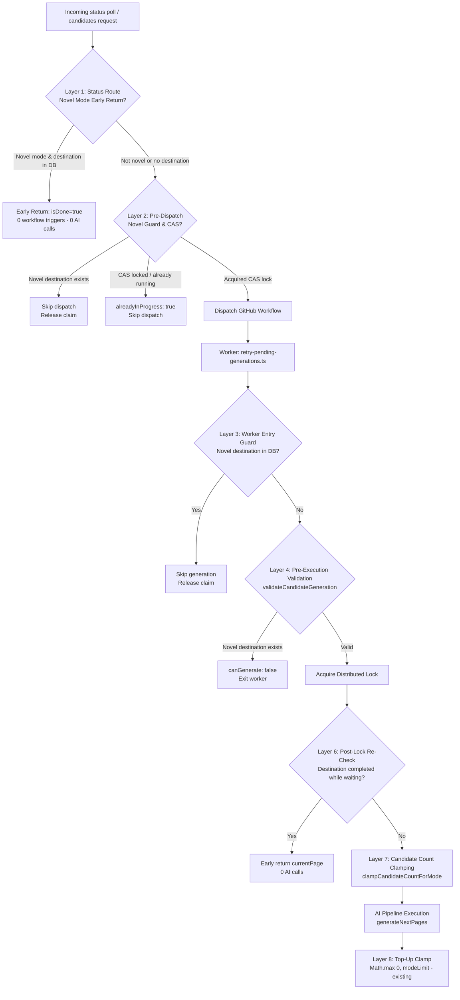
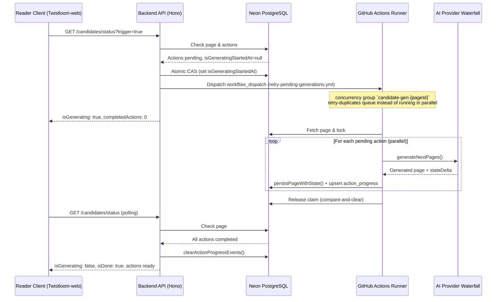
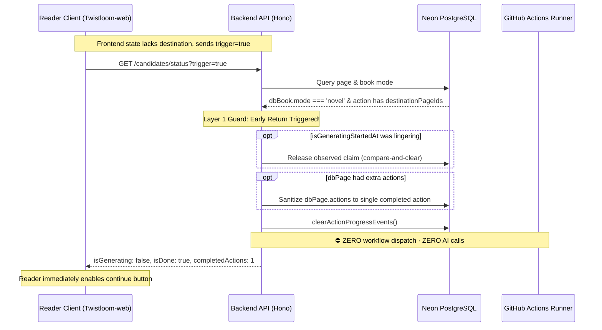

# Asynchronous Candidate Generation & Duplicate AI Generation Guardrails

**Status:** Current, implementation-accurate.  
**Companion document:** [`NEXT_PAGE_GENERATION_ARCHITECTURE.md`](./NEXT_PAGE_GENERATION_ARCHITECTURE.md) (covers the broader end-to-end sync + async story generation pipeline).

---

## 1. Overview

Twistloom pre-generates destination pages for choices before the reader clicks them, ensuring seamless, zero-latency transitions during story reading. However, generating branching candidates requires calling AI provider models (e.g., Mistral, Gemini, Cerebras, OpenRouter) and performing structured output extraction, evaluation, and database persistence.

Because serverless HTTP request lifecycles (such as Vercel serverless functions) enforce strict CPU and execution timeouts, heavy candidate pre-generation is decoupled from the HTTP request cycle and offloaded to an **asynchronous worker pipeline** powered by **on-demand GitHub Actions workflows**.

### The Cost of Duplicate AI Generation
AI generation is the single most expensive operation in the system in terms of:
- **Financial cost**: Provider token pricing for long narrative context, structured schemas, and evaluator passes.
- **Provider rate limits**: Concurrency and RPM ceilings across AI models.
- **Database & CPU overhead**: Complex psychological state calculations, pgvector embeddings, and branch persistence.

Consequently, the architecture employs **multi-layered guardrails** to prevent duplicate AI generations, redundant workflow triggers, and runaway polling loops—with specialized, zero-leak guarantees for strictly linear **Novel Mode** stories.

---

## 2. Technology Stack & Architecture Overview

```
┌────────────────────────────────────────────────────────────────────────┐
│                        FRONTEND READER CLIENT                          │
│     (Twistloom-web: useReaderPageSession · books-api.ts)               │
└───────────────────┬──────────────────────────────────▲─────────────────┘
                    │ 1. Poll /candidates/status       │ 4. Read-only poll status
                    │    (trigger=true on 1st contact) │    (with coalesce cache)
                    ▼                                  │
┌────────────────────────────────────────────────────────────────────────┐
│                    API LAYER (Hono on Bun / Vercel)                    │
│  • routes/books.ts: GET /candidates/status & GET /candidates (SSE)    │
│  • Novel Mode Early Return: immediate response if destination exists   │
│  • Coalesced Poll Cache: zero-DB short-circuit for read-only polling   │
│  • CAS Watermark: atomic isGeneratingStartedAt lock                    │
└───────────────────┬────────────────────────────────────────────────────┘
                    │ 2. workflow_dispatch API
                    │    (triggerCandidateGenerationWorkflow)
                    ▼
┌────────────────────────────────────────────────────────────────────────┐
│                    GITHUB ACTIONS RUNNER WORKFLOW                      │
│  • .github/workflows/retry-pending-generations.yml                     │
│  • Bun runtime on ubuntu-latest (30-minute execution budget)           │
│  • Runs: bun dist/cron/retry-pending-generations.js                    │
│  • Targeted inputs: book_id, page_id, triggered_by, max_depth          │
└───────────────────┬────────────────────────────────────────────────────┘
                    │ 3. Execute targeted page generation
                    ▼
┌────────────────────────────────────────────────────────────────────────┐
│               CANDIDATE ORCHESTRATION & GENERATION LAYER               │
│  • ensureCandidatesForPageWithStrategy() (strategy='cron', parallel)   │
│  • Distributed Lock: advisory lock per page                            │
│  • Post-lock destination re-check (prevents duplicate generation)      │
│  • AI Pipeline: generateNextPages -> executePromptForJSON -> Waterfall │
│  • Write-chain serialization for actions JSONB updates                 │
└───────────────────┬──────────────────────────────────┬─────────────────┘
                    │ Update destination               │ Upsert progress
                    ▼                                  ▼
┌────────────────────────────────────────────────────────────────────────┐
│                    PERSISTENCE LAYER (Neon PostgreSQL)                 │
│  • pages table: destinationPageIds[], isGeneratingStartedAt            │
│  • action_progress table: persistent per-action progress               │
└────────────────────────────────────────────────────────────────────────┘
```

### Core Technologies
- **API Runtime**: [Hono](https://hono.dev/) on Bun / Vercel serverless functions (TypeScript, native ESM).
- **Background Worker**: GitHub Actions runner (`ubuntu-latest`, Bun runtime, 30-minute timeout ceiling) triggered via `workflow_dispatch`.
- **Database**: Neon PostgreSQL accessed via [Drizzle ORM](https://orm.drizzle.team/) (`dbWrite` for mutations, `dbRead` for queries).
- **Progress Tracking**: Persistent PostgreSQL table (`action_progress`), eliminating fragile in-memory caches.
- **Client Protocol**: Lightweight HTTP polling with exponential backoff (`/candidates/status`) and optional Server-Sent Events (`/candidates`).

---

## 3. The Three-State Polling Machine

The primary frontend entry point is `GET /api/books/:identifier/:pageId/candidates/status` (`src/routes/books.ts`). It operates as a deterministic three-state machine (plus one transient combination, documented below the table):

| `isGenerating` | `isDone` | System Behaviour |
|:---:|:---:|---|
| **`false`** | **`true`** | **Complete**: All required actions have `destinationPageIds`. Returns completed actions and destination IDs. Clears stale `action_progress` rows in the database. |
| **`true`** | **`false`** | **In Progress**: Workflow is currently active (`isGeneratingStartedAt` is set and $< 30$ minutes old). Returns `isGenerating: true` with live per-action progress from the `action_progress` table. |
| **`false`** | **`false`** | **Needs Generation**: Page has pending actions and no active worker. Dispatches GitHub Actions workflow via `triggerCandidateGenerationWorkflow`, sets `isGeneratingStartedAt` atomically, and transitions to `isGenerating: true`. |

> **Transient fourth combination — `isGenerating: true` with `isDone: true`.** A status poll may report this for a few requests when its compare-and-clear release no-ops because another client's `?trigger=true` dispatched a fresh run in the read→update window. A run *is* genuinely in flight, so the response is truthful; it resolves to `false | true` as soon as that run's owner releases its claim (typically on the run's exit, or the next poll for a no-op run).

### Fast Read-Only Poll Coalescing
To prevent database query storms from concurrent polling clients, `candidates/status` implements an in-memory short-circuit coalescing cache (`src/utils/poll-coalesce.ts`). Unauthenticated or read-only polling requests (`trigger=false`) within the coalescing window receive cached status responses with zero database queries. Requests with `?trigger=true` bypass the coalescing cache to ensure immediate workflow dispatch evaluation.

---

## 4. Multi-Layer Duplicate AI Generation Guardrails

To eliminate duplicate AI generation leaks across API polling, background workers, and scheduled cron jobs, Twistloom enforces **8 strict defense-in-depth layers**:



---

### Layer 1: Status Endpoint Novel Mode Early Return (`src/routes/books.ts`)
**The Problem**: A reader visits a page in Novel mode where the destination was already created in the DB, but the frontend's local state does not yet possess `destinationPageIds`. The frontend sends `GET /candidates/status?trigger=true`. Without an early guard, the endpoint could initiate a background workflow or inline retry generation.

**The Solution**:
```typescript
if (dbBook.mode === 'novel') {
  const completedNovelAction = actions.find((a) => a.destinationPageIds?.length)
    ?? dbPage.actions?.find((a) => a.destinationPageIds?.length);
  if (completedNovelAction) {
    if (dbPage.isGeneratingStartedAt) {
      // Compare-and-clear: release only the claim we observed, never a fresher one.
      const released = await releaseGenerationClaim(dbPage.id, dbPage.isGeneratingStartedAt, 'GET /candidates/status');
      if (released) dbPage.isGeneratingStartedAt = null;
    }
    if (dbPage.actions.length > 1) {
      await dbWrite.update(pages).set({ actions: [completedNovelAction] }).where(eq(pages.id, dbPage.id));
    }
    void clearActionProgressEvents(pageIdStr);

    const novelDoneResponse: CandidateGenerationStatus = {
      isGenerating: false,
      completedActions: 1,
      totalActions: 1,
      actions: [completedNovelAction],
      actionProgress: [{
        action: completedNovelAction.text,
        status: 'completed',
        timestamp: new Date().toISOString(),
        destinationPageIds: completedNovelAction.destinationPageIds,
        source: completedNovelAction.source,
        customActionId: completedNovelAction.customActionId,
      }],
      startedAt: undefined,
      lastUpdated: (dbPage.updatedAt ?? new Date()).toISOString(),
    };
    setCoalesced(`cand:${userId ?? "anon"}:${pageIdStr}`, novelDoneResponse);
    return c.json(novelDoneResponse);
  }
}
```
- **Bypasses workflow dispatch completely**, even with `?trigger=true`.
- Releases lingering `isGeneratingStartedAt` claims **conditionally** (see [Claim Release Discipline](#claim-release-discipline-compare-and-clear)).
- Sanitizes multiple actions down to the 1 canon action with destination.
- Cleans up `action_progress` table.

---

### Layer 2: Pre-Dispatch Novel Guard & Atomic CAS Lock (`src/utils/candidate-generation.ts`)
Inside `triggerCandidateGenerationWorkflow`:
1. **Novel check**: Re-queries `dbBook.mode` and checks `dbPage.actions` for existing destinations before touching the GitHub API. If found, it releases the observed claim conditionally (compare-and-clear) and returns `{ success: true, alreadyInProgress: false }`.
2. **Compare-And-Set (CAS) Watermark**:
   ```typescript
   const updateResult = await dbWrite.update(pages)
     .set({ isGeneratingStartedAt: new Date() })
     .where(and(
       eq(pages.id, pageId),
       isNull(pages.isGeneratingStartedAt)
     ));

   if ((updateResult.rowCount ?? 0) === 0) {
     return { success: true, alreadyInProgress: true };
   }
   const claimedAt = isGeneratingStartedAt;
   ```
   Ensures that only **one single caller** can claim generation rights on a page across concurrent requests. Measured on the production driver (drizzle + `@neondatabase/serverless`): 6 concurrent CAS attempts on a single row produce exactly 1 winner, so the per-instance coalescing cache is dampening only — the DB is the source of truth.
3. **Conditional claim release**: if the GitHub dispatch fails, or an exception is thrown before dispatch completes, the caller releases **only** the claim it just took (`releaseGenerationClaim(pageId, claimedAt)`), leaving any claim taken by another dispatcher untouched. On success the claim is held until the worker releases it (Layer 6 / [Claim Release Discipline](#claim-release-discipline-compare-and-clear)).

> **Correction**: `tryAcquireWorkflowDispatchGate` is **not** part of this path. That gate (`src/services/book.ts`) guards *book-level* `on-demand-book-creation.yml` dispatches (`POST /api/books/async` and friends) against terminal/alive book-generation records. Candidate dispatch has no per-process rate gate; duplicate-dispatch suppression instead comes from the CAS above plus the workflow `concurrency` group (below).

---

### Claim Release Discipline (Compare-and-Clear)

`pages.isGeneratingStartedAt` is a mutual-exclusion watermark: it is **acquired** by the atomic CAS above and must be **released** with the same discipline. Every release goes through `releaseGenerationClaim(pageId, expectedClaim, context)`, which issues `UPDATE ... SET is_generating_started_at = NULL WHERE id = $1 AND is_generating_started_at = $2`.

An unconditional `SET ... = NULL WHERE id = $1` can erase a *fresher* claim taken by another dispatcher after the caller read the row — reopening the dispatch gate while a run is still in flight and producing a duplicate workflow run.

| Claim writer | Release point |
|---|---|
| Dispatcher (CAS in `triggerCandidateGenerationWorkflow`) | Dispatch failure / pre-dispatch error, novel-done short-circuit |
| Lock owner (`ensureCandidatesForPageWithStrategy`) | Final cleanup write, plus `.finally()` on every exit path (success, early return, thrown error) — **retried once** on error (see below) |
| Poll route (novel-done branch in `src/routes/books.ts`) | The claim observed in that request |
| Cron (`src/cron/retry-pending-generations.ts`) | Per-page claim observed at processing start (`cleanupGeneratingStartedAt`) |
| Stuck reset (`checkAndResetStuckGeneration`, 30-minute backstop) | Age-conditioned claim observed in the same read |

Because the release is a conditional no-op when the value has changed hands, cleanup passes are **idempotent**: a second pass matches nothing.

#### Release classification & failure handling

- **Claim reads are pinned to the primary.** Every value that is later used as the compare-and-clear operand is read through `dbWrite` — `validateAndRetrievePageForGeneration`, the dispatch CAS read, the lock body's re-read, `retryPendingGenerations`, and `processSpecificPage`. A replica-served `NULL` would make the release miss and strand a live claim.
- **A 0-row release is classified, not assumed.** The helper re-reads the column (best-effort, never throws): `already released elsewhere` when it is `NULL`, `changed hands` when it holds a different timestamp. Only the latter signals a real takeover / duplicate-dispatch risk, so the logs can be trusted during an incident.
- **Errors never break the caller.** A failed release must not abort a run that already persisted its pages: the lock owner keeps `withLock`'s result intact and retries once after `CLAIM_RELEASE_RETRY_DELAY_MS` (500 ms) before giving up.

#### Self-heal ladder

If a release is ultimately lost (error on both attempts, process killed mid-write), the claim clears itself in escalating order:

1. **Immediate retry** — the lock owner's second attempt (`releaseOwnGenerationClaim`), covering transient DB errors.
2. **Next status poll** — a *done* page reaches `checkAndResetStuckGeneration`, whose compare-and-clear matches the current claim and releases it on the spot.
3. **Cron cleanup** — `cleanupGeneratingStartedAt` releases the claim observed at processing start for every page the run touched.
4. **30-minute backstop** — `cleanupStuckGenerations` / `checkAndResetStuckGeneration` clear any claim older than `MAX_GENERATION_DURATION_MS`.

Steps 2–4 are what bound the one gap cron cleanup cannot close on its own: it knows only the *pre-run* claim, never the timestamp the lock owner wrote during the run.

**Workflow-level dedupe**: `dispatchGitHubWorkflow` (`src/utils/github-workflow.ts`) retries transient HTTP failures (network error, 429, 502/503/504), so a single page can be dispatched more than once. `.github/workflows/retry-pending-generations.yml` therefore sets:

```yaml
concurrency:
  group: candidate-gen-${{ github.event.inputs.page_id || github.run_id }}
  cancel-in-progress: false
```

Concurrent runs for the same page are **queued, never cancelled**, so an in-flight generation is never killed mid-flight, and GitHub's one-pending-run rule drops the extra copy. Scheduled runs carry no `page_id` and fall back to `github.run_id`, so they never block or cancel on-demand runs.

---

### Layer 3: Background Worker Entry Guards (`src/cron/retry-pending-generations.ts`)
When the GitHub Actions runner boots up:
- In `processSpecificPage`: Checks `if (dbBook?.mode === 'novel' && dbPage.actions?.some(a => a.destinationPageIds?.length))` and exits immediately, releasing the observed `isGeneratingStartedAt` claim conditionally (compare-and-clear).
- In `processPageGeneration`: Validates before candidate generation that novel pages with destinations are marked finished (`pendingAfter: 0`).

---

### Layer 4: Pre-Execution Validation Functions (`src/utils/candidate-generation.ts`)
- **`validateCandidateGeneration`**:
  ```typescript
  if (currentBook.mode === 'novel' && page.actions.some(action => action.destinationPageIds?.length)) {
    return {
      canGenerate: false,
      reason: 'Novel mode already has completed destination',
      book: currentBook,
      pendingActions: [],
      currentDepth,
      maxDepth
    };
  }
  ```
- **`validatePageForJobEnqueue`**: Returns `canEnqueue: false` if novel destination exists.
- **`getPendingActionsCount` & `hasPendingCandidates`**: Returns `0` pending actions for completed novel pages.

---

### Layer 5: Distributed Locking & Post-Lock Re-Check (`src/utils/candidate-generation.ts`)
In `ensureCandidatesForPageWithStrategy`:
1. Acquires a PostgreSQL advisory/transaction lock on `pageId` (`withLock`).
2. **Post-lock re-check**: While waiting for the lock, another worker or concurrent step may have completed the page. Re-checks:
   ```typescript
   if (currentBook.mode === 'novel' && initialDBActions.some(action => action.destinationPageIds?.length)) {
     if (currentDBPage.isGeneratingStartedAt) {
       await releaseGenerationClaim(page.id, currentDBPage.isGeneratingStartedAt, 'ensureCandidatesForPageWithStrategy');
     }
     return currentPage; // Return without calling AI
   }
   ```
   Releases the claim observed at lock entry — never a fresher claim taken after that read.

---

### Layer 6: Destination Limit & Top-Up Math Clamping (`src/utils/candidate-generation.ts`)
When candidate pre-generation runs:
- **Pre-generation clamping**: Requests are clamped via `clampCandidateCountForMode(mode, count)`:
  - `novel`: max 1 destination
  - `interactive`: max 1 destination per choice
  - `multiverse`: up to `MAX_CANDIDATE_PAGE_PER_ACTION`
- **Top-up calculation**: If an action already has some destinations and needs a top-up:
  ```typescript
  const modeLimit = clampCandidateCountForMode(currentBook.mode, limit);
  const needed = Math.max(0, Math.min(limit - existing.length, modeLimit - existing.length));
  ```
  If `needed <= 0` (e.g., novel mode with `existing.length >= 1`), top-up generation is skipped completely.

---

### Layer 7: Page Enrichment Sanitization (`src/services/book.ts`)
In `mapToEnrichedPage`:
- Sanitizes `canonActions` for novel mode to exactly 1 action (preferring the completed action with destinations).
- Sets `hasIncompleteActions = !canonActions[0]?.destinationPageIds?.length`.
- Guarantees `originalActionsCount: 1`, preventing frontend hooks from erroneously believing additional actions are missing.

---

### Layer 8: Frontend Polling Lifecycle (`Twistloom-web/src/lib/hooks/reader/useReaderPageSession.ts`)
- **Poll termination (`allActionsAvailable`)**: In novel mode, `currentActionsLength >= 1` halts polling immediately without waiting for extra actions.
- **Retry loop suppression (`stillMissing`)**: In novel mode, `stillMissing = (succeededCount === 0)`. Having 1 resolved destination halts retries without triggering the 3-attempt retry loop.
- **Tab visibility re-hydration**: Respects novel mode single-destination expectations when waking from background.

---

## 5. Persistent Progress Tracking

Rather than using ephemeral in-memory caches (which fail across serverless instances and cold starts), progress is tracked via the **`action_progress`** PostgreSQL table (`src/db/schema.ts`):

```sql
CREATE TABLE action_progress (
  id                   UUID PRIMARY KEY DEFAULT gen_random_uuid(),
  page_id              UUID NOT NULL REFERENCES pages(id) ON DELETE CASCADE,
  action_text          TEXT NOT NULL,
  status               TEXT NOT NULL DEFAULT 'started',
  destination_page_ids TEXT[] NOT NULL DEFAULT ARRAY[]::text[],
  error                TEXT,
  started_at           TIMESTAMPTZ,
  completed_at         TIMESTAMPTZ,
  created_at           TIMESTAMPTZ DEFAULT now(),
  updated_at           TIMESTAMPTZ DEFAULT now(),
  CONSTRAINT action_progress_page_action_unique UNIQUE(page_id, action_text)
);
```

### Key Progress Operations (`src/utils/progress-tracking.ts`)
1. **`storeActionProgressEvent(pageId, event)`**: Upserts status (`started`, `completed`, `failed`) and destination IDs for `(pageId, actionText)`.
2. **`getActionProgressEvents(pageId)`**: Reads current progress events for all actions on the page.
3. **`clearActionProgressEvents(pageId)`**: Deletes progress rows once all destinations are persisted and `isDone` is reached.

---

## 6. Execution Strategies & Concurrency

Orchestrated by `ensureCandidatesForPageWithStrategy`:

| Strategy | Concurrency | Timeout | Context |
|---|---|---|---|
| **`cron`** | **Parallel** (`generateCandidatesInParallel`) | 13 minutes (`MAX_GENERATION_PARALLEL_DURATION_MS`) | GitHub Actions workflow runner (`retry-pending-generations.ts`) |
| **`github-action`** | **Sequential** (per-action loop) | 30 minutes (`MAX_GENERATION_DURATION_MS`) | Batch cron-originals generation |
| **`vercel`** | **Parallel** | $\le 240$ seconds | Legacy fallback for direct execution |

### Write-Chain Serialization
When `generateCandidatesInParallel` completes candidates for multiple actions concurrently, simultaneous database writes to the page's JSONB `actions` column could result in lost updates. Candidate generation uses an in-memory sequential write chain (`onActionProgress`) that serializes database updates sequentially through a shared promise queue.

---

## 7. GitHub Actions Workflow Runner

The workflow runs on GitHub Actions under `.github/workflows/retry-pending-generations.yml`:

```yaml
name: Actions Candidate Generations

on:
  schedule:
    - cron: '0 */12 * * *' # Every 12 hours routine cleanup
  workflow_dispatch:      # On-demand dispatch from backend API
    inputs:
      book_title:
        description: 'Title of the book to retry generation for'
        required: false
        type: string
      book_id:
        description: 'ID of the book to retry generation for'
        required: false
        type: string
      page_id:
        description: 'ID of the specific page to retry generation for'
        required: false
        type: string
      triggered_by:
        description: 'User ID who triggered the workflow'
        required: false
        type: string
      max_depth:
        description: 'Maximum depth to pre-generate candidates'
        required: false
        type: number

jobs:
  retry-pending-generations:
    name: ${{ inputs.book_title != '' && format('Candidate Generations for {0}', inputs.book_title) || 'Routine Candidate Generations' }}
    runs-on: ubuntu-latest
    timeout-minutes: 30
    steps:
      - uses: actions/checkout@v4
      - uses: oven-sh/setup-bun@v2
        with:
          bun-version: latest
      - run: bun install --frozen-lockfile
      - run: bun run build
      - run: bun dist/cron/retry-pending-generations.js
        env:
          TRIGGERED_BOOK_ID: ${{ github.event.inputs.book_id || '' }}
          TRIGGERED_PAGE_ID: ${{ github.event.inputs.page_id || '' }}
          TRIGGERED_BY_USER: ${{ github.event.inputs.triggered_by || '' }}
          TRIGGERED_MAX_DEPTH: ${{ github.event.inputs.max_depth || '' }}
          DATABASE_URL: ${{ secrets.DATABASE_URL }}
          NODE_ENV: production
```

---

## 8. Sequence Diagrams

### Standard Pre-Generation Flow


### Novel Mode Early Return (Duplicate Generation Guard)


---

## 9. Key File Reference

| Purpose | File | Key Functions / Entities |
|---|---|---|
| **Status Polling Route** | `src/routes/books.ts` | `GET /:identifier/:pageId/candidates/status`, novel mode early return, coalescing |
| **SSE Candidates Route** | `src/routes/books.ts` | `GET /:identifier/:pageId/candidates`, early completion check |
| **Workflow Dispatcher** | `src/utils/candidate-generation.ts` | `triggerCandidateGenerationWorkflow`, atomic CAS watermark |
| **Candidate Orchestration** | `src/utils/candidate-generation.ts` | `ensureCandidatesForPageWithStrategy`, post-lock re-checks, mode enforcement |
| **Validation Gates** | `src/utils/candidate-generation.ts` | `validateCandidateGeneration`, `validatePageForJobEnqueue`, `getPendingActionsCount` |
| **Candidate Generation Core** | `src/utils/candidate-generation.ts` | `generateCandidatePages`, top-up clamping formula |
| **Progress Tracking** | `src/utils/progress-tracking.ts` | `storeActionProgressEvent`, `getActionProgressEvents`, `clearActionProgressEvents` |
| **Database Schema** | `src/db/schema.ts` | `pages.isGeneratingStartedAt`, `action_progress` table definition |
| **Worker / Cron Runner** | `src/cron/retry-pending-generations.ts` | `processSpecificPage`, `processPageGeneration`, novel mode guardrails |
| **GitHub Workflow Spec** | `.github/workflows/retry-pending-generations.yml` | Bun runtime, `workflow_dispatch` inputs, 30-minute ceiling |
| **Frontend Reader Hook** | `Twistloom-web/.../useReaderPageSession.ts` | Polling loop, `allActionsAvailable`, `stillMissing` novel logic |
