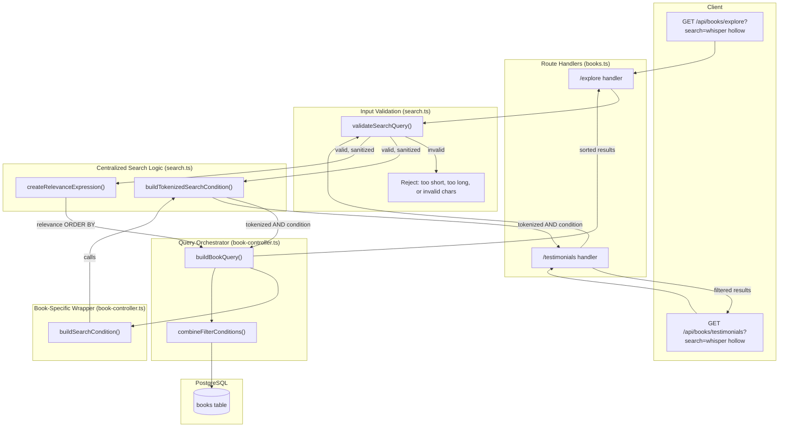

# Search Architecture

## Overview

The backend search system provides **tokenized word-boundary‑aware matching** across book metadata fields. It converts a user's search query into a SQL `WHERE` clause (to filter results) and an `ORDER BY` expression (to rank them by relevance). Both the filter and the scorer are built from the same tokenization strategy so they stay consistent.

### Core Design Principle

> **Tokenize the query into individual words → each word must match at least one field (AND) → score based on how many words match which fields.**

This solves the key limitation of a naive `ILIKE '%full query%'`: searching **"whisper hollow"** now matches **"Whispers of Black Hollow"** because `"whisper"` matches `"Whispers"` and `"hollow"` matches `"Hollow"` independently.

---

## Data Flow



---

## Component Breakdown

### 1. Input Validation — `validateSearchQuery()`

**File:** `src/utils/search.ts:82`

Every user‑supplied search string passes through this gate before reaching any query builder.

```typescript
export function validateSearchQuery(searchQuery: string): ValidationResult {
  if (!searchQuery || typeof searchQuery !== 'string') {
    return { isValid: false, error: 'Search query must be a non-empty string' };
  }

  const trimmed = searchQuery.trim();

  if (trimmed.length < MIN_SEARCH_LENGTH) {      // 2 chars
    return { isValid: false, error: `Search query must be at least ${MIN_SEARCH_LENGTH} characters` };
  }

  if (trimmed.length > MAX_SEARCH_LENGTH) {       // 200 chars
    return { isValid: false, error: `Search query cannot exceed ${MAX_SEARCH_LENGTH} characters` };
  }

  const sanitized = sanitizeText(trimmed);        // strips HTML, control chars

  if (sanitized.length < MIN_SEARCH_LENGTH) {
    return { isValid: false, error: 'Search query contains invalid characters' };
  }

  return { isValid: true, sanitized };
}
```

| Check | Limit | Rationale |
|---|---|---|
| Min length | 2 chars | Avoid meaningless single‑character scans |
| Max length | 200 chars | Prevent abuse / overly expensive `ILIKE` patterns |
| Sanitize | `sanitizeText()` | Strip HTML/control characters before hitting the DB |

---

### 2. Tokenized Search Condition — `buildTokenizedSearchCondition()`

**File:** `src/utils/search.ts:630`

This is the **centralized function** that both endpoints use. It decouples the tokenization/AND‑wrapping logic from the specific fields being searched.

```typescript
export function buildTokenizedSearchCondition(
  search: string,     // already sanitized
  fields: any[],      // SQL column references or expressions
): SQL | null {

  // 1. Tokenize — split on whitespace
  const tokens = search.trim().split(/\s+/).filter(Boolean);
  if (tokens.length === 0) return null;

  // 2. For each token, build an OR across all fields with ILIKE
  const tokenConditions = tokens.map(token => {
    const pattern = `%${token}%`;
    return or(
      ...fields.map(field => sql`${field} ILIKE ${pattern}`)
    );
  });

  // 3. AND all token conditions together
  return and(...tokenConditions) ?? null;
}
```

#### How it transforms the query

| Input | SQL Produced |
|---|---|
| `"whisper"` | `(title ILIKE '%whisper%' OR hook ILIKE '%whisper%')` |
| `"whisper hollow"` | `(title ILIKE '%whisper%' OR ...) AND (title ILIKE '%hollow%' OR ...)` |
| `"the old house"` | `(... '%the%') AND (... '%old%') AND (... '%house%')` |

#### Why this approach?

- **Word‑order independent** — `"hollow whisper"` finds the same books as `"whisper hollow"`.
- **Cross‑word‑boundary matching** — `"whisper"` matches `"Whispers"` (ILIKE is substring‑aware).
- **No extension dependency** — uses only standard PostgreSQL `ILIKE`; works on any Postgres version.
- **Predictable** — users intuitively understand "each word I type must appear somewhere in the result".

---

### 3. Book‑Specific Wrapper — `buildSearchCondition()`

**File:** `src/services/book-controller.ts:444`

A thin wrapper over `buildTokenizedSearchCondition` that knows which columns the `books` table exposes.

```typescript
export function buildSearchCondition(search?: string) {
  if (!search) return null;

  return buildTokenizedSearchCondition(search, [
    books.title,
    books.hook,
    books.summary,
    sql`array_to_string(${books.keywords}, ' ')`,  // text[] → flat string
  ]);
}
```

**Why `array_to_string` for keywords?**  
`books.keywords` is a `text[]` column; `ILIKE` cannot be applied to an array directly. Flattening with `array_to_string` lets a single token like `"thriller"` match any keyword in the array.

---

### 4. Relevance Scoring — `createRelevanceExpression()`

**File:** `src/utils/search.ts:662`

While the `WHERE` clause decides *which* books to return, the `ORDER BY` decides *in what order*. The scorer assigns higher weight to matches in more important fields and rewards queries that match *more* tokens.

```typescript
export function createRelevanceExpression(query: string, booksTable: any): any {
  if (!query) return sql`0`;

  const tokens = query.trim().split(/\s+/).filter(Boolean);
  if (tokens.length === 0) return sql`0`;

  const numTokens = tokens.length;

  const tokenExpressions = tokens.map(token => {
    const lowerToken = token.toLowerCase();
    return sql`
      CASE
        WHEN LOWER(${booksTable.title}) = ${lowerToken} THEN ${(0.35 / numTokens)}::real
        WHEN ${booksTable.title} ILIKE ${'%' + token + '%'} THEN ${(0.20 / numTokens)}::real
        ELSE 0::real
      END +
      CASE
        WHEN LOWER(${booksTable.hook}) = ${lowerToken} THEN ${(0.15 / numTokens)}::real
        WHEN ${booksTable.hook} ILIKE ${'%' + token + '%'} THEN ${(0.10 / numTokens)}::real
        ELSE 0::real
      END +
      CASE
        WHEN EXISTS (
          SELECT 1 FROM unnest(${booksTable.keywords}) AS kw
          WHERE LOWER(kw) = ${lowerToken}
        ) THEN ${(0.12 / numTokens)}::real
        WHEN EXISTS (
          SELECT 1 FROM unnest(${booksTable.keywords}) AS kw
          WHERE kw ILIKE ${'%' + token + '%'}
        ) THEN ${(0.08 / numTokens)}::real
        ELSE 0::real
      END +
      CASE
        WHEN ${booksTable.summary} ILIKE ${'%' + token + '%'} THEN ${(0.08 / numTokens)}::real
        ELSE 0::real
      END
    `;
  });

  return sql`${sql.join(tokenExpressions, sql` + `)}`;
}
```

#### Scoring Weights (per token)

| Field | Exact Match | Substring Match |
|---|---|---|
| **Title** | 0.35 ÷ n | 0.20 ÷ n |
| **Hook** | 0.15 ÷ n | 0.10 ÷ n |
| **Keywords** | 0.12 ÷ n | 0.08 ÷ n |
| **Summary** | — | 0.08 ÷ n |

*(n = number of tokens)*

#### Why weight division by token count?

**Single‑token queries** produce the exact same scores as the legacy implementation (backward compatible). **Multi‑token queries** distribute the weight so that a book matching *all* tokens in *important* fields scores higher than one matching only one token. For example, searching `"dark forest"`:

| Book | Token matches | Score |
|---|---|---|
| *"The Dark Forest"* | `dark`→title + `forest`→title | 0.20 ÷ 2 + 0.20 ÷ 2 = **0.20** |
| *"Darkness Falls"* | `dark`→title only | 0.20 ÷ 2 = **0.10** |
| *"Forest of Shadows"* | `forest`→title only | 0.20 ÷ 2 = **0.10** |

The book matching both tokens ranks highest.

---

### 5. Explore Route — Full Orchestration

**File:** `src/routes/books.ts:1736`

The `/explore` endpoint ties validation, filtering, scoring, and pagination together through `buildBookQuery`.

```typescript
router.get("/explore", optionalAuth, async (c) => {
  // ── 1. Extract + validate ─────────────────────────────────────────────────
  const { search, sortBy, language, tags, ageRange, gender, mode, ... } = extractPaginationParams(c.req.query());
  const userId = c.get("userId") || null;

  let sanitizedSearch: string | undefined;
  if (search) {
    const validation = validateSearchQuery(search);
    if (!validation.isValid) {
      return cValidationError(c, validation.error);
    }
    sanitizedSearch = validation.sanitized;
  }

  // ... validate language, ageRange, gender, mode, sortBy ...

  // ── 2. Build base query ────────────────────────────────────────────────────
  const baseSelect = getEnrichedBookSelect(userId, c.get("headerLanguage"));
  const baseQuery = dbRead
    .select(sanitizedSearch
      ? { ...baseSelect, relevanceScore: createRelevanceExpression(sanitizedSearch, books) }
      : baseSelect)
    .from(books)
    .leftJoin(users, eq(books.userId, users.userId));

  // ── 3. Delegate to orchestrator ────────────────────────────────────────────
  const { query, countQuery } = buildBookQuery({
    baseQuery,
    baseCondition,
    search: sanitizedSearch,    // → buildSearchCondition → buildTokenizedSearchCondition
    bookSortBy,
    tags: tagsArray,
    language: sanitizedLanguage,
    lastUpdated,
    minAge,
    maxAge,
    gender: sanitizedGender,
    mode: sanitizedMode,
    currentUserId: userId,
  });

  // ── 4. Paginate + respond ─────────────────────────────────────────────────
  const [totalCountResult] = await countQuery;
  const offset = (page - 1) * limit;
  const booksResult = await query.limit(limit).offset(offset);
  const pagination = calculatePaginationMeta(page, limit, totalCount);
  return c.json(createPaginatedResponse(booksResult, pagination, 'books'));
});
```

The orchestrator `buildBookQuery` (defined at `book-controller.ts:485`) composes filter conditions, applies book‑specific sorting (popular, trending, for‑you, etc.), and conditionally appends the relevance `ORDER BY` when a search is present.

---

### 6. Testimonials Route — Direct Usage

**File:** `src/routes/books.ts:4914`

The `/testimonials` endpoint calls `buildTokenizedSearchCondition` directly with its own set of fields (book title + testimonial content).

```typescript
router.get("/testimonials", requireAuth, async (c) => {
  const userId = c.get("userId")!;
  const { limit, page } = extractPaginationParams(c.req.query());
  const search = c.req.query().search as string | undefined;

  const conditions = [eq(bookTestimonials.userId, userId)];

  if (search) {
    const validation = validateSearchQuery(search);
    if (!validation.isValid) {
      return cValidationError(c, `Invalid search: ${validation.error}`);
    }
    const searchCondition = buildTokenizedSearchCondition(validation.sanitized!, [
      books.title,
      bookTestimonials.content,
    ]);
    if (searchCondition) {
      conditions.push(searchCondition);
    }
  }

  const rows = await dbRead
    .select({ ... })
    .from(bookTestimonials)
    .leftJoin(books, eq(bookTestimonials.bookId, books.id))
    .where(and(...conditions))
    .orderBy(desc(bookTestimonials.createdAt))
    .limit(limit)
    .offset(offset);

  // ... pagination + response
});
```

---

## DRY Architecture

All search‑condition logic lives in a single function (`buildTokenizedSearchCondition` in `src/utils/search.ts`). Callers pass different field arrays depending on the context:

```
src/utils/search.ts
├── validateSearchQuery()          ← input gate
├── buildTokenizedSearchCondition() ← SHARED: tokenize + AND/OR + ILIKE
└── createRelevanceExpression()    ← SHARED: per-token relevance scoring

src/services/book-controller.ts
└── buildSearchCondition()         ← wrapper: books.* fields → delegates to buildTokenizedSearchCondition

src/routes/books.ts
├── /explore handler               ← uses buildSearchCondition + createRelevanceExpression via buildBookQuery
└── /testimonials handler          ← calls buildTokenizedSearchCondition directly
```

To change the matching strategy (e.g. switch to `pg_trgm`, add stemming, change tokenizer), you edit only `src/utils/search.ts`. Both endpoints inherit the change.

---

## Database Index Considerations

| Column | Type | Index | Supports |
|---|---|---|---|
| `books.title` | `text` | GIN (`pg_trgm` ops) | `ILIKE` with leading wildcards |
| `books.hook` | `text` | GIN (`pg_trgm` ops) | `ILIKE` with leading wildcards |
| `books.summary` | `text` | GIN (`pg_trgm` ops) | `ILIKE` with leading wildcards |
| `books.keywords` | `text[]` | GIN (default ops) | `array_overlaps`, `@>` |
| `bookTestimonials.content` | `text` | (none yet) | Sequential scan (acceptable at current scale) |

The GIN indexes with `pg_trgm` operator class allow PostgreSQL to use index scans for `ILIKE '%pattern%'` queries (normally not index‑accelerated). This is configured in the database schema (`src/db/schema.ts:435`).

> **Note:** `ILIKE` with leading wildcards (`%pattern`) cannot use a standard B‑tree index. The `pg_trgm` GIN index converts this to a trigram lookup, which is significantly faster than a sequential scan on large tables.

---

## Trade-offs & Alternatives Considered

| Approach | Pros | Cons | Verdict |
|---|---|---|---|
| **Tokenized AND + ILIKE** *(current)* | No deps, predictable, word‑order independent | No typo tolerance | ✅ **Chosen** |
| `pg_trgm` `word_similarity()` | Typo‑tolerant, handles word boundaries | Requires extension, more complex SQL | 🔄 Future option |
| PostgreSQL full‑text search (`tsvector`/`tsquery`) | Stemming, ranking, fast | No partial‑word matching, needs tsvector column + trigger | ❌ Overkill for book titles |
| Naive `ILIKE '%query%'` *(legacy)* | Simplest possible | Fails on cross‑word‑boundary searches | ❌ Replaced |

The tokenized AND approach hits the sweet spot: it solves the real user problem ("whisper hollow" → "Whispers of Black Hollow") with zero new infrastructure and predictable performance.
