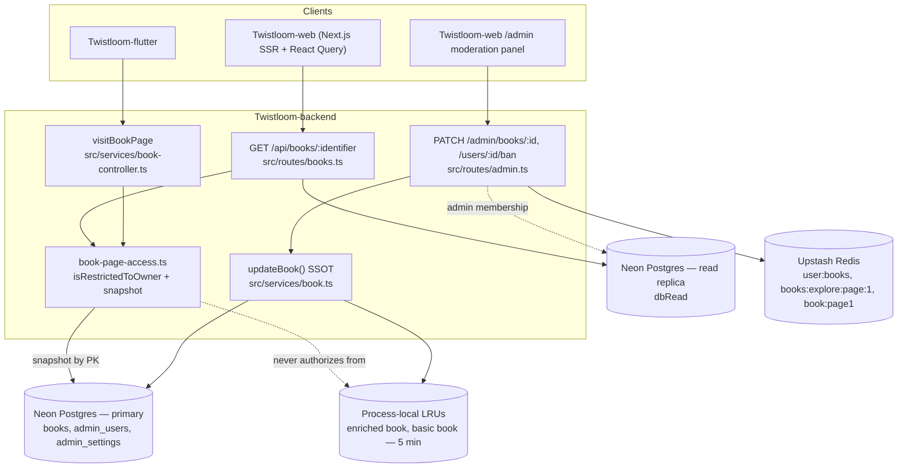
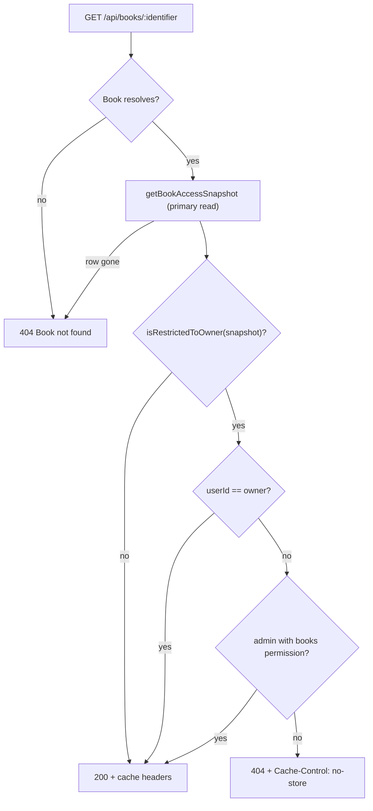

# Book Access & Admin Moderation Architecture

> Living architecture document · Twistloom Backend · 2026-10-01
> Scope: how a book's read permission is decided (reader page surface, book detail surface, admin bypass) and how admin moderation propagates through every cache tier.
> Status: **Implemented & verified** · last verified against the working tree on 2026-10-01
> Anchor contract: source files cite this document's `§N` sections in their
> doc comments — see the Section Anchor Map at the end. Renumbering requires
> updating those comments in the same change.
> Companion: [BOOK_EXPLORE_FILTER_SORTING_ARCHITECTURE.md](./BOOK_EXPLORE_FILTER_SORTING_ARCHITECTURE.md) · [BRANCH_TRAVERSAL_ARCHITECTURE.md](./BRANCH_TRAVERSAL_ARCHITECTURE.md) · [MIDDLEWARE_ARCHITECTURE.md](./MIDDLEWARE_ARCHITECTURE.md)

---

## Table of Contents

1. [Executive Summary & Design Rationale](#1-executive-summary--design-rationale)
2. [System Boundaries & Overview Diagram](#2-system-boundaries--overview-diagram)
3. [Key Architectural Invariants](#3-key-architectural-invariants)
4. [Deep Dive / How It Works](#4-deep-dive--how-it-works)
5. [Failure Modes & Recovery Matrix](#5-failure-modes--recovery-matrix)
6. [Industry Standard Comparison](#6-industry-standard-comparison)
7. [File Map & Ownership](#7-file-map--ownership)
8. [Verification & Evidence](#8-verification--evidence)
9. [FAQ](#9-faq)
10. [Known Gaps & Future Enhancements](#10-known-gaps--future-enhancements)
11. [Section Anchor Map & Related Documents](#11-section-anchor-map--related-documents)

---

## 1. Executive Summary & Design Rationale

### 1a. Summary

Twistloom books carry two policy fields — `status` (`draft`/`active`/`archived`) and `visibility` (`public`/`unlisted`/`followers`/`private`) — and two read surfaces must agree on who may read them: the **reader page surface** (`visitBookPage`, which can record visits and spend credits) and the **book detail surface** (`GET /api/books/:identifier`, which feeds the SEO detail page, the Pen editor bootstrap, the generation tracker, and the web admin moderation panel). Both surfaces are authorized by a single predicate, `isRestrictedToOwner()`, evaluated against an **authoritative primary read** (`getBookAccessSnapshot()`) rather than the process-local enriched LRU projection. Admin moderation (`PATCH /admin/books/:id`, ban takedowns) writes through the same `updateBook()` SSOT an author edit uses and then refreshes every distributed cache layer. Status codes differ per surface by contract (401/403 on the page surface, 404 on the detail surface) — see §4.3 and §4.6. Cross-instance staleness of *non-authorization* display fields is deliberately accepted (§10).

### 1b. Design rationale

| Element | Decision / alternative / why / cost |
|---|---|
| **Authorization source of truth** | **Authoritative primary read by primary key** (`getBookAccessSnapshot`, `src/services/book-page-access.ts:67`). *Alternative:* authorize from `getEnrichedBook()`'s LRU projection — process-local, 5-minute TTL, and populated through the read replica. *Why it wins:* AGENTS.md §3.1 forbids process-local LRU from coordinating globally-relevant state, and a moderation that only lands on the instance that wrote it is a privacy hole at 10M-user scale (a book made private must stop being readable immediately, on every instance). *Cost accepted:* one indexed single-row query on every page visit and detail request. |
| **One policy, two surfaces** | **Shared predicate `isRestrictedToOwner()`** (`src/services/book-page-access.ts:39`) consumed by both gates. *Alternative:* a predicate per route. *Why it wins:* AGENTS.md §1.7 — duplicated policy is a divergence bug waiting to happen; drafts are handled in exactly one documented way. *Cost accepted:* the predicate cannot encode surface-specific nuances (e.g. draft handling) — status codes stay surface-local instead. |
| **Detail-surface denial: 404** | **404 with `Cache-Control: no-store`** for restricted books to non-owners/non-admins. *Alternative:* 401/403, matching the page surface. *Why it wins:* both clients treat 401/403 as *session* failures — web signs the user out app-wide on any client 401 (`Twistloom-web/src/lib/services/api.ts`, consumed by `AuthProvider`), Flutter's `AuthInterceptor` refreshes and can redirect to `/login/recovery`. 404 is inert on both and does not confirm existence to strangers. *Cost accepted:* a missing book and a forbidden book are indistinguishable to API consumers. |
| **Page-surface denial: keep 401/403** | The reader contract already shipped that way (401 anonymous → "log in", 403 authenticated non-owner). *Why not unify on 404:* changing it would break readers who depend on the "log in to continue" affordance, for no client-safety gain (the page surface is only reached through a resolved page, and its responses are never cached). |
| **Moderation writes through `updateBook()`** | **SSOT path** (`src/routes/admin.ts:2276` → `src/services/book.ts:1165`). *Alternative:* a direct `dbWrite.update(books)`. *Why it wins:* `updateBook` already refreshes the enriched LRU (id + old slug + new slug), the basic book LRU, and the distributed page-1 payload, plus slug auto-assignment and follower publish notifications — a hand-rolled update bypasses all of it (the exact bug class documented in AGENTS.md §3.9). *Cost accepted:* admin moderation inherits author-edit side effects; that inheritance is the point. |
| **Ban policy read is fail-loud** | `getBanPolicy()` (`src/services/admin-settings.ts:102`) returns `{ ok: false }` instead of substituting defaults. *Alternative:* reuse `getAdminSettingsMap()` which fails open. *Why it wins:* on an enforcement path, silently defaulting `ban.hide_books` to `false` means content that an administrator configured to be hidden stays public after a ban. *Cost accepted:* callers must branch on `ok` and surface `settingsUnresolved`. |

**Non-goals:** this document does not cover Explore ranking/filtering (see [BOOK_EXPLORE_FILTER_SORTING_ARCHITECTURE.md](./BOOK_EXPLORE_FILTER_SORTING_ARCHITECTURE.md)), page-level credit gating, or trust-and-safety ledger mechanics beyond the ban takedown path.

---

## 2. System Boundaries & Overview Diagram

Authority sits in the **backend route/service layer**, backed by the **primary Postgres connection** for authorization decisions and **Upstash Redis** for shared (cross-instance) caches. Process-local LRUs are display-tier only: they may serve stale titles for up to 5 minutes, but they never decide who can read a book.

**Must own:** read-authorization decisions, moderation writes, and cache invalidation fan-out. **Must not own:** content ranking (Explore), credits (`executeWithCredits`), or session authentication (global auth middleware, `src/middleware/nextauth.ts`).

---

## 3. Key Architectural Invariants

1. **Authorization reads the primary.** Every read-authorization decision is made against `getBookAccessSnapshot()`'s single-row primary-key read on `dbWrite` — never against `getEnrichedBook()`'s LRU projection and never against `dbRead` (`src/services/book-page-access.ts:67`).
2. **One policy predicate.** `isRestrictedToOwner()` is the only expression of "owner-only book" (`archived` OR `private`); both surfaces consume it (`src/services/book-page-access.ts:39`).
3. **Detail denial is a 404 and is never cacheable.** Restricted books answer `404` + `Cache-Control: no-store` to non-owners/non-admins (`src/routes/books.ts:9345-9349`); 200 responses for restricted books are `Cache-Control: private, no-store` (`src/routes/books.ts:9375-9376`).
4. **Page denial keeps the shipped 401/403 contract.** Anonymous → `401`, authenticated non-owner → `403`, evaluated *before* visit persistence or credit processing (`src/services/book-controller.ts:1198-1203`).
5. **Admin bypass requires the `books` capability.** `resolveAdminAccess()` + `adminHasPermission(access, "books")` — super-admin passes unconditionally (`src/services/book-page-access.ts:176`, `src/middleware/admin-auth.ts:95`).
6. **Moderation is not a parallel mutation path.** `PATCH /admin/books/:id` writes through `updateBook()` and then invalidates the author list and Explore page-1 and notifies the forum feed (`src/routes/admin.ts:2281-2304`).
7. **Enum bodies are structurally validated.** Admin PATCH/ban bodies are parsed as `unknown` and checked with `isBookStatus` / `isBookVisibility` / `isViolationType` / `isViolationSeverity` — no `as` casts on privileged paths (`src/types/book.ts:63,75`; `src/types/trust-safety.ts:44,54,80`).
8. **Ban takedowns are fail-loud and atomic.** `getBanPolicy()` failure is surfaced as `settingsUnresolved`, and `ban.hide_books` is a single primary `UPDATE … WHERE visibility != 'private' RETURNING` — no SELECT-then-UPDATE pair to race and no replica miss on books created moments before the ban (`src/routes/admin.ts:2701-2741`).
9. **The web detail SSR fetch is cookie-dependent and therefore uncached.** `getBook` uses `cache: 'no-store'` and the route has no segment `revalidate` (`Twistloom-web/src/lib/services/public/books-service.ts:53`, `Twistloom-web/src/app/[locale]/books/[slug]/page.tsx:21`).

---

## 4. Deep Dive / How It Works

### 4.1 The authoritative access snapshot

`getBookAccessSnapshot(bookId)` (`src/services/book-page-access.ts:67`) selects exactly `id, userId, status, visibility` by primary key from `dbWrite` and returns `null` when the row is gone. Two properties make it the only trustworthy input:

- **Primary, not replica.** `dbRead` is built from `DATABASE_READ_URL` (`src/db/client.ts:41,54`) — in production that is a replica, so even a cache-miss read can lag a just-committed moderation.
- **Bypasses the enriched LRU.** `getEnrichedBook()` caches the same fields for 5 minutes, process-locally (`src/services/book.ts`), which cannot be invalidated across serverless instances (AGENTS.md §3.1).

`tests/book-access-gate.test.ts` proves both: one case seeds a *public* replica row next to a *private* primary row and asserts the snapshot returns private.

### 4.2 Reader page surface (401/403)

`visitBookPage` resolves the snapshot first, then applies the page gate, then — only if allowed — records the visit and processes credits:

1. `getBookAccessSnapshot(bookId)` → `src/services/book-controller.ts:1198`
2. `getBookPageAccessError(res, accessFields, userId)` → `src/services/book-controller.ts:1203`
3. persistence / credits (already authorized)

Rejection semantics (`src/services/book-page-access.ts:107`): restricted + anonymous → `401 Authentication required to view this book`; restricted + authenticated non-owner → `403 You do not have access to this book`. Ordering matters: a denied visit must never touch `markPageVisited` or credit consumption — asserted in `tests/book-page-access.test.ts` and `tests/book-access-gate.test.ts`.

### 4.3 Book detail surface (404 + admin bypass + cache headers)

`GET /api/books/:identifier` (`src/routes/books.ts:9326`) resolves **one authoritative snapshot** that serves both the gate and every cache-header/body decision, running it **after** resolving the book and **before** ETag/304 handling, so a 304 can never be issued to someone who is not allowed to read (`src/routes/books.ts:9343`):

| Step | Behavior | Evidence |
|---|---|---|
| Resolve | `getEnrichedBook(identifier, …)`; unknown → 404 | `src/routes/books.ts:9332-9333` |
| Snapshot | `getBookAccessSnapshot(enrichedBook.id)` — primary read; row gone → 404 | `src/routes/books.ts:9343-9344`, `src/services/book-page-access.ts:67` |
| Authorize | `getBookDetailAccessError(c, snapshot, userId)` — applies `isRestrictedToOwner`, owner, then admin-with-`books` (no query of its own) | `src/routes/books.ts:9345`, `src/services/book-page-access.ts:165-179` |
| Deny | 404 envelope + `Cache-Control: no-store` | `src/routes/books.ts:9346-9349` |
| Allow (restricted) | `isRestrictedToOwner(snapshot)` → `private, no-store`; body's `status`/`visibility` synced from the snapshot so a stale enriched LRU never serves pre-moderation values | `src/routes/books.ts:9375-9376`, `src/routes/books.ts:9351-9355` |
| Allow (open) | existing `private, max-age=300, stale-while-revalidate=150` | `src/routes/books.ts:9377-9378` |

The admin bypass exists because the web moderation panel reads other users' private books **through this public endpoint** (`Twistloom-web/src/lib/hooks/query/useAdminBooks.ts:43`).

### 4.4 Admin moderation through the SSOT

`PATCH /admin/books/:id` (`src/routes/admin.ts:2230`) accepts `id` **or** `slug`, validates `status`/`visibility` with the type guards (400 on anything else), then:

1. `before` snapshot: `id, userId, slug, title, status, visibility` from `dbWrite` — unknown book → 404 (`src/routes/admin.ts:2259-2273`).
2. `updateBook(existing.id, payload)` — the SSOT write (`src/routes/admin.ts:2281`), which internally refreshes the enriched LRU (id + old slug + new slug), the basic LRU, the distributed page-1 payload, and may auto-assign a slug / emit follower notifications (`src/services/book.ts:1165`).
3. `invalidateUserBooksCache(existing.userId)` — author book list in Redis (`src/routes/admin.ts:2284`).
4. `invalidateExploreCache({ before, after })` — global Explore page-1, all sorts (`src/routes/admin.ts:2289`).
5. `notifyForumOfBookChange({ before, after })` — portal forum feed (`src/routes/admin.ts:2290-2304`).

**Read discipline (audit §3.1 read sweep):** every read in this route — and in `src/services/trust-safety.ts` — that gates or accompanies a mutation runs on `dbWrite`, so a replica-lagged miss can never skip a write the operator asked for. The single deliberate exception is the announcement broadcast's full-table recipient scan (`src/routes/admin.ts:1789-1793`): it must not load every user onto the primary, and second-stale email-preference reads are acceptable there.

| Layer | Scope | Freshness | Refreshed by |
|---|---|---|---|
| Enriched book LRU (`book:{id\|slug}:{userId}`) | process-local | 5 min | `updateBook` |
| Basic book LRU (`book:{id}`) | process-local | 5 min | `updateBook` |
| Page-1 payload (Redis `book:page1:{id}:*`) | distributed | 30 days | `updateBook` |
| Author list (Redis `user:books:{userId}:*`) | distributed | — | this route |
| Explore page-1 (Redis `books:explore:page:1:*`) | distributed, **global** | 30 min | this route |
| Portal forum feed | event queue | — | this route |
| Reader/detail **authorization** | primary row | immediate, all instances | `getBookAccessSnapshot` (no cache involved) |

The last row is the load-bearing one: process-local LRU invalidation is *not* a cross-instance mechanism, so authorization never depends on it.

### 4.5 Ban takedowns and the fail-loud policy

`PATCH /admin/users/:userId/ban` (`src/routes/admin.ts:2594`):

1. Body validated structurally (`violationType`, `severity`) before any enforcement write (`src/routes/admin.ts:2643-2647`).
2. `applyEnforcementAction(...)` writes the disciplinary ledger (`src/routes/admin.ts:2662`).
3. `getBanPolicy()` reads `admin_settings` from the **primary**, returning `{ ok: false }` on failure (`src/services/admin-settings.ts:102`); the response then carries `settingsUnresolved: true` rather than pretending "no takedowns configured" (`src/routes/admin.ts:2676-2683`).
4. `ban.hide_books` runs **one atomic statement** on the primary — `UPDATE books SET visibility = 'private' WHERE userId = … AND visibility != 'private' RETURNING id, slug, status, visibility` (`src/routes/admin.ts:2701-2715`). The single statement means no read-then-update TOCTOU (audit §3.2) and no replica miss on books created moments before the ban (audit §3.1). For each returned row: `invalidateBookCache(id)`, `invalidateEnrichedBookCache(id)` and `(slug)`, plus `notifyForumStoryArchived(id, slug)` so a hidden book's portal thread leaves the feed with it (audit §5.2; the handler is idempotent — queue key `story.archived:<id>`, updates 0 rows when no thread exists). Then **one** `invalidateExploreCache()` pattern wipe clears every Explore page-1 sort slot if any affected book was active — not one sequential Redis SCAN per book (audit §4.1) — and `invalidateUserBooksCache(userId)` runs once (`src/routes/admin.ts:2717-2736`).

### 4.6 Client contract for status codes

| Surface | Anonymous restricted | Signed-in non-owner restricted | Why |
|---|---|---|---|
| Reader page (`visitBookPage`) | `401` | `403` | Shipped contract; readers rely on the "log in" affordance. Never cached. |
| Book detail (`GET /books/:identifier`) | `404` | `404` | Web signs the user out on **any** client 401 (auth event → `AuthProvider` → `/login?session=expired`); Flutter's `AuthInterceptor` treats 401/403 as token failure → refresh + replay, possibly `/login/recovery`. 404 renders "not found" on both. |
| Admin routes | `401` no session | `403` non-admin / missing capability | Standard admin contract (`src/middleware/admin-auth.ts:135`). |

### 4.7 Web (SSR) caching alignment

The detail route is rendered dynamically because `getBook` forwards the visitor's Auth.js session cookies through `fetchWithLogs` (`cookies()`/`headers()` are Dynamic APIs). Its former `export const revalidate = 300` was inert **and misleading** — a cached render could show a private book to an anonymous visitor or hide an author's own book behind a cached "not found". It is now an explanatory comment (`Twistloom-web/src/app/[locale]/books/[slug]/page.tsx:21`), and `getBook` fetches with `cache: 'no-store'` (`Twistloom-web/src/lib/services/public/books-service.ts:49-53`). Public-page performance is absorbed by the backend's own LRU tiers; Next still dedupes the `generateMetadata` + page-body fetches within a single render.

---

## 5. Failure Modes & Recovery Matrix

| # | Failure | Detection / error | Recovery / client behavior |
|---|---|---|---|
| 1 | Anonymous reader opens a private/archived page | `src/services/book-page-access.ts:105` → **401** | Reader signs in; no visit recorded, no credits spent |
| 2 | Signed-in non-owner opens a private/archived page | `src/services/book-page-access.ts:107` → **403** | Client shows access denied; `markPageVisited` never called |
| 3 | Non-owner (anonymous or signed-in) requests a restricted book detail | `src/services/book-page-access.ts:165-179` → **404** + `no-store` | Web renders `NotFoundPage`, Flutter renders "not found"; no sign-out, no token refresh |
| 4 | Book deleted between resolve and authorize | `getBookAccessSnapshot` → `null` → **404** | Same as #3; indistinguishable from "never existed" by design |
| 5 | Stale enriched LRU says `public`, primary says `private` | Snapshot wins → #2/#3 | Cross-instance moderation takes effect immediately for authorization |
| 6 | Replica lag: `dbRead` still shows the pre-moderation row | Snapshot reads `dbWrite` → **403/404** | Bounded by primary commit; no cache layer involved |
| 7 | Admin without the `books` capability requests a private detail | `adminHasPermission` false → **404** | Admin must be granted `books` in `admin_users.permissions` |
| 8 | Admin PATCH with an unknown enum value | `isBookStatus`/`isBookVisibility` false → **400**, no write | Client corrects the payload; nothing mutated |
| 9 | Admin PATCH for a non-existent book/slug | `existing` undefined → **404** | Nothing mutated |
| 10 | `admin_settings` unreadable during a ban | `getBanPolicy()` → `{ ok: false }` → ban still applies, response carries `settingsUnresolved: true` | `users.bannedAt` remains the real lockout; operator must re-run takedowns after settings recover |
| 11 | Ban takedown partially fails (Redis/LRU error) | caught at `src/routes/admin.ts:2762` → ban still succeeds | Authorization is already primary-read, so hiding is not required for *access* — only for *display*; operator can re-ban/re-hide |
| 12 | Explore Redis invalidation unavailable | `invalidateExploreCache` fails open (Redis layer) | A moderated book may remain listed up to the 30-minute Explore TTL; authorization still denies reads |
| 13 | Book created moments before the ban, or visibility changed concurrently during the ban | Cannot be missed: the takedown is one primary `UPDATE … RETURNING` — a row is either in `affected` (invalidated + forum-archived) or already private (`src/routes/admin.ts:2706-2715`) | Nothing to recover; the former pre-select TOCTOU and replica-lag miss are structurally removed (audit §3.1/§3.2) |

---

## 6. Industry Standard Comparison

### The standard

- **[OWASP Access Control](https://owasp.org/www-community/Access_Control)** — enforce authorization on the server for every request, deny by default, and make the policy a single shared component rather than per-route logic.
- **[RFC 9110 §15.5.5 (404)](https://www.rfc-editor.org/rfc/rfc9110.html#name-404-not-found)** vs **[§15.5.4 (403 Forbidden)](https://www.rfc-editor.org/rfc/rfc9110.html#name-403-forbidden)** and **[RFC 9111 (HTTP Caching)](https://www.rfc-editor.org/rfc/rfc9111)** — `no-store`/`private` on responses that vary by the requester's identity.

### How this design compares

- **Matches the standard** — one shared policy predicate evaluated server-side before any side effect; deny-by-default for restricted rows; explicit `Cache-Control` on personalized responses.
- **Deliberately ahead** — the two-surface status-code split (404 on detail) is chosen against a naive "be RESTfully consistent" reading, because the *client contract* (web sign-out on 401, Flutter token-refresh on 401/403) is a stronger constraint than uniformity; existence is not disclosed to strangers either way.
- **Behind / gap** — no per-request authorization micro-cache yet (a ≤2s keyed layer is documented as acceptable in `getBookAccessSnapshot`'s JSDoc but not implemented); cross-instance staleness remains for non-authorization display fields (§10).

### Comparison

| Aspect | Industry practice | This design | Alignment / rationale |
|---|---|---|---|
| Policy location | Single shared authorization component (OWASP) | `isRestrictedToOwner` + `getBookDetailAccessError` | Aligned |
| Decision input | Fresh authoritative data for authz decisions | Primary-key read on `dbWrite`, never LRU/replica | Ahead (serverless multi-instance) |
| Deny semantics | Often 403 everywhere | 401/403 (page) vs 404 (detail) per client contract | Deliberate divergence, §4.6 |
| Caching of identity-varying responses | `private`/`no-store` (RFC 9111) | `no-store` on denial, `private, no-store` on restricted 200 | Aligned |
| Enforcement propagation | Invalidate shared caches on privileged mutation | `updateBook` + author-list + Explore + forum | Aligned |

**Assessment:** the authorization core (single predicate, primary read, pre-side-effect ordering) is best-in-class for a serverless multi-instance backend. The honest distance from peers is the missing authorization micro-cache (a performance, not correctness, gap) and the accepted display staleness. Client-specific status codes are a documented product decision, not an architectural weakness.

---

## 7. File Map & Ownership

| Path | Layer | Responsibility |
|---|---|---|
| `src/services/book-page-access.ts` | service | Policy predicate, authoritative snapshot, page gate (401/403), detail gate (404 + admin bypass) |
| `src/services/book-controller.ts` | service | `visitBookPage` — snapshot → gate → persist/credits |
| `src/routes/books.ts` | route | `GET /:identifier` detail gate, cache headers, page-1 caching |
| `src/routes/admin.ts` | route | `PATCH /books/:id` moderation SSOT, ban takedown, transactions 404 fix, trust-safety guards |
| `src/services/book.ts` | service | `updateBook` SSOT and its LRU/page-1 invalidation |
| `src/services/cache.ts` | service | `invalidateUserBooksCache`, `invalidateExploreCache`, `invalidateUserProfileCache` |
| `src/services/admin-settings.ts` | service | `getAdminSettingsMap` (fail-open) vs `getBanPolicy` (fail-loud) |
| `src/services/forum-queue.ts` | service | `notifyForumOfBookChange`, `notifyForumUserBanned`, `notifyForumStoryArchived` |
| `src/middleware/admin-auth.ts` | middleware | `resolveAdminAccess`, `adminHasPermission`, `requirePermission` |
| `src/types/book.ts` | types | `isBookStatus`, `isBookVisibility` |
| `src/types/trust-safety.ts` | types | `isViolationType`, `isViolationSeverity`, `isEnforcementAction` |
| `src/db/client.ts` | db | `dbRead` (replica) vs `dbWrite` (primary) |
| `Twistloom-web/src/app/[locale]/books/[slug]/page.tsx` | frontend | Dynamic detail route; inert ISR export replaced with rationale |
| `Twistloom-web/src/lib/services/public/books-service.ts` | frontend | `getBook` with `cache: 'no-store'` |
| `Twistloom-web/src/lib/hooks/query/useAdminBooks.ts` | frontend | Admin detail read through the public endpoint (bypass consumer) |
| `tests/book-access-gate.test.ts` | test | Snapshot primary-vs-replica, detail matrix, admin bypass, stale-LRU regression, route-level `GET /:identifier` snapshot-keyed cache-header/body regression |
| `tests/admin-moderation.test.ts` | test | SSOT call, cache fan-out, enum 400s, transactions 404, ban takedown (single Explore wipe + per-book forum archive) |
| `tests/book-page-access.test.ts` | test | Page gate status matrix + pre-persistence denial |
| `tests/helpers/store-verification-db.ts` | test helper | In-memory `dbRead`/`dbWrite` fake (`books`, `adminUsers`, `adminSettings`, `offset`, `in` / `not in`, `update().returning()` support) |

---

## 8. Verification & Evidence

| Layer | Status | Evidence |
|---|---|---|
| Static check | **Implemented & verified** | `bun run typecheck` green on 2026-10-01 |
| Lint / import extensions | **Implemented & verified** | `bun run lint` and `bun run lint:imports` green on 2026-10-01 (via `bun run check`) |
| Unit/integration tests | **Implemented** | `tests/book-access-gate.test.ts` (incl. the route-level `GET /:identifier` snapshot-keyed header/body regression), `tests/admin-moderation.test.ts`, `tests/book-page-access.test.ts`; full suite green (`bun test`, 312 tests) on 2026-10-01 |
| Frontend type check | **Implemented** | `pnpm typecheck` green in `Twistloom-web` on 2026-10-01 (after the ISR/no-store change) |
| Manual/E2E | **Not claimed** | No browser session against a deployed environment; no Flutter client run; no cross-instance (multi-lambda) live test — cross-instance behavior rests on the primary-read design plus the replica-vs-primary unit test, not on an observed multi-instance deployment |

---

## 9. FAQ

### FAQ 1. Why not authorize from `getEnrichedBook()` — it already returns `status`/`visibility`?

Because it is a process-local LRU fed by the read replica: it can be stale for up to 5 minutes *and* it cannot be invalidated on other serverless instances (AGENTS.md §3.1). Authorization staleness is a privacy bug, not a display bug — hence the primary read in `getBookAccessSnapshot` (`src/services/book-page-access.ts:67`).

### FAQ 2. Why does the detail surface return 404 instead of 401/403?

Both clients interpret 401/403 as *session* failures: web signs the user out app-wide, Flutter refreshes/replays tokens and may route to `/login/recovery`. A reader who merely opens a private book would be logged out. 404 is inert on both and does not confirm the book exists (`src/services/book-page-access.ts:142-155`).

### FAQ 3. Why can an admin read someone else's private book through a *public* endpoint?

The web moderation panel (`Twistloom-web/src/lib/hooks/query/useAdminBooks.ts:43`) uses the same public detail endpoint for moderation review; gating it behind `/admin/*` would duplicate the read path. The bypass is capability-checked (`books`) and only *widens* access for restricted rows — it never grants write access.

### FAQ 4. Does invalidating a process-local LRU actually make moderation global?

No, and the design does not pretend it does. LRU invalidation only helps the instance that performed it; global freshness for authorization comes from the primary read, and global freshness for *listing* comes from Redis invalidation (Explore page-1, author lists). See the table in §4.4.

### FAQ 5. What happens if `admin_settings` cannot be read during a ban?

`getBanPolicy()` returns `{ ok: false }`, the ban is still applied (`users.bannedAt` is the real lockout), and the response carries `settingsUnresolved: true` so the operator cannot mistake it for "no takedowns configured" (`src/services/admin-settings.ts:84-101`).

### FAQ 6. Why is the web detail route's `revalidate` export gone instead of being "fixed"?

It was never active: `getBook` forwards session cookies, so the route renders dynamically and Next ignores the segment value. Keeping a value that looks like ISR on a cookie-dependent, permission-dependent response invites someone to re-enable caching of private content. The comment at `Twistloom-web/src/app/[locale]/books/[slug]/page.tsx:21` records the condition for bringing it back (cookie forwarding removed **and** only public+active books).

---

## 10. Known Gaps & Future Enhancements

| # | Gap / enhancement | Why it matters | Entry gate | Status |
|---|---|---|---|---|
| 1 | No authorization micro-cache | Each page visit/detail request costs one indexed single-row query; a ≤2s keyed layer would cut read load at high concurrency | Profiling evidence that the snapshot read is a top contributor; must be keyed by book id with ≤2s TTL (documented in `getBookAccessSnapshot` JSDoc) | Planned (gated) |
| 2 | Cross-instance staleness of non-authorization fields | Titles/covers served from another instance's LRU can be up to 5 minutes old after a moderation (`status`/`visibility` are now synced from the snapshot into the detail response body, so only display-only fields remain stale) | Acceptance decision — display-only, never authorization | Deferred / Superseded |
| 3 | Explore Redis invalidation failure leaves moderated books listed up to 30 min | Discoverability lag on Redis outage (reads are still denied) | Redis availability/monitoring, not a code change | Implemented (fail-open accepted) |
| 4 | [BOOK_EXPLORE_FILTER_SORTING_ARCHITECTURE.md](./BOOK_EXPLORE_FILTER_SORTING_ARCHITECTURE.md) does not document admin-driven `invalidateExploreCache` fan-out | Reader of the Explore doc alone would not know moderation clears page-1 | Doc-sync pass on the Explore document | Partial |
| 5 | No multi-instance (multi-lambda) live test | Cross-instance freshness rests on design + unit evidence, not observation | Staging environment with ≥2 warm instances and a moderation script | Not claimed |
| 6 | `updateBook` re-reads the row before writing (audit §4.2 — one extra indexed SELECT on visibility/status/slug/title writes) | Mis-scoped as a defect: the read is the load-bearing pre-image for publish fan-out, slug logic and old-slug invalidation; only `admin.ts:2259→2281` duplicates it, and a caller-supplied row risks stale `before` states for `invalidateExploreCache` | None — accepted by design; the `updateBook` JSDoc documents the pre-image contract | **Closed accepted-by-design (F-12, 2026-10-01)** |
| 7 | Announcement broadcast scans the full `users` table in one pass on `dbRead` (`src/routes/admin.ts:1789-1793`) | Announcement volume × table size; a deliberate replica read so the primary is not loaded with every user | Pagination/batching once user-table growth makes a single-pass scan material | Documented (deferred) |

---

## 11. Section Anchor Map & Related Documents

### Section Anchor Map

| Anchor | Section | Cited by |
|--------|---------|----------|
| §4.1-§4.3 | Snapshot, page gate, detail gate | `src/services/book-page-access.ts:1-8` (file header) |
| §4.4 | Admin moderation through the SSOT | `src/routes/admin.ts:2233` (PATCH `/books/:id` JSDoc `@see`) |
| §4.5 | Ban takedowns and the fail-loud policy | `src/routes/admin.ts:2599` (PATCH `/users/:userId/ban` JSDoc `@see`) |

### Related Documents

| Document | Role |
|----------|------|
| [BOOK_EXPLORE_FILTER_SORTING_ARCHITECTURE.md](./BOOK_EXPLORE_FILTER_SORTING_ARCHITECTURE.md) | Explore cache tiers this document's moderation path invalidates |
| [BRANCH_TRAVERSAL_ARCHITECTURE.md](./BRANCH_TRAVERSAL_ARCHITECTURE.md) | Page reads, snapshots, and the enriched state the access gate protects |
| [MIDDLEWARE_ARCHITECTURE.md](./MIDDLEWARE_ARCHITECTURE.md) | Auth/admin middleware, `requirePermission`, `Cache-Control` middleware |
| [AGENTS.md](../../AGENTS.md) | Invariants this document elaborates (§1 architecture-first, §3.1 LRU rules, §3.9 anti-patterns) |
| [architecture-doc skill](../../.agents/skills/architecture-doc/SKILL.md) | Format contract used to author this document |
