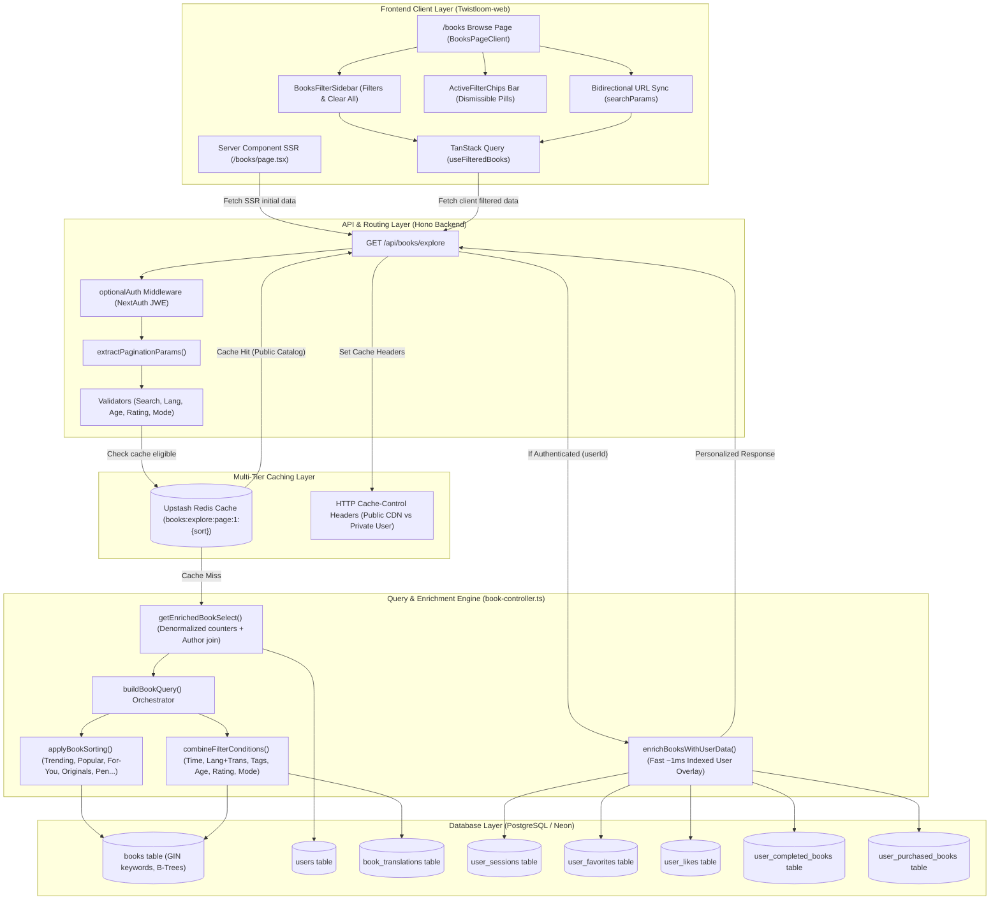
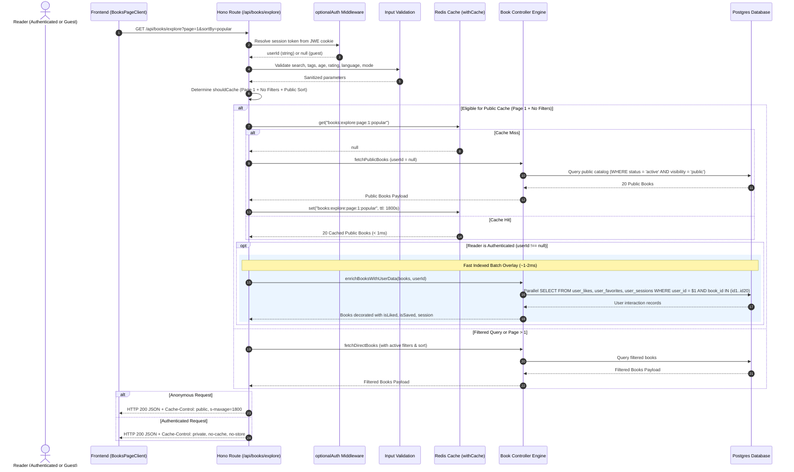

# Book Explore, Filtering, and Sorting Architecture

## Overview

The **Book Explore System** is the core discovery engine of Twistloom. It powers public story browsing, categorized showcases, personalized discovery, author profiles, and advanced multi-dimensional filtering across both web and backend services.

The system is designed to provide:
- **Sub-5ms cached latency & sub-30ms uncached latency** across hundreds of thousands of books via indexed SQL generation, denormalized counters, and the **Hybrid Cache Pattern**.
- **100% User Data Isolation with Shared Redis Speed:** Public catalogs are shared globally in Redis, while personalized reader badges (`isLiked`, `isSaved`, `session`, `isRead`) are overlaid on the fly in `~1-2ms` via parallel primary-key index batch lookups.
- **Composable multi-faceted filtering** (Search, Normalized Tags, Rolling Time Ranges, Multilingual Translations, Story Modes, Protagonist Age/Gender, Rating thresholds).
- **Contextual and personalized sorting** (Trending with decay, Branching Ratio Popularity, Algorithmic For-You & Recommendations, Editor Top Picks, Originals, Author Creations).
- **Bidirectional Frontend State & URL Synchronization** with SSR hydration, deep-linking, active filter chip bars, and debounced search lifecycle management.
- **Multi-tiered caching** with edge CDN headers, Next.js ISR, and Redis sort-partitioned cache slots with event-driven invalidation.
- **Strict multi-tenant visibility controls** ensuring draft and private stories remain locked to authors while public catalog queries remain performant.

---

## High-Level Architecture



---

## End-to-End Request Lifecycle & Hybrid Cache Pattern



---

## Category & Sort Options Reference

The explore endpoint supports two dimensions of ordering: **Primary Book-Specific Sorts** (which act as category filters) and **Generic Column Fallbacks**.

| `sortBy` Value | Category Name | Underlying Logic & Predicates | Cacheable | Access / Auth Requirement |
|---|---|---|---|---|
| `all` / `newest` *(default)* | All Stories / Newest | `ORDER BY books.created_at DESC`. Scoped to `status = 'active' AND visibility = 'public'`. | ✅ Yes (30m) | Public |
| `trending` | Trending | `ORDER BY books.trending_score DESC`. Scores decayed daily via cron: $0.5 \times \text{reads} + 0.3 \times \text{likes} + 0.2 \times \text{favorites}$. | ✅ Yes (5m) | Public |
| `popular` | Most Explored | Sorts by narrative branching ratio: `(COALESCE(branches_count, 0)::float / NULLIF(total_pages, 0)) DESC`. | ✅ Yes (30m) | Public |
| `top-picks` | Editor's Picks | Filters `books.top_pick IS NOT NULL`, `ORDER BY books.top_pick DESC`. | ✅ Yes (30m) | Public |
| `originals` | Twistloom Originals | Filters `books.is_original = true AND books.image_id IS NOT NULL`, `ORDER BY books.created_at DESC`. | ✅ Yes (30m) | Public |
| `pen` | Pen Published | Filters `books.is_pen_book = true AND books.authoring_status = 'complete'`, `ORDER BY books.created_at DESC`. | ✅ Yes (30m) | Public |
| `for-you` | You Might Like | Aggregates keywords from reader's history (`user_sessions`), scores keyword overlap, excludes read books. | ❌ No | Requires Auth |
| `recommendations` | Recommended | Finds unread books sharing keywords with books the user has **liked** (`user_likes`). | ❌ No | Requires Auth |
| `reads` | Recently Read | Filters to viewer's `user_sessions`, ordered by `user_sessions.updated_at DESC`. | ❌ No | Requires Auth (or `profileUserId`) |
| `favorites` | Saved / Bookmarked | Filters to viewer's `user_favorites`, ordered by `user_favorites.created_at DESC`. Supports `collection` folder filter. | ❌ No | Requires Auth (or `profileUserId`) |
| `likes` | Liked Stories | Filters to viewer's `user_likes` (`target_type = 'book'`), ordered by `user_likes.created_at DESC`. | ❌ No | Requires Auth (or `profileUserId`) |
| `creations` | My Stories / Author's Books | Scoped to owner's `user_id`, bypasses public visibility, supports status filtering (`active,draft,archived`). | ❌ No | Requires Auth (or `profileUserId`) |
| `pen-drafts` | In-Progress Pen Drafts | Scoped to owner's `user_id`, filters `is_pen_book = true AND authoring_status = 'draft'`, `ORDER BY updated_at DESC`. | ❌ No | Requires Auth |

---

## Filter Parameters & SQL Construction Engine

Filters are composable and combined using strict SQL `AND` conjunctions in `combineFilterConditions()`.

```typescript
export interface FilterParams {
  search?: string;         // Tokenized multi-column search (title, hook, summary, unnested keywords)
  tags?: string[];         // Normalized lowercase array overlap: books.keywords && ARRAY[...]
  language?: string;       // Primary language match OR verified translation in book_translations
  lastUpdated?: string;    // Timezone-neutral rolling intervals ('today' | 'this-week' | 'this-month' | 'this-year')
  minAge?: number;         // Safe regex-checked protagonist age: CASE WHEN age ~ '^[0-9]+$' THEN age::int ...
  maxAge?: number;         // Protagonist age ceiling
  gender?: string;         // Protagonist gender: books.mc->>'gender' = $1
  mode?: BookMode;         // Story creation format: 'novel' | 'interactive' | 'multiverse'
  minRating?: number;      // Whole-star threshold (1-5): books.rating >= minRating (denormalized O(1))
  maxRating?: number;      // Rating ceiling: books.rating <= maxRating
  minRatingCount?: number; // Minimum approved testimonials threshold
  collection?: string;     // Named favorites folder (only with sortBy=favorites)
  profileUserId?: string;  // Target user ID for public profile showcase
}
```

### 1. Tokenized Search Condition (`buildSearchCondition`)
Instead of flattening keyword arrays with `array_to_string` (which bypassed database indexes), search evaluates title, hook, summary, and array keywords via array unnesting:
```typescript
export function buildSearchCondition(search?: string) {
  if (!search) return null;
  const tokens = search.trim().split(/\s+/).filter(Boolean);
  if (tokens.length === 0) return null;

  const tokenConditions = tokens.map(token => {
    const pattern = `%${token}%`;
    return or(
      sql`${books.title} ILIKE ${pattern}`,
      sql`${books.hook} ILIKE ${pattern}`,
      sql`${books.summary} ILIKE ${pattern}`,
      sql`EXISTS (SELECT 1 FROM unnest(${books.keywords}) AS kw WHERE kw ILIKE ${pattern})`
    );
  });

  return and(...tokenConditions) ?? null;
}
```

### 2. Case-Insensitive Tag Matching (`buildTagsFilterCondition`)
Ensures query tokens are lowercased and trimmed to match GIN-indexed keyword elements:
```typescript
export function buildTagsFilterCondition(tags: string[]) {
  if (!tags || tags.length === 0) return null;
  const normalized = tags.map(t => t.trim().toLowerCase()).filter(Boolean);
  if (normalized.length === 0) return null;
  return arrayOverlaps(books.keywords, normalized);
}
```

### 3. Translation-Aware Language Filter (`buildLanguageFilterCondition`)
Matches both native authoring language and verified multi-lingual community translations:
```typescript
export function buildLanguageFilterCondition(language?: string) {
  if (!language) return null;
  const normalized = language.trim().toLowerCase();
  return or(
    eq(books.language, normalized),
    sql`EXISTS (
      SELECT 1 FROM book_translations bt
      WHERE bt.book_id = ${books.id} AND bt.language = ${normalized}
    )`
  );
}
```

### 4. Robust Protagonist Age Range Filter (`buildAgeRangeFilterCondition`)
Guards against runtime integer cast exceptions on dirty or non-numeric JSON fields using regex:
```typescript
export function buildAgeRangeFilterCondition(minAge?: number, maxAge?: number) {
  if (minAge === undefined || maxAge === undefined) return null;
  return sql`CASE WHEN (${books.mc}->>'age') ~ '^[0-9]+$' THEN (${books.mc}->>'age')::int ELSE NULL END BETWEEN ${minAge} AND ${maxAge}`;
}
```

### 5. Timezone-Neutral Rolling Intervals (`buildTimeFilterCondition`)
Eliminates local Node.js server timezone drift by utilizing PostgreSQL native rolling intervals:
```typescript
export function buildTimeFilterCondition(lastUpdated?: string) {
  if (!lastUpdated || lastUpdated === 'anytime') return null;
  switch (lastUpdated) {
    case 'today':      return sql`${books.updatedAt} >= NOW() - INTERVAL '24 hours'`;
    case 'this-week':  return sql`${books.updatedAt} >= NOW() - INTERVAL '7 days'`;
    case 'this-month': return sql`${books.updatedAt} >= NOW() - INTERVAL '30 days'`;
    case 'this-year':  return sql`${books.updatedAt} >= NOW() - INTERVAL '365 days'`;
    default:           return null;
  }
}
```

---

## The Hybrid Cache & Personalization Pattern

### The Problem with Naive Cache Strategies
In standard relational models, embedding `isLiked`, `isSaved`, and reader progress `session` inside `SELECT` subqueries presents a dilemma:
- **Caching with `userId`:** Leaks User A's private reading progress and bookmarks to all subsequent users if cached globally.
- **Disabling Cache for Logged-In Users:** Forces every authenticated reader to run heavy database joins, sorting, and counts, dropping cache hit rates to `< 15%`.

### The Hybrid Solution
```
[ Redis Shared Public Cache ] ────▶ 20 Public Books (< 1ms)
                                            │
                                            ▼
[ DB Indexed Batch Lookups ]  ────▶ In-Memory User Flags Overlay (~1-2ms)
(WHERE book_id IN (...))                    │
                                            ▼
                              [ Personalized 200 OK Response ]
```

1. **Pure Public Cache:** `GET /api/books/explore` runs `fetchPublicBooks` (`userId = null`). Redis stores the catalog metadata under `books:explore:page:1:{sortBy}`.
2. **Fast In-Memory Overlay:** If `userId` is present, `enrichBooksWithUserData(books, userId)` runs a single parallel query across indexed constraints on `(user_id, book_id)` for `user_likes`, `user_favorites`, `user_sessions`, `user_completed_books`, `user_purchased_books`.
3. **Zero Cache Invalidation Overhead on User Actions:** When a user likes or reads a story, the global public Redis cache does **not** need to be invalidated.
4. **Edge CDN Isolation:**
   - Anonymous requests get `Cache-Control: public, max-age=1800, s-maxage=1800`.
   - Authenticated requests get `Cache-Control: private, no-cache, no-store, must-revalidate`.

---

## Frontend State & URL Synchronization

The frontend architecture in `Twistloom-web` ensures seamless deep-linking, SSR hydration, and reactive exploration:

### 1. SSR Parameter Ingestion (`src/app/[locale]/books/page.tsx`)
Parses all query parameters on the server (`search`, `keyword`, `sort`, `tags`, `lastUpdated`, `ageRange`, `gender`, `language`, `mode`, `rating`), calls `fetchBooks`, and passes `initialFilters` to prevent layout shift during client hydration.

### 2. Bidirectional URL Synchronization (`BooksPageClient.tsx`)
- Toggling any sidebar filter immediately serializes the state to URL search parameters with `router.replace(..., { scroll: false })`.
- Modifying filters deletes `page` from the query string to reset to Page 1, while clicking pagination controls preserves all active filter parameters.
- `useFilteredBooks` binds to `page: pageFromUrl`, allowing unrestricted multi-page exploration on filtered and searched catalogs.

### 3. Search Lifecycle & Debouncing
- Search input is decoupled into immediate local UI state (`searchInput`) and debounced API/URL synchronization state (300ms delay).
- Backspacing below `MIN_LENGTH (2)` automatically clears the active search query to prevent stuck filter state.

### 4. Active Filters Bar & Reset Actions
- `CategoryBooksLayout.tsx` renders dismissible chip pills for all active filters with one-click individual removals.
- Both `CategoryBooksLayout` and `BooksFilterSidebar` provide a "Clear all" action to reset all filters in a single operation.

---

## Database Index Optimization

The explore queries leverage specialized Postgres indexes:

```sql
-- GIN index for ultra-fast tag filtering and similarity matching
CREATE INDEX IF NOT EXISTS books_keywords_gin_idx ON books USING GIN (keywords);

-- GIN trigram indexes for title and hook search
CREATE INDEX IF NOT EXISTS books_title_gin_idx ON books USING GIN (title gin_trgm_ops);
CREATE INDEX IF NOT EXISTS books_hook_gin_idx ON books USING GIN (hook gin_trgm_ops);

-- Partial index for rating filtering (O(1) lookups excluding unrated books)
CREATE INDEX IF NOT EXISTS books_rating_idx ON books (rating, rating_count) WHERE rating IS NOT NULL;

-- Composite index for the public explore baseline filter
CREATE INDEX IF NOT EXISTS books_explore_active_public_idx ON books (status, visibility, created_at DESC);

-- Index for trending ranking
CREATE INDEX IF NOT EXISTS books_trending_score_idx ON books (trending_score DESC);

-- Index for editor's top picks
CREATE INDEX IF NOT EXISTS books_top_pick_idx ON books (top_pick DESC) WHERE top_pick IS NOT NULL;

-- Index for originals showcase
CREATE INDEX IF NOT EXISTS books_originals_idx ON books (is_original, image_id, created_at DESC) WHERE is_original = true;
```

---

## Verification & Troubleshooting Guide

### 1. Verifying Story Visibility in Database
If a book does not appear in explore with "All Stories":
```sql
SELECT id, title, slug, is_original, visibility, status, image_id, created_at 
FROM books 
WHERE id = '<book_id>';
```
- Verify `status = 'active'`.
- Verify `visibility = 'public'`.

### 2. Testing Explore API Directly
```bash
# Public default explore (Page 1, newest) - Cached in Redis
curl -i -X GET "https://api.twistloom.com/api/books/explore?page=1&limit=20"

# Category: Twistloom Originals
curl -i -X GET "https://api.twistloom.com/api/books/explore?sortBy=originals&page=1"

# Multi-filtered explore (Search + Tags + Mode + Rating)
curl -i -X GET "https://api.twistloom.com/api/books/explore?search=detective&tags=mystery,noir&mode=interactive&rating=4&page=1"
```

