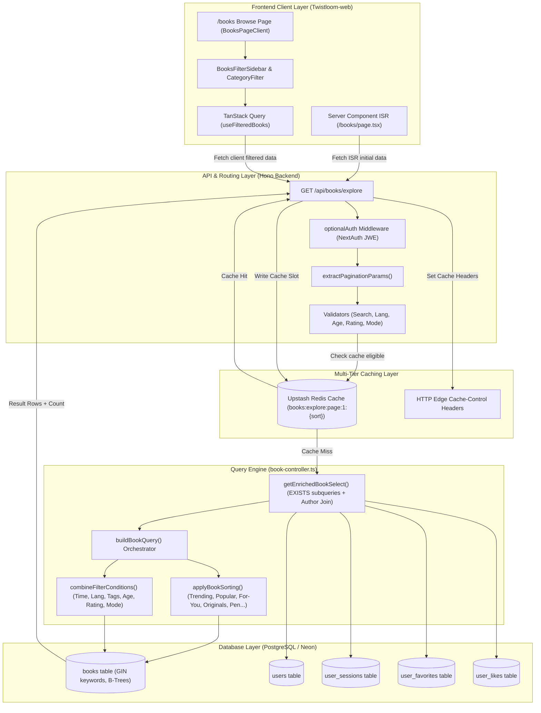
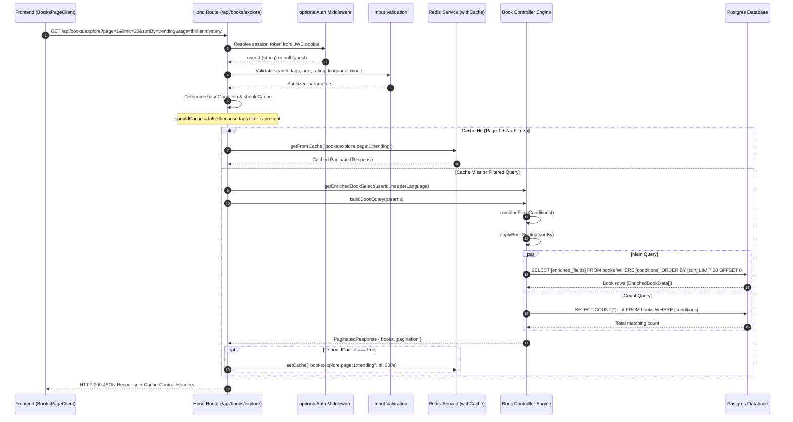
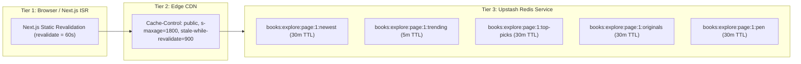

# Book Explore, Filtering, and Sorting Architecture

## Overview

The **Book Explore System** is the core discovery engine of Twistloom. It powers public story browsing, categorized showcases, personalized discovery, author profiles, and advanced multi-dimensional filtering.

The system is designed to provide:
- **Sub-50ms query latency** across hundreds of thousands of books via indexed SQL generation and denormalized counters.
- **Composable multi-faceted filtering** (Search, Tags, Time Range, Language, Mode, Protagonist Age/Gender, Rating thresholds).
- **Contextual and personalized sorting** (Trending with decay, Bayesian/engagement Popularity, Algorithmic For-You & Recommendations, Editor Top Picks, Originals, Author Creations).
- **Multi-tiered caching** with edge CDN headers, Next.js ISR, and Redis sort-partitioned cache slots with event-driven invalidation.
- **Strict multi-tenant visibility controls** ensuring draft and private stories remain locked to authors while public catalog queries remain performant.

---

## High-Level Architecture



---

## End-to-End Request Lifecycle



---

## Category & Sort Options Reference

The explore endpoint supports two dimensions of ordering: **Primary Book-Specific Sorts** (which act as category filters) and **Generic Column Fallbacks**.

| `sortBy` Value | Category Name | Underlying Logic & Predicates | Access / Auth Requirement |
|---|---|---|---|
| `all` / `newest` *(default)* | All Stories / Newest | `ORDER BY books.created_at DESC`. Scoped to `status = 'active' AND visibility = 'public'`. | Public |
| `trending` | Trending | `ORDER BY books.trending_score DESC`. Scores decayed daily via cron: $0.5 \times \text{reads} + 0.3 \times \text{likes} + 0.2 \times \text{favorites}$. | Public |
| `popular` | Most Explored | Sorts by narrative branching ratio: `(COALESCE(branches_count, 0)::float / NULLIF(total_pages, 0)) DESC`. | Public |
| `top-picks` | Editor's Picks | Filters `books.top_pick IS NOT NULL`, `ORDER BY books.top_pick DESC`. | Public |
| `originals` | Twistloom Originals | Filters `books.is_original = true AND books.image_id IS NOT NULL`, `ORDER BY books.created_at DESC`. | Public |
| `pen` | Pen Published | Filters `books.is_pen_book = true AND books.authoring_status = 'complete'`, `ORDER BY books.created_at DESC`. | Public |
| `for-you` | You Might Like | Aggregates all keywords from viewer's reading history (`user_sessions`), counts keyword overlap score, excludes read books. | Requires Auth |
| `recommendations` | Recommended | Finds unread books sharing keywords with books the user has **liked** (`user_likes`). | Requires Auth |
| `reads` | Recently Read | Filters to viewer's `user_sessions`, ordered by `user_sessions.updated_at DESC`. | Requires Auth (or `profileUserId`) |
| `favorites` | Saved / Bookmarked | Filters to viewer's `user_favorites`, ordered by `user_favorites.created_at DESC`. Supports `collection` filter. | Requires Auth (or `profileUserId`) |
| `likes` | Liked Stories | Filters to viewer's `user_likes` (`target_type = 'book'`), ordered by `user_likes.created_at DESC`. | Requires Auth (or `profileUserId`) |
| `creations` | My Stories / Author's Books | Scoped to owner's `user_id`, bypasses public visibility, supports status filtering (`active,draft,archived`). | Requires Auth (or `profileUserId`) |
| `pen-drafts` | In-Progress Pen Drafts | Scoped to owner's `user_id`, filters `is_pen_book = true AND authoring_status = 'draft'`, `ORDER BY updated_at DESC`. | Requires Auth |

---

## Filter Parameters & Schema

Filters are composable and combined using strict SQL `AND` conjunctions in `combineFilterConditions()`.

```typescript
export interface FilterParams {
  search?: string;         // Tokenized multi-column ILIKE (title, summary, keywords)
  tags?: string[];         // Postgres array overlap: books.keywords && ARRAY[...]
  language?: string;       // ISO 639-1 code match: books.language = $1
  lastUpdated?: string;    // 'today' | 'this-week' | 'this-month' | 'this-year'
  ageRange?: string;       // Protagonist age: (books.mc->>'age')::int BETWEEN min AND max
  gender?: string;         // Protagonist gender: books.mc->>'gender' = $1
  mode?: BookMode;         // 'novel' | 'interactive' | 'multiverse'
  minRating?: number;      // Whole-star threshold (1-5): books.rating >= minRating
  maxRating?: number;      // Rating ceiling: books.rating <= maxRating
  minRatingCount?: number; // Minimum approved testimonials count threshold
  collection?: string;     // Named favorites folder (only with sortBy=favorites)
  profileUserId?: string;  // Target user ID for public profile showcase
}
```

---

## SQL Construction Engine

### 1. Enriched Select Builder (`getEnrichedBookSelect`)

To eliminate $N+1$ query overhead while keeping list queries single-pass, `getEnrichedBookSelect(currentUserId, language)` compiles:

1. **Denormalized O(1) Counters:** Direct column reads for `likesCount`, `readCount`, `branchesCount`, `commentsCount`, `testimonialsCount`, `rating`, `ratingCount`, `completionRate`.
2. **Index-Only EXISTS Subqueries:** User-specific binary flags (`isMine`, `isLiked`, `isSaved`, `isRead`, `isCompleted`, `isPurchased`) evaluate in $O(\log n)$ using unique constraints on `(user_id, book_id)`.
3. **Session & History Consolidated Lookups:** Single JSONB subquery extracting `lastReadAt`, `frontierPageId`, `lastPageNumber`, and `contextHistory`.
4. **Correlated Translation Subquery:** Directly fetches title, hook, summary, and keywords in the target language if different from native story language (`${language} <> books.language`).

### 2. Base Condition Resolution

The query base condition segregates public explore queries from author-scoped management queries:

```typescript
const targetUserId = profileUserId || userId;

const baseCondition = isCreations || isPenDrafts
  ? statusFilter && isCreations
    ? and(eq(books.userId, targetUserId!), inArray(books.status, statusFilter))!
    : eq(books.userId, targetUserId!)
  : profileUserId && bookSortBy !== 'favorites' && bookSortBy !== 'reads' && bookSortBy !== 'likes'
    ? and(eq(books.status, 'active'), eq(books.visibility, 'public'), eq(books.userId, profileUserId))!
    : and(eq(books.status, 'active'), eq(books.visibility, 'public'))!;
```

---

## Multi-Tiered Caching & Invalidation Architecture

To balance performance with personalization, caching operates at three distinct levels:



### Cache Key Partitioning

To avoid cross-sort contamination (where fetching `top-picks` serves cached `newest` items), every public category uses an isolated key:

- **Key Format:** `books:explore:page:1:{sortBy}`
- **Pattern Invalidation:** `books:explore:page:1:*`
- **Cache Eligibility Rules (`shouldCache`):**
  - Must be `page === 1`
  - No active search query (`!search`)
  - No active filter tags (`tagsArray.length === 0`)
  - No custom filter criteria (`!language`, `!lastUpdated`, `!ageRange`, `!gender`, `!mode`, `!rating`)
  - Excludes user-personalized sorts (`for-you`, `reads`, `favorites`, `recommendations`, `creations`, `pen-drafts`)

### Event-Driven Invalidation Triggers

The explore cache is purged automatically on book lifecycle events via `invalidateExploreCache({ book })`:

| Trigger Event | Route / Handler | Invalidation Action |
|---|---|---|
| **Book Creation / Completion** | `POST /api/books/async` & Webhook | Purges `books:explore:page:1:*` if `visibility === 'public'` |
| **Visibility Toggle** | `PATCH /api/books/:id/visibility` | Purges explore slots if before/after state is `public` + `active` |
| **Book Deletion** | `DELETE /api/books/:id` | Purges explore slots & drops 30-day `page1` static cache |
| **Story Likes / Unlikes** | `POST/DELETE /api/books/:id/like` | Purges explore cache if book is public (affects `trendingScore`) |
| **Favorites / Collections** | `POST/DELETE /api/books/:id/favorite`| Purges explore cache if book is public |
| **Weekly Originals Cron** | `generateOriginalBook()` | Full pattern purge across all explore cache slots |

---

## Database Index Optimization

The explore queries leverage specialized Postgres indexes:

```sql
-- GIN index for ultra-fast tag filtering and similarity matching
CREATE INDEX IF NOT EXISTS books_keywords_gin_idx ON books USING GIN (keywords);

-- Composite index for the public explore baseline filter
CREATE INDEX IF NOT EXISTS books_explore_active_public_idx ON books (status, visibility, created_at DESC);

-- Index for trending ranking
CREATE INDEX IF NOT EXISTS books_trending_score_idx ON books (trending_score DESC);

-- Index for editor's top picks
CREATE INDEX IF NOT EXISTS books_top_pick_idx ON books (top_pick DESC) WHERE top_pick IS NOT NULL;

-- Index for originals showcase
CREATE INDEX IF NOT EXISTS books_originals_idx ON books (is_original, image_id, created_at DESC) WHERE is_original = true;
```

---

## Verification & Troubleshooting Guide

### 1. Verifying Story Visibility in Database
If a book does not appear in explore with "All Stories":
```sql
SELECT id, title, slug, is_original, visibility, status, image_id, created_at 
FROM books 
WHERE id = '<book_id>';
```
- Verify `status = 'active'`.
- Verify `visibility = 'public'`.

### 2. Testing Explore API Directly
```bash
# Public default explore (Page 1, newest)
curl -X GET "https://api.twistloom.com/api/books/explore?page=1&limit=10"

# Category: Twistloom Originals
curl -X GET "https://api.twistloom.com/api/books/explore?sortBy=originals&page=1"

# Multi-filtered explore
curl -X GET "https://api.twistloom.com/api/books/explore?sortBy=trending&tags=psychological,mystery&language=en&rating=4"
```
