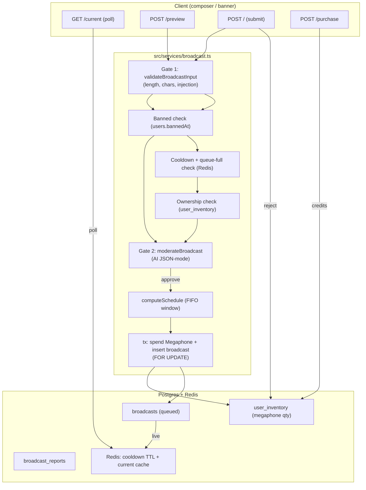
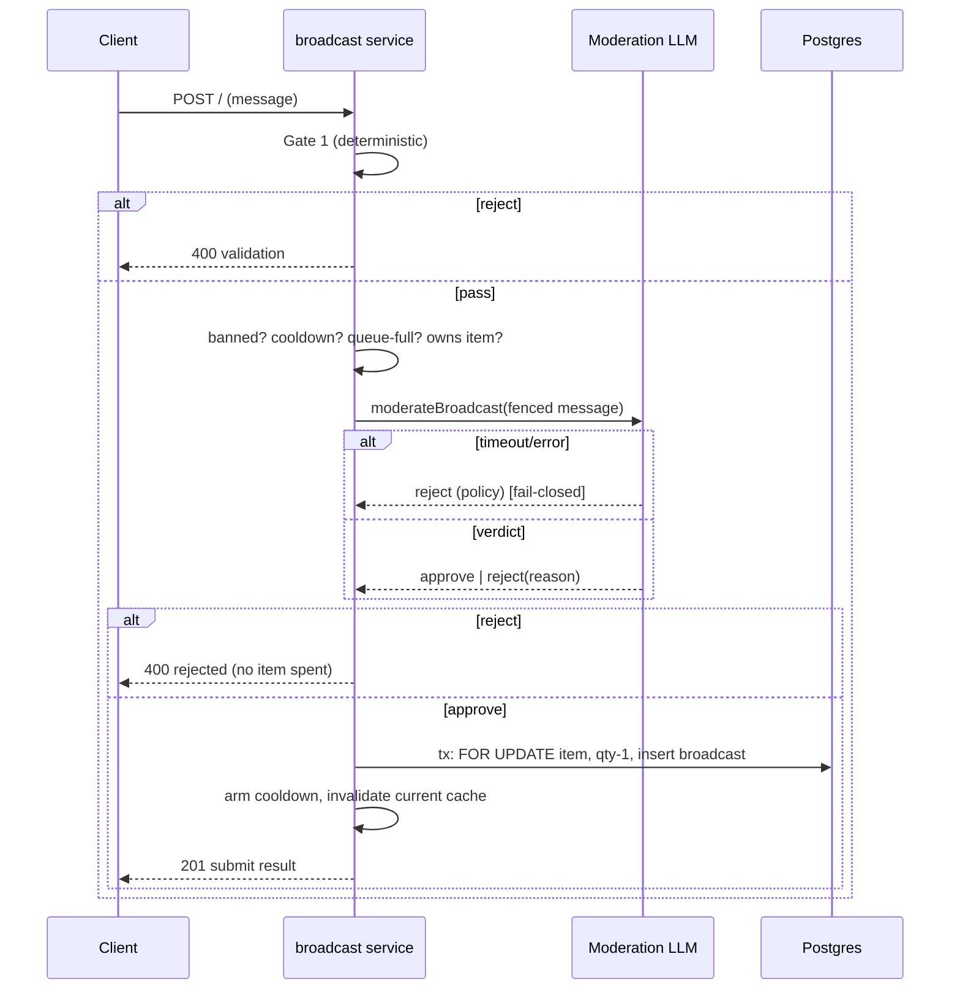

# Twistloom Broadcast (📣 Megaphone) Architecture

**Document version:** 1.0.0  
**Status:** 💡 Implemented  
**Parent Systems:** [Consumable Items Architecture](./CONSUMABLE_ITEMS_ARCHITECTURE.md) · [AI LLM Architecture](../architecture/AI_LLM_ARCHITECTURE.md)  
**Implementation Source Code:** [`src/routes/broadcasts.ts`](../../src/routes/broadcasts.ts) · [`src/services/broadcast.ts`](../../src/services/broadcast.ts) · [`src/config/broadcast.ts`](../../src/config/broadcast.ts) · [`src/db/schema.ts`](../../src/db/schema.ts)

---

## 1. Executive Summary & Problem Statement

Twistloom needs a **global, all-ages-visible broadcast banner** that lets a user send a short plain-text message to *every* reader for a few seconds. The naive design — "charge credits per broadcast" — is unsafe at scale:

- A broadcast is a scarce, highly-visible resource; it must be **rate-limited and moderated**, not an unbounded credit sink.
- Direct per-broadcast credit charging couples two concerns (cost + visibility) and makes abuse expensive-but-possible.

The 📣 Megaphone pattern decouples them:

1. **Buy a scarce item with credits** (a 📣 Megaphone consumable in `user_inventory`).
2. **Spend the item to broadcast** — no further credit charge, but the message is moderated and queued.

This yields a calm, single-live-slot banner where the only "cost" to the user is a previously-bought item, and the only server cost is one AI moderation call per submit.

### Design invariants

- **Fail-closed:** If AI moderation is unreachable or times out, the message is rejected. A hung provider can never silently approve a broadcast.
- **Never consume on rejection:** The 📣 Megaphone is spent *only* after both gates pass. Rejections need no refund path.
- **Banned users are inert:** `users.bannedAt` blocks purchase *and* broadcast.
- **No HTML / Markdown / images / arbitrary URLs:** Broadcasts are plain text + emoji. Spoilers are a user-declared boolean, not inferable content.

---

## 2. Core Data Model

Defined in [`src/db/schema.ts`](../../src/db/schema.ts) and [`src/types/broadcast.ts`](../../src/types/broadcast.ts).

### 2.1 `broadcasts`

| Column | Type | Notes |
|--------|------|-------|
| `id` | uuid PK | |
| `user_id` | uuid FK → `users` (cascade) | Broadcaster |
| `source` | `BroadcastSource` | `"user" \| "system"` |
| `type` | `BroadcastType` | `"message"` (V1) |
| `message` | text | Sanitized plain text (≤140) |
| `status` | `BroadcastStatus` | `queued \| rejected \| cancelled \| expired` |
| `moderation_result` | jsonb `$type<BroadcastModerationResult>` | Full AI verdict (audit) |
| `rejection_reason` | `BroadcastRejectReason?` | Set when status = `rejected` |
| `contains_spoiler` | boolean | User-declared |
| `starts_at` | timestamptz | When visible |
| `expires_at` | timestamptz | When hidden |
| `created_at` / `updated_at` | timestamptz | |

Indexes: `broadcasts_status_starts_idx (status, starts_at)`, `broadcasts_starts_idx (starts_at)`, `broadcasts_user_idx (user_id)`.

> Note: V1 stores approved broadcasts with `status = 'queued'` (the "live" state). `rejected`/`cancelled`/`expired` are terminal. A broadcast is **live** iff `status='queued' AND starts_at <= now < expires_at`.

### 2.2 `broadcast_reports`

| Column | Type | Notes |
|--------|------|-------|
| `id` | uuid PK | |
| `broadcast_id` | uuid FK → `broadcasts` (cascade) | |
| `reporter_user_id` | uuid FK → `users` | |
| `reason` | text | Bounded (≤60) |
| `created_at` | timestamptz | |

Unique `(broadcast_id, reporter_user_id)` — one report per user per broadcast (idempotent).

### 2.3 `user_inventory` (consumable ownership)

See [Consumable Items Architecture](./CONSUMABLE_ITEMS_ARCHITECTURE.md). Relevant columns: `item_type` (`InventoryItemType`, `"megaphone"`), `quantity`, `last_purchased_at`. Unique `(user_id, item_type)`.

---

## 3. Message Lifecycle

A broadcast travels through two gates before it is ever written.

### 3.1 Gate 1 — Deterministic validation (`validateBroadcastInput`)

Runs in <5ms, no AI, no DB:

1. **Empty check** — strip HTML (`stripHtml`), then `sanitizeText` + `cleanSingleLineText`. Empty after sanitization → reject.
2. **Length** — `BROADCAST_MIN_LENGTH` (3) … `BROADCAST_MAX_LENGTH` (140).
3. **Valid characters** — `BROADCAST_VALID_TEXT_PATTERN` (Unicode letters/marks/numbers, punctuation, currency/math symbols, emoji, whitespace). Control chars & zero-width code points were already stripped.
4. **Injection / abuse** — `BROADCAST_SECURITY_PATTERNS` (extends `CUSTOM_ACTION_SECURITY_PATTERNS` + bare-URL/link-spam + `@everyone`/mass-mention). Any match → reject with a bland message (no detail leaked).

On pass it returns the **sanitized** text, which is the exact string stored and sent to Gate 2.

### 3.2 Ban check

`users.bannedAt` set → `403` immediately (before any AI spend).

### 3.3 Gate 2 — AI moderation (`moderateBroadcast`)

A single JSON-mode classification call (`aiPrompt` + `createAIOptionsWithSchema`) with `AI_CHAT_MODELS_THEME`:

- **System prompt** (`BROADCAST_MODERATION_SYSTEM`) instructs the model to reject harassment, hate, sexual, self-harm, scams, illegal, prompt-injection, undisclosed advertising/spam, or gross policy violations; approve everything else; and NOT silently rewrite — only classify.
- **Schema** (`BroadcastModerationResult`): `{ outcome: "approve"|"reject", rejectionReason?, reasons[], language? }`.
- The raw user message is **fenced** inside the prompt so any injection attempt inside it is treated as data, not instructions.

**Fail-closed timeout:** the call is raced against `BROADCAST_MODERATION_TIMEOUT_MS` (15s). On timeout *or* any AI error the verdict resolves to `{ outcome: "reject", rejectionReason: "policy" }`. Rejections are logged via `recordViolationEvent` (telemetry only) and **never consume the item**.

---

## 4. Scheduling & the Single Live Slot

There is exactly **one live broadcast** at a time. Scheduling is computed at insert time (no cron needed in the serverless environment):

- `computeSchedule()` looks up the latest `queued` broadcast whose `expires_at > now`.
- If one exists, the new message is scheduled `starts_at = last.expires_at + BROADCAST_GLOBAL_INTERVAL_SECONDS` (10s); otherwise `starts_at = now`.
- `expires_at = starts_at + BROADCAST_DISPLAY_SECONDS` (8s).
- `queuePosition` = (count of `queued` rows with `starts_at > now`) + 1.

The public `GET /current` reads `WHERE status='queued' AND starts_at <= now < expires_at ORDER BY starts_at DESC LIMIT 1`. Stale `queued` rows (`expires_at <= now`) are lazily flipped to `expired` on each read. A Redis cache (`broadcast:current`, TTL `BROADCAST_CURRENT_CACHE_TTL_SECONDS` = 3s) keeps polling cheap; it is invalidated on every successful submit.

### Queue capacity

`BROADCAST_MAX_PENDING` (20) bounds future-queued rows. When at capacity, `submitBroadcast` returns `429 queue_full`, capping wait time and preventing a broadcast storm from backing up for hours.

---

## 5. Rate Limiting & Abuse Surface

| Control | Value | Mechanism |
|---------|-------|-----------|
| Per-user cooldown | `BROADCAST_USER_COOLDOWN_SECONDS` = 300 | Redis TTL key `broadcast:cooldown:{userId}`, armed after a successful submit |
| Global spacing | `BROADCAST_GLOBAL_INTERVAL_SECONDS` = 10 | Scheduling window |
| Display window | `BROADCAST_DISPLAY_SECONDS` = 8 | Scheduling window |
| Max length | 3–140 | Gate 1 |
| Max pending | 20 | Queue-capacity check |
| Moderation timeout | 15s | Fail-closed race |
| Preview limit | 20 / 60s | `BROADCAST_PREVIEW_RATE_LIMIT` |
| Submit limit | 10 / 60s | `BROADCAST_SUBMIT_RATE_LIMIT` |
| Purchase limit | 10 / 60s | `BROADCAST_PURCHASE_RATE_LIMIT` |

VIP users are **not** exempt — same limits apply (the scarcity is the point). All AI-rate-limit configs are Upstash Redis sliding windows that **fail open**.

### Reporting

`POST /:id/report` inserts into `broadcast_reports` (idempotent). This is the MVP abuse signal; a future moderator admin route can flip a `queued` → `cancelled` broadcast on threshold. Reports are never surfaced to the broadcaster.

---

## 6. Caching Strategy

- **L1 (in-process):** none specific to broadcasts (the public read is DB-cheap + Redis-cached).
- **L2 (Redis):** `broadcast:current` (3s TTL) for the public poll; `broadcast:cooldown:{userId}` (300s TTL) for the per-user gate. Both fail open (allow on Redis outage).
- **L3 (Postgres):** source of truth for `broadcasts`, `broadcast_reports`, `user_inventory`.

The `broadcast:current` cache is invalidated on submit so the next poll reflects the new schedule quickly; within the 3s TTL a slightly stale banner is acceptable.

---

## 7. Security & Trust & Safety

- **Prompt-injection defense:** HTML stripped, control chars removed, and injection patterns rejected in Gate 1; the raw message is fenced in Gate 2 so model instructions inside it are inert.
- **Banned accounts:** blocked at purchase and submit.
- **Moderation audit:** every verdict (approve + reject) is stored on the row (`moderation_result`); rejections also emit a `recordViolationEvent` (`prompt_abuse` for injection, else `community_abuse`).
- **No PII exposure:** `GET /current` returns only `username` + `message`, never email/name.
- **Free-demo:** `GET`/poll is public; purchase respects `FEATURE_FREE_DEMO` (credit charge → 0), but broadcasting still consumes an owned item.

---

## 8. Error Mapping

See [Broadcast API Documentation](../api/BROADCAST_API_DOCUMENTATION.md#error-codes). Internally a tagged `BroadcastSubmitError` carries a `code` (`validation | forbidden | no_megaphone | cooldown | queue_full | rejected | not_found`) mapped to HTTP status in the route layer.

---

## 9. Open Items / Future Work

- **Moderator admin route** to cancel a `queued` broadcast on report threshold (currently reports are recorded only).
- **SSE quality-of-life:** the `/stream` endpoint is sufficient for MVP; consider edge fan-out if connection counts grow.
- **New consumable types** (e.g. colored/emphasized broadcasts) extend the registry + `InventoryItemType` without schema changes to `broadcasts`.
