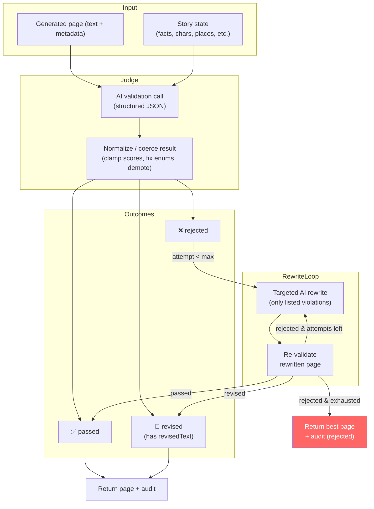
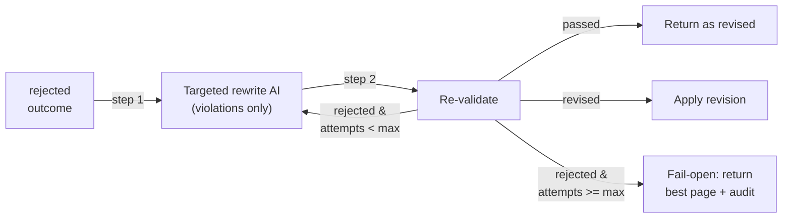
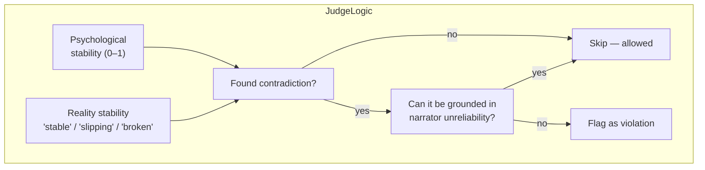

# Twistloom — Canon Validation Pipeline

How the backend judges each generated page against established lore, auto-repairs contradictions, and fail-opens so the story never stalls.

---

## 1. The core idea in one paragraph

Every page generation (`runCanonValidationPass`) can optionally run through an AI "canon judge" immediately after prose is produced. The judge compares the new page against the story state (facts, characters, places, inventory, plot flags, timeline) and returns one of three verdicts: `passed` (no contradictions), `revised` (fixable issues — AI includes corrected text), or `rejected` (critical contradictions). On `rejected`, a capped rewrite loop fires: a targeted AI rewrite limited to the listed violations, then a re-check. If the page still can't pass after N attempts, the pipeline **fail-opens** — the best available page is persisted anyway. No generation is ever blocked.

---

## 2. The three-outcome model

| Outcome | Meaning | Next action |
|---|---|---|
| `passed` | No hard contradictions. Minor style issues ignored. | Return page as-is. |
| `revised` | Fixable contradictions detected. AI provided corrected prose in `revisedText`. | Apply `revisedText` (via `applyCanonValidationToPage`), return. |
| `rejected` | Critical contradiction that can't be locally fixed (dead character conversing, impossible inventory use, reversed major fact). | Enter rewrite loop (up to `CANON_VALIDATION_MAX_REWRITE_ATTEMPTS`). |

### Implicit demotions (inside `normalizeValidationResult`)

The normalizer applies two safety overrides to the raw AI response:

1. **`revised` without usable `revisedText`** → promoted to `rejected` so the rewrite loop runs.
2. **`passed` with `severityScore ≥ 0.55` and non-empty violations** → demoted to `revised` (or `rejected` if no text), because a high-severity result claiming "passed" is contradictory.

---

## 3. The rewrite loop (rejected → repair → re-check)

Key properties:
- **Capped**: default 1 attempt (`CANON_VALIDATION_MAX_REWRITE_ATTEMPTS`). Prevents infinite spend on an irreconcilable page.
- **Targeted**: the rewrite prompt receives only the violation list + original text, not the full story context. This keeps the AI focused on fixing specific contradictions rather than reimagining the scene.
- **Re-validate**: every rewrite goes through the same judge pipeline. If it passes or self-revises, the loop exits early.

---

## 4. Reality-distortion exception

The judge prompt includes a special rule: when `realityStability` is `'slipping'` or `'broken'`, or psychological stability is low, **dream logic and unreliable narration are allowed**. Only contradictions that cannot be grounded in narrator unreliability are flagged. This prevents false positives in a psychological thriller where the narrator's perception is intentionally warped.

---

## 5. Audit trail

Every validation outcome is persisted to the `canonValidations` table (fire-and-forget via `insertCanonValidationAudit`). The row includes the full violation list, severity, rewrite count, and whether the page was modified. Two representation shapes exist:

| Shape | Consumer | Fields |
|---|---|---|
| `CanonValidationSummary` | Reader-facing APIs | `outcome`, `violationType`, `severityScore`, `wasRevised` |
| `CanonValidationPassResult['audit']` | Engineering debug / internal | Full violations array + `rewriteAttempts` |

The reader-facing `toCanonValidationSummary` softens `rejected` to `revised` when a rewrite was actually applied — the reader only needs to know the page was repaired.

---

## 6. Key design decisions

| Decision | Rationale |
|---|---|
| **Fail-open on AI error** | `runCanonValidationAi` and `runCanonRewriteAi` catch all errors and return `null`. The pipeline treats null as "no result" and returns the original page. A flaky AI call never blocks a reader's story. |
| **Prefer `passed` when uncertain** | The judge prompt explicitly instructs: "prefer `passed` when uncertain". False negatives (blocking valid prose) are worse than false positives (minor contradictions slipping through). |
| **Lossy context (contextHistory truncated to 1200 chars)** | The full context summary is used only as a soft reference; facts, plot flags, characters, places, and inventory are the source of truth. This prevents the judge from over-indexing on the prose summary. |
| **Structured output via `createAIOptionsWithSchema`** | The AI must return a well-typed JSON matching `CANON_VALIDATION_SCHEMA_DEFINITION`. The normalizer (`normalizeValidationResult`) then clamps, coerces, and validates every field. |
| **Schema definition uses `Record<keyof T, AIJsonProperty>`** | This ensures compile-time alignment with `CanonValidationResult` — adding a field to the type forces a corresponding schema entry (or an explicit decision to omit it). |

---

## 7. File map

| File | Role |
|---|---|
| `src/config/canon-validation.ts` | Toggles, limits (`MAX_REWRITE_ATTEMPTS`, `MAX_OUTPUT_TOKEN`) |
| `src/types/canon-validation.ts` | `CanonValidationOutcome`, `CanonValidationResult`, `CanonValidationSummary`, violation types |
| `src/services/canon-validation.ts` | Full pipeline: context builders, prompts, AI calls, normalizer, orchestration, audit |
| `src/db/schema.ts` | `canonValidations` table definition |
