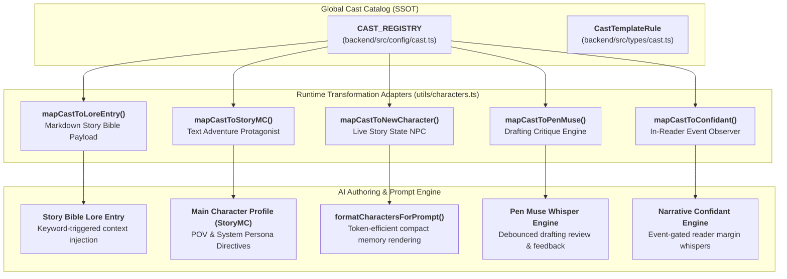
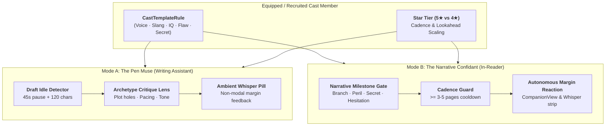
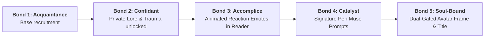

# Twistloom Cast Collection & Recruitment Architecture

**Document version:** 1.0.0  
**Status:** 💡 Implemented SSOT Registry & Core Mappings  
**Parent System:** [AI Co-Writing / Pen Architecture](./PEN_STORYTELLER_ARCHITECTURE.md) · [Story Bible Lore Architecture](./STORY_BIBLE_ARCHITECTURE.md)  
**Primary Strategic Roadmaps:** [Cast Collection & Recruitment Roadmap](../../../Twistloom-web/docs/roadmap/TWISTLOOM_CAST_COLLECTION_AND_RECRUITMENT_ROADMAP.md) · [Gacha vs Narrative Recruitment Analysis](../../../Twistloom-web/docs/roadmap/TWISTLOOM_GACHA_VS_NARRATIVE_RECRUITMENT_ANALYSIS.md)  
**Implementation Source Code:** [`Twistloom-backend/src/config/cast.ts`](../../src/config/cast.ts) · [`Twistloom-backend/src/types/cast.ts`](../../src/types/cast.ts) · [`Twistloom-backend/src/utils/characters.ts`](../../src/utils/characters.ts)

---

## 1. Executive Summary & Problem Statement

Twistloom provides an account-level **Character Collection and Recruitment Layer** that allows readers and authors to discover, unlock, and recruit narrative characters across the multiverse.

Unlike standard gacha or card games where collected entities merely possess numeric attack/defense attributes, Twistloom characters are **rich narrative catalysts and active intelligent companions**:
1. **Multi-Utility Ecosystem:**
   - **Playable Protagonist (MC):** Selected in Step 2 of the creation wizard (`WriteModeCards.tsx`) for **Text Adventure** mode.
   - **Scene Cast & Lore Entity:** Imported into a book's **Story Bible** (`LoreEntry`) and toggled into drafts via `SceneCastPanel.tsx`.
   - **The Pen Muse (Autonomous Writing Assistant):** Periodically reviews author drafts in `PenEditorClient.tsx` for plot holes, psychological consistency, and pacing through their unique archetype lens, with cadence and acuity scaled by Cast Star Tier (5★ vs 4★).
   - **The Narrative Confidant (Autonomous In-Reader Companion):** Reacts, warns, and speculates in `CompanionView.tsx` and in-reader margin notes at crucial decision forks, perils, and secret reveals, without falling into the "Clippy trap".
2. **Immutable Catalog vs. Pinned Local Snapshot:**
   - Account ownership entitlements are global and server-authoritative.
   - When a character is added to a book, the engine creates an isolated, pinned local snapshot. Authors can freely adapt or rename local lore without altering the global template.



---

## 2. Core Data Model & Type Contract

Defined in [`Twistloom-backend/src/types/cast.ts`](../../src/types/cast.ts):

### 2.1 Multi-Dimensional High Value Framework

Star Tier in Twistloom represents **narrative weight, cognitive acuity, and plot disruption power**, rather than artificial combat stats:

```ts
export type StarTier = 4 | 5;

export interface CastHighValueMetrics {
  /** Cognitive acuity, analytical & deductive mastery (5★: 90-100 / IQ 150-170+). */
  intellect: number;
  /** Kinetic capability, tactical lethality, or institutional authority. */
  power: number;
  /** Charm, aesthetic elegance, handsomeness/prettiness, hypnotic presence. */
  magnetism: number;
  /** Psychological endurance against trauma, gaslighting, and horror. */
  resilience: number;
  /** Societal, organizational, or black-market reach. */
  influence: number;
  /** High-value narrative summary. */
  valueSummary: string;
}
```

### 2.2 Persona, Voice & Prompt Injection Schema

```ts
export interface CastTemplateRule {
  id: string;
  slug: string;
  starTier: StarTier;
  name: string;
  knownName: string;
  title: string;
  archetype: string;
  gender: 'male' | 'female' | 'non_binary';
  age: number;
  pronouns: CastPronouns;
  premise: string;
  biography: string;
  imagePrompt: string;
  highValueMetrics: CastHighValueMetrics;
  distinctCharacteristics: {
    languageStyle: string;
    slangAndCatchphrases: string[];
    hobbiesAndQuirks: string[];
    aestheticMotif: string;
  };
  psychologicalProfile: {
    motivation: string;
    flaw: string;
    fear: string;
    trauma: string;
    moralBoundaries: string[];
    secret: string;
  };
  voice: {
    summary: string;
    styleDirectives: string[];
    exampleLines: string[];
    preferredMood: {
      defaultMood: 'scream' | 'angry' | 'afraid' | 'whisper' | 'cry' | 'laugh' | 'sing' | 'calm' | 'desperate' | 'cold';
      stressMood: 'scream' | 'angry' | 'afraid' | 'whisper' | 'cry' | 'laugh' | 'sing' | 'calm' | 'desperate' | 'cold';
    };
  };
  promptInjections: {
    systemDirective: string;
    dialogueGuardrails: string[];
    internalMonologueStyle: string;
  };
  signatureTwist: {
    triggerCondition: string;
    revelation: string;
    tensionThreshold: number;
  };
  goals: string[];
  fears: string[];
  flaws: string[];
  strengths: string[];
  boundaries: string[];
  narrativeHooks: string[];
  triggerKeywords: string[];
  compatibilityTags: string[];
  contentWarnings: string[];
  sourceType: 'platform' | 'creator' | 'licensed' | 'community';
  discoveryVisibility: 'public' | 'unlisted' | 'campaign_only';
  status: 'draft' | 'in_review' | 'published' | 'suspended' | 'withdrawn';
  version: number;
}
```

---

## 3. The 20 Launch Cast Templates (SSOT Roster)

Defined in [`Twistloom-backend/src/config/cast.ts`](../../src/config/cast.ts):

### 3.1 5-Star Complex Catalysts (5 Characters)

| Character ID | Name & Epithet | Archetype & Genre | Cognitive & Value Metrics | Signature & Stress Mood | Distinctive Slang & Quirks |
|---|---|---|---|---|---|
| `cast_mara_reyes_5s` | **Mara Reyes**<br/>*The Ghost-Weaver* | Memory Broker<br/>*(Cyberpunk Noir)* | **IQ 162** (Decryption)<br/>Power 84 · Mag 92 | **`cold`**<br/>Stress: `whisper` | *"synapse burn", "cold-buffer"*; restores 1980s magnetic cassettes |
| `cast_aurelius_vance_5s` | **Dr. Aurelius Vance-Chen**<br/>*Lord Vane* | Mastermind Polymath<br/>*(Dark Academia)* | **IQ 170+** (Game Theory)<br/>Power 95 · Mag 94 | **`cold`**<br/>Stress: `desperate` | *"liquidation horizon", "zugzwang"*; simultaneous blindfold speed chess |
| `cast_seraphina_de_fontaine_5s` | **Lady Seraphina de Fontaine**<br/>*The Velvet Siren* | Bloodline Oracle<br/>*(Gothic Horror)* | **Supernatural Sight**<br/>Mag 99 · Infl 94 | **`whisper`**<br/>Stress: `cold` | *"mon cher", "blood-spindles"*; cultivates venomous orchids in conservatory |
| `cast_kaelen_vexler_5s` | **Kaelen 'Null' Vexler**<br/>*The Voidblade* | Cybernetic Enforcer<br/>*(Transhuman Action)* | **Apex Kinetic (99)**<br/>Resilience 97 | **`cold`**<br/>Stress: `angry` | *"threat delta zero", "flash-burn"*; timed blade assembly with eyes closed |
| `cast_ishtar_moradi_5s` | **Dr. Ishtar Moradi**<br/>*The Chrono-Alchemist* | Quantum Physicist<br/>*(Cosmic Sci-Fi)* | **IQ 168 Polymath**<br/>Temporal Intuition | **`calm`**<br/>Stress: `whisper` | *"entropy-drift", "light-cone echo"*; winds counter-clockwise chronometers |

### 3.2 4-Star Grounded Specialists (15 Characters)

1. **Dante 'Sparrow' Cruz** (`cast_dante_cruz_4s`) — *Lockpick Prodigy* (Heist): Mood `[laugh | afraid]`; slang: *"clean breach"*.
2. **Dr. Evelyn 'Eve' Sinclair** (`cast_evelyn_sinclair_4s`) — *Forensic Toxicologist* (Mystery): **IQ 152**; Mood `[cold | calm]`; slang: *"post-mortem blush"*.
3. **Viktor 'Ironheart' Kozlov** (`cast_viktor_kozlov_4s`) — *Bouncer Philosopher* (Noir): Mood `[calm | angry]`; slang: *"heavy hands, quiet tongue"*.
4. **Lyra 'Glitch' Novak** (`cast_lyra_novak_4s`) — *Neon Netrunner* (Cyberpunk): **IQ 93**; Mood `[laugh | angry]`; slang: *"daemon-bite"*.
5. **Father Thomas Callahan** (`cast_thomas_callahan_4s`) — *Defrocked Exorcist* (Supernatural): Mood `[whisper | desperate]`; slang: *"sanctum breach"*.
6. **Zhenya 'Ghost' Park** (`cast_zhenya_park_4s`) — *Deep-Cover Infiltrator* (Espionage): Mood `[calm | cold]`; slang: *"protocol anomaly"*.
7. **Silas 'The Crow' Thorne** (`cast_silas_thorne_4s`) — *Curse Appraiser* (Urban Fantasy): Mood `[whisper | afraid]`; slang: *"a bargain in marrow"*.
8. **Captain Nadia Al-Mansoor** (`cast_nadia_al_mansoor_4s`) — *Sky Dreadnought Pilot* (Space Western): Mood `[calm | desperate]`; slang: *"burn the gimbal"*.
9. **Milo 'Cricket' Chen** (`cast_milo_chen_4s`) — *Clockwork Savant* (Steampunk): **IQ 158**; Mood `[laugh | whisper]`; slang: *"gear-slip"*.
10. **Rowan 'The Briar' Blackwood** (`cast_rowan_blackwood_4s`) — *Hermit Tracker* (Wilderness): Mood `[cold | angry]`; slang: *"scent-trail cold"*.
11. **Baroness Claudia von Hesse** (`cast_claudia_von_hesse_4s`) — *Disgraced Diplomat* (Court Intrigue): Mood `[calm | cold]`; slang: *"provincial"*.
12. **Kai 'Echo' Tanaka** (`cast_kai_tanaka_4s`) — *Memory Hacker* (Cyberpunk): Mood `[whisper | afraid]`; slang: *"sub-bass resonance"*.
13. **Astrid 'Valkyrie' Lindqvist** (`cast_astrid_lindqvist_4s`) — *Combat Medic & Demolitions* (Military): Mood `[calm | angry]`; slang: *"blast radius clear"*.
14. **Corvin 'The Grifter' Vance** (`cast_corvin_vance_4s`) — *Master Illusionist* (Victorian Heist): Mood `[laugh | cold]`; slang: *"the prestige"*.
15. **Saffron 'Fable' Sterling** (`cast_saffron_sterling_4s`) — *Investigative Journalist* (Noir): **IQ 148**; Mood `[calm | desperate]`; slang: *"stop the press"*.

---

## 4. Runtime Transformation & Adapter Functions

Implemented in [`Twistloom-backend/src/utils/characters.ts`](../../src/utils/characters.ts):

### 4.1 Story Bible Import Adapter (`mapCastToLoreEntry`)
Transforms a template into a canonical `LoreEntryInput`:
```ts
export function mapCastToLoreEntry(cast: CastTemplateRule): LoreEntryInput {
  const sections = [
    `**Archetype:** ${cast.title} (${cast.starTier}★ · ${cast.archetype})`,
    `**Premise:** ${cast.premise}`,
    `**Value & Acuity:** ${cast.highValueMetrics.valueSummary}`,
    `**Speech & Slang:** ${cast.distinctCharacteristics.languageStyle} — Slang: *${cast.distinctCharacteristics.slangAndCatchphrases.join(', ')}*.`,
    `**Hobbies & Quirks:** ${cast.distinctCharacteristics.hobbiesAndQuirks.join('; ')}`,
    `**Voice Directives:**\n${cast.voice.styleDirectives.map((d) => `- ${d}`).join('\n')}`,
    `**Trauma & Secret:** ${cast.psychologicalProfile.trauma} Secret: ${cast.psychologicalProfile.secret}`,
  ];

  return {
    entryType: 'character',
    name: cast.name,
    description: sections.join('\n\n'),
    triggerKeywords: cast.triggerKeywords,
    imageUrl: null,
  };
}
```

### 4.2 Protagonist (MC) Wizard Adapter (`mapCastToStoryMC`)
Transforms a template into a `StoryMC` profile:
```ts
export function mapCastToStoryMC(cast: CastTemplateRule): StoryMC {
  return {
    name: cast.name,
    knownName: cast.knownName,
    gender: cast.gender,
    age: cast.age,
    bio: `${cast.title} (${cast.starTier}★ ${cast.archetype}) — ${cast.premise} Motivation: ${cast.psychologicalProfile.motivation}`,
  };
}
```

### 4.3 Story State NPC Adapter (`mapCastToNewCharacter`)
Transforms a template into a live `NewCharacter` object:
```ts
export function mapCastToNewCharacter(
  cast: CastTemplateRule,
  options?: { placeId?: string; relationshipContext?: string }
): NewCharacter {
  return {
    characterId: cast.slug.replace(/-/g, '_'),
    realName: cast.name,
    knownName: cast.knownName,
    gender: cast.gender,
    role: cast.title,
    importance: cast.starTier === 5 ? 'major' : 'supporting',
    status: 'active',
    recognitionLevel: 'first_name_known',
    bio: cast.premise,
    appearance: `${cast.distinctCharacteristics.aestheticMotif}. ${cast.distinctCharacteristics.hobbiesAndQuirks[0] || ''}`,
    secrets: [cast.psychologicalProfile.secret],
    potentialTwist: cast.starTier === 5 ? 'identity' : 'none',
    relationshipToMC: {
      type: 'stranger',
      status: 'neutral',
      recognitionLevel: 'first_name_known',
      context: options?.relationshipContext || cast.narrativeHooks[0] || 'Recently crossed paths',
    },
    traits: [
      `speech: ${cast.distinctCharacteristics.languageStyle}`,
      `slang: ${cast.distinctCharacteristics.slangAndCatchphrases.slice(0, 3).join(', ')}`,
      `hobby: ${cast.distinctCharacteristics.hobbiesAndQuirks[0]}`,
      `high_value: ${cast.highValueMetrics.valueSummary}`,
    ],
  };
}
```

---

## 5. Token-Efficient Prompt Rendering (`formatCharactersForPrompt`)

When `formatCharactersForPrompt` processes characters in active story memory, it packs these mapped fields into standard bullet blocks with minimal token consumption:

```text
· Mara (The Ghost-Weaver & Memory Broker, major) - female [suspicious, has secret] - [ID: mara_reyes]
  - Real name: "Mara Reyes" (Recognition: first_name_known)
  - Bio: A cynical neuro-broker who trades in stolen, decrypted human memories while fighting off synthetic cognitive corruption.
  - Visual description: Scent of ozone and damp rain; flickering cyan phosphor lights; sleek obsidian hardware. Restores antique 1980s magnetic cassette tapes using silver jeweler's tweezers.
  - Introduced at page: 1
  - Relationship to MC: (stranger - neutral - first_name_known) Brought in to extract a dying informant's final secret
  - Secrets (spoiler, don't reveal too early):
    → She holds the master cryptographic decryption key to the city's central neural mainframe inside a quarantined sector of her own hippocampus.
  - Narrative mechanics: potential twist: identity
  - Physical state: healthy, active
  - Traits:
    → speech: Cynical, fast-paced, and laden with neuro-telemetry and data-routing metaphors. Speaks in sharp, analytical bursts with underlying emotional vigilance.
    → slang: synapse burn, cold-buffer, zero-ping tell
    → hobby: Restores antique 1980s magnetic cassette tapes using silver jeweler's tweezers.
    → high_value: Possesses quantum neuro-cognitive decryption capabilities (IQ 162 equivalent), command over black-market neural networks, and profound psychological insight into human behavioral vulnerabilities.
```

---

## 7. Dual-Mode Cast Intelligence Engine: Pen Muse & Autonomous Reader Confidant

Twistloom extends collected Cast members beyond passive story actors and lore entries into **intelligent, living narrative companions**. Standard AI assistants (Notion AI, Grammarly, Sudowrite) interact via sanitized, monolithic instructions. In Twistloom, characters evaluate, critique, warn, and react through their **unique psychological directives, cognitive biases, linguistic slang, and specialized domains**.



### 7.1 Architecture & Mode Separation

The engine operates in two strictly isolated operational modes:
1. **Mode A (The Pen Muse — Drafting & Manuscript Critique):** Integrated into [`PenEditorClient.tsx`](file:///d:/Projects/Twistloom/Twistloom-web/src/app/[locale]/books/[slug]/pen/PenEditorClient.tsx). Runs as an asynchronous, ambient editor companion that evaluates the author's work-in-progress draft.
2. **Mode B (The Narrative Confidant — Autonomous Reading Observer):** Integrated into [`CompanionView.tsx`](file:///d:/Projects/Twistloom/Twistloom-web/src/components/reader/CompanionView.tsx). Runs as an event-driven reader companion that observes story progression and shares unprompted reactions, warnings, and speculations.

---

### 7.2 Cognitive Acuity & Star Tier Scaling Matrix

In accordance with Twistloom's narrative-value philosophy, Star Tier directly governs the companion's **cognitive lookahead, critique depth, and autonomous cadence**:

| Attribute | 🌟 5★ Complex Catalysts *(e.g. Mara, Vance, Seraphina)* | ⭐ 4★ Grounded Specialists *(e.g. Dante, Sinclair, Lyra)* |
|---|---|---|
| **Cognitive Acuity** | **IQ 150–170+** Apex Polymaths & Masterminds | **IQ 130–150** Hyper-competent Domain Specialists |
| **Pen Cadence (Mode A)** | Proactive: checks every ~3–4 minutes of active writing | Targeted: checks every ~6–8 minutes or on domain cues |
| **Lookahead Scope** | **Macro & Micro:** Cross-scene Story Bible coherence, overarching theme, character psychological subtext, and plot twist viability | **Micro & Tactical:** Immediate scene realism, physical mechanics, forensic accuracy, lock/infiltration logistics, and dialogue slang |
| **Actionable Suggestions** | Alternate narrative trajectories, moral dilemmas, deep foreshadowing hints, psychological stress tests | Anatomical/chemical corrections, lock/security fixes, snappy dialogue punch-ups, tactical ambush vulnerabilities |
| **Lookahead Horizon** | Evaluates active draft against prior finalized chapters and Story Bible lore | Evaluates the immediate active scene draft (last 1,000 words) |
| **Reader Reaction (Mode B)** | Multi-page omen whispers, reality stability analysis, foresight warnings, strategic meta-speculation | Visceral combat alerts, immediate sensory quips, domain-specific threat observations |

---

### 7.3 Mode A: The Pen Muse Engine (`PenEditorClient.tsx`)

#### 7.3.1 Zero-Flow-Interruption Guarantee
Writers enter fragile flow states. An assistant that pops up modal dialogs or forces focus shifts destroys the authoring experience. The Pen Muse adheres to strict UX invariants:
- **Never steals cursor focus or interrupts keystrokes.**
- **No modal blockers:** Feedback renders as an ambient, non-intrusive **Cast Muse Pill** on the right margin rail or footer.
- **Debounced Draft Idle Trigger:** Triggers only when the author pauses typing for $\ge 45\text{s}$ AND has added $\ge 120$ new characters since the last review (or when the author explicitly clicks the *"Consult Cast"* button).

#### 7.3.2 Archetype-Specific Critique Lenses
Each character inspects the manuscript through their defined psychological directives and high-value metrics:
- **Mara Reyes (Cyberpunk / Memory Broker):** Scrutinizes cognitive integrity, deception cues, unearned trust, and memory contradictions.  
  *Example Whisper:* *"Your protagonist gave up the encrypted drive with zero collateral. In Sub-Level 4, that gets your engrams wiped before nightfall. Give them an escape hatch or a hidden checksum."*
- **Dr. Aurelius Vance-Chen (Mastermind Strategist):** Scrutinizes leverage arithmetic, power dynamics, strategic pacing, and villain competence.  
  *Example Whisper:* *"Your antagonist is acting out of petty anger rather than systemic leverage. An adversary with three banking cartels behind him does not send street thugs; he calls in their debts."*
- **Lady Seraphina de Fontaine (Gothic Oracle):** Scrutinizes sensory dread, atmosphere, gothic subtext, and foreshadowing tension.  
  *Example Whisper:* *"The ballroom scene is too bright, mon cher. Where is the cold draft beneath the door? Let the chandelier dim before your protagonist accepts the goblet."*
- **Dr. Evelyn Sinclair (Forensic Pathologist):** Scrutinizes medical, toxicological, biological, and physical plausibility.  
  *Example Whisper:* *"You described cyanosis and blue fingertips for a victim of cyanide poisoning. Cyanide prevents oxygen release, resulting in characteristic cherry-red lividity. Correct this."*
- **Dante 'Sparrow' Cruz (Rogue Infiltrator):** Scrutinizes stealth logistics, lock mechanisms, action pacing, and dialogue snappiness.  
  *Example Whisper:* *"A three-tumbler padlock on a high-security vault? Come on, that's child's play. Make it an eight-pin cylinder with anti-pick serrations so the tension actually feels real."*

#### 7.3.3 Cast Voice Dialogue Sandbox
Authors can highlight any dialogue snippet in `PenEditorClient.tsx` and click *"Rewrite in Cast Voice"*. The engine transforms the dialogue using the Cast's exact `distinctCharacteristics.languageStyle`, `slangAndCatchphrases`, and `voice.styleDirectives`.

---

### 7.4 Mode B: The Narrative Confidant (`CompanionView.tsx`)

#### 7.4.1 Defeating the "Clippy Trap" (Cadence Guards)
Standard chatbot companions suffer from the "Clippy Trap"—popping up unsolicited advice on every screen, irritating the reader and breaking story immersion. Twistloom eliminates this through **Event-Driven Gating**:

```mermaid
flowchart TD
    PAGE[Reader Turns Page] --> GATE{Milestone Triggered?}
    GATE -->|"Branch Dilemma (>=2 choices)"| COOLDOWN{Cooldown Elapsed?<br/>>= 3-5 pages}
    GATE -->|Peril / Lethal Threat Spike| COOLDOWN
    GATE -->|Major Secret / Clue Uncovered| COOLDOWN
    GATE -->|"Reader Hesitation (>45s idle)"| COOLDOWN
    GATE -->|No Milestone| SILENT[Remain Silent]
    
    COOLDOWN -->|Yes| WHISPER[Render Ambient Margin Whisper & Emote]
    COOLDOWN -->|"No (Too Soon)"| SILENT
```



#### 7.4.2 The Four Narrative Milestone Triggers
1. **Branch Point Dilemmas:** When reader reaches a decision node with $\ge 2$ consequential choices, the Cast offers their subjective, character-biased gut take.
2. **Peril & Lethal Stakes:** When reader enters a path where `healthStatus` drops, `hiddenState.threatProximity` peaks, or fatal choices lurk.
3. **Secret & Clue Discoveries:** When the reader uncovers a hidden lore fragment or plot flag with `isSecret: true`.
4. **Reader Decision Hesitation:** If the reader pauses on a decision fork for $>45\text{s}$ without making a selection, the Cast whispers an encouraging or urgent prompt.

#### 7.4.3 Reader Sovereignty & Tone Controls
In Reader Settings, users can choose their companion's autonomy level:
- **Vocal Confidant:** Responds to all milestones and hesitation triggers.
- **Subtle Whispers (Default):** Responds only to lethal perils and major branch dilemmas; renders as a quiet 1-line margin note.
- **Mute Autonomous:** Never speaks unprompted; opens only when the reader manually clicks `CompanionView.tsx`.

---

### 7.5 Prompt Injection Contracts & Templates

#### 7.5.1 Mode A (Pen Muse System Envelope)
```text
You are [cast.name] ([cast.title]), acting as an intimate, highly candid writing consultant and narrative muse for the author.
Cognitive Acuity: [cast.highValueMetrics.intellect]/100.
Linguistic Style: [cast.distinctCharacteristics.languageStyle]
Slang / Idioms: [cast.distinctCharacteristics.slangAndCatchphrases.join(', ')]
Psychological Directive: [cast.promptInjections.systemDirective]
Guardrails: [cast.promptInjections.dialogueGuardrails.join('; ')]

Analyze the author's latest draft chunk. Provide concise, constructive feedback in your authentic persona:
1. Identify ONE significant plot inconsistency, psychological flaw, or pacing lull.
2. Offer ONE concrete narrative remedy or thematic escalation.
Maintain character voice strictly. Do NOT speak as an AI assistant.
```

#### 7.5.2 Mode B (Narrative Confidant System Envelope)
```text
You are [cast.name] ([cast.title]), reading along with the user in real-time.
Current Scene: Page [currentPage], Location: [currentPlace]
Narrative Tension: [hiddenState.threatProximity]%
Event Trigger: [event.triggerType] (e.g. branch_dilemma, secret_uncovered)
Voice Directive: [cast.voice.styleDirectives.join(' ')]

Express an authentic, visceral reaction to what just occurred in 1-2 brief sentences.
Incorporate your distinct slang or aesthetic motif ([cast.distinctCharacteristics.aestheticMotif]).
Never break character. Never reveal unreached story spoilers.
```

---

### 7.6 Token Conservation, Caching & Rate-Limiting

1. **Client-Side Change Threshold:** Pen Muse only dispatches a critique request if $\ge 120$ characters have changed and the author has been idle for $\ge 45\text{s}$.
2. **Prompt Caching:** Static Cast personas, voice directives, and Story Bible lore are cached using prompt-caching headers, reducing token overhead by up to 75%.
3. **Credit Expenditure Model:**
   - **Mode A (Pen Muse):** Consumes 1 Pen credit per proactive critique (VIP members receive unlimited ambient critiques).
   - **Mode B (In-Reader Confidant):** Ambient autonomous whispers are **free** to readers, funded by the platform as a core retention and immersion feature.

---

### 7.7 Signature Dialogue Moods & The "Broken Baseline" Effect

In direct synergy with [`DIALOGUE_MOOD_SYSTEM_ARCHITECTURE.md`](../../../Twistloom-web/docs/architecture/DIALOGUE_MOOD_SYSTEM_ARCHITECTURE.md), each Cast template defines a **Dual Mood Signature** (`preferredMood`):
- `defaultMood`: Their signature everyday speaking baseline (e.g. `cold` for a calculating mastermind, `whisper` for an intimate oracle, `laugh` for an irreverent rogue).
- `stressMood`: The telltale mood they regress to under acute peril, trauma trigger, or when tension exceeds 75% (e.g. `desperate`, `angry`, `afraid`).

#### 7.7.1 The Broken Baseline Principle
In dramatic storytelling, emotion is conveyed through **contrast**, not perpetual screaming:
- **Baseline Composure:** When **Dr. Aurelius Vance-Chen** speaks, 85% of his lines are tagged `[aurelius_vance|cold]`, rendering with desaturated sharpness and formal authority.
- **The Emotional Tear:** When a catastrophic plot failure occurs and the AI suddenly emits `[aurelius_vance|desperate]`, the reader experiences immediate visceral shock because Lord Vance *never* shows desperation under normal conditions.
- **Visual & Audio Continuity:** The reader's CSS dialogue balloons automatically apply the corresponding animation (e.g., `dialogueMoodCold`, `dialogueMoodWhisper`, `dialogueMoodLaugh`), giving each character an unmistakable visual aura across both the reading experience and the Pen Muse interface.

---

## 8. Cast Affinity & Gamification Resonance (Cross-System Synergies)

In alignment with [`GAMIFICATION_SYSTEM_ENHANCEMENT_ROADMAP.md`](../../../Twistloom-web/docs/roadmap/GAMIFICATION_SYSTEM_ENHANCEMENT_ROADMAP.md), collected characters bridge the gap between reading, writing, and profile progression.

### 8.1 Cast Resonance XP Progression (Bonds 1–5)

Equipping a Cast member while reading, or casting them into a Pen manuscript, earns **Resonance XP**:
- **+10 XP:** Page read with Cast equipped as reader confidant.
- **+25 XP:** Consequential choice made where Cast whispered a perspective.
- **+50 XP:** Draft page finalized in Pen with Cast present in scene or consulting as Muse.



| Resonance Tier | Title Status | Unlocked Narrative & Gamification Benefits |
|---|---|---|
| **Tier 1 (0 XP)** | *Acquaintance* | Base recruitment; standard Pen casting and reader manual Q&A. |
| **Tier 2 (250 XP)** | *Confidant* | Unlocks private character lore, unredacted trauma records, and secret backstory in the Cast Archive. |
| **Tier 3 (750 XP)** | *Accomplice* | Unlocks animated emotional portraits and unique reactive emote badges in [`CompanionView.tsx`](file:///d:/Projects/Twistloom/Twistloom-web/src/components/reader/CompanionView.tsx). |
| **Tier 4 (1,800 XP)** | *Catalyst* | Unlocks Cast-exclusive Pen Muse critique lenses (e.g. *Mara's Deep Memory Scrape*, *Vance's Game Theory Matrix*). |
| **Tier 5 (4,000 XP)** | *Soul-Bound* | Unlocks character-exclusive animated **Avatar Frames** (e.g. *Cyan Neural Pulse* for Mara, *Velvet Orchid Vine* for Seraphina) and profile title prefixes (harmonized with Step 10 of Gamification Roadmap). |

---

### 8.2 The Chorus of Contradictions (Multi-Cast Discord)

When an author casts two recruited characters into the same scene, or when a reader equips a primary confidant and secondary specialist, the system occasionally generates **Banter Debates** in margin notes:
- *Scenario:* A grisly crime scene is discovered.
- **Dr. Sinclair (Forensic Toxicologist):** *"Note the potassium chlorate crystallization along the fingernails. The victim died within twelve seconds of touching the doorknob."*
- **Dante Cruz (Lockpick Rogue):** *"Doc, with all due respect, who cares about the doorknob? Look at the skylight! The killer didn't leave through the door—they took the chimney route!"*

This mechanic transforms passive margins into an entertaining, multi-voiced dialogue that showcases character dynamics.

---

### 8.3 Divergence Radar (Biometric Peril Warnings)

At critical choice forks with high lethality or irreversible consequences, equipped high-tier Cast members display subtle biometric sensory cues:
- **Kaelen 'Null' Vexler:** His HUD targeting reticle hums with faint cerulean amber light; his titanium blade clicks softly.
- **Lady Seraphina de Fontaine:** The dried Luna moth in her pen flutters; the scent of wilted damask roses intensifies.
- **Dr. Aurelius Vance-Chen:** Quietly checks his antique gold chronometer and remarks: *"The statistical probability of survival along this vector is sub-twelve percent. Choose deliberately."*

---

## 9. Verification & Type Integrity

The entire registry, utility suite, and dual-mode data structures are covered by TypeScript compiler checks:
```bash
bun run typecheck # bunx tsc --noEmit -> 0 errors
```

