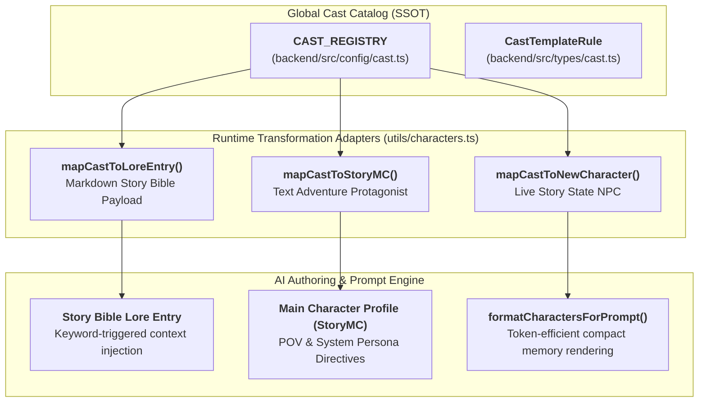

# Twistloom Cast Collection & Recruitment Architecture

**Document version:** 1.0.0  
**Status:** 💡 Implemented SSOT Registry & Core Mappings  
**Parent System:** [AI Co-Writing / Pen Architecture](./PEN_STORYTELLER_ARCHITECTURE.md) · [Story Bible Lore Architecture](./STORY_BIBLE_ARCHITECTURE.md)  
**Primary Strategic Roadmaps:** [Cast Collection & Recruitment Roadmap](../../../Twistloom-web/docs/roadmap/TWISTLOOM_CAST_COLLECTION_AND_RECRUITMENT_ROADMAP.md) · [Gacha vs Narrative Recruitment Analysis](../../../Twistloom-web/docs/roadmap/TWISTLOOM_GACHA_VS_NARRATIVE_RECRUITMENT_ANALYSIS.md)  
**Implementation Source Code:** [`Twistloom-backend/src/config/cast.ts`](../../src/config/cast.ts) · [`Twistloom-backend/src/types/cast.ts`](../../src/types/cast.ts) · [`Twistloom-backend/src/utils/characters.ts`](../../src/utils/characters.ts)

---

## 1. Executive Summary & Problem Statement

Twistloom provides an account-level **Character Collection and Recruitment Layer** that allows readers and authors to discover, unlock, and recruit narrative characters across the multiverse.

Unlike standard gacha or card games where collected entities merely possess numeric attack/defense attributes, Twistloom characters are **rich narrative catalysts**:
1. **Dual Utility Architecture:**
   - **Playable Protagonist (MC):** Selected in Step 2 of the creation wizard (`WriteModeCards.tsx`) for **Text Adventure** mode.
   - **Scene Cast & Lore Entity:** Imported into a book's **Story Bible** (`LoreEntry`) and toggled into drafts via `SceneCastPanel.tsx`.
2. **Immutable Catalog vs. Pinned Local Snapshot:**
   - Account ownership entitlements are global and server-authoritative.
   - When a character is added to a book, the engine creates an isolated, pinned local snapshot. Authors can freely adapt or rename local lore without altering the global template.



---

## 2. Core Data Model & Type Contract

Defined in [`Twistloom-backend/src/types/cast.ts`](../../src/types/cast.ts):

### 2.1 Multi-Dimensional High Value Framework

Star Tier in Twistloom represents **narrative weight, cognitive acuity, and plot disruption power**, rather than artificial combat stats:

```ts
export type StarTier = 4 | 5;

export interface CastHighValueMetrics {
  /** Cognitive acuity, analytical & deductive mastery (5★: 90-100 / IQ 150-170+). */
  intellect: number;
  /** Kinetic capability, tactical lethality, or institutional authority. */
  power: number;
  /** Charm, aesthetic elegance, handsomeness/prettiness, hypnotic presence. */
  magnetism: number;
  /** Psychological endurance against trauma, gaslighting, and horror. */
  resilience: number;
  /** Societal, organizational, or black-market reach. */
  influence: number;
  /** High-value narrative summary. */
  valueSummary: string;
}
```

### 2.2 Persona, Voice & Prompt Injection Schema

```ts
export interface CastTemplateRule {
  id: string;
  slug: string;
  starTier: StarTier;
  name: string;
  knownName: string;
  title: string;
  archetype: string;
  gender: 'male' | 'female' | 'non_binary';
  age: number;
  pronouns: CastPronouns;
  premise: string;
  biography: string;
  imagePrompt: string;
  highValueMetrics: CastHighValueMetrics;
  distinctCharacteristics: {
    languageStyle: string;
    slangAndCatchphrases: string[];
    hobbiesAndQuirks: string[];
    aestheticMotif: string;
  };
  psychologicalProfile: {
    motivation: string;
    flaw: string;
    fear: string;
    trauma: string;
    moralBoundaries: string[];
    secret: string;
  };
  voice: {
    summary: string;
    styleDirectives: string[];
    exampleLines: string[];
  };
  promptInjections: {
    systemDirective: string;
    dialogueGuardrails: string[];
    internalMonologueStyle: string;
  };
  signatureTwist: {
    triggerCondition: string;
    revelation: string;
    tensionThreshold: number;
  };
  goals: string[];
  fears: string[];
  flaws: string[];
  strengths: string[];
  boundaries: string[];
  narrativeHooks: string[];
  triggerKeywords: string[];
  compatibilityTags: string[];
  contentWarnings: string[];
  sourceType: 'platform' | 'creator' | 'licensed' | 'community';
  discoveryVisibility: 'public' | 'unlisted' | 'campaign_only';
  status: 'draft' | 'in_review' | 'published' | 'suspended' | 'withdrawn';
  version: number;
}
```

---

## 3. The 20 Launch Cast Templates (SSOT Roster)

Defined in [`Twistloom-backend/src/config/cast.ts`](../../src/config/cast.ts):

### 3.1 5-Star Complex Catalysts (5 Characters)

| Character ID | Name & Epithet | Archetype & Genre | Cognitive & Value Metrics | Distinctive Slang & Dialect | Idiosyncratic Hobbies & Quirks |
|---|---|---|---|---|---|
| `cast_mara_reyes_5s` | **Mara Reyes**<br/>*The Ghost-Weaver* | Memory Broker<br/>*(Cyberpunk Noir)* | **IQ 162** (Decryption)<br/>Power 84 · Mag 92 | *"synapse burn", "cold-buffer", "zero-ping tell"* | Restores 1980s magnetic cassette tapes with silver tweezers |
| `cast_aurelius_vance_5s` | **Dr. Aurelius Vance-Chen**<br/>*Lord Vane* | Mastermind Polymath<br/>*(Dark Academia)* | **IQ 170+** (Game Theory)<br/>Power 95 · Mag 94 | *"liquidation horizon", "zugzwang", "collateral calculus"* | Plays simultaneous blindfold speed chess against 4 algorithmic engines |
| `cast_seraphina_de_fontaine_5s` | **Lady Seraphina de Fontaine**<br/>*The Velvet Siren* | Bloodline Oracle<br/>*(Gothic Horror)* | **Supernatural Sight**<br/>Mag 99 · Infl 94 | *"mon cher", "blood-spindles", "a fleeting heartbeat"* | Cultivates bioluminescent venomous orchids in moonlit conservatory |
| `cast_kaelen_vexler_5s` | **Kaelen 'Null' Vexler**<br/>*The Voidblade* | Cybernetic Enforcer<br/>*(Transhuman Action)* | **Apex Kinetic (99)**<br/>Resilience 97 | *"threat delta zero", "flash-burn", "flatline vector"* | Metronome-timed blade assembly with eyes closed |
| `cast_ishtar_moradi_5s` | **Dr. Ishtar Moradi**<br/>*The Chrono-Alchemist* | Quantum Physicist<br/>*(Cosmic Sci-Fi)* | **IQ 168 Polymath**<br/>Temporal Intuition | *"entropy-drift", "light-cone echo", "in the yesterday you haven't lived"* | Hand-winds counter-clockwise chronometers; collects demolition dust |

### 3.2 4-Star Grounded Specialists (15 Characters)

1. **Dante 'Sparrow' Cruz** (`cast_dante_cruz_4s`) — *Lockpick Prodigy* (Heist): Keys to demolished doors; slang: *"clean breach"*.
2. **Dr. Evelyn 'Eve' Sinclair** (`cast_evelyn_sinclair_4s`) — *Forensic Toxicologist* (Mystery): **IQ 152**; presses nightshade petals; slang: *"post-mortem blush"*.
3. **Viktor 'Ironheart' Kozlov** (`cast_viktor_kozlov_4s`) — *Bouncer Philosopher* (Noir): Colossal power (94); woodcarves wolves; slang: *"heavy hands, quiet tongue"*.
4. **Lyra 'Glitch' Novak** (`cast_lyra_novak_4s`) — *Neon Netrunner* (Cyberpunk): **IQ 93**; mods vintage Game Boys; slang: *"daemon-bite", "raw packet leak"*.
5. **Father Thomas Callahan** (`cast_thomas_callahan_4s`) — *Defrocked Exorcist* (Supernatural): Vatican demonologist; restores 16th-century grimoires; slang: *"sanctum breach"*.
6. **Zhenya 'Ghost' Park** (`cast_zhenya_park_4s`) — *Deep-Cover Infiltrator* (Espionage): Master mimic (Mag 94); memorizes dictionaries while running; slang: *"protocol anomaly"*.
7. **Silas 'The Crow' Thorne** (`cast_silas_thorne_4s`) — *Curse Appraiser* (Urban Fantasy): Relic appraiser with runic monocle; collects mirrors without reflections; slang: *"a bargain in marrow"*.
8. **Captain Nadia Al-Mansoor** (`cast_nadia_al_mansoor_4s`) — *Sky Dreadnought Pilot* (Space Western): Sub-orbital navigator (Power 88, Res 92); hand-charts leather star maps; slang: *"burn the gimbal"*.
9. **Milo 'Cricket' Chen** (`cast_milo_chen_4s`) — *Clockwork Savant* (Steampunk): **IQ 158** micro-inventor; builds mechanical fireflies; slang: *"gear-slip", "harmonic chatter"*.
10. **Rowan 'The Briar' Blackwood** (`cast_rowan_blackwood_4s`) — *Hermit Tracker* (Wilderness): Scent tracker with dire-wolf bond (Res 98); whittles infrasound bone flutes; slang: *"scent-trail cold"*.
11. **Baroness Claudia von Hesse** (`cast_claudia_von_hesse_4s`) — *Disgraced Diplomat* (Court Intrigue): High-court poisoner (Infl 90); breeds venomous scorpions; slang: *"how delightfully provincial"*.
12. **Kai 'Echo' Tanaka** (`cast_kai_tanaka_4s`) — *Memory Hacker* (Cyberpunk): Sound hacker; samples thunderstorms for lo-fi tracks; slang: *"sub-bass resonance"*.
13. **Astrid 'Valkyrie' Lindqvist** (`cast_astrid_lindqvist_4s`) — *Combat Medic & Demolitions* (Military): Field trauma surgeon (Power 93, Res 95); stopwatches & C4; slang: *"blast radius clear"*.
14. **Corvin 'The Grifter' Vance** (`cast_corvin_vance_4s`) — *Master Illusionist* (Victorian Heist): Mag 95 con architect; designs ebony puzzle boxes; slang: *"the prestige", "palm the queen"*.
15. **Saffron 'Fable' Sterling** (`cast_saffron_sterling_4s`) — *Investigative Journalist* (Noir): **IQ 148** reporter; develops 35mm film in bathroom darkroom; slang: *"stop the press", "follow the paper trail"*.

---

## 4. Runtime Transformation & Adapter Functions

Implemented in [`Twistloom-backend/src/utils/characters.ts`](../../src/utils/characters.ts):

### 4.1 Story Bible Import Adapter (`mapCastToLoreEntry`)
Transforms a template into a canonical `LoreEntryInput`:
```ts
export function mapCastToLoreEntry(cast: CastTemplateRule): LoreEntryInput {
  const sections = [
    `**Archetype:** ${cast.title} (${cast.starTier}★ · ${cast.archetype})`,
    `**Premise:** ${cast.premise}`,
    `**Value & Acuity:** ${cast.highValueMetrics.valueSummary}`,
    `**Speech & Slang:** ${cast.distinctCharacteristics.languageStyle} — Slang: *${cast.distinctCharacteristics.slangAndCatchphrases.join(', ')}*.`,
    `**Hobbies & Quirks:** ${cast.distinctCharacteristics.hobbiesAndQuirks.join('; ')}`,
    `**Voice Directives:**\n${cast.voice.styleDirectives.map((d) => `- ${d}`).join('\n')}`,
    `**Trauma & Secret:** ${cast.psychologicalProfile.trauma} Secret: ${cast.psychologicalProfile.secret}`,
  ];

  return {
    entryType: 'character',
    name: cast.name,
    description: sections.join('\n\n'),
    triggerKeywords: cast.triggerKeywords,
    imageUrl: null,
  };
}
```

### 4.2 Protagonist (MC) Wizard Adapter (`mapCastToStoryMC`)
Transforms a template into a `StoryMC` profile:
```ts
export function mapCastToStoryMC(cast: CastTemplateRule): StoryMC {
  return {
    name: cast.name,
    knownName: cast.knownName,
    gender: cast.gender,
    age: cast.age,
    bio: `${cast.title} (${cast.starTier}★ ${cast.archetype}) — ${cast.premise} Motivation: ${cast.psychologicalProfile.motivation}`,
  };
}
```

### 4.3 Story State NPC Adapter (`mapCastToNewCharacter`)
Transforms a template into a live `NewCharacter` object:
```ts
export function mapCastToNewCharacter(
  cast: CastTemplateRule,
  options?: { placeId?: string; relationshipContext?: string }
): NewCharacter {
  return {
    characterId: cast.slug.replace(/-/g, '_'),
    realName: cast.name,
    knownName: cast.knownName,
    gender: cast.gender,
    role: cast.title,
    importance: cast.starTier === 5 ? 'major' : 'supporting',
    status: 'active',
    recognitionLevel: 'first_name_known',
    bio: cast.premise,
    appearance: `${cast.distinctCharacteristics.aestheticMotif}. ${cast.distinctCharacteristics.hobbiesAndQuirks[0] || ''}`,
    secrets: [cast.psychologicalProfile.secret],
    potentialTwist: cast.starTier === 5 ? 'identity' : 'none',
    relationshipToMC: {
      type: 'stranger',
      status: 'neutral',
      recognitionLevel: 'first_name_known',
      context: options?.relationshipContext || cast.narrativeHooks[0] || 'Recently crossed paths',
    },
    traits: [
      `speech: ${cast.distinctCharacteristics.languageStyle}`,
      `slang: ${cast.distinctCharacteristics.slangAndCatchphrases.slice(0, 3).join(', ')}`,
      `hobby: ${cast.distinctCharacteristics.hobbiesAndQuirks[0]}`,
      `high_value: ${cast.highValueMetrics.valueSummary}`,
    ],
  };
}
```

---

## 5. Token-Efficient Prompt Rendering (`formatCharactersForPrompt`)

When `formatCharactersForPrompt` processes characters in active story memory, it packs these mapped fields into standard bullet blocks with minimal token consumption:

```text
· Mara (The Ghost-Weaver & Memory Broker, major) - female [suspicious, has secret] - [ID: mara_reyes]
  - Real name: "Mara Reyes" (Recognition: first_name_known)
  - Bio: A cynical neuro-broker who trades in stolen, decrypted human memories while fighting off synthetic cognitive corruption.
  - Visual description: Scent of ozone and damp rain; flickering cyan phosphor lights; sleek obsidian hardware. Restores antique 1980s magnetic cassette tapes using silver jeweler's tweezers.
  - Introduced at page: 1
  - Relationship to MC: (stranger - neutral - first_name_known) Brought in to extract a dying informant's final secret
  - Secrets (spoiler, don't reveal too early):
    → She holds the master cryptographic decryption key to the city's central neural mainframe inside a quarantined sector of her own hippocampus.
  - Narrative mechanics: potential twist: identity
  - Physical state: healthy, active
  - Traits:
    → speech: Cynical, fast-paced, and laden with neuro-telemetry and data-routing metaphors. Speaks in sharp, analytical bursts with underlying emotional vigilance.
    → slang: synapse burn, cold-buffer, zero-ping tell
    → hobby: Restores antique 1980s magnetic cassette tapes using silver jeweler's tweezers.
    → high_value: Possesses quantum neuro-cognitive decryption capabilities (IQ 162 equivalent), command over black-market neural networks, and profound psychological insight into human behavioral vulnerabilities.
```

---

## 6. Verification & Type Integrity

The entire registry and utility suite is covered by TypeScript compiler checks:
```bash
bun run typecheck # bunx tsc --noEmit -> 0 errors
```
