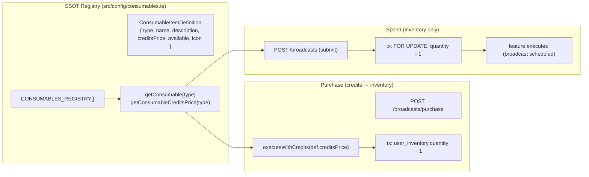

# Twistloom Consumable Items Architecture

**Document version:** 1.0.0  
**Status:** 💡 Implemented (SSOT Registry + Inventory Table)  
**Parent System:** [Broadcast (📣 Megaphone) Architecture](./BROADCAST_ARCHITECTURE.md) · [Payments & Credits Architecture](../architecture/PAYMENTS_ARCHITECTURE_BACKEND.md)  
**Implementation Source Code:** [`src/config/consumables.ts`](../../src/config/consumables.ts) · [`src/types/broadcast.ts`](../../src/types/broadcast.ts) · [`src/db/schema.ts`](../../src/db/schema.ts) · [`src/services/broadcast.ts`](../../src/services/broadcast.ts)

---

## 1. Executive Summary & Problem Statement

Twistloom needs **purchasable, credit-bought consumables** — items a user owns in a persistent inventory and later *spends* to unlock a feature (today: the 📣 Megaphone that powers a global broadcast). The architecture must:

1. **Keep a single source of truth (SSOT) for item metadata** — name, description, credit price, availability — decoupled from the credits config and from any per-item database table.
2. **Store ownership generically** — one `user_inventory` table keyed by `(user_id, item_type)` supports unlimited future consumables without new migrations per item.
3. **Separate purchase from spend** — buying debits credits; spending only decrements inventory. A feature that consumes an item never charges credits a second time.

This mirrors the catalogue pattern already proven by `CAST_REGISTRY` (`src/config/cast.ts`): static definitions live in a config registry; runtime state lives in a generic table.



---

## 2. Registry (SSOT)

Defined in [`src/config/consumables.ts`](../../src/config/consumables.ts).

### 2.1 `ConsumableItemDefinition`

```ts
export interface ConsumableItemDefinition {
  type: InventoryItemType;   // stable inventory key, matches the type union
  name: string;              // display name (emoji-friendly)
  description: string;       // user-facing description
  creditsPrice: number;      // credit cost to buy ONE unit — SSOT for price
  available: boolean;        // false = hidden / not purchasable
  icon?: string;             // optional glyph
  maxPerUser?: number;       // optional purchase cap (undefined = unlimited)
}
```

### 2.2 `CONSUMABLES_REGISTRY`

The array of all purchasable consumables. Ordered by display priority. Adding a new item means:

1. Add the key to `InventoryItemType` (in `src/types/broadcast.ts`).
2. Add a `ConsumableItemDefinition` entry here.

```ts
export const CONSUMABLES_REGISTRY: ConsumableItemDefinition[] = [
  {
    type: "megaphone",
    name: "📣 Megaphone",
    description:
      "Broadcast a short message to every reader for a few seconds. Runs AI moderation before it goes live.",
    creditsPrice: 100,
    available: true,
    icon: "📣",
  },
];
```

### 2.3 Lookup helpers

- `CONSUMABLES_BY_TYPE: Record<InventoryItemType, ConsumableItemDefinition>` — O(1) lookup.
- `getConsumable(type)` — throws on unknown type (defensive: registry must stay in sync with `InventoryItemType`).
- `getConsumableCreditsPrice(type)` — returns the registry price (free-demo handling applied upstream by `getCreditCostForUser`).

> **Why the price lives here, not in `CREDIT_COSTS_BASE`:** `CREDIT_COSTS_BASE` enumerates *direct* credit costs of actions. A consumable's price is item metadata, and embedding it there would create a second source of truth. `executeWithCredits` accepts a **numeric** cost, so `purchaseConsumable` passes `def.creditsPrice` directly — keeping the registry authoritative.

---

## 3. Inventory Data Model

Defined in [`src/db/schema.ts`](../../src/db/schema.ts) as `user_inventory`.

| Column | Type | Notes |
|--------|------|-------|
| `id` | uuid PK | |
| `user_id` | uuid FK → `users` (cascade) | Owner |
| `item_type` | `InventoryItemType` (`text`) | `"megaphone"` today; extensible |
| `quantity` | integer (default 0) | Owned count |
| `last_purchased_at` | timestamptz | Set on each increment (purchase analytics) |
| `created_at` / `updated_at` | timestamptz | |

Constraints:
- `unique("user_inventory_user_type_unique")` on `(user_id, item_type)` — one row per user per item.
- `index("user_inventory_user_idx")` on `user_id` for fast balance reads.

`InventoryItemType` (in `src/types/broadcast.ts`) is the only thing that ties the generic table to the registry:

```ts
export type InventoryItemType = "megaphone";
```

---

## 4. Purchase Flow (credits → inventory)

Implemented in `purchaseConsumable(userId, itemType?)` (and the `purchaseMegaphone` convenience wrapper) in [`src/services/broadcast.ts`](../../src/services/broadcast.ts).

1. `getConsumable(itemType)` — resolves the definition; throws if `available === false`.
2. `executeWithCredits(userId, def.creditsPrice, async (tx) => { … }, { context: "consumable_purchase", metadata: { itemType } })`
   - `executeWithCredits` acquires the row-level lock on `users.credits`, deducts `def.creditsPrice` (honouring `FEATURE_FREE_DEMO` / `isDemoUser` → 0), and runs the callback in the **same Postgres transaction**.
3. Inside the callback: `INSERT … ON CONFLICT (user_id, item_type) DO UPDATE SET quantity = quantity + 1, last_purchased_at = now()`. This is idempotent and atomic.
4. Returns the new `quantity`.

If the inventory write throws, `executeWithCredits` rolls back the **entire** transaction — both the credit deduction *and* the inventory mutation — so a failed purchase never silently costs credits. Activity logging (if added) stays outside the transaction per the credits pattern.

```mermaid
sequenceDiagram
    participant C as Client
    participant S as purchaseConsumable
    participant CR as executeWithCredits
    participant DB as Postgres

    C->>S: purchaseConsumable(user, "megaphone")
    S->>S: getConsumable → creditsPrice (100)
    S->>CR: executeWithCredits(user, 100, tx)
    CR->>DB: BEGIN; lock users.credits row
    CR->>DB: UPDATE users SET credits = credits - 100
    CR->>DB: INSERT user_inventory … ON CONFLICT DO UPDATE qty+1
    CR->>DB: COMMIT
    CR-->>S: new quantity
    S-->>C: { megaphones: N }
```

---

## 5. Spend Flow (inventory only)

When a feature consumes an item, it **never touches credits**. Example: `submitBroadcast` in the broadcast service.

1. Ownership check (read): `getUserItemCount(userId, "megaphone") >= 1`.
2. Inside `dbWrite.transaction(async (tx) => { … })`:
   - `SELECT … FROM user_inventory WHERE user_id=? AND item_type=? FOR UPDATE` — locks the row so concurrent submits cannot double-spend.
   - If `quantity < 1` → throw `no_megaphone` (no write, no credit impact).
   - `UPDATE user_inventory SET quantity = quantity - 1` — the only mutation for the spend.
   - Perform the feature action (insert the `broadcasts` row).
3. Return remaining count.

Because the decrement and the feature write share one transaction, a failure after the decrement rolls back both — the item is returned automatically (no separate refund path).

> **Key property:** a rejected broadcast (failed Gate 2 moderation) throws *before* entering the spend transaction, so the 📣 Megaphone is never consumed. There is no "refund on rejection" code path — consumption only happens on success.

---

## 6. Extending with a New Consumable

1. Add the key to `InventoryItemType` in `src/types/broadcast.ts`.
2. Append a `ConsumableItemDefinition` to `CONSUMABLES_REGISTRY` in `src/config/consumables.ts` (set `creditsPrice`, `name`, `description`, `available`).
3. Add a purchase wrapper if the item has a dedicated route, or reuse `purchaseConsumable(userId, newType)`.
4. Implement the spend: a read-ownership check + a `FOR UPDATE` decrement inside a transaction, exactly like `submitBroadcast`.

No `user_inventory` schema migration is needed — the table is already generic. (A new `broadcasts`-style *feature* table may still be required for the item's effect, but ownership never changes shape.)

---

## 7. Security & Integrity Notes

- **Atomicity:** both purchase (credits+inventory) and spend (inventory+feature) are single-transaction. Half-applied states are impossible.
- **Locking:** `FOR UPDATE` on the inventory row prevents double-spend under concurrency (e.g. two rapid submits).
- **Authoritative price:** price is read from the registry at purchase time; it cannot drift from a stale constant.
- **Demo safety:** `executeWithCredits` resolves the numeric price through `getCreditCostForUser`, so demo users pay `0` credits (they still consume an owned item when spending).
- **Banned users:** callers (e.g. broadcast) must check `users.bannedAt` before allowing purchase *and* spend; the inventory layer itself is permission-agnostic.
