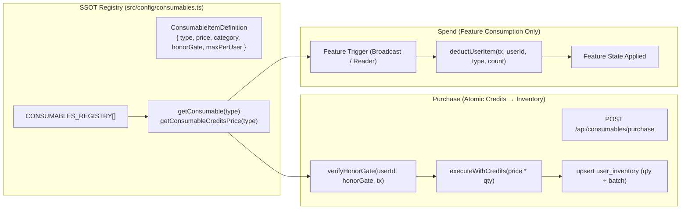

# Twistloom Consumable Items & Inventory Architecture (Backend SSOT)

**Document version:** 2.1.0  
**Status:** 💡 Implemented & Production Ready (SSOT Registry + Generic Inventory Ledger + Dual-Gate Scribe's Vault + Dedicated Service & Routes for All 4 Exploration/Tribute Consumables)  
**Parent System:** [Payments & Credits Architecture](../architecture/PAYMENTS_ARCHITECTURE_BACKEND.md) · [Broadcast (📣 Megaphone) Architecture](./BROADCAST_ARCHITECTURE.md)  
**Companion Frontend Docs:**
- [The Emporium Storefront Architecture](../../../Twistloom-web/docs/architecture/STOREFRONT_ARCHITECTURE.md) — Frontend catalog UI, tab filtering, anti-CLS modals, localization, and try-on preview
- [Economy Sinks & Cosmetics Architecture](../../../Twistloom-web/docs/architecture/ECONOMY_SINKS_AND_COSMETICS_ARCHITECTURE.md) — Anti-inflation economic model, Dual-Gate zero-trust proof, 16-frame taxonomy
- [Store Items Implementation Roadmap](../../../Twistloom-web/docs/roadmap/STORE_ITEMS_IMPLEMENTATION_ROADMAP.md) — Verified end-to-end implementation specifications for all 4 exploration tools and curator quills

**Implementation Source Code:**
- Registry SSOT: [`src/config/consumables.ts`](../../src/config/consumables.ts)
- Types: [`src/types/consumable.ts`](../../src/types/consumable.ts)
- Schemas: [`src/db/schema.ts`](../../src/db/schema.ts) (`user_inventory`, `user_story_anchors`, `user_sessions.prism_pages_remaining`, `book_testimonials.curator_quill`)
- Services: [`src/services/consumables.ts`](../../src/services/consumables.ts) · [`src/services/easter-eggs.ts`](../../src/services/easter-eggs.ts)
- Endpoints: [`src/routes/consumables.ts`](../../src/routes/consumables.ts) · [`src/routes/easter-eggs.ts`](../../src/routes/easter-eggs.ts) · [`src/routes/books.ts`](../../src/routes/books.ts) · [`src/routes/user.ts`](../../src/routes/user.ts) (`/inventory`)

---

## 1. Executive Summary & Architecture Scope

Twistloom requires a resilient, extensible architecture for **credit-bought, inventory-backed consumables and cosmetics**. Users spend virtual credits to acquire items in a persistent inventory, and later *spend* them to trigger narrative exploration mechanics, social tributes, global broadcasts, or profile avatar customizations.

### Division of Responsibilities Between Architecture Docs

| Responsibility Domain | Authoritative Document | Repository |
|-----------------------|------------------------|------------|
| **Backend SSOT, Ledger & Concurrency:** Database schema (`user_inventory`), row locking, `executeWithCredits` atomicity, server-side dual-gate enforcement, batch purchase, spend transactions | **`CONSUMABLE_ITEMS_ARCHITECTURE.md`** *(This Document)* | `Twistloom-backend` |
| **Frontend Storefront & User Experience:** The Emporium UI (`/dashboard/store`), category tabs, `StoreItemHeader`, `PurchaseModal` anti-CLS portal pattern, try-on modal, `dashboard.items` localization | [`STOREFRONT_ARCHITECTURE.md`](../../../Twistloom-web/docs/architecture/STOREFRONT_ARCHITECTURE.md) | `Twistloom-web` |
| **Economic Sink Modeling & Frame Taxonomy:** Inflow/outflow velocity, deflationary sinks, 16-avatar frame coordinate specs, narrative titles | [`ECONOMY_SINKS_AND_COSMETICS_ARCHITECTURE.md`](../../../Twistloom-web/docs/architecture/ECONOMY_SINKS_AND_COSMETICS_ARCHITECTURE.md) | `Twistloom-web` |
| **Exploration & Tribute Consumables Execution:** Step-by-step verified engineering specifications for Compass, Anchor, Prism, and Quill | [`STORE_ITEMS_IMPLEMENTATION_ROADMAP.md`](../../../Twistloom-web/docs/roadmap/STORE_ITEMS_IMPLEMENTATION_ROADMAP.md) | `Twistloom-web` |

### Core Architecture Pillars

1. **Single Source of Truth (SSOT) Registry:** All item metadata (name, description, credit price, availability, category, honorGate, maxPerUser) lives in `CONSUMABLES_REGISTRY` (`src/config/consumables.ts`). Prices never duplicate across config constants.
2. **Generic Inventory Ledger:** A single `user_inventory` table keyed by `(user_id, item_type)` supports all items without requiring per-item DDL migrations.
3. **Strict Separation of Purchase vs. Spend:** Purchasing charges credits and increments inventory. Spending decrements inventory inside feature transactions and never debits credits again.
4. **Server-Enforced Dual-Gate:** Narrative honor gates (milestone counters) are validated inside the transaction lock before credits are debited.



---

## 2. Registry (SSOT)

Defined in [`src/config/consumables.ts`](../../src/config/consumables.ts) and [`src/types/consumable.ts`](../../src/types/consumable.ts).

### 2.1 `ConsumableItemDefinition`

```typescript
export type ConsumableCategory = 'broadcast' | 'exploration' | 'vault' | 'tribute';

export interface ConsumableHonorGate {
  metric: string;      // metric tracked in user_counters (e.g. "pagesRead")
  threshold: number;   // minimum value required to unlock
  description: string; // user-facing requirement explanation
}

export interface ConsumableItemDefinition {
  type: InventoryItemType;   // stable inventory key (SSOT union)
  name: string;              // display name (fallback if translation missing)
  description: string;       // user-facing description
  creditsPrice: number;      // credit cost to buy ONE unit — SSOT for price
  available: boolean;        // false = hidden / not purchasable
  accountBound: boolean;     // true if non-transferable / bound to account
  icon?: string;             // emoji glyph
  category?: ConsumableCategory; // store & inventory tab filter
  maxPerUser?: number;       // optional cap (e.g. 1 for avatar frames)
  honorGate?: ConsumableHonorGate; // narrative feat requirement (Dual-Gate)
}
```

### 2.2 Active Catalog Entries

```typescript
export const CONSUMABLES_REGISTRY: ConsumableItemDefinition[] = [
  // ── Broadcast & Core Utilities ──
  {
    type: "megaphone",
    name: "Megaphone",
    description: "Broadcast a short message to every reader for a few seconds. Runs AI moderation before it goes live.",
    creditsPrice: 100,
    available: true,
    accountBound: false,
    icon: "📣",
    category: "broadcast",
  },
  {
    type: "easter_egg",
    name: "Easter Egg",
    description: "A mysterious egg uncovered from the depths of a story. Crack it open to reveal credits, consumables, or rare lore rewards.",
    creditsPrice: 0,
    available: false,
    accountBound: true,
    icon: "🥚",
    category: "exploration",
  },

  // ── Narrative Exploration Utilities (Step 10 Pillar 1) ──
  {
    type: "item_divergence_compass",
    name: "Divergence Compass",
    description: "A delicate brass astrolabe that senses shifting probabilities. Highlights whether upcoming choices lead to unexplored vs visited timelines.",
    creditsPrice: 40,
    available: true,
    accountBound: false,
    icon: "🧭",
    category: "exploration",
  },
  {
    type: "item_memory_anchor",
    name: "Memory Anchor",
    description: "Crystallized temporal quartz. Anchors your consciousness to a decision fork, allowing instant returns without re-reading from chapter start.",
    creditsPrice: 60,
    available: true,
    accountBound: false,
    icon: "⚓",
    category: "exploration",
  },
  {
    type: "item_resonance_prism",
    name: "Resonance Prism",
    description: "An amethyst prism tuned to the multiverse. Increases Easter Egg and thread fragment discovery rates (+50%) for your next 15 pages.",
    creditsPrice: 35,
    available: true,
    accountBound: false,
    icon: "🔮",
    category: "exploration",
  },
  {
    type: "item_curator_quill",
    name: "Curator's Quill",
    description: "Gilded scribe feather. Endorses an author on the Wall with a radiant golden calligraphy glow and tips 35 credits to their wallet.",
    creditsPrice: 50,
    available: true,
    accountBound: false,
    icon: "✒️",
    category: "tribute",
  },

  // ── Scribe's Vault: Dual-Gated Avatar Frames (Step 10 Pillar 3) ──
  {
    type: "cyber_grid",
    name: "Cyber Grid Frame",
    description: "A pulsing cyan neon circuitry frame for readers who walk the bleeding edge of synthetic realities.",
    creditsPrice: 150,
    available: true,
    accountBound: true,
    maxPerUser: 1,
    icon: "⚡",
    category: "vault",
    honorGate: {
      metric: "pagesRead",
      threshold: 30,
      description: "Read at least 30 chapters or pages across the Loom.",
    },
  },
  {
    type: "gothic_bramble",
    name: "Gothic Bramble Frame",
    description: "Entwined thorned iron vines studded with dark crimson blood-roses. Borne only by those who flirt with disaster.",
    creditsPrice: 200,
    available: true,
    accountBound: true,
    maxPerUser: 1,
    icon: "🥀",
    category: "vault",
    honorGate: {
      metric: "highRiskChoicesTaken",
      threshold: 3,
      description: "Survive at least 3 high-risk perilous decisions.",
    },
  },
  {
    type: "astral_void",
    name: "Astral Void Frame",
    description: "A deep indigo cosmic event-horizon with shimmering constellation lines, reflecting mastery over alternate truths.",
    creditsPrice: 250,
    available: true,
    accountBound: true,
    maxPerUser: 1,
    icon: "🌌",
    category: "vault",
    honorGate: {
      metric: "alternateEndingsDiscovered",
      threshold: 3,
      description: "Discover at least 3 alternate endings in completed stories.",
    },
  },
  {
    type: "ancient_runes",
    name: "Ancient Runes Frame",
    description: "Weathered granite glyphs inscribed with radiant ancient runes, granted to chroniclers who untangle intricate conspiracies.",
    creditsPrice: 300,
    available: true,
    accountBound: true,
    maxPerUser: 1,
    icon: "ᚱ",
    category: "vault",
    honorGate: {
      metric: "threadsResolved",
      threshold: 5,
      description: "Bring at least 5 complex narrative threads to ultimate closure.",
    },
  },
];
```

### 2.3 Lookup Helpers

- `CONSUMABLES_BY_TYPE: Record<InventoryItemType, ConsumableItemDefinition>` — $O(1)$ constant-time dictionary.
- `getConsumable(type)` — Resolves the item definition; defensively throws if unknown.
- `getConsumableCreditsPrice(type)` — Returns authoritative credit cost per unit.

---

## 3. Inventory Data Model

Defined in [`src/db/schema.ts`](../../src/db/schema.ts) as `user_inventory`.

| Column | Type | Constraints / Defaults | Description |
|--------|------|------------------------|-------------|
| `id` | `uuid` | Primary Key (`defaultRandom()`) | Row identifier |
| `user_id` | `uuid` | Foreign Key → `users.id` (ON DELETE CASCADE) | Owner of the inventory item |
| `item_type` | `text` | NOT NULL | Type matching `InventoryItemType` |
| `quantity` | `integer` | NOT NULL, Default: `0` | Owned count |
| `last_purchased_at` | `timestamptz` | Nullable | Timestamp of latest increment |
| `created_at` | `timestamptz` | NOT NULL, Default: `now()` | Record creation timestamp |
| `updated_at` | `timestamptz` | NOT NULL, Default: `now()` | Record update timestamp |

### Indexes & Constraints

- **Unique Compound Constraint:** `unique("user_inventory_user_type_unique").on(table.userId, table.itemType)` — Exactly one row per user per item type. Prevents row explosion.
- **Owner Lookup Index:** `index("user_inventory_user_idx").on(table.userId)` — Optimizes fast inventory scans for `GET /api/user/inventory`.

```typescript
export type InventoryItemType =
  | "megaphone"
  | "easter_egg"
  | "item_divergence_compass"
  | "item_memory_anchor"
  | "item_resonance_prism"
  | "item_curator_quill"
  | "cyber_grid"
  | "gothic_bramble"
  | "astral_void"
  | "ancient_runes";
```

---

## 4. Purchase Flow & Concurrency Engine

Implemented in `purchaseConsumableBatch` in [`src/services/consumables.ts`](../../src/services/consumables.ts) and exposed via `POST /api/consumables/purchase` in [`src/routes/consumables.ts`](../../src/routes/consumables.ts).

### Step-by-Step Purchase Pipeline

1. **Input Validation:** Ensure `itemType` is a valid registered key, `available === true`, and `quantity` is an integer in range $[1, 99]$.
2. **Dual-Gate Verification (`verifyHonorGate`):**
   - If the item defines an `honorGate`, query `user_counters` for `userId`.
   - Verify `user_counters[honorGate.metric] >= honorGate.threshold`.
   - Throw HTTP 403 Forbidden with exact progress if locked.
3. **Transaction Locking (`executeWithCredits`):**
   - Acquire row-level lock on `users.credits` row (`FOR UPDATE`).
   - Re-verify credit balance $\ge \text{creditsPrice} \times \text{quantity}$.
   - Debit `totalCost` credits from user balance.
4. **Per-User Cap Enforcement (`maxPerUser`):**
   - If `maxPerUser` is defined (e.g. 1 for Vault Frames), query `user_inventory` inside the transaction lock (`FOR UPDATE`).
   - If `currentQuantity + quantity > maxPerUser`, reject and roll back.
5. **Atomic Inventory Upsert:**
   - Execute Postgres atomic `INSERT INTO user_inventory ... ON CONFLICT (user_id, item_type) DO UPDATE SET quantity = user_inventory.quantity + EXCLUDED.quantity, last_purchased_at = now()`.
6. **Auto-Rollback Guarantee:**
   - If any step inside the callback fails, `executeWithCredits` automatically aborts and rolls back the database transaction. Credits are never debited if the inventory write fails.

```mermaid
sequenceDiagram
    participant C as Client (Web)
    participant R as POST /api/consumables/purchase
    participant S as purchaseConsumableBatch
    participant G as verifyHonorGate
    participant CR as executeWithCredits
    participant DB as PostgreSQL

    C->>R: { itemType: "cyber_grid", quantity: 1 }
    R->>S: purchaseConsumableBatch(userId, "cyber_grid", 1)
    S->>G: Check user_counters.pagesRead >= 30
    G-->>S: OK (Honor Gate Met)
    S->>CR: executeWithCredits(userId, 150, callback)
    CR->>DB: BEGIN; SELECT credits FROM users FOR UPDATE
    CR->>DB: UPDATE users SET credits = credits - 150
    CR->>S: Invoke callback(tx)
    S->>DB: SELECT quantity FROM user_inventory FOR UPDATE (maxPerUser check)
    S->>DB: INSERT ... ON CONFLICT DO UPDATE quantity = quantity + 1
    CR->>DB: COMMIT
    CR-->>S: Return new quantity (1)
    S-->>R: { itemType, quantity: 1, purchased: 1 }
    R-->>C: HTTP 200 OK
```

---

## 5. Spend Flow & Double-Spend Prevention

When a feature consumes an item, it **never touches credits**. Implemented in `deductUserItem` in [`src/services/consumables.ts`](../../src/services/consumables.ts):

```typescript
export async function deductUserItem(
  tx: DBTransaction,
  userId: string,
  itemType: InventoryItemType,
  amount: number = 1,
): Promise<number> {
  const [item] = await tx
    .select({ id: userInventory.id, quantity: userInventory.quantity })
    .from(userInventory)
    .where(and(eq(userInventory.userId, userId), eq(userInventory.itemType, itemType)))
    .for("update")
    .limit(1);

  if (!item || item.quantity < amount) {
    const def = getConsumable(itemType);
    throw new Error(`Insufficient ${def.name}. You own ${item?.quantity ?? 0}, but ${amount} is required.`);
  }

  const remaining = item.quantity - amount;

  await tx
    .update(userInventory)
    .set({ quantity: remaining, updatedAt: new Date() })
    .where(eq(userInventory.id, item.id));

  return remaining;
}
```

### Key Spend Invariants

1. **Row-Level Concurrency Guard:** `SELECT ... FOR UPDATE` locks the user's specific inventory row. Two simultaneous spend requests (e.g. double-tapping "Broadcast" or "Drop Anchor") are serialized; the second will observe the decremented balance and cleanly reject.
2. **Atomic Feature Integration:** The caller passes its active `tx` transaction into `deductUserItem`. If the downstream feature action fails (e.g. broadcast moderation rejection, network drop), the entire transaction aborts and the item is returned automatically. No compensation or refund code paths are necessary.

---

## 5.3 Feature Spend Integrations (Production Specifications)

All four exploration and tribute consumables are fully operational via dedicated backend services and routes:

### 5.3.1 🧭 Divergence Compass (`item_divergence_compass`)
- **Endpoint:** `POST /api/consumables/divergence-check` (`src/routes/consumables.ts`)
- **Service:** `checkDivergence(userId, bookId, pageId)` (`src/services/consumables.ts`)
- **Execution Mechanism:**
  1. Inspects the current page's branching choices and extracts their destination page IDs.
  2. Queries `userPageProgress` for the reader in the specified book to determine which destinations have never been recorded.
  3. Inside a database transaction, calls `deductUserItem(tx, userId, 'item_divergence_compass', 1)`.
  4. Returns `{ success: true, unexploredActionIndices, unexploredActionTexts, remainingCompasses }`.

### 5.3.2 ⚓ Memory Anchor (`item_memory_anchor`)
- **Schema:** Dedicated `user_story_anchors` table (`src/db/schema.ts`) with composite indexes on `(userId, bookId)` and `(userId, pageId)`.
- **Endpoints:** (`src/routes/consumables.ts`)
  - `POST /api/consumables/anchors` — plants a return anchor at the current fork
  - `GET /api/consumables/anchors?bookId=...` — queries active anchors for the book
  - `DELETE /api/consumables/anchors/:anchorId` — removes a planted anchor
- **Service:** `dropMemoryAnchor`, `getStoryAnchors`, `deleteStoryAnchor` (`src/services/consumables.ts`)
- **Eviction Invariant:** Maximum 3 anchors per `(userId, bookId)`. If 3 anchors exist when dropping a new anchor, the oldest anchor is automatically pruned inside the transaction before inserting the new anchor and executing `deductUserItem(tx, userId, 'item_memory_anchor', 1)`.

### 5.3.3 🔮 Resonance Prism (`item_resonance_prism`)
- **Schema:** `user_sessions.prism_pages_remaining` (`integer`, default 0) in `src/db/schema.ts`.
- **Endpoints:** (`src/routes/easter-eggs.ts`)
  - `POST /api/easter-eggs/prism/activate` — activates a prism for the book session
  - `GET /api/easter-eggs/prism/status?bookId=...` — checks active status and pages remaining
- **Service:** `activateResonancePrism`, `getResonancePrismStatus` (`src/services/easter-eggs.ts`)
- **Dynamic Drop Multiplier:** In `rollAndAwardEasterEgg` (`src/services/easter-eggs.ts`), if `session.prismPagesRemaining > 0`, the Easter Egg roll threshold is boosted by $1.5\times$ (+50% probability boost), and `prismPagesRemaining` is automatically decremented by 1 per page turn.

### 5.3.4 🪶 Curator's Quill (`item_curator_quill`)
- **Schema:** `book_testimonials.curator_quill` (`boolean`, default false) in `src/db/schema.ts`.
- **Endpoint:** `POST /api/books/:identifier/testimonials` (`src/routes/books.ts`)
- **Execution Mechanism:**
  1. Accepts optional payload parameter `useCuratorQuill: boolean`.
  2. When enabled, executes an atomic PostgreSQL transaction:
     - Deducts 1 `item_curator_quill` via `deductUserItem(tx, userId, 'item_curator_quill', 1)`.
     - Credits $+35$ credits directly to the author's `creator_wallets` balance (and initializes wallet row if absent).
     - Inserts the testimonial with `curatorQuill: true`.
  3. All testimonial queries select `curatorQuill` to drive client gold badges and radiant borders.

---

## 6. Extending with a New Consumable

Adding a new consumable requires zero database schema changes:

1. **Register Item Key:** Add the new key to `InventoryItemType` in `src/types/consumable.ts`.
2. **Define Metadata in Registry:** Append a `ConsumableItemDefinition` in `src/config/consumables.ts` (`creditsPrice`, `category`, `available`, `accountBound`, optional `honorGate` and `maxPerUser`).
3. **Frontend Localization & Categorization:**
   - Add translation in `messages/en.json` and `messages/id.json` under `dashboard.items.<type>`.
   - Add to `CONSUMABLE_ITEM_TYPES`, `VAULT_FRAME_TYPES`, or `TRIBUTE_ITEM_TYPES` in `Twistloom-web/src/lib/config/consumables.ts`.
4. **Implement Spend Hook:** In the consuming feature service, wrap the feature write and `deductUserItem(tx, userId, type, 1)` in a single transaction.

---

## 7. Security, Rate Limiting & Zero-Trust Metadata

- **Purchase Rate Limiting:** Protected by `rateLimit(CONSUMABLE_PURCHASE_RATE_LIMIT)` (`src/config/ai-rate-limits.js`) preventing credit drainage bots or rapid race attempts.
- **Zero-Trust Client State:** The frontend displays honor gate progress from `user.stats`, but the backend strictly re-queries `user_counters` from the authoritative PostgreSQL database inside the transaction lock.
- **Demo Mode Isolation:** `executeWithCredits` resolves costs via `getCreditCostForUser`, ensuring demo accounts pay $0$ credits while properly consuming inventory rows upon feature execution.
