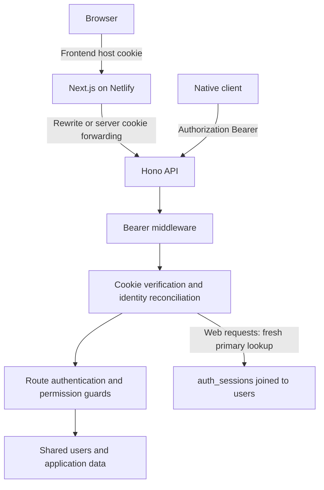
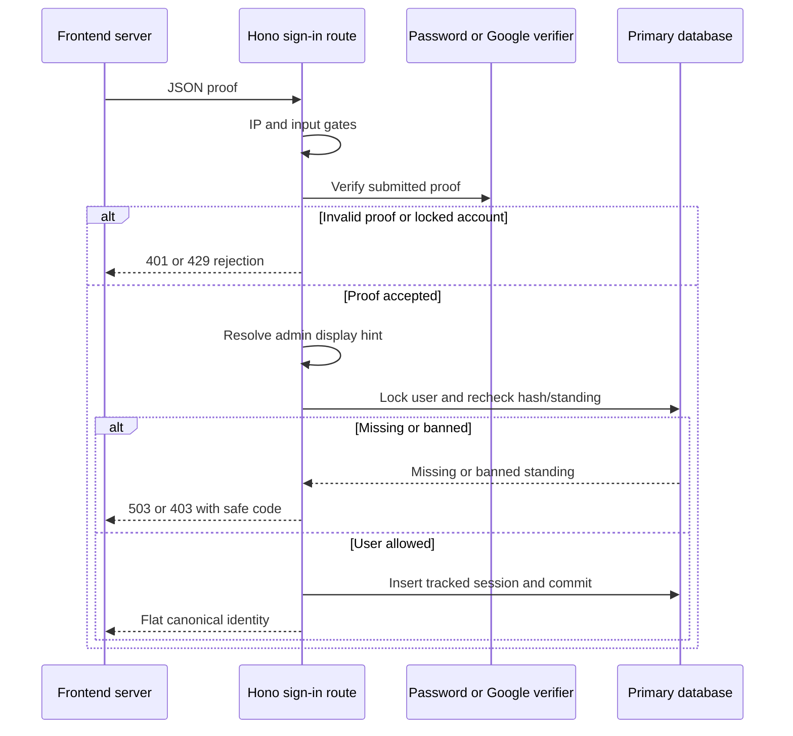
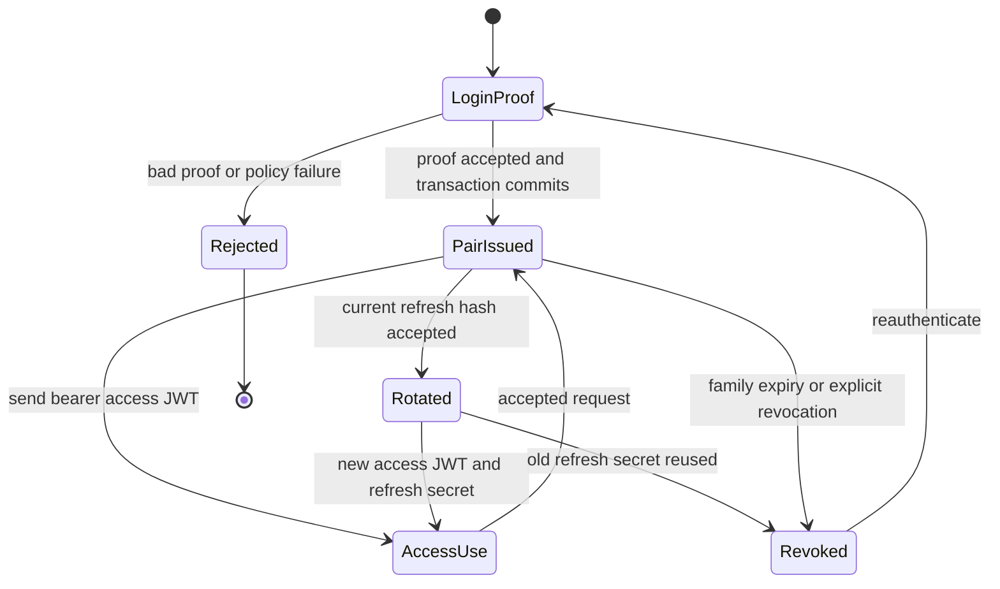
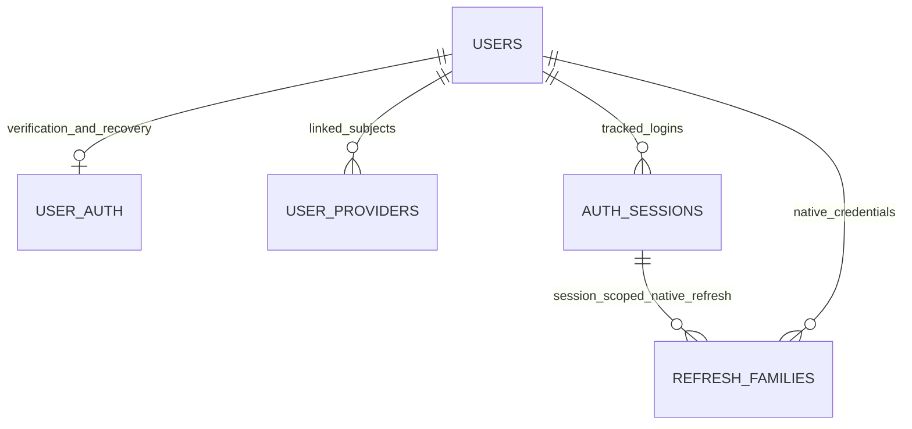

# Dual Auth Architecture (Providers + Credentials)

> Living architecture document · Twistloom Backend · 2026-10-05
> Scope: Canonical account/provider proof, browser encrypted cookies, native bearer/refresh, session authority, recovery and shared revocation in the current working tree.
> Status: **Partial** · reviewed against current code and Git history; specific local evidence and unverified deployment behavior are recorded in §15.
> Roadmaps: [Native mobile bearer auth](../roadmap/NATIVE_MOBILE_BEARER_AUTH_ROADMAP.md) · [Auth enhancements](../roadmap/AUTH_ENHANCEMENT_ROADMAP.md) · [Netlify migration](../roadmap/NETLIFY_MIGRATION_ROADMAP.md); roadmaps own proposals, this document owns as-built behavior.
> Anchor contract: §N sections are stable citation targets; renumbering requires checking/updating source references. See §18 for the map and current citation audit.
> Companion: [Frontend auth architecture](../../../Twistloom-web/docs/architecture/FRONTEND_AUTH_ARCHITECTURE.md). The two credential adapters have different current freshness guarantees.

## Table of Contents

- [1. Executive Summary & Design Rationale](#1-executive-summary--design-rationale)
- [2. System Boundaries & Overview Diagram](#2-system-boundaries--overview-diagram)
- [3. Key Architectural Invariants](#3-key-architectural-invariants)
- [4. Browser Provider Admission & Tracked Sessions](#4-browser-provider-admission--tracked-sessions)
- [5. Global Middleware & Credential Reconciliation](#5-global-middleware--credential-reconciliation)
- [6. Native Access & Refresh Tokens](#6-native-access--refresh-tokens)
- [7. Identity, Registration & Profile Lifecycle](#7-identity-registration--profile-lifecycle)
- [8. Recovery, Verification & Account Methods](#8-recovery-verification--account-methods)
- [9. Logout & Revocation](#9-logout--revocation)
- [10. Errors, Route Guards & Abuse Controls](#10-errors-route-guards--abuse-controls)
- [11. Netlify & Local Configuration](#11-netlify--local-configuration)
- [12. Failure Modes & Recovery Matrix](#12-failure-modes--recovery-matrix)
- [13. Industry Standard Comparison](#13-industry-standard-comparison)
- [14. File Map & Ownership](#14-file-map--ownership)
- [15. Verification & Evidence](#15-verification--evidence)
- [16. FAQ](#16-faq)
- [17. Known Gaps & Future Enhancements](#17-known-gaps--future-enhancements)
- [18. Section Anchor Map & Related Documents](#18-section-anchor-map--related-documents)

---

<a id="overview"></a>
<a id="key-benefits"></a>

## 1. Executive Summary & Design Rationale

Twistloom uses one backend identity store with two credential adapters:

- **Browser:** Google OAuth, Google One Tap, or email/password sign-in produces an Auth.js encrypted session cookie on the Next.js frontend.
- **Native:** Password, Google, or Apple sign-in produces a signed access JWT and a rotating opaque refresh token.
- **Resource server:** The Hono backend resolves either credential into `userId` and `user` before route guards and permission checks.

“Dual provider” describes Google plus credentials on the web. “Dual credential” describes browser cookies plus native bearer tokens. Neither means separate accounts or separate authorization systems. Apple is currently a native provider, not a configured web Auth.js provider.

The backend runs through [the Netlify function adapter](../../netlify/functions/api.mts) in production and Bun locally. Migration did not change which application owns sign-in or which database owns users.

**Both adapters use fresh primary-store session/owner/ban authority on accepted API requests.** Their decode caches reuse immutable verified claims only, have fixed expiry and cannot overrule current policy. Native also compares current tokenVersion; browser credential-change revocation removes tracked rows.

### 1.1 Problem statement and design rationale

Three web entry points and three native sign-in entry points must resolve to the same account while preserving frontend-owned browser cookies and native secure-storage credentials. Authentication success alone does not establish current authorization. The design separates provider/password proof, credential encoding, tracked-session authority, presentation, and route permissions.

| Decision | Alternative considered | Why it fits Twistloom | Cost accepted |
|---|---|---|---|
| **One canonical backend user store** | Separate Auth.js adapter/mobile accounts | Cross-repo identity and permanent API contracts in AGENTS.md §1 | Backend linking/upsert policy must handle provider subjects and email conflicts |
| **Encrypted browser cookie plus native bearer** | Put browser access/refresh tokens in web storage | First-party browser transport and an existing native contract | Two adapters need independent verification and tests |
| **Shared web issuance service** | Create sessions directly in each provider handler | One standing/session insertion rule across password/OAuth/One Tap | Row lock/transaction on each successful web sign-in |
| **Fresh web authorization outside the decode cache** | Cache the previously authorized user | Revocation/standing are globally mutable state; process LRU is not authority (AGENTS.md §3.1) | Primary query per accepted cookie request |
| **Backend-derived admin/onboarding hints** | Probe admin API from every navigation render | Reduce repetitive frontend requests while keeping protected actions backend-owned | Display hints can become stale or be client-patched |
| **Separate advisory metadata** | Write/parse device metadata on every request | Polling frequency and serverless compute constraints | Last-active is approximate; each warm instance has its own reservation |

Current reality is **Partial** for private deployment evidence and durable delivery, with the source fixes implemented and locally verified: both adapters check primary ownership/standing; native cache hits enforce expiry; short browser sessions have a fixed deadline; sign-out attempts owned revocation; credential changes revoke all sessions; recovery proofs are scoped and consumed before mutation. Successful provider/native response contracts and intentional avatar/guest-reading behavior remain. Residual limits are real PostgreSQL concurrency/performance evidence and durable mail/activity/revocation retry during outages (§17).

---

<a id="architecture-web-dual-provider-detail"></a>
<a id="implemented-dual-credential-shape-2026-09-23"></a>

## 2. System Boundaries & Overview Diagram



| Layer | Owns | Does not establish |
|---|---|---|
| Next.js / Auth.js | Browser provider flow, encrypted cookie, frontend session | Live backend standing or resource permissions |
| Google / Apple verifier | Signed provider identity proof | Twistloom account/session permission |
| Hono global auth | Request identity and adapter-specific policy | Authorization for every feature |
| Route guards/services | Ownership, admin capabilities, verification/standing rules | Frontend display state |
| Primary database | Current web session-owner pair, bans, committed revocation | Cancellation of an already-authenticated request |
| Redis/process caches | Rate limits, coalescing, immutable decode reuse | Durable globally valid authorization |

A service secret is a separate credential class. Cron bypasses user-bearer verification but still uses its route's service-secret gate. The browser session JWE is not a mobile HS256 token.

---

## 3. Key Architectural Invariants

| # | Current invariant | Evidence and check |
|---|---|---|
| 1 | Successful web issuance returns canonical backend user/session UUIDs; no provider-sub fallback | `src/routes/auth.ts`, `src/services/web-session.ts`; malformed exchange tests |
| 2 | Cookie middleware never creates users/sessions | `src/middleware/nextauth.ts`; missing/legacy session rejection tests |
| 3 | Web authorization joins session ID and owner on primary for every accepted request | `src/services/web-session.ts`; warm logout/ban/wrong-owner tests |
| 4 | Mutable standing is outside completed decode cache and single-flight | `src/middleware/nextauth.ts`; enabled/disabled cache policy tests |
| 5 | Auth middleware runs before raw JSON body consumption | `src/app.ts`, `src/app.ts`; authenticated POST body test |
| 6 | Conflicting resolved cookie/bearer users are rejected | `src/middleware/cookie-bearer-identity.ts`; bearer matrix |
| 7 | Refresh rotation locks a family and rejects reuse of a prior secret | `src/services/token-family.ts`; token-family test coverage |
| 8 | Device metadata cannot grant access or turn a failed policy check into success | `src/middleware/nextauth.ts`; write failure/coalescing tests |

These are as-built invariants. Native ownership, strict cache-hit expiry, password-proof revalidation and transaction-first reset consumption are implemented. Browser one-hour enforcement and central sign-out are locally tested; delivery/cleanup outages remain explicitly bounded best-effort (§9/§17).

---

<a id="login-flow-diagrams"></a>
<a id="browser-sign-in-and-tracked-sessions"></a>

## 4. Browser Provider Admission & Tracked Sessions

### 4.1 Email/password

1. The frontend credentials `authorize()` attaches a purpose/body-bound 60-second server attestation and posts email/username and password directly to `/api/auth/verify-credentials`.
2. The backend applies distributed signed-account/egress or direct-client IP limits, loads credentials from the primary connection through `getUserForAuth`, checks account lockout, and verifies bcrypt.
3. A null password hash means a social-login-only account, not a usable password.
4. After successful verification, `issueWebSession(userId, verifiedPasswordHash)` locks the primary user row, checks existence, ban status and the exact password hash just verified, and inserts an `auth_sessions` row in one transaction.
5. Admin display enrichment is resolved before insertion; the handler returns the web exchange payload.
6. The frontend validates that payload, copies canonical IDs into its JWT, and Auth.js encodes the frontend cookie.

No password is included in the Auth.js cookie. `getUserForAuth` does not use a positive credential cache.

### 4.2 Google OAuth and One Tap

Google OAuth exchanges its ID token in the frontend `signIn()` callback. One Tap exchanges its credential in its own `authorize()`, after an additional frontend-server token verification. The backend routes share `handleGoogleAuth`:

1. Validate the signed exchange header/body or apply the distributed direct-client IP limit.
2. Verify the Google ID token with `GOOGLE_CLIENT_ID` as audience and require verified email.
3. Resolve/create/update the canonical backend user.
4. Apply signed account/egress limits using the verified Google subject, resolve admin display state, then issue through the primary standing/row-lock gate.
5. Return canonical identity and admin/onboarding display fields.

The frontend `jwt()` callback does **not** repeat the Google exchange. Google subject IDs and provisional usernames never replace missing backend IDs. Cookie middleware never creates users or repairs missing sessions.

The user/provider upsert and Google profile work occur before issuance. Admin enrichment resolves before insertion, so its failure cannot strand newly issued credentials. Provider HTTP, image upload and response delivery are outside the transaction; an HTTP/client failure after commit can still leave a tracked row. Retry sign-in rather than fabricate identity.

### 4.3 Successful web exchange

All three routes return a top-level object, not a `{ user: ... }` wrapper:

```typescript
{
  userId: string;       // canonical backend UUID
  sessionId: string;    // tracked device-session UUID
  email: string;
  name: string | null;
  username: string;
  imageUrl: string | null;
  isNewUser: boolean;
  isAdmin: boolean;
}
```

The frontend [exchange validator](../../../Twistloom-web/src/lib/services/auth-exchange.ts) requires both UUIDs, nonempty email/username, nullable string name/image, and boolean flags. A malformed HTTP 200 is a failed sign-in. The flags are presentation hints; backend authorization does not trust them.

### 4.4 Cookie authorization

`verifyNextAuthToken` uses Auth.js decryption, then requires canonical `token.userId`, `token.sessionId`, and a numeric unexpired `token.exp`.

For every accepted cookie-authenticated API request, `loadWebSession` joins `auth_sessions` to `users` on **dbWrite**, matching both session ID and owner ID. It returns current email/name/ban status.

- Missing/invalid/expired/legacy claims, missing session, wrong owner, or deleted user: 401 with `auth.sessionRevoked`; clear actual session-cookie names and chunks supplied by the request.
- Current ban: 403 with `auth.accountBanned` and error `account_banned`; retain the cookie.
- Primary-store failure: propagate to the global error handler; retain the cookie and deny the request.
- No matching cookie or missing backend `AUTH_SECRET`: no cookie identity. Protected routes subsequently fail `requireAuth`; missing secrets do not grant guest requests a user.

These checks occur at authentication time, not as a lock held through every downstream mutation. A revocation occurring after a request has passed its check does not cancel that already-running request.

The frontend recognizes `authjs.session-token` or `__Secure-authjs.session-token`; large cookies can have numbered chunks. Fingerprinting and rejection cleanup inspect actual cookie names/values. Auth.js still selects/decrypts the token using its own secure-cookie configuration, so proxy scheme/host configuration remains relevant.

### 4.5 Caches and advisory metadata

- **Decoded web claims:** bounded LRU, 5,000 entries, 60-second TTL, keyed by SHA-256 of sorted session-cookie names/values. Stores only user ID, session ID, and token expiry. Expiry is checked on cache hits.
- **Decode single-flight:** concurrent decodes for the same cookie share one promise. Fresh DB authorization is outside this promise.
- **Device metadata:** separate bounded LRU, 5,000 session IDs, 60-second reservation. Concurrent requests coalesce one attempted metadata write per session per warm instance. Failures release the reservation for retry. Eviction and separate instances can cause earlier/additional writes.
- **Legacy session-existence cache:** `session-manager.ts` still has a ten-minute boolean cache for `sessionExists`. Current web authorization does not use it.
- **Former ban cache invalidation:** `invalidateUserBanCache` is a compatibility no-op because web bans are read freshly.

`DISABLE_CPU_OPTIMIZATIONS=true` bypasses completed web decode reuse; concurrent decode coalescing and primary policy checks still run. It does not disable the independent metadata throttle.

Metadata records user agent, IP, device name, and last activity after successful authorization. It is advisory; neither a cache hit nor a write failure controls access. Netlify's adapter passes `Context.waitUntil` into Hono for the handled metadata task. Bun/test/adapters without that context retain best-effort background behavior. Activity timestamps can lag approximately a minute; this is not a precise audit trail or a claim of free background compute.


### 4.6 Detailed password and provider gate sequence



Password verification stays outside the lock to avoid holding it during bcrypt; issuance compares the exact verified hash inside the primary user lock. Reset/change either commits first and rejects stale proof (401 auth.invalidCredentials), or waits for issuance and then deletes the newly inserted session. Google proof uses current standing without a password-hash comparison. This is credential-change serialization, not cancellation of admitted requests.

### 4.7 Browser contract compatibility (NB-1 through NB-8)

The [native roadmap's NB contract](../roadmap/NATIVE_MOBILE_BEARER_AUTH_ROADMAP.md) remains the reference for compatibility. The following is the current interpretation, including intentional policy changes:

| Surface | Preserved behavior | Intentional correction or limit |
|---|---|---|
| No Authorization header | Cookie adapter remains available | Invalid/revoked/legacy cookies fail policy rather than becoming guests |
| Web exchange success | Same eight canonical identity/profile fields | Additive failure codes; malformed identities cannot issue cookies |
| Public reauthentication | Password/Google proof can establish a new identity | Three explicit bypass paths only; an auth header retains mixed-credential checks |
| Logout handler body | Fixed success message when handler is reached | Global invalid-cookie policy may reject before handler; cleanup errors can still be hidden |
| Cron service bearer | Does not enter mobile JWT verifier | Service route must verify its own secret |
| Existing valid tracked cookie | Continues while actual token/session/user remain valid | Missing-ID/untracked cookies require sign-in |
| Resource guards | Same attached `userId` API | Both adapters recheck primary ownership/standing |
| JSON body | Available after authentication | Ordering is required with Hono's raw Request |

Do not restore the old Google-sub fallback or middleware user creation to avoid an error screen. Recovery is explicit reauthentication after a failed exchange; fabricated identities cannot safely authorize the user's resources.

---

<a id="how-nextauth-connects-to-backend-endpoints"></a>

## 5. Global Middleware & Credential Reconciliation

### 5.1 Middleware order and identity precedence

The relevant order in `app.ts` is:

1. Security headers, compression, cache headers, CORS, and Hono CSRF middleware.
2. `initAuthConfig` with the shared `AUTH_SECRET`, `trustHost: true`, and no backend Auth.js providers.
3. Bearer middleware on `/api/*`.
4. Cookie/bearer identity reconciliation on `/api/*`.
5. JSON parsing, locale extraction, authenticated-user rate limiting, and routes.

Auth runs before JSON parsing because `@hono/auth-js` wraps the raw request. Consuming its body first can break authenticated POST/PUT requests.

With no nonempty Authorization header, cookie verification is the browser path. A nonempty malformed/non-Bearer header fails with 401 instead of falling back to cookies. An empty header is treated as absent by the current truthiness check. `/api/cron/*` skips user-bearer verification because its bearer value is a service secret; the cron route validates that secret separately.

When both a valid user bearer and a recognized session cookie are present, the cookie also undergoes web policy checks. Different resolved user IDs return 401 “Conflicting credentials.” Same-user credentials are accepted even if their session IDs differ; the already-attached bearer context remains the request identity. Invalid, revoked, or banned cookies do not silently disappear into bearer fallback.

Exactly three web exchanges bypass stale-cookie resolution when Authorization is absent: `/api/auth/verify-credentials`, `/api/auth/google-oauth`, and `/api/auth/google-one-tap`. This lets a user reauthenticate. Other nominally public API routes still pass through global authentication and can reject a supplied invalid cookie.

---

## 6. Native Access & Refresh Tokens

### 6.1 Issuance

`/api/auth/mobile/token`, `/mobile/google`, and `/mobile/apple` verify proof then call `issueMobileLoginPair`. Admin display enrichment resolves before insertion. The primary transaction locks the canonical user, reads current profile/ban/tokenVersion and rejects missing/banned users. Password grants recheck the exact verified password hash. Session insertion, access signing and refresh-family insertion commit together; signing/family failure rolls back.

HTTP delivery is outside the transaction. Successful fields remain accessToken, expiresIn, refreshToken, tokenType:"Bearer", familyId and canonical user.

### 6.2 Access JWT verification

- HS256; issuer twistloom-backend; audience MOBILE_ACCESS_AUD or reader; kid=m0-hs256.
- Default lifetime: 15 minutes, configurable. MOBILE_ACCESS_SECRET is separate from AUTH_SECRET, minimum 32 characters; PREVIOUS supports overlapping rotation.
- Required canonical UUID sub/sid, nonnegative safe-integer tv, finite iat/exp, issuer and audience.
- Signature verification allows clock tolerance for other time claims, but exp is strictly enforced on cold verification and every hit; tolerance cannot extend access.
- A primary joined query matches user AND owned session and checks current ban/tokenVersion on every request. Wrong owner, deletion or revocation cannot be accepted through a warm cache.

The 5,000-entry SHA-256-keyed LRU stores only immutable verified claims. TTL is fixed at at most 15 seconds, capped by remaining exp; updateAgeOnGet=false and hits do not reinsert entries. DISABLE_CPU_OPTIMIZATIONS bypasses completed crypto reuse with identical primary policy. Both adapters share the independent minute metadata scheduler. Cache eviction is an optimization, not revocation authority.

### 6.3 Refresh rotation

Refresh secrets are random 256-bit opaque hex values. The database stores SHA-256 hashes, not the usable secret. A family is bound to a tracked session; deleting that session cascades deletion of its refresh families.

`rotateRefreshToken` locks the family on the primary in a transaction. It checks family expiry/revocation, current primary user ban/token version, and whether the presented hash is current or previously used. A previously used hash revokes the whole family. A valid rotation replaces the current hash and appends the old hash to `usedHashes`.

Default family lifetime is 30 days via `MOBILE_REFRESH_TTL_DAYS`. Rotation does not extend the original family expiry. There is no implemented retry grace/idempotent replay window; native clients must coordinate concurrent refresh calls.

### 6.4 Native lifecycle and replay handling



Access-token acceptance and refresh-family acceptance are distinct. Family revocation stops future refresh; an issued access JWT is revoked by session deletion or tokenVersion change, not family state alone. Logout/credential-change routes apply the shared changes; warm claims still require primary policy. Client refresh single-flight reduces accidental reuse but is not server idempotency.

Apple identity verification belongs to the native handler and provider verifier, including the configured audience. Apple is not an additional web Auth.js provider. Key rotation requires overlap for access-token verification and a deliberate retirement window; changing AUTH_SECRET instead affects browser encrypted cookies.

---

<a id="backend-implementation"></a>
<a id="user-registration-flow"></a>

## 7. Identity, Registration & Profile Lifecycle

The shared schema contains:

- `users`: canonical ID, email/username/profile, nullable password hash, ban state, onboarding state, and native token version.
- `user_auth`: verification/reset material, failed-login counters, and account lock time.
- `user_providers`: linked Google/Apple provider subjects.
- `auth_sessions`: per-login device/session IDs and activity metadata.
- `refresh_families`: native refresh hashes, reuse history, expiry, and revocation.

Google/Apple identity resolution checks provider subject first; otherwise it can link an existing verified-email identity. Backend routes are responsible for verified provider proof. Returning OAuth logins may refresh a nonempty name, but preserve username and custom avatar; new accounts may import the provider image on a best-effort basis. See `createOrUpdateOAuthUser` for linking details rather than treating email as the cookie identity.

`POST /api/auth/signup` validates account fields, password strength, terms/age confirmation, and creates the account. Password hashing uses bcryptjs with 12 rounds. Signup can include a best-effort native token pair, but it never issues the browser Auth.js cookie. Web signup follows with email verification or skip-verification, then credentials sign-in.

`GET /api/user` requires auth and returns `{ user: ... }` with profile fields such as `id`, `imageUrl`, `isNewUser`, `linkedMethods`, `hasPassword`, and subscription state. This differs from the flat login-exchange schema.

`POST /api/user` locks the primary user, records eligible unset referral while isNewUser=true, then commits profile/completion/missing preferences/locale together. Empty completion is valid. Repeat completion preserves finished profile/referrer, repairs defaults and retries idempotent payout. ImageKit remains external best-effort; welcome/activity/cache work is handled after commit. PUT updates profile/social links in one transaction, accepts imageUrl:null and returns a public allowlist.

Authenticated account-method routes include Google/credentials link/unlink, email, password, and username changes. These use their own proof and validation gates; simply changing a frontend JWT display hint cannot link a provider or grant permissions.


### 7.1 Database relationships and indexing



| Table/export | Auth-relevant fields | Authority / persistence detail |
|---|---|---|
| `users` | `userId`, email, username, nullable passwordHash, isNewUser, tokenVersion, bannedAt | Canonical account; unique email/username constraints also provide indexes |
| `userAuth` | userId, emailVerified, verification token/expiry, reset token/expiry, failed attempts, lockUntil | Verification/recovery state; reset and OTP tokens each have a unique constraint; not an Auth.js adapter table |
| `userProviders` | userId, provider, providerAccountId | Provider-subject linking; verifier admission must precede linking |
| `authSessions` | id, userId, userAgent, ipAddress, deviceName, lastActiveAt, createdAt | UUID-backed tracked login; current schema has no shared web-expiry deadline column |
| `refreshFamilies` | userId, sessionId, tokenVersion, refreshHash, usedHashes, expiresAt, revokedAt | Current hash index and used-hash lookup; session deletion cascades families |

Schema evidence: `src/db/schema.ts`, `src/db/schema.ts`, `src/db/schema.ts`, `src/db/schema.ts`, `src/db/schema.ts`. Automatic username availability is advisory: the database uniqueness constraint still arbitrates concurrent insertions. No database migration is needed to edit this document.

### 7.2 Signup inputs, responses, and password rules

`POST /api/auth/signup` accepts email, username, password, optional gender/referrer and boolean terms/age/email choices. Terms/timestamps and explicit engagement consent commit with creation: receiveEmails===true opts into engagement mail, including storyPublished; security/billing mail is separate. Onboarding preserves existing consent and fills only null defaults. Conditional primary default writes prevent replica lag from overwriting a choice.

The password validator enforces 8–128 characters, upper/lower case, number, special character, and rejects its common-password list, sequential runs, and repeated runs. These are current rules, not a recommendation to remove or increase hashing work for a free tier (`src/utils/password-validation.ts`; `src/utils/password.ts`).

Normal signup returns **201** with userId, message, verificationEmailSent, referrer/referralApplied, isNewUser and optional native pair/user. Proof/mail or native-issuance failure retains a creation-only 201 so resend/login can recover. Unexpected creation failure is classified 500 rather than success-shaped 200. Creation and delivery/issuance remain distinct commit boundaries.

### 7.3 Username and profile pipeline

| Helper | Current algorithm | Examples / limits |
|---|---|---|
| `sanitizeUsername` (`src/utils/username.ts`) | Trim/clean text; lowercase; spaces/dots/underscores/plus to hyphens; strip other characters; collapse/trim hyphens | John Doe → john-doe; user@name! → username; output still requires validation |
| `convertNameOrEmailToUsername` (`:84`) | Prefer normalized name of length at least 3; otherwise email local part; truncate to 25; return user if result shorter than 2 | x@y.com → user, not x; a two-character candidate still fails the final 3-character validation |
| `convertEmailToName` (`:127`) | Normalize local-part separators to spaces and title-case words | ray.j+tag@mail.com → Ray J Tag, not Ray J |
| `validateUsername` (`:159`) | 3–30 ASCII lowercase letters/digits/hyphens; no edge/double hyphens; reserved-name rejection | Returns valid/errors; app slug, admin, support, root, system, null, undefined are reserved |
| `findUniqueUsername` (`src/services/user.ts`) | One batched query for base, base-2…base-21 (default); trim suffixed candidates to 30; first unused or null | Exhaustion is possible with existing collisions; not “practically impossible” |
| `sanitizeUserData` (`src/services/user.ts`) | Requires email even with createNew=false; normalizes profile; creation checks email and auto-suffixes username; final validation | createNew=false skips uniqueness, so caller owns identity/conflict policy |
| `sanitizeProfileUpdate` (`src/services/user.ts`) | Shared optional-field sanitizer; username validation and owned-name conflict check; cosmetic/entitlement gates | User profile changes return hard 409 usernameTaken or 422 usernameInvalid, not automatic suffixes |

Creation currently auto-suffixes even an explicitly supplied signup username through `sanitizeUserData`; the old frontend doc's “credentials never auto-generate/deduplicate” statement was inaccurate. Onboarding/profile edits deliberately use hard conflicts instead.

Profile API distinctions:

| Operation | Input/response and side effects |
|---|---|
| GET /api/user (`src/routes/user.ts`) | Enriched `{ user }`; canonical `id` and `imageUrl`; subscription.tier, isVip, credits, isNewUser, emailVerified, linkedMethods, hasPassword and metrics |
| POST /api/user (`:665`) | Optional name/username/imageUrl/source/referrer/preferredLocale from wizard; shared sanitizer also processes supported profile fields; 200 completion or already-completed body; optional avatar best-effort |
| PUT /api/user (`:831`) | At least one sanitized update or 400; uses imageUrl, not image; avatar upload failure can fail the request with 500; returns `{ success: true, user }`, not an `updated` patch |
| Omitted/empty/null imageUrl | Current scalar sanitizer skips unusable values; `null` does not clear avatar. Do not inherit the old explicit-clear claim |
| Profile privilege fields | Email/password/provider changes use auth routes; subscriptions are managed by their own system; frontend updates cannot grant standing/capabilities |

PUT uses `publicUpdatedProfile` to allowlist public profile/preferences/subscription fields from RETURNING. Password hashes, tokenVersion, bannedAt and raw referrerId never enter JSON; hasReferrer is boolean. Explicit imageUrl:null clears the stored image. Profile/social links commit together; optional post-commit cache/activity/audit failure is logged without converting success to a failed response.

### 7.4 OAuth update history and referral ownership

The earlier returning-OAuth sanitization conflict was addressed in backend history (June 2026); current returning branches avoid new-account email uniqueness checks. Since commit `fba9974` (2026-07-21), returning OAuth deliberately preserves custom avatars. Subject-first provider linking was added with native OAuth work. Restore these rationales, not the stale claim that every sign-in overwrites the avatar.

Referral attribution and payment remain separate. The helper reads its supplied primary executor and conditionally updates only an unfinished account with no referrer; referrers must exist, be verified and non-self. Onboarding supplies its locked transaction and defers credit/activity until commit. `tryAwardReferralBonus` uses primary prechecks and its existing atomic claim plus both credit awards, allowing verification/completion retries without double-paying.

**Historical ordering conflict, corrected:** HEAD completed isNewUser before its new-user-only attribution helper. The final transaction records attribution before completion; a primary-fresh local test covers this. Signup remains a separate path; completed users cannot attach late arbitrary referrers.

The final sequence is primary lookup → sanitizer → optional external avatar upload/persist → locked attribution/profile/completion/preferences/locale transaction → handled post-commit cache/activity/idempotent reward and first-completion welcome work → {message,isNewUser:false,username}. Retry repairs defaults/payout. No durable outbox, automatic eventual mail/activity delivery or exact-once mail claim is made.

---

<a id="password-reset-flow"></a>

## 8. Recovery, Verification & Account Methods

### 8.1 Password reset request and consumption

| Route/helper | Final behavior | Compatibility / limit |
|---|---|---|
| POST /auth/forgot-password | Distributed IP/account admission; defer lookup/proof/mail via waitUntil; uniform 200 acknowledgement | emailSent:true means accepted, not existence or delivery; validation/rate remain 400/429 |
| createPasswordResetToken | 32 crypto-random bytes, 64 hex, one-hour expiry; store sha256: digest on primary | Resend replaces prior proof; unexpired legacy raw UUID remains compatible |
| POST /auth/reset-password | Strength/proof checks; 200 winner, 400 invalid/consumed/expired, 422 weak password; best-effort security mail | Delivery outside credential transaction |
| resetPassword | Preliminary primary lookup; bcrypt outside lock; lock user first; consume matching unexpired proof BEFORE password/tv/family/all-session mutation | Loser has no credential effects; revocation failure rolls back proof and all changes |

The stored digest cannot redeem itself: input accepts raw hex or legacy UUID, not sha256: storage values. Expiry is rechecked after hashing in the consume predicate. User-first lock order serializes reset/change with issuance. Local tests model locking and evaluate real predicates, including two passwords for one proof and revocation rollback; actual PostgreSQL concurrency remains a private evidence gate.

### 8.2 Email verification and resend

Six-digit UX now uses node:crypto randomInt, a 15-minute expiry and a peppered account-scoped HMAC derived from AUTH_SECRET with a domain prefix. Equal codes on different accounts have different stored values, compatible with the existing unique text column; no database migration is required.

The request is **{token,email}**. A normalized-email primary join identifies the account; a conditional update matches account HMAC AND unexpired proof, marks verified and clears it. Another account's code, leaked HMAC and expired/replaced/consumed proof cannot redeem it. Unscoped legacy OTPs are retired and require resend. Web callers and email links supply email; the link page requires deliberate submission so scanner GETs do not consume proof.

Verify applies distributed IP/account attempts then idempotent referral payout. Resend and forgot return identical acknowledgements with emailSent:true meaning accepted, never account or delivery state. Account work runs after admission through handled waitUntil tasks; this is not durable delivery or a promise of identical network timing. The existing 72-hour new-account verified-email grace remains unchanged.

### 8.3 Account security route catalog

Paths below are relative to `/api/auth`. All authenticated routes first pass global adapter policy; route proof/capability gates then apply.

| Method/path | Proof/input | Responsibility |
|---|---|---|
| PUT /email | newEmail, currentPassword | Password-backed email update; Google-linked restrictions and verification reset |
| PUT /password | currentPassword, newPassword | Existing-password proof and strength checks; native version/family revocation |
| PUT /username | newUsername | Username validation/conflict policy |
| POST /link/google | idToken | Verify Google identity before provider linking |
| POST /unlink/google | Existing authenticated identity and remaining-method policy | Prevent removal of last available login method |
| POST /link/credentials | password | Add a validated password login method |
| POST /unlink/credentials | currentPassword | Verify proof and remaining-method policy before removal |

Evidence: `src/routes/auth.ts`, `:1769`, `:1876`, `:1947`, `:2022`, `:2081`, `:2163`. These endpoints are not web Auth.js OAuth callback URLs. Method-list UI should refetch GET /user after changes rather than assume projected loginMethod changed automatically.

---

<a id="logout-and-revocation"></a>

## 9. Logout & Revocation

“Clear the browser cookie” and “revoke the backend session” are separate effects, centrally integrated.

- Auth.js events.signOut receives verified server claims and posts a purpose-bound revoke proof to /auth/revoke-web-session. The domain-separated AUTH_SECRET-derived key is distinct from cookie/native signing; proof has issuer/audience/HS256/purpose and at most 60 seconds of validity.
- The route needs no old browser cookie: it verifies canonical owner/session UUIDs and deletes only their matching primary row. Missing row gives idempotent {revoked:true}; invalid proof is 401 and DB outage 500. Banned/stale standing cannot block this signed cleanup.
- Two attempts with five-second timeouts bound frontend cleanup. Success rejects copied cookies on the next protected request across instances. Exhausted failure logs a fixed diagnostic but still clears local Auth.js cookies; copied cookies remain usable until revocation/expiry. No durable cleanup queue exists.
- Legacy POST /logout preserves its fixed best-effort {message:"Logged out successfully"}; it is not the normal browser hook. GET /sessions lists owned devices; logout-all removes OTHER sessions, logout-all-devices includes current/tv increment, logout-session removes specified owned session, DELETE /sessions/:id refuses current.
- Password reset/change transactionally updates hash/tv, revokes families and deletes ALL tracked web/native sessions. Change also clears pending reset proof. Current device is not retained: its next protected request requires reauthentication.

### 9.1 Two independent logout effects

```mermaid
sequenceDiagram
    participant Browser
    participant Next as Auth.js frontend
    participant API as Hono control route
    participant DB as Primary sessions
    Browser->>Next: Manual or automatic signOut
    Next->>API: Short signed owner/session proof
    API->>DB: Delete matching owner AND session
    alt Delete succeeds
        API-->>Next: Idempotent success
    else Store unavailable
        API-->>Next: Failure; bounded retry
        Note over Next,API: Remaining replay risk logged; no durable queue
    end
    Next-->>Browser: Clear local cookie
    Browser->>API: Later copied-cookie/native request
    API->>DB: Fresh owned session and standing
    DB-->>API: Missing when deletion committed
    API-->>Browser: 401 for deleted session
```

Admission checks do not cancel already-authenticated requests. Family revocation alone differs from session deletion/tv change; preserve the other/all-device naming distinction.

---

## 10. Errors, Route Guards & Abuse Controls

The mirrored public error vocabulary is `auth.invalidCredentials`, `auth.socialLoginRequired`, `auth.accountLocked`, `auth.accountBanned`, `auth.serviceUnavailable`, and `auth.sessionRevoked`.

Web policy exceptions produce `{ success: false, error, code }`. Credential sign-in uses these codes for classified failures; lockout can also return `lockedUntil`. Generic validation/IP-limit errors, native bearer failures, and caught Google verifier/DB exceptions do not all carry this vocabulary. The frontend preserves allowlisted codes; unknown 401 maps to invalid credentials, other unclassified failures or malformed payloads to service unavailable.

`requireAuth` checks the identity attached globally. `optionalAuth` is a pass-through and cannot suppress global auth failures. `requireVerifiedEmail` permits verified users or users within a 72-hour creation grace period, and lets guests pass; combine it with `requireAuth` when authentication is required. It reads verification/grace data through `dbRead`. Admin capabilities and other feature policy are enforced by their dedicated backend guards.

Abuse controls are distinct:

- Public auth IP attempts use atomic Redis fixed windows (five/minute default) and hashed identifiers. Recovery/verification additionally use five/account/15 minutes. Netlify supplies trusted context.ip; arbitrary forwarded headers are ignored unless TRUST_PROXY_HEADERS=true explicitly configures a trusted proxy. Local fallback is unknown. Signed frontend exchanges bind the serialized body and use separate 300/minute egress plus five/minute account buckets, avoiding a shared five-attempt frontend bottleneck.
- Authenticated traffic retains Redis per-user sliding 100/minute; native login retains 10/minute and refresh IP/family 30/minute. The fixed-window helper increments and sets/repairs TTL in one Lua operation. Redis absence/outage fails open by repository policy; provisioning/monitoring is necessary.
- Primary lockout uses one SQL UPDATE with highest thresholds: 5 attempts→5 minutes, 10→15, 15→60. Expired locks preserve escalation; active lock deadlines stay. Success/change clears counts. After 24 hours of shared user_auth.updatedAt inactivity with no active lock, a new failure starts at one. This is an inactivity window, not a dedicated fixed-window column.

Hono CORS uses the explicit origin set in `app.ts`, allows credentials/Authorization, and is separate from authentication. Hono CSRF middleware checks unsafe requests with form-compatible content types, using Fetch Metadata/origin; it is not a blanket origin validator for JSON requests. Server-to-server JSON exchanges work without an Origin header. Frontend Auth.js has its own auth-action protections.

### 10.1 Entry-point catalog

| Method/path (under /api/auth) | Route admission | Current consumer |
|---|---|---|
| POST /verify-credentials | Password proof, web IP limit | Auth.js credentials authorize |
| POST /google-oauth | Google ID token, web IP limit | Auth.js Google signIn callback |
| POST /google-one-tap | Google ID token, web IP limit | Auth.js googleonetap authorize |
| POST /signup | Account fields/consents, web IP limit | Web signup; optional native token pair in response |
| GET /username-available | Redis IP limit; advisory format/availability probe | Signup UX; insertion can still conflict |
| POST /forgot-password | Email, web IP limit | Recovery request |
| POST /reset-password | Reset token/password, web IP limit | Recovery consumption |
| POST /verify-email | Verification code, web IP limit | OTP/link verification |
| POST /resend-verification | Email, web IP limit | OTP retry |
| POST /mobile/token | Password proof, Redis limit | Native password login |
| POST /mobile/google | Google identity proof, Redis limit | Native Google login |
| POST /mobile/apple | Apple identity proof, Redis limit | Native Apple login |
| POST /mobile/refresh | Opaque secret, Redis IP/family limits | Native refresh; family checks own admission |
| POST /logout | No route requireAuth; global supplied-credential checks still run | Backend current-session cleanup |
| GET /sessions | requireAuth | Device management |
| POST /logout-all | requireAuth/current session | Other-device revocation |
| POST /logout-all-devices | requireAuth | All-device revocation |
| POST /logout-session | requireAuth/owned session | Specified-session revocation |
| DELETE /sessions/:id | requireAuth/owned noncurrent session | Device-list removal |

Mounting is `app.route("/api", routes)` followed by Hono auth route registration, not Express router.use. “Public” means no route requireAuth; it does not bypass global invalid-cookie policy unless explicitly listed in §5.

---

<a id="migration-checklist"></a>

## 11. Netlify & Local Configuration

Production frontend: `https://twistloom-web.netlify.app`. Backend: `https://twistloom-backend.netlify.app`. Both remain private.

- Both apps need the same `AUTH_SECRET`; native signing keys remain separate.
- Both web/provider verification layers need the correct `GOOGLE_CLIENT_ID`; the frontend also needs `GOOGLE_CLIENT_SECRET`.
- Frontend `AUTH_URL` is its own canonical HTTPS origin; register `/api/auth/callback/google` on that origin with Google.
- Backend `FRONTEND_URL` must be the current Netlify frontend origin. The hardcoded origin set still includes Vercel and local origins; it does not automatically add the Netlify frontend. Preview origins require deliberate configuration.
- If backend `AUTH_URL` is set, it must describe the backend HTTPS origin, not the frontend or an HTTP proxy URL. Auth.js secure-cookie selection must agree with forwarded request scheme.
- Browser calls use the frontend `/api/backend/*` rewrite. Direct frontend-server calls forward cookies and use an absolute backend API URL.
- Frontend `NEXT_PUBLIC_BACKEND_URL` controls the rewrite destination (backend origin without `/api`); `NEXT_PUBLIC_API_URL_FULL` separately controls server exchanges (backend URL with `/api`). Keep both consistent.
- Bare local frontend builds retain Vercel fallbacks unless explicit URLs/platform configuration override them. Configure local endpoints rather than assuming migration removed every fallback.

Cross-origin deployment does not share host-only cookies between the two Netlify domains. Same-origin rewrites and explicit server forwarding provide the credential transport. A private-host HTML login gate/site response is not an application auth result.

### 11.1 Configuration ownership

| Setting | Owner / purpose | Failure or rollout consideration |
|---|---|---|
| AUTH_SECRET | Same secret in frontend and backend | Mismatch rejects decryption; changing it invalidates existing browser cookies |
| AUTH_URL | Each service's own externally visible HTTPS origin | Wrong scheme can select the wrong secure cookie name/salt |
| GOOGLE_CLIENT_ID | Backend and frontend server verification | Audience must match OAuth/One Tap client |
| GOOGLE_CLIENT_SECRET | Frontend OAuth only | Never expose through NEXT_PUBLIC |
| FRONTEND_URL | Backend allowed browser origin | Explicit current Netlify origin; private access gate remains separate |
| MOBILE_ACCESS_SECRET / PREVIOUS | Backend native JWT verification | Separate minimum-32-character secret and overlapping rotation |
| MOBILE_ACCESS_AUD / TTL_MINUTES | Backend native access audience/lifetime | Default reader / 15; cache cannot extend encoded expiry |
| MOBILE_REFRESH_TTL_DAYS | Backend family expiry | Default 30; original deadline does not roll on rotation |
| AUTH_RATE_LIMIT_WINDOW_MS / MAX_ATTEMPTS | Web IP limiter | Defaults 60000 / 5; distributed Redis enforcement |
| DISABLE_CPU_OPTIMIZATIONS | Diagnostic positive-cache bypass | Fresh primary checks remain in both adapters; metadata throttle stays independent |

### 11.2 Coordinated rollout and local investigation

1. Supply explicit frontend/server API origins, secrets, callback origin, and backend origin allowlist.
2. Ensure frontend exchanges mint canonical userId/sessionId before strict cookie enforcement is active.
3. Test a plain local cookie and an HTTPS secure cookie separately, including chunks and POST bodies.
4. Keep valid tracked cookies compatible; show localized reauthentication for legacy/missing-row tokens.
5. Exercise password, Google OAuth, One Tap, owned-device revocation, bans, and recovery.
6. Measure fresh-primary-read latency and metadata writes before selecting optimizations.

The old Vercel checklist is superseded by the Netlify migration companion. Deployment configuration checks are not an instruction to publish the currently private sites. Secret values should never be included in diagnostic output.

---

## 12. Failure Modes & Recovery Matrix

| # | Failure | Detection / exact response | Recovery and limit |
|---|---|---|---|
| 1 | Missing protected identity | requireAuth, 401 (`src/middleware/nextauth.ts`) | Sign in; no cookie session is fabricated |
| 2 | Wrong password or missing account | verify-credentials, 401 auth.invalidCredentials (`src/routes/auth.ts`) | Retry credentials; never expose passwordHash in exchange |
| 3 | OAuth-only password attempt | 401 auth.socialLoginRequired | Use Google or a separately linked password method |
| 4 | Account lock | 429 auth.accountLocked and lockedUntil when consistent | Wait until lockedUntil; atomic escalating primary thresholds |
| 5 | Current banned web account | 403 auth.accountBanned (`src/middleware/nextauth.ts`) | Localized ban/help flow; no session-expiry sign-out promise |
| 6 | Invalid/expired/legacy/revoked/wrong-owner cookie | 401 auth.sessionRevoked; cookie/chunk deletion headers | Reauthenticate via one of the three bypass exchanges |
| 7 | Primary outage during web check | Unexpected 500 through app.onError (`src/app.ts`) | Deny access, retain cookie, retry after recovery |
| 8 | Invalid Google proof / provider failure | Explicit invalid payload can be 401; verifier exceptions caught as generic 500 | Frontend exchange validator classifies safe recovery; not every error has code |
| 9 | User disappears before web issuance | 503 auth.serviceUnavailable | No inserted session; retry after account/service resolution |
| 10 | Backend JSON malformed or IDs absent | Frontend rejects even HTTP 200 | Auth.js issues no provisional identity |
| 11 | Malformed nonempty auth header | 401 Invalid authorization scheme + WWW-Authenticate | Send correct bearer or omit header for cookie path |
| 12 | Different resolved bearer/cookie users | 401 Conflicting credentials | Present one identity; same-user session IDs need not match |
| 13 | Cold native token invalid/expired/revoked | 401 with bearer error; banned user gives 403 | Native refresh/login; primary policy also on warm hits |
| 14 | Refresh secret reused | Family revoked; mobile refresh rejects with 401 | Clear native credentials and reauthenticate; avoid parallel refresh |
| 15 | Invalid/expired reset or OTP | 400; new weak reset password gives 422 | Resend proof; old unscoped OTP requires resend |
| 16 | Username invalid/taken in profile/onboarding | 422 user.usernameInvalid / 409 user.usernameTaken | Translate code and choose another name |
| 17 | Optional onboarding photo fails | Completion can still return 200 | Profile completion preserved; separate PUT photo retry can fail with 500 |
| 18 | Logout DB cleanup fails | Current logout handler can still return 200 fixed message | Browser cleanup is possible; authoritative revocation is not confirmed |
| 19 | Metadata write fails | Logged; reservation removed for next retry | Authorized response unaffected |
| 20 | Private Netlify gate intercepts exchange | HTML/non-application response, not a canonical identity | Auth validator rejects; deployment/browser check is Not claimed |

Statuses are route-specific. Global auth/CORS/CSRF gates can reject before the route; a nominal 200 handler does not guarantee 200 for every request.

---

<a id="security-considerations"></a>

## 13. Industry Standard Comparison

### 13.1 The standard and comparison

Reference points are [Auth.js encrypted JWT behavior](https://authjs.dev/reference/core/jwt), [OWASP session management](https://cheatsheetseries.owasp.org/cheatsheets/Session_Management_Cheat_Sheet.html), [OWASP recovery guidance](https://cheatsheetseries.owasp.org/cheatsheets/Forgot_Password_Cheat_Sheet.html), and [RFC 9700 refresh-token replay protection](https://www.rfc-editor.org/rfc/rfc9700.html#section-4.14). These describe particular controls; Twistloom's native issuer is not a complete general-purpose OAuth/OIDC authorization server.

| Aspect | Reference practice | Current Twistloom alignment |
|---|---|---|
| Browser credential transport | Auth.js encrypted JWT; OWASP secure cookie attributes | Aligned on encrypted HttpOnly cookie; chosen SameSite=None requires the existing surrounding defenses |
| Current session authority | OWASP server-side expiration/invalidation | Both adapters use primary authority; browser deadline/sign-out implemented with outage caveats |
| Native refresh replay | RFC 9700 rotation or equivalent replay detection | Rotation, reuse detection and session-scoped family persistence align; no claim of full RFC compliance |
| Native access expiry | Bounded credential lifetime | Fixed immutable cache; strict expiry and primary policy on every hit |
| Recovery proof | OWASP scoped, expiring, single-use proof and consistent public response | Account HMAC OTP, transaction-first reset and uniform acknowledgement; delivery best-effort |
| Browser/native identity design | Separate first-party credential presentations can share canonical identity | Deliberate two-adapter choice; comparisons to Meta/Stripe do not prove implementation parity |

**Matches:** canonical users, provider verification, encrypted browser tokens and refresh reuse detection. **Deliberate divergence:** the web checks primary state on every API request to support device revocation, accepting database cost. **Remaining:** private concurrency/browser/performance evidence and durable outage/delivery retry.

The architecture has useful foundations; “industry standard” is not a blanket security or performance certification. The old company comparison is retained as the rationale for separate credential adapters, with unsupported claims of equivalent controls removed.

---

## 14. File Map & Ownership

- [Hono application and middleware order](../../src/app.ts).
- [Web cookie verification and guards](../../src/middleware/nextauth.ts).
- [Cookie/bearer identity reconciliation](../../src/middleware/cookie-bearer-identity.ts).
- [Web session issuance and primary lookup](../../src/services/web-session.ts).
- [Auth routes](../../src/routes/auth.ts) and [session management](../../src/services/session-manager.ts).
- [Bearer middleware](../../src/middleware/bearer.ts), [access tokens](../../src/services/mobile-tokens.ts), [native issuance](../../src/services/mobile-login.ts), and [refresh families](../../src/services/token-family.ts).
- [Identity schema](../../src/db/schema.ts), [user services](../../src/services/user.ts), and [OAuth user creation](../../src/services/user-controller.ts).
- [Frontend implementation](../../../Twistloom-web/src/auth.ts) and [frontend architecture](../../../Twistloom-web/docs/architecture/FRONTEND_AUTH_ARCHITECTURE.md).

Implementation files determine current behavior. Roadmaps describe intended contracts and follow-up work; an unchecked item or older “implemented” claim is not proof of current behavior.

| File:line | Maintained responsibility |
|---|---|
| src/app.ts:29 | Auth configuration; bearer/cookie order; body parsing |
| src/middleware/nextauth.ts:188 | Immutable decode, fresh web policy, route guards |
| src/middleware/cookie-bearer-identity.ts:6 | Explicit credential reconciliation and exchange bypass |
| src/services/web-session.ts:56 | Primary owner/standing lookup and row-locked issuance |
| src/services/session-manager.ts:32 | Device metadata, owned deletion, other/all-device cleanup |
| src/middleware/bearer.ts:46; src/services/mobile-tokens.ts:231 | Native fixed immutable decode reuse and fresh primary policy |
| src/services/mobile-login.ts:63; src/services/token-family.ts:21 | Native pair transaction and locked refresh rotation |
| src/routes/auth.ts:223 | Provider/password admission, registration and reset routes |
| src/routes/user.ts:671 | Enriched user read, onboarding and profile write contracts |
| src/services/user.ts:43 | Credential lookup, creation/profile sanitization and username uniqueness |
| src/services/user-controller.ts:60 | OAuth creation/linking; custom-avatar preservation |
| src/utils/email-verification.ts:95; src/utils/password-reset.ts:141 | Scoped OTP and consume-first transactional reset proof |
| src/utils/account-lockout.ts:119 | Failed-attempt counter and threshold behavior |
| src/middleware/admin-auth.ts:72 | Backend admin authority, distinct from JWT UI hint |
| src/db/schema.ts:45 | Canonical identity, recovery, providers, sessions, refresh-family schema |
| netlify/functions/api.mts:32 | Production Hono adapter and execution-context forwarding |

Current additional boundaries:

| File:line | Responsibility |
|---|---|
| src/services/web-control.ts:18 | Purpose/body/time-bound server attestations |
| src/services/credential-revocation.ts:10 | All-session deletion inside credential transaction |
| src/services/profile-response.ts:6 | Public profile write-response allowlist |
| src/utils/redis.ts:95 | Atomic Redis counter/expiry; fail-open infra policy |

Line references describe the reviewed working tree on 2026-10-05; later edits must refresh them. Auth.js is a shared browser-cookie implementation dependency, not the owner of backend accounts.

---

<a id="testing"></a>

## 15. Verification & Evidence

The 2026-10-05 implementation review passed **385 backend tests across 33 files**. The frontend suite passed **255 tests across 30 files**. Tests exercise actual Auth.js/JWE and real Hono middleware/routes with controlled provider/DB/network boundaries; modeled locks are not live PostgreSQL race evidence.

DB, Redis transport, Google and outbound mail boundaries are mocked. New native warm-hit tests cover ban/tv/revocation/continuing traffic at exp. Web tests cover copied-cookie, banned cleanup and wrong owner/purpose/signature. Recovery tests cover consume-before-write, expiry during hashing, rollback, replacement, legacy UUID, account OTP and retirement. Onboarding tests cover referral ordering, consent/default repair, optional activity failure and safe response. Private Neon/Netlify and real performance remain unverified.

### 15.1 Evidence scope and repeatable checks

| Evidence layer | Reviewed result | Limit |
|---|---|---|
| Current implementation | Auth, user, session, recovery, admin, schema and Netlify paths inspected | Static inspection cannot prove all runtime races |
| Git provenance | Historical claims compared with committed HEAD and dated commits in §17 | HEAD/history do not identify every historical deployed artifact |
| Local auth regression suites | 385 backend / 255 frontend passes in this implementation review | Controlled external boundaries; no real-store deployment evidence |
| Cache-enabled/disabled web policy | Reviewed tests cover both modes and metadata write bounds | Mocked DB does not prove live Neon locking behavior |
| Actual Auth.js encoder probe | Historical discrepancy reproduced; final callback/renewal tests enforce one-hour deadline | Local installed dependency evidence; historical runtime unknown |
| Documentation checks | Validate relative targets, canonical structure, anchors, fences, whitespace and frontend drift script after edits | Not a live browser/provider/deployment test |
| Private Netlify production | **Not claimed**: live login, secret provisioning, callback, DB races or latency | User confirmed sites private; going live is not a prerequisite for code assessment |

For local diagnosis, use a disposable test account through signup rather than manually storing a plaintext password. POST verify-credentials with identifier/password should yield the flat canonical UUID payload only on valid proof; wrong proof is 401 and a distributed IP/account bucket can later return 429. Do not assume the sixth request always fails when earlier requests or different instances affect the bucket.

Automated tests should cover credential failure classification, bad provider proof, canonical-ID rejection, no middleware user creation, secure/chunked cookie transport, JSON body availability, primary outage recovery, warm revocation/ban rejection, and metadata retry. New local regression tests cover the implemented §17 fixes; the remaining private/store/durability checks are not implied by these passes.

Frontend maintenance command: pnpm doc:drift (equivalently its configured Node script when the package-manager launcher is unavailable). Backend code changes should pass Bun check/auth tests; frontend code changes should pass its unit/type/lint/contract checks. A full production build is not required for documentation edits.

**Documentation audit score (original claim groups in §17.1):** 5 Critical, 6 Major, 1 Minor identified and corrected or explicitly qualified. Critical groups are lifetime, native cache bound, normal sign-out, password-change web revocation, and recovery-proof guarantees. Major groups cover native parity, escalation, guest history, redirect/hint claims, intermediate metadata amplification and provisional identity fallback; avatar policy is Minor. These are grouped documentation findings, not counts of runtime vulnerabilities or an exhaustive security audit. Current runtime gaps and their code evidence remain in §17.2; no accuracy percentage or production verification is claimed.

---

<a id="troubleshooting"></a>

## 16. FAQ

### 16.1 FAQ 1. Why did authentication work on Vercel if these gaps existed?

Happy-path login exercises proof and cookie issuance; it does not necessarily exercise copied-cookie logout, warm-cache expiry, OTP collision, or concurrent reset. HEAD/history already contain these patterns; §17 distinguishes pre-existing gaps from the current changes.

### 16.2 FAQ 2. Should we restore Google-sub fallback or middleware user creation?

No. Those paths could display a session without a canonical tracked account or recreate identity after deletion. The replacement is a typed failed exchange and explicit reauthentication; successful provider flows remain supported.

### 16.3 FAQ 3. Is changing to Netlify the cause of the security fixes?

The standing/session policy is application logic. Netlify adds operational requirements around private gates, HTTPS/header forwarding and background-task scheduling; the underlying gaps predate the migration.

### 16.4 FAQ 4. Does every request decrypt the cookie again?

No: immutable claims can be reused for 60 seconds, with expiry checked. Every accepted web request still performs fresh primary authorization (`src/middleware/nextauth.ts`).

### 16.5 FAQ 5. Can revocation race with an in-flight operation?

Yes. The gate checks standing at request admission, not for the whole operation. Especially sensitive mutations need transaction-local ownership/standing policy where required.

### 16.6 FAQ 6. Does the backend set the browser Auth.js cookie at signup or logout?

No. Auth.js owns browser issuance/cleanup; signup may return native credentials. Its central signOut event now attempts signed owned-session deletion before local cookie cleanup, with bounded retries and explicit outage limits.

### 16.7 FAQ 7. Why can devices show slightly stale activity?

The web metadata reservation batches writes per instance/minute. lastActiveAt is advisory; revocation uses session-row existence, not the metadata timestamp.

### 16.8 FAQ 8. Is native logout immediate everywhere?

After session deletion/tv change commits, every protected native request rechecks primary state even with warm claims. This prevents cache-delayed revocation, but cannot cancel admitted requests or compensate for failed cleanup.

### 16.9 FAQ 9. Why can usernames differ from a requested signup name?

Creation uses the shared soft-dedup pipeline even for an explicit signup username. User profile/onboarding edits enforce hard conflicts. Advisory availability does not reserve the name.

### 16.10 FAQ 10. Why is a returning Google avatar not refreshed?

Preserving a user-customized avatar is deliberate and already committed. Users change their avatar in profile settings; restoring automatic overwrites would regress that choice.

### 16.11 FAQ 11. What should happen after a reset token is used twice?

One reset changes credentials; a consumed/expired proof returns false before credential effects. Consumption and revocation share the transaction. Local modeled-concurrency/rollback tests pass; real PostgreSQL race evidence remains pending.

### 16.12 FAQ 12. Are private deployment checks a release gate for writing or testing docs?

No. Documentation and local verification proceed now. Private browser/real-DB evidence stays Not claimed; this review does not publish sites or change live data.

---

## 17. Known Gaps & Future Enhancements

### 17.1 Historical claim assessment and regression provenance

“False claim” means the documentation exceeded the demonstrated implementation; it does not mean the feature is unimportant. A regression requires an earlier working guarantee plus evidence it was lost. Committed HEAD is a useful baseline, but is not proof of what environment was actually deployed.

| Original claim / concern | Evidence reviewed | Classification | What to retain or restore |
|---|---|---|---|
| One-hour credentials cookie when rememberMe=false | Frontend HEAD maxAge remains 30 days; same intended-exp pattern in `2fb85a68` (2026-05-21); installed encoder overwrites it | Pre-existing implementation gap; no evidence introduced by current diff | Restore the intended lifetime with tested enforcement, not just token.exp assignment |
| Native revocation within at most 15 seconds | `updateAgeOnGet: true` present at introduction `555b982` (2026-09-23) and unchanged at HEAD | Original bounded-window claim was unsupported | Stop mutable authorization sliding; check expiry on every hit; primary ownership/standing |
| Native fresh owner/session/ban gate equivalent to web | HEAD still uses dbRead, optional sid, session-only existence; native issuance checks ban before its tx | Pre-existing weaker adapter, not removed by current web hardening | Align native authority without changing successful token-pair shape |
| Browser signOut deletes backend session | Frontend HEAD and AuthProvider have no signOut event/revocation call; none was removed by the assessed diff | Integration absent in the inspected baseline; backend endpoint is implemented | Wire reliable authoritative revocation to normal sign-out |
| Password change/reset invalidates all browser JWTs | HEAD reset/version logic revokes native credentials/families but keeps auth_sessions; web claims do not compare tv | Pre-existing cross-adapter policy gap | Delete browser tracked sessions or add a fully enforced web version policy |
| 5/15/60-minute lockout escalation | First-match findIndex exists in `4f3676a` (2026-04-23), present in pre-hardening HEAD | Pre-existing bug plus unsupported escalation claim | Atomic primary counter and explicit escalation policy |
| “Secure”, account-bound OTP / single-use reset under all races | Pre-hardening verification matched six-digit code globally; HEAD reset writes before final token-consume result | Existing implementation gaps; reset race is source-inferred, not live reproduced | Scoped cryptographic challenges and transaction-first proof consumption |
| Returning OAuth overwrites image | Avatar preservation is committed in `fba9974` (2026-07-21) and present at HEAD | Intentional behavior change; old description stale | Preserve custom avatars; optional explicit resync can be a separate product feature |
| Backend guest creation/generation/migration still exists | `a3b9a7d` (2026-05-24), “no guest user anymore”, removed guest middleware | Proven historical removal, deliberately committed | Preserve guest-reading migration; do not silently re-enable guest generation/credit bypass |
| Continue target should be double-decoded; admin hints refreshed by profile LRU | HEAD uses one decode, token hints, and self-update admin callers | Documentation drift, not functionality to restore | Keep actual safe flow and correct diagnostics |
| Web metadata began writing on every request during hardening | Fresh authorization moved outside old positive cache; reviewed uncommitted intermediate path amplified writes | A genuine intermediate performance regression, already corrected in current tree | Retain independent bounded minute reservation/retry/waitUntil and its regression tests |
| Google fallback/session auto-creation disappeared | Current diff deliberately rejects noncanonical identities and freshly enforces tracked rows | Intentional security correction with reauthentication compatibility impact | Keep explicit recovery; measure added primary-query cost |

These conclusions use code/history, not historical production telemetry. For the lifetime specifically, the May commit proves the pattern is old; it does not prove the exact deployed dependency/runtime behavior in May.

### 17.2 Current gap inventory

Stable finding IDs retain the historical audit. Local “Implemented & verified” is distinct from deployment verification.

| # | Original gap → final correction | Status / residual limit |
|---|---|---|
| 1 | Native sliding policy/expiry → fixed immutable claims, strict exp, fresh primary gate | **Implemented & verified**; warm traffic tests |
| 2 | Optional sid/wrong owner/replica/issuance standing → canonical owned pair and locked issuance | **Implemented & verified** locally; real races pending |
| 3 | Global weak OTP → crypto account HMAC, 15 minutes, email-bound callers/distributed guesses | **Implemented & verified**; old OTP resend required |
| 4 | Late reset consume → proof first, expiry recheck, rollback all credential effects | **Implemented & verified** in modeled lock tests |
| 5 | Sign-out leaves row → central signed owned revoke, two attempts | **Partial** only for durable outage cleanup; normal/replay tests pass |
| 6 | Password changes preserve web rows → delete all sessions/revoke native transactionally | **Implemented & verified**; current device reauthenticates |
| 7 | One-hour intent overwritten → deadline plus encoder/request cookie/session cap | **Implemented & verified** with installed Auth.js; old no-deadline cookies grandfathered |
| 8 | Local limits/flawed counter → trusted adapter IP, signed exchange, Redis atomic windows, primary SQL escalation | **Implemented & verified** locally; provisioning/transport/real DB races pending |
| 9 | Recovery boolean/timing oracle → uniform acknowledgement, deferred account work | **Implemented**; no arbitrary-infrastructure timing guarantee |
| 10 | Raw PUT/null mismatch → public allowlist and explicit null clear | **Implemented & verified** response; optional upload external |
| 11 | Frontend memory/hints/latches → bounded maps, trusted hint refresh, account readiness/migration, bounded retries | **Implemented & verified** locally; private browser pending |
| 12 | Stale documentation/comments → canonical docs and affected contracts/comments synchronized | **Implemented**; historical documents retain provenance |
| 13 | Private Netlify/real DB/performance evidence | **Partial**; no public launch or live-data mutation |
| 14 | Partial delivery/admin/profile flow → pre-insert admin, creation-only 201, transactional profile/social links, handled effects | **Partial** only for durable mail/activity/outage retry and HTTP acknowledgement |
| 15 | Referral after completion → primary locked attribution before completion and atomic defaults/locale | **Implemented & verified**; optional welcome/activity best-effort |

Existing text/JSON columns support these changes; no automatic migration or live configuration change was performed.

### 17.3 Recommended restoration approach, in dependency order

The implementation used the following dependency order. Historical acceptance criteria remain useful; local evidence lives in §15 and deployment-only checks are explicitly pending.

1. **Primary authority and native expiry.** Fixed claim-cache bounds, canonical owner pair, primary ban/tv, locked issuance and independent metadata throttle. Test warm hits, missing/wrong sid, expiry and revocation; real multi-instance/issuance-ban races remain private checks.
2. **Recovery/data boundaries.** Crypto account OTP and distributed guessing, digest-only reset with legacy UUID support, consume before mutations and rollback revocation. Allowlisted profile/null clear, explicit consent, conditional primary defaults and locked referral eligibility before completion. Test resend/expiry/wrong account/collision scoping, losing reset and side-effect failure.
3. **Browser lifecycle.** Signed central signOut, copied-cookie rejection after committed deletion, all-session credential-change policy and password-hash issuance recheck. Cleanup outages remain bounded/logged; durable retry requires queue ownership.
4. **Actual lifetime.** Request-scoped maxAge and capped Auth.js encoding/session expiry implement fixed one-hour short sessions; remembered/Google retain rolling 30 days. Old canonical cookies lacking deadline retain their old encoded lifetime until reauthentication. Callback/renewal tests verify actual cookie/JWE behavior.
5. **Abuse/presentation.** Trusted Netlify IP, signed body/account exchanges, atomic Redis TTL and fail-open policy, primary highest-threshold lockout, uniform recovery, bounded display/in-flight maps, server-owned hints and capped admin retries.
6. **Routing/lifecycle and evidence.** Safe normalized redirect destinations, recognized locale segments, reactive OAuth/readiness, account-scoped completion markers, serialized/bounded retained guest-reading migration. Preserve custom avatars and the deliberate guest-generation removal.

**Private acceptance still required:** providers/two devices; plain/secure/chunked cookies and signed control transport; direct/spoofed source headers and frontend rewrite egress; real reset/issuance/ban/referral/lockout races; Redis expiry/outage; measured primary query latency, CPU/memory and metadata writes with cache flag on/off. These need controlled private access/disposable fixtures, not going live.

**Durable reliability follow-up:** review an idempotent outbox/retry worker for revocation cleanup and optional mail/activity, with schema/queue/retention/deployment ownership. waitUntil is invocation extension, not durable queuing or free compute. Repeat onboarding repairs defaults/payout but does not guarantee lost welcome/audit delivery. No provisional IDs, middleware identity repair, avatar overwrite, stale-closure polling or guest credit bypass is restored.

### 17.4 Preserved original coverage

| Valuable original topic | Current home / correction |
|---|---|
| Dual provider vs dual credential, benefits and alternatives | §1–§3; split identity adapters retained with costs and authority |
| Login flow diagrams and callback ownership | §4–§5; real Hono/admission/rejection flows |
| Schema, hashing and registration | §7; current tables/constraints, bcryptjs, request fields and partial responses |
| Complete auth/device endpoint reference | §8–§10; flat web payload, native pair and account security catalog |
| Forgot/reset, verification, lockout and rate-limit guidance | §8/§10/§12/§17; stronger original intent retained as explicit proposals |
| Logout, other/all-device and compatibility contract | §4/§9; cookie cleanup vs row revocation made explicit |
| Web/native secret and environment configuration | §6/§11; both API URLs, native rotation keys, private-site caveats |
| Testing, troubleshooting and migration checklist | §15–§17; real commands/tests, useful diagnostics and coordinated deployment |
| Security and industry rationale | §3/§13; primary references, controls and honest gaps |
| Historical defects and intentional product changes | §7/§17; provenance retained without reintroducing removed guest/fallback behavior |

---

## 18. Section Anchor Map & Related Documents

No source comments naming either auth architecture document were found in the two src trees during this edit. Preserve these section numbers for future citations; heading aliases below retain major historical deep links. Related-doc descriptions must follow these as-built guarantees.

| Section | Topic / anchor | Source citations |
|---|---|---|
| §1 | [Executive Summary & Design Rationale](#1-executive-summary--design-rationale) | None found in either src tree |
| §2 | [System Boundaries & Overview Diagram](#2-system-boundaries--overview-diagram) | None found in either src tree |
| §3 | [Key Architectural Invariants](#3-key-architectural-invariants) | None found in either src tree |
| §4 | [Browser Provider Admission & Tracked Sessions](#4-browser-provider-admission--tracked-sessions) | None found in either src tree |
| §5 | [Global Middleware & Credential Reconciliation](#5-global-middleware--credential-reconciliation) | None found in either src tree |
| §6 | [Native Access & Refresh Tokens](#6-native-access--refresh-tokens) | None found in either src tree |
| §7 | [Identity, Registration & Profile Lifecycle](#7-identity-registration--profile-lifecycle) | None found in either src tree |
| §8 | [Recovery, Verification & Account Methods](#8-recovery-verification--account-methods) | None found in either src tree |
| §9 | [Logout & Revocation](#9-logout--revocation) | None found in either src tree |
| §10 | [Errors, Route Guards & Abuse Controls](#10-errors-route-guards--abuse-controls) | None found in either src tree |
| §11 | [Netlify & Local Configuration](#11-netlify--local-configuration) | None found in either src tree |
| §12 | [Failure Modes & Recovery Matrix](#12-failure-modes--recovery-matrix) | None found in either src tree |
| §13 | [Industry Standard Comparison](#13-industry-standard-comparison) | None found in either src tree |
| §14 | [File Map & Ownership](#14-file-map--ownership) | None found in either src tree |
| §15 | [Verification & Evidence](#15-verification--evidence) | None found in either src tree |
| §16 | [FAQ](#16-faq) | None found in either src tree |
| §17 | [Known Gaps & Future Enhancements](#17-known-gaps--future-enhancements) | None found in either src tree |
| §18 | [Section Anchor Map & Related Documents](#18-section-anchor-map--related-documents) | None found in either src tree |

- [Frontend auth architecture](../../../Twistloom-web/docs/architecture/FRONTEND_AUTH_ARCHITECTURE.md).
- [Native mobile bearer roadmap](../roadmap/NATIVE_MOBILE_BEARER_AUTH_ROADMAP.md) and [Flutter auth contract](../../../Twistloom-flutter/docs/roadmap/MOBILE_AUTH_CONTRACT.md).
- [Netlify migration roadmap](../roadmap/NETLIFY_MIGRATION_ROADMAP.md).
- [Netlify free-tier optimization roadmap](../roadmap/NETLIFY_FREE_TIER_OPTIMIZATION_ROADMAP.md).

The architecture format is maintained by [architecture-doc](../../.agents/skills/architecture-doc/SKILL.md) and checked with [architecture-doc-audit](../../.agents/skills/architecture-doc-audit/SKILL.md). [AGENTS.md](../../AGENTS.md) remains the repository authority. Do not convert planned restoration work into an implemented claim until its acceptance evidence exists.
