# Middleware Architecture

> Living architecture document · Twistloom Backend · 2026-09-26
> Scope: every HTTP middleware in the Hono request pipeline — global layers wired in `src/app.ts`, route-level gates in `src/middleware/*`, their ordering, rejection contracts, context variables, and composition patterns.
> Status: **Implemented & verified** · last verified against the working tree on 2026-09-26
> Anchor contract: source files cite this document's `§N` sections in their doc comments — see the Section Anchor Map at the end. Renumbering requires updating those comments in the same change.
> Companion: [DUAL_AUTH_ARCHITECTURE.md](./DUAL_AUTH_ARCHITECTURE.md) (cookie + bearer identity) · [CSRF_PROTECTION.md](./CSRF_PROTECTION.md) · [PAYMENTS_ARCHITECTURE_BACKEND.md](./PAYMENTS_ARCHITECTURE_BACKEND.md) (credit transaction boundaries)

---

## Table of Contents

1. [Executive Summary & Design Rationale](#1-executive-summary--design-rationale)
2. [System Boundaries & Overview Diagram](#2-system-boundaries--overview-diagram)
3. [Key Architectural Invariants](#3-key-architectural-invariants)
4. [Deep Dive — Global Request Pipeline & Context Lifecycle](#4-deep-dive--global-request-pipeline--context-lifecycle)
5. [Deep Dive — Gate Selection & Composition Patterns](#5-deep-dive--gate-selection--composition-patterns)
6. [Middleware Catalog](#6-middleware-catalog)
7. [Failure Modes & Recovery Matrix](#7-failure-modes--recovery-matrix)
8. [Industry Standard Comparison](#8-industry-standard-comparison)
9. [File Map & Ownership](#9-file-map--ownership)
10. [Verification & Evidence](#10-verification--evidence)
11. [FAQ](#11-faq)
12. [Known Gaps & Future Enhancements](#12-known-gaps--future-enhancements)
13. [Section Anchor Map & Related Documents](#13-section-anchor-map--related-documents)

---

## 1. Executive Summary & Design Rationale

### 1a. Summary

The Twistloom backend is a Hono application (`src/app.ts`) whose request lifecycle is a **two-tier middleware system**: a fixed **global pipeline** of 11 layers (`app.use(...)`) that every request traverses, and a **route-level gate vocabulary** of ~25 exported middleware/factories in `src/middleware/` that each route composes into an ordered chain. All of it is implemented; the pipeline is the production path for every API call on Vercel Node.js runtime and local Bun. Identity resolution is dual-credential (Auth.js session cookie **or** mobile bearer JWT) and converges on one context shape (`userId` / `user`) so downstream gates never care which credential presented.

This document covers middleware only. It does not cover the *credit transaction* boundary (`executeWithCredits`, which wraps handlers, not middleware), the SSE streaming contract, or service-layer authorization helpers called from inside handlers — those are named in §13. Where a VIP-style entitlement check deliberately lives **inside** a service transaction instead of middleware, §6.15 explains why.

### 1b. Design Rationale

| Element | Decision | Alternatives considered | Why it wins here | Cost accepted |
|---|---|---|---|---|
| **Composition model** | **Two-tier: fixed global pipeline + per-route chains** (Hono idiomatic) | Express-style everything-in-`app.use`; framework-agnostic interceptor registry | AGENTS.md §2 mandates runtime-agnostic Hono with typed `AppEnv`. Route chains make the gate set *visible at the route definition* — a reviewer sees `requireAuth, requireNotSuspended, rateLimit(...)` on one line instead of inferring it from global config. Scales to 328 authenticated routes without a global "apply to X paths" matcher table. | Ordering discipline is manual: nothing stops a route from omitting a gate (mitigated by §3 invariant 1 and §5's selection guide). |
| **Auth placement** | **Resolve identity before body parsing** (`bearerAuthMiddleware` + cookie resolver at `app.ts:142-171`, `parseJsonBody` at `app.ts:174`) | Auth after body parsing | `@hono/auth-js` `getAuthUser()` wraps `c.req.raw` into a new `Request`; if the body stream was already consumed it throws *"Response body object should not be disturbed or locked"*. Auth-first keeps the stream pristine. | Handlers cannot read `c.get("body")` inside a middleware that runs before line 174 — auth middleware must use headers/cookies only (they do). |
| **Gate semantics** | **Hard gates reject (401/403); soft gates resolve and let the handler answer** — explicit pair per entitlement (`requireVip` vs `resolveVipStatus`) | One `requireVip` that always 403s; boolean flags checked ad-hoc in handlers | Mind Matrix returns HTTP 200 `{ locked: true }` so the frontend can render an upsell state instead of an error (§6.15). A single rejecting middleware would break that contract; a single "always soft" flag would leak VIP content paths to non-VIP code. Separating the two makes the contract legible in the chain. | Two exports per entitlement to learn; a route that picks the wrong one changes its status-code contract (§5 decision table prevents this). |
| **Entitlement SSOT** | **`isUserVipActive` / `hasActiveVipSubscription` in `src/services/subscription.ts`** are the only predicates for VIP | Inline `tier === 'vip'` comparisons in routes | AGENTS.md §1.7 (DRY as a safety rule): one predicate means an expiry-policy change cannot half-apply. Middleware and handlers read the same rule. | One extra query (or one row slice) per gated request; acceptable because VIP gates sit on low-frequency feature routes, not poll endpoints. |
| **Failure policy** | **Auth fails closed; rate limiting fails open** | Fail-closed rate limiting; fail-open auth | Availability at 10M concurrent: a Redis outage must not 500 the product (`rate-limit.ts:126-130`, `wall-rate-limit.ts:68-71`), but a verification failure must never grant identity. This mirrors AGENTS.md §3.2 ("fail open gracefully" for rate limits specifically). | A Redis outage removes throttling until recovery — accepted, documented in §7. |
| **Caching on the hot path** | **Short-TTL process LRUs for session verification (60s), bearer identity (15s), ban status (5m)** keyed by token **hash** | Verify crypto on every request; cache plaintext tokens | Fluid Active CPU optimization roadmap: JWE decryption was the largest per-request CPU cost on `/touch`, `/status`, `/candidates/status`. Hash-keying keeps tokens out of memory dumps. | Bounded trust window: a just-revoked session may pass for ≤60s (identical to NextAuth's own short-lived tokens; logout invalidates immediately via `invalidateCurrentSessionVerifyCache`). |
| **Middleware vs in-transaction checks** | **Concurrency-sensitive entitlement checks stay inside the service transaction** (e.g. VIP 2x check-in) | Move every entitlement check into middleware | Middleware runs *outside* `dbWrite.transaction`. A check-then-act across that boundary is a TOCTOU race against VIP expiry and against the claim-row uniqueness guard. | One duplicated predicate call site — accepted and documented at §6.15. |

**Non-goals:** this doc is not a routing map (see route files), not a rate-limit tuning guide (limits are config constants), and does not restate the authentication *protocol* — cookie/bearer verification details live in [DUAL_AUTH_ARCHITECTURE.md](./DUAL_AUTH_ARCHITECTURE.md).

---

## 2. System Boundaries & Overview Diagram

Middleware owns everything **between the transport and the route handler**: security headers, compression, caching directives, origin/CSRF policy, identity resolution, body/locale enrichment, throttling, and access gates. It must **not** own business rules (credit costs, story state, moderation verdicts) or database transactions — those belong to `src/services/*`, called from handlers inside `executeWithCredits` where financial integrity is required.

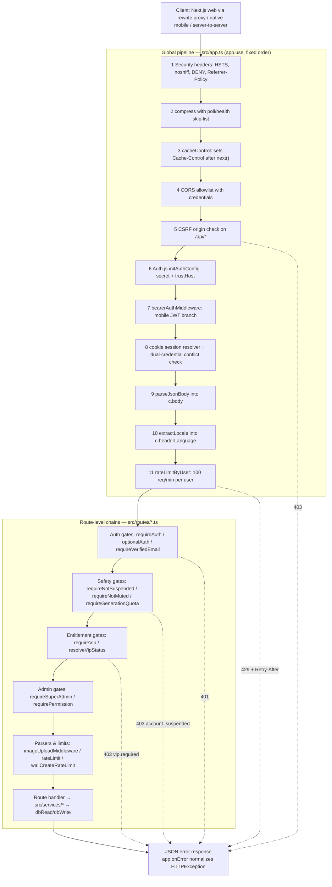
```mermaid
flowchart TB
    Client["Client: Next.js web via rewrite proxy / native mobile / server-to-server"]

    subgraph Global["Global pipeline — src/app.ts (app.use, fixed order)"]
        S1["1 Security headers: HSTS, nosniff, DENY, Referrer-Policy"]
        S2["2 compress with poll/health skip-list"]
        S3["3 cacheControl: sets Cache-Control after next()"]
        S4["4 CORS allowlist with credentials"]
        S5["5 CSRF origin check on /api/*"]
        S6["6 Auth.js initAuthConfig: secret + trustHost"]
        S7["7 bearerAuthMiddleware: mobile JWT branch"]
        S8["8 cookie session resolver + dual-credential conflict check"]
        S9["9 parseJsonBody into c.body"]
        S10["10 extractLocale into c.headerLanguage"]
        S11["11 rateLimitByUser: 100 req/min per user"]
    end

    subgraph Route["Route-level chains — src/routes/*.ts"]
        G1["Auth gates: requireAuth / optionalAuth / requireVerifiedEmail"]
        G2["Safety gates: requireNotSuspended / requireNotMuted / requireGenerationQuota"]
        G3["Entitlement gates: requireVip / resolveVipStatus"]
        G4["Admin gates: requireSuperAdmin / requirePermission"]
        G5["Parsers & limits: imageUploadMiddleware / rateLimit / wallCreateRateLimit"]
        H["Route handler → src/services/* → dbRead/dbWrite"]
    end

    Client --> S1 --> S2 --> S3 --> S4 --> S5 --> S6 --> S7 --> S8 --> S9 --> S10 --> S11
    S11 --> G1 --> G2 --> G3 --> G4 --> G5 --> H
    G2 -.->|"403 account_suspended"| Rej["JSON error response<br/>app.onError normalizes HTTPException"]
    G3 -.->|"403 vip.required"| Rej
    G1 -.->|"401"| Rej
    S5 -.->|"403"| Rej
    S11 -.->|"429 + Retry-After"| Rej
    H --> Rej
```

**Ownership direction:** `src/app.ts` owns global order; `src/middleware/*` owns gate logic; `src/routes/*` owns chain composition; `src/hono/env.ts` owns the typed context contract (`AppVariables`). Third-party authority: Upstash (rate-limit counters), Auth.js (session cookie crypto), Google/Stripe (not middleware — route-level).

---

## 3. Key Architectural Invariants

1. **Identity is resolved exactly once per request and before body parsing.** `bearerAuthMiddleware` (`app.ts:142`) and the cookie resolver (`app.ts:143-171`) both write only `userId`/`user`; `parseJsonBody` runs after both. Nothing downstream re-verifies credentials.
2. **A present-but-malformed `Authorization` header is never downgraded to cookie auth.** Non-`Bearer` schemes on non-service paths return `401 Invalid authorization scheme` (`bearer.ts:130-137`) — no silent fallback.
3. **Hybrid credentials (bearer + session cookie) must agree.** If both resolve to different identities the request is rejected `401 Conflicting credentials` (`app.ts:150-156`).
4. **Every gate that needs `userId` runs after the global auth layers, and every route that claims to be authenticated carries `requireAuth` explicitly** (`nextauth.ts:272-277`) — the global layer only *populates* context; it never rejects anonymous traffic by itself.
5. **VIP entitlement is decided only by `isUserVipActive`** (`services/subscription.ts:412-420`), which requires `tier === 'vip'` **and** a future `vipExpiresAt`. No route may compare `tier` directly.
6. **Rate limiting never blocks traffic on Redis failure** (`rate-limit.ts:126-130`, `wall-rate-limit.ts:68-71`); authentication never fails open.
7. **Error responses are normalized through two shapes only:** `HTTPException` → `app.onError` → `{ success: false, error }` with the thrown status; or direct `c.json(...)`/`c*Error` helpers (`src/utils/error.ts:552-608`) from gates that must emit structured payloads (`account_suspended`, `age_restricted`, `WALL_RATE_LIMITED`).
8. **Middleware never opens a write transaction.** Credit/state mutations happen inside handlers via `executeWithCredits` (AGENTS.md §3.3); a gate may read (`dbRead`) but must not write.
9. **Context variables are typed in one place** — `AppVariables` (`src/hono/env.ts:25-47`) — and no gate introduces an untyped key.
10. **Caching headers are single-writer:** `cacheControl` only fills `Cache-Control` when the handler did not already set one (`cache.ts:32-34`); hand-tuned route headers always win.

---

## 4. Deep Dive — Global Request Pipeline & Context Lifecycle

### 4.1 Exact global order (`src/app.ts`)

| # | Layer | Scope | Sets / does | Rejects with |
|---|---|---|---|---|
| 1 | Security headers (inline, `app.ts:34`) | `*` | `Strict-Transport-Security`, `X-Content-Type-Options: nosniff`, `X-Frame-Options: DENY`, `Referrer-Policy`, `X-XSS-Protection: 0` | never |
| 2 | `compress` (inline, `app.ts:63`) | `*` | gzip/deflate; skipped for `/status`, `/candidates/status`, `/health`, `/health/db` when `CPU_OPTIMIZATIONS_ENABLED` | never |
| 3 | `cacheControl` (`middleware/cache.ts`) | `*` | `Cache-Control` **after** `next()`, only if unset | never |
| 4 | `cors` (`app.ts:92`) | `*` | allowlist + `credentials: true`; exposes `Retry-After`, `X-RateLimit-*`, `Content-Disposition` | never (unlisted origin → no CORS headers) |
| 5 | `csrf` (`app.ts:111`) | `/api/*` | origin validation; **no-origin requests pass** (server-to-server, mobile, Stripe webhooks) | **403** |
| 6 | `initAuthConfig` (`app.ts:121`) | `*` | Auth.js runtime config (`AUTH_SECRET`, `trustHost`) | never |
| 7 | `bearerAuthMiddleware` (`middleware/bearer.ts`) | `/api/*` | `userId`, `user` from mobile JWT; session touch; 15s identity LRU | **401** (invalid/expired/revoked/scheme), **403** (banned) |
| 8 | Cookie resolver (inline, `app.ts:143`) | `/api/*` | `userId`, `user` from Auth.js cookie; dual-credential conflict check; stale-cookie cleanup | **401** (conflicting credentials), **403** (`account_banned` via `HTTPException`) |
| 9 | `parseJsonBody` (`middleware/body.ts`) | `*` | `c.body` (parsed JSON, ≤10 MB) | **400** invalid JSON, **413** too large |
| 10 | `extractLocale` (`middleware/locale.ts`) | `*` | `headerLanguage` (primary subtag of `Accept-Language`) | never |
| 11 | `rateLimitByUser` (`middleware/rate-limit.ts:191`) | `/api/*` | `X-RateLimit-*` headers; 100 req/min keyed by `userId` (anonymous skipped) | **429** + `Retry-After` |

Layer 8 is the only layer that can *resolve* identity without a credential (anonymous passes through with `userId` unset). Layers 7–8 are the "identity phase"; 9–10 are "enrichment"; 11 is "throttle". Everything before 7 is transport/policy.

### 4.2 Identity resolution sequence (dual credential)

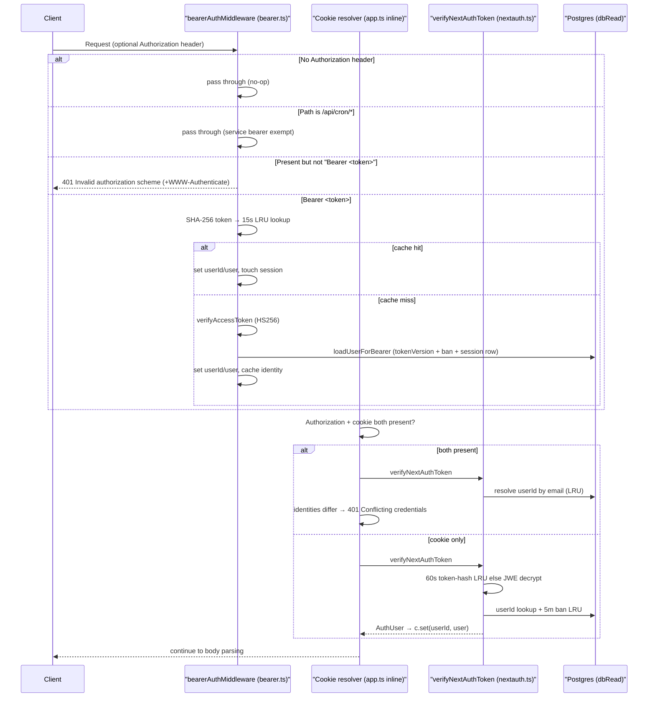
```mermaid
sequenceDiagram
    participant C as Client
    participant B as "bearerAuthMiddleware (bearer.ts)"
    participant K as "Cookie resolver (app.ts inline)"
    participant V as "verifyNextAuthToken (nextauth.ts)"
    participant DB as "Postgres (dbRead)"

    C->>B: Request (optional Authorization header)
    alt No Authorization header
        B->>B: pass through (no-op)
    else Path is /api/cron/*
        B->>B: pass through (service bearer exempt)
    else Present but not "Bearer <token>"
        B-->>C: 401 Invalid authorization scheme (+WWW-Authenticate)
    else Bearer <token>
        B->>B: SHA-256 token → 15s LRU lookup
        alt cache hit
            B->>B: set userId/user, touch session
        else cache miss
            B->>B: verifyAccessToken (HS256)
            B->>DB: loadUserForBearer (tokenVersion + ban + session row)
            B->>B: set userId/user, cache identity
        end
    end

    K->>K: Authorization + cookie both present?
    alt both present
        K->>V: verifyNextAuthToken
        V->>DB: resolve userId by email (LRU)
        K->>K: identities differ → 401 Conflicting credentials
    else cookie only
        K->>V: verifyNextAuthToken
        V->>V: 60s token-hash LRU else JWE decrypt
        V->>DB: userId lookup + 5m ban LRU
        V-->>K: AuthUser → c.set(userId, user)
    end
    K-->>C: continue to body parsing
```

**Context lifecycle:** `userId`/`user` are written once (identity phase) and read by every later gate; `isVip` is written by the VIP middleware (§6.15); `body`, `headerLanguage` are written by enrichment layers; `file`, `bookContentRating`, `hasAcknowledgedContent` are written by **route-level** middleware/handlers. `AppVariables` documents each key and its writer (`hono/env.ts:15-41`).

### 4.3 Route-level chain anatomy

A representative full chain (from `src/routes/books.ts`, AI generation route):

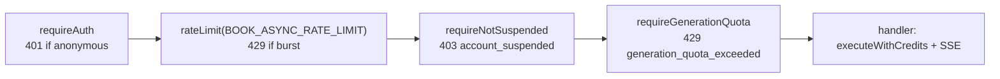
```mermaid
flowchart LR
    A["requireAuth<br/>401 if anonymous"] --> B["rateLimit(BOOK_ASYNC_RATE_LIMIT)<br/>429 if burst"]
    B --> C["requireNotSuspended<br/>403 account_suspended"]
    C --> D["requireGenerationQuota<br/>429 generation_quota_exceeded"]
    D --> H["handler: executeWithCredits + SSE"]
```

Chain ordering rule of thumb (detailed in §5): **identity → throttle → standing safety → entitlement → resource parsing → business**. Cheapest, most universal checks first; resource-specific checks (upload parsing, age gate) last because they require route params or body.

---

## 5. Deep Dive — Gate Selection & Composition Patterns

### 5.1 Choosing the right gate

| If the endpoint… | Use | Notes |
|---|---|---|
| requires a logged-in user | `requireAuth` | 328 route registrations across 15 route files (scan 2026-09-26) |
| works for guests but personalizes when logged in | `optionalAuth` | pass-through; context already populated upstream (44 usages) |
| performs a sensitive action needing verified email | `requireAuth, requireVerifiedEmail` | 72h grace window after signup; currently only `wall.ts` (15 usages) |
| writes/moderates public content | `+ requireNotSuspended, requireNotMuted` | structured 403 payloads with `activeActions` |
| generates AI content | `+ requireGenerationQuota` | enforces probation daily caps |
| burns provider tokens or money | `+ rateLimit({...})` with a **unique `prefix`** | shared prefixes double-count in Redis (`rate-limit.ts:96-103`) |
| is an admin surface | `requireSuperAdmin` or `requirePermission("key")` | super admin = `SYSTEM_USER_ID` only |
| exposes a VIP-only feature with a **hard** contract | `requireAuth, requireVip` | 403 `code: "vip.required"` |
| exposes a VIP-only feature with a **soft** upsell contract | `requireAuth, resolveVipStatus` + handler `if (!c.get("isVip"))` | 200 `{ locked: true }` |
| gates *another user's* resource by *their* entitlement | none — call `hasActiveVipSubscription(ownerId)` in the handler | middleware only knows the caller (§6.15) |
| gates access by content rating | `requireAgeGate` **after** setting `bookContentRating` | see gap G-2 — currently unwired |
| parses a multipart upload | `imageUploadMiddleware()` / `audioUploadMiddleware("field")` | magic-byte validated, in-memory |
| is a public expensive endpoint | `rateLimit(cfg, { ipFallback: true })` | throttles anonymous callers by IP |

### 5.2 Hard vs soft gates

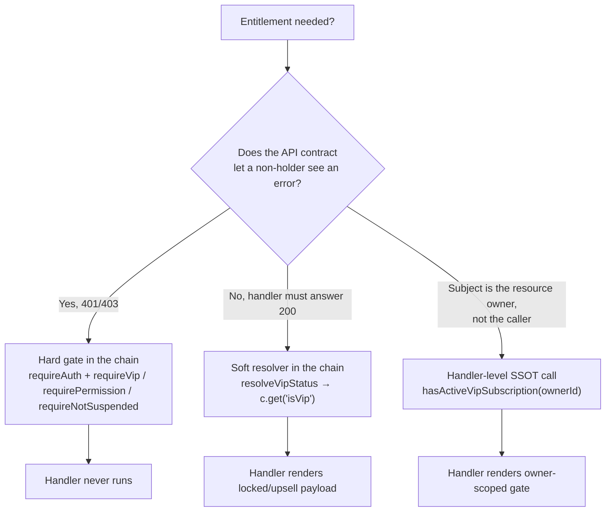
```mermaid
flowchart TB
    Q["Entitlement needed?"] --> R{"Does the API contract<br/>let a non-holder see an error?"}
    R -->|Yes, 401/403| Hard["Hard gate in the chain<br/>requireAuth + requireVip / requirePermission / requireNotSuspended"]
    R -->|No, handler must answer 200| Soft["Soft resolver in the chain<br/>resolveVipStatus → c.get('isVip')"]
    R -->|Subject is the resource owner,<br/>not the caller| Inline["Handler-level SSOT call<br/>hasActiveVipSubscription(ownerId)"]
    Hard --> Out1["Handler never runs"]
    Soft --> Out2["Handler renders locked/upsell payload"]
    Inline --> Out3["Handler renders owner-scoped gate"]
```

**Why both exist:** a 403 tells a client "you cannot do this"; a 200 `{ locked: true }` tells it "here is the state of your feature, upgrade to unlock". Converting one into the other is an API contract change — see §7 rows 6–7.

### 5.3 Chain recipes (copy-ready)

```typescript
// Standard authenticated mutation
router.post("/thing", requireAuth, requireNotSuspended, requireNotMuted, handler);

// AI generation (money + provider tokens)
router.post("/generate", requireAuth, rateLimit(GENERATE_RATE_LIMIT), requireNotSuspended, requireGenerationQuota, handler);

// Admin capability
router.get("/admin/blog", requireAuth, requirePermission("blog"), handler);

// VIP feature, hard rejection
router.post("/vip-action", requireAuth, requireVip, handler);

// VIP feature, soft lock (keeps HTTP 200)
router.get("/vip-feature", requireAuth, resolveVipStatus, handler);

// Public personalised read
router.get("/books/explore", optionalAuth, rateLimit(PUBLIC_RATE_LIMIT, { ipFallback: true }), handler);
```

**Ordering rules:** (a) `requireAuth` always first — every other gate reads `userId`; (b) rate limits before DB-touching gates so bursts are shed before queries; (c) never place `parseJsonBody`-dependent gates before layer 9 (it is global and always runs first anyway); (d) `optionalAuth` + a gate that *requires* identity is a bug — use `requireAuth`.

---

## 6. Middleware Catalog

Route-level usage counts below come from a source scan on 2026-09-26 (import lines excluded; comments included, so counts are ±1 on files where the name appears in a doc comment).

| # | Middleware | File | Scope | Rejections |
|---|---|---|---|---|
| 6.1 | Security response headers | `src/app.ts:34` | global | none |
| 6.2 | `compress` | `src/app.ts:63` | global | none |
| 6.3 | `cacheControl` | `src/middleware/cache.ts` | global | none |
| 6.4 | `cors` | `src/app.ts:92` | global | none |
| 6.5 | `csrf` | `src/app.ts:111` | `/api/*` | 403 |
| 6.6 | `initAuthConfig` | `src/app.ts:121` | global | none |
| 6.7 | `bearerAuthMiddleware` | `src/middleware/bearer.ts` | `/api/*` | 401, 403 |
| 6.8 | Cookie session resolver + `verifyNextAuthToken` | `src/app.ts:143`, `src/middleware/nextauth.ts` | `/api/*` | 401, 403 |
| 6.9 | `requireAuth` / `optionalAuth` / `requireVerifiedEmail` | `src/middleware/nextauth.ts` | route | 401, 403 |
| 6.10 | `parseJsonBody` | `src/middleware/body.ts` | global | 400, 413 |
| 6.11 | `extractLocale` | `src/middleware/locale.ts` | global | none |
| 6.12 | `rateLimit` / `rateLimitByUser` / `checkRateLimitByIP` | `src/middleware/rate-limit.ts` | global + route | 429 |
| 6.13 | `wallCreateRateLimit` | `src/middleware/wall-rate-limit.ts` | route (1 usage) | 429 |
| 6.14 | `requireNotSuspended` / `requireNotMuted` / `requireGenerationQuota` | `src/middleware/trust-safety.ts` | route (32 / 20 / 6) | 403, 429 |
| 6.15 | `resolveVipStatus` / `requireVip` | `src/middleware/vip.ts` | route (1 / 0) | 401, 403 (hard only) |
| 6.16 | `requireAdmin` / `requireSuperAdmin` / `requirePermission` | `src/middleware/admin-auth.ts` | route (0 / 9 / 59) | 401, 403 |
| 6.17 | `requireAgeGate` / `evaluateAgeGate` | `src/middleware/age-gate.ts` | route (0 — see G-2) | 403 |
| 6.18 | `imageUploadMiddleware` / `audioUploadMiddleware` | `src/middleware/upload.ts` | route (3 / 1) | 400, 413 |

---

### 6.1 Security response headers (inline)

**Purpose.** Defence-in-depth response headers on every response, including errors and preflight, so direct serverless invocations are covered even when the edge proxy config drifts.

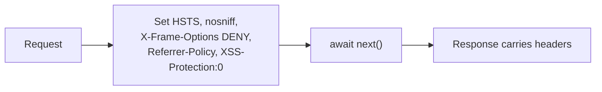
```mermaid
flowchart LR
    A["Request"] --> B["Set HSTS, nosniff,<br/>X-Frame-Options DENY,<br/>Referrer-Policy, XSS-Protection:0"]
    B --> C["await next()"]
    C --> D["Response carries headers"]
```

**Use case.** Automatic — no route opts in. Values assume TLS termination + `includeSubDomains; preload`; the same headers should also exist at Vercel Edge (documented duplication, not drift).

---

### 6.2 `compress` (inline)

**Purpose.** gzip/deflate for API payloads (book/page JSON typically 60–80% smaller), with a **Fluid Active CPU skip-list** so tiny realtime poll bodies are not compressed for nothing.

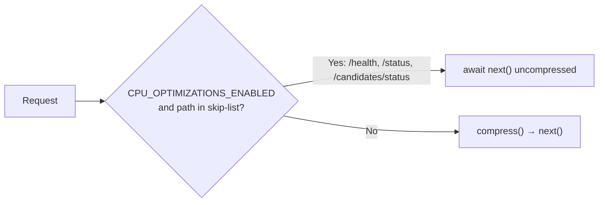
```mermaid
flowchart LR
    A["Request"] --> B{"CPU_OPTIMIZATIONS_ENABLED<br/>and path in skip-list?"}
    B -->|Yes: /health, /status, /candidates/status| C["await next() uncompressed"]
    B -->|No| D["compress() → next()"]
```

**Use case.** Automatic. Paths are matched by suffix (`shouldSkipCompress`, `app.ts:57-62`); adding a new high-frequency poll endpoint with a `/status` suffix inherits the skip automatically.

---

### 6.3 `cacheControl`

**Purpose.** Assigns `Cache-Control` by method, status, auth state and path **after** the handler runs, and never overwrites a hand-tuned header.

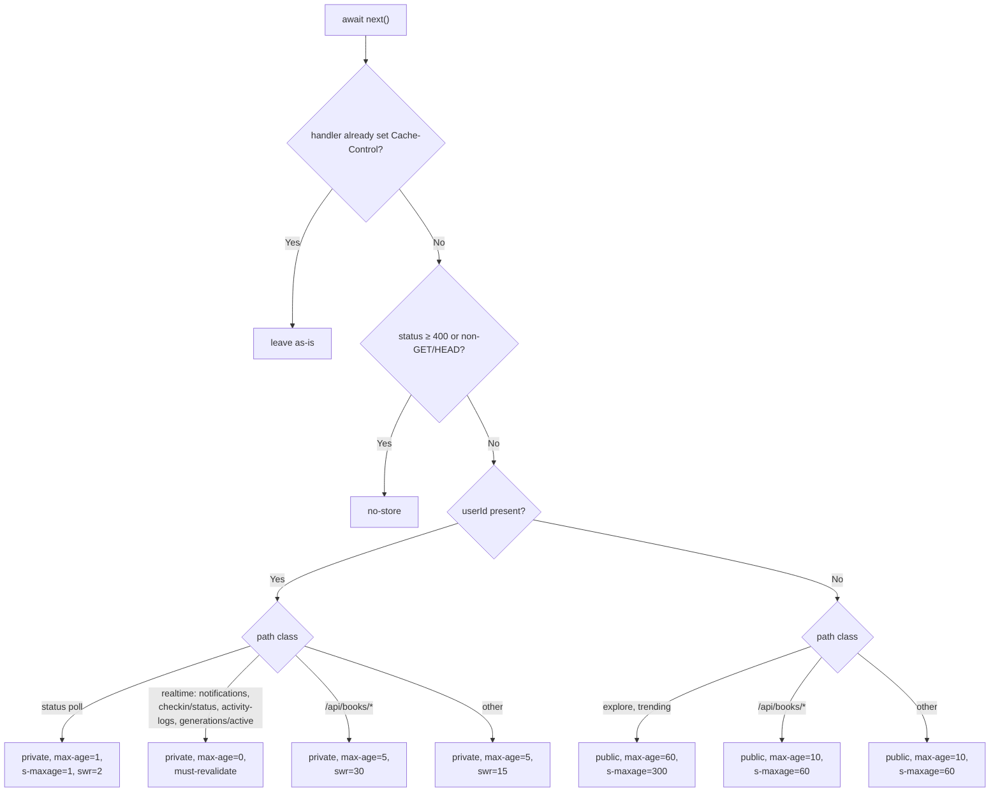
```mermaid
flowchart TB
    A["await next()"] --> B{"handler already set Cache-Control?"}
    B -->|Yes| Z["leave as-is"]
    B -->|No| C{"status ≥ 400 or non-GET/HEAD?"}
    C -->|Yes| D["no-store"]
    C -->|No| E{"userId present?"}
    E -->|Yes| F{"path class"}
    F -->|status poll| G["private, max-age=1,<br/>s-maxage=1, swr=2"]
    F -->|realtime: notifications,<br/>checkin/status, activity-logs, generations/active| H["private, max-age=0,<br/>must-revalidate"]
    F -->|/api/books/*| I["private, max-age=5,<br/>swr=30"]
    F -->|other| J["private, max-age=5,<br/>swr=15"]
    E -->|No| K{"path class"}
    K -->|explore, trending| L["public, max-age=60,<br/>s-maxage=300"]
    K -->|/api/books/*| M["public, max-age=10,<br/>s-maxage=60"]
    K -->|other| N["public, max-age=10,<br/>s-maxage=60"]
```

**Use case.** Automatic. `private` (never `public`) on authenticated reads is the AGENTS.md §3.7D rule that keeps per-user payloads from being shared across users at the CDN.

---

### 6.4 `cors`

**Purpose.** Allowlist origins with `credentials: true` so the Next.js origin (and portal) can send Auth.js cookies; no-origin requests (mobile, curl, server-to-server) are explicitly allowed.

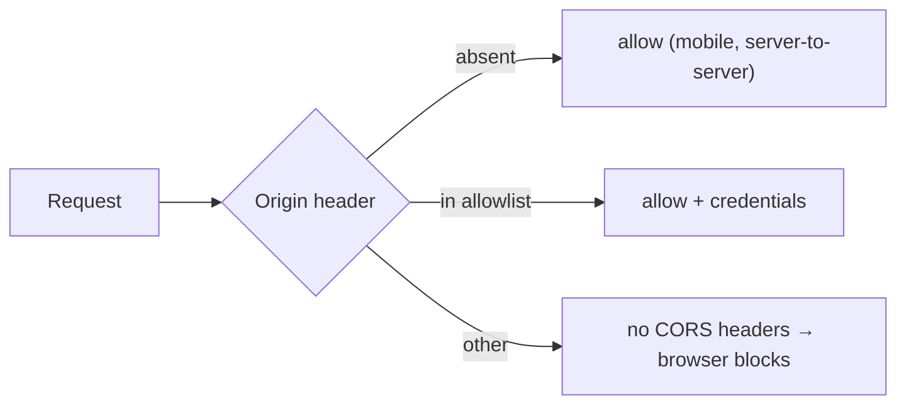
```mermaid
flowchart LR
    A["Request"] --> B{"Origin header"}
    B -->|"absent"| C["allow (mobile, server-to-server)"]
    B -->|"in allowlist"| D["allow + credentials"]
    B -->|"other"| E["no CORS headers → browser blocks"]
```

**Use case.** Automatic. Preview deployments must be added via `FRONTEND_URL`; allowed methods/headers and exposed headers (`Retry-After`, `X-RateLimit-*`) are declared once at `app.ts:92-104`.

---

### 6.5 `csrf` (Hono built-in)

**Purpose.** Reject cross-origin state-changing requests from malicious sites. Runs **before auth and body parsing** so forgeries die early. Origin travels through the Next.js rewrite proxy, so the browser's real origin is visible.

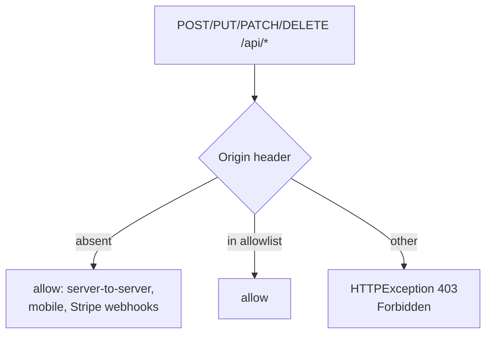
```mermaid
flowchart TB
    A["POST/PUT/PATCH/DELETE /api/*"] --> B{"Origin header"}
    B -->|"absent"| C["allow: server-to-server,<br/>mobile, Stripe webhooks"]
    B -->|"in allowlist"| D["allow"]
    B -->|"other"| E["HTTPException 403<br/>Forbidden"]
```

**Use case.** Automatic for all `/api/*` mutations. Full threat matrix (including `Origin: null`) is in [CSRF_PROTECTION.md](./CSRF_PROTECTION.md).

---

### 6.6 `initAuthConfig`

**Purpose.** Configures the Auth.js runtime (`AUTH_SECRET`, `trustHost: true`, empty `providers[]`) — the backend **verifies** session cookies only; it never runs OAuth flows. `trustHost` is required behind Vercel's proxy.

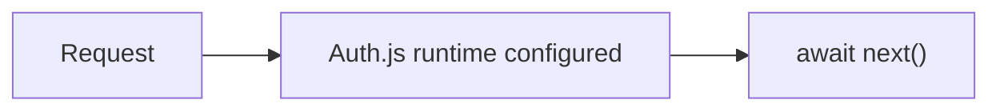
```mermaid
flowchart LR
    A["Request"] --> B["Auth.js runtime configured"] --> C["await next()"]
```

**Use case.** Automatic; prerequisite for §6.8. Misconfiguration (missing `AUTH_SECRET`) degrades to "no identity" with a logged error, never a crash (`nextauth.ts:141-144`).

---

### 6.7 `bearerAuthMiddleware`

**Purpose.** Native-mobile credential adapter: verifies `Authorization: Bearer <JWT>` (jose HS256), enforces revocation (`tokenVersion`, ban, fresh `sid` session row), and attaches the **same** `userId`/`user` shape as the cookie path so `requireAuth` and all routes work unchanged.

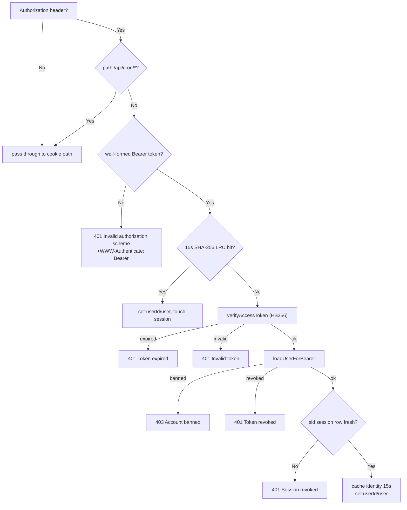
```mermaid
flowchart TB
    A["Authorization header?"] -->|No| P["pass through to cookie path"]
    A -->|Yes| B{"path /api/cron/*?"}
    B -->|Yes| P
    B -->|No| C{"well-formed Bearer token?"}
    C -->|No| E1["401 Invalid authorization scheme<br/>+WWW-Authenticate: Bearer"]
    C -->|Yes| D{"15s SHA-256 LRU hit?"}
    D -->|Yes| Z["set userId/user, touch session"]
    D -->|No| F["verifyAccessToken (HS256)"]
    F -->|expired| E2["401 Token expired"]
    F -->|invalid| E3["401 Invalid token"]
    F -->|ok| G["loadUserForBearer"]
    G -->|banned| E4["403 Account banned"]
    G -->|revoked| E5["401 Token revoked"]
    G -->|ok| H{"sid session row fresh?"}
    H -->|No| E6["401 Session revoked"]
    H -->|Yes| I["cache identity 15s<br/>set userId/user"]
```

**Use case.** Applied globally to `/api/*` (`app.ts:142`) but *inert* without the header — the cookie path is untouched. Cron routes carry `Authorization: Bearer <CRON_SECRET>` and are exempted by `isServiceBearerPath`. Details: [DUAL_AUTH_ARCHITECTURE.md](./DUAL_AUTH_ARCHITECTURE.md).

---

### 6.8 Cookie session resolver + `verifyNextAuthToken`

**Purpose.** Decrypts the Auth.js JWE session cookie, resolves the backend user by email (with in-flight deduplication, fallback creation, ban check), and — when **both** bearer and cookie credentials are present — proves they agree.

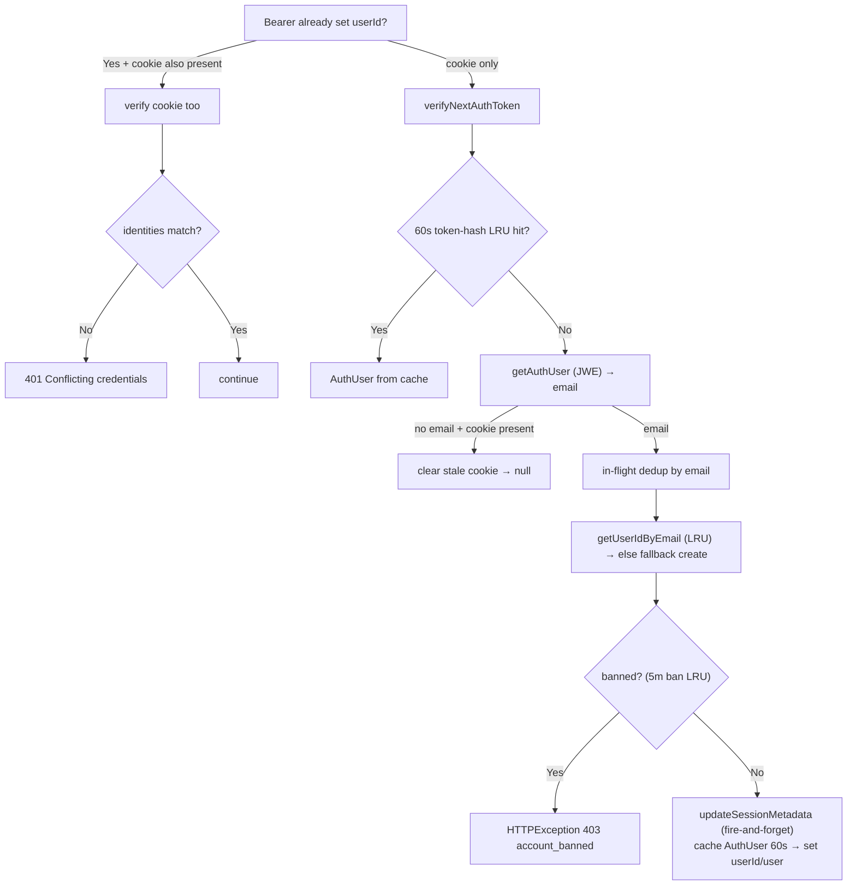
```mermaid
flowchart TB
    A["Bearer already set userId?"] -->|Yes + cookie also present| B["verify cookie too"]
    B --> C{"identities match?"}
    C -->|No| D["401 Conflicting credentials"]
    C -->|Yes| E["continue"]
    A -->|cookie only| F["verifyNextAuthToken"]
    F --> G{"60s token-hash LRU hit?"}
    G -->|Yes| H["AuthUser from cache"]
    G -->|No| I["getAuthUser (JWE) → email"]
    I -->|no email + cookie present| J["clear stale cookie → null"]
    I -->|email| K["in-flight dedup by email"]
    K --> L["getUserIdByEmail (LRU) → else fallback create"]
    L --> M{"banned? (5m ban LRU)"}
    M -->|Yes| N["HTTPException 403 account_banned"]
    M -->|No| O["updateSessionMetadata (fire-and-forget)<br/>cache AuthUser 60s → set userId/user"]
```

**Use case.** Runs on every `/api/*` request. High-frequency polls (`/touch`, `/status`) hit the 60s LRU and skip crypto entirely — the AGENTS.md §3.7C optimization. Logout invalidates via `invalidateCurrentSessionVerifyCache`; ban changes invalidate via `invalidateUserBanCache`.

---

### 6.9 `requireAuth` / `optionalAuth` / `requireVerifiedEmail`

**Purpose.** The route-facing auth vocabulary. `requireAuth` is a **guard on already-resolved identity** (401 if the global layer found none); `optionalAuth` is an explicit pass-through that documents "guests allowed"; `requireVerifiedEmail` adds an email-verification gate with a 72h onboarding grace window.

| Middleware | Behavior | Rejection |
|---|---|---|
| `requireAuth` | throws if `c.get("userId")` unset | `HTTPException 401 Authentication required` |
| `optionalAuth` | `await next()` — documentation value; context already populated | none |
| `requireVerifiedEmail` | `isEmailVerified(userId)`; 72h grace from `createdAt` | `HTTPException 403` verification message |

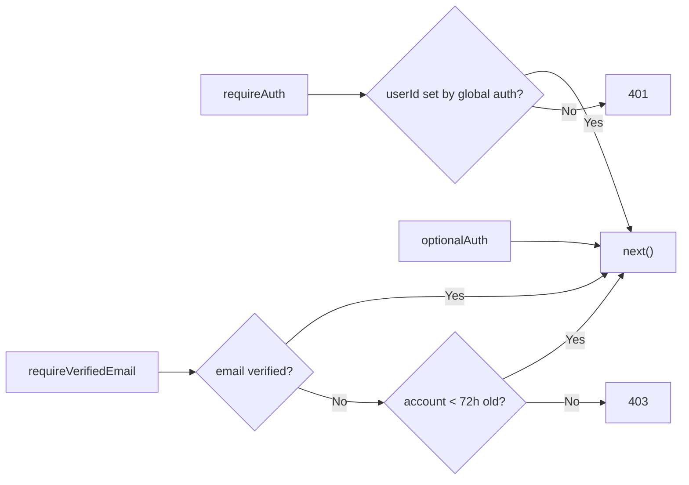
```mermaid
flowchart LR
    A["requireAuth"] --> B{"userId set by global auth?"}
    B -->|Yes| C["next()"]
    B -->|No| D["401"]
    E["optionalAuth"] --> C
    F["requireVerifiedEmail"] --> G{"email verified?"}
    G -->|Yes| C
    G -->|No| H{"account < 72h old?"}
    H -->|Yes| C
    H -->|No| I["403"]
```

**Use case.**

```typescript
router.get("/user", requireAuth, handler);                 // guests rejected
router.get("/books/:identifier", optionalAuth, handler);    // guests allowed, personalised when logged in
router.post("/wall/notes", requireAuth, requireVerifiedEmail, requireNotMuted, handler);
```

---

### 6.10 `parseJsonBody`

**Purpose.** Reads and parses `application/json` bodies **once** per request into `c.get("body")`, replacing per-handler `await c.req.json()`; enforces a 10 MB limit (feedback screenshots embed base64).

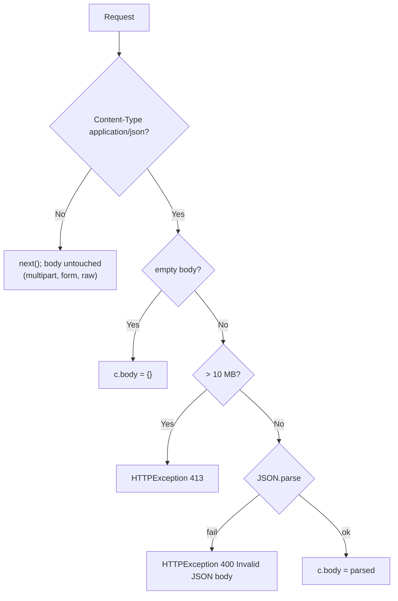
```mermaid
flowchart TB
    A["Request"] --> B{"Content-Type application/json?"}
    B -->|No| C["next(); body untouched<br/>(multipart, form, raw)"]
    B -->|Yes| D{"empty body?"}
    D -->|Yes| E["c.body = {}"]
    D -->|No| F{"> 10 MB?"}
    F -->|Yes| G["HTTPException 413"]
    F -->|No| H{"JSON.parse"}
    H -->|fail| I["HTTPException 400 Invalid JSON body"]
    H -->|ok| J["c.body = parsed"]
```

**Use case.** Automatic. On parse failure `body` stays unset so a handler can still choose its own 400 shape. Non-JSON endpoints (Stripe webhook) read `c.req.text()` themselves.

---

### 6.11 `extractLocale`

**Purpose.** Parses `Accept-Language` into the primary subtag for translation lookups in book/profile queries.

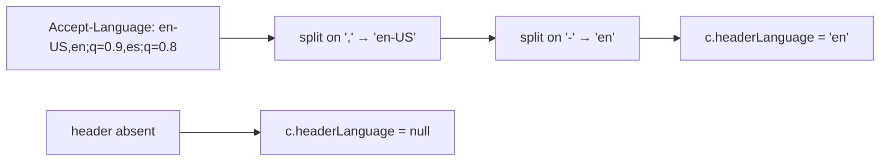
```mermaid
flowchart LR
    A["Accept-Language: en-US,en;q=0.9,es;q=0.8"] --> B["split on ',' → 'en-US'"] --> C["split on '-' → 'en'"] --> D["c.headerLanguage = 'en'"]
    E["header absent"] --> F["c.headerLanguage = null"]
```

**Use case.** Automatic; handlers read `c.get("headerLanguage")` and pass it into query builders (e.g. `getEnrichedBook(identifier, userId, headerLanguage)`).

---

### 6.12 `rateLimit` / `rateLimitByUser` / `checkRateLimitByIP`

**Purpose.** Three throttling primitives: a **factory** for per-route Redis sliding windows, the **global** 100 req/min instance, and an **in-memory IP counter** for pre-auth endpoints (login/signup brute force).

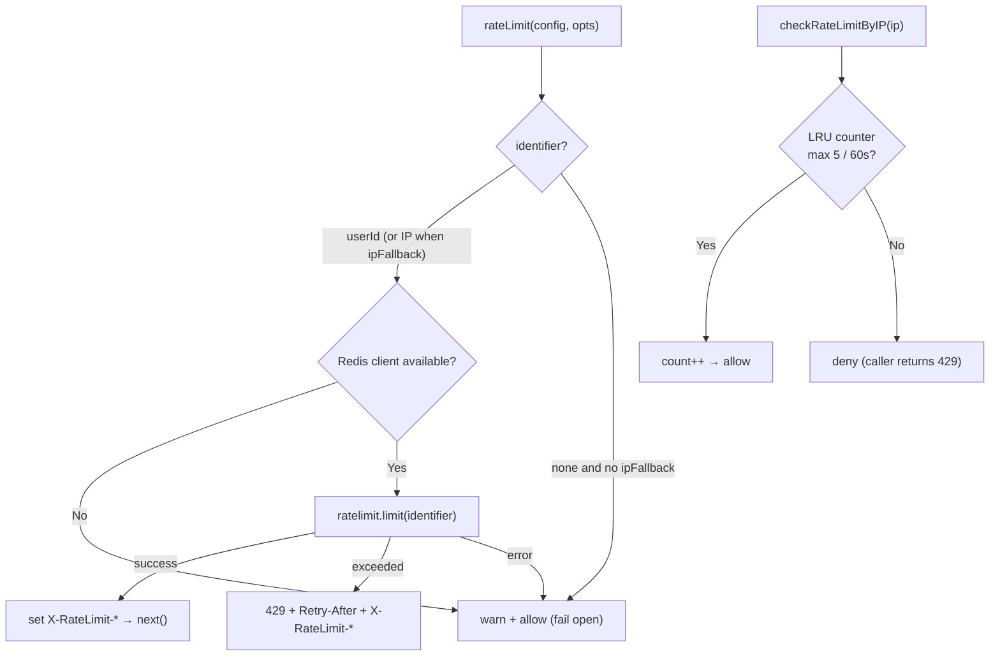
```mermaid
flowchart TB
    A["rateLimit(config, opts)"] --> B{"identifier?"}
    B -->|"userId (or IP when ipFallback)"| C{"Redis client available?"}
    C -->|No| D["warn + allow (fail open)"]
    C -->|Yes| E["ratelimit.limit(identifier)"]
    E -->|success| F["set X-RateLimit-* → next()"]
    E -->|exceeded| G["429 + Retry-After + X-RateLimit-*"]
    E -->|error| D
    B -->|none and no ipFallback| D
    H["checkRateLimitByIP(ip)"] --> I{"LRU counter <br/>max 5 / 60s?"}
    I -->|Yes| J["count++ → allow"]
    I -->|No| K["deny (caller returns 429)"]
```

**Use case.**

```typescript
app.use("/api/*", rateLimitByUser);                                  // global
router.post("/books/async", requireAuth, rateLimit(BOOK_ASYNC_RATE_LIMIT), handler);
router.get("/books/prompt", optionalAuth, rateLimit(PROMPT_LIMIT, { ipFallback: true }), handler);
router.post("/auth/login", (c) => { if (!checkRateLimitByIP(ip)) return 429; ... });
```

**Hard rule:** every per-route config needs a **unique `prefix`** — shared prefixes write the same Redis key and double-count (`rate-limit.ts:96-103`). The global instance deliberately uses the library default prefix.

---

### 6.13 `wallCreateRateLimit`

**Purpose.** Tier-aware throttle for Wall Note creation: **3/h** (account <24h old), **30/h** (active VIP), **10/h** (everyone else) — a single middleware that reads entitlement instead of requiring three routes.

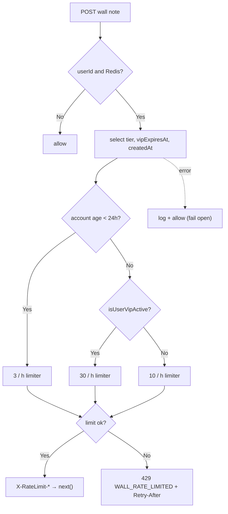
```mermaid
flowchart TB
    A["POST wall note"] --> B{"userId and Redis?"}
    B -->|No| C["allow"]
    B -->|Yes| D["select tier, vipExpiresAt, createdAt"]
    D --> E{"account age < 24h?"}
    E -->|Yes| F["3 / h limiter"]
    E -->|No| G{"isUserVipActive?"}
    G -->|Yes| H["30 / h limiter"]
    G -->|No| I["10 / h limiter"]
    F --> J{"limit ok?"}
    H --> J
    I --> J
    J -->|Yes| K["X-RateLimit-* → next()"]
    J -->|No| L["429 WALL_RATE_LIMITED + Retry-After"]
    D -.->|error| M["log + allow (fail open)"]
```

**Use case.** `wall.ts` route chain. Note the ordering: entitlement is read *inside* the limiter because the limit itself depends on tier — this is a legitimate exception to "gates should not overlap" (§6.15).

---

### 6.14 Trust & Safety gates — `requireNotSuspended` / `requireNotMuted` / `requireGenerationQuota`

**Purpose.** Progressive-discipline capability gating: block writes/authoring for suspended or banned accounts, block community interaction for muted accounts, and cap daily generations for throttled/probation accounts — **without** blocking safe-haven reads (reading, profiles, GDPR export).

All three read `getOrFetchUserEnforcementStatus(userId)` from a **2-minute LRU** (`services/trust-safety.ts`), invalidated immediately on admin action or appeal resolution. All three **pass through when `userId` is unset** (they assume `requireAuth` already ran for authenticated routes).

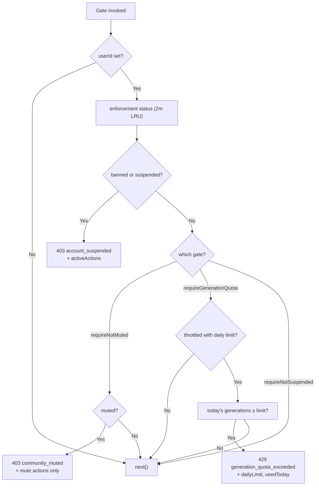
```mermaid
flowchart TB
    A["Gate invoked"] --> B{"userId set?"}
    B -->|No| Z["next()"]
    B -->|Yes| C["enforcement status (2m LRU)"]
    C --> D{"banned or suspended?"}
    D -->|Yes| E1["403 account_suspended<br/>+ activeActions"]
    D -->|No| F{"which gate?"}
    F -->|requireNotMuted| G{"muted?"}
    G -->|Yes| E2["403 community_muted<br/>+ mute actions only"]
    G -->|No| Z
    F -->|requireGenerationQuota| H{"throttled with daily limit?"}
    H -->|No| Z
    H -->|Yes| I["today's generations ≥ limit?"]
    I -->|Yes| E3["429 generation_quota_exceeded<br/>+ dailyLimit, usedToday"]
    I -->|No| Z
    F -->|requireNotSuspended| Z
```

**Use case.**

```typescript
router.post("/wall/notes", requireAuth, requireNotSuspended, requireNotMuted, handler);
router.post("/books/async",  requireAuth, rateLimit(BOOK_ASYNC_RATE_LIMIT), requireNotSuspended, requireGenerationQuota, handler);
```

**Safety invariant:** these gates must never be applied to safe-haven routes (reading, `GET /user/export`, `GET /user/enforcement-status`).

---

### 6.15 VIP entitlement gates — `resolveVipStatus` / `requireVip`

**Purpose.** Reusable VIP gating with an explicit **soft/hard** pair, both resolving through the SSOT `hasActiveVipSubscription` → `isUserVipActive` (`services/subscription.ts:412-449`), which requires `tier === 'vip'` **and** unexpired `vipExpiresAt`.

- **`resolveVipStatus` (soft)** — never rejects; sets `c.set("isVip", boolean)` (`false` for anonymous). The handler renders its own locked/upsell payload while keeping HTTP 200.
- **`requireVip` (hard)** — 401 when no identity, then 403 `{ success: false, error, code: "vip.required" }` when not an active VIP; sets `c.set("isVip", true)` on success. Standalone-safe, but convention is `requireAuth, requireVip`.

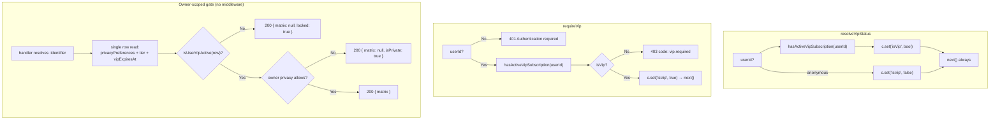
```mermaid
flowchart TB
    subgraph Soft["resolveVipStatus"]
        S1["userId?"] --> S2["hasActiveVipSubscription(userId)"]
        S2 --> S3["c.set('isVip', bool)"] --> S4["next() always"]
        S1 -->|"anonymous"| S5["c.set('isVip', false)"] --> S4
    end
    subgraph Hard["requireVip"]
        H1["userId?"] -->|No| HX["401 Authentication required"]
        H1 -->|Yes| H2["hasActiveVipSubscription(userId)"]
        H2 --> H3{"isVip?"}
        H3 -->|No| HY["403 code: vip.required"]
        H3 -->|Yes| H4["c.set('isVip', true) → next()"]
    end
    subgraph Owner["Owner-scoped gate (no middleware)"]
        O1["handler resolves :identifier"] --> O2["single row read:<br/>privacyPreferences + tier + vipExpiresAt"]
        O2 --> O3{"isUserVipActive(row)?"}
        O3 -->|No| O4["200 { matrix: null, locked: true }"]
        O3 -->|Yes| O5{"owner privacy allows?"}
        O5 -->|No| O6["200 { matrix: null, isPrivate: true }"]
        O5 -->|Yes| O7["200 { matrix }"]
    end
```

**Use case.**

```typescript
// Soft: upsell contract preserved (routes/user.ts GET /api/user/mind-matrix)
router.get("/user/mind-matrix", requireAuth, resolveVipStatus, async (c) => {
  if (!c.get("isVip")) return c.json({ success: true, matrix: null, locked: true });
  return c.json({ success: true, matrix: await getUserMindMatrix(c.get("userId")!) });
});

// Hard: future VIP-only mutation
router.post("/vip-action", requireAuth, requireVip, handler);

// Owner-scoped: middleware cannot know the subject → handler-level SSOT call
// (GET /api/users/:identifier/mind-matrix uses optionalAuth + one combined row read,
//  because the row also carries showMindMatrixOnProfile.)
```

**Why two call sites stay out of middleware (TOCTOU):** `POST /user/checkin/double` evaluates VIP **inside** `performDailyCheckIn`'s `dbWrite.transaction` (`services/user.ts:726-744`) so entitlement is checked under the same locks as the claim-row insert; middleware runs outside the transaction and cannot provide that guarantee. Likewise `POST /:identifier/export` keeps a handler-level `hasActiveVipSubscription` check to preserve its feature-specific message ("Manuscript Studio export is an exclusive VIP perk.") — adopting `requireVip` there would replace that copy with the generic message (tracked as G-3).

---

### 6.16 Admin gates — `requireAdmin` / `requireSuperAdmin` / `requirePermission`

**Purpose.** Server-side authorization for `/api/admin/*`: membership in `admin_users`, capability-scoped permission checks, and a `SYSTEM_USER_ID` super-admin bypass. **Never rely on UI hiding for admin protection** — every admin route carries a gate.

| Middleware | Rule | Rejection |
|---|---|---|
| `requireAdmin` | super admin **or** row in `admin_users` | 401 / 403 *(currently unused — see G-4)* |
| `requireSuperAdmin` | `SYSTEM_USER_ID` only | 401 / 403 |
| `requirePermission(...keys)` | super admin, or admin holding **any** listed capability | 401 / 403 with required keys |

Capability keys (`ADMIN_PERMISSIONS`): `blog`, `social_mentions`, `testimonials`, `feedbacks`, `books`, `users`, `usage`, `analytics`, `announcements`, `vouchers`, `payouts`.

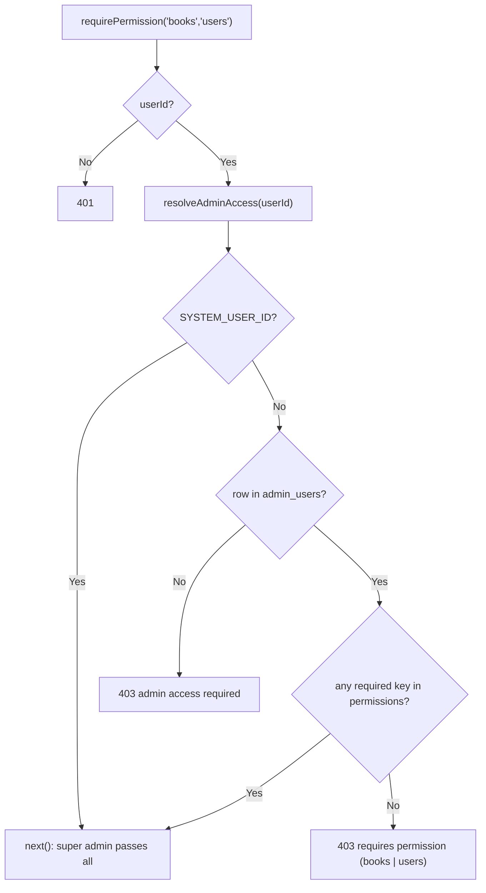
```mermaid
flowchart TB
    A["requirePermission('books','users')"] --> B{"userId?"}
    B -->|No| X["401"]
    B -->|Yes| C["resolveAdminAccess(userId)"]
    C --> D{"SYSTEM_USER_ID?"}
    D -->|Yes| Z["next(): super admin passes all"]
    D -->|No| E{"row in admin_users?"}
    E -->|No| Y["403 admin access required"]
    E -->|Yes| F{"any required key in permissions?"}
    F -->|Yes| Z
    F -->|No| W["403 requires permission (books | users)"]
```

**Use case.**

```typescript
router.get("/admin/blog",        requireAuth, requirePermission("blog"), handler);
router.post("/admin/payouts",    requireAuth, requirePermission("payouts"), handler);
router.get("/admin/super-only",  requireAuth, requireSuperAdmin, handler);
```

---

### 6.17 Age gate — `requireAgeGate` / `evaluateAgeGate`

**Purpose.** Tiered content-rating access: `general` (all), `teen` (13+), `mature` (16+ **and** explicit acknowledgment), `adult` (18+ **and** acknowledgment); minors 13–17 additionally need parental consent for mature/adult. Age derives from the self-declared `users.dateOfBirth`.

**Status: implemented but unwired** — no route currently composes `requireAgeGate` (see gap G-2). It is documented here because it is exported, complete, and referenced by `TRUST_AND_SAFETY` §TS.10 citations.

```mermaid
flowchart TB
    A["requireAgeGate"] --> B{"userId set?"}
    B -->|No| Z["next(): public routes self-gate"]
    B -->|Yes| C{"bookContentRating set<br/>and not 'general'?"}
    C -->|No| Z
    C -->|Yes| D["evaluateAgeGate(userId, rating, acknowledged)"]
    D --> E{"dateOfBirth missing?"}
    E -->|Yes| F["403 age_restricted<br/>requiresAgeVerification"]
    E -->|No| G{"age < required?"}
    G -->|Yes| H["403 age_restricted + minimumAge"]
    G -->|No| I{"13–17 on mature/adult<br/>without parental consent?"}
    I -->|Yes| J["403 requiresParentalConsent"]
    I -->|No| K{"mature/adult without<br/>hasAcknowledgedContent?"}
    K -->|Yes| L["403 acknowledgment required"]
    K -->|No| Z
```

**Use case (intended).**

```typescript
router.get("/books/:slug", getBook, setContentRatingForAgeGate, requireAgeGate, handler);
```

---

### 6.18 Upload parsers — `imageUploadMiddleware` / `audioUploadMiddleware`

**Purpose.** Multer replacements that parse a single multipart file into `c.get("file")` **in memory** (serverless-friendly: no disk I/O), with content validation.

| Check | Image (`imageUploadMiddleware`) | Audio (`audioUploadMiddleware`) |
|---|---|---|
| Field | `imageFile` (default) | `audioFile` |
| MIME allow-list | any `image/*` **except `image/svg+xml`** (XSS vector) | `audio/mpeg`, `audio/ogg`, `audio/wav` |
| Content sniffing | magic bytes for JPEG/PNG/GIF/WebP | none |
| Size | `MAX_IMAGE_UPLOAD_SIZE` = 2 MB | 10 MB |
| JSON requests | skipped (base64 `imageUrl` path) | n/a |

```mermaid
flowchart TB
    A["Multipart request"] --> B{"image middleware:<br/>Content-Type JSON?"}
    B -->|Yes| C["next(): base64 path"]
    B -->|No| D["c.req.parseBody"]
    D -->|fail| E["400 Invalid multipart form data"]
    D -->|ok| F{"File present at field?"}
    F -->|No| G["400 file required"]
    F -->|Yes| H{"MIME allowed<br/>and not SVG?"}
    H -->|No| I["400 rejected type"]
    H -->|Yes| J{"size ≤ limit?"}
    J -->|No| K["413 too large"]
    J -->|Yes| L{"image: magic bytes match MIME?"}
    L -->|No| M["400 content/type mismatch"]
    L -->|Yes| N["c.set('file', {buffer, mimetype, size}) → next()"]
```

**Use case.**

```typescript
router.put("/:id/cover-image", requireAuth, imageUploadMiddleware(), handler);   // books.ts
router.post("/audio",          requireAuth, audioUploadMiddleware("audioFile"), handler); // pen.ts
```

---

## 7. Failure Modes & Recovery Matrix

| # | Failure | Detection / error | Recovery / client behavior |
|---|---|---|---|
| 1 | Anonymous call to an authenticated route | `requireAuth` → `HTTPException 401` → `app.onError` `{ success:false, error:"Authentication required" }` | Client redirects to sign-in; no partial data written |
| 2 | Expired/revoked mobile token | `bearer.ts` → **401** `Token expired` / `Token revoked` / `Session revoked` + `WWW-Authenticate` | Mobile client refreshes token via refresh flow, retries |
| 3 | Malformed `Authorization` scheme (`Basic`, bare `Bearer`) | `bearer.ts:130-137` → **401** `Invalid authorization scheme` | Hard failure by design — no cookie fallback (§3 invariant 2) |
| 4 | Bearer + cookie identities disagree | `app.ts:150-156` → **401** `Conflicting credentials` | Client clears stale credential and re-authenticates |
| 5 | Banned account (either credential) | `nextauth.ts:228-231` → **403** `account_banned`; bearer path → **403** `Account banned` | Client surfaces ban notice; ban LRU invalidation on admin action |
| 6 | Cross-origin mutation from disallowed origin | `hono/csrf` → **403** `Forbidden` | Browser blocks; see [CSRF_PROTECTION.md](./CSRF_PROTECTION.md) |
| 7 | Redis unavailable / Upstash error during rate limit | `rate-limit.ts:126-166` → logged, **request allowed (fail open)** | Availability preserved; monitoring alert on log line |
| 8 | Rate limit exceeded | **429** + `Retry-After` + `X-RateLimit-*` | Client backs off for `Retry-After` seconds |
| 9 | Wall Note burst over tier allowance | `wall-rate-limit.ts` → **429** `WALL_RATE_LIMITED` + `retryAfter` | Client shows cooldown; limit auto-upgrades if VIP |
| 10 | Suspension/ban mid-session | `requireNotSuspended` → **403** `account_suspended` + `activeActions` | Client shows enforcement notice; safe-haven routes still 200 |
| 11 | Community mute | `requireNotMuted` → **403** `community_muted` | Reads/comments elsewhere unaffected |
| 12 | Probation generation cap reached | `requireGenerationQuota` → **429** `generation_quota_exceeded` + `dailyLimit` | Client shows "tomorrow" messaging |
| 13 | Non-VIP on a **hard** VIP route | `requireVip` → **403** `code:"vip.required"` | Client shows upgrade sheet |
| 14 | Non-VIP on a **soft** VIP route (Mind Matrix) | handler → **200** `{ matrix:null, locked:true }` | Client renders locked/upsell state — not an error |
| 15 | Malformed JSON body / >10 MB | `parseJsonBody` → **400** / **413** | Client fixes payload; `body` remains unset |
| 16 | Upload MIME/size/magic-byte violation | `upload.ts` → **400** / **413** | Client re-encodes image (SVG rejected by policy) |
| 17 | `AUTH_SECRET` missing | `nextauth.ts:141-144` logged, identity = null → downstream **401** | Ops restores env; no crash loop |
| 18 | Email unverified past 72h grace | `requireVerifiedEmail` → **403** | Client routes to verification flow |

---

## 8. Industry Standard Comparison

### The standard (or the de-facto practice)

Layered HTTP middleware chains are the mainstream pattern in every major web stack: Express/Koa middleware, Hono's [`hono.dev/docs/guide/middleware`](https://hono.dev/docs/guide/middleware), Next.js `middleware.ts`, Django middleware. Security expectations are anchored in the [OWASP API Security Top 10](https://owasp.org/API-Security/) (API2 Broken Authentication, API4 Broken Object Level Authorization), the [OWASP CSRF Prevention Cheat Sheet](https://cheatsheetseries.owasp.org/cheatsheets/Cross-Site_Request_Forgery_Prevention_Cheat_Sheet.html), and [RFC 6750 (Bearer Token Usage)](https://datatracker.ietf.org/doc/html/rfc6750). Twistloom is benchmarked against these, not against a generic "best practice".

### How this design compares

- **Matches the standard:** single ordered pipeline with explicit route chains; origin-based CSRF for cookie auth; bearer tokens verified with signature + revocation checks + `WWW-Authenticate` error semantics (RFC 6750 §3); layered authn → authz → throttling.
- **Deliberately ahead:** (a) *dual-credential convergence with conflict detection* — most stacks pick cookie **or** token and never cross-validate a hybrid request; Twistloom 401s on identity mismatch (`app.ts:150-156`). (b) *Fail-open throttling with fail-closed identity* is an explicit, documented availability decision (AGENTS.md §3.2) rather than an accident. (c) *Hash-keyed short-TTL verification caches* remove per-request crypto while bounding the revocation window — a cost model usually seen in large-scale gateways. (d) *Soft entitlement gates* preserve HTTP 200 upsell contracts instead of forcing error handling on every VIP surface.
- **Behind / gap:** content **age gating is implemented but not wired** to any route (G-2), and two admin/VIP exports are unused/inline (G-3, G-4). There is no automated middleware-ordering test asserting that route chains contain `requireAuth` before dependent gates (G-5).

### Comparison

| Aspect | Industry practice | This design | Alignment / rationale |
|---|---|---|---|
| Pipeline structure | Ordered global + route middleware (Express/Hono/Next.js) | 11 global layers + ~25 route gates (`app.ts`, `src/middleware/*`) | Aligned |
| CSRF | Origin/`SameSite` per OWASP cheat sheet | `hono/csrf` on `/api/*`, no-origin allowed for server-to-server | Aligned · Ahead (documented mobile/webhook carve-outs) |
| Bearer auth | RFC 6750: signature, expiry, revocation | HS256 + `tokenVersion` + fresh `sid` row + `WWW-Authenticate` | Aligned |
| Mixed credentials | Usually last-write-wins | Explicit 401 on identity conflict | Ahead (`app.ts:150-156`) |
| Rate limiting | Distributed counters, fail-open on outage | Upstash sliding window, fail-open, IP fallback option | Aligned (OWASP throttling guidance) |
| Authorization | Central policy or per-route guards | Per-route gates + capability keys for admin | Aligned; no centralized policy engine (accepted at this scale) |
| Content age gating | Enforced at access time | `requireAgeGate` implemented, **not wired** | **Gap** (G-2) |
| Entitlement gates | Ad-hoc checks in handlers | SSOT predicate + soft/hard middleware pair | Ahead (single rule, two contracts) |

### Assessment

Transport security, authentication, CSRF, throttling and admin authorization are at the level expected of a production API — the dual-credential conflict check and the soft/hard entitlement split are stronger than typical implementations. The honest distance from peers is concentrated in **unwired gates**: an age-rating policy that exists in code but protects no route is equivalent to having no policy (G-2). Everything else in the gap table is ordinary backlog rather than an architectural deficiency.

---

## 9. File Map & Ownership

### Global pipeline & context

| Path | Layer | Responsibility |
|---|---|---|
| `src/app.ts` | composition | Global order, CORS/CSRF/auth wiring, error + not-found handlers, Vercel entrypoint |
| `src/hono/env.ts` | types | `AppVariables` / `AppEnv` — every context key and its writer |
| `src/hono/express-shim.ts` | compat | `getClientIp(c)` used by IP rate limiting and session metadata |
| `src/utils/error.ts` | errors | `cApiError` / `cValidationError` / `cNotFoundError` / `cUnauthorizedError` / `cForbiddenError` / `cRateLimitError` / `cConflictError` |

### Route-level middleware (`src/middleware/`)

| Path | Exports | Responsibility |
|---|---|---|
| `nextauth.ts` | `requireAuth`, `optionalAuth`, `requireVerifiedEmail`, `verifyNextAuthToken`, `invalidateCurrentSessionVerifyCache`, `invalidateUserBanCache` | Cookie identity resolution + route auth guards |
| `bearer.ts` | `bearerAuthMiddleware`, `extractBearerToken`, `isServiceBearerPath`, bearer identity LRU helpers | Mobile JWT identity adapter |
| `vip.ts` | `resolveVipStatus`, `requireVip` | Soft/hard VIP entitlement gates (§6.15) |
| `trust-safety.ts` | `requireNotSuspended`, `requireNotMuted`, `requireGenerationQuota` (+ re-exports of enforcement cache helpers) | Progressive-discipline capability gates |
| `admin-auth.ts` | `requireAdmin`, `requireSuperAdmin`, `requirePermission`, `resolveAdminAccess`, `ADMIN_PERMISSIONS` | Admin membership + capability gates |
| `rate-limit.ts` | `rateLimit`, `rateLimitByUser`, `checkRateLimitByIP` | Redis sliding-window + in-memory IP throttling |
| `wall-rate-limit.ts` | `wallCreateRateLimit` | Tier-aware Wall Note creation throttle |
| `cache.ts` | `cacheControl` | `Cache-Control` assignment after handler |
| `body.ts` | `parseJsonBody` | Single-parse JSON body with 10 MB limit |
| `locale.ts` | `extractLocale` | `Accept-Language` → `headerLanguage` |
| `upload.ts` | `imageUploadMiddleware`, `audioUploadMiddleware` | Multipart parse + content validation |
| `age-gate.ts` | `requireAgeGate`, `evaluateAgeGate`, `calculateAge`, `setContentRatingForAgeGate` | Content-rating age policy (unwired, G-2) |

### Supporting services (read by middleware)

| Path | Used by | Responsibility |
|---|---|---|
| `src/services/subscription.ts` | `vip.ts` | `isUserVipActive`, `hasActiveVipSubscription` — VIP SSOT |
| `src/services/trust-safety.ts` | `trust-safety.ts` | Enforcement status LRU (2m), generation counts |
| `src/services/mobile-tokens.ts` | `bearer.ts` | JWT verify/load/session freshness |
| `src/services/user.ts` | `nextauth.ts` | `getUserIdByEmail` LRU, email→userId resolution |
| `src/utils/redis.ts` | `rate-limit.ts`, `wall-rate-limit.ts` | Upstash client (null when unconfigured → fail open) |

**Negative rows (load-bearing):** there is **no** `src/middleware/guest.ts` — guest middleware was removed with the Hono migration (the legacy guide still references it, §12 G-1). There is **no** `middleware.ts`-style edge matcher — all routing/auth is in `src/app.ts`.

---

## 10. Verification & Evidence

| Layer | Status | Evidence |
|---|---|---|
| Static typecheck | **Implemented & verified** | `bun run typecheck` (`tsc --noEmit`) green on 2026-09-26 after adding `src/middleware/vip.ts` and the `isVip` context key |
| Lint (touched files) | **Implemented & verified** | `bunx eslint src/middleware/vip.ts src/routes/user.ts src/hono/env.ts` clean on 2026-09-26 |
| Import-extension rule | **Implemented & verified** | `bun run lint:imports` → "All relative imports have .js extensions (320 files scanned)" on 2026-09-26 |
| Usage-count evidence | **Implemented & verified** | Source scan 2026-09-26 (counts in §6; import lines excluded) |
| Unit/integration tests for middleware | **Not claimed** | No middleware-specific test suite found; no tests were run or added for this change |
| Manual/E2E (auth, CSRF, rate-limit, VIP paths) | **Not claimed** | End-to-end gate behavior was not exercised in this session; claims rest on code reading |

---

## 11. FAQ

### FAQ 1. Why isn't there a single combined `requireAuthVIP` middleware?
Because the two concerns compose differently per route: Mind Matrix's public surface uses `optionalAuth` and gates the **profile owner's** VIP, which a caller-scoped middleware cannot know, while its own surface needs a *soft* 200 `{ locked: true }` response that a rejecting middleware would break. Separate `requireAuth` + (`requireVip` | `resolveVipStatus`) keeps 401-vs-403 semantics visible and matches the codebase's single-purpose gate vocabulary (§5.2).

### FAQ 2. What happens if Upstash Redis is down?
Rate limiting fails **open** — the request is allowed and a warning is logged (`rate-limit.ts:126-130`, `wall-rate-limit.ts:68-71`). Authentication and CSRF are unaffected (they don't depend on Redis). This is the AGENTS.md §3.2 availability rule: never block legitimate traffic because a throttle backend is unavailable.

### FAQ 3. Is `c.get("isVip")` authoritative for entitlement decisions in handlers?
It is authoritative **only** when a VIP middleware ran on that request; it is `undefined` otherwise. For money- or credit-affecting paths, do not rely on context — call the SSOT inside the operation's transaction (as `performDailyCheckIn` does) so the check and the write share row locks (§6.15).

### FAQ 4. Why does auth run before body parsing?
`@hono/auth-js`'s `getAuthUser()` re-wraps `c.req.raw`; consuming the body first causes *"Response body object should not be disturbed or locked"*. Running identity resolution at `app.ts:142-171` keeps the stream pristine (§4.1, rationale table).

### FAQ 5. Which cache header wins if both the handler and `cacheControl` set one?
The handler's. `cacheControl` runs `next()` first and returns without touching the header when one is already present (`cache.ts:32-34`) — so hand-tuned values (e.g. `GET /users/:identifier`'s `public, max-age=60, swr=30`) are never clobbered.

### FAQ 6. Can a gate write to the database?
No (§3 invariant 8). Gates read (`dbRead`) for decisions; all writes happen in handlers inside `executeWithCredits` transactions (AGENTS.md §3.3). Enforcement-cache invalidation happens from admin flows, not from gates.

### FAQ 7. Why does `POST /user/checkin/double` not use `requireVip`?
Its VIP check lives inside `performDailyCheckIn`'s write transaction (`services/user.ts:726-744`) so entitlement is evaluated under the same locks as the claim-row insert. Middleware runs outside that transaction and would introduce a check-then-act race against VIP expiry and the once-per-day claim guard. Its contract is also `400 { success:false, message }`, not `403`.

### FAQ 8. What evidence exists for middleware behavior?
Code reading plus typecheck/lint/import-check runs (§10). No middleware test suite exists and no E2E gate exercise was performed — those rows are explicitly **Not claimed**.

---

## 12. Known Gaps & Future Enhancements

| # | Gap / enhancement | Why it matters | Entry gate | Status |
|---|---|---|---|---|
| G-1 | `docs/middleware/MIDDLEWARE_GUIDE.md` is **legacy drift**: documents Express `req.user`/`res.json` handlers and a non-existent `src/middleware/guest.ts` | Misleads agents into writing Express-style middleware and inventing guest gates | Supersede with a pointer to this doc (or delete) in a docs-only change | Documented drift |
| G-2 | `requireAgeGate` / `evaluateAgeGate` are implemented but **wired to zero routes**; `age_restricted` appears only inside `age-gate.ts` | Content-rating policy exists in code but protects no endpoint | Trust & Safety §TS.10 follow-up; wire after product decision on which reads are gated | Implemented, unwired |
| G-3 | `POST /:identifier/export` keeps an inline VIP check to preserve feature-specific 403 copy | Duplication of the entitlement pattern; generic `requireVip` message would change UX copy | Adopt `requireVip` only once the frontend keys on `code` instead of message text | Documented, intentional |
| G-4 | `requireAdmin` is exported but used by zero routes (routes use `requireSuperAdmin`/`requirePermission`) | Dead export invites "which admin gate?" confusion | Remove or adopt deliberately in an admin-audit change | Documented |
| G-5 | No automated test asserting route-chain composition (e.g. `requireAuth` precedes gates that read `userId`) | Ordering regressions are only caught in review | Add a chain-composition test when a middleware test harness is introduced | Not started |
| G-6 | 4 source files cite `docs/architecture/TRUST_AND_SAFETY_ARCHITECTURE.md §…` but that file does not exist anywhere in the repo (`src/middleware/age-gate.ts:17`, `src/services/evaluate-trust.ts:12`, `src/services/fraud-detection.ts:13`, `src/services/trust-score.ts:16`) | Dangling anchor references — readers land on a missing doc | Restore or rewrite the cited doc, then re-point the comments | Documented drift |

---

## 13. Section Anchor Map & Related Documents

### Section Anchor Map

| Anchor | Section | Cited by |
|---|---|---|
| §6.15 | VIP entitlement gates — `resolveVipStatus` / `requireVip` | `src/middleware/vip.ts:29` |
| §5.2 | Hard vs soft gates | (reserved — selection-guide reference) |
| §7 | Failure Modes & Recovery Matrix | (reserved — incident reference) |

(No other source file currently cites this document. New citations must reference an existing heading — see the anchor contract in the header.)

### Related Documents

| Document | Role |
|---|---|
| [DUAL_AUTH_ARCHITECTURE.md](./DUAL_AUTH_ARCHITECTURE.md) | Cookie + bearer identity protocol, mobile token lifecycle |
| [CSRF_PROTECTION.md](./CSRF_PROTECTION.md) | Threat matrix for the origin gate (§6.5) |
| [SANITY_STATE_ARCHITECTURE.md](./SANITY_STATE_ARCHITECTURE.md) | Handler-level concerns *after* middleware |
| [PAYMENTS_ARCHITECTURE_BACKEND.md](./PAYMENTS_ARCHITECTURE_BACKEND.md) | `executeWithCredits` — the transaction boundary middleware must not cross |
| [docs/middleware/MIDDLEWARE_GUIDE.md](../middleware/MIDDLEWARE_GUIDE.md) | Legacy Express-era guide — superseded by this doc (G-1) |
| [docs/roadmap/NATIVE_MOBILE_BEARER_AUTH_ROADMAP.md](../roadmap/NATIVE_MOBILE_BEARER_AUTH_ROADMAP.md) | Roadmap that shipped §6.7 |
| [AGENTS.md](../../AGENTS.md) | Architectural constitution this document elaborates |
| [`.agents/skills/architecture-doc/SKILL.md`](../../.agents/skills/architecture-doc/SKILL.md) | Canonical architecture-doc format for this repository |
