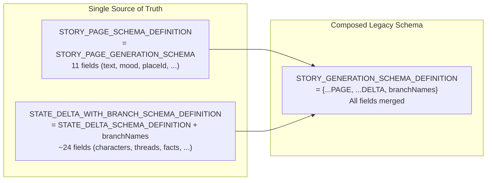
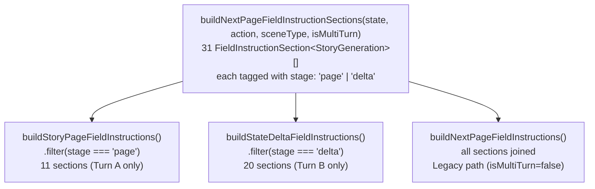
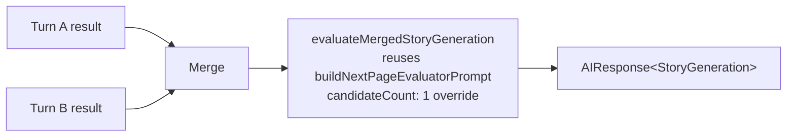
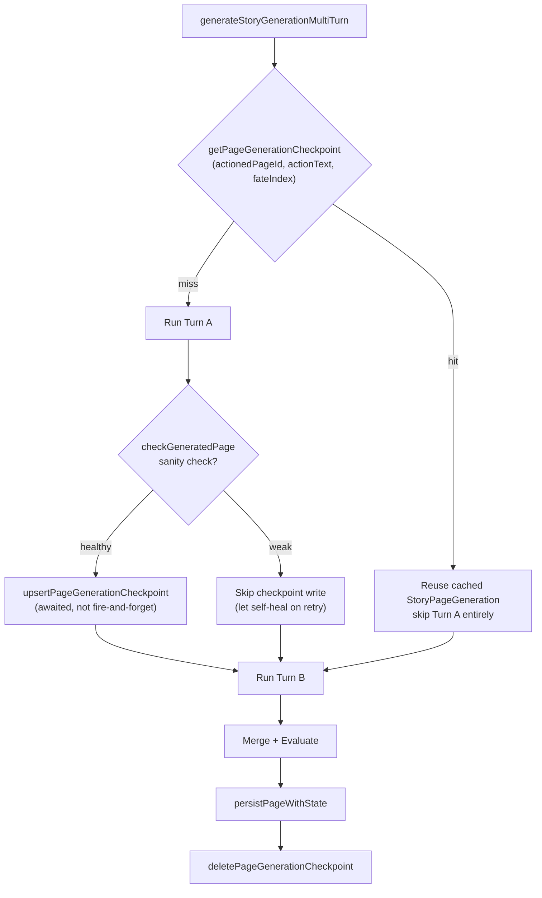
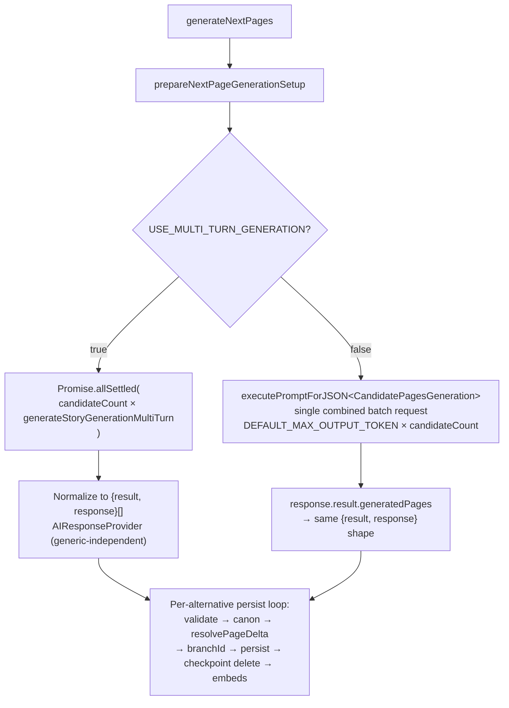

# Multi-Turn Page Generation Architecture

**Status:** Implemented, flag-gated (`USE_MULTI_TURN_GENERATION`, default `false`). All scheduled phases (0–6, 8) complete. Phases 9–11 are documented deferred enhancements.
**Supersedes:** The single-shot combined `StoryGeneration` request path for page generation (still available as the default legacy path when the flag is off).

---

## Overview

Twistloom generates story pages by asking an AI to produce a complete `StoryGeneration` object — narrative prose, scene metadata, and state deltas — in a single structured-output request. This worked but created a structural tension: **narrative prose and state deltas have fundamentally different authoring concerns**, yet they competed for the same output-token budget and were constrained by the same (deep, wide) schema in one call.

The multi-turn pipeline splits this into **two sequential turns**:

1. **Turn A (StoryPage)** — writes the narrative prose and scene metadata (text, mood, placeId, weather, charactersPresent, actions, etc.)
2. **Turn B (StateDelta)** — reads Turn A's output and determines what changed in the story state (characters, places, threads, facts, flags, inventory, injuries, ending, branchNames)

After both turns, a **single evaluation pass** scores the merged object. The result is the exact same `AIResponse<StoryGeneration>` shape the legacy path produces, so every downstream step (validate → canon → resolvePageDelta → branchId → persist → embeds) is **completely unchanged**.

### Why Split?

| Problem | Single-Shot | Multi-Turn |
|---|---|---|
| **Schema depth** | `STORY_GENERATION_SCHEMA_DEFINITION` combines page + delta fields — deep enough to hit `isSchemaTooComplex` thresholds on some providers | Each turn sends only its own shallow schema definition |
| **Token budget competition** | Page text and delta arrays share 4000 tokens; delta fields (especially `contextHistory` + arrays) risked `finishReason === 'length'` | Asymmetric dedicated budgets: 2200 (page) / 1800 (delta) |
| **Field instruction noise** | Every field instruction is sent regardless of which "role" is authoring it | Each turn receives only the instructions for the fields it authors |
| **Evaluation precision** | Evaluator scores a combined object where narrative and state concerns are interleaved | Single post-merge evaluator reuses the fully-tested existing rubric, applied to the same merged shape |
| **Retry cost** | If the AI fails after producing 3000 tokens of prose, the entire response is wasted | Turn A results are cached in `pageGenerationCheckpoints` — a Turn B failure skips Turn A on retry |

---

## Architecture Diagram

```mermaid
flowchart TD
    subgraph Entry["Entry Points"]
        GNP["generateNextPage(s)<br/>prompt.ts:5408 / 5582"]
    end

    subgraph Flag{"USE_MULTI_TURN_GENERATION?"}
        flag
    end

    subgraph Legacy["Legacy Path (flag=false)"]
        LEG["executePromptForJSON&lt;StoryGeneration&gt;<br/>single combined request<br/>STORY_GENERATION_SCHEMA_DEFINITION"]
    end

    subgraph MultiTurn["Multi-Turn Path (flag=true)"]
        MGT["generateStoryGenerationMultiTurn<br/>prompt.ts:5200"]

        subgraph TurnA["Turn A: StoryPage"]
            TA_CK{"Checkpoint<br/>cache hit?"}
            TA_SKIP["Reuse cached<br/>StoryPageGeneration"]
            TA_RUN["runGenerationStage&lt;StoryPageGeneration&gt;<br/>STORY_PAGE_SCHEMA_DEFINITION<br/>2200 tokens"]
            TA_STORE["upsertPageGenerationCheckpoint"]
        end

        subgraph TurnB["Turn B: StateDelta"]
            TB["runGenerationStage&lt;StateDeltaGenerationWithBranch&gt;<br/>STATE_DELTA_WITH_BRANCH_SCHEMA_DEFINITION<br/>1800 tokens"]
        end

        subgraph Merge["Merge"]
            MG["storyPage + stateDelta → merged<br/>calendarDate fallback applied"]
        end

        subgraph Eval["Single Evaluation"]
            EV["evaluateMergedStoryGeneration<br/>candidateCount:1 override<br/>dedicated cache key"]
        end
    end

    subgraph Shared["Shared Downstream (unchanged)"]
        VAL["validateGeneratedPage"]
        CAN["runCanonValidationPass"]
        DELTA["resolvePageDelta"]
        BR["determineBranchIdForPage"]
        PERSIST["persistPageWithState"]
        CK_DEL["deletePageGenerationCheckpoint"]
        EMBED["embedPersistedPage + embedStateDeltaEntities"]
    end

    GNP --> Flag
    Flag -- "false" --> Legacy
    Flag -- "true" --> MultiTurn

    MultiTurn --> TurnA
    TurnA --> TA_CK
    TA_CK -- "hit" --> TA_SKIP
    TA_CK -- "miss" --> TA_RUN
    TA_RUN --> TA_STORE
    TA_SKIP --> TurnB
    TA_STORE --> TurnB

    TurnB --> Merge
    Merge --> Eval
    Eval --> Shared

    Legacy --> Shared
```

---

## The Two Schemas: Composition, Not Duplication

The single most important structural decision: the two turn-specific schemas are **the same objects** the combined schema composes from — not copies.



**Why this matters:** when a field is added, renamed, or its type changes in one turn's schema, the composed legacy schema automatically reflects the change. There is no second copy to drift. This was the direct fix for the `newPlaces.knownCharacters` class of bug where duplicated JSON shapes diverged silently.

**Schema files:** `src/schema/story.ts:681–737`

| Schema | Used By | Required Fields |
|---|---|---|
| `STORY_PAGE_SCHEMA_DEFINITION` | Turn A (`runGenerationStage` with `stage: 'story_page'`) | `['text', 'actions', 'calendarDate']` |
| `STATE_DELTA_WITH_BRANCH_SCHEMA_DEFINITION` | Turn B (`runGenerationStage` with `stage: 'state_delta'`) | `[]` (all optional — a reflective page can produce an empty delta) |
| `STORY_GENERATION_SCHEMA_DEFINITION` | Legacy path, evaluation, validation | `['text', 'actions', 'calendarDate']` |
| `CANDIDATE_GENERATION_SCHEMA_DEFINITION` | Legacy multi-candidate batch (`generateNextPages` flag=false) | `['output']` |

---

## Field Instruction Split

Field instructions (`src/utils/field-instructions.ts`) follow the same single-source pattern:



Each `FieldInstructionSection<T>` carries:
- `fields: (keyof T)[]` — compile-time checked against `StoryGeneration` keys (a typo is a build error)
- `stage: 'page' | 'delta'` — which turn authors this field
- `text: string` — the prose instruction

**`isMultiTurn=true`** activates slug-ID handoff instructions in `placeId`, `charactersPresent`, `newCharacters`, and `newPlaces` sections — instructions the legacy path never needs.

---

## Turn A: StoryPage

**Purpose:** Write the narrative prose and scene metadata for the next page.

**Prompt builders:**
- `buildStoryPagePrompt()` (`prompt.ts:1114`) — assembles: task prompt, story context, narrative style, planned characters, branching rules
- `buildStoryPageFieldInstructions()` (`field-instructions.ts:318`) — 11 page-stage sections
- `buildStoryPageReviewChecklist()` (`prompt.ts:1348`) — page-specific review criteria

**Key design decisions:**

### Fate Divergence Directive

When `generateNextPages` runs multiple parallel alternatives (multiverse mode), each Turn A call gets a deterministic narrative-angle rotation via `formatFateDivergenceDirective()` (`prompt.ts:3094`). This prevents near-duplicate alternatives — the root cause of "convergence" under parallelization, where independent StoryPage calls can't see each other's output.

```typescript
// prompt.ts:3094
function formatFateDivergenceDirective(fateIndex: number, fateCount: number): string {
  if (fateCount <= 1) return '';
  const directive = FATE_DIVERGENCE_DIRECTIVES[fateIndex % FATE_DIVERGENCE_DIRECTIVES.length];
  return `\nALTERNATE FATE ${fateIndex + 1} of ${fateCount}: ... ${directive}`;
}
```

The directives rotate through different narrative angles (horror emphasis, character introspection, environmental detail, action urgency, etc.) so each parallel alternative genuinely diverges.

### Gemini Cache Key Suffixing

Turn A and Turn B send different system prompts but share book-level cached content. Without suffixing, both turns could silently collide on the same Gemini explicit-cache slot:

```typescript
// runGenerationStage (prompt.ts:5174)
cachedContentId: cachedContentId ? `${cachedContentId}:${stage}` : undefined,
// e.g. "twistloom:book:abc123:story_page" vs "twistloom:book:abc123:state_delta"
```

This is safe by construction regardless of `getOrCreateGeminiCache`'s internal matching.

### Slug-ID Handoff Convention

Brand-new characters/places create an ID paradox: Turn A needs to reference them (e.g., in `charactersPresent`) but Turn B is the turn that formally introduces them via `newCharacters`/`newPlaces`. The convention:

1. Turn A invents a stable lowercase-slug ID (e.g., `"hollow-eyed-clerk"`) based on the character's role or a distinguishing trait
2. Turn B is instructed to reuse that **exact** ID in `newCharacters` or `newPlaces`

This is enforced by field instructions (`isMultiTurn=true` mode) and scored by the evaluator's continuity rubric. A deterministic reconciliation backstop (Phase 9, deferred) catches rare mismatches.

---

## Turn B: StateDelta

**Purpose:** Read the page Turn A wrote and determine what changed in the underlying story state.

**Prompt builders:**
- `buildStateDeltaPrompt()` (`prompt.ts:1218`) — assembles: task prompt, story context, **GENERATED PAGE** section (Turn A's output formatted for human reading), narrative style (without prose block — `includeProseStyle=false`)
- `buildStateDeltaFieldInstructions()` (`field-instructions.ts:333`) — 20 delta-stage sections
- `buildStateDeltaReviewChecklist()` (`prompt.ts:1442`) — delta-specific review criteria

**Key design decisions:**

### Generated Page as Human-Readable Context

Turn B reads Turn A's output the way a human editor would — prose first, then scene metadata — via `formatGeneratedPageForDeltaPrompt()` (`prompt.ts:1195`):

```
[page text]

Scene: investigation at old-library, 2026-07-26 midnight, stormy — mood: tense
Characters present: ally (supporting, focus: 0.5), enemy (opposition, focus: 1)
Key events: heard a distant scream
Key objects: mysterious book
Choices offered: Open the door / Search the shelves / Leave quietly
```

This keeps Turn B's delta decisions grounded in what a reader actually experienced, not raw JSON fields.

### Narrative Style Without Prose Block

Turn B calls `formatNextPageNarrativePrompt(params, false)` — the `includeProseStyle=false` flag omits the prose-style instructions that Turn A needs. Turn B doesn't write prose; it writes state deltas. Including prose instructions would waste tokens and potentially confuse the model.

### branchNames in Turn B

Branch timeline names (`branchNames`) moved to Turn B because the alternative-timeline names describe the whole divergence, which is only knowable once the delta (the actual consequence) is authored. `STATE_DELTA_WITH_BRANCH_SCHEMA_DEFINITION` carries `branchNames` as a result.

---

## Merge

After both turns complete, the outputs are merged into a single `StoryGeneration` object:

```typescript
// generateStoryGenerationMultiTurn (prompt.ts:5332)
const merged: StoryGeneration = {
  ...storyPage,          // Turn A: text, mood, placeId, weather, calendarDate, ...
  ...stateDelta,         // Turn B: characters, threads, facts, flags, inventory, ...
  calendarDate: storyPage.calendarDate ?? actionedPage.calendarDate,  // BUG-04 fix
};
```

**BUG-04 fix (calendarDate fallback):** Applied at merge time, not downstream. Two reasons:
1. `StateDeltaGenerationWithBranch` has no `calendarDate` field in its type, but a stray runtime key could silently overwrite Turn A's correct value via spread
2. The evaluator scores `merged` before the downstream fallback runs — leaving it unapplied at merge meant the evaluator could penalize a transiently-missing date

---

## Single Post-Merge Evaluation

**Design decision (resolved at checkpoint 2, Q2):** One evaluation pass on the merged object, not one per turn.



### Why Not Per-Turn?

| Approach | Cost | Coverage |
|---|---|---|
| Per-turn (2 calls) | 2× evaluator cost | Each turn evaluated in isolation — can't catch cross-turn inconsistencies |
| Post-merge (1 call) | 1× evaluator cost | Scores the complete object — catches narrative/state mismatches |

The single post-merge approach reuses the fully-tested `buildNextPageEvaluatorPrompt` rubric unchanged. The evaluator's rubric spends most of its dimensions on structural correctness (Turn B's concern) while also scoring narrative quality (Turn A's concern) — one pass covers both.

### `candidateCount: 1` Override

When `generateNextPages` runs parallel alternatives, each alternative's `evaluateMergedStoryGeneration` call must force `candidateCount: 1` for its internal `buildNextPageEvaluatorPrompt` call. Without this, the evaluator would describe the array-wrapped multi-candidate batch shape (via `candidateCount > 1` branch) while actually enforcing a single-object schema — prose and schema disagreeing.

### Dedicated Evaluation Cache Key

`evaluateMergedStoryGeneration` derives a content-based cache key from `[bookId, merged]` via `createCacheKey()` — not reusing Turn A's `:story_page` slot. This prevents:
- **Gemini cache corruption:** Turn A's cached system instructions would be overwritten by evaluation calls with different content
- **Mistral fallback collision:** `buildMistralPromptCacheKey` falls back to a shared generic key (`'twistloom:mistral:shared'`) used by unrelated callers when `cachedContentId` is `undefined`

---

## Token Budgets

Asymmetric split — not a straight halving:

| Token | Value | Rationale |
|---|---|---|
| `STORY_PAGE_MAX_OUTPUT_TOKEN` | 2200 | Page text rarely approaches even half of the old 4000 budget; headroom it rarely uses |
| `STATE_DELTA_MAX_OUTPUT_TOKEN` | 1800 | `contextHistory` + every delta array is the set that risked `finishReason === 'length'` under the old shared pool |
| `DEFAULT_MAX_OUTPUT_TOKEN` (legacy) | 4000 | Unchanged for all non-split callers (pen.ts, canon-validation.ts, book-creation) |
| `EVALUATION_SCORING_OUTPUT_TOKEN` | 2000 | Unchanged — used by the single post-merge evaluator |

**Source:** `src/config/ai-chat.ts:3–35`

**Note:** The two turn budgets intentionally do NOT sum to 4000. The split is based on empirical token usage patterns, not a theoretical maximum. Revisit against observed `finishReason === 'length'` telemetry once the multi-turn path has real traffic.

---

## Checkpoint Cache (Phase 6)

The `pageGenerationCheckpoints` table caches Turn A results so a Turn B failure doesn't waste the Turn A cost on retry.



### Key Design Properties

| Property | Implementation |
|---|---|
| **Deterministic keying** | `(actionedPageId, actionText, fateIndex)` — Turn A's input is a pure function of parent page + action with zero non-deterministic state |
| **Best-effort writes** | `upsertPageGenerationCheckpoint` catches internally and only logs — a write failure never blocks generation |
| **Awaited, not fire-and-forget** | The upsert is awaited so the checkpoint is reliably in place before Turn B runs |
| **Best-effort deletes** | `deletePageGenerationCheckpoint` is a no-op on missing rows — safe to call unconditionally |
| **Orphan cleanup** | `deleteOldPageGenerationCheckpoints(7)` sweeps rows older than 7 days (optional, low priority) |

**Schema:** `src/db/schema.ts` — follows file conventions (`id()`, `bookId()`, `createdAt`, `updatedAt` shared helpers; unique constraint on `(actionedPageId, actionText, fateIndex)`; FK to `pages.id` with `onDelete: "cascade"`)
**Service:** `src/services/page-generation-checkpoints.ts` — 4 functions, none throw

### Why Not a Task Ledger?

The original roadmap planned a task/status ledger with `status`, `attemptCount`, `lastError` columns. This was redesignated as a pure checkpoint cache after discovering that `retry-pending-generations.ts` + `ensureCandidatesForPageWithStrategy` already guarantee eventual success on any generation failure (3× in-process backoff, then indefinite cron retry via `pendingGenerationCount`). The checkpoint cache eliminates the cost waste of re-running Turn A on retry — it doesn't add resilience that was missing.

---

## Parallel Multiverse (generateNextPages)



### Key Design Properties

| Property | Multi-Turn | Legacy |
|---|---|---|
| **Failure isolation** | `Promise.allSettled` — one alternative's failure doesn't take others down | One malformed response loses every alternative |
| **Per-alternative AIResponse** | Each alternative gets its own provider/model metadata | One shared response for the whole batch |
| **Wall-clock cost** | Same as legacy — bounded by one A+B pair's latency | Same |
| **Fate divergence** | `formatFateDivergenceDirective` prevents near-duplicates | Cross-timeline bleed instruction for degraded memory |

### Normalized Response Type

`generatedAlternatives` uses `AIResponseProvider` (not `AIResponse<StoryGeneration>`) for the `response` field:

```typescript
type AIResponseProvider = Pick<AIResponse<unknown>, 'model' | 'provider' | 'evalModel' | 'evalProvider' | 'scoreBefore' | 'scoreAfter'>;
```

This is the exact type `persistPageWithState`'s `aiResponseProvider` parameter consumes, and it's the only type both paths can satisfy — the legacy branch's shared response is `AIResponse<CandidatePagesGeneration>`, not `AIResponse<StoryGeneration>`.

---

## Feature Flag

```typescript
// src/config/env.ts
export const USE_MULTI_TURN_GENERATION = process.env.USE_MULTI_TURN_GENERATION === 'true';
export function isMultiTurnGenerationEnabled(): boolean { return USE_MULTI_TURN_GENERATION; }
```

- **Default:** `false` — legacy single-shot path, byte-identical to pre-refactor behavior
- **When `true`:** routes through 2-turn / parallel-multi-turn pipeline
- **Resolved (checkpoint 2, Q5):** pre-launch, no live traffic — flip to `true` in dev/staging as soon as Phase 5 lands

The flag gates three locations:
1. `generateNextPage` (`prompt.ts:5430`) — single-page path
2. `generateNextPages` (`prompt.ts:5636`) — multi-candidate parallel path
3. `deletePageGenerationCheckpoint` calls in both functions (`prompt.ts:5537`, `5806`) — skip wasted round-trip on legacy path

---

## `runGenerationStage`: The Stage Runner

`runGenerationStage<T>` (`prompt.ts:5141`) is the generic function that executes ONE generation turn through `executePromptForJSON`. Parameterized by `T` so the same runner serves both turns:

```typescript
async function runGenerationStage<T extends Record<string, unknown>>(
  definition: GenerationStageDefinition<T>,
  onProgress?: ProgressCallback,
  onGenerationProgress?: (step: StoryGenerationStep) => Promise<void>,
): Promise<AIResponse<T>>
```

### `GenerationStageDefinition<T>`

Defined in `src/types/prompt.ts:115`:

| Field | Purpose |
|---|---|
| `stage: GenerationStage` | `'story_page'` or `'state_delta'` — used for cache key suffixing and log context |
| `config: AIChatConfig` | Dynamic per-page config from `determineAIConfig` — NOT a static preset |
| `maxOutputToken` | Per-turn budget (`STORY_PAGE_MAX_OUTPUT_TOKEN` or `STATE_DELTA_MAX_OUTPUT_TOKEN`) |
| `cachedContentId` | Base cache key — `runGenerationStage` appends `:${stage}` to prevent collision |
| `schema / requiredFields / fallbackField` | Turn-specific schema definition |

**Critical bug caught during Phase 3:** `runGenerationStage` initially hardcoded `AI_CHAT_CONFIG_CREATIVE` as the base config. This would have silently discarded `determineAIConfig`'s dynamic per-page tuning — a generation-quality regression with no crash, likely to go unnoticed.

---

## Failure Modes & Mitigations

| Failure | Impact | Mitigation |
|---|---|---|
| **Turn A fails** | No page generated | Same as today — retry via `ensureCandidatesForPageWithStrategy`'s 3× backoff |
| **Turn A succeeds, Turn B fails** | Turn A cost wasted on this attempt | Checkpoint cache: Turn A result saved; retry skips Turn A |
| **Turn A produces weak output** | Cached, replayed on every retry | `checkGeneratedPage` sanity check before caching — weak output is not cached, allowing self-heal |
| **Merge loses `calendarDate`** | Evaluator penalizes transiently-missing date | BUG-04 fix: fallback applied at merge time before evaluation |
| **Evaluator cache key collides with Turn A** | Gemini cache corruption; Mistral shared-key collision | Dedicated content-based key via `createCacheKey([bookId, merged])` |
| **Evaluator describes wrong schema shape** | `candidateCount > 1` branch describes array while enforcing single object | `candidateCount: 1` override in `evaluateMergedStoryGeneration` |
| **Parallel alternatives converge** | Near-duplicate "different" fates | `formatFateDivergenceDirective` — deterministic narrative-angle rotation |
| **Gemini explicit-cache slot collision** | Turn B reuses Turn A's cached system instructions | Cache key suffixing: `${cachedContentId}:${stage}` |
| **Slug-ID mismatch (Turn A invents, Turn B doesn't reuse)** | Character/place record never created | Prompt convention + evaluator scoring + Phase 9 deterministic reconciliation (deferred) |
| **Evaluator correction loses paragraph breaks** | Newline stripping in `sanitise()` | Checkpoint 7 fix: control-char strip excludes `\t`/`\n`/`\r`; `parseAISafely` repair pipeline |
| **Schema depth exceeds provider limits** | Provider rejects the request | Each turn sends only its own shallow schema — `isSchemaTooComplex` thresholds rarely hit |

---

## Verification History

Every checkpoint's code was verified against the actual codebase, not just design assumptions:

| Checkpoint | What Was Verified |
|---|---|
| **1** | `esbuild` syntax check after every edit; byte-identical round-trip diff for every text split |
| **2** | `runEvaluationPass` extracted and verified; `retry-pending-generations.ts` confirmed zero changes needed |
| **3** | `StageContext`/`GenerationStageDefinition<T>` placed in `types/prompt.ts`; `runGenerationStage` + `generateStoryGenerationMultiTurn` wired; 2 bugs caught (static config, candidateCount override) |
| **4** | Real `bun check`/`tsc` output surfaced 3 compile errors + 8 lint warnings; all fixed; 1 more functional gap (missing documents/cache/context on evaluator) found and fixed |
| **5** | External review: 4 confirmed bugs fixed (cache-key corruption, schema malformed, calendarDate timing, description typo), 1 false-positive fixed defensively |
| **6** | `field-instructions.ts` extracted and made generic; compile-time `keyof T` checking on all 35 field names |
| **7** | External review: newline stripping in evaluator corrections + duplicate output-format block — both real, both fixed |
| **8** | Phase 6 wired end to end; all scheduled phases complete |

---

## FAQ

### Q: Why not evaluate Turn A separately before Turn B?

A single post-merge evaluator was chosen (resolved at checkpoint 2, Q2) because:
- Fewer calls (1 vs 2) → lower cost and latency
- The evaluator's rubric covers both narrative quality and structural correctness — one pass catches cross-turn inconsistencies
- Per-turn evaluation would reintroduce the original cost problem Q2 was designed to avoid
- Turn B's structural correctness would get no evaluation under a "Turn A only" approach

An alternative proposal (external review, Question 1) suggested evaluating Turn A before Turn B. This was documented as Phase 11 but not recommended — it reverses an explicit prior decision and its stated justification (Zod validation) was factually incorrect (`package.json` has no Zod dependency).

### Q: What happens when Turn B fails but Turn A succeeded?

The checkpoint cache (`pageGenerationCheckpoints`) stores Turn A's result. On retry, `getPageGenerationCheckpoint` returns the cached `StoryPageGeneration`, and Turn A is skipped entirely. This is a cost optimization — the retry machinery (`retry-pending-generations.ts` + `ensureCandidatesForPageWithStrategy`) already guarantees eventual success.

### Q: Why is the token budget asymmetric (2200/1800) instead of 2000/2000?

Page text rarely approaches half the old 4000 budget. The delta's largest fields (`contextHistory` + every new/updated array) are what actually risked `finishReason === 'length'` under the old shared pool. Splitting unevenly gives the delta a larger dedicated share than its typical share of the combined budget.

### Q: Why `Promise.allSettled` instead of `Promise.all` for parallel alternatives?

One alternative's total generation failure (either turn) should not take the other alternatives down. `Promise.all` would reject on the first failure; `Promise.allSettled` collects all outcomes and processes the successful ones. This is a real resilience improvement over the combined batch path where one malformed AI response loses every alternative at once.

### Q: Why not a separate `buildStateDeltaSystemPrompt` function?

The `'state-delta'` branch was added to `buildPresetSystemPrompt` (a third `type` alongside `'next'` and `'book-creation'`), sharing the same `PROMPT_SYSTEM_WRITING_STYLE[preset]` lookup. This is a smaller surface than a separate function with duplicated style resolution.

### Q: Why are all checkpoint service functions best-effort (never throw)?

The checkpoint cache is an optimization layer, not a correctness requirement. A failed lookup is treated as a cache miss (run Turn A fresh — same behavior as before the cache existed). A failed write or delete is logged and swallowed — never a new failure mode for the generation path it sits in front of.

### Q: What about the `esbuild` blind spot for type errors?

`esbuild` strips TypeScript types without checking them. Checkpoint 4 proved this misses real compile errors (generic constraint mismatches, object-spread type narrowing, cross-branch type unification). Going forward, every checkpoint explicitly checks for this class of issue rather than treating a clean `esbuild` run as sufficient. The project's real gates are `bun run typecheck` (`bunx tsc --noEmit`) and `bun run lint:fast`.

### Q: Is the legacy path still the default?

Yes. `USE_MULTI_TURN_GENERATION` defaults to `false`. Every line of `generateNextPage`/`generateNextPages` after the response-producing step is shared byte-for-byte between both paths — the only branching happens at the response-producing step itself.

---

## Related Architecture Documents

| Document | Relationship |
|---|---|
| [`NEXT_PAGE_GENERATION_ARCHITECTURE.md`](./NEXT_PAGE_GENERATION_ARCHITECTURE.md) | The parent pipeline that calls `generateNextPage(s)` — this document describes the internal refactor of that pipeline's AI generation step |
| [`SANITY_STATE_ARCHITECTURE.md`](./SANITY_STATE_ARCHITECTURE.md) | Composure system — consumed by the prompt builder for psychological pressure guidance |
| [`AI_CHAT_STREAM_ARCHITECTURE.md`](./AI_CHAT_STREAM_ARCHITECTURE.md) | SSE streaming — `runGenerationStage` tags progress events with `stage` for stream consumers |
| [`AI_LLM_ARCHITECTURE.md`](./AI_LLM_ARCHITECTURE.md) | Provider waterfall — `executePromptForJSON` → `aiPrompt` route through the same waterfall |
| [`BRANCH_TRAVERSAL_ARCHITECTURE.md`](./BRANCH_TRAVERSAL_ARCHITECTURE.md) | Branch tree — `determineBranchIdForPage` is shared between both paths |
| [`CANON_VALIDATION_ARCHITECTURE.md`](./CANON_VALIDATION_ARCHITECTURE.md) | `runCanonValidationPass` runs on the merged object in both paths |
| [`SERVER_SENT_EVENTS_STREAMING_ARCHITECTURE.md`](./SERVER_SENT_EVENTS_STREAMING_ARCHITECTURE.md) | SSE events carry `stage` and `fateIndex` for parallel multiverse clients |

---

## File Reference

| File | Role |
|---|---|
| `src/utils/prompt.ts` | Core orchestration: `generateStoryGenerationMultiTurn`, `runGenerationStage`, `evaluateMergedStoryGeneration`, `generateNextPage`, `generateNextPages`, prompt builders |
| `src/types/prompt.ts` | `GenerationStageDefinition<T>`, `BuildNextPageParams`, `BuildNextPagePromptParams` |
| `src/utils/field-instructions.ts` | `FieldInstructionSection<T>`, `buildStoryPageFieldInstructions`, `buildStateDeltaFieldInstructions`, `buildNextPageFieldInstructions` |
| `src/schema/story.ts` | `STORY_PAGE_SCHEMA_DEFINITION`, `STATE_DELTA_WITH_BRANCH_SCHEMA_DEFINITION`, `STORY_GENERATION_SCHEMA_DEFINITION` |
| `src/config/ai-chat.ts` | Token budgets, `USE_MULTI_TURN_GENERATION` re-export |
| `src/config/env.ts` | `USE_MULTI_TURN_GENERATION`, `isMultiTurnGenerationEnabled()` |
| `src/services/page-generation-checkpoints.ts` | `getPageGenerationCheckpoint`, `upsertPageGenerationCheckpoint`, `deletePageGenerationCheckpoint`, `deleteOldPageGenerationCheckpoints` |
| `src/db/schema.ts` | `pageGenerationCheckpoints` table definition |
| `docs/roadmap/MULTI_TURN_PAGE_GENERATION_ROADMAP.md` | Original roadmap with full implementation checkpoint log |
