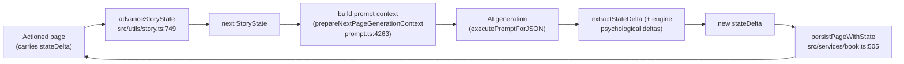

# Next-Page Generation Architecture

**Status:** Current, implementation-accurate (as of `cc0a174` working tree).
**Supersedes:** [`PRE_GENERATION_FLOW.md`](./PRE_GENERATION_FLOW.md) and [`ASYNC_CANDIDATE_GENERATION_ARCHITECTURE.md`](./ASYNC_CANDIDATE_GENERATION_ARCHITECTURE.md) — those documents describe the system as it was designed and are now stale. Read this document for the current flow.

## Overview

Twistloom generates the next page of a story **in two complementary ways**:

1. **Synchronous direct generation** — one specific destination page for one action, produced on demand (custom actions, first-page flow, Pen engine continue).
2. **Asynchronous candidate pre-generation** — a whole page's worth of branches pre-built in the background (via a GitHub Actions workflow or a cron job) so that when a reader picks an action, its destination page already exists. Pre-generation is **triggered automatically by the reader's first visit** to a page whose actions still lack destinations (frontend polls the status endpoint, which starts the workflow), and also on demand.

Both paths converge on the **same core AI pipeline**: `generateNextPage` / `generateNextPages` in `src/utils/prompt.ts:4618/4756`, which build a prompt, call an AI provider waterfall with structured-output guarantees, run an optional evaluator pass, determine a branch, and persist the page with its story-state delta.

The system deliberately keeps **state as data, not as prose history**: every generated page carries a `stateDelta` (engine-owned + AI-authored) that produces the next `StoryState`. Branches are first-class rows, and candidate/alternate fates share the parent's branch unless they legitimately fork.

---

## Core Concepts

| Concept | Description | Key location |
|---|---|---|
| `StoryState` | Full serializable snapshot of the story: page number, flags, characters, places, threads, psychological profile, composure, memory integrity. | `src/types/story.ts` (interface ~`StoryState`) |
| `StateDelta` | The delta produced by one page: flag updates, trauma tags, future notes, characters, relationships, places, threads, endings, psychological layer snapshots. | `src/types/story.ts:1221` |
| Branch | A distinct narrative timeline. A page belongs to one branch; actions point at destination pages via `destinationPageIds`. | `src/db/schema.ts` |
| Action | A reader choice on a page. Each action carries `destinationPageIds[]` which may be empty until candidate generation fills them. | `src/types/story.ts` (~`Action`, `destinationPageIds` at :1447) |
| Book mode | Controls branching contract: `novel` = 1 action / 1 destination; `interactive` = 2–3 actions, 1 destination each; `multiverse` = 2–3 actions, up to `MAX_CANDIDATE_PAGE_PER_ACTION` destinations. | `src/utils/book-mode.ts` |

### The delta→state loop



- `advanceStoryState` (`src/utils/story.ts:749`) applies the user action + previous AI turn to produce the next state.
- `prepareNextPageGenerationContext` (`src/utils/prompt.ts:4263`) reconstructs the baseline state if not provided and verifies page-number continuity.
- `extractStateDelta` (`src/utils/story.ts:284`) pulls AI-authored delta fields; `calculatePsychologicalDeltas` (`:391`) computes the engine-owned psychological layer; `applyStateDelta` (`:498`) merges everything onto the state.

---

## Mermaid Flow Diagram

```mermaid
flowchart TD
    subgraph Frontend["Frontend reader (Twistloom-web)"]
        V[Reader opens a page<br/>useReaderPageSession · isActive] --> CHK{"all actions have<br/>destinationPageIds?"}
        CHK -- "no (pending candidates)" --> POLL[generateCandidatesWithPolling<br/>books-api.ts:1110]
        CHK -- "yes" --> DONE0["no generation needed<br/>buttons enabled"]
        POLL --> STATUS["poll GET /candidates/status<br/>(exponential backoff)"]
    end

    subgraph Backend["Backend (Hono / Bun)"]
        STATUS --> B0{"/candidates/status<br/>three-state machine"}
        B0 -- "isGenerating=false · isDone=false" --> T[triggerCandidateGenerationWorkflow<br/>candidate-generation.ts:1344]
        B0 -- "isGenerating=true" --> PR["actionProgress<br/>(DB-backed / synthetic)"]
        B0 -- "isDone=true" --> RET0["actions complete<br/>+ clears stale progress"]
        PR --> STATUS
        T --> W["GitHub workflow_dispatch<br/>(30-min cap)"]
        W --> CRON["retry-pending-generations cron<br/>processSpecificPage · strategy='cron' (parallel)<br/>cron/retry-pending-generations.ts"]
        CRON --> DA[ensureCandidatesForPageWithStrategy<br/>candidate-generation.ts:870]
        DA --> STRAT{strategy}
        STRAT --> |"cron (batch + workflow)"| PAR2[generateCandidatesInParallel<br/>candidate-generation.ts:572]
        STRAT --> |"github-action (inline originals)"| SEQ["sequential per-action loop<br/>(prompt.ts:4176)"]
        STRAT --> |"vercel (legacy default)"| PAR1[generateCandidatesInParallel]
        PAR1 & PAR2 & SEQ --> GNP[generateNextPages<br/>prompt.ts:4756]
    end

    GNP --> SETUP[prepareNextPageGenerationSetup<br/>prompt.ts:4396]
    SETUP --> E[executePromptForJSON<br/>prompt.ts:4936]
    E --> WFN[aiPrompt<br/>ai-chat.ts:916]
    WFN --> WF{"provider waterfall<br/>AI_CHAT_MODELS_WRITING"}
    WF --> |"mistral → gemini → openrouter → …"| LLM[AI provider]
    LLM --> RET{"JSON valid?"}
    RET -- "malformed" --> VALIDATE[structured-output repair<br/>schema validation + JSON repair]
    VALIDATE --> RTRY{"retry?<br/>retryWithBackoffOrNull<br/>retry.ts:255"}
    RTRY -- "yes, budget remains" --> WFN
    RTRY -- "no" --> FAIL["action marked failed /<br/>invalid action removed"]
    RET -- "valid" --> EV2[Evaluator pass<br/>AI_CHAT_MODELS_EVALUATION]
    EV2 --> EVA2{"pass ≥ threshold?<br/>or hard-fail present?"}
    EVA2 -- "fail" --> REGEN["regenerate /<br/>fall back to raw output"]
    EVA2 -- "pass" --> OK[generated StoryGeneration]

    OK --> ST[advanceStoryState<br/>story.ts:749 + prepareNextPageGenerationContext<br/>prompt.ts:4263]
    ST --> BR[determineBranchIdForPage<br/>prompt.ts:4336<br/>one candidate keeps parent branch]
    BR --> PERSIST[persistPageWithState<br/>book.ts:505<br/>mode gate + revalidate + momentum]

    subgraph Persistence["Persistence & side effects"]
        PERSIST --> DB[pages / story_states / story_branch rows]
        PERSIST --> CANON[insertCanonValidationAudit<br/>fire-and-forget]
        PERSIST --> VEC[embedPersistedPage → pgvector semantic memory]
    end

    GNP --> DEPTH{"deeper-level<br/>pre-generation?"}
    DEPTH -- "yes (depth < MAX_BRANCHING_PREGENERATION_DEPTH<br/>page ≤ ALLOW_DEEPER_LEVEL_UNTIL_PAGE)" --> DA2[recurse ensureCandidatesForPageWithStrategy]
    DA2 --> DB2[update isGeneratingStartedAt /<br/>pendingGenerationCount]
    DB2 --> DONE[clearActionProgressEvents]
```



---

## Synchronous pipeline (the shared core)

### 1. Entry
- **Custom actions:** `generatePageForCustomAction` (`src/services/custom-actions.ts:547`) validates the custom action (Gate 0/Gate 1), then calls the shared single-page generation path. Wrapped in a per-`(bookId, pageId, user, customActionId)` distributed lock.
- **First-page (book creation):** `initializeBook` (`src/utils/prompt.ts:3852`) → `executePromptForJSON<BookCreationResponse>` with `BOOK_CREATION_SCHEMA_DEFINITION` and `AI_CHAT_MODELS_WRITING`. This produces the first page + first set of actions.
- **Pen engine:** `src/services/pen.ts` reuses `advanceStoryState → resolvePageDelta → determineBranchIdForPage` (documented at `pen.ts:976`) for continuation pages.

### 2. Setup & context
`prepareNextPageGenerationSetup` (`prompt.ts:4396`) does:
- Reconstruct/verify base state (`prepareNextPageGenerationContext`, `:4263`) — warns and corrects page-number mismatches.
- Fetch future-note semantic ranking (pgvector) to surface distant callbacks.
- Build the prompt via `buildNextPagePrompt` (`:871`), which assembles:
  - TASK block (`formatNextPageTaskPrompt`, `:2612`)
  - Story context (previous page entries, story bible, semantic memory, current scene anchor)
  - Narrative style
  - Planned characters
  - Branching actions
  - `fieldInstructions` (`buildNextPageFieldInstructions`, `:885`)
  - Review checklist (`buildNextPageReviewChecklist`, `:1160`) — the mandatory "REVIEW & FIX" self-check gate
  - Evaluator prompt (`buildNextPageEvaluatorPrompt`, `:1259`)

### 3. AI call
`executePromptForJSON` (`prompt.ts:4936`) → `aiPrompt` (`src/utils/ai-chat.ts:916`):
- Provider **waterfall** over `AI_CHAT_MODELS_WRITING` (`src/config/ai-clients.ts:373`), trying providers in order on failure.
- Structured-output JSON schema definition per call type; JSON repair + validation on malformed output.
- Retry/backoff via `retryWithBackoffOrNull` (`src/utils/retry.ts:255`) and timeout handling.
- **Evaluator pass** with `AI_CHAT_MODELS_EVALUATION` (`src/config/ai-clients.ts:646`): scores dimension breakdowns; `useStringEvaluatorOutput` decides string-vs-object eval output. If the evaluator fails, `aiPrompt` silently falls back to raw generation output (evaluator is best-effort, non-authoritative).

### 4. Branch determination
`determineBranchIdForPage` (`prompt.ts:4336`):
- Exactly **one** candidate may inherit the parent's `branchId` (the "continuation" fate).
- All other candidates get **fresh** branch ids, guarded against collisions via `usedBranchIds`.
- Re-reads the fresh parent page on the first alternative to avoid stale data.

### 5. Persistence
`persistPageWithState` (`src/services/book.ts:505`):
- **Mode-branching gate:** `sanitizeActionsForMode` truncates to `novel` = 1 action; `interactive`/`multiverse` = 1..MAX. Per-action destination limits are enforced later by `enforceModeOnActionDestinations` during candidate generation.
- Re-validates the generated page (`validateGeneratedPage` — text length, JSON leaks, actions).
- Computes story momentum + per-action tendency scores against the fresh state.
- Writes: `pages` row (with `stateDelta`), `story_states` row, `story_branch` row as needed.
- **Fire-and-forget side effects:** canon audit insert (`insertCanonValidationAudit`) and pgvector semantic-memory embedding of the page + entities.

### 6. Raw generation primitives
- `generateNextPage` (`prompt.ts:4618`) — single candidate; used for custom-action destinations and single-fate paths.
- `generateNextPages` (`prompt.ts:4756`) — N candidates for one action; the workhorse of candidate pre-generation.

---

## Asynchronous candidate pre-generation

### Trigger points

Candidate generation is triggered **automatically by normal reader activity**, plus by several explicit paths. Every frontend page open initiates it when the page still has pending (destination-less) actions:

1. **Reader visits a page (frontend, automatic):** When a reader opens a page in `Twistloom-web`, `useReaderPageSession` (`Twistloom-web/src/lib/hooks/reader/useReaderPageSession.ts`) checks whether the page's actions all carry `destinationPageIds`. If any are pending, it calls `generateCandidatesWithPolling` (`books-api.ts:1110`) → `pollCandidates` (`books-api.ts:978`), which polls `GET /:identifier/:pageId/candidates/status`. The status endpoint is a three-state machine:
   - `isGenerating=false · isDone=false` → triggers `triggerCandidateGenerationWorkflow`, returns `isGenerating: true` (`books.ts:4492`, trigger at :4650).
   - `isGenerating=true` → returns live progress (DB-backed `actionProgress`, synthetic fallback).
   - `isDone=true` → returns all actions complete and clears stale progress events.
   - **Custom-action overlap:** for the page owner, the status endpoint also drives stale pending custom generations to completion inline — rows without a `nextPageId` older than `CUSTOM_ACTION_GENERATION_STALE_MS` are generated synchronously via `generatePageForCustomAction` before the response is built (`books.ts:4519-4545`). The poll therefore continues streaming (returns `isGenerating: true`) until the owner's custom page is ready. Other readers / unauthenticated requests see canon-only status.
2. `GET /:identifier/:pageId/candidates` (`src/routes/books.ts:4352`) — **SSE** variant; if not already generating, fires `triggerCandidateGenerationWorkflow` (maxDepth = `MAX_BRANCHING_PREGENERATION_DEPTH`) then streams progress via `pollForCandidateGeneration` (`src/utils/sse.ts:558`).
3. Cron `retryPendingGenerations` (`src/cron/retry-pending-generations.ts`) — batch-processes pages with `pendingGenerationCount > 0`; the GitHub workflow runs this in `processSpecificPage` mode via `TRIGGERED_BOOK_ID`/`TRIGGERED_PAGE_ID`/`TRIGGERED_BY_USER` env vars.
4. **Custom-action submission** — see the custom-actions section below for its own immediate, on-demand generation.

> **Note on the backend visit record:** the *backend* visit mark (`visitBookPage`, `src/services/book-controller.ts:937`) only marks visited / records progress and does **not** itself fire generation. The automatic trigger arrives from the *frontend* reader session (step 1 above), which polls the status endpoint — that endpoint is what starts the workflow on first contact.

### Orchestration: `ensureCandidatesForPageWithStrategy` (`src/utils/candidate-generation.ts:870`)
1. **Validation** — skip if last page, depth limit reached, no pending actions, or page is stale.
2. **Strategy select** via `getGenerationStrategy` (`:344`):

| Strategy | `useParallel` | Timeout | Used by |
|---|---|---|---|
| `cron` | ✅ | 13 min (`MAX_GENERATION_PARALLEL_DURATION_MS`) | cron batch (`retry-pending-generations.ts:262`) |
| `github-action` | ❌ sequential | 30 min (`MAX_GENERATION_DURATION_MS`) | inline generation for cron-originals (`prompt.ts:4176`) |
| `vercel` (default fallback) | ✅ | ≤ 240s (remaining Vercel budget) | legacy default when no strategy is passed — no current caller explicitly selects it; user-facing flows now dispatch a GitHub workflow instead |

3. **Distributed locking** — `withLock` / `acquireLock` (`src/utils/distributed-lock.ts`) keyed on the page. If the lock is held, return fresh page state without doing work.
4. **Parallel generation** — `generateCandidatesInParallel` (`:572`): one `generateNextPages` call per pending action, with per-action `timeoutMs`, retry, and progress callbacks.
5. **Progress tracking** — `storeActionProgressEvent` (`src/utils/progress-tracking.ts`) persists per-action progress to the DB; SSE polling reads them via `getActionProgressEvents` with synthetic fallback.
6. **Write-chain serialization** — `onActionProgress` uses a shared promise chain so concurrent AI completions don't overwrite the `actions` JSONB column (parallel-mode hazard).
7. **Mode enforcement** — after generation, `enforceModeOnActionDestinations` caps destination count; novel mode forces exactly 1 action per page before generation.
8. **Deeper-level recursion** — for successfully generated candidate pages, if depth < `MAX_BRANCHING_PREGENERATION_DEPTH` and `ALLOW_DEEPER_LEVEL_UNTIL_PAGE` allows, recurse to pre-generate the next level of branches.
9. **Cleanup** — clears `isGeneratingStartedAt` and completed progress events when all actions resolve.

### Failure & stuck handling
- Per-action failures are retried with backoff, and invalid actions are removed (with a "continue" fallback action if all are invalid — `candidate-generation.ts:1246`).
- `isGeneratingStartedAt` staleness detection: if the start timestamp exceeds `MAX_GENERATION_DURATION_MS` (30 min), the workflow is considered dead and gets reset by the cron.
- Timeout logic (`calculateGenerationTimeout`, `:373`) bails early (§`MIN_AI_TIMEOUT_MS`) rather than wasting an AI call.

### End-to-end reader-visit sequence

```mermaid
sequenceDiagram
    participant R as Reader (web)
    participant S as useReaderPageSession<br/>(frontend hook)
    participant API as Backend API
    participant WF as GitHub workflow<br/>(cron runner)
    participant AI as AI provider

    R->>S: open page / select action
    S->>API: GET /candidates/status (poll)
    alt actions complete
        API-->>S: isGenerating=false, actions have destinations
        S-->>R: buttons enabled
    else generation not started
        API->>WF: triggerCandidateGenerationWorkflow
        API-->>S: isGenerating=true, startedAt
        WF->>WF: retryPendingGenerations (processSpecificPage, strategy='cron')
        WF->>API: ensureCandidatesForPageWithStrategy
        loop per action (parallel under 'cron'; sequential under 'github-action')
            WF->>AI: generateNextPages → executePromptForJSON
            AI-->>WF: generated candidates
            WF->>API: persistPageWithState + progress events
            API-->>S: actionProgress events (streamed via poll)
        end
        WF->>API: clear isGeneratingStartedAt
        S->>API: next poll → isGenerating=false, all actions ready
        S-->>R: buttons enabled
    else in progress
        API-->>S: isGenerating=true, live progress
    end
```

### Idempotency & deduplication
- **`isGeneratingStartedAt` watermark:** the page row records when a workflow started. Any later trigger attempt that sees a non-stale watermark (`< MAX_GENERATION_DURATION_MS`) short-circuits as `alreadyInProgress` — no duplicate workflows.
- **Frontend request dedup:** `generateCandidatesWithPolling` returns the in-flight promise for the same `(identifier, pageId)` (`books-api.ts:1122-1183`), so multiple components/poll restarts don't stack requests.
- **Distributed lock per page:** only one worker generates a page's candidates at a time (`distributed-lock.ts`).
- **Progress writes are idempotent:** `storeActionProgressEvent` upserts by action text; `onActionProgress` serializes the `actions` JSONB update through a shared promise chain so concurrent AI completions never lose a completed action.
- **Polling never outlives its page:** the hook aborts its in-flight poll on unmount/page change (`useReaderPageSession.ts:574-580`), and the status endpoint's three-state machine always converges to `isGenerating=false`.

---

## Custom actions (on-demand destinations)

Flow (`src/routes/books.ts` + `src/services/custom-actions.ts`):
1. `POST /:identifier/:pageId/custom-actions/preview` (books.ts:5521) — Gate 0/Gate 1 validation prompting + action preview.
2. `POST /:identifier/:pageId/custom-actions/submit` (books.ts:5677) — persist the resolved custom action row.
3. `GET /:identifier/:pageId/custom-actions` reads rows; generation is triggered via `generatePageForCustomAction` (custom-actions.ts:547) using the shared single-candidate `generateNextPage` path, then the action's `destinationPageIds` is populated pointing at the new page.

Notes:
- Display text uses `canonicalIntent` (`buildCanonicalAction` in `custom-actions.ts` / `mapCustomActionRowToAction` in `book.ts`); when the reader's literal `originalText` differs from `text`, `formatSelectedAction` (`src/utils/prompt.ts`) injects the literal request into the prompt.
- Custom-action generation is stale-guarded (`CUSTOM_ACTION_GENERATION_STALE_MS`).

---

## Current-state file reference

| Concern | File | Lines |
|---|---|---|
| Single-page generation | `src/utils/prompt.ts` `generateNextPage` | 4618 |
| Multi-candidate generation | `src/utils/prompt.ts` `generateNextPages` | 4756 |
| Generation setup (context + prompt) | `src/utils/prompt.ts` `prepareNextPageGenerationSetup` | 4396 |
| Context reconstruction | `src/utils/prompt.ts` `prepareNextPageGenerationContext` | 4263 |
| Prompt builders | `src/utils/prompt.ts` (`buildNextPagePrompt` 871, field instructions 885, review checklist 1160, evaluator 1259, task 2612, book-creation 3624) | — |
| AI invocation + evaluator | `src/utils/ai-chat.ts` `aiPrompt` | 916 |
| Provider models (writing) | `src/config/ai-clients.ts` `AI_CHAT_MODELS_WRITING` | 373 |
| Provider models (evaluation) | `src/config/ai-clients.ts` `AI_CHAT_MODELS_EVALUATION` | 646 |
| Story-state advance | `src/utils/story.ts` (`advanceStoryState` 749, `extractStateDelta` 284, `calculatePsychologicalDeltas` 391, `applyStateDelta` 498) | — |
| Branch id resolution | `src/utils/prompt.ts` `determineBranchIdForPage` | 4336 |
| Persistence | `src/services/book.ts` `persistPageWithState` | 505 |
| Visit record (backend) | `src/services/book-controller.ts` `visitBookPage` | 937 |
| Auto-trigger on page open (frontend) | `Twistloom-web` `useReaderPageSession` → `generateCandidatesWithPolling` → `pollCandidates` → `/candidates/status` | useReaderPageSession.ts:420-582, books-api.ts:978/1110 |
| Candidate orchestration | `src/utils/candidate-generation.ts` `ensureCandidatesForPageWithStrategy` | 870 |
| Parallel generation | `src/utils/candidate-generation.ts` `generateCandidatesInParallel` | 572 |
| Strategy select | `src/utils/candidate-generation.ts` `getGenerationStrategy` | 344 |
| Workflow trigger | `src/utils/candidate-generation.ts` `triggerCandidateGenerationWorkflow` | 1344 |
| SSE polling | `src/utils/sse.ts` `pollForCandidateGeneration` | 558 |
| Progress events | `src/utils/progress-tracking.ts` (`getActionProgressEvents` 99, `storeActionProgressEvent`) | — |
| Distributed lock | `src/utils/distributed-lock.ts` `withLock` / `acquireLock` | — |
| Retry/backoff | `src/utils/retry.ts` `retryWithBackoffOrNull` | 255 |
| Retry cron | `src/cron/retry-pending-generations.ts` | 1–437 |
| Strategy/time budgets | `src/config/candidate-generation.ts` | 1–24 |
| Mode branching contract | `src/utils/book-mode.ts` | — |
| Custom-action generation | `src/services/custom-actions.ts` `generatePageForCustomAction` | 547 |
| Candidates routes | `src/routes/books.ts` (candidates 4352, status 4492, custom-actions preview 5521, submit 5677) | — |

---

## Divergences from the superseded docs

- **`PRE_GENERATION_FLOW.md`** described "automatic pre-generation on page visit". Pre-generation **on visit is still true** (the frontend reader session auto-polls the status endpoint, which starts the workflow) — but the mechanism changed: it is no longer a synchronous, inline AI call inside the page request. It is now an **asynchronous GitHub-workflow/cron pipeline** with SSE/JSON polling progress, started lazily on first status contact (or explicitly via `/candidates`, the cron, or a custom action). The obsolete doc's Express/Next.js framing and 4.5-min inline "vercel" strategy details have been superseded.
- **`ASYNC_CANDIDATE_GENERATION_ARCHITECTURE.md`** described progress via an **LRU in-memory cache (5-min TTL)** and Express/Next.js framing. Progress is now **DB-backed** (`actionProgress` table) via `progress-tracking.ts`, and the deployment is Hono on Bun/Vercel with three strategies (vercel / cron / github-action).
- Both old docs lacked the **book-mode branching contract** (`novel`/`interactive`/`multiverse`), the **write-chain serialization** hazard, the **custom-action on-demand path**, and the **frontend-driven auto-trigger** — all now implemented.