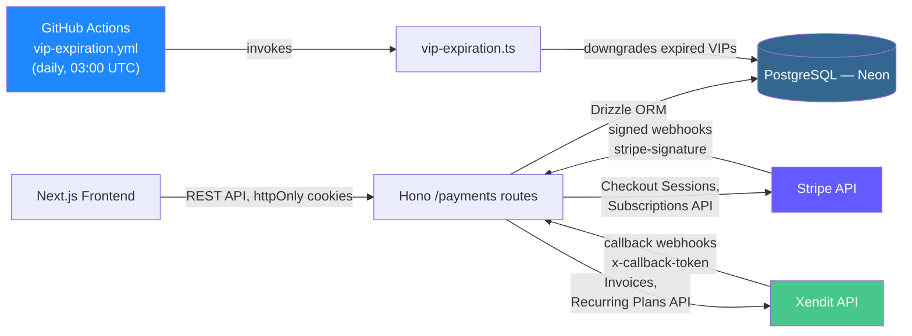
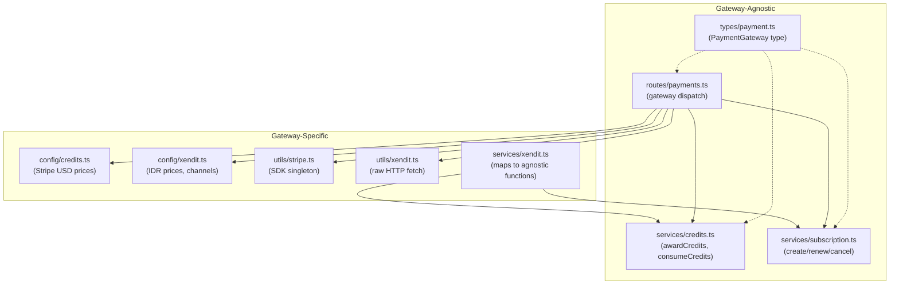
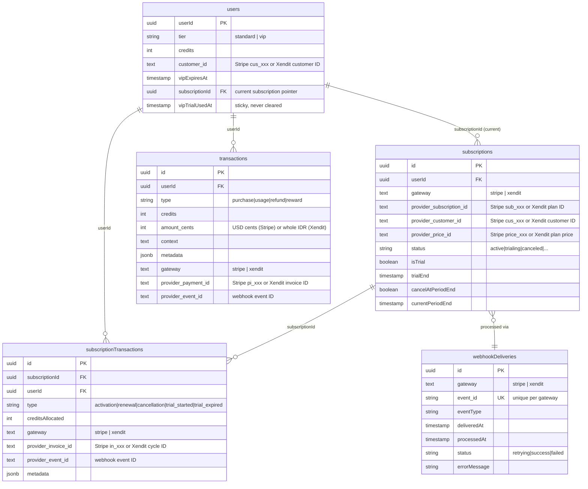
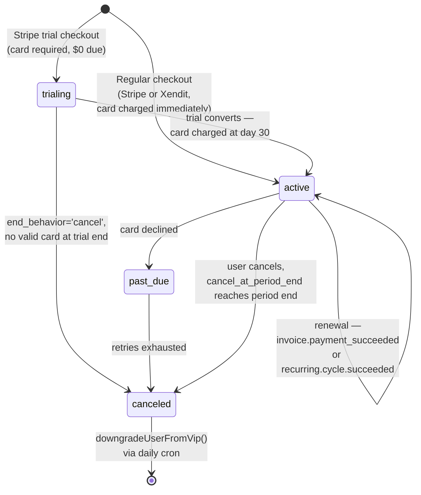
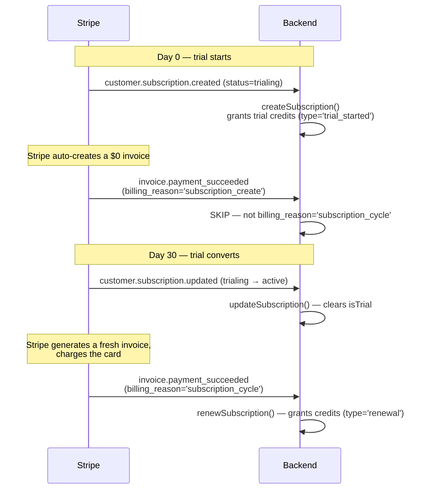
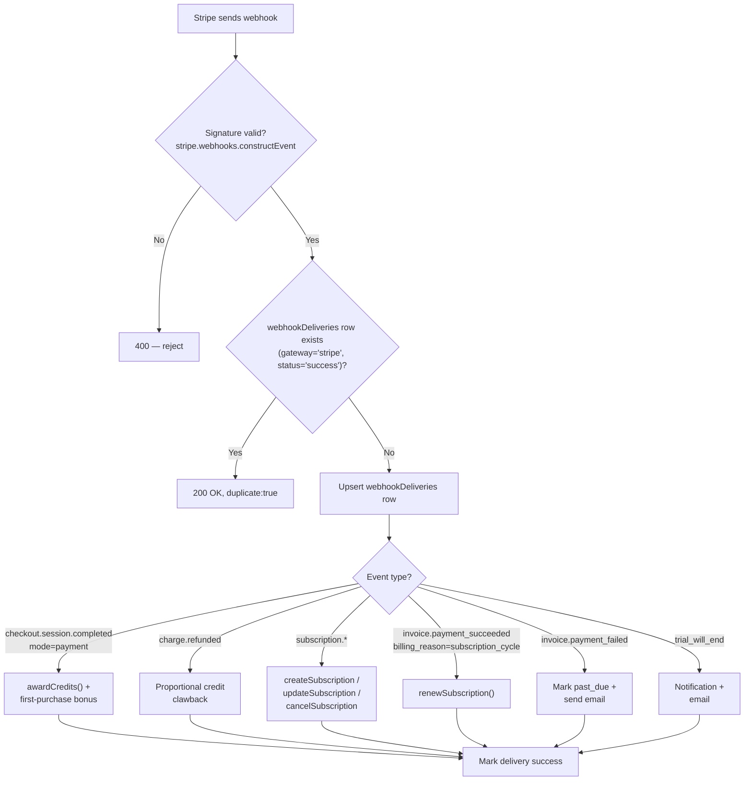
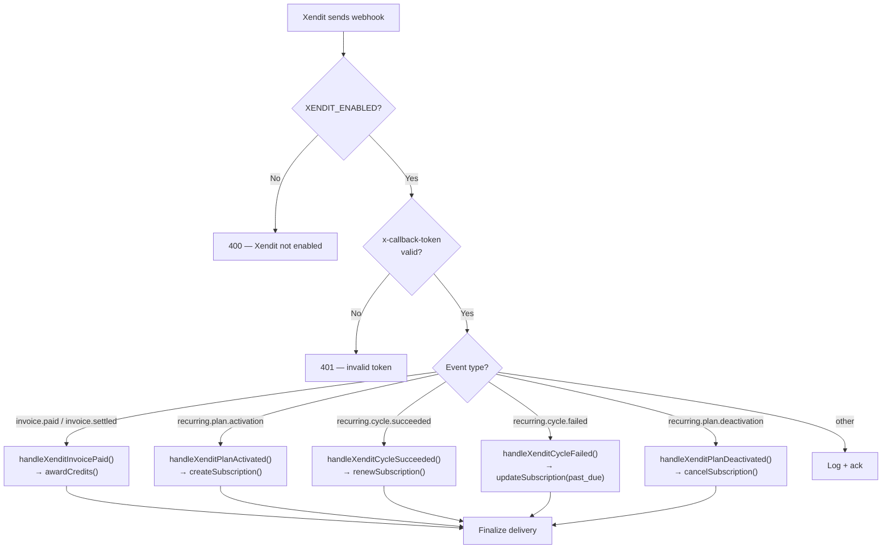
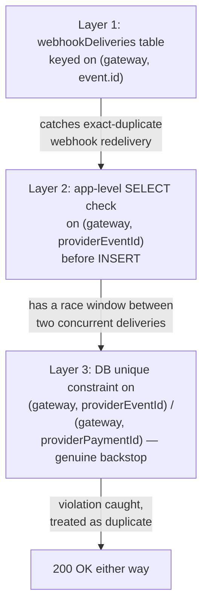

# Twistloom — Payments & Subscriptions Architecture (Backend)

**Scope:** Gateway-agnostic payment system — Stripe (international USD) + Xendit (Indonesian IDR), credits system, VIP subscriptions, VIP free trial  
**Stack:** Hono.js 4.12+ · PostgreSQL 18 (Neon) · Drizzle ORM 0.45+ · Stripe Node SDK `^22.2.0` · Xendit REST API (raw fetch)  
**Last updated:** August 2026  

---

## Table of contents

1. [System overview](#1-system-overview)
2. [Gateway-agnostic architecture](#2-gateway-agnostic-architecture)
3. [Database schema](#3-database-schema)
4. [The credit system](#4-the-credit-system)
5. [The VIP subscription system](#5-the-vip-subscription-system)
6. [The VIP free trial](#6-the-vip-free-trial-stripe-only)
7. [Stripe webhook processing](#7-stripe-webhook-processing)
8. [Xendit webhook processing](#8-xendit-webhook-processing)
9. [API routes reference](#9-api-routes-reference)
10. [Idempotency & concurrency](#10-idempotency--concurrency)
11. [Security](#11-security)
12. [Design decisions & trade-offs](#12-design-decisions--trade-offs)
13. [File reference map](#13-file-reference-map)
14. [Adding a new payment gateway](#14-adding-a-new-payment-gateway)
15. [Known issues & future enhancements](#15-known-issues--future-enhancements)
16. [Implementation status](#16-implementation-status)

---

## 1. System overview

Twistloom's monetization has two independent currencies that interact at exactly one point:

- **Credits** — a spendable balance (`users.credits`) consumed per story action (generation, hints, custom actions). Bought directly in packs, or granted as a VIP subscription benefit.
- **VIP subscription** — a recurring subscription that grants a badge, a 2x daily check-in multiplier, and a monthly credit grant.

The only place these two systems touch is credit *allocation*: a VIP subscription period starting or renewing adds credits to the same balance a credit-pack purchase would.



**Core design principle: the backend is the single source of truth.** The frontend never computes VIP status, credit balances, or trial eligibility locally — it always asks the backend and renders what comes back. Stripe and Xendit are the actual sources of truth for subscription state; the backend's job is to stay in sync with both via webhooks.

### Two payment gateways

| | Stripe | Xendit |
|---|---|---|
| **Market** | International (USD) | Indonesia (IDR) |
| **Credit packs** | Checkout Sessions (`mode: "payment"`) | Invoice API (one-time) |
| **Subscriptions** | Checkout Sessions (`mode: "subscription"`) | Recurring Plans API |
| **Free trial** | Supported (30 days, card upfront) | Not supported (goes directly to paid) |
| **Customer portal** | Stripe Customer Portal | Cancel via API only (no hosted portal) |
| **Webhook auth** | `stripe-signature` (HMAC-SHA256) | `x-callback-token` (static token) |
| **Kill switch** | N/A (always available) | `XENDIT_ENABLED` env var |

---

## 2. Gateway-agnostic architecture

### Type system

The `PaymentGateway` type is the single source of truth for gateway identity. Every other file imports from `src/types/payment.ts`.

```typescript
// src/types/payment.ts
export const paymentGateways = ["stripe", "xendit"] as const;
export type PaymentGateway = (typeof paymentGateways)[number];
export const PAYMENT_GATEWAY = {
  stripe: "stripe",
  xendit: "xendit",
} as const satisfies Record<PaymentGateway, PaymentGateway>;

export function isPaymentGateway(value: unknown): value is PaymentGateway {
  return typeof value === "string" && (paymentGateways as readonly string[]).includes(value);
}
```

Adding a new gateway means adding one string to `paymentGateways` and one entry to `PAYMENT_GATEWAY`.

### Service layer pattern

All core services accept `gateway?: PaymentGateway` defaulting to `PAYMENT_GATEWAY.stripe`:

```typescript
// src/services/subscription.ts
export async function createSubscription(params: {
  userId: string;
  gateway?: PaymentGateway;           // defaults to 'stripe'
  providerSubscriptionId: string;     // Stripe sub_xxx or Xendit plan ID
  providerCustomerId: string;         // Stripe cus_xxx or Xendit customer ID
  providerPriceId: string;            // Stripe price_xxx or Xendit plan price ID
  currentPeriodStart: Date;
  currentPeriodEnd: Date;
  isTrial?: boolean;
  trialEnd?: Date | null;
  providerEventId?: string;           // webhook event ID for idempotency
}): Promise<void>
```

The same pattern applies to `renewSubscription()`, `cancelSubscription()`, `updateSubscription()`, and `awardCredits()`.

### Route layer — Gateway Adapter Pattern

Routes never import gateway SDKs directly. Instead, they call `getGatewayAdapter(gateway)` which returns a `PaymentGatewayAdapter` implementation:

```typescript
// src/routes/payments.ts
import { getGatewayAdapter } from "../services/gateways/registry.js";

// In route handlers:
const gateway = parseGateway(gatewayBody ?? PAYMENT_GATEWAY.stripe);
const adapter = getGatewayAdapter(gateway);
const result = await adapter.createCreditPackCheckout({ userId, email, packId, ... });
```

This eliminates the old if/else dispatch pattern. Adding a new gateway means:
1. Implementing `PaymentGatewayAdapter` (see `src/services/gateways/`)
2. Registering it in `initGatewayAdapters()`
3. No changes to route handlers

Both paths return the same response shape: `{ url, sessionId, gateway }`.

### Gateway-specific vs gateway-agnostic layers



### Dual-currency serialization

The `amountCents` column stores USD cents for Stripe and whole IDR rupiah for Xendit. The transactions endpoint maps based on `gateway`:

```typescript
// src/routes/payments.ts — GET /transactions
const formattedTransactions = userTransactions.map((tx) => {
  const isXendit = tx.gateway === PAYMENT_GATEWAY.xendit;
  return {
    ...tx,
    amountUsd: !isXendit && tx.amountCents != null ? tx.amountCents / 100 : null,
    amountIdr: isXendit && tx.amountCents != null ? tx.amountCents : null,
  };
});
```

---

## 3. Database schema

Five tables carry the whole system. `id()` / `userId()` / `createdAt` / `updatedAt` below are shared column helpers used throughout the schema.



### Composite unique constraints

All uniqueness is scoped by `(gateway, provider_*)` to prevent cross-gateway event ID collisions:

| Table | Constraint | Purpose |
|-------|-----------|---------|
| `subscriptions` | `(gateway, provider_subscription_id)` | Prevent duplicate subscription creation |
| `transactions` | `(gateway, provider_payment_id)` | Idempotency for credit-pack purchases |
| `transactions` | `(gateway, provider_event_id)` | Idempotency for webhook events |
| `subscription_transactions` | `(gateway, provider_invoice_id)` | Idempotency for renewal processing |
| `subscription_transactions` | `(gateway, provider_event_id)` | Idempotency for webhook events |
| `webhook_deliveries` | `(gateway, event_id)` | Prevent duplicate webhook processing |

### Why `users.subscriptionId` matters

A user accumulates a **new** `subscriptions` row every time they subscribe — cancel and resubscribe later, or a trial that lapses followed by a real signup, and you have two (or more) rows for the same user. `users.subscriptionId` is the canonical "which one is current" pointer, kept in sync by `createSubscription()` (sets it) and `downgradeUserFromVip()` (clears it). **Any query that needs "the user's current subscription" must join through this pointer, not just filter `subscriptions.userId`**.

```typescript
// Correct — joins on the canonical "current subscription" pointer
.from(users)
.innerJoin(subscriptions, eq(subscriptions.id, users.subscriptionId))
.where(eq(users.userId, userId))

// Wrong — no guarantee of which row comes back for a user with history
.from(subscriptions)
.innerJoin(users, eq(subscriptions.userId, users.userId))
.where(eq(subscriptions.userId, userId))
.limit(1)
```

> **⚠️ Migration note:** The schema source in `src/db/schema.ts` has been updated to use generic `provider_*` column names, but the DB migration (Phase 1.1) has not yet been applied to production. See [§15](#15-implementation-status).

---

## 4. The credit system

### Configuration

```typescript
// src/config/credits.ts
export const CREDIT_COSTS_BASE = {
  STORY_GENERATION: 5,
  CHOOSE_OTHER_ACTION: 2,
  SHOW_ACTION_HINT: 1,
  CUSTOM_ACTION: 5,
  CUSTOM_ACTION_AFTER_CHOICE: 7,
  // ... 28+ cost entries
} as const;

export const CREDIT_PACKS: CreditPack[] = [
  { id: "observer",      credits: 50,  priceUSD: 2.99,  priceId: "price_1TSq8C..." },
  { id: "investigator",  credits: 150, priceUSD: 7.99,  priceId: "price_1TSqEF..." },
  { id: "mastermind",    credits: 500, priceUSD: 19.99, priceId: "price_1TSqEp..." },
];
```

Xendit IDR prices live in a separate config:

```typescript
// src/config/xendit.ts
export const XENDIT_CONFIG = {
  creditPacks: [
    { id: "observer",      amountIdr: 45000  },  // ~$2.99
    { id: "investigator",  amountIdr: 125000 },  // ~$7.99
    { id: "mastermind",    amountIdr: 310000 },  // ~$19.99
  ],
  subscription: { amountIdr: 150000 },  // ~$9.99/month
};
```

The route layer dynamically maps pack data to gateway-specific responses — `GET /credit-packs?gateway=stripe` returns USD/priceId, `?gateway=xendit` returns IDR/priceIdr.

### Two credit-granting functions, deliberately different

| | `addCredits()` | `awardCredits()` |
|---|---|---|
| Used for | Subscription activation/renewal, daily check-in | Credit-pack purchases, first-purchase bonus |
| Creates a user notification | No | Yes |
| Persists gateway/provider IDs | No (not tied to a specific charge) | Yes — `gateway`, `providerPaymentId`, `providerEventId` |
| Transaction `type` | `'reward'` | `'purchase'` |
| Row lock | `SELECT ... FOR UPDATE` | Bare `UPDATE` (see [audit report](../roadmap/PAYMENTS_SYSTEM_BUG_REPORT_AND_AUDIT.md) for known issue) |

Both accept an optional `tx` (Drizzle transaction) so credit allocation stays atomic with whatever else is happening in the same webhook or request.

### Consume flow

```typescript
const result = await executeWithCredits(userId, CREDIT_COSTS.STORY_GENERATION, async (tx) => {
  // 1. Credits deducted atomically (SELECT FOR UPDATE + UPDATE)
  // 2. Your expensive operation goes here
  return await generateNextPage(bookId);
}, {
  context: "story_generation",
  metadata: { bookId },
});
```

Credit consumption and the operation it pays for happen inside the same DB transaction boundary, with a `correlationId` returned so the caller can issue a `refundCreditsIdempotent()` if the downstream operation fails *after* credits were already deducted.

---

## 5. The VIP subscription system

### Configuration

```typescript
// src/config/subscription.ts
export const VIP_SUBSCRIPTION: SubscriptionConfig = {
  id: "vip_monthly",
  name: "Twistloom VIP",
  priceUSD: 9.99,
  priceId: process.env.STRIPE_VIP_PRICE_ID,
  productId: process.env.STRIPE_VIP_PRODUCT_ID,
  monthlyCredits: VIP_MONTHLY_CREDITS,  // 200
  checkInMultiplier: 2,
};

// Xendit pricing lives in config/xendit.ts:
// XENDIT_CONFIG.subscription.amountIdr = 150000 (IDR)
```

The `SubscriptionConfig` type supports optional `priceIdr`, `currency`, and `gateway` fields for future extensibility.

### Lifecycle



### The three lifecycle functions

All three accept `gateway?: PaymentGateway` (defaults to `'stripe'`):

```typescript
// src/services/subscription.ts

// customer.subscription.created (Stripe) or recurring.plan.activation (Xendit)
export async function createSubscription(params: {
  userId, gateway?, providerSubscriptionId, providerCustomerId,
  providerPriceId, currentPeriodStart, currentPeriodEnd,
  isTrial?, trialEnd?, providerEventId?,
}): Promise<void>

// invoice.payment_succeeded (Stripe) or recurring.cycle.succeeded (Xendit)
export async function renewSubscription(params: {
  providerSubscriptionId, providerInvoiceId, currentPeriodEnd,
  gateway?, providerEventId?,
}): Promise<void>

// customer.subscription.deleted (Stripe) or recurring.plan.deactivation (Xendit)
export async function cancelSubscription(params: {
  providerSubscriptionId, canceledAt,
  gateway?, providerEventId?,
}): Promise<void>
```

All three run inside `dbWrite.transaction()` and catch Postgres unique-violations (SQLSTATE `23505`) as a signal that a redelivered webhook already did this work — see [§10](#10-idempotency--concurrency).

### The expiration cron

`vip-expiration.ts` finds every user with `tier='vip' AND vipExpiresAt < now()` and calls `downgradeUserFromVip()`. It's idempotent (safe to re-run) and scheduled via GitHub Actions:

```yaml
# .github/workflows/vip-expiration.yml
on:
  schedule:
    - cron: "0 3 * * *"   # daily, 03:00 UTC
  workflow_dispatch: {}    # manual trigger for testing/backfill
```

**`hasActiveVipSubscription()` independently checks `vipExpiresAt > now()`**, so feature-gating is correct even if the cron is delayed — but `users.tier` itself stays `'vip'` until the cron actually runs. Anything reading `tier` directly instead of calling `hasActiveVipSubscription()` will be wrong for up to 24 hours after expiry.

---

## 6. The VIP free trial (Stripe-only)

> **⚠️ Stripe-only — Xendit does not support trials. Indonesian users go directly to paid subscriptions.** See [§12](#12-design-decisions--trade-offs) for rationale.

LinkedIn-style: card required upfront (Stripe's default for subscription-mode Checkout), full VIP benefits from day one, 30 days, auto-converts unless canceled.

```typescript
// src/config/subscription.ts
export const VIP_TRIAL = {
  enabled: process.env.VIP_TRIAL_ENABLED === 'true', // kill-switch
  trialPeriodDays: 30,
  endBehavior: 'cancel' as 'cancel' | 'pause',
};
```

### Eligibility

```typescript
export async function isTrialEligible(userId: string): Promise<boolean> {
  if (!VIP_TRIAL.enabled) return false;
  const user = await getUserVipTrialUsedAt(userId);
  if (!user || user.vipTrialUsedAt) return false;  // permanent, one-time-ever lockout
  return !(await hasActiveVipSubscription(userId));
}
```

`users.vipTrialUsedAt` is set once, at trial start, and **never cleared** — not by cancellation, not by refund, not by account changes. This enforces one-trial-per-user regardless of what happens to the underlying Stripe subscription.

### Why the trial-conversion invoice doesn't double-grant credits

Stripe's `invoice.payment_succeeded` fires for a subscription's *first* invoice — not just genuine renewals — so naively wiring credit allocation to that event double-grants on **every** new subscription, trial or not. The fix is Stripe's `invoice.billing_reason` field:



```typescript
// src/routes/payments.ts — handleInvoicePaymentSucceeded
if (invoice.billing_reason !== 'subscription_cycle') {
  return; // Initial invoice — already credited via createSubscription()
}
await renewSubscription({ stripeSubscriptionId, stripeInvoiceId: invoice.id, currentPeriodEnd });
```

### Trial ending — notification + email

`customer.subscription.trial_will_end` fires ~3 days before trial end:

```typescript
export async function handleTrialWillEnd(providerSubscriptionId: string): Promise<void> {
  // ... fetch user + trial info ...
  await dbWrite.insert(userNotifications).values({ type: 'trial_ending_soon', /* ... */ });

  // Non-blocking — a Resend outage must not break the notification or fail the webhook
  try {
    await sendTrialEndingEmail({ to: user.email, name: user.name, trialEndDate: trialEnd });
  } catch (error) {
    console.error("Failed to send trial-ending email:", error);
  }
}
```

### Trial ends without converting — analytics, not clawback

When a trial cancels via `end_behavior: 'cancel'`, unused credits are **not** reclaimed, but the outcome is recorded for later analysis:

```typescript
// Inside cancelSubscription() — checks transaction HISTORY, not the isTrial flag.
const history = await tx.select({ type: subscriptionTransactions.type })
  .from(subscriptionTransactions)
  .where(eq(subscriptionTransactions.subscriptionId, subscription.id));

const wasTrial = history.some(t => t.type === 'trial_started');
const everConverted = history.some(t => t.type === 'renewal');

if (wasTrial && !everConverted) {
  await tx.insert(subscriptionTransactions).values({
    type: 'trial_expired',
    creditsAllocated: 0,
    metadata: { creditsRemainingAtCancellation: user.credits, trialEnd: subscription.trialEnd },
  });
}
```

---

## 7. Stripe webhook processing

Single endpoint, `POST /payments/stripe/webhook`, handling eight event types:



### Event → handler map

| Event | Handler | Purpose |
|---|---|---|
| `checkout.session.completed` (mode=`payment`) | `awardCredits()` | Credit-pack purchase → credits |
| `charge.refunded` | `handleChargeRefunded()` | Proportional credit clawback |
| `customer.subscription.created` | `createSubscription()` | New subscription (trial or paid) |
| `customer.subscription.updated` | `updateSubscription()` | Status/period changes, trial conversion |
| `customer.subscription.deleted` | `cancelSubscription()` | Subscription ends |
| `customer.subscription.trial_will_end` | `handleTrialWillEnd()` | ~3-day trial-ending reminder |
| `invoice.payment_succeeded` (`billing_reason=subscription_cycle`) | `renewSubscription()` | Monthly renewal |
| `invoice.payment_failed` | `handleInvoicePaymentFailed()` | Marks `past_due` + sends email |

### Why `checkout.session.completed` checks `session.mode`

VIP subscription checkouts also fire `checkout.session.completed` — but they have no `session.payment_intent` the way a credit-pack purchase does. Without the mode check, every subscription signup would hit a "missing payment intent" validation error:

```typescript
if (event.type === "checkout.session.completed" && session.mode === "payment") {
  // credit-pack purchase logic
}
```

---

## 8. Xendit webhook processing

Single endpoint, `POST /payments/xendit/webhook`, handling five event types:



### Event type inference

Xendit callbacks don't always include an explicit `event` field. The handler infers the type:

```typescript
const eventType =
  typeof body.event === "string" ? body.event           // recurring.* events
  : typeof body.status === "string" ? `invoice.${body.status.toLowerCase()}` // invoice callbacks
  : "invoice.callback";                                  // fallback
```

### Event → handler map

| Event | Handler | Maps To |
|---|---|---|
| `invoice.paid` / `invoice.settled` | `handleXenditInvoicePaid()` | `awardCredits()` with `gateway: 'xendit'` |
| `recurring.plan.activation` | `handleXenditPlanActivated()` | `createSubscription()` with `gateway: 'xendit'` |
| `recurring.cycle.succeeded` | `handleXenditCycleSucceeded()` | `renewSubscription()` with `gateway: 'xendit'` |
| `recurring.cycle.failed` | `handleXenditCycleFailed()` | `updateSubscription(status: 'past_due')` |
| `recurring.plan.deactivation` | `handleXenditPlanDeactivated()` | `cancelSubscription()` with `gateway: 'xendit'` |

**Key pattern:** Every Xendit handler calls the same gateway-agnostic service functions that Stripe uses, passing `gateway: PAYMENT_GATEWAY.xendit`.

### Xendit subscription lifecycle

Xendit uses the Recurring Plans API. The flow:

1. **Checkout:** `createXenditSubscriptionCheckout()` creates a Xendit customer + recurring plan → returns hosted linking URL
2. **Activation:** `recurring.plan.activation` webhook → `createSubscription()` with `gateway: 'xendit'`
3. **Renewal:** `recurring.cycle.succeeded` webhook → `renewSubscription()` with `gateway: 'xendit'`
4. **Payment failure:** `recurring.cycle.failed` webhook → `updateSubscription(status: 'past_due')`
5. **Cancellation:** `recurring.plan.deactivation` webhook → `cancelSubscription()` with `gateway: 'xendit'`

### Xendit delivery tracking

`trackXenditWebhookDelivery()` mirrors the Stripe pattern — checks `webhookDeliveries` for `(gateway='xendit', eventId)`, inserts with unique violation handling for concurrent deliveries.

---

## 9. API routes reference

| Method | Path | Auth | Gateway | Purpose |
|--------|------|------|---------|---------|
| GET | `/credit-packs` | none | Both | List packs (`?gateway=stripe\|xendit`) |
| POST | `/create-checkout-session` | required | Both | Credit pack checkout (body `gateway`) |
| POST | `/create-subscription-checkout` | required | Both | VIP subscription checkout |
| POST | `/create-trial-checkout-session` | required | Stripe only | VIP trial checkout |
| GET | `/subscription` | optional | Both | Current subscription status |
| GET | `/subscription/trial-eligibility` | required | Both | Trial eligibility check |
| GET | `/subscription-plans` | none | Both | Plan pricing/benefits |
| POST | `/subscription/cancel` | required | Both | Cancel at period end |
| GET | `/subscription/portal` | required | Stripe only | Customer Portal URL |
| POST | `/stripe/webhook` | Stripe sig | Stripe | Webhook ingestion |
| POST | `/xendit/webhook` | Callback token | Xendit | Webhook ingestion |
| POST | `/consume-credits` | required | Both | Deduct credits for an action |
| GET | `/transactions` | required | Both | Paginated transaction history |
| POST | `/vouchers/redeem` | required | Both | Voucher code redemption |

All checkout/portal endpoints that accept a `returnUrl` validate its origin against `FRONTEND_URL` before using it — see [§11](#11-security).

### Gateway-specific routes

- **`POST /create-trial-checkout-session`** — Stripe only. Xendit does not support trials.
- **`GET /subscription/portal`** — Stripe only. Xendit has no equivalent hosted portal; cancel is done via `POST /subscription/cancel`.
- **`POST /stripe/webhook`** — Stripe only. Uses `stripe-signature` header verification.
- **`POST /xendit/webhook`** — Xendit only. Uses `x-callback-token` header verification.

### Gateway-agnostic routes

All other routes accept a `gateway` parameter and dispatch accordingly. The `GET /transactions` endpoint serializes amounts based on gateway: `amountUsd` for Stripe, `amountIdr` for Xendit.

---

## 10. Idempotency & concurrency

Three layers, each catching what the layer above might miss:



Layer 3 is the one that actually closes the race Layer 2 can't:

```typescript
function isUniqueViolation(error: unknown): boolean {
  return typeof error === 'object' && error !== null && (error as { code?: string }).code === '23505';
}

try {
  await dbWrite.transaction(async (tx) => { /* ... */ });
} catch (error) {
  if (isUniqueViolation(error)) {
    console.log("Concurrent duplicate detected via unique constraint");
  } else {
    throw error;
  }
}
```

This pattern is used in five places: the Stripe checkout webhook, the Stripe refund webhook, `createSubscription()`, `renewSubscription()`, and `handleXenditInvoicePaid()`.

### Xendit-specific idempotency

Xendit uses the same three-layer pattern:
- `trackXenditWebhookDelivery()` handles Layer 1 (webhookDeliveries with `gateway: 'xendit'`)
- `handleXenditInvoiceDuplicate()` checks Layer 2 (existing transaction with `providerEventId`)
- Layer 3: `(gateway, providerEventId)` unique constraint catches races

---

## 11. Security

- **Webhook signature verification:**
  - Stripe: `stripe.webhooks.constructEvent(req.body, sig, webhookSecret)` requires the *raw* request body. In Hono, the handler reads `c.req.text()` to preserve signature integrity.
  - Xendit: `verifyXenditCallbackToken(token)` checks the `x-callback-token` header against `XENDIT_WEBHOOK_TOKEN`. Note: this is a static token, not per-event HMAC — a leaked token grants full webhook spoofing ability. See [audit report](../roadmap/PAYMENTS_SYSTEM_BUG_REPORT_AND_AUDIT.md) for details.

- **Origin-validated redirects** — every endpoint that accepts a `returnUrl` validates it against `FRONTEND_URL`'s origin before use:
  ```typescript
  const returnUrlObj = new URL(rawReturnUrl, baseUrl);
  if (returnUrlObj.origin !== new URL(baseUrl).origin) {
    throw new Error("Cross-origin returnUrl not allowed");
  }
  ```

- **Rate limiting:**
  - Stripe webhook: 300 req/60s global
  - Xendit webhook: 120 req/60s global
  - Checkout session creation: 1 req/10s per user
  - Subscription checkout: 1 req/10s per user (applied before gateway branch, covers both Stripe and Xendit)

- **Kill switches:**
  - `XENDIT_ENABLED` — rejects Xendit checkout/webhook when false
  - `VIP_TRIAL_ENABLED` — disables trial checkout when false

- **Server-side re-validation** — trial eligibility, VIP status, and origin checks all happen server-side even when the frontend already gated on the same thing. The frontend gate is UX, not security. `isTrialEligible()` also gates on gateway: returns `false` for non-Stripe gateways since Xendit has no native trial.

---

## 12. Design decisions & trade-offs

### Gateway-agnostic decisions

| Decision | Chosen | Why |
|----------|--------|-----|
| Gateway dispatch pattern | Gateway Adapter Pattern (`getGatewayAdapter()`) | Clean separation per gateway; add new gateway by creating adapter + registering in registry |
| URL construction | Single `buildReturnUrls()` helper | Eliminated 4× duplication; validates origin, supports `payment` and `subscription` param keys |
| Xendit trials | Skip for v1 | No launched-trial data for Indonesian market; go directly to paid |
| Xendit Customer Portal | No portal equivalent | Cancel via API; full portal UI is P2/P3 |
| FX rate | Fixed `XENDIT_USD_TO_IDR_RATE` (default 15500) | Simplicity for v1; floating rate is P3 |
| Credit pack API | Xendit Invoice API (one-time) | Simple hosted payment page, no SDK dependency |
| Subscription API | Xendit Recurring Plans API | Handles recurring billing + hosted linking page |
| Schema columns | Generic `provider_*` names | Gateway-agnostic; adding a new gateway requires zero schema changes |

### Stripe-specific decisions

| Decision | Chosen | Why |
|----------|--------|-----|
| Cancel mid-trial | Access continues until trial end | Trial credits front-loaded, no incremental gaming risk |
| Failed payment at conversion | Immediate cancel | No paused-state UI yet |
| Re-trial eligibility | Permanent lockout | Insufficient lapsed-trial volume for cooldown |
| Unused trial credits | No clawback, log data | Abuse bounded by one-trial-per-user |
| Trial-ending email | Send via Resend, non-blocking | Stripe's own email is generic/unbranded |

### Bug this doc exists partly to prevent: the `GET /subscription` join

`GET /payments/subscription` used to join `subscriptions` to `users` on a bare `userId` match with `.limit(1)` and no ordering. Any user with more than one `subscriptions` row could get back an arbitrary — possibly long-canceled — row instead of their current one. Fixed by joining on `users.subscriptionId`, the canonical pointer.

---

## 13. File reference map

```
src/
├── config/
│   ├── credits.ts            CREDIT_COSTS, CREDIT_PACKS (Stripe prices)
│   ├── subscription.ts       VIP_SUBSCRIPTION, VIP_BENEFITS, VIP_TRIAL
│   └── xendit.ts             XENDIT_CONFIG, IDR prices, helper functions
├── cron/
│   └── vip-expiration.ts     Daily downgrade job
├── db/
│   └── schema.ts             users, subscriptions, subscriptionTransactions,
│                              transactions, webhookDeliveries (gateway-agnostic)
├── routes/
│   └── payments.ts           All /payments/* endpoints + Stripe & Xendit webhooks
├── services/
│   ├── credits.ts            addCredits, awardCredits, consumeCredits, refunds
│   ├── subscription.ts       createSubscription, renewSubscription,
│   │                          cancelSubscription, isTrialEligible (gateway-agnostic)
│   ├── xendit.ts             Xendit business logic, webhook handlers
│   ├── voucher.ts            Voucher code generation and redemption
│   └── gateways/
│       ├── registry.ts       getGatewayAdapter(), initGatewayAdapters()
│       ├── stripe-adapter.ts StripeAdapter implements PaymentGatewayAdapter
│       ├── stripe-webhook-handlers.ts  Stripe webhook event handlers
│       └── xendit-adapter.ts XenditAdapter implements PaymentGatewayAdapter
├── types/
│   ├── credits.ts            CreditPack, TransactionType, ConsumeCreditsOptions
│   ├── payment.ts            PaymentGateway, PAYMENT_GATEWAY, isPaymentGateway
│   ├── payment-gateway-adapter.ts  PaymentGatewayAdapter interface
│   ├── subscription.ts       SubscriptionStatus, SubscriptionConfig (gateway-aware)
│   └── voucher.ts            VoucherCampaign, VoucherCode, VoucherRedemption
└── utils/
    ├── stripe.ts             getStripe() singleton (used only by StripeAdapter)
    ├── xendit.ts             Raw HTTP fetch helpers (Invoice, Customer, Recurring)
    └── email.ts              sendTrialEndingEmail + other transactional emails
```

---

## 14. Adding a new payment gateway

Follow this checklist to add a gateway (e.g. Razorpay, PayPal, Midtrans).

### Step 1: Register the gateway

```typescript
// src/types/payment.ts
export const paymentGateways = ["stripe", "xendit", "razorpay"] as const;
export const PAYMENT_GATEWAY = {
  stripe: "stripe",
  xendit: "xendit",
  razorpay: "razorpay",
} as const satisfies Record<PaymentGateway, PaymentGateway>;
```

### Step 2: Add config (if needed)

```typescript
// src/config/razorpay.ts
export const RAZORPAY_CONFIG = {
  enabled: !!process.env.RAZORPAY_KEY_ID,
  keyId: process.env.RAZORPAY_KEY_ID || "",
  keySecret: process.env.RAZORPAY_KEY_SECRET || "",
  webhookSecret: process.env.RAZORPAY_WEBHOOK_SECRET || "",
};
```

### Step 3: Implement the adapter

```typescript
// src/services/gateways/razorpay-adapter.ts
import { PAYMENT_GATEWAY } from "../../types/payment.js";
import type {
  PaymentGatewayAdapter,
  CreditPackCheckoutParams,
  SubscriptionCheckoutParams,
  TrialCheckoutParams,
  PortalParams,
  CheckoutResult,
} from "../../types/payment-gateway-adapter.js";

export class RazorpayAdapter implements PaymentGatewayAdapter {
  readonly gateway = PAYMENT_GATEWAY.razorpay;
  readonly supportsTrials = false;  // adjust per gateway
  readonly supportsPortal = false;

  async createCreditPackCheckout(params: CreditPackCheckoutParams): Promise<CheckoutResult> {
    // Call Razorpay SDK here
    throw new Error("Not implemented");
  }

  async createSubscriptionCheckout(params: SubscriptionCheckoutParams): Promise<CheckoutResult> {
    throw new Error("Not implemented");
  }

  async cancelSubscription(providerSubscriptionId: string): Promise<void> {
    throw new Error("Not implemented");
  }
}
```

### Step 4: Register in the gateway registry

```typescript
// src/services/gateways/registry.ts
import { RazorpayAdapter } from "./razorpay-adapter.js";

export function initGatewayAdapters(): void {
  adapters.set(PAYMENT_GATEWAY.stripe, new StripeAdapter());
  adapters.set(PAYMENT_GATEWAY.xendit, new XenditAdapter());
  adapters.set(PAYMENT_GATEWAY.razorpay, new RazorpayAdapter());
}
```

### Step 5: Add webhook handler (if needed)

Create webhook handler functions and mount a new route:

```typescript
// src/routes/payments.ts
router.post("/razorpay/webhook", async (c) => {
  // Verify signature, dispatch to handler functions
});
```

### Step 6: Update frontend (if needed)

1. Add gateway to `GATEWAY_CURRENCY` mapping in `payment-price.ts`
2. Add locale→gateway mapping in `usePaymentGateway.ts`
3. Add gateway label/methods translation keys

---

## 15. Known issues & future enhancements

### Resolved

| # | Issue | Resolution |
|---|-------|-----------|
| §12.1 (old) | `awardCredits()` ignores `providerPaymentId`/`providerEventId` | **Fixed** — `awardCredits()` now persists `gateway`, `providerPaymentId`, `providerEventId` in the transactions insert |
| §12.2 (old) | `amount_usd` (real) → `amount_cents` (integer) | **Fixed** — Renamed to `amount_cents: integer` in schema |
| §12.3 (old) | `subscription/cancel` joined via wrong pointer | **Fixed** — Updated to `innerJoin(users, eq(users.subscriptionId, subscriptions.id))` |
| §12.6 (old) | Missing `isTrial: "false"` on regular checkout | **Fixed** — Added to both `session.metadata` and `subscription_data.metadata` |

### Active (see [audit report](../roadmap/PAYMENTS_SYSTEM_BUG_REPORT_AND_AUDIT.md) for full details)

| Severity | Issue | Status |
|----------|-------|--------|
| Critical | BigInt truncation in refund math (micro-refunds claw back 0 credits) | **Fixed** — ceiling division with `+ BigInt(1)` |
| Critical | `parseInt` NaN pagination bypass | **Fixed** — clamped to `Math.max(parseInt() \|\| 0, 0)` at `payments.ts:1358` |
| High | URL construction duplicated 4× (DRY violation) | **Fixed** — extracted `buildReturnUrls()` helper at `payments.ts:57-84` |
| High | Xendit subscription checkouts not rate-limited | **Fixed** — rate limit applied before gateway branch at `payments.ts:611` |
| High | `subscription-plans` leaks full config object | **Fixed** — only whitelisted fields returned at `payments.ts:1426-1458` |
| Medium | `awardCredits()` missing row lock (race condition) | **Fixed** — `SELECT ... FOR UPDATE` at `credits.ts:620-626` |
| Medium | `providerSubscriptionId` lookups without gateway filter | **Fixed** — `eq(subscriptions.gateway, gateway)` added to `updateSubscription`, `renewSubscription`, `cancelSubscription` at `subscription.ts:200-203, 238-241, 344-346` |
| Medium | `isTrialEligible` missing gateway gate | **Fixed** — returns `false` for non-Stripe gateways at `subscription.ts:482-484` |
| Low | `catch (error: any)` / `error: unknown` consistency | **Fixed** — all `catch` blocks now use `unknown` type |
| Low | PII logging in production | **Fixed** — email logging removed |
| Low | `webhookDeliveryId` null guard (3 locations) | **Fixed** — `if (webhookDeliveryId)` guards at `payments.ts:1091, 1104, 1111` |
| Low | `updatedAt` set on credit operations (violates user-controlled field) | **Fixed** — removed `updatedAt` from `executeWithCredits`, `addCredits`, `awardCredits` per AGENTS.md §8G |
| Low | Dynamic import of `xendit.ts` (perf) | **Fixed** — changed to static import at `xendit.ts:1-18` |

### Deferred

| Severity | Issue | Notes |
|----------|-------|-------|
| Medium | `refundCredits` TOCTOU race condition | Requires new `deductCredits` helper (Phase 6) |
| Medium | `amountCents` semantics differ between gateways | Stripe = cents, IDR = whole rupiah (by design) |
| Medium | `isDuplicateTx` broader than intended | Transactions keyed by (userId, type, refId) |
| Low | `isUniqueViolation()` duplicated 3× | Can extract utility in Phase 6 |
| Low | Pack ID config duplication (`credits.ts` + `xendit.ts`) | Acceptable given different price structures |
| Low | Subscription idempotency vs. credit grant idempotency mismatch | Acceptable trade-off for simplicity |
| Low | Trial eligibility stale cache | Backend re-validates at checkout |
| Low | `refundCreditsIdempotent` best-effort log-and-continue | Acceptable for edge case |

### Future enhancements

- Phase 6: Testing & polish
- Phase 7: Soft launch
- Xendit Customer Portal (P2/P3)
- Application-layer free trial for Xendit (P3)
- IP/geo-based gateway default (P3)
- Floating FX rate (P3)

Full roadmap: `docs/roadmap/STRIPE_AND_XENDIT_GATEWAY_AGNOSTIC_ROADMAP.md`

---

## 16. Implementation status

| Phase | Name | Status |
|-------|------|--------|
| Phase 0 | Pre-requisite & Bugfix Sprint | Mostly Done (Xendit business reg pending) |
| Phase 1 | Foundation (DB migration) | **Partially Done — migration pending** |
| Phase 2 | Xendit Backend — Credit Packs | Done |
| Phase 2b | Xendit Backend — Subscriptions | Done |
| Phases 4-5 | Frontend Gateway Selector & Pricing | Done |
| Phase 6 | Testing & Polish | Not started |
| Phase 7 | Soft Launch | Not started |

> **⚠️ DB migration pending:** The Drizzle schema source in `src/db/schema.ts` has been updated to use generic `provider_*` column names, but the migration (Phase 1.1) has not yet been applied to production. No Xendit code should reach production until the migration + deploy (Phase 1.5) are complete.

Full plan: `docs/roadmap/STRIPE_AND_XENDIT_GATEWAY_AGNOSTIC_ROADMAP.md`

---

*Last updated: August 2026 (gateway-agnostic architecture consolidation; 13 bug fixes applied, 8 deferred to Phase 6). Companion to frontend doc: `PAYMENTS_ARCHITECTURE_FRONTEND.md`*
