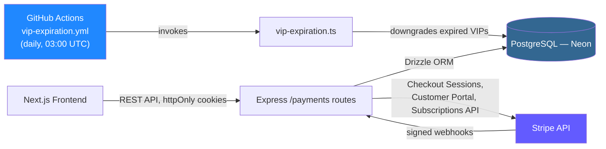
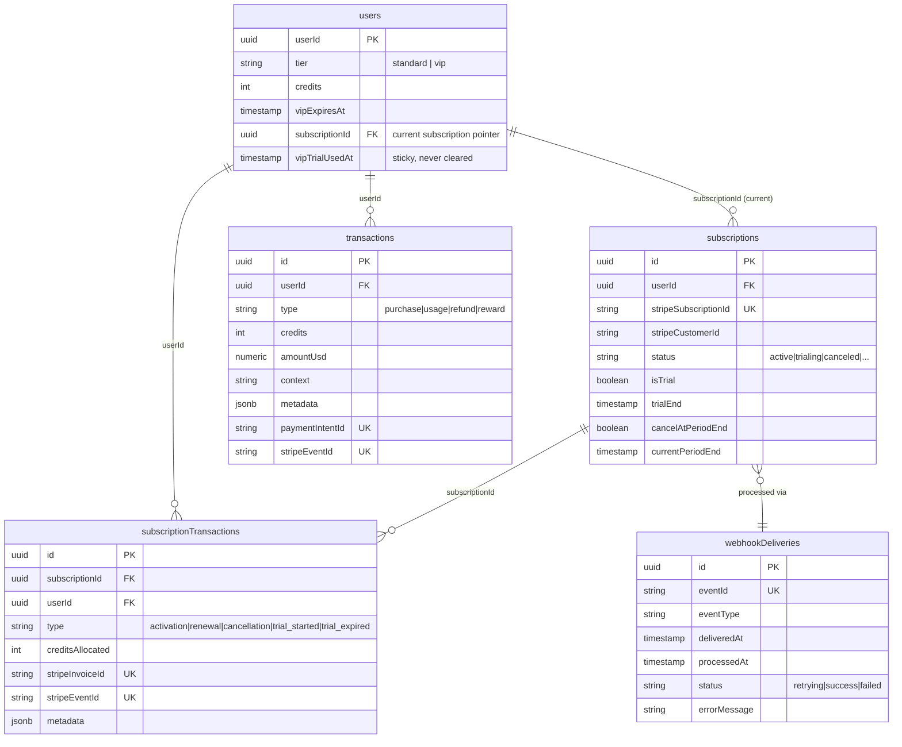
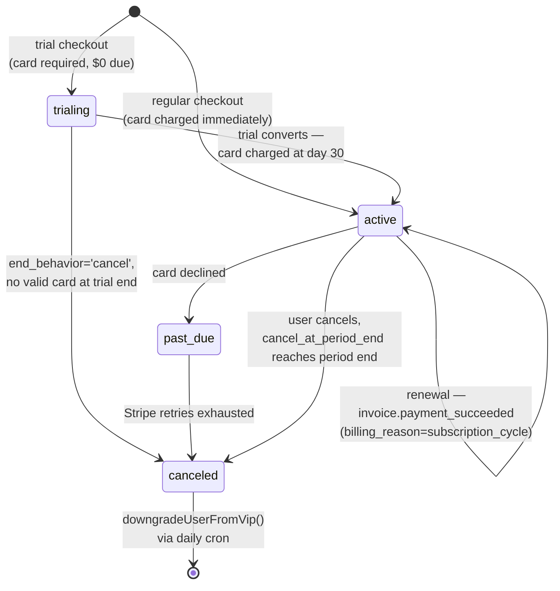
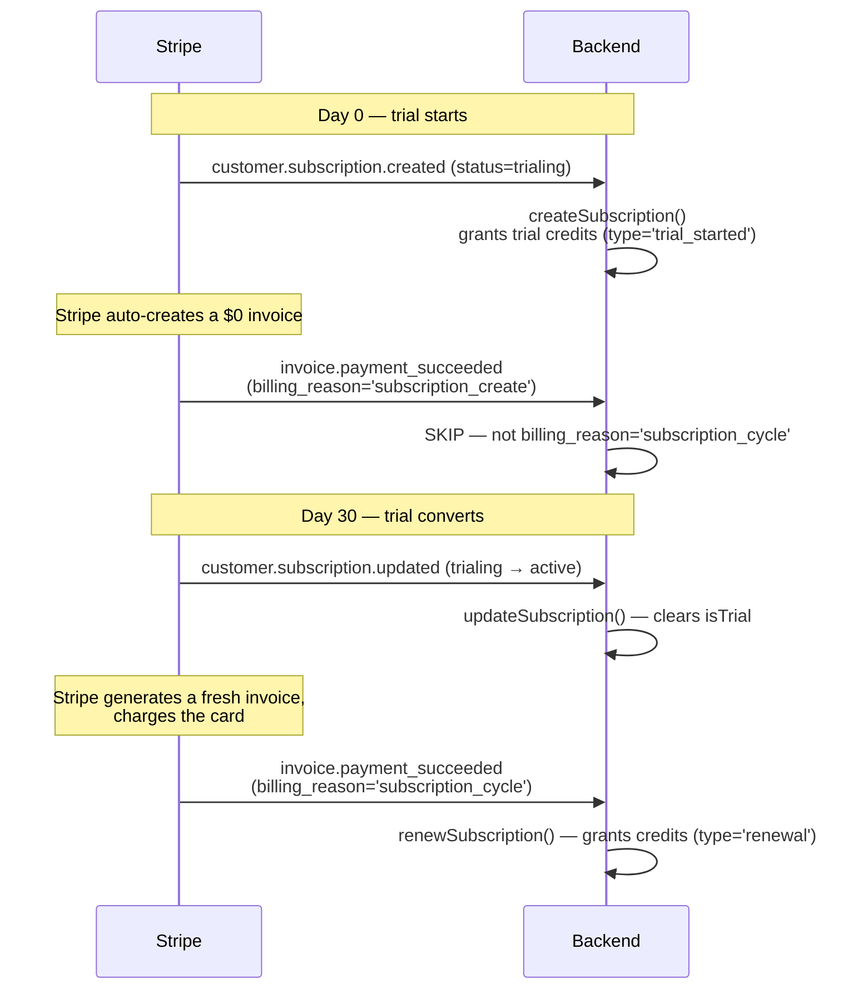
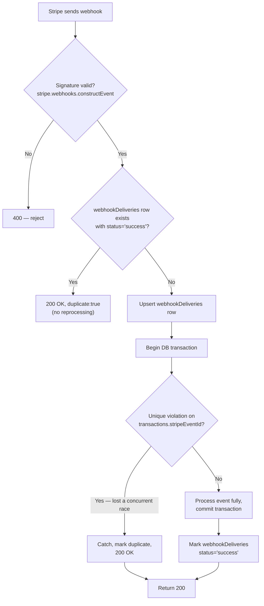
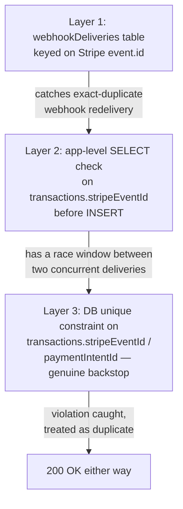

# Twistloom — Payments & Subscriptions Architecture (Backend)

**Scope:** Express backend, Stripe integration, credits system, VIP subscriptions, VIP free trial
**Stack:** Express · PostgreSQL (Neon) · Drizzle ORM · Stripe Node SDK `^22.2.0` (API version 2025-03-31 "basil" generation)
**Companion doc:** [Payments & Subscriptions Architecture (Frontend)](./PAYMENTS_ARCHITECTURE_FRONTEND.md)

---

## Table of contents

1. [System overview](#1-system-overview)
2. [Database schema](#2-database-schema)
3. [The credit system](#3-the-credit-system)
4. [The VIP subscription system](#4-the-vip-subscription-system)
5. [The VIP free trial](#5-the-vip-free-trial)
6. [Stripe webhook processing](#6-stripe-webhook-processing)
7. [API routes reference](#7-api-routes-reference)
8. [Idempotency & concurrency](#8-idempotency--concurrency)
9. [Security](#9-security)
10. [Design decisions & trade-offs](#10-design-decisions--trade-offs)
11. [File reference map](#11-file-reference-map)

---

## 1. System overview

Twistloom's monetization has two independent currencies that interact at exactly one point:

- **Credits** — a spendable balance (`users.credits`) consumed per story action (generation, hints, custom actions). Bought directly in packs, or granted as a VIP subscription benefit.
- **VIP subscription** — a recurring or trial Stripe subscription that grants a badge, a 2x daily check-in multiplier, and a monthly credit grant.

The only place these two systems touch is credit *allocation*: a VIP subscription period starting or renewing adds credits to the same balance a credit-pack purchase would.



**Core design principle: the backend is the single source of truth.** The frontend never computes VIP status, credit balances, or trial eligibility locally — it always asks the backend and renders what comes back. This matters because Stripe is the actual source of truth for subscription state, and the backend's job is to stay in sync with Stripe via webhooks, not to let the frontend guess.

---

## 2. Database schema

Five tables carry the whole system. `id()` / `userId()` / `createdAt` / `updatedAt` below are shared column helpers used throughout the schema.



### Why `users.subscriptionId` matters

A user accumulates a **new** `subscriptions` row every time they subscribe — cancel and resubscribe later, or a trial that lapses followed by a real signup, and you have two (or more) rows for the same user. `users.subscriptionId` is the canonical "which one is current" pointer, kept in sync by `createSubscription()` (sets it) and `downgradeUserFromVip()` (clears it). **Any query that needs "the user's current subscription" must join through this pointer, not just filter `subscriptions.userId`** — an unordered `WHERE userId = X LIMIT 1` has no guarantee of returning the right row once a user has history. This was a real bug (§10 has the full story).

### Why `transactions.paymentIntentId` / `stripeEventId` are unique-constrained

These columns exist specifically so a **database-level** guarantee backs up the application-level idempotency check — see [§8](#8-idempotency--concurrency).

---

## 3. The credit system

### Configuration

```ts
// config/credits.ts
export const CREDIT_COSTS = {
  STORY_GENERATION: 5,
  CHOOSE_OTHER_ACTION: 2,
  SHOW_ACTION_HINT: 1,
  CUSTOM_ACTION: 5,
  CUSTOM_ACTION_AFTER_CHOICE: 7,
  // ...
} as const;

export const CREDIT_PACKS: CreditPack[] = [
  { id: "observer",      credits: 50,  priceUSD: 2.99  },
  { id: "investigator",  credits: 150, priceUSD: 7.99  },
  { id: "mastermind",    credits: 500, priceUSD: 19.99 },
];
```

### Two credit-granting functions, deliberately different

| | `addCredits()` | `awardCredits()` |
|---|---|---|
| Used for | Subscription activation/renewal, daily check-in | Credit-pack purchases, first-purchase bonus |
| Creates a user notification | No | Yes |
| Persists `paymentIntentId`/`stripeEventId` | No (not tied to a specific charge) | Yes, when passed |
| Transaction `type` | `'reward'` | `'purchase'` |

Both accept an optional `tx` (Drizzle transaction) so credit allocation stays atomic with whatever else is happening in the same webhook or request — this is not optional in practice, since it's what makes the idempotency guarantees in §8 actually hold.

### Consume flow

```ts
// A representative call site — story generation
const result = await executeWithCredits(userId, CREDIT_COSTS.STORY_GENERATION, {
  context: "story_generation",
  metadata: { bookId },
  idempotencyKey: `story-gen-${bookId}`, // prevents double-charging on retry
}, async () => {
  return await generateNextPage(bookId); // the actual expensive operation
});
```

Credit consumption and the operation it pays for happen inside the same DB transaction boundary, with a `correlationId` returned so the caller can issue a `refundCreditsIdempotent()` if the downstream operation fails *after* credits were already deducted.

---

## 4. The VIP subscription system

### Configuration

```ts
// config/subscription.ts
export const VIP_SUBSCRIPTION: SubscriptionConfig = {
  priceUSD: 9.99,
  priceId: process.env.STRIPE_VIP_PRICE_ID,
  monthlyCredits: 50,
  checkInMultiplier: 2,
};
```

### Lifecycle



### The three lifecycle functions

```ts
// services/subscription.ts

// customer.subscription.created → allocates credits, sets users.tier='vip'
export async function createSubscription(params: {
  userId, stripeSubscriptionId, stripeCustomerId, stripePriceId,
  currentPeriodStart, currentPeriodEnd,
  isTrial?: boolean, trialEnd?: Date | null,
}): Promise<void>

// invoice.payment_succeeded (renewals only — see §5) → allocates credits again
export async function renewSubscription(params: {
  stripeSubscriptionId, stripeInvoiceId, currentPeriodEnd,
}): Promise<void>

// customer.subscription.deleted → marks canceled, downgrade deferred to cron
export async function cancelSubscription(params: {
  stripeSubscriptionId, canceledAt,
}): Promise<void>
```

All three run inside `dbWrite.transaction()` and catch Postgres unique-violations (SQLSTATE `23505`) as a signal that a redelivered webhook already did this work — see [§8](#8-idempotency--concurrency).

### The expiration cron

`vip-expiration.ts` finds every user with `tier='vip' AND vipExpiresAt < now()` and calls `downgradeUserFromVip()`. It's idempotent (safe to re-run) and scheduled via GitHub Actions:

```yaml
# .github/workflows/vip-expiration.yml
on:
  schedule:
    - cron: "0 3 * * *"   # daily, 03:00 UTC
  workflow_dispatch: {}    # manual trigger for testing/backfill
```

This is worth calling out explicitly: **`hasActiveVipSubscription()` independently checks `vipExpiresAt > now()`**, so feature-gating is correct even if the cron is delayed — but `users.tier` itself stays `'vip'` until the cron actually runs. Anything reading `tier` directly instead of calling `hasActiveVipSubscription()` will be wrong for up to 24 hours after expiry.

---

## 5. The VIP free trial

LinkedIn-style: card required upfront (Stripe's default for subscription-mode Checkout), full VIP benefits from day one, 30 days, auto-converts unless canceled.

```ts
// config/subscription.ts
export const VIP_TRIAL = {
  enabled: process.env.VIP_TRIAL_ENABLED === 'true', // kill-switch
  trialPeriodDays: 30,
  endBehavior: 'cancel' as 'cancel' | 'pause', // see §10
};
```

### Eligibility

```ts
export async function isTrialEligible(userId: string): Promise<boolean> {
  if (!VIP_TRIAL.enabled) return false;
  const user = await getUserVipTrialUsedAt(userId);
  if (!user || user.vipTrialUsedAt) return false;  // permanent, one-time-ever lockout
  return !(await hasActiveVipSubscription(userId));
}
```

`users.vipTrialUsedAt` is set once, at trial start, and **never cleared** — not by cancellation, not by refund, not by account changes. This is what makes the lockout permanent regardless of what happens to the underlying Stripe subscription.

### The trickiest part: why the trial-conversion invoice doesn't double-grant credits

This is the single most important thing to understand about how the trial interacts with billing. Stripe's `invoice.payment_succeeded` fires for a subscription's *first* invoice — not just genuine renewals — so naively wiring credit allocation to that event double-grants on **every** new subscription, trial or not. The fix is Stripe's `invoice.billing_reason` field:



```ts
// routes/payments.ts — handleInvoicePaymentSucceeded
if (invoice.billing_reason !== 'subscription_cycle') {
  // Initial invoice (subscription_create) — already credited via
  // handleSubscriptionCreated → createSubscription(). Not a renewal.
  return;
}
await renewSubscription({ stripeSubscriptionId, stripeInvoiceId: invoice.id, currentPeriodEnd });
```

One credit grant at trial start (for the trial's own 30 days), one at conversion (for the next 30 days) — the same one-grant-per-period pattern a regular paying subscriber gets, just with the first period priced at $0.

### Checkout session

```ts
const session = await getStripe().checkout.sessions.create({
  mode: "subscription",
  customer: customerId,
  line_items: [{ price: VIP_SUBSCRIPTION.priceId, quantity: 1 }],
  subscription_data: {
    trial_period_days: VIP_TRIAL.trialPeriodDays,
    trial_settings: { end_behavior: { missing_payment_method: VIP_TRIAL.endBehavior } },
  },
  payment_method_collection: "always", // card required — explicit, not just relying on the default
});
```

### Trial ending — notification + email

`customer.subscription.trial_will_end` fires ~3 days before trial end:

```ts
export async function handleTrialWillEnd(stripeSubscriptionId: string): Promise<void> {
  // ... fetch user + trial info ...
  await dbWrite.insert(userNotifications).values({ type: 'trial_ending_soon', /* ... */ });

  // Non-blocking — a Resend outage must not break the notification or fail the webhook
  try {
    await sendTrialEndingEmail({ to: user.email, name: user.name, trialEndDate: trialEnd });
  } catch (error) {
    console.error("Failed to send trial-ending email:", error);
  }
}
```

### Trial ends without converting — analytics, not clawback

When a trial cancels via `end_behavior: 'cancel'`, the decision (see [§10](#10-design-decisions--trade-offs)) was **not** to reclaim unused credits, but to record the outcome for later analysis:

```ts
// Inside cancelSubscription() — checks transaction HISTORY, not the isTrial flag.
// Why: customer.subscription.updated (trialing→canceled) typically fires BEFORE
// .deleted, so isTrial is usually already false by the time this code runs.
const history = await tx.select({ type: subscriptionTransactions.type })
  .from(subscriptionTransactions)
  .where(eq(subscriptionTransactions.subscriptionId, subscription.id));

const wasTrial = history.some(t => t.type === 'trial_started');
const everConverted = history.some(t => t.type === 'renewal');

if (wasTrial && !everConverted) {
  await tx.insert(subscriptionTransactions).values({
    type: 'trial_expired',
    creditsAllocated: 0,
    metadata: { creditsRemainingAtCancellation: user.credits, trialEnd: subscription.trialEnd },
  });
}
```

---

## 6. Stripe webhook processing

Single endpoint, `POST /payments/stripe/webhook`, handling eight event types:



### Event → handler map

| Event | Handler | Purpose |
|---|---|---|
| `checkout.session.completed` | inline, gated on `session.mode === 'payment'` | Credit-pack purchase → `awardCredits()` |
| `charge.refunded` | inline | Proportional credit clawback on refund |
| `customer.subscription.created` | `handleSubscriptionCreated` → `createSubscription()` | New subscription (trial or paid) |
| `customer.subscription.updated` | `handleSubscriptionUpdated` → `updateSubscription()` | Status/period changes, trial conversion |
| `customer.subscription.deleted` | `handleSubscriptionDeleted` → `cancelSubscription()` | Subscription ends |
| `customer.subscription.trial_will_end` | `handleTrialWillEndEvent` → `handleTrialWillEnd()` | ~3-day trial-ending reminder |
| `invoice.payment_succeeded` | `handleInvoicePaymentSucceeded` | Renewals only (`billing_reason` gated — see §5) |
| `invoice.payment_failed` | `handleInvoicePaymentFailed` | Marks `past_due` |

### Why `checkout.session.completed` checks `session.mode`

VIP subscription checkouts (both trial and regular) also fire `checkout.session.completed` — but they have no `session.payment_intent` the way a credit-pack purchase does. Without the mode check, every subscription signup would hit `checkout.session.completed`'s "missing payment intent" validation error and Stripe would retry it fruitlessly for days:

```ts
if (event.type === "checkout.session.completed" && session.mode === "payment") {
  // credit-pack purchase logic — everything else falls through to the
  // subscription-events branch below, which no-ops harmlessly for a
  // subscription-mode session and marks the webhook handled either way.
}
```

---

## 7. API routes reference

| Method | Path | Auth | Purpose |
|---|---|---|---|
| GET | `/payments/credit-packs` | none | List purchasable credit packs |
| POST | `/payments/create-checkout-session` | required | Credit-pack purchase checkout |
| POST | `/payments/create-subscription-checkout` | required | Regular VIP subscription checkout |
| POST | `/payments/create-trial-checkout-session` | required | VIP trial checkout (server re-checks eligibility) |
| GET | `/payments/subscription` | optional | Current subscription status (`active` or `trialing`) |
| GET | `/payments/subscription/trial-eligibility` | required | `{ eligible: boolean }` |
| GET | `/payments/subscription-plans` | none | Plan pricing/benefits for display |
| POST | `/payments/subscription/cancel` | required | Schedule cancel-at-period-end |
| GET | `/payments/subscription/portal` | required | Stripe Customer Portal session URL |
| POST | `/payments/stripe/webhook` | Stripe signature | Webhook ingestion (see §6) |
| POST | `/payments/consume-credits` | required | Deduct credits for an action |
| GET | `/payments/transactions` | required | Paginated transaction history |

All checkout/portal endpoints that accept a `returnUrl` validate its origin against `FRONTEND_URL` before using it — see [§9](#9-security).

---

## 8. Idempotency & concurrency

Three layers, each catching what the layer above might miss:



Layer 3 is the one that actually closes the race Layer 2 can't: if two deliveries of the same event both pass the `SELECT ... WHERE stripeEventId = X` check before either commits, they can't both successfully `INSERT` — the second hits a unique-constraint violation, which is caught and treated as "already processed":

```ts
function isUniqueViolation(error: unknown): boolean {
  return typeof error === 'object' && error !== null && (error as { code?: string }).code === '23505';
}

try {
  await dbWrite.transaction(async (tx) => { /* ... */ });
} catch (error) {
  if (isUniqueViolation(error)) {
    console.log("Concurrent duplicate detected via unique constraint");
  } else {
    throw error;
  }
}
```

This pattern is used in four places: the checkout webhook, the refund webhook, `createSubscription()`, and `renewSubscription()`.

**This only works because `transactions.paymentIntentId`/`stripeEventId` are actually populated on insert.** Earlier in this system's life they were written into a JSON `metadata` blob instead of these dedicated columns — which silently defeated both the idempotency check *and* the refund lookup (which queries `paymentIntentId` directly). Fixed, but worth remembering why these specific columns exist.

---

## 9. Security

- **Webhook signature verification** — `stripe.webhooks.constructEvent(req.body, sig, webhookSecret)` requires the *raw* request body; `express.raw({ type: "application/json" })` must be mounted on this route before any JSON body parser touches it.
- **Origin-validated redirects** — every endpoint that accepts a `returnUrl` (checkout sessions, customer portal) validates it against `FRONTEND_URL`'s origin before use:
  ```ts
  const returnUrlObj = new URL(rawReturnUrl, baseUrl);
  if (returnUrlObj.origin !== new URL(baseUrl).origin) {
    throw new Error("Cross-origin returnUrl not allowed");
  }
  ```
  Without this, an attacker-controlled `returnUrl` becomes an open redirect.
- **Server-side re-validation** — trial eligibility, VIP status, and origin checks all happen server-side even when the frontend already gated on the same thing. The frontend gate is UX, not security.
- **Rate limiting** — checkout-session creation endpoints are rate-limited per-user to prevent rapid repeated Stripe API calls (accidental or abusive).

---

## 10. Design decisions & trade-offs

Full rationale lives in `VIP_FREE_TRIAL_ROADMAP.md` §9.2 — summarized here for quick reference:

| Decision | Chosen | Why (short version) |
|---|---|---|
| Cancel mid-trial | Access continues until trial end | Trial credits are front-loaded at day 0, not metered — there's no incremental gaming risk from matching the paid-subscriber cancellation UX |
| Failed payment at trial conversion | Immediate `cancel`, not a grace period | No launched-trial data yet to justify `pause`'s added complexity (paused UI state, resume flow) |
| Re-trial eligibility | Permanent lockout, no cooldown | Insufficient lapsed-trial volume yet for a cooldown's re-engagement value to matter |
| Unused trial credits on failed conversion | No clawback, but log the data | Abuse is already bounded (one trial, ever, per user, capped at 50 credits) — clawback's UX cost outweighs its thin recovery upside |
| Trial-ending email | Send via Resend, non-blocking | Stripe's own email is generic/unbranded; the trigger point and infra already existed |

### Bug this doc exists partly to prevent recurring: the `GET /subscription` join

`GET /payments/subscription` used to join `subscriptions` to `users` on a bare `userId` match with `.limit(1)` and no ordering. Any user with more than one `subscriptions` row (churned and resubscribed, a lapsed trial followed by a real signup) could get back an arbitrary — possibly long-canceled — row instead of their current one. Fixed by joining on `users.subscriptionId`, the canonical pointer:

```ts
// Correct — joins on the canonical "current subscription" pointer
.from(users)
.innerJoin(subscriptions, eq(subscriptions.id, users.subscriptionId))
.where(eq(users.userId, userId))

// Wrong — no guarantee of which row comes back for a user with history
.from(subscriptions)
.innerJoin(users, eq(subscriptions.userId, users.userId))
.where(eq(subscriptions.userId, userId))
.limit(1)
```

If you're writing a new query against `subscriptions` for "the user's current subscription," use the first pattern.

---

## 11. File reference map

```
src/
├── config/
│   ├── credits.ts            CREDIT_COSTS, CREDIT_PACKS, bonus amounts
│   └── subscription.ts       VIP_SUBSCRIPTION, VIP_BENEFITS, VIP_TRIAL
├── cron/
│   └── vip-expiration.ts     Daily downgrade job (see .github/workflows/vip-expiration.yml)
├── db/
│   └── schema.ts             users, subscriptions, subscriptionTransactions,
│                              transactions, webhookDeliveries
├── routes/
│   └── payments.ts           All /payments/* endpoints + Stripe webhook handler
├── services/
│   ├── credits.ts            addCredits, awardCredits, consumeCredits, refunds
│   └── subscription.ts       createSubscription, renewSubscription,
│                              cancelSubscription, isTrialEligible,
│                              handleTrialWillEnd, hasActiveVipSubscription
├── types/
│   ├── credits.ts            CreditPack, TransactionType, ConsumeCreditsOptions
│   └── subscription.ts       SubscriptionStatus, SubscriptionTransactionType,
│                              SubscriptionConfig
└── utils/
    ├── stripe.ts              getStripe() singleton
    └── email.ts               sendTrialEndingEmail + other transactional emails
```

---

## 12. Issues & Future Enhancements

### 🔴 Critical

#### 12.1 `awardCredits()` ignores `paymentIntentId` / `stripeEventId`

**Severity:** Critical — breaks the Layer 3 unique-constraint idempotency backstop.

**Description:** `AwardCreditsOptions` accepts `paymentIntentId` and `stripeEventId`, and the webhook handler passes them, but `awardCredits()` never writes them to the `transactions` insert. This means two concurrent webhook deliveries of `checkout.session.completed` that both pass the SELECT idempotency check can both successfully insert a transaction row, potentially double-crediting the user. The `webhookDeliveries.eventId` unique constraint is the only remaining guard.

**Fix:** Add `paymentIntentId` and `stripeEventId` to the `transactions.insert()` call inside `awardCredits()`.

### ✅ Resolved

#### 12.2 `transactions.amount_usd` (real) → `transactions.amount_cents` (integer)

**Location:** `src/db/schema.ts:1053`

**Resolution (2026-07-12):** Renamed to `amount_cents: integer` (Stripe-compatible cents). API response still returns `amountUsd` (dollars) via `amountCents / 100` in the transactions endpoint serializer.

#### 12.3 `subscription/cancel` — joined via `users.subscriptionId`

**Location:** `src/routes/payments.ts:1671-1675`

**Resolution (2026-07-12):** Updated to `innerJoin(users, eq(users.subscriptionId, subscriptions.id))` matching the canonical pattern documented in §10.

#### 12.6 Trial metadata added to regular subscription checkout

**Location:** `src/routes/payments.ts:637,642`

**Resolution (2026-07-12):** Regular `create-subscription-checkout` now passes `isTrial: "false"` in both `session.metadata` and `subscription_data.metadata`, matching the trial checkout's `isTrial: "true"`.

### 🟡 Moderate (remaining)

#### 12.4 `subscription/portal` should use canonical join pattern

**Location:** `src/routes/payments.ts:1761-1766`

**Description:** Selects `stripeCustomerId` from `subscriptions` ordered by recency. If the invariant that all rows share the same `customerId` ever breaks, this silently returns a stale value.

**Recommendation:** Join via `users.subscriptionId` or read `stripeCustomerId` directly from `users`.

#### 12.5 Webhook rate limit mismatch

**Description:** API documentation says 1000 req/min per IP; actual code uses 300 req/60sec global (single shared Redis key for all Stripe IPs).

**Recommendation:** Sync docs to code or increase limit + switch to IP-based key if Stripe IP space is known.

### 🟢 Minor

- `checkout.session.completed` mode guard (`session.mode === "payment"`) at line 1100 makes the subsequent `paymentIntentId` null-check at line 1107 redundant — subscription sessions have no payment intent anyway.
- Type guard `isSubscriptionWithPeriods` at line 64 uses `any`; could use `unknown` for better type safety.
- Handle `subscription/portal` returning 404 for missing `customerId` — could be confusing vs. "no subscription found" vs. "user never created a customer."

---

## 13. Resolved Open Questions

All three open questions from the initial audit were resolved on 2026-07-12:

| # | Question | Decision | Implementation |
|---|---|---|---|
| Q1 | `amountUsd` → integer cents? | Yes — integer cents | Renamed to `amountCents` in schema; API returns computed `amountUsd` |
| Q2 | `subscription/cancel` → canonical join? | Yes | Updated to `innerJoin` via `users.subscriptionId` |
| Q3 | Regular checkout → `isTrial: "false"`? | Yes | Added to both `session.metadata` and `subscription_data.metadata` |

---

*Last updated: July 12, 2026 (Added §12 Issues & Enhancements, §13 Open Questions; ERD schema corrections; resolved Q1-Q3)*
