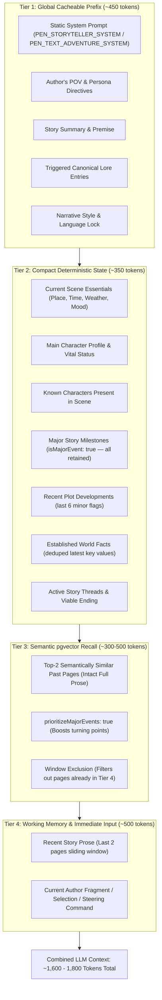
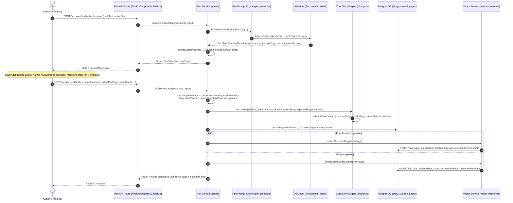

# Twistloom — Pen Long-Term Memory, Semantic Vector Retrieval & StateDelta Architecture

**Date:** August 27, 2026  
**Status:** Canonical Architectural Specification (v1.0 — Implemented)  
**Target Systems:** Twistloom Co-Writing Engine (`Twistloom-backend` & `Twistloom-web`)  
**Key References:**
- [`Twistloom-backend/src/utils/pen-prompt.ts`](file:///d:/Projects/Twistloom/Twistloom-backend/src/utils/pen-prompt.ts)
- [`Twistloom-backend/src/services/pen.ts`](file:///d:/Projects/Twistloom/Twistloom-backend/src/services/pen.ts)
- [`Twistloom-backend/src/services/vector-memory.ts`](file:///d:/Projects/Twistloom/Twistloom-backend/src/services/vector-memory.ts)
- [`Twistloom-backend/src/services/canon-validation.ts`](file:///d:/Projects/Twistloom/Twistloom-backend/src/services/canon-validation.ts)
- [`Twistloom-web/src/components/pen/StateAdoptDialog.tsx`](file:///d:/Projects/Twistloom/Twistloom-web/src/components/pen/StateAdoptDialog.tsx)

---

## 1. Overview & Problem Statement

In long-form storytelling (such as 150+ page mystery novels, multi-branching narratives, or cyclical "loop" stories like *Groundhog Day* or *Dark*), maintaining narrative continuity across deep page distances is critical.

### The Continuity Challenge in LLM Co-Writing
1. **Context Window Exhaustion & Cost:** Naively including all past pages ($150 \times 250\text{ words} \approx 50,000+\text{ tokens}$) is economically infeasible, exceeds latency budgets, and degrades output quality due to "lost in the middle" attention attenuation.
2. **Sliding Window Amnesia:** A standard sliding window (e.g., last 2 pages) loses all awareness of earlier revelations, character introductions, and clues once they scroll past the immediate horizon.
3. **Broken Truncation Artifacts:** Clipping recalled snippets with arbitrary character limits (e.g., `.slice(0, 200)`) truncates crucial entities and clues mid-sentence (e.g., *"The cipher on Dr. Vi..."*), corrupting context rather than informing the model.

Twistloom solves this by implementing a **4-Tier Hybrid Memory Architecture** combining deterministic major milestones, pgvector semantic retrieval of full intact passages, sliding prose windows, and structured StateDelta extraction.

---

## 2. The 4-Tier Hybrid Memory Architecture



### Token Budget & Cache Performance Matrix

| Tier | Component | Selection Strategy | Size (Tokens) | Provider Prompt Cache Status |
|---|---|---|---|---|
| **Tier 1** | System Prompt + Persona + Lore + Style | Static const + triggered lore keywords | $400 - 550$ | **Cached** ($\ge 75\%$ provider discount) |
| **Tier 2** | Scene + MC + Cast + Major Milestones + Facts | Deterministic extraction from `StoryState` | $300 - 450$ | Stable per page |
| **Tier 3** | Semantic Vector Recall | pgvector cosine similarity ($> 0.72$) | $250 - 450$ | Dynamic on-demand |
| **Tier 4** | Last 2 Pages Prose + Author Fragment | Immediate sliding window | $450 - 650$ | Volatile per turn |
| **Total** | **Full Generation Context** | **Hybrid deterministic + vector** | **$\approx 1,400 - 2,050$** | **$\ge 75\%$ prefix cache reuse** |

---

## 3. Dual-Anchor Long-Range Continuity

To guarantee that foundational plot elements established on **Page 1** remain active on **Page 150**, Twistloom employs two complementary anchors:

### Anchor A: Deterministic Major Milestones (Compact Permanent Retention)
* Plot flags marked with `isMajorEvent: true` are **never dropped** by pagination or trimming.
* In [`buildCanonicalBlock`](file:///d:/Projects/Twistloom/Twistloom-backend/src/utils/pen-prompt.ts#L212), all major events are formatted as compact, one-line canonical anchors:
  ```text
  MAJOR STORY MILESTONES (Do not contradict or forget):
    - [p.1] [REVELATION] Found brass pocket watch stopped at 11:14 PM with ouroboros etching (MAJOR)
    - [p.42] [EVENT] Silas revealed that the mechanism controls the harbor sluice gates (MAJOR)
    - [p.118] [DISCOVERY] Eliza confirmed the cipher was created by the clockmaker (MAJOR)
  ```
* **Efficiency:** 15 major events across a 150-page epic consume only $\approx 220$ tokens while establishing an unbreakable narrative baseline.

### Anchor B: Semantic Vector Retrieval (Intact Full Prose)
* When an author writes a scene callback (e.g., *"I touched the grandfather clock in the undercroft again..."*):
  1. Pen queries pgvector via [`retrieveSimilarPages`](file:///d:/Projects/Twistloom/Twistloom-backend/src/services/vector-memory.ts#L110) with `{ prioritizeMajorEvents: true }`.
  2. Past pages matching the semantic signature outside the immediate sliding window are retrieved.
  3. The **full intact text** of the retrieved pages is injected under `RECALLED HISTORICAL CONTEXT`:
     ```text
     RECALLED HISTORICAL CONTEXT (semantic memory from earlier pages):
     - Page 1: The grandfather clock in the undercroft ticked with an irregular rhythm. Behind the pendulum rested an iron key inscribed with a coiled serpent.
     ```
* **No Arbitrary Truncation:** Unlike naive previews, `sourceText` is preserved intact without `.slice(0, 200)` truncation, preventing corrupted clues and incomplete syntax.

---

## 4. End-to-End State Proposal & Finalization Pipeline



---

## 5. Schema Definitions & Type Contracts

### 5.1 Pen State Proposal Types
Defined in [`Twistloom-backend/src/types/pen.ts`](file:///d:/Projects/Twistloom/Twistloom-backend/src/types/pen.ts) and mirrored in [`Twistloom-web/src/lib/types/pen.ts`](file:///d:/Projects/Twistloom/Twistloom-web/src/lib/types/pen.ts):

```typescript
export type PenStateProposalPlotFlag = {
  fact: string;
  type: PlotFlagType; // "clue" | "danger" | "discovery" | "event" | "relationship" | "psychological" | "world" | "other"
  isMajorEvent: boolean;
};

export type PenStateProposalFact = {
  key: string;
  value: string;
  type?: FactType; // "lore" | "character" | "place" | "event" | "rule"
  reason?: string;
};
```

### 5.2 Finalize Input Contract
Passed from frontend to backend on publish:

```typescript
export type PenFinalizeInput = {
  draftId?: string;
  force?: boolean;
  isEnding?: boolean;
  actions?: { text: string; type: string; hint?: { text?: string; type?: string } }[];
  adoptInventory?: ObjectItem[];
  adoptInjuries?: Injury[];
  adoptKeyEvents?: string[];
  adoptKeyObjects?: string[];
  adoptOutline?: StoryOutline[];
  adoptPlotFlags?: PenStateProposalPlotFlag[];
  adoptFacts?: PenStateProposalFact[];
  adoptMood?: string;
  adoptWeather?: string;
  adoptCalendarDate?: string;
  adoptTimeOfDay?: string;
  adoptActionType?: string;
  adoptActionHint?: { text?: string; type?: string };
};
```

---

## 6. Vector Ingestion & Retrieval Specification

### 6.1 Ingestion Tables (`src/db/schema.ts`)
1. **`page_embeddings`**: Embeds full page prose (`text`) with metadata (`book_id`, `branch_id`, `page_number`, `is_major_event`).
2. **`clue_embeddings`**: Embeds active mystery thread clues for long-distance investigative callbacks.
3. **`character_embeddings`**: Embeds character interactions and psychological evolutions.
4. **`place_embeddings`**: Embeds atmospheric and state changes for narrative locations.

### 6.2 Distance Metric & Cosine Search
* **Model:** `text-embedding-3-small` (1536 dimensions).
* **Metric:** Cosine distance (`<=>`).
* **Query Threshold:** Minimum query length $> 10$ characters.
* **Filtering Strategy:** Excludes the current sliding window (`slice(-PEN_CONTEXT_PAGES)`) to eliminate redundant information in prompt Tier 3.

---

## 7. Canon Validation Integration

In [`src/services/canon-validation.ts`](file:///d:/Projects/Twistloom/Twistloom-backend/src/services/canon-validation.ts), [`formatPlotFlagsForCanon`](file:///d:/Projects/Twistloom/Twistloom-backend/src/services/canon-validation.ts#L96) explicitly separates major milestones from recent minor flags:

```typescript
function formatPlotFlagsForCanon(plotFlags: PlotFlag[]): string {
  if (!plotFlags.length) return '  None yet.';
  const major = plotFlags.filter((f) => f.isMajorEvent);
  const recent = plotFlags.filter((f) => !f.isMajorEvent).slice(-8);
  const lines: string[] = [];
  if (major.length) {
    lines.push('  Major Milestones (Crucial Canon):');
    for (const f of major) {
      lines.push(`  - [p.${f.page}] [${f.type.toUpperCase()}] ${f.fact} (MAJOR)`);
    }
  }
  if (recent.length) {
    lines.push('  Recent Developments:');
    for (const f of recent) {
      lines.push(`  - [p.${f.page}] [${f.type}] ${f.fact}`);
    }
  }
  return lines.join('\n');
}
```

This guarantees that canon contradiction judges will flag violations against Page 1 major facts even when validating drafts on Page 150.

---

## 8. Verification & Quality Invariants

1. **Monotonic Accumulation:** `story_states.plotFlags` grows monotonically across finalized pages without resetting.
2. **Major Event Immortality:** Any flag stamped with `isMajorEvent: true` persists permanently in prompt Tier 2.
3. **Zero Polling & Zero Compatibility Polyfills:** Clean native contracts across backend and frontend with full type safety (`bun run check` clean on both repositories).
4. **Unbroken Semantic Recall:** Recalled passages in Tier 3 are passed in full without arbitrary truncation.
