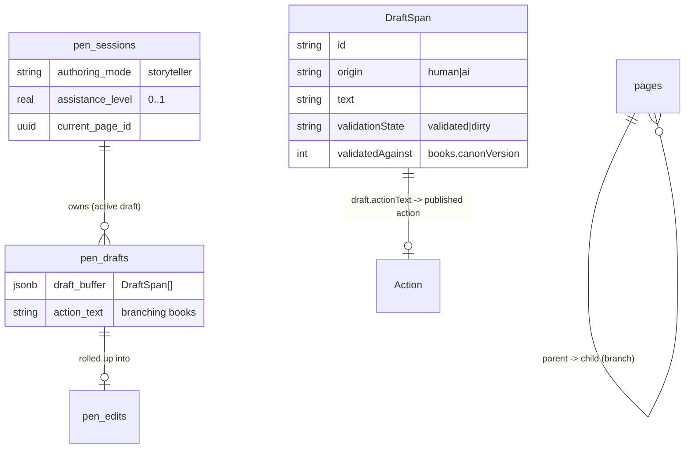
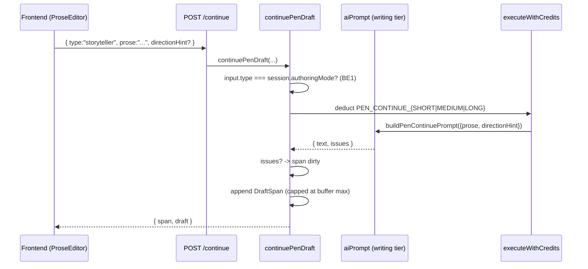
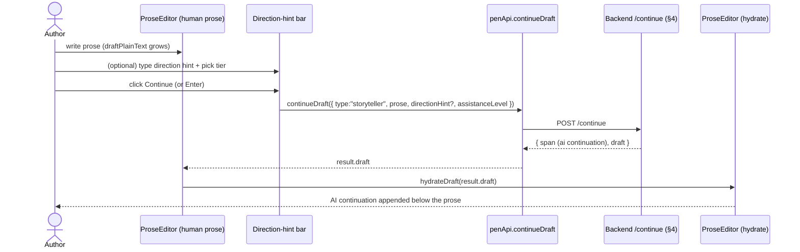

# Pen — Storyteller Mode Architecture

**Status:** Current, implementation-accurate (as of `2026-08-22`; the frontend was decoupled — `PenEditorClient.tsx` is now an orchestrator composing `pen-editor/*` hooks + presentational components, so §11 line references below point at those extracted modules).
**Scope:** The Storyteller (ST) authoring mode of the Pen (AI Co-Writing) engine — backend (`Twistloom-backend`) plus the **frontend (`Twistloom-web`) implementation** that drives it (prose authoring surface, direction-hint bar, length tiers, draft action-text, authoring-mode badge).
**Supersedes:** none (new document). Read alongside:
- `PEN_TEXT_ADVENTURE_ARCHITECTURE.md` — the orthogonal "protagonist" authoring mode (TA).
- `NEXT_PAGE_GENERATION_ARCHITECTURE.md` — the shared page/branch engine both Pen modes finalize into.
- `CANON_VALIDATION_ARCHITECTURE.md` — the finalize delta gate both modes hit.
- `../roadmap/AI_CO_WRITING_PEN_ROADMAP.md` — the parent Pen roadmap (§5.3, §6, §8, §10, §14).

---

## 1. Conceptual model — Storyteller = the AUTHOR

Storyteller is the **default** Pen authoring mode (`pen_sessions.authoring_mode = "storyteller"`). The human **writes**; the AI **co-authors** by extending the human's prose. This is the inverse of Text Adventure (where the human *acts* and the AI *narrates*).

| | Storyteller = the **AUTHOR** | Text Adventure = the **PROTAGONIST** |
|---|---|---|
| Human supplies | prose / ideas / direction | *actions / dialogue / intent* (commands) |
| AI supplies | extends the human's prose | interprets the command and narrates consequences |
| `/continue` payload | `prose` (+ optional `directionHint`) | `command` (latest command only) |
| Branching UI | author types action labels (branching books) | AI-generated latent siblings (command-resolved) |

Storyteller is orthogonal to **Book Mode** (`novel` · `interactive` · `multiverse`): a Storyteller session can author a linear Novel, a branching Interactive book, or a Multiverse. The *authoring interaction* is "you write, AI extends"; the *topology* is whatever the book was created with.

```
                    novel          interactive          multiverse
storyteller          ✅                ✅                  ✅
text_adventure       ✅                ✅                  ✅      (all 6 valid)
```

---

## 2. Where Storyteller lives in the stack

Storyteller uses the **Pen Model-C pipeline** (draft-then-finalize): one active `pen_sessions` row per `(user, book)`, owning a private `pen_drafts` buffer of `DraftSpan`s. `/finalize` is the only way a draft becomes a published `pages` row; `/discard` throws it away.

In Storyteller specifically:
- A **human** `DraftSpan` carries prose the **author wrote** (its `validationState` starts and stays `dirty` until finalize).
- An **AI** `DraftSpan` carries the **AI's continuation** (starts `validated` against `books.canonVersion`, or `dirty` if it self-reports canon `issues`).
- There is **no** command/`latentSiblings` mechanic — Storyteller spans are pure narrative prose. The `latentSiblings` field is TA-only and remains `undefined` for ST spans.

---

## 3. Data model

| Table / type | Role in Storyteller |
|---|---|
| `pen_sessions.authoring_mode` | `storyteller` — immutable post-create; gates the `/continue` request `type`. |
| `pen_sessions.assistance_level` | `0` (all human) → `1` (all AI). Snaps to a continuation-length tier (§8) and prices the credit. |
| `pen_sessions.authoring_pov` | optional default POV (first/second/third) for the session; per-interaction override possible. |
| `pen_sessions.current_page_id` | published page the draft continues from; `null` → page 1. |
| `pen_drafts.draft_buffer` (`DraftSpan[]`) | the linear authoring workspace; mixed human/AI prose spans. |
| `pen_drafts.action_text` | author-typed choice text leading into this draft's page (branching books only — D-4 core). |
| `pen_drafts.draft_characters_present` / `draft_scene_essentials` | author-curated cast + scene for the next published page. |
| `pen_edits` | audit trail; one row per human/AI interaction, rolled up into `pages.authorshipOrigin` / `aiContributionPercent`. |
| `pages` / `story_states` | the published graph Storyteller finalizes into (respecting the book's branching contract). |



---

## 4. The `/continue` request flow (Storyteller)

Endpoint: `POST /api/pen/sessions/:id/continue` → `continuePenDraft(userId, sessionId, draftId, input)` in `src/services/pen.ts`. The body is the `storyteller` branch of the discriminated union:

```ts
type PenContinueInput =
  | { type: "storyteller"; prose: string; directionHint?: string; ... }
  | { type: "text_adventure"; command: string; ... };
```

### 4.1 What Storyteller `/continue` does

1. **Mode enforcement (BE1).** `input.type` must equal `session.authoringMode`. A mismatched body (e.g. a TA command against a Storyteller session) is rejected — this re-arms the Gate 1 security filter so a mis-typed client can't slip past it.
2. **No Gate 1 command filter.** Storyteller prose is *author* prose, not a player command, so the custom-actions injection/denylist filter does **not** apply. (Gate 1 is TA-only.)
3. **Prompt assembly.** `buildPenContinuePrompt({ ...shared, prose: authorInput, directionHint, authoringPov, length })` builds the continuation prompt against `PEN_STORYTELLER_SYSTEM`, injecting canonical lore, recent prose, story state, momentum, scene essentials, and the author's direction hint.
4. **Single-request validate-and-generate.** One AI call (`aiPrompt`) returns `{ text, issues }`. The AI's self-reported `issues` (canon contradictions it couldn't avoid) mark the span `dirty`.
5. **Credit charge.** Wrapped in `executeWithCredits(userId, continueCreditKey({ assistanceLevel }))` — the tier (short/medium/long) is snapped from `assistanceLevel`, and the charge always matches what the author saw in the editor.
6. **Append span.** The AI text becomes an `ai` `DraftSpan`; the buffer is capped at `PEN_DRAFT_BUFFER_MAX_CHARS`. A `pen_edits` audit row is written.

> **Storyteller has no Gate 2 latent-sibling step.** `detectLoreContradiction` (TA's Gate 2) is gated to `input.type === "text_adventure"`, so ST continuations skip it; their canon re-check happens later at `/finalize` via the delta gate like any human-edited prose.

### 4.2 Sequence



---

## 5. Continuation-length tiers (§8)

Storyteller "continue" is a **single operation** ("finish my thought") that differs only in how much the AI appends. The stored `assistanceLevel` (0–1) snaps to a tier via `penContinueLengthForAssistance`:

| `assistanceLevel` | Tier | Approx. words | Output tokens |
|---|---|---|---|
| `< 0.3` | short | ~40 | `PEN_CONTINUE_MAX_TOKENS.short` (120) |
| `0.3 – 0.9` | medium | ~250 | `PEN_CONTINUE_MAX_TOKENS.medium` (450) |
| `> 0.9` | long | ~700 | `PEN_CONTINUE_MAX_TOKENS.long` (1200) |

All three tiers are the **same** continuation operation — renamed from the old "Suggest/Assist/Auto-continue" names because those implied behavior the tiers don't have. The author's `assistanceLevel` is also persisted on the session (convergent with the last tier used), closing the debounce race between the local toggle and the persisted value.

---

## 6. Authoring aids (block transforms + essentials/state proposals)

Beyond `/continue`, Storyteller authors use the same Pen assistant surface as TA for *editing* the draft:

- **`/transform`** (`POST /api/pen/sessions/:id/transform` → `transformPenSelection`) — rephrase / continue / describe / visualize / twist on a selected block. One credit (`PEN_TRANSFORM`), one `aiPrompt` call against `PEN_TRANSFORM_SCHEMA`, safety-filtered input (Gate 1 on the custom instruction).
- **Essentials autofill + state proposal** — `buildPenEssentialsAutofillPrompt` / `buildPenStateProposalPrompt` propose scene essentials and the next inventory/injuries/key-events/key-objects, which the author can **adopt as canon** at finalize (`coerceStateProposal`).

These are mode-agnostic (they run for both ST and TA); they are mentioned here because Storyteller authors lean on them for *prose crafting*, whereas TA authors lean on them far less (their agency is in commands).

---

## 7. `/finalize` — publishing the draft (mode-agnostic)

`finalizePenDraft` (`src/services/pen.ts`) is identical for both authoring modes; it is the only writer of `pages`. Key ST-relevant steps:

1. **Delta gate (Phase A, advisory).** `runFinalizeDeltaGate` checks spans against `books.canonVersion`; `dirty`/stale spans are re-checked for lore/fact/character/place contradictions. High findings without `force` return `needs_review` (never block).
2. **Branching contract (Phase B).** For `interactive`/`multiverse` books the author **must** supply `action_text` (the writer owns the narrative choice). The incoming `Action` is `coerceWriterAction(writerActionText, …)`; novel keeps its inherited transition.
3. **Engine publish.** `advanceStoryState` → `resolvePageDelta` → `determineBranchIdForPage` → `persistPageWithState` (single-page path) or `insertStoryPage` (page 1). ST prose becomes the published page text; AI spans roll up into `authorshipOrigin` / `aiContributionPercent`.
4. **Reverse-edge (Phase C).** The new page is recorded as the destination of the parent's chosen action (`validatePageActionsForMode` enforced). This is where ST's *authored* action labels become reader choices.

> **No latent-sibling promotion in ST.** `promotedSiblingRows` is only populated for TA + multiverse (see `PEN_TEXT_ADVENTURE_ARCHITECTURE.md` §7); for ST the `withDestination` union contains only `newPage.id`.

---

## 8. POV handling

Storyteller has **no first-person-only restriction** — the author may draft in any POV and the Pen continues in that POV. `authoringPov` (first/second/third) is injected via `povDirective(authoringMode, authoringPov)` into the prompt; TA is always second-person regardless of this field. Per-interaction `authoringPov` overrides the session default.

---

## 9. Credit & latency model

- A ST `/continue` charges **one** `PEN_CONTINUE_{SHORT|MEDIUM|LONG}` credit (tier snapped from `assistanceLevel`).
- `/transform` charges **one** `PEN_TRANSFORM` credit.
- No Gate 1 means no fail-fast credit save for ST (Gate 1's "no charge on rejection" benefit is TA-only, since ST prose is never security-filtered).
- All AI calls use `AI_CHAT_MODELS_WRITING`.

---

## 10. Backend API surface (Storyteller)

| Endpoint | Storyteller behavior |
|---|---|
| `POST /api/books/pen` | default `authoringMode` is `storyteller` when omitted. |
| `POST /api/pen/sessions` | creates a session with `authoringMode: "storyteller"` (immutable thereafter). |
| `POST /api/pen/sessions/:id/continue` | body `{ type:"storyteller", prose, directionHint? }`. Enforces `input.type === session.authoringMode` (BE1); builds `PEN_STORYTELLER_SYSTEM` prompt; single AI call; appends span. |
| `POST /api/pen/sessions/:id/transform` | block transforms on the selected prose. |
| `POST /api/pen/sessions/:id/finalize` | publishes the draft into `pages` respecting the book's branching contract. |
| `GET /api/pen/sessions/:bookId/outline` | lists published pages/branches for the ST-authored book. |

---

## 11. Frontend implementation (`Twistloom-web`)

Storyteller is the **default** authoring mode, so its frontend is the baseline Pen
editor. The backend contract (§4–§7) is consumed through
`src/lib/hooks/api/usePenApi.ts` → `penApi.continueDraft(sessionId, payload)`,
whose `PenContinueInput` union branches on `type`. For ST the payload is
`{ type: "storyteller", prose, directionHint?, assistanceLevel, draftId }` — the
human's **running prose buffer** plus an optional steering hint, in contrast to
TA's latest-command-only payload.

### 11.1 Continue bar (Storyteller direction-hint bar)

The fixed bottom bar (`PenContinuationBar.tsx`, wrapped in `data-tour="pen-continue"`)
renders, for ST, a multiline `Input` bound to `directionHint`
(`editor.directionPlaceholder`), an `ASSISTANCE_TIERS` length selector, a
continue-cost readout, and the Continue button (↵). Pressing `Enter` (without
`Shift`) on the input calls `continueDraft()` directly (Enter handler in `PenContinuationBar.tsx`; the `continueDraft` logic lives in `usePenContinue.ts`).
The bar is the same container `CommandInput` replaces in TA — so the `pen-continue`
tour target is valid for both modes.

### 11.2 `continueDraft` for Storyteller

`usePenContinue.ts` `continueDraft(commandOverride?)` branches on
`load.session.authoringMode`:

```ts
const isTa = load.session.authoringMode === 'text_adventure';
const prose = draftPlainText;                                  // TipTap HTML → plain text
const hint = directionHint.trim().slice(0, MAX_PEN_DIRECTION_LENGTH);
const payload: PenContinueInput = isTa
  ? { type: 'text_adventure', command: /* latest only */, assistanceLevel, draftId }
  : { type: 'storyteller', prose, directionHint: hint || undefined, assistanceLevel, draftId };
const result = await penApi.continueDraft(load.session.id, payload);
setLoad((prev) => (prev.status === 'ready' ? { ...prev, draft: result.draft } : prev));
hydrateDraft(result.draft);
```

Key ST points:
- **Full prose buffer, not latest-only.** ST sends `draftPlainText` (the whole
  running draft, stripped of TipTap markup) — the opposite of TA's
  latest-command-only rule (F3). The backend extends the human's prose; it needs
  the surrounding context.
- **`directionHint` is optional steering.** Sliced to `MAX_PEN_DIRECTION_LENGTH`
  client-side (mirrors server `PEN_DIRECTION_HINT_MAX_LENGTH` — some mobile
  browsers ignore `maxLength`).
- The result draft is hydrated straight back into `ProseEditor`, so the AI
  continuation appears as a new AI span immediately below the author's text.

### 11.3 ProseEditor — the authoring surface

`ProseEditor.tsx` is the TipTap surface where the human writes. It is mounted
inside a `ta-mode`-conditional wrapper (orchestrator):

```tsx
<div className={cn(isTextAdventure && 'ta-mode')}>
  <ProseEditor … onTyping={handleProseTyping} />
</div>
```

For ST `isTextAdventure` is `false`, so the wrapper has **no** `ta-mode` class —
human spans render as ordinary prose (no `>` prompt, no command tint). The AI
continuation span is appended by the backend and hydrated in; `AuthorshipMark`
still marks `data-authorship="human" | "ai"` on each span for the badge rollup.

**D.8 first-keystroke dismiss.** `ProseEditor` exposes an `onTyping` prop invoked
from its TipTap update handler; `handleProseTyping` (orchestrator)
calls `handleTourDone()` — an author who starts writing has found the surface, so
the tour ends and marks itself seen. (TA extends this to `CommandInput`, see
`PEN_TEXT_ADVENTURE_ARCHITECTURE.md` §10.8.)

### 11.4 Draft action-text input (D-4 core)

For **branching books** (`interactive`/`multiverse`), the author owns the reader's
choice text that leads *into* the draft's page. The branching action-text `Input` (rendered in `PenContinuationBar.tsx`):

```tsx
{!isTextAdventure && (
  <Input
    value={draftActionText}
    onChange={(e) => { setDraftActionText(e.target.value); persistActionText(e.target.value); }}
    maxLength={PEN_DRAFT_ACTION_TEXT_MAX_LENGTH}
    placeholder={t('editor.actionTextPlaceholder')}
    …
  />
)}
```

The `!isTextAdventure` guard means this input is **ST-only** — in TA the player's
command *is* the transition and outgoing branches are AI-generated latent futures,
so the author never hand-writes choice labels (§2). The value is persisted via
`persistActionText` and becomes the parent page's outgoing `Action` at `/finalize`
(§7.2 Phase B). The `editor.actionTextHint` + `n/MAX` counter sit beneath it.

### 11.5 Authoring-mode badge

The footer chip row (`PenEditorFooter.tsx`) shows two chips: the
`book.mode` chip (`editor.mode.<novel|interactive|multiverse>`) and, beside it, the
authoring-mode chip (`editor.mode.storyteller` for ST, `…textAdventure` for TA) —
making the *author-vs-protagonist* distinction explicit at a glance.

### 11.6 Length tiers & assist persistence

`ASSISTANCE_TIERS` (short/medium/long) — rendered by `PenContinuationBar.tsx` and persisted via `usePenContinue.ts` — is a
segmented control bound to `assistance` via `onAssistanceChange`. `aria-pressed`
reflects `assistanceToTierIndex(assistance)`. The selected tier both snaps the
continuation length (§5) and prices the credit (`continueCost` readout shows
`editor.continueFree` / `editor.continueCost`). A `saving`/`saved` affordance
(`assistState`) converges the local toggle with the persisted
`pen_sessions.assistance_level`, closing the debounce race described in §5.

### 11.7 i18n

The ST editor reuses the shared `pen.editor.*` namespace (`messages/en.json` +
`id.json`): `directionPlaceholder`, `length`, `continue`, `continueFree`,
`continueCost`, `shortcuts`, `saving`, `saved`, `actionText` / `actionTextPlaceholder`
/ `actionTextHint`, `mode.storyteller`, `endingNoActionNeeded`. There is **no**
`pen.tour.*` TA-specific copy here — the shared `prose` / `continue` / `outline` /
`scene` / `drawer` step bodies serve ST (see `PEN_EDITOR_TOUR_ROADMAP.md` §12, where
ST keeps the original 6 steps and only TA gets the tailored set).

### 11.8 Frontend mermaid — author ST continue loop



### 11.9 Deferred / not applicable (ST)

- **Latent sibling generation (B6)** and **Gate 2 canon validation
  (`detectLoreContradiction`)** are TA-only by design (§13) — ST has no
  command-resolved branching and re-checks canon at the `/finalize` delta gate instead.
- **`CommandInput` / `>` prompt / Do-Say toggle** are TA-only (see
  `PEN_TEXT_ADVENTURE_ARCHITECTURE.md` §10).

---

## 12. Configuration knobs (`src/config/story.ts`)

| Constant | Default | Purpose |
|---|---|---|
| `PEN_DEFAULT_AUTHORING_MODE` | `"storyteller"` | mode when a Pen session/book omits one. |
| `PEN_AUTHORING_MODES` | `["storyteller","text_adventure"]` | accepted authoring modes (route validation). |
| `PEN_CONTINUE_LENGTHS` / `PEN_CONTINUE_WORDS` / `PEN_CONTINUE_MAX_TOKENS` | short/medium/long | continuation tiers. |
| `penContinueLengthForAssistance` | — | snaps 0–1 `assistanceLevel` → tier. |
| `PEN_DRAFT_BUFFER_MAX_CHARS` | (existing) | buffer cap; AI spans counted against it. |
| `PEN_TRANSFORM_*` | (existing) | transform credit + token budgets. |

---

## 13. Implementation status (2026-08-21)

| Item | Status | Notes |
|---|---|---|
| Mode enforcement (`input.type === session.authoringMode`) | ✅ | `continuePenDraft` BE1 (shared with TA) |
| Storyteller `/continue` (prose + direction hint) | ✅ | `buildPenContinuePrompt({ prose })` against `PEN_STORYTELLER_SYSTEM` |
| Continuation-length tiers (short/medium/long) | ✅ | `penContinueLengthForAssistance` + `continueCreditKey` |
| Block transforms (`/transform`) | ✅ | `transformPenSelection` |
| `/finalize` publish + branching contract | ✅ | `finalizePenDraft` (mode-agnostic) |
| Latent sibling generation (B6) | ⏳ | TA-only by design — ST has no command-resolved branching |
| Gate 2 canon validation (`detectLoreContradiction`) | ⏳ | TA-only by design (ST prose re-checked at finalize delta gate) |

### 13.1 Frontend status (`Twistloom-web`, as of 2026-08-21)

| Item | Status | Notes |
|---|---|---|
| ProseEditor authoring surface | ✅ | `ProseEditor.tsx`; human writes, AI span appended on `/continue` |
| Direction-hint bar (`data-tour="pen-continue"`) | ✅ | multiline `Input` + Enter-to-continue (`PenContinuationBar.tsx`) |
| Length tiers + continue cost | ✅ | `ASSISTANCE_TIERS` selector + `continueCost` readout (`PenContinuationBar.tsx` / `usePenContinue.ts`) |
| `continueDraft` ST payload (plain prose + directionHint) | ✅ | `usePenContinue.ts`; `draftPlainText` sent whole |
| Draft action-text input (D-4, branching only) | ✅ | gated `!isTextAdventure` (`PenContinuationBar.tsx`); persisted via `persistActionText` (`usePenDrafts.ts`) |
| Authoring-mode badge (`editor.mode.storyteller`) | ✅ | second footer chip (`PenEditorFooter.tsx`) |
| Assist persistence (saving/saved) | ✅ | converges `assistance` ↔ `pen_sessions.assistance_level` |
| D.8 first-keystroke tour dismiss | ✅ | `ProseEditor.onTyping` → `handleTourDone` |
| `CommandInput` / `>` prompt / Do-Say | ⏳ | TA-only (see `PEN_TEXT_ADVENTURE_ARCHITECTURE.md` §10) |
