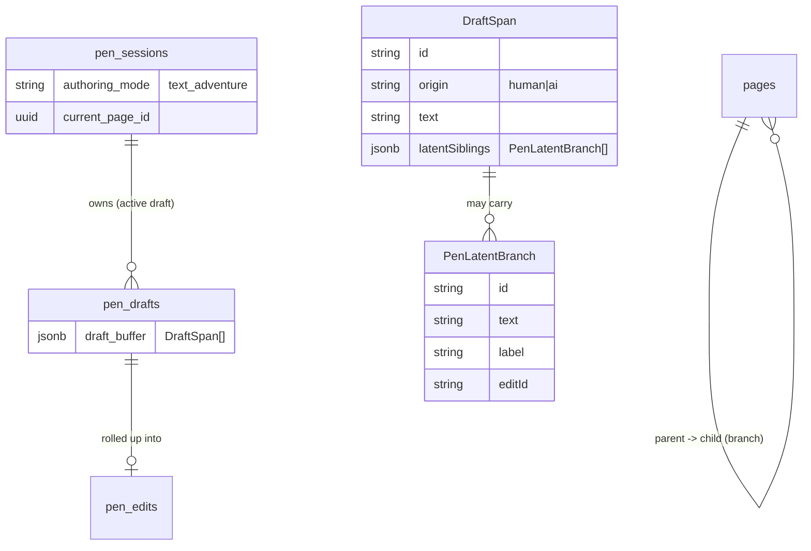
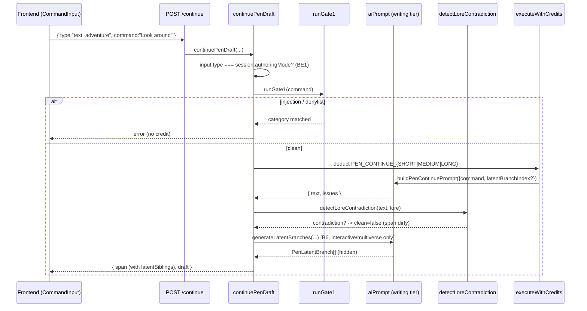
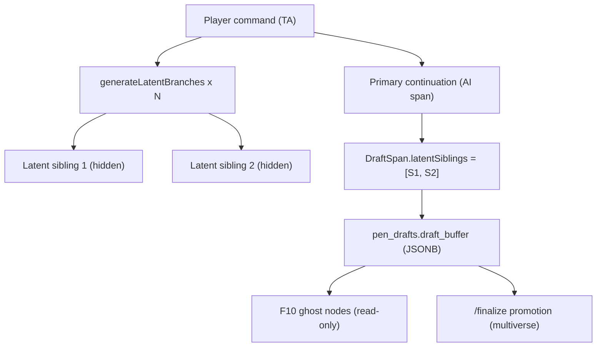
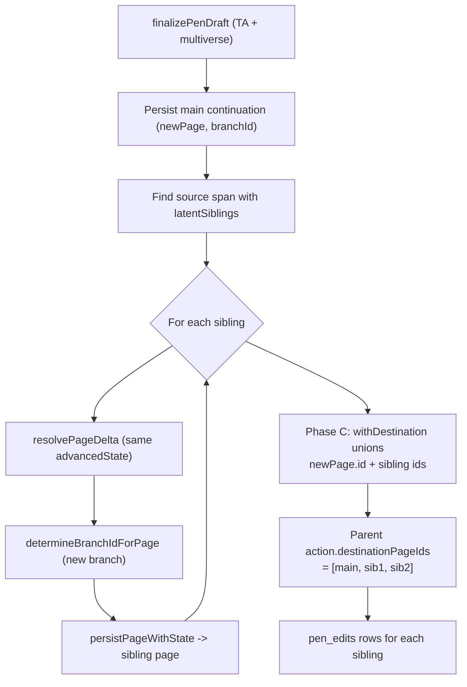
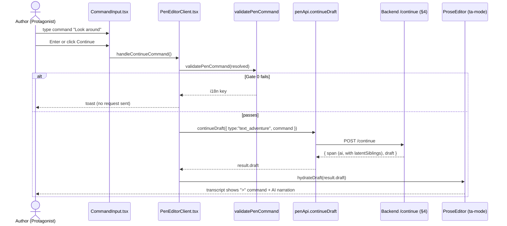

# Pen — Text Adventure Mode Architecture

**Status:** Current, implementation-accurate (as of `2026-08-22`; the frontend was decoupled — `PenEditorClient.tsx` is now an orchestrator composing `pen-editor/*` hooks + presentational components, so the §10 frontend references point at those extracted modules where relevant).
**Scope:** The Text Adventure (TA) authoring mode of the Pen (AI Co-Writing) engine — backend (`Twistloom-backend`) plus the **frontend (`Twistloom-web`) implementation** that drives it (entry two-axis UX, `CommandInput`, the latest-command `/continue` payload, `>`-styled transcript, client Gate 0, authoring-mode badge).
**Supersedes:** none (new document). Read alongside:
- `NEXT_PAGE_GENERATION_ARCHITECTURE.md` — the shared page/branch engine TA promotions feed into.
- `BRANCH_TRAVERSAL_ARCHITECTURE.md` — how readers traverse the graph TA seeds.
- `CANON_VALIDATION_ARCHITECTURE.md` — the delta gate TA's Gate 2 feeds.
- `../roadmap/PEN_TEXT_ADVENTURE_ROADMAP.md` — the product/roadmap framing (F1–F10, B1–B6).

---

## 1. Conceptual model — two orthogonal axes

Text Adventure is **not** "Storyteller with a textbox." It is a different *authoring interaction* layered on top of the same *narrative topology* (Book Mode). The two axes are independent:

| Axis | Values | Meaning |
|------|--------|---------|
| **Book Mode** (`books.mode`) | `novel` · `interactive` · `multiverse` | *Narrative topology* — how the resulting story branches. |
| **Pen Authoring Mode** (`pen_sessions.authoring_mode`) | `storyteller` · `text_adventure` | *Authoring interaction* — how the human drives the AI. |

```
                    novel          interactive          multiverse
storyteller          ✅                ✅                  ✅
text_adventure       ✅                ✅                  ✅      (all 6 valid)
```

> **Binding intent (from the product elaboration *Storyteller vs Text Adventure*):**
> 1. **TA is NOT locked to Novel.** It is a *different experience*, not a command bolted onto Storyteller.
> 2. **The player's interface is linear; the objective story is branching/multiversal.** The author (and each reader) traverses *one trajectory*; the underlying graph may contain AI-generated latent branches they never see.
> 3. **Human agency = 100%, human prose authorship ≈ 0%.** The human's contribution is measured in *decisions* (commands), not word count.
> 4. **AI alternatives are latent potential futures, not "choices."** At a node the user's command becomes *their* edge; the engine generates sibling branches (2B, 2C) that stay hidden until explored.
> 5. **Lazy branch expansion.** Only the frontier is generated; a branch expands when a reader/author lands on it.
> 6. **Action × Reality are distinct in Multiverse.** One command → multiple realities (A1/A2/A3); the player experiences one.

### Storyteller vs Text Adventure (the core split)

| | Storyteller = the **AUTHOR** | Text Adventure = the **PROTAGONIST** |
|---|---|---|
| Human supplies | prose / ideas / direction | *actions / dialogue / intent* (commands) |
| AI supplies | extends the human's prose | interprets the command and **narrates the consequences** |
| `/continue` payload | `prose` (+ optional `directionHint`) | `command` (latest command **only**) |
| Branching UI | author types action labels (branching books) | AI-generated latent siblings (command-resolved) |

---

## 2. Where TA lives in the stack

TA reuses the **entire** Pen Model-C pipeline (draft-then-finalize): one active `pen_sessions` row per `(user, book)`, owning a private `pen_drafts` buffer of `DraftSpan`s. `/finalize` is the *only* way a draft becomes a published `pages` row; `/discard` throws it away. TA only changes **what a span represents** and **what happens at `/continue` / `/finalize`**:

- In **Storyteller**, a human `DraftSpan` carries prose the author wrote.
- In **TA**, a human `DraftSpan` carries the *player's command* (rendered with a `>` prefix + command tint in the frontend), and the AI `DraftSpan` carries the *narrated consequence*. Branching books additionally get **latent sibling branches** attached to that AI span.

---

## 3. Data model

| Table / type | Role in TA |
|---|---|
| `pen_sessions.authoring_mode` | `text_adventure` — immutable post-create; gates the `/continue` request `type` and the Gate 1 filter. |
| `pen_sessions.current_page_id` | the published page the draft continues from; `null` → page 1. |
| `pen_drafts.draft_buffer` (`DraftSpan[]`) | the linear authoring workspace. TA human spans = commands; AI spans = narration **+ `latentSiblings`**. |
| `DraftSpan.latentSiblings?: PenLatentBranch[]` | **(B6)** alternate "what-if" futures of the same command, hidden until explored. |
| `PenLatentBranch { id, text, label?, editId? }` | one latent sibling: an AI-resolved alternate continuation. |
| `pen_edits` | audit trail; promoted sibling pages each get an `ai_continued` row (pageId = sibling page). |
| `pages` / `story_states` / `story_branch` | the published graph TA seeds via `/finalize` promotion (multiverse only). |



---

## 4. The `/continue` request flow (TA)

The endpoint is `POST /api/pen/sessions/:id/continue` → `continuePenDraft(userId, sessionId, draftId, input)` in `src/services/pen.ts`. The request body is a discriminated union keyed by `type`:

```ts
type PenContinueInput =
  | { type: "storyteller"; prose: string; directionHint?: string; ... }
  | { type: "text_adventure"; command: string; ... };
```

### 4.1 Three-gate pipeline (TA)

TA reuses the custom-actions safety philosophy, collapsed for the authoring path:

| Gate | What | Where (TA) | Effect on rejection |
|---|---|---|---|
| **Client Gate 0** | regex/length/empty/script-injection (frontend) | `src/lib/utils/pen-command.ts` `validatePenCommand` | instant feedback, no request |
| **Gate 1** | deterministic injection/denylist security filter | `runGate1(command)` in `continuePenDraft` | 422-class error, **no credit charged**, author rephrases |
| **Gate 2** | canon validation of the *generated* continuation | `detectLoreContradiction(output.text, lore)` in `continuePenDraft` | span marked `dirty` (not rejected) → finalize delta gate re-checks |

> Gate 1 intentionally carries **only the security component** of the custom-actions pipeline. Plausibility/phase gates are deliberately *not* applied: an author may legitimately redirect any scene at any phase. Gate 2 is the *new* TA piece — a best-effort deterministic cross-check of the continuation against the triggered story-bible (`lore`) entries (see §6).

### 4.2 Sequence



---

## 5. B6 — Latent sibling branch generation (the key TA mechanism)

### 5.1 Principle

When a TA command resolves in a **branching** book, the player's command is *their* edge, but the engine also generates sibling edges (2B, 2C) that the player **never sees** unless they later explore them (lazy expansion, §1 principle 5). These are the `PenLatentBranch` records stored on the AI `DraftSpan`.

### 5.2 Generation (lazy, server-side, at `/continue`)

Implemented in `generateLatentBranches(params)` (`src/services/pen.ts`):

- Triggered **only when** `input.type === "text_adventure"` **and** the book is `interactive` or `multiverse` **and** `PEN_TA_LATENT_BRANCH_COUNT > 0`. `novel` is skipped (single timeline — no branching contract).
- Produces `PEN_TA_LATENT_BRANCH_COUNT` (default **2**) alternate continuations by calling `buildPenContinuePrompt` with `latentBranchIndex` set — a divergence steer instructing the model to resolve the *same* command into a *different, plausible* "what-if."
- Runs **inside the caller's `executeWithCredits` transaction** (the AI spend is already authorized by the primary continuation), so no extra credit charge.
- **Failures are swallowed + logged** — latent branches are an enhancement, never a blocker for the main continuation.
- The total latent payload is counted against `PEN_DRAFT_BUFFER_MAX_CHARS` (the span + its siblings must fit the buffer cap).

### 5.3 Storage

Latent siblings live on the AI `DraftSpan`:

```jsonc
{
  "id": "span_9f2",
  "origin": "ai",
  "text": "You turn the handle. The door groans open onto a flooded stairwell.",
  "validationState": "validated",
  "latentSiblings": [
    { "id": "lb_1", "text": "You hesitate — and hear footsteps descending behind you." },
    { "id": "lb_2", "text": "The handle snaps off in your hand; the door stays sealed." }
  ]
}
```

This makes them available to:
- **F10 (frontend, deferred):** the outline can render `latentSiblings` as read-only "ghost" nodes off the current node.
- **`/finalize` promotion (§7):** they become real book branches.



---

## 6. Gate 2 — TA canon validation

`detectLoreContradiction(text, lore)` (`src/services/pen.ts`) runs **after** the AI returns and **before** the span is committed. It is a conservative, deterministic cross-check (no extra AI call):

- For each triggered `lore` entry whose `name` appears in the continuation, it scans the entry's `description` for significant canonical tokens.
- If the continuation states the **opposite** of a canonical attribute — i.e. the name and a canonical token both appear, with a negation (`not`, `never`, `no longer`, `without`, `lacks`, …) sitting within a ~40-char window between them — it flags a contradiction.
- A flagged continuation downgrades the span from `validated` → `dirty`, so the authoritative `runFinalizeDeltaGate` re-checks it at publish.

Design choices:
- **Skews toward false negatives** — only fires on an explicit *name + negation + canonical-token* triple, so valid prose is never silently dropped.
- **Gated** by `PEN_TA_GATE2_CANON_CHECK` (default `true`); flip to `false` to disable without code changes.
- Complements (does not replace) the AI's self-reported `issues` field already in the `PenContinueResult` contract — both feed `validationState`.

---

## 7. `/finalize` promotion — making TA actually branch

`finalizePenDraft` (`src/services/pen.ts`) is the only path that writes the draft into the published `pages` graph. For TA + **multiverse**, the latent siblings are promoted into **real book branches**.

### 7.1 Why multiverse-only

| Book Mode | Destinations per action | Can a single command own multiple siblings? |
|---|---|---|
| `novel` | 1 (linear) | n/a — latent generation skipped |
| `interactive` | 1 per action | **No** — one destination per action; siblings can't share the command's action |
| `multiverse` | up to `MAX_CANDIDATE_PAGE_PER_ACTION` | **Yes** — parallel timelines |

Therefore promotion is **multiverse-only**. Interactive still gets latent siblings *generated + stored* (powering F10 ghost nodes) but they are **not linked** into the graph (its contract forbids multiple destinations on one action). This is a principled, documented limitation — not a gap.

### 7.2 Promotion algorithm (continuation finalize, TA + multiverse)

1. After the main continuation page (`newPage`) is persisted via `persistPageWithState`, find the source `DraftSpan` = the last `ai` span carrying `latentSiblings`.
2. For each sibling text:
   - Build a `StoryGeneration` from the **same** `advancedState` + scene fields, swapping only `text` → sibling text.
   - `resolvePageDelta({ generatedStoryPage, advancedState, currentState, … })` → sibling state + delta.
   - `determineBranchIdForPage({ generateNewBranchId: true, isFirstAlternative: false, … })` → a **fresh** branch id (guarded against `usedBranchIds` collisions).
   - `persistPageWithState({ … branchId, … })` → sibling page.
   - Collect `{ id, text }` into `promotedSiblingRows`.
3. **Phase C** (the session-advance transaction):
   - `withDestination` now unions the parent action's existing destinations with `newPage.id` **and** every promoted sibling id, respecting `maxDestinationsPerActionForMode(book.mode)` (keeps the most-recently-added ids when over budget). This makes the siblings **parallel timelines reachable from the same command**.
   - Each promoted sibling gets an `ai_continued` `pen_edits` row (`pageId` = sibling page) so authorship + AI-contribution rollups cover the timelines.



### 7.3 Rollout safety

- Gated by `PEN_TA_PROMOTE_LATENT_BRANCHES` (default `true`).
- Set `false` to keep latent siblings **generated + stored** (so F10 still works) but **out of the published graph** during staged rollout.
- Sibling promotion is wrapped per-sibling in `try/catch` — a failure logs a warning and skips that sibling; the main page still publishes.

---

## 8. Credit & latency model

- A TA `/continue` charges **one** `PEN_CONTINUE_{SHORT|MEDIUM|LONG}` credit (tier snapped from `assistanceLevel`), exactly like Storyteller. The latent-sibling generation rides **inside the same credits transaction** — no additional charge.
- Gate 1 rejection (injection/denylist) charges **nothing** (clean fail-fast before `executeWithCredits`).
- All AI calls use `AI_CHAT_MODELS_WRITING`; latent-sibling calls use a distinct `context: "pen-continue-latent"` tag for quota tracking.

---

## 9. Backend API surface (TA)

| Endpoint | TA behavior |
|---|---|
| `POST /api/books/pen` | accepts `authoringMode: "text_adventure"` (validated against `PEN_AUTHORING_MODES`) to seed entry UX; stored on the session. |
| `POST /api/pen/sessions` | creates a session with `authoringMode` (immutable thereafter). |
| `POST /api/pen/sessions/:id/continue` | body `{ type:"text_adventure", command }`. Enforces `input.type === session.authoringMode` (BE1); Gate 1; Gate 2; B6 latent generation. Returns `span` (with `latentSiblings`) + full `draft`. |
| `POST /api/pen/sessions/:id/finalize` | promotes latent siblings → real branches for TA + multiverse (§7). |
| `GET /api/pen/sessions/:bookId/outline` | lists published pages/branches; the frontend can later surface `DraftSpan.latentSiblings` as ghost nodes (F10). |

---

## 10. Frontend implementation (`Twistloom-web`)

All frontend work for the `text_adventure` authoring experience lives in the
`Twistloom-web` repo. The backend contract (§4–§7) is consumed through
`src/lib/hooks/api/usePenApi.ts` → `penApi.continueDraft(sessionId, payload)`,
whose `PenContinueInput` union already branches on `type` (`"storyteller"` vs
`"text_adventure"`). The frontend's job is to render the *protagonist*
interaction and send the **latest command only** — never the running transcript.

### 10.1 Entry — two-axis selection + TA disclosure (F9)

`src/components/home/WriteModeCards.tsx` already presents the two orthogonal axes
as a modal wizard: **experience** (Storyteller / Text Adventure) × **structure**
(Book Mode: Novel / Interactive / Multiverse). Selecting a card calls
`booksApi.createPenBook({ ..., authoringMode: modalFor })` and routes to
`/books/[slug]/pen?mode=<authoringMode>`.

- The `?mode=` param is read (null-safe — `useSearchParams()` can return `null`
  during prerender, so it is guarded before `.get()`) in `PenEditorClient.tsx`
  as `entryAuthoringMode` (`"storyteller"` unless `mode=text_adventure`).
- A **disclosure box** (F9) renders inside the modal whenever
  `modalFor === "text_adventure"`, stating "you enter the story, you don't write
  it" and that the human authors *decisions*, not prose. This sets the
  agency-vs-authorship expectation up front (§1 principle 3) before the session
  is even created.

### 10.2 Session bootstrap & `isTextAdventure`

`PenEditorClient.tsx` derives an `isTextAdventure` flag from two sources:

- **Before load:** `entryAuthoringMode === "text_adventure"`.
- **After load:** `load.session.authoringMode === "text_adventure"` — the
  authoritative value, persisted by `createSession` from `entryAuthoringMode`.

This flag drives every TA-specific branch in the UI (bottom bar, action-text
input, badge, transcript styling). Two new pieces of local state support the
command surface:

- `commandText` — the raw command the author is typing (cleared inside
  `applyLoadedSession` and after a successful `/continue`).
- `commandDoSay: "do" | "say"` — the Do/Say toggle state.

### 10.3 `CommandInput` component (F1 + F7)

`src/components/pen/CommandInput.tsx` is the `>`-prefixed command surface that
replaces the Storyteller direction bar. Parent-owned (controlled) props:

```ts
type CommandDoSay = "do" | "say";
type CommandInputProps = {
  value: string;                 // raw command text (parent-owned)
  onChange: (v: string) => void;
  doSay: CommandDoSay;
  onDoSayChange: (v: CommandDoSay) => void;
  onSubmit: () => void;          // parent validates (Gate 0) + continues
  disabled?: boolean;
};
```

Features:

- **`>` prompt affordance** — a monospace `>` glyph rendered left of an
  auto-growing `<textarea>`. The literal `>` is a CSS `::before`, never sent; the
  backend command is the raw trimmed text.
- **Command history (↑/↓)** — an internal `historyRef` (capped ~50 entries);
  ArrowUp walks older commands, ArrowDown walks back, and clears at the bottom.
- **Quick-action chips** — `Look around`, `Inspect clue`, `Open door`,
  `Talk to…` (i18n `pen.editor.quickAction.{lookAround,inspectClue,openDoor,talkTo}`);
  clicking fills the input and focuses it.
- **Do/Say toggle** — a segmented `Do` / `Say` control; `Say` resolves to a
  `Say: <command>` prefix at submit time (see §10.4).
- **Client Gate 0** — `onSubmit` is owned by the parent (`handleContinueCommand`),
  which runs `validatePenCommand` before hitting `/continue` (§10.8).

### 10.4 `continueDraft` for TA (F3)

In `usePenContinue.ts` the `continueDraft` logic gained an optional
`commandOverride?: string` parameter. The dispatch:

```ts
const isTa = load.session.authoringMode === "text_adventure";
const taCommand = commandOverride ?? commandText.trim();
const payload = isTa
  ? { type: "text_adventure", command: taCommand, assistanceLevel, draftId }
  : { type: "storyteller", prose: draftPlainText, directionHint: hint || undefined, assistanceLevel, draftId };
```

`handleContinueCommand` (new) wraps the TA path:

1. Reads `commandText`; if `validatePenCommand("")` returns
   `editor.gate.commandEmpty`, toast + bail.
2. Resolves Do/Say: `resolved = commandDoSay === "say" ? \`Say: ${base}\` : base`.
3. Runs `validatePenCommand(resolved)` (Gate 0) → returns
   `editor.gate.commandEmpty` / `.commandTooLong` / `.commandInvalid` → toast + bail.
4. Calls `void continueDraft(resolved)`.

**The critical fix (F3):** TA now sends *only the latest command*
(`command: commandText`), **not** the whole transcript (`draftPlainText`). The
backend owns the running buffer + branching graph, so sending the command alone
is both sufficient and correct — the player's command is a discrete edge, not the
narrative so far.

### 10.5 Transcript rendering — `>`-styled command spans (F5)

The running transcript lives in `ProseEditor` (TipTap). For TA the editor is
wrapped in a `ta-mode` div (`PenEditorClient.tsx`), and `src/app/globals.css`
adds:

```css
.ta-mode [data-authorship="human"] {
  background-color: rgb(34 197 94 / 0.10);
  box-shadow: inset 2px 0 0 0 rgb(34 197 94 / 0.7);
  padding-left: 0.5rem;
}
.ta-mode [data-authorship="human"]::before {
  content: "> ";
  font-weight: 700;
  opacity: 0.7;
}
```

In TA, **human `DraftSpan`s are the player's commands** and AI `DraftSpan`s are
the narrated consequences, so this visually gives the human/AI divide a legible
`>` prompt without any backend change. (`data-authorship` is the same attribute
`AuthorshipMark` already emits for Storyteller prose.)

### 10.6 Draft action-text input hidden (F4)

The "reader's choice" input that sits above `ProseEditor` is gated
`!isTextAdventure` (the non-ending branch path). Rationale: in TA the player's
command *is* the transition; outgoing branches are AI-generated latent futures
(command-resolved), not pre-written author labels (§1 principles 4–5). The
`draftMissingActionText` publish gate already correctly excludes TA
(`book.mode === "interactive" || "multiverse"` only), so publish is never blocked.

### 10.7 Authoring-mode badge (F6)

The footer page chip gains a second chip beside `editor.mode.<bookMode>`:
`t(\`editor.mode.${isTextAdventure ? "textAdventure" : "storyteller"}\`)`,
which communicates *author vs protagonist* — Storyteller = "You write · AI
co-authors"; Text Adventure = "You act · AI narrates".

### 10.8 Client Gate 0 (`validatePenCommand`)

`src/lib/utils/pen-command.ts`:

```ts
import { PEN_COMMAND_MAX_LENGTH } from "@/lib/config/pen";

const UNSAFE_PATTERN = /<script|javascript:|on\w+\s*=|data:\s*[^;]*base64/i;

export function validatePenCommand(command: string): string | null {
  const trimmed = command.trim();
  if (!trimmed) return "editor.gate.commandEmpty";
  if (trimmed.length > PEN_COMMAND_MAX_LENGTH) return "editor.gate.commandTooLong";
  if (UNSAFE_PATTERN.test(trimmed)) return "editor.gate.commandInvalid";
  return null;
}
```

`PEN_COMMAND_MAX_LENGTH = 500` (added to `src/lib/config/pen.ts`). The function
returns a namespace-relative i18n key (`pen.editor.gate.*`) or `null`. This is
**instant client feedback only**; the authoritative Gate 1 still runs
server-side (§4.1) and returns a clean 422 with no credit charge.

### 10.9 i18n

Keys added to `messages/en.json` + `messages/id.json` under `pen.editor`:
`commandPlaceholder`, `commandHistoryHint`, `doSay.{do,say}`,
`quickAction.{lookAround,inspectClue,openDoor,talkTo}`,
`gate.{commandEmpty,commandTooLong,commandInvalid}`,
`mode.{storyteller,textAdventure}`; plus
`dashboard.forge.textAdventure.disclosure[Title]` for the entry disclosure
(§10.1).

### 10.10 Frontend mermaid — author TA loop



### 10.11 Deferred frontend (F8 / F10)

- **F10** — `OutlinePanel` ghost nodes reading `DraftSpan.latentSiblings`. The
  backend already produces them (§5); the author stays linear for v1.1 and latent
  siblings stay hidden until a reader explores them (lazy expansion, §1 principle 5).
- **F8** — in-session `authoringMode` toggle. Blocked on a backend
  `authoringMode` PATCH; the mode is entry-time only (`?mode=`).

---

## 11. Configuration knobs (`src/config/story.ts`)

| Constant | Default | Purpose |
|---|---|---|
| `PEN_TA_LATENT_BRANCH_COUNT` | `2` | How many latent siblings a TA `/continue` generates (branching books only). |
| `PEN_TA_PROMOTE_LATENT_BRANCHES` | `true` | Whether `/finalize` promotes siblings into real book branches (multiverse). `false` = generate+store only. |
| `PEN_TA_GATE2_CANON_CHECK` | `true` | Whether Gate 2 canon validation runs on the TA continuation. |
| `PEN_AUTHORING_MODES` | `["storyteller","text_adventure"]` | Accepted authoring modes (route validation). |
| `PEN_DRAFT_BUFFER_MAX_CHARS` | (existing) | Buffer cap; latent payload counted against it. |

---

## 12. Open questions / future work

- **F10** — surface `DraftSpan.latentSiblings` as read-only ghost nodes in `OutlinePanel` (backend already produces the data).
- **F8** — in-session `authoringMode` toggle (blocked on a backend `authoringMode` PATCH; currently entry-time only).
- **Interactive promotion** — today Interactive keeps latent siblings unlinked; a future design could surface them as *separate* actions rather than extra destinations on one command.
- **Reader exploration of latent branches** — when a reader lands on a TA-seeded node, the engine's existing candidate-generation/branch-traversal machinery serves the promoted siblings as real choices; no TA-specific reader code is required.

---

## 13. Implementation status (2026-08-22)

| Item | Status | Notes |
|---|---|---|
| Mode enforcement (`input.type === session.authoringMode`) | ✅ | `continuePenDraft` BE1 |
| Gate 1 deterministic command filter → no credit | ✅ | `runGate1` |
| Gate 2 (TA canon validation) | ✅ | `detectLoreContradiction` (new) |
| Full 3-gate pipeline (client Gate 0 + Gate 1 + Gate 2) | ✅ | |
| B6 latent sibling generation + storage | ✅ | `generateLatentBranches` |
| B6 `/finalize` promotion (TA + multiverse) | ✅ | gated by `PEN_TA_PROMOTE_LATENT_BRANCHES` |
| F10 outline ghost nodes | ⏳ | deferred (backend produces the data) |
| F8 in-session mode toggle | ⏳ | blocked on backend `authoringMode` PATCH |

### 13.1 Frontend status (`Twistloom-web`, as of 2026-08-22)

| Item | Status | Notes |
|---|---|---|
| F1 `CommandInput` command surface | ✅ | `src/components/pen/CommandInput.tsx` (history, chips, Do/Say) |
| F2 bottom-bar swap to `CommandInput` for TA | ✅ | `PenContinuationBar.tsx` branches on `isTextAdventure` (ST direction-hint input ↔ TA `CommandInput`) |
| F3 latest-command-only `/continue` payload | ✅ | `continueDraft(commandOverride?)` + `handleContinueCommand` (`usePenContinue.ts`) |
| F4 hide draft action-text input in TA | ✅ | gated `!isTextAdventure`; publish gate already excludes TA |
| F5 `>`-styled command spans | ✅ | `ta-mode` wrapper + `globals.css` `.ta-mode [data-authorship="human"]` |
| F6 authoring-mode badge | ✅ | second footer chip (`PenEditorFooter.tsx`) `editor.mode.textAdventure` |
| F7 client Gate 0 (`validatePenCommand`) | ✅ | `src/lib/utils/pen-command.ts` + `PEN_COMMAND_MAX_LENGTH` |
| F9 entry disclosure ("you enter the story") | ✅ | `WriteModeCards.tsx` disclosure box + `?mode=` routing |
| F8 in-session mode toggle | ⏳ | blocked on backend `authoringMode` PATCH |
| F10 outline ghost nodes | ⏳ | deferred (backend `latentSiblings` already produced) |
