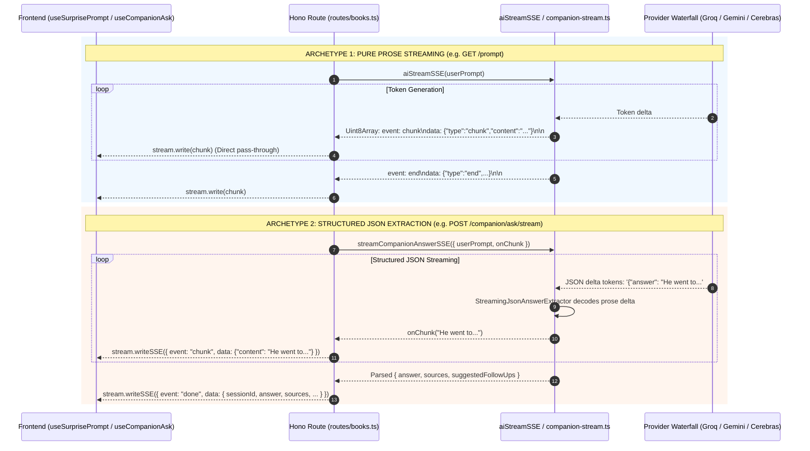

# Twistloom - Server-Sent Events (SSE) Streaming Architecture & Developer Guide

**Scope:** Master architectural blueprint, protocol specifications, shared utility functions, implementation recipes, and anti-pattern prevention for all real-time Server-Sent Events (SSE) streaming across the Twistloom backend.  
**Target Audience:** Backend engineers implementing or refactoring AI streaming, progress tracking, or cached stream replay endpoints.  
**Companion docs:** [`AI_CHAT_STREAM_ARCHITECTURE.md`](file:///d:/Projects/Twistloom/Twistloom-backend/docs/architecture/AI_CHAT_STREAM_ARCHITECTURE.md) / [`SPARK_SURPRISE_PROMPT_ARCHITECTURE.md`](file:///d:/Projects/Twistloom/Twistloom-web/docs/architecture/SPARK_SURPRISE_PROMPT_ARCHITECTURE.md) / [`READER_COMPANION_ARCHITECTURE.md`](file:///d:/Projects/Twistloom/Twistloom-web/docs/architecture/READER_COMPANION_ARCHITECTURE.md)

---

## Table of Contents

1. [Executive Summary & The 4 Streaming Archetypes](#1-executive-summary--the-4-streaming-archetypes)
2. [High-Level Architectural Flow](#2-high-level-architectural-flow)
3. [SSE Wire Protocol Specification](#3-sse-wire-protocol-specification)
4. [The Canonical Streaming Toolset (Helper Functions)](#4-the-canonical-streaming-toolset-helper-functions)
   - [4.1 `aiStreamSSE` — Multi-Provider Orchestrator](#41-aistreamsse--multi-provider-orchestrator)
   - [4.2 `pipeSSEStreamAndExtractText` — Live Piping & Text Extraction](#42-pipespestreamandextracttext--live-piping--text-extraction)
   - [4.3 `parseSSEStreamContent` — SSE Stream Decoder](#43-parsessestreamcontent--sse-stream-decoder)
   - [4.4 `streamCompanionAnswerSSE` & `StreamingJsonAnswerExtractor` — Live JSON Unwrapping](#44-streamcompanionanswersse--streamingjsonanswerextractor--live-json-unwrapping)
   - [4.5 `streamCachedPrompt` — Adaptive Typing Replay](#45-streamcachedprompt--adaptive-typing-replay)
5. [Critical Anti-Patterns & Past Pitfalls (DO NOT REPEAT)](#5-critical-anti-patterns--past-pitfalls-do-not-repeat)
   - [Pitfall 1: The Raw Uint8Array TextDecoder Concatenation Trap](#pitfall-1-the-raw-uint8array-textdecoder-concatenation-trap)
   - [Pitfall 2: Double SSE Protocol Wrapping on Cache Hits](#pitfall-2-double-sse-protocol-wrapping-on-cache-hits)
   - [Pitfall 3: Raw JSON Syntax Leaking into Chat Bubbles](#pitfall-3-raw-json-syntax-leaking-into-chat-bubbles)
    - [Pitfall 4: Orphaned Provider Streams from Missing AbortSignal](#pitfall-4-orphaned-provider-streams-from-missing-abortsignal)
    - [Pitfall 5: Manual Wire Formatting Instead of `stream.writeSSE`](#pitfall-5-manual-wire-formatting-instead-of-streamwritesse)
    - [Pitfall 8: Silent Truncation of Provider Streams](#pitfall-8-silent-truncation-of-provider-streams)
6. [Standard Implementation Recipes](#6-standard-implementation-recipes)
   - [Recipe 1: Pure Prose Text Stream (`GET /prompt`)](#recipe-1-pure-prose-text-stream-get-prompt)
   - [Recipe 2: Credit-Gated Structured JSON Stream (`POST .../companion/ask/stream`)](#recipe-2-credit-gated-structured-json-stream-post-companionaskstream)
   - [Recipe 3: Adaptive Cached Stream Replay](#recipe-3-adaptive-cached-stream-replay)
7. [File Reference Map](#7-file-reference-map)

---

## 1. Executive Summary & The 4 Streaming Archetypes

Real-time streaming in Twistloom delivers immediate feedback (Time-To-First-Token < 300ms) rather than forcing users to stare at static loaders. Across the backend, all SSE streaming endpoints belong to one of **4 distinct streaming archetypes**:

```
                                  TWISTLOOM SSE STREAMING TAXONOMY
                                                 │
         ┌────────────────────────┬──────────────┴───────────────┬────────────────────────┐
         │                        │                              │                        │
    Archetype 1              Archetype 2                    Archetype 3              Archetype 4
  Pure Prose Text          Structured JSON                Adaptive Cached           Long-Running
     Streaming           Delta Extraction                Typing Replay            Task Progress
         │                        │                              │                        │
  • /api/books/prompt      • /companion/ask/stream        • prompt_cache replay   • /custom-actions/preview
  • aiStreamSSE            • StreamingJsonAnswerExtractor • streamCachedPrompt    • step_start / complete
  • event: chunk           • event: chunk (prose)         • 3-stage velocity      • poll / trigger
                           • event: done (JSON)
```

| Archetype | Typical Endpoints | Input Prompt | Stream Output | Core Engine |
|---|---|---|---|---|
| **1. Pure Prose Text** | `GET /api/books/prompt` | Unstructured creative prompt | Plain text narrative tokens | `aiStreamSSE` + `pipeSSEStreamAndExtractText` |
| **2. Structured JSON Extraction** | `POST /api/books/:id/:pageId/companion/ask/stream` | Multi-turn Q&A + JSON schema | Prose tokens live on `chunk`, full JSON on `done` | `streamCompanionAnswerSSE` (`StreamingJsonAnswerExtractor`) |
| **3. Adaptive Cached Replay** | Cached `GET /api/books/prompt` | None (reads DB `prompt_cache`) | Simulated human typing tokens | `streamCachedPrompt` |
| **4. Long-Running Task Progress** | `POST /api/books/stream`, `/candidates` | DB / Generation IDs | Step-by-step progress events | Hono `streamSSE` + progress polling |

---

## 2. High-Level Architectural Flow

### A. Pure Prose vs. Structured JSON Streaming Comparison



---

## 3. SSE Wire Protocol Specification

Every SSE stream from Twistloom conforms to the W3C Server-Sent Events standard over HTTP/1.1 or HTTP/2.

### 3.1 Standard Response Headers
```http
HTTP/1.1 200 OK
Content-Type: text/event-stream; charset=utf-8
Cache-Control: no-cache, no-transform
Connection: keep-alive
X-Accel-Buffering: no
```

### 3.2 Event Types & Payloads

#### 1. `event: start`
Emitted at the onset of AI provider connection:
```text
event: start
data: {"type":"start","provider":"gemini","model":"gemini-2.5-flash"}

```

#### 2. `event: chunk`
Emitted for every generated prose text chunk:
```text
event: chunk
data: {"type":"chunk","content":"In the shadowy corridors of the manor,","done":false}

```

#### 3. `event: done` (Structured Completion)
Emitted by structured extraction streams (Companion Q&A) carrying full metadata:
```text
event: done
data: {"sessionId":"01918a3b-...","answer":"In the shadowy corridors...","sources":["Page 4: Event"],"suggestedFollowUps":["Why did he enter?"],"cached":false}

```

#### 4. `event: end` (Provider Stream End)
Emitted by raw text streams when generation finishes:
```text
event: end
data: {"type":"end","provider":"gemini","model":"gemini-2.5-flash"}

```

#### 5. `event: error`
Emitted upon unrecoverable runtime/provider errors **and** as a recoverable signal when `aiStreamSSE` falls back to the next model/provider after a truncated or failed stream. Clients must ignore recoverable fallback errors (or only treat a *trailing* one as terminal) and must NOT abort the stream on the first `error` event.
```text
event: error
data: {"type":"error","message":"Model gemini-2.5-flash returned truncated output"}

```

---

## 4. The Canonical Streaming Toolset (Helper Functions)

All SSE streaming must use these established, tested utilities located in [`src/utils/`](file:///d:/Projects/Twistloom/Twistloom-backend/src/utils/):

### 4.1 `aiStreamSSE` — Multi-Provider Orchestrator
**Location:** [`Twistloom-backend/src/utils/ai-chat-stream.ts`](file:///d:/Projects/Twistloom/Twistloom-backend/src/utils/ai-chat-stream.ts)

Orchestrates automatic fallback across 7 AI providers (Cerebras $\to$ Groq $\to$ Gemini $\to$ Mistral $\to$ Cohere $\to$ GitHub $\to$ NVIDIA) and yields a `ReadableStream<Uint8Array>` of pre-formatted SSE byte chunks.

```typescript
const { stream, provider } = await aiStreamSSE(
  userPrompt,
  {
    modelSelection: AI_CHAT_MODELS_THEME,
    systemPrompt: "You are a thriller author...",
  },
  c.req.raw.signal // Always pass the request AbortSignal!
);
```

> [!IMPORTANT]
> **Stream Output Format**: `aiStreamSSE` yields raw binary bytes representing **SSE wire protocol lines**. It does NOT yield raw plain text strings.

> [!WARNING]
> **Completeness Validation (anti-truncation):** A provider stream that ends with a clean `done` is **not** automatically accepted as success. A truncated response, a silent connection reset, or a mid-stream drop can all surface as a normal `done`, after which the partial output would reach the client UI (and, for `GET /prompt`, get cached as a "good" prompt). `aiStreamSSE` therefore validates the full accumulated output before declaring `providerSucceeded = true`. Two guards are available, and either can be supplied per call:
> - `minOutputLength` (number) — raw character floor; ideal for **prose** streams (e.g. `generateBookCreationPromptStream` uses `BOOK_CREATION_PROMPT_MIN_CHARS = 120`).
> - `validateOutput(fullText)` (callback) — caller-supplied semantic check; ideal for **JSON** streams (e.g. `streamCompanionAnswerSSE` rejects any output that does not parse to a `CompanionResult` with a non-empty `answer`).
>
> When the guard fails, `aiStreamSSE` emits an `error` event and **falls through to the next model/provider** instead of shipping the partial content. This is the single, DRY chokepoint that protects **every** `aiStreamSSE` consumer (prompt + companion) from truncation — do not re-implement length/parse checks in individual routes.

---

### 4.2 `pipeSSEStreamAndExtractText` — Live Piping & Text Extraction
**Location:** [`Twistloom-backend/src/utils/ai-chat-stream.ts`](file:///d:/Projects/Twistloom/Twistloom-backend/src/utils/ai-chat-stream.ts)

Pipes binary SSE chunks from `aiStreamSSE` to the open client HTTP response in real time while simultaneously extracting, decoding, and accumulating the clean prose text from `data.content`.

**Chunk Boundary Resilience (Line Buffering):**
TCP / streaming chunks are not guaranteed to align with complete SSE lines (e.g. `data: {"ty` in chunk $N$ and `pe":"chunk","content":"..."}\n\n` in chunk $N+1$). `pipeSSEStreamAndExtractText` maintains an internal `lineBuffer` across reads, preserving partial trailing lines until the closing newline arrives.

```typescript
// Twistloom-backend/src/routes/books.ts (GET /prompt)
promptContent = await pipeSSEStreamAndExtractText(
  aiStream, 
  (chunk) => stream.write(chunk)
);

// promptContent is guaranteed to be clean plain text, ready for database caching!
await savePromptToCache({ content: promptContent, userId, language });
```

---

### 4.3 `parseSSEStreamContent` — SSE Stream Decoder
**Location:** [`Twistloom-backend/src/utils/ai-chat-stream.ts`](file:///d:/Projects/Twistloom/Twistloom-backend/src/utils/ai-chat-stream.ts)

Consumes an SSE stream and decodes all `data.content` fields into a single concatenated text string when live client piping is not required. Utilizes chunk-boundary line buffering to ensure 100% parse safety against fragmented stream packets.

```typescript
const fullText = await parseSSEStreamContent(stream);
```

---

### 4.4 `streamCompanionAnswerSSE` & `StreamingJsonAnswerExtractor` — Live JSON Unwrapping
**Location:** [`Twistloom-backend/src/utils/companion-stream.ts`](file:///d:/Projects/Twistloom/Twistloom-backend/src/utils/companion-stream.ts)

When models are instructed to output structured JSON (`outputJsonStructure`), the model streams raw JSON syntax (e.g. `{"answer": "He escaped...`). The `StreamingJsonAnswerExtractor` state machine intercepts the JSON tokens in flight, cleanly unwraps and decodes the `"answer"` string, and emits clean prose tokens to `onChunk(delta)` without ever leaking `{`, `"`, or JSON syntax to the reader.

**$O(N)$ Single-Pass Cursor Processing:**
To prevent CPU-intensive $O(N^2)$ buffer re-scanning during real-time streaming, `StreamingJsonAnswerExtractor` maintains an incremental character `cursor`. As each new delta chunk arrives, only new characters between `cursor` and `buffer.length` are scanned and decoded—visiting each character in the stream exactly once.

```typescript
const { result, aiUsed } = await streamCompanionAnswerSSE({
  userPrompt,
  signal: c.req.raw.signal,
  onChunk: async (cleanChunk) => {
    // Sends clean prose words to chat bubble live
    await stream.writeSSE({
      event: "chunk",
      data: JSON.stringify({ content: cleanChunk }),
    });
  },
});

// result is fully typed: { answer: string, sources: string[], suggestedFollowUps: string[] }
```

---

### 4.5 `streamCachedPrompt` — Adaptive Typing Replay
**Location:** [`Twistloom-backend/src/utils/prompt-stream.ts`](file:///d:/Projects/Twistloom/Twistloom-backend/src/utils/prompt-stream.ts)

Replays cached prompts with an organic, 3-stage human typing velocity formula:
1. **First 10% (Thinking / Hesitation)**: Chunk size: 5 chars, Delay: 40ms
2. **Middle 70% (Flow State)**: Chunk size: 15 chars, Delay: 20ms
3. **Final 20% (Finishing Touches)**: Chunk size: 8 chars, Delay: 30ms

```typescript
const cacheStream = await streamCachedPrompt(cachedPromptContent);
for await (const chunk of cacheStream) {
  await stream.write(chunk);
}
```

---

## 5. Critical Anti-Patterns & Past Pitfalls (DO NOT REPEAT)

| ❌ Anti-Pattern | ✅ Correct Implementation |
| :--- | :--- |
| **Concatenating raw `Uint8Array` and `TextDecoding`** the buffer for DB caching (captures raw SSE wire protocol lines). | Use [`pipeSSEStreamAndExtractText`](file:///d:/Projects/Twistloom/Twistloom-backend/src/utils/ai-chat-stream.ts) to extract pure `data.content` text in real-time. |
| **Double-wrapping cached prompts with SSE lines** because DB stored raw wire envelopes. | Ensure DB cache stores plain prose; replay via [`streamCachedPrompt`](file:///d:/Projects/Twistloom/Twistloom-backend/src/utils/prompt-stream.ts) cleanly. |
| **Streaming raw structured JSON tokens directly** to user chat bubbles (shows raw JSON brackets `{`, `"`). | Use [`StreamingJsonAnswerExtractor`](file:///d:/Projects/Twistloom/Twistloom-backend/src/utils/companion-stream.ts) to unwrap the `"answer"` property in flight. |
| **Forgetting to pass `c.req.raw.signal` to AI** streaming calls (orphans expensive upstream AI compute on client abort). | Always propagate `signal` so client aborts stop upstream AI provider streams immediately. |
| **Manual `stream.write(encoder.encode("event.."))`** for errors, risking malformed line breaks. | Use Hono's typed helper: `await stream.writeSSE({ event, data })`. |
| **Quadratic $\mathcal{O}(N^2)$ buffer re-scanning** in incremental streaming extractors. | Maintain an incremental `cursor` pointer in [`StreamingJsonAnswerExtractor`](file:///d:/Projects/Twistloom/Twistloom-backend/src/utils/companion-stream.ts) to achieve strict $\mathcal{O}(N)$ single-pass extraction. |
| **Parsing unbuffered SSE chunks without trailing line retention** on TCP packet boundaries. | Buffer incomplete lines across chunks in [`parseSSEStreamContent`](file:///d:/Projects/Twistloom/Twistloom-backend/src/utils/ai-chat-stream.ts) to prevent JSON parse exceptions on split lines. |
| **Silently accepting a truncated provider stream as success** (content cut mid-word, or JSON missing its closing brace) because the generator returned a clean `done`. | Protect every `aiStreamSSE` call with `minOutputLength` (prose) or `validateOutput` (JSON). The orchestrator retries the next model/provider on failure — never ship partial content, and never cache it. |

### Pitfall 1: The Raw Uint8Array TextDecoder Concatenation Trap
- **The Bug**: `aiStreamSSE` yields `Uint8Array` bytes containing `event: chunk\ndata: {"type":"chunk","content":"..."}\n\n`. If you concatenate these chunks into a single `Uint8Array` and decode with `TextDecoder`, you store the **entire raw wire protocol text** in your database cache.
- **The Fix**: Use [`pipeSSEStreamAndExtractText`](file:///d:/Projects/Twistloom/Twistloom-backend/src/utils/ai-chat-stream.ts) to parse JSON `data.content` while streaming.

### Pitfall 2: Double SSE Protocol Wrapping on Cache Hits
- **The Bug**: When a prompt cached with raw SSE envelopes is passed to `streamCachedPrompt(content)`, `streamCachedPrompt` wraps each slice inside another `event: chunk\ndata: ...`, corrupting the client's output with nested metadata strings.
- **The Fix**: Ensure the cache layer strictly stores pure strings without protocol tags.

### Pitfall 3: Raw JSON Syntax Leaking into Chat Bubbles
- **The Bug**: Piping JSON-structured AI models (`outputJsonStructure`) directly to the client causes the user to see `{"answer": "` typed on their screen before the text appears.
- **The Fix**: Use [`streamCompanionAnswerSSE`](file:///d:/Projects/Twistloom/Twistloom-backend/src/utils/companion-stream.ts) to extract prose characters live via state-machine parsing.

### Pitfall 4: Orphaned Provider Streams from Missing AbortSignal
- **The Bug**: Omitting `signal: c.req.raw.signal` leaves the upstream LLM connection streaming tokens indefinitely on the provider side even after the user cancels or closes the browser tab.
- **The Fix**: Always pass `signal: c.req.raw.signal` into any streaming call.

### Pitfall 5: Manual Wire Formatting Instead of `stream.writeSSE`
- **The Bug**: Hand-crafting string templates (`stream.write(new TextEncoder().encode(...))`) easily leads to missing `\n\n` delimiters or improper JSON escaping on special characters.
- **The Fix**: Use `await stream.writeSSE({ event, data })` from Hono's `streamSSE`.

### Pitfall 6: Quadratic Buffer Re-scanning in Streaming Extractors
- **The Bug**: Re-slicing and re-parsing the entire accumulated string buffer from character 0 on every incoming token delta causes CPU complexity to explode to $O(N^2)$, exhausting serverless CPU quotas during live streaming.
- **The Fix**: Use incremental cursor tracking (`this.cursor`) in [`StreamingJsonAnswerExtractor`](file:///d:/Projects/Twistloom/Twistloom-backend/src/utils/companion-stream.ts) to guarantee $O(N)$ single-pass processing.

### Pitfall 7: Parsing Unbuffered SSE Chunks across Packet Boundaries
- **The Bug**: Doing bare `chunkText.split('\n')` assumes TCP packets always break on newline boundaries. When a JSON line is sliced across two chunks, parsing immediately fails with a syntax error.
- **The Fix**: Maintain an internal `lineBuffer` across reads in [`parseSSEStreamContent`](file:///d:/Projects/Twistloom/Twistloom-backend/src/utils/ai-chat-stream.ts) and [`pipeSSEStreamAndExtractText`](file:///d:/Projects/Twistloom/Twistloom-backend/src/utils/ai-chat-stream.ts), only evaluating complete lines.

### Pitfall 8: Silent Truncation of Provider Streams

- **The Bug**: A streaming LLM call "succeeds" from the orchestrator's point of view whenever the underlying async generator returns `done`. But a truncated response, a silent connection reset, or a mid-stream drop can **all** surface as a clean `done` — the generator simply stops yielding. For the **pure-prose** path (`GET /api/books/prompt`) this yielded a theme cut off mid-word (e.g. `...Setting: The isolated town of Oakhaven,\nPrem`), which was then (a) shown to the user as the final result, and (b) persisted to the prompt cache as a "good" prompt and re-served to later users. For the **structured-JSON** path (`POST .../companion/ask/stream`) the same truncation left `StreamingJsonAnswerExtractor.finalize()` to fall back to the half-decoded `answerText`, shipping a partial Companion answer. In both cases no error was ever raised, so the failure was invisible.
- **Root Cause**: `aiStreamSSE` marked `providerSucceeded = true` purely on the generator's `done`, with no completeness check, and the route cached/returned whatever arrived.
- **The Fix (centralized, DRY)**: `aiStreamSSE` now validates the full accumulated output **before** declaring success. Two complementary guards, supplied per call:
  - `minOutputLength: number` — a raw character floor for **prose** streams. `generateBookCreationPromptStream` passes `BOOK_CREATION_PROMPT_MIN_CHARS` (120), a conservative floor well below a complete prompt that still catches mid-word cutoffs.
  - `validateOutput: (fullText) => boolean` — a caller-supplied semantic check for **JSON** streams. `streamCompanionAnswerSSE` passes a validator that `JSON.parse`s the output and requires a non-empty `answer`, so a truncated JSON is rejected rather than accepted.
  
  When a guard fails, `aiStreamSSE` emits an `error` event and **falls through to the next model/provider** (exactly like a connection failure) — the truncated content is never enqueued as a success `end` event and never reaches the client as final. Only when **all** providers fail does it emit `All providers failed`, which the client surfaces as a real error (see below).
- **Defense in depth (route + client)**:
  - **Route (`GET /prompt`)**: `savePromptToCache` is additionally gated on `promptContent.trim().length >= BOOK_CREATION_PROMPT_MIN_CHARS`, so a truncated prompt that somehow slips past the orchestrator is never persisted.
  - **Client (`fetchSSEContent` in `Twistloom-web/src/lib/utils/sse.ts`)**: tracks a clean `end`/`done` completion event. If the connection terminates **without** one, the stream is treated as truncated and throws (attaching `partialContent` to the error) instead of silently returning a partial result. Partial content streamed so far is preserved on the error object so callers can decide whether to surface it.
- **Guidance — never regress this**:
  1. **Every `aiStreamSSE` caller MUST pass `minOutputLength` or `validateOutput`.** If you add a new streaming endpoint, choose the guard that matches your output shape. Do not invent per-route length checks — the orchestrator is the single chokepoint.
  2. **Never cache/store streamed AI output without a completeness gate.** If the content came from `aiStreamSSE`, the orchestrator already guaranteed completeness; for any other source, validate before persisting.
  3. **The client must gate on a completion event, not on stream-close.** A reader that returns content on `reader.done` without verifying an `end`/`done` event will silently accept truncated streams.
  4. **Keep `error` events non-fatal for fallbacks.** `aiStreamSSE` reuses the `error` event for recoverable per-model fallback; clients must ignore it (or treat a trailing one as terminal) rather than aborting mid-stream.

---

## 6. Standard Implementation Recipes

### Recipe 1: Pure Prose Text Stream (`GET /prompt`)

```typescript
// Standard Pure Prose Streaming Endpoint
router.get("/prompt", optionalAuth, async (c) => {
  return streamSSE(c, async (stream) => {
    try {
      const userId = c.get("userId") || null;
      const { stream: aiStream, provider } = await generateBookCreationPromptStream({
        signal: c.req.raw.signal,
        language: c.req.query("language") || "en",
        // aiStreamSSE is internally guarded by BOOK_CREATION_PROMPT_MIN_CHARS (120):
        // a stream ending too short is retried on the next model/provider.
      });

      // 1. Pipe tokens live to browser while extracting clean text
      const cleanText = await pipeSSEStreamAndExtractText(aiStream, (chunk) => stream.write(chunk));

      // 2. Persist pristine text to cache — ONLY if complete (defense-in-depth guard
      //    against a truncated prompt slipping past the orchestrator). Never cache partial.
      if (cleanText && cleanText.trim().length >= BOOK_CREATION_PROMPT_MIN_CHARS) {
        await savePromptToCache({ content: cleanText, userId });
      }
    } catch (error) {
      const message = getErrorMessage(error, "Failed to stream prompt");
      await stream.writeSSE({
        event: "error",
        data: JSON.stringify({ message }),
      });
    }
  });
});
```

> [!NOTE]
> The client side mirrors the guard: `fetchSSEContent` only accepts the result if a clean `end`/`done` event was received; otherwise it throws (with `partialContent` attached) so a truncated connection is never silently shown as the final prompt.

---

### Recipe 2: Credit-Gated Structured JSON Stream (`POST .../companion/ask/stream`)

```typescript
// Standard Credit-Gated Structured Q&A Stream
router.post("/:identifier/:pageId/companion/ask/stream", requireAuth, async (c) => {
  const userId = c.get("userId")!;
  const { pageId } = c.req.param();
  const { question } = await c.req.json();

  return streamSSE(c, async (stream) => {
    try {
      // Execute atomically within credit gate
      const { result } = await executeWithCredits(
        userId,
        "COMPANION_ASK",
        async () => {
          const { result: companionResult } = await streamCompanionAnswerSSE({
            userPrompt: buildPrompt(question),
            signal: c.req.raw.signal,
            // aiStreamSSE is internally guarded by validateOutput: the streamed JSON
            // must parse to a CompanionResult with a non-empty `answer`, or the
            // next model/provider is tried. A truncated answer can never reach here.
            onChunk: async (proseChunk) => {
              // Stream prose tokens live without raw JSON brackets
              await stream.writeSSE({
                event: "chunk",
                data: JSON.stringify({ content: proseChunk }),
              });
            },
          });
          return companionResult;
        },
        { context: "companion_ask", metadata: { pageId } }
      );

      const { answer, sources, suggestedFollowUps } = result;

      // Persist turn and invalidate suggestions cache
      await dbWrite.insert(companionAnswers).values({ ... });
      await invalidateSuggestionsCache(bookId, pageId);

      // Emit complete structured payload
      await stream.writeSSE({
        event: "done",
        data: JSON.stringify({ answer, sources, suggestedFollowUps, cached: false }),
      });
    } catch (streamErr) {
      const message = getErrorMessage(streamErr);
      await stream.writeSSE({
        event: "error",
        data: JSON.stringify({ message }),
      });
    }
  });
});
```

> [!NOTE]
> Because the orchestrator rejects truncated JSON before `streamCompanionAnswerSSE` returns, `result.answer` here is guaranteed complete — no separate truncation check is needed at the route level.

---

### Recipe 3: Adaptive Cached Stream Replay

```typescript
// Replaying Cached Content with Human Typing Cadence
const cached = await getCachedContent();
if (cached) {
  const cacheStream = await streamCachedPrompt(cached.content);
  for await (const chunk of cacheStream) {
    await stream.write(chunk);
  }
  return;
}
```

---

## 7. File Reference Map

| Component / Layer | File Path | Primary Responsibility |
|---|---|---|
| **Multi-Provider SSE Engine** | [`Twistloom-backend/src/utils/ai-chat-stream.ts`](file:///d:/Projects/Twistloom/Twistloom-backend/src/utils/ai-chat-stream.ts) | Core `aiStreamSSE`, `pipeSSEStreamAndExtractText`, and `parseSSEStreamContent` |
| **Structured JSON SSE Stream** | [`Twistloom-backend/src/utils/companion-stream.ts`](file:///d:/Projects/Twistloom/Twistloom-backend/src/utils/companion-stream.ts) | `streamCompanionAnswerSSE` & `StreamingJsonAnswerExtractor` |
| **Cached Stream Replay** | [`Twistloom-backend/src/utils/prompt-stream.ts`](file:///d:/Projects/Twistloom/Twistloom-backend/src/utils/prompt-stream.ts) | `streamCachedPrompt` with 3-stage adaptive typing velocity |
| **SSE Route Implementations** | [`Twistloom-backend/src/routes/books.ts`](file:///d:/Projects/Twistloom/Twistloom-backend/src/routes/books.ts) | Spark prompt streaming & Companion Ask streaming route handlers |
| **Credit Transaction Gate** | [`Twistloom-backend/src/services/credits.ts`](file:///d:/Projects/Twistloom/Twistloom-backend/src/services/credits.ts) | `executeWithCredits` transactional deduction & rollback |
| **Frontend SSE Stream Engine** | [`Twistloom-web/src/lib/utils/sse.ts`](file:///d:/Projects/Twistloom/Twistloom-web/src/lib/utils/sse.ts) | Client-side `fetchSSEStream` & `fetchSSEContent` stream parsers |
