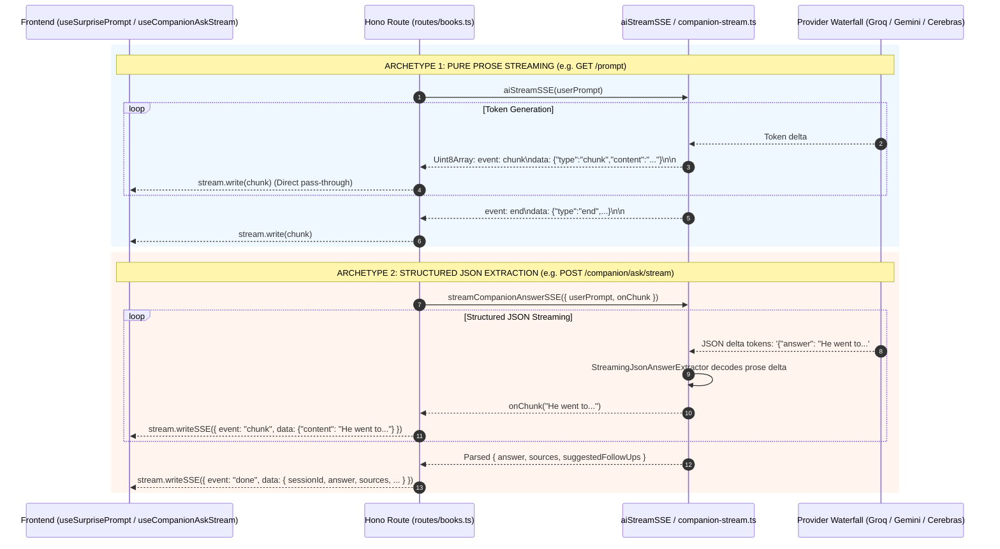

# Twistloom - Server-Sent Events (SSE) Streaming Architecture & Developer Guide

**Scope:** Master architectural blueprint, protocol specifications, shared utility functions, implementation recipes, and anti-pattern prevention for all real-time Server-Sent Events (SSE) streaming across the Twistloom backend.  
**Target Audience:** Backend engineers implementing or refactoring AI streaming, progress tracking, or cached stream replay endpoints.  
**Companion docs:** [`AI_CHAT_STREAM_ARCHITECTURE.md`](file:///d:/Projects/Twistloom/Twistloom-backend/docs/architecture/AI_CHAT_STREAM_ARCHITECTURE.md) / [`SPARK_SURPRISE_PROMPT_ARCHITECTURE.md`](file:///d:/Projects/Twistloom/Twistloom-web/docs/architecture/SPARK_SURPRISE_PROMPT_ARCHITECTURE.md) / [`READER_COMPANION_ARCHITECTURE.md`](file:///d:/Projects/Twistloom/Twistloom-web/docs/architecture/READER_COMPANION_ARCHITECTURE.md)

---

## Table of Contents

1. [Executive Summary & The 4 Streaming Archetypes](#1-executive-summary--the-4-streaming-archetypes)
2. [High-Level Architectural Flow](#2-high-level-architectural-flow)
3. [SSE Wire Protocol Specification](#3-sse-wire-protocol-specification)
4. [The Canonical Streaming Toolset (Helper Functions)](#4-the-canonical-streaming-toolset-helper-functions)
   - [4.1 `aiStreamSSE` — Multi-Provider Orchestrator](#41-aistreamsse--multi-provider-orchestrator)
   - [4.2 `pipeSSEStreamAndExtractText` — Live Piping & Text Extraction](#42-pipespestreamandextracttext--live-piping--text-extraction)
   - [4.3 `parseSSEStreamContent` — SSE Stream Decoder](#43-parsessestreamcontent--sse-stream-decoder)
    - [4.4 `streamCompanionAnswerSSE` & `StreamingJsonAnswerExtractor` — Live JSON Unwrapping](#44-streamcompanionanswersse--streamingjsonanswerextractor--live-json-unwrapping)
    - [4.5 `streamCachedPrompt` — Adaptive Typing Replay](#45-streamcachedprompt--adaptive-typing-replay)
     - [4.6 Shared SSE Internals — `extractSseText` & `createStreamUsageBuilder`](#46-shared-sse-internals--extractssetext--createstreamusagebuilder)
     - [4.7 Client-Side SSE Consumption Contracts](#47-client-side-sse-consumption-contracts)
5. [Critical Anti-Patterns & Past Pitfalls (DO NOT REPEAT)](#5-critical-anti-patterns--past-pitfalls-do-not-repeat)
   - [Pitfall 1: The Raw Uint8Array TextDecoder Concatenation Trap](#pitfall-1-the-raw-uint8array-textdecoder-concatenation-trap)
   - [Pitfall 2: Double SSE Protocol Wrapping on Cache Hits](#pitfall-2-double-sse-protocol-wrapping-on-cache-hits)
   - [Pitfall 3: Raw JSON Syntax Leaking into Chat Bubbles](#pitfall-3-raw-json-syntax-leaking-into-chat-bubbles)
    - [Pitfall 4: Orphaned Provider Streams from Missing AbortSignal](#pitfall-4-orphaned-provider-streams-from-missing-abortsignal)
    - [Pitfall 5: Manual Wire Formatting Instead of `stream.writeSSE`](#pitfall-5-manual-wire-formatting-instead-of-streamwritesse)
     - [Pitfall 8: Silent Truncation of Provider Streams](#pitfall-8-silent-truncation-of-provider-streams)
     - [Pitfall 9: Mixing the OpenAI `data: [DONE]` Sentinel into Twistloom Parsers](#pitfall-9-mixing-the-openai-data-done-sentinel-into-twistloom-parsers)
6. [Standard Implementation Recipes](#6-standard-implementation-recipes)
   - [Recipe 1: Pure Prose Text Stream (`GET /prompt`)](#recipe-1-pure-prose-text-stream-get-prompt)
   - [Recipe 2: Credit-Gated Structured JSON Stream (`POST .../companion/ask/stream`)](#recipe-2-credit-gated-structured-json-stream-post-companionaskstream)
   - [Recipe 3: Adaptive Cached Stream Replay](#recipe-3-adaptive-cached-stream-replay)
7. [File Reference Map](#7-file-reference-map)

---

## 1. Executive Summary & The 4 Streaming Archetypes

Real-time streaming in Twistloom delivers immediate feedback (Time-To-First-Token < 300ms) rather than forcing users to stare at static loaders. Across the backend, all SSE streaming endpoints belong to one of **4 distinct streaming archetypes**:

```
                                  TWISTLOOM SSE STREAMING TAXONOMY
                                                 │
         ┌────────────────────────┬──────────────┴───────────────┬────────────────────────┐
         │                        │                              │                        │
    Archetype 1              Archetype 2                    Archetype 3              Archetype 4
  Pure Prose Text          Structured JSON                Adaptive Cached           Long-Running
     Streaming           Delta Extraction                Typing Replay            Task Progress
         │                        │                              │                        │
  • /api/books/prompt      • /companion/ask/stream        • prompt_cache replay   • /custom-actions/preview
  • aiStreamSSE            • StreamingJsonAnswerExtractor • streamCachedPrompt    • step_start / complete
  • event: chunk           • event: chunk (prose)         • 3-stage velocity      • poll / trigger
                           • event: done (JSON)
```

| Archetype | Typical Endpoints | Input Prompt | Stream Output | Core Engine |
|---|---|---|---|---|
| **1. Pure Prose Text** | `GET /api/books/prompt` | Unstructured creative prompt | Plain text narrative tokens | `aiStreamSSE` + `pipeSSEStreamAndExtractText` |
| **2. Structured JSON Extraction** | `POST /api/books/:id/:pageId/companion/ask/stream` | Multi-turn Q&A + JSON schema | Prose tokens live on `chunk`, full JSON on `done` | `streamCompanionAnswerSSE` (`StreamingJsonAnswerExtractor`) |
| **3. Adaptive Cached Replay** | Cached `GET /api/books/prompt` | None (reads DB `prompt_cache`) | Simulated human typing tokens | `streamCachedPrompt` |
| **4. Long-Running Task Progress** | `POST /api/books/stream`, `/candidates` | DB / Generation IDs | Step-by-step progress events | Hono `streamSSE` + progress polling |

---

## 2. High-Level Architectural Flow

### A. Pure Prose vs. Structured JSON Streaming Comparison



---

## 3. SSE Wire Protocol Specification

Every SSE stream from Twistloom conforms to the W3C Server-Sent Events standard over HTTP/1.1 or HTTP/2.

### 3.1 Standard Response Headers
```http
HTTP/1.1 200 OK
Content-Type: text/event-stream; charset=utf-8
Cache-Control: no-cache, no-transform
Connection: keep-alive
X-Accel-Buffering: no
```

### 3.2 Event Types & Payloads

#### 1. `event: start`
Emitted at the onset of AI provider connection:
```text
event: start
data: {"type":"start","provider":"gemini","model":"gemini-2.5-flash"}

```

#### 2. `event: chunk`
Emitted for every generated prose text chunk:
```text
event: chunk
data: {"type":"chunk","content":"In the shadowy corridors of the manor,","done":false}

```

#### 3. `event: done` (Structured Completion)
Emitted by structured extraction streams (Companion Q&A) carrying full metadata:
```text
event: done
data: {"sessionId":"01918a3b-...","answer":"In the shadowy corridors...","sources":["Page 4: Event"],"suggestedFollowUps":["Why did he enter?"],"cached":false,"creditsRemaining":87}

```

#### 4. `event: end` (Provider Stream End)
Emitted by raw text streams when generation finishes:
```text
event: end
data: {"type":"end","provider":"gemini","model":"gemini-2.5-flash"}

```

#### 5. `event: error` (terminal failure)
Emitted **only** for unrecoverable, end-of-stream failures — e.g. the global catch in a route handler, *or* the orchestrator's final `All providers failed` after every candidate is exhausted. A `event: error` is **always terminal**: no further `chunk` frames follow, and no `end`/`done` event will arrive. Clients must treat a stream that ends on `event: error` (without a preceding completion event) as a failed generation and surface the attached `message`.
```text
event: error
data: {"type":"error","message":"All providers failed"}
```

#### 6. `event: provider_error` (non-terminal fallback — recoverable)
Emitted by `aiStreamSSE` when a single model/provider attempt fails or is rejected by a completeness guard (truncated output, `finishReason: "unknown"`, mid-stream drop) and the orchestrator **falls back to the next candidate**. This is a *recoverable* signal: the failed provider may have already streamed partial `chunk` frames, so clients MUST discard any partial text accumulated so far and **keep reading** — the next provider re-streams the full output from scratch. A `provider_error` is never terminal; a successful fallback concludes with a normal `event: end`/`event: done`.

Separating `provider_error` (recoverable) from `error` (terminal) is deliberate: it lets clients safely abort on `error` while treating `provider_error` as a transparent, self-healing retry that must not blank or reject the in-progress UI. (Historically a single `error` event served both roles, which forced every SSE client to special-case "ignore the first error" — fragile and easy to regress.)
```text
event: provider_error
data: {"type":"provider_error","message":"Model gemini-2.5-flash returned truncated output"}
```

---

## 4. The Canonical Streaming Toolset (Helper Functions)

All SSE streaming must use these established, tested utilities located in [`src/utils/`](file:///d:/Projects/Twistloom/Twistloom-backend/src/utils/):

### 4.1 `aiStreamSSE` — Multi-Provider Orchestrator
**Location:** [`Twistloom-backend/src/utils/ai-chat-stream.ts`](file:///d:/Projects/Twistloom/Twistloom-backend/src/utils/ai-chat-stream.ts)

Orchestrates automatic fallback across all providers configured in the `modelSelection` waterfall (currently 18+ providers — the OpenAI-compatible factory plus native Gemini / Cohere / Mistral / NVIDIA integrations) and yields a `ReadableStream<Uint8Array>` of pre-formatted SSE byte chunks.

```typescript
const { stream, provider } = await aiStreamSSE(
  userPrompt,
  {
    modelSelection: AI_CHAT_MODELS_THEME,
    systemPrompt: "You are a thriller author...",
  },
  c.req.raw.signal // Always pass the request AbortSignal!
);
```

> [!IMPORTANT]
> **Stream Output Format**: `aiStreamSSE` yields raw binary bytes representing **SSE wire protocol lines**. It does NOT yield raw plain text strings.

> [!WARNING]
> **Completeness Validation (anti-truncation):** A provider stream that ends with a clean `done` is **not** automatically accepted as success. A truncated response, a silent connection reset, or a mid-stream drop can all surface as a normal `done`, after which the partial output would reach the client UI (and, for `GET /prompt`, get cached as a "good" prompt). `aiStreamSSE` therefore validates the stream **before** declaring `providerSucceeded = true`, using three layered guards checked in order:
> 1. **`finishReason` (PRIMARY — provider-attested).** Every generator now captures the provider's own stop signal (`stop`, `length`, `content_filter`, `unknown`, …) and surfaces it on `StreamUsage.finishReason`. The orchestrator rejects the result unless the reason is an explicit completion (`stop`, `complete`, `stop_sequence`, `end_turn`, `finished`, … — compared case-insensitively because Gemini reports `STOP`). Anything else — including `unknown`, which is exactly what production Vercel logs showed on the broken `/prompt` responses — means the stream did **not** finish cleanly, so the partial output is never shipped. This is the strongest, most reliable guard because it is the provider's own assertion that generation actually completed.
> 2. **`minOutputLength` (number)** — raw character floor; ideal for **prose** streams (e.g. `generateBookCreationPromptStream` uses `BOOK_CREATION_PROMPT_MIN_CHARS = 120`). A coarse secondary defense for generators that don't surface a `finishReason`.
> 3. **`validateOutput(fullText)` (callback)** — caller-supplied semantic check; ideal for **JSON** streams (e.g. `streamCompanionAnswerSSE` rejects any output that does not parse to a `CompanionResult` with a non-empty `answer`).
>
> When **any** guard fails, `aiStreamSSE` emits a **`provider_error`** event (non-terminal) and **falls through to the next model/provider** instead of shipping the partial content. This is the single, DRY chokepoint that protects **every** `aiStreamSSE` consumer (prompt + companion) from truncation — do not re-implement length/parse checks in individual routes.

> [!NOTE]
> **DRY chokepoint for `finishReason` / `usage`.** Every streaming generator accumulates its `usage` + `finishReason` through the single `createStreamUsageBuilder()` helper (in `ai-chat-stream.ts`), and the orchestrator reads `usage.finishReason` from the result. Adding a new provider therefore requires **only** wiring its stop-reason into `setFinishReason(...)` — the completeness check, the `FINISH_REASONS_COMPLETE` whitelist, and the fallback behavior all live in one place (see §4.6.2). Do not hand-roll `usage`/`finishReason` merging in a new generator.

---

### 4.2 `pipeSSEStreamAndExtractText` — Live Piping & Text Extraction
**Location:** [`Twistloom-backend/src/utils/ai-chat-stream.ts`](file:///d:/Projects/Twistloom/Twistloom-backend/src/utils/ai-chat-stream.ts)

Pipes binary SSE chunks from `aiStreamSSE` to the open client HTTP response in real time while simultaneously extracting, decoding, and accumulating the clean prose text from `data.content`. The decode/extract work is delegated to the shared `extractSseText` core (see §4.6.1), which it calls with an `onChunk` callback to forward bytes live and then `.trim()`s the result.

**Chunk Boundary Resilience (Line Buffering):**
TCP / streaming chunks are not guaranteed to align with complete SSE lines (e.g. `data: {"ty` in chunk $N$ and `pe":"chunk","content":"..."}\n\n` in chunk $N+1$). `pipeSSEStreamAndExtractText` maintains an internal `lineBuffer` across reads, preserving partial trailing lines until the closing newline arrives.

```typescript
// Twistloom-backend/src/routes/books.ts (GET /prompt)
promptContent = await pipeSSEStreamAndExtractText(
  aiStream, 
  (chunk) => stream.write(chunk)
);

// promptContent is guaranteed to be clean plain text, ready for database caching!
await savePromptToCache({ content: promptContent, userId, language });
```

---

### 4.3 `parseSSEStreamContent` — SSE Stream Decoder
**Location:** [`Twistloom-backend/src/utils/ai-chat-stream.ts`](file:///d:/Projects/Twistloom/Twistloom-backend/src/utils/ai-chat-stream.ts)

Consumes an SSE stream and decodes all `data.content` fields into a single concatenated text string when live client piping is not required. Like `pipeSSEStreamAndExtractText`, it is backed by the single `extractSseText(stream)` core (§4.6.1) — the two functions differ only in whether bytes are also forwarded live (`onChunk`) and whether the result is trimmed. Keeping the decoder in one place means frame-boundary and `data:`-parsing fixes apply everywhere.

```typescript
const fullText = await parseSSEStreamContent(stream);
```

---

### 4.4 `streamCompanionAnswerSSE` & `StreamingJsonAnswerExtractor` — Live JSON Unwrapping
**Location:** [`Twistloom-backend/src/utils/companion-stream.ts`](file:///d:/Projects/Twistloom/Twistloom-backend/src/utils/companion-stream.ts)

When models are instructed to output structured JSON (`outputJsonStructure`), the model streams raw JSON syntax (e.g. `{"answer": "He escaped...`). The `StreamingJsonAnswerExtractor` state machine intercepts the JSON tokens in flight, cleanly unwraps and decodes the `"answer"` string, and emits clean prose tokens to `onChunk(delta)` without ever leaking `{`, `"`, or JSON syntax to the reader.

**$O(N)$ Single-Pass Cursor Processing:**
To prevent CPU-intensive $O(N^2)$ buffer re-scanning during real-time streaming, `StreamingJsonAnswerExtractor` maintains an incremental character `cursor`. As each new delta chunk arrives, only new characters between `cursor` and `buffer.length` are scanned and decoded—visiting each character in the stream exactly once.

```typescript
const { result, aiUsed } = await streamCompanionAnswerSSE({
  userPrompt,
  signal: c.req.raw.signal,
  onChunk: async (cleanChunk) => {
    // Sends clean prose words to chat bubble live
    await stream.writeSSE({
      event: "chunk",
      data: JSON.stringify({ content: cleanChunk }),
    });
  },
});

// result is fully typed: { answer: string, sources: string[], suggestedFollowUps: string[] }
```

---

### 4.5 `streamCachedPrompt` — Adaptive Typing Replay
**Location:** [`Twistloom-backend/src/utils/prompt-stream.ts`](file:///d:/Projects/Twistloom/Twistloom-backend/src/utils/prompt-stream.ts)

Replays cached prompts with an organic, 3-stage human typing velocity formula:
1. **First 10% (Thinking / Hesitation)**: Chunk size: 5 chars, Delay: 40ms
2. **Middle 70% (Flow State)**: Chunk size: 15 chars, Delay: 20ms
3. **Final 20% (Finishing Touches)**: Chunk size: 8 chars, Delay: 30ms

```typescript
const cacheStream = await streamCachedPrompt(cachedPromptContent);
for await (const chunk of cacheStream) {
  await stream.write(chunk);
}
```

---

### 4.6 Shared SSE Internals — `extractSseText` & `createStreamUsageBuilder`

Two internal helpers in `ai-chat-stream.ts` are the **single source of truth** for cross-cutting SSE concerns, so a protocol change or bug fix lands in exactly one place instead of being copy-pasted across every generator and parser.

#### 4.6.1 `extractSseText` — the one SSE → text decoder

Both `pipeSSEStreamAndExtractText` (live-pipe + extract) and `parseSSEStreamContent` (accumulate-only) previously contained near-identical frame-buffering + `data:` JSON-parsing loops. They now both delegate to the shared `extractSseText(stream, onChunk?)` core, which owns:

- per-chunk `TextDecoder` with `{ stream: true }`,
- newline splitting with the incomplete trailing line held in `lineBuffer` across reads,
- `data: ` line parse → `JSON.parse` → append `data.content` when it is a string,
- swallowing malformed / partial lines via the `JSON.parse` `try/catch`,
- **reset on control-event boundaries** — on any `event: start`, `event: provider_error`, or `event: error` frame, the accumulated text is cleared. This is the server-side mirror of the client's fallback handling: when the orchestrator falls back to the next provider (or aborts), any partial text from the failed attempt is discarded so the extracted/cached text is never a `partial + full` concatenation. The `event: start` reset is defensive (the orchestrator also emits `provider_error` before a fallback's content), guarding against malformed or duplicate start frames.

`pipeSSEStreamAndExtractText` passes an `onChunk` callback (to forward bytes to the client live) and `.trim()`s the result; `parseSSEStreamContent` omits `onChunk` and returns the untrimmed text. **Behavior is otherwise identical** — which is the whole point of sharing the core.

> [!IMPORTANT]
> **Twistloom's SSE format does NOT use the OpenAI `data: [DONE]` sentinel.** This parser is protocol-specific to Twistloom's wire format, which terminates a stream with a structured `event: end` / `event: done` frame (see §3.2) — never a bare `data: [DONE]`. The OpenAI `[DONE]` convention is a *different* protocol's termination marker (canonical for OpenAI / Groq / NVIDIA-style proxy streams) and is honored only where it actually occurs: the **NVIDIA generator**, which proxies an OpenAI-style upstream and legitimately skips `data: [DONE]` lines. Do **not** add `[DONE]` handling to `extractSseText` — a malformed `data:` line is already skipped by the `JSON.parse` catch, so the sentinel would be redundant here and would wrongly imply this parser also understands OpenAI streams.

#### 4.6.2 `createStreamUsageBuilder` — the one `finishReason` / `usage` accumulator

Every streaming generator used to hand-roll `let usage` / `let finishReason` plus an ad-hoc `return { ...(usage ?? {}), ...(finishReason ? { finishReason } : {}) }` merge — duplicated across all generators, so any change to finish-reason handling meant editing each one. They now all go through `createStreamUsageBuilder()`:

```typescript
const acc = createStreamUsageBuilder();
for await (const chunk of stream) {
  if (signal?.aborted) return acc.build();
  if (chunk.usage) acc.setUsage({ promptTokens: ..., cachedTokens: ... });
  acc.setFinishReason(chunk.choices?.[0]?.finish_reason); // per-provider field name
  const delta = extractDeltaText(chunk);
  if (delta) yield delta;
}
return acc.build(); // undefined when nothing captured
```

`setUsage` / `setFinishReason` merge into a single `StreamUsage`, and `build()` returns `undefined` when empty (so the orchestrator's `usage = value || undefined` stays correct). **This is the single place that owns the `usage` + `finishReason` shape**; the orchestrator then reads `usage.finishReason` and applies the `FINISH_REASONS_COMPLETE` whitelist (§4.1). To add a new provider you only wire its stop-reason into `setFinishReason(...)` — the completeness check and fallback live here, not in the generator.

---

### 4.7 Client-Side SSE Consumption Contracts

The backend guarantees completeness (§4.1) and the clean `provider_error` / `error` split (§3.2), but the client must honor matching contracts or the UI desyncs. Both Twistloom web clients (`fetchSSEContent` for `GET /prompt`, and `fetchSSEStream` + `useCompanionAskStream` for companion) follow these rules:

#### Completion gate — never trust stream-close
A reader that returns content when the underlying `ReadableStream` ends (`reader.done`) without verifying an `end` / `done` event will silently accept a truncated stream. Both clients therefore require a completion event:
- `fetchSSEContent` tracks `completionEventReceived`; if the connection terminates without one it **throws** (attaching `partialContent`) instead of returning partial text.
- `useCompanionAskStream` sets a `doneRef` on `event: done`; if the stream ends without it, the catch path surfaces a failure rather than leaving a half-written bubble.

#### Abort ≠ truncation (and ≠ error)
A dropped/aborted connection is **not** the same as a truncated generation. `fetchSSEContent` checks `abortSignal?.aborted` and re-throws as an `AbortError` so the caller's abort handler (not its error/toast path) owns the outcome — critically, this stops a **stale, superseded** request from leaking a spurious error toast after a newer request took over. Never surface an abort as a generic stream error.

#### `provider_error` must clear ghost text immediately
On `event: provider_error` the client MUST (a) discard its partially-accumulated buffer (the next provider re-streams from scratch) **and** (b) immediately push that cleared value back to the UI. Skipping step (b) leaves the failed provider's partial text on screen (the Surprise-Me `provider_error` UI desync bug): the old ghost lingers until the next provider's first token overwrites it. `fetchSSEContent` calls `onContentUpdate('')` synchronously on `provider_error` / `error` for exactly this reason.

#### Coalesce token writes with `requestAnimationFrame`
Token `onChunk` callbacks fire far faster than React can paint. Both clients buffer the latest text in a ref and flush a single store update per `requestAnimationFrame`, so a controlled chat bubble re-renders at most ~60fps regardless of chunk count. Writing to the store on every chunk (e.g. `updateCompanionMessage` per token) is a needless re-render storm.

#### Return authoritative state in the completion event
The companion `event: done` carries `creditsRemaining` (the post-deduction balance). The client sets its local credit balance directly from this field and skips the extra `invalidateUser()` refetch — one fewer round-trip per ask. Fall back to an optimistic estimate + refetch only when the field is absent.

#### Cache-hit typing simulation (`simulateTyping`)
On a companion cache hit the backend returns the full answer in a single `event: done` carrying `simulateTyping: true` (no `event: chunk` frames). The client then reveals `answer` word-by-word via a local typing player, so the cadence lives on the client and stays in lockstep with the rest of the stream's abort/supersede handling. The player is bound to the **same `AbortController.signal`** as the network, so one `controller.abort()` cancels both — no separate timer/cancel path to keep in sync. On abort the in-flight simulation rejects and the half-typed placeholder is removed, exactly like a live stream.

#### Abort / supersede safety
When a newer request supersedes an in-flight one (or the component unmounts), the older controller is aborted. The client must:
- treat the abort as a no-op for the UI (remove the orphaned placeholder, surface **no** error), and
- only finalize **global** streaming state (`isStreaming = false`) when `controllerRef.current === controller` — otherwise a superseded stream would flip streaming off for the newer, still-running stream.

---

## 5. Critical Anti-Patterns & Past Pitfalls (DO NOT REPEAT)

| ❌ Anti-Pattern | ✅ Correct Implementation |
| :--- | :--- |
| **Concatenating raw `Uint8Array` and `TextDecoding`** the buffer for DB caching (captures raw SSE wire protocol lines). | Use [`pipeSSEStreamAndExtractText`](file:///d:/Projects/Twistloom/Twistloom-backend/src/utils/ai-chat-stream.ts) to extract pure `data.content` text in real-time. |
| **Double-wrapping cached prompts with SSE lines** because DB stored raw wire envelopes. | Ensure DB cache stores plain prose; replay via [`streamCachedPrompt`](file:///d:/Projects/Twistloom/Twistloom-backend/src/utils/prompt-stream.ts) cleanly. |
| **Streaming raw structured JSON tokens directly** to user chat bubbles (shows raw JSON brackets `{`, `"`). | Use [`StreamingJsonAnswerExtractor`](file:///d:/Projects/Twistloom/Twistloom-backend/src/utils/companion-stream.ts) to unwrap the `"answer"` property in flight. |
| **Forgetting to pass `c.req.raw.signal` to AI** streaming calls (orphans expensive upstream AI compute on client abort). | Always propagate `signal` so client aborts stop upstream AI provider streams immediately. |
| **Manual `stream.write(encoder.encode("event.."))`** for errors, risking malformed line breaks. | Use Hono's typed helper: `await stream.writeSSE({ event, data })`. |
| **Quadratic $\mathcal{O}(N^2)$ buffer re-scanning** in incremental streaming extractors. | Maintain an incremental `cursor` pointer in [`StreamingJsonAnswerExtractor`](file:///d:/Projects/Twistloom/Twistloom-backend/src/utils/companion-stream.ts) to achieve strict $\mathcal{O}(N)$ single-pass extraction. |
| **Parsing unbuffered SSE chunks without trailing line retention** on TCP packet boundaries. | Buffer incomplete lines across chunks in [`parseSSEStreamContent`](file:///d:/Projects/Twistloom/Twistloom-backend/src/utils/ai-chat-stream.ts) to prevent JSON parse exceptions on split lines. |
| **Silently accepting a truncated provider stream as success** (content cut mid-word, or JSON missing its closing brace) because the generator returned a clean `done` — or because the provider's `finishReason: "unknown"` was discarded. | Every generator MUST surface its provider's `finishReason` onto `StreamUsage.finishReason`; the orchestrator rejects any non-completion reason (`unknown`, `length`, `content_filter`, …) and retries the next model/provider. As defense in depth, also pass `minOutputLength` (prose) or `validateOutput` (JSON). Never ship partial content, and never cache it. |
| **Mixing the OpenAI `data: [DONE]` sentinel into Twistloom-format SSE parsers.** | Twistloom terminates streams with a structured `event: end` / `event: done` frame (§3.2), **not** `data: [DONE]`. Keep `[DONE]` handling only in the NVIDIA generator (which proxies OpenAI-style upstreams); the shared `extractSseText` core already skips malformed `data:` lines via its `JSON.parse` catch (§4.6.1). Do not add `[DONE]` to Twistloom-format parsers. |

### Pitfall 1: The Raw Uint8Array TextDecoder Concatenation Trap
- **The Bug**: `aiStreamSSE` yields `Uint8Array` bytes containing `event: chunk\ndata: {"type":"chunk","content":"..."}\n\n`. If you concatenate these chunks into a single `Uint8Array` and decode with `TextDecoder`, you store the **entire raw wire protocol text** in your database cache.
- **The Fix**: Use [`pipeSSEStreamAndExtractText`](file:///d:/Projects/Twistloom/Twistloom-backend/src/utils/ai-chat-stream.ts) to parse JSON `data.content` while streaming.

### Pitfall 2: Double SSE Protocol Wrapping on Cache Hits
- **The Bug**: When a prompt cached with raw SSE envelopes is passed to `streamCachedPrompt(content)`, `streamCachedPrompt` wraps each slice inside another `event: chunk\ndata: ...`, corrupting the client's output with nested metadata strings.
- **The Fix**: Ensure the cache layer strictly stores pure strings without protocol tags.

### Pitfall 3: Raw JSON Syntax Leaking into Chat Bubbles
- **The Bug**: Piping JSON-structured AI models (`outputJsonStructure`) directly to the client causes the user to see `{"answer": "` typed on their screen before the text appears.
- **The Fix**: Use [`streamCompanionAnswerSSE`](file:///d:/Projects/Twistloom/Twistloom-backend/src/utils/companion-stream.ts) to extract prose characters live via state-machine parsing.

### Pitfall 4: Orphaned Provider Streams from Missing AbortSignal
- **The Bug**: Omitting `signal: c.req.raw.signal` leaves the upstream LLM connection streaming tokens indefinitely on the provider side even after the user cancels or closes the browser tab.
- **The Fix**: Always pass `signal: c.req.raw.signal` into any streaming call.

### Pitfall 5: Manual Wire Formatting Instead of `stream.writeSSE`
- **The Bug**: Hand-crafting string templates (`stream.write(new TextEncoder().encode(...))`) easily leads to missing `\n\n` delimiters or improper JSON escaping on special characters.
- **The Fix**: Use `await stream.writeSSE({ event, data })` from Hono's `streamSSE`.

### Pitfall 6: Quadratic Buffer Re-scanning in Streaming Extractors
- **The Bug**: Re-slicing and re-parsing the entire accumulated string buffer from character 0 on every incoming token delta causes CPU complexity to explode to $O(N^2)$, exhausting serverless CPU quotas during live streaming.
- **The Fix**: Use incremental cursor tracking (`this.cursor`) in [`StreamingJsonAnswerExtractor`](file:///d:/Projects/Twistloom/Twistloom-backend/src/utils/companion-stream.ts) to guarantee $O(N)$ single-pass processing.

### Pitfall 7: Parsing Unbuffered SSE Chunks across Packet Boundaries
- **The Bug**: Doing bare `chunkText.split('\n')` assumes TCP packets always break on newline boundaries. When a JSON line is sliced across two chunks, parsing immediately fails with a syntax error.
- **The Fix**: Maintain an internal `lineBuffer` across reads in [`parseSSEStreamContent`](file:///d:/Projects/Twistloom/Twistloom-backend/src/utils/ai-chat-stream.ts) and [`pipeSSEStreamAndExtractText`](file:///d:/Projects/Twistloom/Twistloom-backend/src/utils/ai-chat-stream.ts), only evaluating complete lines.

### Pitfall 8: Silent Truncation of Provider Streams

- **The Bug**: A streaming LLM call "succeeds" from the orchestrator's point of view whenever the underlying async generator returns `done`. But a truncated response, a silent connection reset, or a mid-stream drop can **all** surface as a clean `done` — the generator simply stops yielding. For the **pure-prose** path (`GET /api/books/prompt`) this yielded a theme cut off mid-word (e.g. `...Setting: The isolated town of Oakhaven,\nPrem`), which was then (a) shown to the user as the final result, and (b) persisted to the prompt cache as a "good" prompt and re-served to later users. For the **structured-JSON** path (`POST .../companion/ask/stream`) the same truncation left `StreamingJsonAnswerExtractor.finalize()` to fall back to the half-decoded `answerText`, shipping a partial Companion answer. In both cases no error was ever raised, so the failure was invisible.
- **Root Cause**: `aiStreamSSE` marked `providerSucceeded = true` purely on the generator's `done`, with **no completeness check** and **no inspection of the provider's `finishReason`**. When a provider's stream was cut off (connection reset, mid-stream drop, content filter), it returned `finishReason: "unknown"` — the real, provider-attested truncation signal — but the orchestrator discarded that field entirely and shipped the partial text as a success. Production Vercel logs confirmed `finishReason: "unknown"` on the broken `/prompt` responses. (See *"Why did this surface only after the SSE refactor?"* below.)
- **The Fix (centralized, DRY — three layered guards)**: `aiStreamSSE` now validates the stream **before** declaring success:
  1. **`finishReason` (PRIMARY).** Every generator now captures the provider's stop signal (`streamUsage.finishReason`) — OpenAI/Groq/Mistral/Cerebras use `finish_reason`/`finishReason`, Gemini uses `candidates[].finishReason`, Cohere uses `message-end.delta.finishReason`. The orchestrator rejects the result unless the reason is an explicit completion (`stop`, `complete`, `stop_sequence`, `end_turn`, `finished`, … — compared case-insensitively, since Gemini reports `STOP`). Any other value — including `unknown`, `length`, `content_filter`, `error`, `timeout`, `tool_calls` — means the stream did **not** finish cleanly, so the partial output is never shipped. This is the definitive fix: it is the provider's own assertion that generation completed, far stronger than guessing from output length.
  2. **`minOutputLength: number`** — a raw character floor for **prose** streams. `generateBookCreationPromptStream` passes `BOOK_CREATION_PROMPT_MIN_CHARS` (120), a conservative floor well below a complete prompt that still catches mid-word cutoffs when a generator omits `finishReason`.
  3. **`validateOutput: (fullText) => boolean`** — a caller-supplied semantic check for **JSON** streams. `streamCompanionAnswerSSE` passes a validator that `JSON.parse`s the output and requires a non-empty `answer`, so a truncated JSON is rejected rather than accepted.
  
   When **any** guard fails, `aiStreamSSE` emits a **`provider_error`** event (non-terminal) and **falls through to the next model/provider** (exactly like a connection failure) — the truncated content is never enqueued as a success `end` event and never reaches the client as final. Only when **all** providers fail does it emit a terminal `error` (`All providers failed`), which the client surfaces as a real error (see below).
- **Defense in depth (route + client)**:
  - **Route (`GET /prompt`)**: `savePromptToCache` is additionally gated on `promptContent.trim().length >= BOOK_CREATION_PROMPT_MIN_CHARS`, so a truncated prompt that somehow slips past the orchestrator is never persisted.
  - **Client (`fetchSSEContent` in `Twistloom-web/src/lib/utils/sse.ts`)**: tracks a clean `end`/`done` completion event. If the connection terminates **without** one, the stream is treated as truncated and throws (attaching `partialContent` to the error) instead of silently returning a partial result. Partial content streamed so far is preserved on the error object so callers can decide whether to surface it.
- **Why did this surface only after the SSE refactor?** The 24h refactors (`be71609 perf(stream): optimize companion ask AI & surprise me with true SSE`, `5443746 perf(sse): optimize & DRY with shared helpers`) introduced the live-SSE `aiStreamSSE` multi-provider orchestrator and an `end`-gated cache write for `GET /prompt`. Before that, the prompt was produced by the **non-streaming** `generateBookCreationPrompt()` (`aiPrompt`) and only replayed via `streamCachedPrompt` *after* full generation — a truncated call there would surface as a full-generation failure/retry, not as a silently-cached partial. So the `finishReason: "unknown"` fragility was **always latent in the provider**, but the new streaming path was the first to (a) ship a partial stream straight to the UI and (b) persist it to the shared prompt cache. The refactor didn't *cause* the truncation — it was the first code path that made a latent, silent `unknown` finish dangerous. The `finishReason` guard above closes that gap at the orchestrator, so it protects both the old non-streaming path's spirit (never ship a partial) and the new streaming path. The change is a **pure non-breaking improvement**: providers that report a normal `stop`/`STOP` reason see identical success behavior, and providers that report no `finishReason` at all fall back to the existing length/`validateOutput` guards unchanged.
- **Guidance — never regress this**:
  1. **`aiStreamSSE` MUST honor `finishReason`.** Every new streaming generator MUST surface its provider's stop reason onto `StreamUsage.finishReason`. Do not add a generator that silently drops it.
  2. **Every `aiStreamSSE` caller MUST still pass `minOutputLength` or `validateOutput`.** `finishReason` is the primary guard, but a generator that omits it relies on the secondary guards — keep them as defense in depth. Choose the guard that matches your output shape; do not invent per-route length checks.
  3. **Never cache/store streamed AI output without a completeness gate.** If the content came from `aiStreamSSE`, the orchestrator already guaranteed completeness; for any other source, validate before persisting.
  4. **The client must gate on a completion event, not on stream-close.** A reader that returns content on `reader.done` without verifying an `end`/`done` event will silently accept truncated streams.
    5. **Treat `provider_error` as a transparent, non-fatal retry.** `aiStreamSSE` emits `provider_error` (never plain `error`) for recoverable per-model fallback. Clients MUST reset any partially-accumulated text on `provider_error` and keep reading — the next provider re-streams the full output. A plain `error` event is terminal and means the stream will end without an `end`/`done` frame; the client should surface it as a failure. Do not abort the stream on `provider_error`.

### Pitfall 9: Mixing the OpenAI `data: [DONE]` Sentinel into Twistloom Parsers

- **The Bug**: A developer adds `if (rawJson === '[DONE]') continue;` (or similar) to a parser that is meant to consume Twistloom's own SSE format, assuming `[DONE]` is a universal stream terminator. This conflates two different protocols in one code path and implies the parser also understands OpenAI-style streams when it does not — a future maintainer may then route an OpenAI stream through it and get silently-wrong extraction.
- **Root Cause**: `[DONE]` **is** canonical — but for the **OpenAI Chat Completions SSE protocol** (and its compatible proxies: Groq, NVIDIA, Together, …), which terminates each stream with a final bare `data: [DONE]` line. Twistloom's own format (produced by `aiStreamSSE` via `sse.ts`) terminates with `event: end` / `event: done` carrying a JSON payload, and never emits `data: [DONE]`.
- **The Fix**: Keep `[DONE]` handling exactly where it occurs — the **NVIDIA generator**, which proxies an OpenAI-style upstream and legitimately skips `data: [DONE]` lines. The shared `extractSseText` core (§4.6.1), which backs `pipeSSEStreamAndExtractText` and `parseSSEStreamContent`, is Twistloom-format-only and relies on the `JSON.parse` `try/catch` to skip any malformed/partial `data:` line — so `[DONE]` would be skipped there anyway, making an explicit check both redundant and misleading. Do not add it.

---

## 6. Standard Implementation Recipes

### Recipe 1: Pure Prose Text Stream (`GET /prompt`)

```typescript
// Standard Pure Prose Streaming Endpoint
router.get("/prompt", optionalAuth, async (c) => {
  return streamSSE(c, async (stream) => {
    try {
      const userId = c.get("userId") || null;
      const { stream: aiStream, provider } = await generateBookCreationPromptStream({
        signal: c.req.raw.signal,
        language: c.req.query("language") || "en",
        // aiStreamSSE is internally guarded by BOOK_CREATION_PROMPT_MIN_CHARS (120):
        // a stream ending too short is retried on the next model/provider.
      });

      // 1. Pipe tokens live to browser while extracting clean text
      const cleanText = await pipeSSEStreamAndExtractText(aiStream, (chunk) => stream.write(chunk));

      // 2. Persist pristine text to cache — ONLY if complete (defense-in-depth guard
      //    against a truncated prompt slipping past the orchestrator). Never cache partial.
      if (cleanText && cleanText.trim().length >= BOOK_CREATION_PROMPT_MIN_CHARS) {
        await savePromptToCache({ content: cleanText, userId });
      }
    } catch (error) {
      const message = getErrorMessage(error, "Failed to stream prompt");
      await stream.writeSSE({
        event: "error",
        data: JSON.stringify({ message }),
      });
    }
  });
});
```

> [!NOTE]
> The client side mirrors the guard: `fetchSSEContent` only accepts the result if a clean `end`/`done` event was received; otherwise it throws (with `partialContent` attached) so a truncated connection is never silently shown as the final prompt.

> [!IMPORTANT]
> **Rate limiting for this endpoint (cost protection).** `GET /prompt` is `optionalAuth`, so anonymous visitors ("Surprise me" is a common first touch) can call it — yet every call still spins the full provider waterfall. The route therefore applies `rateLimit(BOOK_PROMPT_RATE_LIMIT, { ipFallback: true })`. Because the standard `rateLimit()` middleware skips any request without a `userId`, the `ipFallback` flag is what makes anonymous traffic throttled **by client IP**; without it, the expensive anonymous path would be completely unthrottled. Authenticated users are keyed by `userId`, anonymous by IP, both at the same `BOOK_PROMPT_RATE_LIMIT` ceiling (10/min, env-tunable via `RLIST_MAX_BOOK_PROMPT` / `RLIST_SECONDS_BOOK_PROMPT`). The global `rateLimitByUser` (100/min) alone is far too loose for this cost-amplifying endpoint.

> [!NOTE]
> **Fallback errors are `provider_error`, not `error`.** During a multi-provider fallback the orchestrator emits `event: provider_error` (non-terminal); the client resets its partial buffer and continues reading. Only a terminal `event: error` (e.g. route-level catch or "All providers failed") ends the stream without a completion frame. Clients must not abort on `provider_error`.

---

### Recipe 2: Credit-Gated Structured JSON Stream (`POST .../companion/ask/stream`)

```typescript
// Standard Credit-Gated Structured Q&A Stream
router.post("/:identifier/:pageId/companion/ask/stream", requireAuth, async (c) => {
  const userId = c.get("userId")!;
  const { pageId } = c.req.param();
  const { question } = await c.req.json();

  return streamSSE(c, async (stream) => {
    try {
      // Execute atomically within credit gate
      const { result } = await executeWithCredits(
        userId,
        "COMPANION_ASK",
        async () => {
          const { result: companionResult } = await streamCompanionAnswerSSE({
            userPrompt: buildPrompt(question),
            signal: c.req.raw.signal,
            // aiStreamSSE is internally guarded by validateOutput: the streamed JSON
            // must parse to a CompanionResult with a non-empty `answer`, or the
            // next model/provider is tried. A truncated answer can never reach here.
            onChunk: async (proseChunk) => {
              // Stream prose tokens live without raw JSON brackets
              await stream.writeSSE({
                event: "chunk",
                data: JSON.stringify({ content: proseChunk }),
              });
            },
            // Forward the non-terminal fallback signal so the client can clear
            // its partially-streamed text before the next provider re-streams
            // the full answer from scratch.
            onProviderError: async (err) => {
              await stream.writeSSE({
                event: "provider_error",
                data: JSON.stringify({ message: getErrorMessage(err) }),
              });
            },
          });
          return companionResult;
        },
        { context: "companion_ask", metadata: { pageId } }
      );

      const { answer, sources, suggestedFollowUps } = result;

      // Persist turn and invalidate suggestions cache
      await dbWrite.insert(companionAnswers).values({ ... });
      await invalidateSuggestionsCache(bookId, pageId);

      // Emit complete structured payload
      await stream.writeSSE({
        event: "done",
        data: JSON.stringify({ answer, sources, suggestedFollowUps, cached: false, creditsRemaining }),
      });
    } catch (streamErr) {
      const message = getErrorMessage(streamErr);
      await stream.writeSSE({
        event: "error",
        data: JSON.stringify({ message }),
      });
    }
  });
});
```

> [!NOTE]
> Because the orchestrator rejects truncated JSON before `streamCompanionAnswerSSE` returns, `result.answer` here is guaranteed complete — no separate truncation check is needed at the route level.

> [!NOTE]
> The route forwards `provider_error` to the client as a **non-terminal** event. The web client (`useCompanionAskStream`, which replaces the older non-stream `useCompanionAsk` + simulated-typing `useSimulatedStream` path) resets its partially-accumulated `answer` text on `provider_error` and keeps reading, exactly mirroring the Surprise-Me `GET /api/books/prompt` client contract (see §3.2 / §4.6.1). Never abort the stream on `provider_error` — a plain `error` event is the only terminal failure.

> [!NOTE]
> The `done` payload carries `creditsRemaining` (post-deduction balance) so the client updates its local credit balance directly and skips an extra refetch (see §4.7). The non-stream `POST /companion/ask` route is now **deprecated** in favor of this SSE endpoint; both routes share the same completeness guard via `companionAnswerIsComplete` + `aiPrompt`'s opt-in `validateOutput`/`minOutputLength`/`finishReason` checks.

---

### Recipe 3: Adaptive Cached Stream Replay

```typescript
// Replaying Cached Content with Human Typing Cadence
const cached = await getCachedContent();
if (cached) {
  const cacheStream = await streamCachedPrompt(cached.content);
  for await (const chunk of cacheStream) {
    await stream.write(chunk);
  }
  return;
}
```

---

## 7. File Reference Map

| Component / Layer | File Path | Primary Responsibility |
|---|---|---|
| **Multi-Provider SSE Engine** | [`Twistloom-backend/src/utils/ai-chat-stream.ts`](file:///d:/Projects/Twistloom/Twistloom-backend/src/utils/ai-chat-stream.ts) | Core `aiStreamSSE`, `pipeSSEStreamAndExtractText`, `parseSSEStreamContent`, plus the shared `extractSseText` decoder and `createStreamUsageBuilder` (finish-reason/usage) internals |
| **Structured JSON SSE Stream** | [`Twistloom-backend/src/utils/companion-stream.ts`](file:///d:/Projects/Twistloom/Twistloom-backend/src/utils/companion-stream.ts) | `streamCompanionAnswerSSE` & `StreamingJsonAnswerExtractor` |
| **Cached Stream Replay** | [`Twistloom-backend/src/utils/prompt-stream.ts`](file:///d:/Projects/Twistloom/Twistloom-backend/src/utils/prompt-stream.ts) | `streamCachedPrompt` with 3-stage adaptive typing velocity |
| **SSE Route Implementations** | [`Twistloom-backend/src/routes/books.ts`](file:///d:/Projects/Twistloom/Twistloom-backend/src/routes/books.ts) | Spark prompt streaming & Companion Ask streaming route handlers |
| **Credit Transaction Gate** | [`Twistloom-backend/src/services/credits.ts`](file:///d:/Projects/Twistloom/Twistloom-backend/src/services/credits.ts) | `executeWithCredits` transactional deduction & rollback |
| **Frontend SSE Stream Engine** | [`Twistloom-web/src/lib/utils/sse.ts`](file:///d:/Projects/Twistloom/Twistloom-web/src/lib/utils/sse.ts) | Client-side `fetchSSEStream` & `fetchSSEContent` stream parsers |
