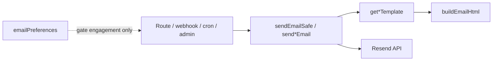

# Twistloom — Transactional & Engagement Emails Architecture

**Scope:** All backend-sent emails to Twistloom users (+ internal feedback alert)  
**Stack:** Resend · shared HTML layout · TypeScript templates  
**Implementation:** `src/utils/email.ts` · `src/config/emails/` · `src/services/email-preferences.ts`  
**Roadmap:** [docs/roadmap/TRANSACTIONAL_EMAIL_ROADMAP.md](../roadmap/TRANSACTIONAL_EMAIL_ROADMAP.md)

---

## Table of contents

1. [Overview](#1-overview)
2. [Architecture](#2-architecture)
3. [Voice & copy guidelines](#3-voice--copy-guidelines)
4. [Email catalogue](#4-email-catalogue)
5. [Mandatory vs optional](#5-mandatory-vs-optional)
6. [Trigger map](#6-trigger-map)
7. [User preferences](#7-user-preferences)
8. [Failure handling](#8-failure-handling)
9. [Environment & configuration](#9-environment--configuration)
10. [File reference map](#10-file-reference-map)
11. [Gaps & future work](#11-gaps--future-work)

---

## 1. Overview

| Property | Value |
|----------|--------|
| Provider | [Resend](https://resend.com) |
| Default from | `noreply@twistloom.com` (`RESEND_FROM_EMAIL`) |
| Brand layout | `buildEmailHtml` (`base-layout.ts`) |
| Send API | `sendEmail` → public `send*Email` · fire-and-forget via `sendEmailSafe` |
| Preferences | `users.email_preferences` jsonb · GET/PATCH `/user/email-preferences` |
| Locale (C+D) | `users.preferred_locale` + optional `emailLocale` override · catalogs `en`/`id` |
| Unsubscribe | HMAC tokens · public `GET/POST /email/unsubscribe` |



---

## 2. Architecture

| Layer | Path | Role |
|-------|------|------|
| Templates | `src/config/emails/*.ts` | Locale-aware HTML via `t(locale, key)` |
| Catalogs | `src/config/emails/locales/{en,id}.json` | Subjects + bodies |
| i18n helper | `src/config/emails/i18n.ts` | `t`, `formatEmailDate`, path prefix |
| Send utils | `src/utils/email.ts` | Resend + locale resolve + `sendEmailSafe` |
| Preferences | `src/services/email-preferences.ts` | Toggles, locale resolve, unsubscribe |
| Call sites | routes / subscription / crons / admin | When to send |

**Security & billing never read engagement toggles** — but **do** use `resolveEmailLocale`.  
**Engagement mail** must check prefs **and** locale.

---

## 3. Voice & copy guidelines

Twistloom emails share one brand, but **not one intensity of noir**. Copy must match the job of the message: security stays unambiguous; engagement can lean into thriller atmosphere.

### 3.1 Voice spectrum

| Tier | When | Style | Examples |
|------|------|--------|----------|
| **A — Clear / plain** | Security alerts, feedback (user + internal ops) | Short sentences. No metaphor that could hide the action. Facts, dates, “if this wasn’t you…” first. | Password changed, email changed, feedback ack, feedback internal |
| **B — Mild noir** | Auth lifecycle, billing, account lifecycle | Light thriller framing in **heading** and one line of body; **facts and CTAs stay explicit** (dates, amounts, button labels). | Password reset, verification, welcome, trial ending, payment failed, refund, sub canceled, account deleted |
| **C — Full noir** | Engagement / product marketing | Atmospheric, dossier/casefile metaphors, compelling hooks — **still scannable**: lists, titles, and links remain obvious. | Weekly recommendations, monthly activity, announcement chrome (admin body stays as written) |

### 3.2 Rules (all tiers)

1. **Clarity over cleverness** — A user must understand *what happened* and *what to do* in under 10 seconds.  
2. **Never obscure security or money** — Password, email, refund amounts, trial end dates, “past due” must appear in plain language.  
3. **No horror gore / cruelty** — Psychological thriller tone: shadow, choice, consequence, dossier — not shock for shock’s sake.  
4. **Subjects can be atmospheric; spam filters still need honesty** — Prefer “This week's dossiers — Twistloom” over clickbait that doesn’t match the body.  
5. **Engagement footers** — Prefer noir-adjacent prefs links (“Too many whispers? Manage preferences”) without hiding unsubscribe.  
6. **Admin announcements** — System wraps title/body with light framing; **admin-authored body is not rewritten** by templates.  
7. **Internal ops mail** (`FEEDBACK_INBOX`) — Stay **Tier A** (plain). Ops need speed, not mood.

### 3.3 Intended behavior by template

| Template | Tier | Notes |
|----------|------|--------|
| `password-changed`, `email-changed` | **A** | Security — plain by design |
| `feedback-acknowledgment`, `feedback-internal` | **A** | Support — plain / professional |
| `password-reset`, `verification` | **B** | Mild noir already; keep CTAs literal (“Reset Password”, “Verify Email”) |
| `welcome`, `trial-ending` | **B–C** | Brand-forward; welcome is the fullest product voice |
| `payment-failed`, `refund-processed`, `subscription-canceled`, `account-deleted` | **B** | Mild noir headings; numbers and dates plain |
| `weekly-recommendations`, `monthly-activity` | **C** | Full noir; book titles and stats still crystal clear |
| `announcement` | **C chrome / free body** | Framing + footer noir; body = admin content |

### 3.4 Anti-patterns

| Avoid | Prefer |
|-------|--------|
| “Something went wrong with your account” (vague security) | “Your password was changed… If this wasn’t you, reset it now.” |
| Pure formal “Please find attached your monthly summary” for digests | Dossier framing + plain bullet stats |
| Hiding the unsubscribe link in purple prose only | One clear prefs/unsubscribe line even if the rest is noir |
| Rewriting security mail to match weekly digests | Keep Tier A and Tier C separate |

---

## 4. Email catalogue

| # | Email | Subject pattern | Send function | Trigger | Wired |
|---|--------|-----------------|---------------|---------|-------|
| 1 | Email verification | `Verify Your {APP} Email` | `sendVerificationEmail` | Signup, resend, **email change (new)** | ✅ |
| 2 | Password reset | `Reset Your {APP} Password` | `sendPasswordResetEmail` | Forgot password | ✅ |
| 3 | Password changed | `Your {APP} password was changed` | `sendPasswordChangedEmail` | PUT password, POST reset-password | ✅ |
| 4 | Email changed (old) | `Your {APP} email address was changed` | `sendEmailChangedAlertEmail` | PUT email | ✅ |
| 5 | Welcome | `Welcome to {APP}!` | `sendWelcomeEmail` | POST /user onboarding | ✅ |
| 6 | Account deleted | `Your {APP} account has been deleted` | `sendAccountDeletedEmail` | DELETE /user (before cascade) | ✅ |
| 7 | VIP trial ending | `Your {APP} VIP Trial Ends Soon` | `sendTrialEndingEmail` | Stripe `trial_will_end` | ✅ |
| 8 | Payment failed | `Action needed: {APP} payment failed` | `sendPaymentFailedEmail` | Stripe `invoice.payment_failed` | ✅ |
| 9 | Refund processed | `Refund processed — {APP}` | `sendRefundProcessedEmail` | Stripe `charge.refunded` (credit packs) | ✅ |
| 10 | Subscription canceled | `Your {APP} VIP subscription was canceled` | `sendSubscriptionCanceledEmail` | Stripe `subscription.deleted` | ✅ |
| 11 | Feedback ack | `We Received Your Feedback — {APP}` | `sendFeedbackAcknowledgmentEmail` | POST /user/feedbacks | ✅ |
| 12 | Feedback internal | `[Feedback] {category}` | `sendFeedbackInternalEmail` | Same (if `FEEDBACK_INBOX`) | ✅ |
| 13 | Weekly might-like | `This week's dossiers — {APP}` | `sendWeeklyRecommendationsEmail` | Cron `email-weekly` | ✅ |
| 14 | Monthly activity | `Your {month} dossier — {APP}` | `sendMonthlyActivityEmail` | Cron `email-monthly` | ✅ |
| 15 | Announcement | `{title} — {APP}` | `sendAnnouncementEmail` | POST /admin/email/announcements | ✅ |

---

## 5. Mandatory vs optional

| Class | Emails | User can disable? |
|-------|--------|-------------------|
| **Security** | verify, reset, password changed, email changed, account deleted | No |
| **Billing** | trial ending, payment failed, refund, subscription canceled | No |
| **Support** | feedback ack (user), feedback internal (ops) | No |
| **Product lifecycle** | welcome | No (once via onboarding) |
| **Engagement** | weekly, monthly, announcements | **Yes** via prefs + unsubscribe |

---

## 6. Trigger map

| Event | Source | Email |
|-------|--------|-------|
| Signup | `POST /auth/signup` | Verification |
| Resend verify | `POST /auth/resend-verification` | Verification |
| Forgot password | `POST /auth/forgot-password` | Password reset |
| Password reset OK | `POST /auth/reset-password` | Password changed |
| Password change | `PUT /auth/password` | Password changed |
| Email change | `PUT /auth/email` | Old-address alert + verify new |
| Onboarding | `POST /user` (`isNewUser`→false) | Welcome + default prefs |
| Account delete | `DELETE /user` | Account deleted |
| Feedback | `POST /user/feedbacks` | User ack + optional internal |
| Trial ~3 days left | Stripe webhook | Trial ending |
| Invoice failed | Stripe webhook | Payment failed |
| Charge refunded | Stripe webhook | Refund (credit packs) |
| Sub deleted | Stripe webhook | Subscription canceled |
| Weekly cron | `pnpm dev:cron:email-weekly` | Weekly recommendations |
| Monthly cron | `pnpm dev:cron:email-monthly` | Monthly activity |
| Admin broadcast | `POST /admin/email/announcements` | Announcement |

---

## 7. User preferences & locale

### Schema

```typescript
// users.preferred_locale  text not null default 'en'   // account / app language
// users.email_preferences jsonb (nullable until defaults):
{
  weeklyRecommendations: boolean;   // default true
  monthlyActivitySummary: boolean;  // default true
  productAnnouncements: boolean;    // default true
  emailLocale: 'en' | 'id' | null;  // null = follow preferredLocale
}
```

**Effective email language:** `emailLocale ?? preferredLocale ?? 'en'`.

Defaults applied at onboarding (`ensureDefaultEmailPreferences`) and lazily on first GET prefs.  
`preferredLocale` set via fire-and-forget language change + onboarding body.

### API

| Method | Path | Auth |
|--------|------|------|
| GET | `/api/user/email-preferences` | requireAuth |
| PATCH | `/api/user/email-preferences` | requireAuth (toggles + `emailLocale`) |
| PATCH | `/api/user/preferred-locale` | requireAuth `{ preferredLocale }` |
| GET | `/api/user` | includes `preferredLocale` |
| GET/POST | `/api/email/unsubscribe?token=` | **public** (HMAC) |

### Frontend

- Appearance language → UI cookie + fire-and-forget `PATCH /preferred-locale`  
- Email card → toggles + **Email language** select (Same as app / en / id)  
- Onboarding → sends `preferredLocale` from current UI locale  
- Public `/[locale]/email/unsubscribe?token=`  
- Deep link `?tab=notifications`

### i18n catalogs

- `src/config/emails/locales/en.json`, `id.json`  
- Templates call `t(locale, key, vars)` — missing ID keys fall back to English  
- Internal ops (`FEEDBACK_INBOX`) stays English  
- See [EMAIL_I18N_ROADMAP.md](../roadmap/EMAIL_I18N_ROADMAP.md) for history & support-burden notes

---

## 8. Failure handling

| Pattern | Usage |
|---------|--------|
| `sendEmail` returns `boolean` | Never throws |
| `sendEmailSafe(label, fn)` | Fire-and-forget from routes |
| Auth signup/forgot | May surface `emailSent` / `verificationEmailSent` |
| Webhooks / feedback / onboarding | Non-blocking; primary action already done |

---

## 9. Environment & configuration

| Variable | Required | Purpose |
|----------|----------|---------|
| `RESEND_API_KEY` | Yes (to send) | Resend |
| `RESEND_FROM_EMAIL` | No | From address |
| `FRONTEND_URL` | Yes (links) | Verify/reset/prefs/unsubscribe deep links |
| `FEEDBACK_INBOX` | No | Internal feedback alert recipient |
| `EMAIL_UNSUBSCRIBE_SECRET` | No | HMAC secret (falls back to `NEXTAUTH_SECRET` / `RESEND_API_KEY`) |

---

## 10. File reference map

```
src/
├── config/emails/          # templates + index barrel
├── utils/email.ts          # Resend + send* + sendEmailSafe
├── services/email-preferences.ts
├── types/email-preferences.ts
├── routes/
│   ├── auth.ts             # security emails
│   ├── user.ts             # welcome, delete, feedback, prefs API
│   ├── email.ts            # public unsubscribe
│   ├── payments.ts         # billing webhooks
│   └── admin.ts            # POST /email/announcements
├── services/subscription.ts  # trial ending
└── cron/
    ├── email-weekly-recommendations.ts
    └── email-monthly-summary.ts
```

Frontend (`twistloom-web`):

- `DashboardAccountPreferencesClient.tsx`
- `useEmailPreferences.ts` · `UsersApi` email methods
- `app/[locale]/email/unsubscribe/page.tsx`

Migrations:

- `0038` — `users.email_preferences`  
- `0039` — `users.preferred_locale`

---

## 11. Gaps & future work

| Item | Status |
|------|--------|
| Resend bounce/complaint webhooks | Not built |
| Email HTML locale (`en`/`id`) | ✅ Catalogs + resolve path |
| Weekly cron ML ranking | v1 = trending public books |
| Send log / idempotency table | Not built (rely on schedule) |
| In-app notification prefs | Still local-only UI stub |
| Multi-device UI/backend locale force-sync | Optional |

---

*Last updated: Jul 2026 — security, billing, prefs, engagement, email i18n (C+D hybrid) implemented.*
