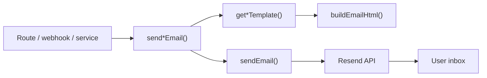
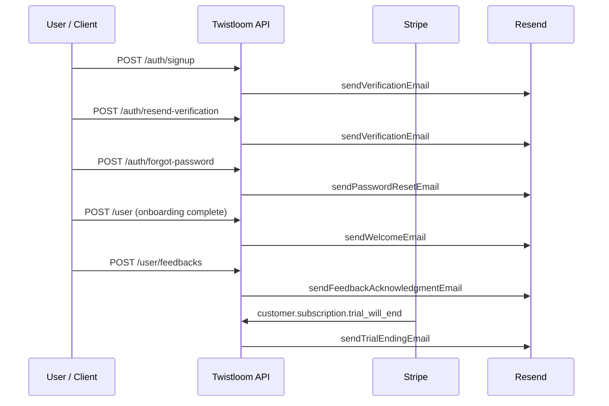

# Twistloom — Transactional Emails Architecture

**Scope:** All backend-sent transactional emails to Twistloom users  
**Stack:** Resend · shared HTML layout · TypeScript templates  
**Implementation:** `src/utils/email.ts` · `src/config/emails/`

---

## Table of contents

1. [Overview](#1-overview)
2. [Architecture](#2-architecture)
3. [Email catalogue](#3-email-catalogue)
4. [Mandatory vs optional](#4-mandatory-vs-optional)
5. [Trigger map](#5-trigger-map)
6. [User preferences (current state)](#6-user-preferences-current-state)
7. [Failure handling](#7-failure-handling)
8. [Environment & configuration](#8-environment--configuration)
9. [File reference map](#9-file-reference-map)
10. [Gaps & future work](#10-gaps--future-work)

---

## 1. Overview

Twistloom sends **transactional** emails only (account security, verification, billing nudges, support acknowledgments). There is no marketing / newsletter pipeline in this backend today.

| Property | Value |
|----------|--------|
| Provider | [Resend](https://resend.com) |
| Default from | `noreply@twistloom.com` (override: `RESEND_FROM_EMAIL`) |
| Brand layout | Shared HTML shell (`base-layout.ts`) — logo, crimson accents, light/dark |
| Send API | `sendEmail()` private helper → public `send*Email()` functions |
| Return type | `Promise<boolean>` — `true` if Resend accepted the send |

All public send functions are **best-effort**: they never throw to callers; failures are logged and return `false`.



---

## 2. Architecture

### 2.1 Layers

| Layer | Path | Role |
|-------|------|------|
| Templates | `src/config/emails/*.ts` | Pure HTML generators (no I/O) |
| Barrel | `src/config/emails/index.ts` | Re-exports template functions |
| Shared layout | `src/config/emails/base-layout.ts` | Brand frame, button, footer, dark mode |
| Send utilities | `src/utils/email.ts` | Resend client, subjects, orchestration |
| Call sites | Routes / services | Decide *when* to send; pass personalisation data |

### 2.2 Shared layout (`buildEmailHtml`)

Every template uses the same card layout:

- Twistloom logo + wordmark
- Heading + body HTML
- Optional CTA button + plain-URL fallback
- Optional muted footer block
- Standard “automated message — do not reply” footer

Voice is intentionally thriller-adjacent but clear (especially security emails).

### 2.3 Resend client

- Lazy singleton: created on first send so missing `RESEND_API_KEY` does not break boot
- Throws only inside the send path if the key is absent
- Outer `sendEmail` catches errors and returns `false`

---

## 3. Email catalogue

### 3.1 Summary table

| # | Email | Subject pattern | Send function | Template | Wired? |
|---|--------|-----------------|---------------|----------|--------|
| 1 | Email verification | `Verify Your {APP_NAME} Email` | `sendVerificationEmail` | `getVerificationTemplate` | ✅ Yes |
| 2 | Password reset | `Reset Your {APP_NAME} Password` | `sendPasswordResetEmail` | `getPasswordResetTemplate` | ✅ Yes |
| 3 | Welcome | `Welcome to {APP_NAME}!` | `sendWelcomeEmail` | `getWelcomeTemplate` | ✅ Onboarding (`POST /api/user`, `isNewUser` → false) |
| 4 | VIP trial ending | `Your {APP_NAME} VIP Trial Ends Soon` | `sendTrialEndingEmail` | `getTrialEndingTemplate` | ✅ Yes |
| 5 | Feedback acknowledgment | `We Received Your Feedback — {APP_NAME}` | `sendFeedbackAcknowledgmentEmail` | `getFeedbackAcknowledgmentTemplate` | ✅ Yes |

---

### 3.2 Email verification

**Purpose:** Confirm ownership of the email address after email/password signup (or when the user requests a resend).

| Field | Detail |
|-------|--------|
| **Trigger** | 1) `POST /api/auth/signup` after account insert<br>2) `POST /api/auth/resend-verification` if account exists and email is not yet verified |
| **User action** | Signup (automatic) or explicit “resend verification” |
| **Mandatory?** | **Yes (security / product)** — required path for unverified email/password accounts. Not user-configurable. |
| **Opt-out** | None |
| **Personalisation** | Verification URL; optional OTP / token display in body |
| **Token lifetime** | **24 hours** (enforced server-side) |
| **CTA** | “Verify Email” → `{FRONTEND_URL}/verify-email?token=…` |
| **Content highlights** | Identity confirmation; large monospace code block when OTP/token is passed; expiry notice |
| **Anti-abuse** | Resend path is rate-limited by IP; responses avoid email enumeration where applicable |
| **Failure impact** | Signup still succeeds; API reports `verificationEmailSent: false` so the client can prompt resend |

**Call site:** `src/routes/auth.ts`

---

### 3.3 Password reset

**Purpose:** One-time link so the user can set a new password.

| Field | Detail |
|-------|--------|
| **Trigger** | `POST /api/auth/forgot-password` when a reset token can be created for that email |
| **User action** | Explicit “forgot password” |
| **Mandatory?** | **Yes (security)** when the user requests it and an account exists. Not marketing; not user-configurable. |
| **Opt-out** | None (user initiated) |
| **Personalisation** | Full reset URL with signed token |
| **Token lifetime** | **1 hour** (enforced server-side) |
| **CTA** | “Reset Password” → `{FRONTEND_URL}/reset-password?token=…` |
| **Content highlights** | Clear instructions; “ignore if you didn’t request this”; gateway closes in 1 hour |
| **Anti-abuse** | Rate-limited by IP; always returns a generic success message (no email enumeration) |
| **Failure impact** | `emailSent: false` in response; user may retry |

**Call site:** `src/routes/auth.ts`

---

### 3.4 Welcome

**Purpose:** Orient new users after onboarding — personal greeting from the creator and product framing.

| Field | Detail |
|-------|--------|
| **Trigger** | `POST /api/user` after onboarding sets `isNewUser` `true` → `false` |
| **User action** | Completing onboarding (once) |
| **Mandatory?** | **Automatic product transactional** — not user-configurable. Once-only via `isNewUser` SSOT (no extra column). |
| **Opt-out** | None today |
| **Personalisation** | Username in heading |
| **CTA** | None (narrative body only) |
| **Content highlights** | Welcome into the narrative engine; signed note from Taufik (creator) |
| **Failure impact** | Non-blocking: onboarding still returns success |

**Call site:** `src/routes/user.ts` (`POST /`)
---

### 3.5 VIP trial ending

**Purpose:** Nudge the user ~3 days before VIP free trial ends so they can update billing or cancel.

| Field | Detail |
|-------|--------|
| **Trigger** | Stripe webhook `customer.subscription.trial_will_end` → `handleTrialWillEndEvent` → `handleTrialWillEnd` |
| **User action** | None (billing lifecycle) |
| **Mandatory?** | **Yes (billing / transactional)** for users on a VIP free trial. Not a marketing blast; companion to in-app notification. |
| **Opt-out** | None in-app today. User can cancel trial in subscription settings (stops future charges; may still receive Stripe’s own email). |
| **Personalisation** | Display name; formatted trial end date |
| **CTA** | **None in email** — in-app notification + subscription settings are the CTA; Stripe Dashboard trial-ending email is a fallback |
| **Content highlights** | Trial end date; card will be charged to continue VIP; how to update/cancel |
| **Companions** | In-app `user_notifications` row (`trial_ending_soon`); Stripe’s automatic trial-ending email |
| **Failure impact** | Non-blocking: in-app notification already written; email failure is logged only |

**Call sites:** `src/routes/payments.ts` · `src/services/subscription.ts`

---

### 3.6 Feedback acknowledgment

**Purpose:** Thank the user after they submit feedback/bug report; confirm receipt and set expectation that the team will act ASAP.

| Field | Detail |
|-------|--------|
| **Trigger** | After successful insert on `POST /api/user/feedbacks` |
| **User action** | Submitting feedback (email is a side effect of that action) |
| **Mandatory?** | **Product transactional (automatic)** — always attempted after a successful submit when the user has an email. Not user-configurable today. |
| **Opt-out** | None today |
| **Personalisation** | Name (falls back to `"there"` if empty) |
| **CTA** | None |
| **Content highlights** | Thanks for informing; sorry for inconvenience; team will address ASAP; no action needed |
| **Failure impact** | Non-blocking: feedback API still returns `201` with the feedback record |

**Call site:** `src/routes/user.ts`

---

## 4. Mandatory vs optional

| Email | Classification | User can disable? | Rationale |
|-------|----------------|-------------------|-----------|
| Email verification | **Mandatory transactional** | No | Account security / ownership proof |
| Password reset | **Mandatory transactional** | No | User-initiated security recovery |
| Welcome | **Automatic product** (onboarding complete) | No (today) | Once via `isNewUser` → false |
| VIP trial ending | **Mandatory billing transactional** | No (except by ending trial / cancelling) | Charge notice / subscription lifecycle |
| Feedback acknowledgment | **Automatic transactional** | No (today) | Support confirmation tied to user action |

**Note:** There is **no** user email-preference table or API yet. “Optional” above means product-optional (lifecycle/marketing-adjacent), not “user-toggle exists.”

---

## 5. Trigger map



| Event | Endpoint / source | Email |
|-------|-------------------|--------|
| Email/password registration | `POST /api/auth/signup` | Verification |
| Resend verification | `POST /api/auth/resend-verification` | Verification |
| Forgot password | `POST /api/auth/forgot-password` | Password reset |
| Onboarding complete (`isNewUser` → false) | `POST /api/user` | Welcome |
| Feedback submitted | `POST /api/user/feedbacks` | Feedback acknowledgment |
| Trial ends in ~3 days | Stripe `customer.subscription.trial_will_end` | VIP trial ending |

---

## 6. User preferences (current state)

| Capability | Status |
|------------|--------|
| Per-user email notification toggles | **Not implemented** |
| Marketing / digest preferences | **Not implemented** |
| Frequency caps beyond auth rate limits | IP rate limits on forgot-password & resend-verification only |
| Unsubscribe links in transactional mail | **Not used** (transactional; footer says do not reply) |

If preferences are added later, recommended split:

- **Never optional:** verification, password reset, legal/billing charge notices  
- **Preference-gated:** welcome, product tips, engagement digests  
- **Grey area (product decision):** feedback ack, trial-ending (often kept mandatory for support/billing clarity)

---

## 7. Failure handling

| Pattern | Used by | Behaviour |
|---------|---------|-----------|
| Return `boolean` | All `send*Email` | Log + `false` on Resend/API/config errors |
| Report to client | Signup, forgot-password, resend-verification | `verificationEmailSent` / `emailSent` flags |
| Non-blocking try/catch | Trial ending, feedback ack | Primary action (notification / DB insert) already succeeded; email errors logged only |
| Enumeration-safe responses | Forgot password, resend verification | Generic success copy regardless of whether the account exists |

`RESEND_API_KEY` missing → first send throws inside client init → caught by `sendEmail` → `false`.

---

## 8. Environment & configuration

| Variable | Required | Description |
|----------|----------|-------------|
| `RESEND_API_KEY` | Yes (to send) | Resend API key |
| `RESEND_FROM_EMAIL` | No | Override default `noreply@twistloom.com` |
| `FRONTEND_URL` | Yes (for link emails) | Base URL for verify/reset links |
| `APP_NAME` | Via constants | Used in subjects and template copy |

---

## 9. File reference map

```
src/
├── config/
│   └── emails/
│       ├── base-layout.ts              # Shared HTML shell
│       ├── index.ts                    # Barrel exports
│       ├── password-reset.ts           # Reset template
│       ├── verification.ts             # Verify + OTP template
│       ├── welcome.ts                  # Welcome template
│       ├── trial-ending.ts             # VIP trial nudge template
│       └── feedback-acknowledgment.ts  # Feedback thank-you template
├── utils/
│   └── email.ts                        # Resend client + send*Email APIs
├── routes/
│   ├── auth.ts                         # Verification + password reset triggers
│   ├── user.ts                         # Feedback acknowledgment trigger
│   └── payments.ts                     # Stripe trial_will_end → handleTrialWillEnd
└── services/
    └── subscription.ts                 # handleTrialWillEnd + trial email send
```

---

## 10. Gaps & future work

| Item | Notes |
|------|--------|
| ~~**Welcome email unwired**~~ | ✅ Wired on onboarding complete (`POST /api/user`) |
| **Email preference model** | If product emails grow, add prefs without allowing disable of security/billing mail |
| **Admin / internal alerts** | No “new feedback → team inbox” email yet; only user-facing ack |
| **Locale / i18n** | Templates are English-only |
| **Delivery webhooks** | Resend delivery/bounce handling not integrated |
| **Stripe native emails** | Trial ending intentionally dual-channel (app + Stripe); document any other Stripe Dashboard emails (receipts, invoices) as out-of-band |

---

*Last updated from `src/config/emails/` and `src/utils/email.ts` call sites. Update this doc when adding templates or wiring new triggers.*
