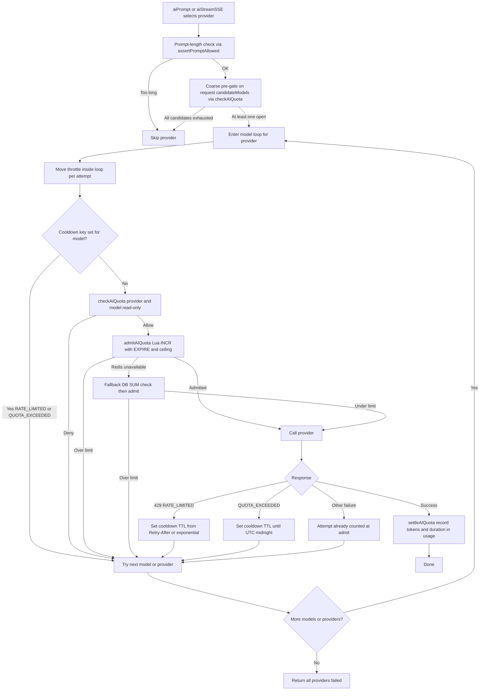
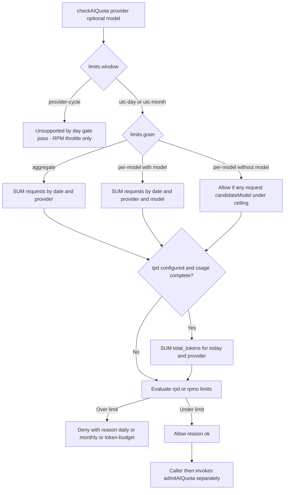

# AI Quota Gate Reliability Roadmap

> **Status:** Implemented (Steps 1–10; Step 11 deferred)
> **Date:** 2026-09-23
> **Owner:** Backend / AI Platform

---

## 1. Summary Table

| # | Item | Priority | Status |
|---|------|----------|--------|
| 1 | Extend `AIProviderRateLimit` with `grain` / `scope` / `models` / `tpd` / `tpm` / `window`; keep Cerebras proxy `rpd: 150` until `tpd` verified; seed token budgets | `P0` | ✅ Implemented |
| 2 | CQS **check** path: read-only `checkAIQuota(provider, { model })` with grain dispatch; boolean `canUseAIToday` wrapper; sanitize `model` for PK inserts | `P0` | ✅ Implemented |
| 3 | Relocate gate into model loop (both paths); pre-gate uses request `candidateModels`; move stream `throttle()` inside loop; split `assertPromptAllowed` | `P0` | ✅ Implemented |
| 4 | Encapsulate `*Prompt` exports so only `aiPrompt` / `aiStreamSSE` can dispatch providers (compile-time gate guarantee) | `P0` | ✅ Implemented |
| 5 | CQS **admit/settle** path: Lua atomic `INCR`+`EXPIRE`+ceiling admit with DB fallback; success-only `settleAIQuota`; Redis = attempt authority | `P0` | ✅ Implemented |
| 6 | Dual-tier cooldown: `RATE_LIMITED` → short TTL; `QUOTA_EXCEEDED` → TTL to UTC midnight; wired into retry decision | `P1` | ✅ Implemented |
| 7 | Fix `getCurrentMonthBounds()` to UTC so monthly gate matches `getTodayDate()` | `P1` | ✅ Implemented |
| 8 | Observability: structured deny logs, 80% near-limit warn, allow/deny metrics | `P1` | ✅ Implemented |
| 9 | Optional `(date, provider, model)` index on `usage` — schema-only, human migration | `P1` | ✅ Implemented (migration pending human run) |
| 10 | Activate `tpd` gates: expand `StreamUsage` with `completionTokens` / `totalTokens`; complete stream usage builders | `P2` | ✅ Implemented |
| 11 | Ollama `provider-cycle` window (5h/7d GPU cycle) | `P2` | ⏩ Skipped |

---

## 2. Problem Statement

### Current State

- **Rate-limit config is one flat bucket per provider.** `AI_RATE_LIMITS` is `Record<AIChatProvider, AIProviderRateLimit>` with only `rpm` / `rpd?` / `rpmo?` (`src/config/ai-clients.ts:63-303`, `src/types/ai-chat.ts:533-549`).
- **The daily gate aggregates across all models.** `canUseAIToday(provider)` runs `SUM(requests) WHERE date = today AND provider = X` with no `model` filter (`src/utils/ai-limiters.ts:358-403`).
- **The gate runs once per provider, before the model loop** — never per model attempt:
  - Non-streaming: `assertPromptAllowed` at `src/utils/ai-chat.ts:1501` (inside `aiPrompt`'s provider loop, before dispatching to `promptWithFallback`).
  - Streaming: `assertPromptAllowed` at `src/utils/ai-chat-stream.ts:278` (before the model loop at `:293`).
  - `promptWithFallback` itself (`src/utils/ai-chat.ts:42-193`) never calls `canUseAIToday`; its inner model loop only applies `RateLimiter.throttle()` (`:77`).
  - **Stream throttle sits outside the model loop** (`ai-chat-stream.ts:290` fires once before `:293`), unlike non-streaming — inter-model attempts within one stream are never spaced.
- **Only successful responses increment usage.** `incrementDailyUsageCount` fires after a good output (`src/utils/ai-chat.ts:118`, `src/utils/ai-chat-stream.ts:512`). Failed and 429'd attempts are never counted.
- **Check-then-act race:** the gate reads `usage`, then increments only after success — concurrent callers can all pass before any increment lands. No reservation/admit step exists.
- **`usage` already stores `model`** in its PK `(date, provider, context, model)` (`src/db/schema.ts:987-1005`), so per-model sums are queryable today with **zero migration**. The `model` column is part of that NOT NULL PK, yet `incrementDailyUsageCount` defaults `model = null` (`src/utils/ai-limiters.ts:445`) — any call without a model fails the insert.
- **Error classification already distinguishes rate-limit from quota-exhaustion** (`src/utils/error.ts:48-59`): `RATE_LIMITED` is retryable, `QUOTA_EXCEEDED` (maps from `"quota"` / `resource_exhausted`, `:240`) is not. Today's gate has no cooldown path that keys off this distinction.
- **Redis rate-limit helper uses a two-step `INCR` then conditional `EXPIRE`** (`src/utils/redis.ts:110-115`) — correct under normal operation but not a single atomic ceiling check; a crash between calls leaves a non-expiring key, and an over-limit path that `DECR`s is race-prone under concurrency.
- **Fact-check of `TODO-ai-rate-limit-differences.md`** (scoping claims vs code):

| Claim in TODO | Verdict | Code evidence |
|---|---|---|
| Gemini quota is per-model, per-project | Consistent (implicit) | Per-model RPM/RPD table at `src/config/ai-clients.ts:68-80`; shipped value is one flat `{ rpm: 10, rpd: 20 }` (`:105`) |
| Groq per-model, organization-scoped | Confirmed verbatim | `src/config/ai-clients.ts:122-133` |
| NVIDIA NIM one aggregate bucket, per-API-key | Confirmed verbatim | `src/config/ai-clients.ts:151-161` — flat shape is *correct* here |
| Cerebras = org-level continuous-refill token bucket | Partial; config self-contradicts | Comment says ~125–150 req/day at 1M tokens/day and "request-count rpd not meaningful" (`:135-145`), yet ships `rpd: 2_400` — a ~16× over-open gate |
| Flat one-bucket shape OK for NVIDIA, wrong for Gemini/Groq | Confirmed | Flat config + aggregate `SUM` + one `RateLimiter` singleton per provider (`src/utils/ai-limiters.ts:25-45`) |
| Remaining providers' scoping unchecked | Understates code | Code already documents **OVHcloud per-project-per-model** (`:183-192`) and **ModelScope 500 RPD per individual model** (`:218-225`) |

### Pain Points

1. **Per-model divergence is unmodeled.** For Gemini / Groq / OVHcloud / ModelScope, an exhausted model blocks the *entire provider*; a healthy sibling model in the same waterfall array is never tried. Conversely, a single averaged `rpd` can under- or over-block relative to real per-model buckets.
2. **Success-only accounting undercounts vs provider truth.** Providers count rejected requests against quota; the local ledger does not → the gate reopens too wide → more 429s. (Fix lands in Redis admit — step 5 — without polluting `usage` analytics; see Q4.)
3. **TOCTOU race on low `rpd`.** Gemini's `rpd: 20` can be overshot under concurrency because admit (read) and settle (post-success write) are not atomic. A `can*`-style predicate that side-effects (the original step-2 sketch) would double-burn quota on every pre-gate + model-loop pair and on boolean wrappers like `backfill-embeddings.ts:53`.
4. **Token-metered providers have no daily gate.** `mistral`, `nvidia`, `aionlabs`, `llm7` omit `rpd`/`rpmo` → check always passes; Aion's ~20K tok/day and LLM7's 1M tok/day are unprotected even though `usage.total_tokens` exists. Stream paths also omit `completionTokens` / `totalTokens` from `StreamUsage` (`src/types/ai-chat.ts:507-524`; forward path `ai-chat-stream.ts:512-517`), so `SUM(total_tokens)` undercounts output.
5. **Cerebras config contradicts its own comment** (`rpd: 2_400` vs ~125–150 real requests/day) — the gate will essentially never bind before token exhaustion. Removing `rpd` entirely before `tpd` activation (step 10) would leave a multi-day ungated gap; interim proxy `rpd: 150` is required.
6. **Window mismatches.** `getTodayDate()` is UTC (`src/utils/time.ts:316-327`) but `getCurrentMonthBounds()` uses local `getFullYear()`/`getMonth()` (`:330-339`); Ollama's real 5h/7d GPU cycle cannot be expressed as a UTC calendar day (config admits this; `rpd: 50` is an invented proxy).
7. **Gate-bypass surface.** Only `aiPrompt` and `aiStreamSSE` call `assertPromptAllowed`. Exported `geminiPrompt` / `groqPrompt` / etc. do not self-gate; a verified grep shows zero external callers today, but the public exports remain a standing bypass risk for any future import.
8. **No quota observability.** Denies are a bare `console.warn`; there is no near-limit signal and no allow/deny ratio to validate hardcoded ceilings (the Gemini caution at `src/config/ai-clients.ts:100-104` explicitly begs for measurement over guesswork).
9. **Cooldown/retry interaction ignores quota semantics.** `retryWithBackoff` retries `RATE_LIMITED` (retryable) in-loop; any cooldown set only in the outer catch runs too late. `QUOTA_EXCEEDED` (non-retryable) never receives a until-midnight hold, so the waterfall re-hits a known-dead model.

### Goal

Make quota enforcement **CQS-clean** (read-only check, atomic admit, success-only settle), **grain-correct** (matches each provider's real aggregate-vs-per-model partition), **model-aware** (checked at the same granularity the waterfall acts at), **attempt-accurate** (counts what the provider counts — via Redis, not by widening `usage` analytics), and **race-safe** (Lua atomic admit), without a mandatory schema migration.

---

## 3. Intended Design & Rationale

### Design Alternatives

#### Alternative A: Keep flat per-provider gate; only tighten numbers

Leave the signature as `canUseAIToday(provider)`; adjust `rpd` constants and add attempt counting.

**Pros:** Smallest diff; no call-site changes.
**Cons:** Does not fix per-model divergence (the core finding of the TODO); exhausted-model-blocks-provider behavior remains; Gemini/Groq/OVH/ModelScope still modeled incorrectly.

#### Alternative B: Full SQL reservation ledger (new table)

New `ai_quota_ledger (date, provider, model, attempts)` with conditional upsert `WHERE attempts < $limit RETURNING` as the sole admit path.

**Pros:** Single source of truth; atomic; no Redis dependency.
**Cons:** New table + second write path; loses the project's established Upstash patterns (`checkRateLimit`, idempotency locks); every instance still pays a DB round-trip on the hot path.

#### Alternative C: Grain-typed config + CQS gate + Lua atomic admit (recommended)

Extend `AIProviderRateLimit` with `grain` / `scope` / `models` / `tpd` / `tpm` / `window`. Split the gate command–query style:

- **`checkAIQuota`** — read-only (grain-dispatched SQL + cooldown read). No side effects. Safe for pre-gates, wrappers, and double invocation.
- **`admitAIQuota`** — single Lua script: `INCR` + `EXPIRE` (when new) + ceiling test + `DECR` on over-limit, one round-trip. DB `SUM` fallback on Redis error.
- **`settleAIQuota`** — post-success write into `usage` (tokens/duration/analytics SSOT only).

Move the check+admit into the model loop; keep Redis as the real-time **attempt** counter; keep `usage.requests` as successful completions (Q4).

**Pros:** Matches documented provider scoping; zero-migration for per-model queries (`usage.model` already in PK); CQS prevents the `can*`-side-effect double-burn and keeps `backfill-embeddings.ts:53` honest; Lua matches AGENTS.md atomic-op requirements; cooldown can branch on `RATE_LIMITED` vs `QUOTA_EXCEEDED`.
**Cons:** Two-tier state (Redis attempts + Postgres analytics) needs a reseed/reconcile story; slightly more moving parts than Alternative A.

### Recommended: Alternative C

Rationale:

- **Matches reality the code already documents.** Groq/NVIDIA comments are verbatim-confirmed; OVHcloud and ModelScope comments already describe per-model ceilings the flat gate ignores.
- **Gates at the right granularity.** The waterfall's unit of fallback is the *model*; the gate must run per model attempt, not once per provider. The stream path must also throttle per attempt, not once per provider.
- **CQS is a correctness requirement, not style.** A single `canUseAIQuota` that both reads and `INCR`s would burn quota from `canUseAIToday`, from a coarse pre-gate, and again from the model loop. Splitting check/admit/settle makes every call site's side-effect contract explicit.
- **Zero-migration first.** `src/db/schema.ts:1003` PK already includes `model`. Schema-only additions (optional `attempts` column, optional composite index) remain human-migrated per AGENTS.md §3.5.
- **Precedent:** Redis atomic Lua for limits (extends the `checkRateLimit` pattern in `src/utils/redis.ts`), fail-open-elsewhere-but-tiered-fail-here (see Q2).

### Non-Breaking Guarantees

| Change | What it does NOT change | Why safe |
|--------|------------------------|----------|
| Add optional fields to `AIProviderRateLimit` | Existing `rpm`/`rpd`/`rpmo` values and meanings | Additive typing; default `grain: 'aggregate'` reproduces today's behavior |
| Add `checkAIQuota` / `admitAIQuota` / `settleAIQuota` | `canUseAIToday(provider)` boolean signature | Wrapper preserved for `src/cron/backfill-embeddings.ts:53` and roadmap references; wrapper calls **read-only** check only |
| Relocate gate into model loop | Prompt-length check semantics (`AI_MAX_PROMPT_LENGTH`) | Length stays provider-level, evaluated once via split `assertPromptAllowed` |
| Move stream `throttle()` into model loop | Non-streaming throttle behavior | Aligns stream with `promptWithFallback`'s existing per-attempt spacing (`ai-chat.ts:77`) |
| Lua admit | `usage` table schema and analytics queries | `usage` remains SSOT for reporting; Redis holds attempt counters only |
| Q4: Redis attempt authority | `usage.requests` semantics | `requests` stays successful completions — no analytics semantic change; no migration required |
| Unexport `*Prompt` helpers | `aiPrompt` / `aiStreamSSE` public contracts | Verified zero external callers; only the gated entrypoints remain importable |
| Aggregate-grain providers (NVIDIA, OpenRouter, …) | Effective allow/deny outcome | Sum-across-models equals per-model sum when one shared bucket exists |

---

## 4. Feasibility Analysis

| Dimension | Assessment |
|-----------|------------|
| **Effort** | Medium — P0 core (steps 1–5) ~3–4 days; P1 (steps 6–9) ~2–3 days; P2 (step 10) gated on stream-usage completeness |
| **Risk** | Medium — quota logic sits on the hot path for every generation; wrong grain, CQS confusion, or a broken Lua script could cause 429 storms or false lockouts |
| **Backend changes** | Minimal–Significant — mostly `src/utils/ai-limiters.ts` + call sites in `ai-chat.ts` / `ai-chat-stream.ts`; no required migration |
| **Dependencies** | Upstash Redis already in stack (Lua via `redis.eval`); stream usage capture must include completion tokens before `tpd` gates (step 10) |
| **Reversibility** | Fully reversible — config fields are additive; Redis keys expire daily; wrapper keeps old call shape; unexporting `*Prompt` is a compile-time revert |

---

## 5. Flow Diagram (Mermaid)

### 5.1 Model-loop quota admission (CQS target end state)



### 5.2 `checkAIQuota` grain dispatch (read-only)



---

## 6. Implementation Plan

### Step 1: Extend rate-limit types and seed config — ✅ Implemented

**Files:** `src/types/ai-chat.ts:533-549`, `src/config/ai-clients.ts:63-303`
**Effort:** Low

Add to `AIProviderRateLimit` (all optional; absence = today's behavior):

```ts
export type RateLimitGrain = 'aggregate' | 'per-model';

export type AIProviderRateLimit = {
  rpm: number;
  rpd?: number;
  rpmo?: number;
  /** How the provider partitions quota across models. Default: 'aggregate'. */
  grain?: RateLimitGrain;
  /** Who the quota attaches to (documentation today; multi-key headroom). */
  scope?: 'api-key' | 'project' | 'organization';
  /** Exact per-model ceilings when known (override provider-level rpd/rpmo). */
  models?: Record<string, { rpm?: number; rpd?: number; rpmo?: number }>;
  /** Daily token budget for token-metered providers. */
  tpd?: number;
  /** Per-minute token ceiling (enforced via RateLimiter; optional dimension). */
  tpm?: number;
  /** Window shape. Default calendar day/month. */
  window?: 'utc-day' | 'utc-month' | 'provider-cycle';
};
```

Seed from confirmed facts only:

| Provider | Field values |
|----------|----------------|
| `gemini`, `groq`, `ovhcloud`, `modelscope` | `grain: 'per-model'` |
| `nvidia` and all others without evidence | default `'aggregate'` |
| `cerebras` | **Replace `rpd: 2_400` with proxy `rpd: 150`** (matches "~125–150 req/day" comment at `:135-145`); add `tpd: 1_000_000`; keep `rpm`. **Do not remove `rpd` until step 10 verifies `tpd` enforcement** — removing it now would open a multi-day ungated gap between steps 1 and 10 |
| `aionlabs` | `tpd: 20_000` (no `rpd`) |
| `llm7` | `tpd: 1_000_000` (no `rpd`) |
| `mistral` | `tpd` once budget confirmed (leave unset until then); seed `tpm` if known |
| `groq` | seed `tpm: 6_000` (comment-documented) when step 1 lands |
| `cohere` | `scope: 'api-key'`, `window: 'utc-month'` (behavior unchanged) |
| `ollama` | `window: 'provider-cycle'` (gate still uses proxy `rpd` until step 11) |

**Non-breaking:** Defaults reproduce current flat behavior for every provider not listed.

---

### Step 2: CQS check path — `checkAIQuota` (read-only) — ✅ Implemented

**Files:** `src/utils/ai-limiters.ts:339-403`, `:430-467`
**Effort:** Medium

```ts
export type QuotaCheckResult =
  | { allowed: true; reason: 'ok' }
  | { allowed: false; reason: 'daily' | 'monthly' | 'token-budget' | 'cooldown'; resetAt?: Date };

/**
 * Read-only quota check. Performs NO Redis INCR and NO DB writes.
 * Safe to call from pre-gates, wrappers, and hot paths that may invoke
 * check multiple times before a single admit.
 */
export async function checkAIQuota(
  provider: AIChatProvider,
  opts?: { model?: string; candidateModels?: readonly string[] },
): Promise<QuotaCheckResult>;

/** Thin wrapper — preserves existing boolean call sites; read-only. */
export async function canUseAIToday(provider: AIChatProvider): Promise<boolean> {
  return (await checkAIQuota(provider)).allowed;
}
```

Query rules:

- `grain: 'aggregate'` — current `SUM(requests) WHERE date, provider` vs `rpd`; month vs `rpmo`.
- `grain: 'per-model'` + `model` — `SUM(requests) WHERE date, provider, model = $model` vs `limits.models?.[model]?.rpd ?? limits.rpd`.
- `grain: 'per-model'` + no model — allow if **any** entry in `opts.candidateModels ?? AI_CHAT_MODELS_*` for that provider remains under ceiling (coarse pre-gate only; authoritative check is per attempt in step 3). Never hardcode a single preset: callers may pass `options.models` from 8+ presets or custom arrays.
- `tpd` — additionally `SUM(total_tokens) WHERE date, provider >= tpd` (effective only after step 10).
- `window: 'provider-cycle'` — not evaluated (always pass on day gates; RPM throttle still applies).
- Cooldown keys (step 6) are read here so a held model is skipped before any SQL.
- DB error — **fail-closed per Q2 tiering** (strict caps fail-closed; high/uncapped fail-open with structured warn), distinguishable via `reason` once step 8 lands.

**PK insert safety (same step):** in `incrementDailyUsageCount` / `settleAIQuota`, replace `model = null` (`ai-limiters.ts:445`) with `model = options.model ?? 'default'` so the NOT NULL PK `(date, provider, context, model)` always receives a string. Fix the JSDoc example at `:418` accordingly.

**Non-breaking:** All queries use existing PK; `canUseAIToday` keeps its boolean contract and now guarantees zero side effects.

---

### Step 3: Relocate gate into the model loop; fix stream throttle — ✅ Implemented

**Files:** `src/utils/ai-chat.ts:502-517`, `:65-91`, `:1501`; `src/utils/ai-chat-stream.ts:278-293`
**Effort:** Medium

- Split `assertPromptAllowed`:
  - **Length check** — unchanged, provider-level, called once before the model loop.
  - **Quota check** — extracted; invoked per model attempt as `checkAIQuota` + `admitAIQuota` (step 5).
- **Pre-gate uses `candidateModels` for this request** (resolved `opts.models ?? preset for provider`), not a hardcoded `AI_CHAT_MODELS_*` constant — avoids circular coupling to a preset that may not be the one executing.
- `promptWithFallback`: inside the model loop (alongside `getRateLimiter(provider).throttle()` at `:77`), run check→admit; on deny, log and `continue` to next model (do not burn `_fallbackCounter` for a quota skip — match existing prompt-length skip behavior).
- `aiStreamSSE`:
  - Keep provider-level length gate at `:278`.
  - **Move `getRateLimiter(provider).throttle()` from `:290` (currently outside the loop) to the top of the model loop at `:293`**, matching non-streaming spacing so inter-model fallback attempts are paced.
  - Add per-model check→admit at the top of the loop before `retryWithBackoff` connection setup.
- `aiPrompt` at `:1501`: retain length check only (or keep a coarse pre-gate; per-model check is the authoritative one).

**Effect:** Exhausted `gemini-3.6-flash` advances to `gemini-3.5-flash` in-place. Aggregate providers (NVIDIA) see identical outcomes (shared bucket). Stream fallbacks now respect RPM spacing per attempt.

**Non-breaking:** Provider skip reasons and SSE event shapes unchanged; non-streaming throttle behavior unchanged.

---

### Step 4: Encapsulate `*Prompt` exports — ✅ Implemented

**Files:** `src/utils/ai-chat.ts:670-671`, `:887`, `:986`, `:1016`, `:1100`, `:1174`, `:1244`, `:1325`
**Effort:** Low

Grep verified **zero external callers** — all `*Prompt` helpers are invoked only from the `aiPrompt` switch (`:1556-1561`) and internal streaming dispatch. Convert them to module-private (drop `export`):

- `geminiPrompt`, `geminiPromptViaInteractions`, `groqPrompt`, `coherePrompt`, `cerebrasPrompt`, `mistralPrompt`, `nvidiaPrompt`, `openrouterPrompt`, `cloudflarePrompt`

Keep `aiPrompt`, `aiStreamSSE`, `promptWithFallback` (if needed by stream), and non-dispatch utilities (`formatSystemPromptWithDocuments`, `createAIOptionsWithSchema`, …) exported.

Update TSDoc examples on the unexported functions to show `aiPrompt(...)` instead. If unit tests need direct access later, test through `aiPrompt` with a mock provider client or expose a `__testables` namespace — do not re-open public dispatch.

**Non-breaking:** No external import sites exist (verified); compile error if any appear later is the intended guardrail.

---

### Step 5: CQS admit/settle path — Lua atomic admission — ✅ Implemented

**Files:** `src/utils/ai-limiters.ts` (new `admitAIQuota` / `settleAIQuota`), `src/utils/redis.ts` (Lua eval helper or local to ai-limiters)
**Effort:** Medium

```
key: ai:quota:{provider}:{model}:{YYYY-MM-DD}   // model omitted for aggregate grain
     ai:quota:{provider}:m:{YYYY-MM}            // monthly, TTL to month end
```

**Single Lua script** (one round-trip; fixes INCR/EXPIRE gap and DECR race):

```lua
-- KEYS[1]=quota key  ARGV[1]=limit  ARGV[2]=ttl_seconds
local v = redis.call('INCR', KEYS[1])
if v == 1 then redis.call('EXPIRE', KEYS[1], ARGV[2]) end
if tonumber(v) > tonumber(ARGV[1]) then
  redis.call('DECR', KEYS[1])
  return 0
end
return 1
```

- Call order per model attempt: cooldown read (step 6) → `checkAIQuota` → `admitAIQuota` (Lua).
- On Redis error inside `admitAIQuota`: **DB fallback** (today's `SUM` logic conditional admit) → deny if over.
- Optional cold-start reseed: `SETNX` from `SUM(usage)` + Redis attempt baseline so a flush cannot fully reopen the gate.
- `settleAIQuota`: wraps `incrementDailyUsageCount` for post-success token/duration analytics only — **does not** re-increment attempt counts.
- **Redis is the real-time attempt authority** (counts every admitted HTTP attempt, including 429/quota failures). `usage.requests` stays success-only (Q4 decided) — no analytics semantic change, no migration.
- Monthly keys: same Lua pattern for `rpmo`.
- Do not delete `usage` writes — analytics SSOT stays Postgres.

**Non-breaking:** Fallback path is today's query; Redis outage degrades to current behavior; `usage` schema and `requests` meaning untouched.

---

### Step 6: Dual-tier cooldown (`RATE_LIMITED` vs `QUOTA_EXCEEDED`) — ✅ Implemented

**Files:** `src/utils/ai-limiters.ts`, `src/utils/ai-chat.ts` (model-loop error path + `retryWithBackoff` decision), `src/utils/ai-chat-stream.ts` (model catch), `src/utils/error.ts` (read-only reference)
**Effort:** Low–Medium

Classification is already correct — branch on it:

| Error code | Cooldown key TTL | Rationale |
|------------|------------------|-----------|
| `RATE_LIMITED` (`error.ts:48-50`, retryable) | `Retry-After` when present (Groq headers at `ai-chat.ts:1037-1041`), else short exponential backoff (seconds) | Transient; other models/providers remain usable; short hold only |
| `QUOTA_EXCEEDED` (`error.ts:58-60`, non-retryable; classifier `:240`) | Seconds until **UTC midnight** (or month end for `rpmo`) | Daily/monthly budget is dead — hold the model for the rest of the window; do not re-enter the waterfall |

- Set cooldown at the **first classified failure** (inside the model attempt catch / `onRetry` decision), not only in the outer catch — otherwise in-loop `retryWithBackoff` retries burn `AI_CHAT_MODEL_RETRY_COUNT` against a known-dead quota.
- `checkAIQuota` and the model loop check cooldown first → skip immediately.
- Cooldown keys honored for both codes; TTL distinguishes short-hold vs window-hold.
- Complements same-model retry with cross-model/provider skip.

**Non-breaking:** Retry policy classification itself unchanged; cooldown only short-circuits already-failing paths.

---

### Step 7: UTC monthly window fix — ✅ Implemented

**Files:** `src/utils/time.ts:330-339`
**Effort:** Low (one-liner)

```ts
const year = now.getUTCFullYear();
const month = now.getUTCMonth() + 1;
```

Aligns `getCurrentMonthBounds()` with `getTodayDate()`'s UTC day (`:316-327`). Required for Cohere `rpmo` correctness whenever server TZ ≠ UTC.

**Non-breaking:** Identical output on UTC hosts (e.g. Vercel); fixes edge-case drift elsewhere.

---

### Step 8: Quota observability — ✅ Implemented

**Files:** `src/utils/ai-limiters.ts`
**Effort:** Low

- Structured deny log: `{ provider, model, grain, reason, used, limit, source: 'check'|'admit'|'cooldown' }`.
- Near-limit warn at ≥80% of `rpd`/`rpmo`/`tpd`.
- Counters: allow vs deny per provider (log-based or existing telemetry path) to empirically validate hardcoded ceilings — directly answers the Gemini "measure, don't guess" note at `src/config/ai-clients.ts:100-104`.
- Surface Q2's fail-open fallback events distinctly from normal denials.

**Non-breaking:** Additive logging only.

---

### Step 9: Optional `(date, provider, model)` index — ✅ Implemented (migration pending human run)

**Files:** `src/db/schema.ts:987-1005` (schema-only)
**Effort:** Low; **human runs migration per AGENTS.md §3.5 — do not auto-generate**

Current PK is `(date, provider, context, model)`. Per-model queries filter `date + provider + model` without `context`; Postgres can still use the PK via the `(date, provider)` prefix and filter `model` afterward (not a full-table scan), but at 10M+ rows a dedicated short index reduces scanned contexts to zero.

```ts
// schema-only addition — migration executed manually
index('usage_date_provider_model_idx').on('date', 'provider', 'model'),
```

**Non-breaking:** Additive index; PK and existing queries untouched. Skip if query plans show the PK prefix is already sufficient at projected volume.

---

### Step 10: Activate `tpd` token-budget gates — ✅ Implemented

**Files:** `src/types/ai-chat.ts:507-524` (`StreamUsage`), `src/utils/ai-chat-stream.ts:512-517` + usage builders, `src/utils/ai-limiters.ts` (wire step 2's `tpd` branch)
**Effort:** Medium (blocked)

- **Type fix first:** extend `StreamUsage` with `completionTokens?: number` and `totalTokens?: number` (today: only `promptTokens` / `cachedTokens` / `finishReason`).
- Update `ai-chat-stream.ts:512-517` forward path and every `createStreamUsageBuilder` call site to capture completion tokens from provider `usage` objects (non-streaming `incrementDailyUsageCount` already accepts `outputTokens` / `totalTokens`).
- Until capture is complete, `SUM(total_tokens)` undercounts output — `tpd` branch in `checkAIQuota` must stay inert.
- **Only then** activate `tpd` for `cerebras`, `aionlabs`, `llm7`, `mistral` (when `tpd` known), and **retire Cerebras's proxy `rpd: 150`** from step 1 in the same change set (no ungated gap).

**Non-breaking:** Feature activates per-provider only when `tpd` is present **and** usage data is complete; Cerebras `rpd` removal is atomic with `tpd` enablement.

---

### Step 11: Ollama `provider-cycle` window — ⏩ Skipped

**Files:** `src/config/ai-clients.ts` (`ollama` entry), `src/utils/ai-limiters.ts`
**Effort:** High / low value

Real quota is 5h-session + 7d-weekly GPU time, not a calendar day — cannot be expressed with `getTodayDate()` resets. Deferred: Ollama sits at the bottom of every waterfall; proxy `rpd: 50` + RPM throttle is enough until it is promoted.

---

## 7. Open Questions

### Q1. Admit path: Redis Lua vs SQL ledger table — ✅ Decided

**Decision:** Redis Lua atomic admit with DB `SUM` fallback (Alternative C, step 5).

**(A)** Redis Lua `INCR`+`EXPIRE`+ceiling — one round-trip; matches stack precedent; needs reseed story.
**(B)** SQL `ai_quota_ledger` conditional upsert — strongest single-store consistency; new table + write path; slower hot path.
**(C)** Status quo check-then-act — no infra, keeps the race.

**Recommendation:** (A). The stack already depends on Upstash for rate limits and idempotency; `usage` remains the analytics SSOT so Redis loss degrades to the DB fallback, not silent fail-open. Naive `INCR`→check→`DECR` (and the two-step `INCR`/`EXPIRE` at `redis.ts:110-115`) is explicitly rejected in favor of Lua.

---

### Q2. Both-tier quota failure: blanket fail-closed vs tiered — ✅ Decided

**Decision:** Option (C) tiered, refined.

With CQS, `checkAIQuota` (DB read) and `admitAIQuota` (Redis → DB fallback) must both fail before the gate is blind. When that happens:

- **Fail-closed** for strictly capped providers (`rpd ≤ 50` **or** `tpd` present — Gemini free tier, Aion, Cerebras, LLM7) — free-tier daily lockout is worse than a transient block.
- **Fail-open with structured warn** (step 8) for high-cap / uncapped aggregate providers (NVIDIA, Cohere monthly, etc.) — a DB blip should not 100% outage the waterfall when the provider's own RPM/429 layer still protects the account.

**(A)** Fail-closed always (old `ai-limiters.ts:399-402`) — safest for caps; can take down all generation on `usage` blips.
**(B)** Fail-open always — availability-first; risks 429 storms if both tiers are down.
**(C)** Tiered by cap strictness — nuanced; small config surface already implied by existing `rpd`/`tpd` fields.

**Recommendation:** (C) as decided above. Redis-as-primary (step 5) already means "DB down" ≠ "no gate"; tiering only the last-resort branch removes the cascade risk the audit flagged without reopening free-tier caps.

---

### Q3. Per-model ceiling values: hardcode vs discover from 429s — ⬜ Open

**(A)** Hardcode `limits.models[model].rpd` from docs — deterministic; goes stale (Gemini free-tier docs already withdrawn, `src/config/ai-clients.ts:86-104`).
**(B)** Discover dynamically from 429 / `Retry-After` / `x-ratelimit-*` headers into Redis — self-correcting; needs bootstrap ceiling; more code.
**(C)** Hybrid: conservative hardcoded floor + header-driven tightening.

**Recommendation:** Option (C). Ship step 1 with hardcoded conservative floors (same stance as the existing 2026-08-04 provider batch); let step 6's cooldown + step 8's metrics refine them from measurement, not guesswork.

---

### Q4. Attempt counting: Redis authority vs widening `usage.requests` — ✅ Decided

**Decision:** Option (D) — **Redis is the real-time attempt authority; `usage.requests` stays success-only.** Optional `attempts` column remains a future schema-window item (option B), not required for gate correctness.

**(A)** Widen `requests` to mean attempts — zero migration; **rejected**: corrupts token-per-request analytics and success-rate math (SRP violation).
**(B)** Add `attempts` column — clean metrics; migration coordination; still not needed for the hot-path gate.
**(C)** Count only `RATE_LIMITED`/`QUOTA_EXCEEDED` failures into `requests` — still pollutes success analytics.
**(D)** Redis Lua admit counts every attempt; `settleAIQuota` writes successes + tokens to `usage` only — no migration, no analytics change, provider-accurate gate.

**Recommendation:** (D) as decided. Providers count each HTTP attempt against quota, so the gate's counter must too — but that counter belongs in the admission tier (Redis), not the analytics table. Add option (B) later only if product analytics need an attempts series.

---

### Q5. Should `scope: 'project' | 'organization'` affect counting today? — ✅ Decided

**Decision:** No — documentation-only field. Twistloom uses one credential per provider, so project/org/key scopes are indistinguishable in the ledger. Field exists so multi-key or multi-project deployments (future Gemini per-project pools) have a place to hang key-identity without another breaking type change.

---

## 8. References & File Touch List

### Codebase Findings

1. Daily gate is provider-granular, never model-aware (`src/utils/ai-chat.ts:1501`, `src/utils/ai-chat-stream.ts:278` vs model loops at `:65` / `:293`).
2. Success-only increments (`src/utils/ai-chat.ts:118`, `src/utils/ai-chat-stream.ts:512`) → systematic undercount vs provider quota truth.
3. TOCTOU between `canUseAIToday` read and post-success write; no reservation (`src/utils/ai-limiters.ts:358-403`).
4. Cerebras `rpd: 2_400` contradicts its own "~125–150 requests/day" comment (`src/config/ai-clients.ts:135-145`); removing `rpd` before `tpd` (step 10) would open an ungated gap — interim `rpd: 150` required.
5. Token-metered providers (`mistral`, `nvidia`, `aionlabs`, `llm7`) have no `rpd`/`rpmo` → gate always passes.
6. `getCurrentMonthBounds()` local-time vs `getTodayDate()` UTC (`src/utils/time.ts:316-339`).
7. `*Prompt` exports are public but have **zero external callers** (verified grep); only `aiPrompt` switch (`:1556-1561`) and internal stream dispatch invoke them — safe to unexport (step 4).
8. TODO fact-check: OVHcloud (`src/config/ai-clients.ts:183-192`) and ModelScope (`:218-225`) already document per-model scoping the TODO omitted; Cerebras claim only partially mirrored in code.
9. `StreamUsage` lacks `completionTokens` / `totalTokens` (`src/types/ai-chat.ts:507-524`); stream forward path only sends input + cached (`ai-chat-stream.ts:512-517`) — blocks honest `tpd` enforcement until fixed (step 10).
10. Stream `throttle()` fires **outside** the model loop (`ai-chat-stream.ts:290` before `:293`); non-streaming throttles inside (`ai-chat.ts:77`) — inter-model stream fallbacks are unpaced (step 3).
11. `incrementDailyUsageCount` defaults `model = null` (`ai-limiters.ts:445`) into NOT NULL PK column; JSDoc example at `:418` would fail insert — sanitize to `'default'` (step 2).
12. `checkRateLimit` uses two-step `INCR` then conditional `EXPIRE` (`src/utils/redis.ts:110-115`) — TTL-leak window and non-atomic ceiling; admit path must use Lua (step 5).
13. `RATE_LIMITED` is retryable, `QUOTA_EXCEEDED` non-retryable (`src/utils/error.ts:48-59`, classifier `:240`) — cooldown must branch on this (step 6); today no until-midnight hold exists.
14. PK `(date, provider, context, model)` can serve `(date, provider, model)` queries via prefix scan; optional dedicated index only if plans justify (step 9).
15. No existing tests for `canUseAIToday` / `RateLimiter` (glob for `*ai*limit*test*` empty) — add coverage alongside steps 2–3 (check purity, wrapper parity, Lua admit, cooldown TTLs).

### File Touch List

| File | Change |
|------|--------|
| `src/types/ai-chat.ts:533-549` | Extend `AIProviderRateLimit` with `grain`, `scope`, `models`, `tpd`, `tpm`, `window`; export `RateLimitGrain`, `QuotaCheckResult` |
| `src/types/ai-chat.ts:507-524` | Extend `StreamUsage` with `completionTokens`, `totalTokens` (step 10) |
| `src/config/ai-clients.ts:63-303` | Seed `grain`/`scope`/`tpd`/`tpm`/`window`; **replace Cerebras `rpd: 2_400` with proxy `rpd: 150`**; document per-model entries |
| `src/utils/ai-limiters.ts:339-403` | Add read-only `checkAIQuota`; rewrite `canUseAIToday` as wrapper; grain-aware SQL; cooldown read |
| `src/utils/ai-limiters.ts` (new) | `admitAIQuota` (Lua) + `settleAIQuota`; DB fallback; Redis attempt authority |
| `src/utils/ai-limiters.ts:430-467` | Sanitize `model ?? 'default'` for PK; keep success-only `usage` writes (Q4D) |
| `src/utils/ai-limiters.ts:13-45` | Unchanged spacing math; optional later: per-model RPM limiters (out of scope) |
| `src/utils/ai-chat.ts:502-517` | Split `assertPromptAllowed` (length vs quota) |
| `src/utils/ai-chat.ts:65-91` | Per-model check→admit inside `promptWithFallback` loop; `candidateModels` pre-gate |
| `src/utils/ai-chat.ts:88-131`, `:1501` | Cooldown set on first classified failure; length-only gate at provider entry |
| `src/utils/ai-chat.ts:670-671`, `:887`, `:986`, `:1016`, `:1100`, `:1174`, `:1244`, `:1325` | **Unexport** `*Prompt` helpers (step 4) |
| `src/utils/ai-chat-stream.ts:278-293` | **Move `throttle()` inside model loop**; per-model check→admit |
| `src/utils/ai-chat-stream.ts:512-517` | Forward `completionTokens` / `totalTokens` (step 10) |
| `src/utils/redis.ts` | **NEW helper (or local to ai-limiters)** — Lua `admitQuota` eval; cooldown get/set wrappers; keep `checkRateLimit` for non-quota limits |
| `src/utils/time.ts:330-339` | UTC getters in `getCurrentMonthBounds` |
| `src/utils/error.ts` | Reference only — `RATE_LIMITED` / `QUOTA_EXCEEDED` codes consumed by step 6 |
| `src/cron/backfill-embeddings.ts:53` | No change (boolean wrapper preserved; now read-only) |
| `src/db/schema.ts:987-1005` | Optional `usage_date_provider_model_idx` (step 9) — schema-only, human migration |
| `TODO-ai-rate-limit-differences.md` | Reference — scoping claims fact-checked in §2 |
| `docs/architecture/AI_ORCHESTRATION_ARCHITECTURE.md` | Update gate flow (`canUseAIToday` node) after step 3 |
| `tests/` (new) | Unit tests for check purity, wrapper parity, Lua admit ceiling, dual cooldown TTLs, month-bounds UTC |

---

## 9. Completion Status

Legend: ✅ Implemented & verified · ⏳ Partial / scoped down · ⬜ Future work · ⏩ Deferred

### Completed
- ✅ Fact-check of `TODO-ai-rate-limit-differences.md` against `ai-clients.ts` / `ai-limiters.ts` / `ai-chat.ts` / `ai-chat-stream.ts` / `schema.ts` — recorded in §2 and §8.
- ✅ Design alternatives evaluated; Alternative C (grain-typed config + CQS gate + Lua admit) selected with non-breaking guarantees (§3, Q1, Q5).
- ✅ Third-party audit assessment completed — 10 real issues adopted (CQS split, Lua atomicity, dual cooldown, Cerebras proxy gap, stream throttle placement, `StreamUsage` deficit, Q4 flip, PK `model` sanitize, `*Prompt` encapsulation, tiered Q2); 1 partially overstated (PK index — now optional step 9); 1 scope-optional (TPM — folded into step 1 types).
- ✅ **Step 1** — `RateLimitGrain` + extended `AIProviderRateLimit` (`grain`/`scope`/`models`/`tpd`/`tpm`/`window`); `StreamUsage` expanded with `completionTokens`/`totalTokens` (step 10 types); `AI_RATE_LIMITS` seeded (Cerebras proxy `rpd: 150` + `tpd: 1_000_000`, Aion/LLM7 token budgets, Groq `tpm`, Cohere month window, Ollama `provider-cycle` label).
- ✅ **Step 2** — `checkAIQuota` (read-only, grain-dispatched, cooldown-aware, tiered Q2 fail); `canUseAIToday` is a pure boolean wrapper; `incrementDailyUsageCount` PK `model` sanitized to `'default'`.
- ✅ **Step 3** — `assertPromptAllowed` split to length-only; `preGateProviderQuota` coarse gate; per-model `checkAIQuota`+`admitAIQuota` inside `promptWithFallback` and `aiStreamSSE` model loops (deny → `continue` without burning fallback counter); stream `throttle()` moved inside the model loop; dual cooldown in both catch paths; `buildModelRetryConfig.onRetry` sets 30s hold on `RATE_LIMITED`.
- ✅ **Step 4** — All internal `*Prompt` helpers unexported (factory, Gemini/Groq/Cohere/Cerebras/Mistral/NVIDIA + 12 OpenAI-compatible consts); only `aiPrompt` / `aiStreamSSE` dispatch. `geminiPromptViaInteractions` remains exported solely for its documented testing/un-wired status (zero external callers verified).
- ✅ **Step 5** — `admitAIQuota` Lua atomic `INCR`+`EXPIRE`+ceiling (daily/monthly/tpd) with DB `SUM` fallback; `settleAIQuota` thin success-only alias; Redis = attempt authority (Q4D).
- ✅ **Step 6** — Dual-tier cooldown: `RATE_LIMITED` → Retry-After/30s short hold; `QUOTA_EXCEEDED` → TTL to UTC midnight; read in `checkAIQuota`, cleared on success, wired into retry `onRetry` + stream/non-stream catch.
- ✅ **Step 7** — `getCurrentMonthBounds()` switched to `getUTCFullYear()`/`getUTCMonth()` so `rpmo` monthly gate aligns with `getTodayDate()`.
- ✅ **Step 8** — `logQuotaDecision` structured deny logs + 80% near-limit warn; `getCooldownRemainingSeconds` exposed for diagnostics.
- ✅ **Step 9** — `index('usage_date_provider_model_idx').on(date, provider, model)` added to `src/db/schema.ts` (schema-only; human runs migration per AGENTS.md §3.5).
- ✅ **Step 10** — `StreamUsage.completionTokens`/`totalTokens` captured in all stream usage builders (OpenAI-compatible factory, Gemini, Gemini Interactions, Groq, Cohere, Cerebras, Mistral) and forwarded to `incrementDailyUsageCount` on stream success; `tpd` branches live in both `checkAIQuota` and `admitAIQuota`.
- ✅ Verification: `bun run typecheck` and `bun run lint` both pass clean (0 errors) after implementation.

### In Progress
- (none — Steps 1–10 landed in one change set; awaiting human review + optional migration)

### Future / Deferred
- ⏩ Step 11 — Ollama `provider-cycle` window deferred; bottom-of-waterfall rung, proxy `rpd` acceptable; `window: 'provider-cycle'` label is already seeded but not evaluated.
- ⬜ Q3 open — per-model ceiling values: recommended hybrid (conservative hardcoded floor + header-driven tightening via step 6 cooldown + step 8 metrics).
- ⬜ Unit tests — check purity, wrapper parity, Lua admit ceiling, dual cooldown TTLs, month-bounds UTC (listed in §8 file touch list).
- ⬜ Cerebras `rpd` retirement — remove proxy `rpd: 150` only after `tpd` enforcement verified against live traffic.
- ⬜ Human migration run for `usage_date_provider_model_idx` (step 9).
