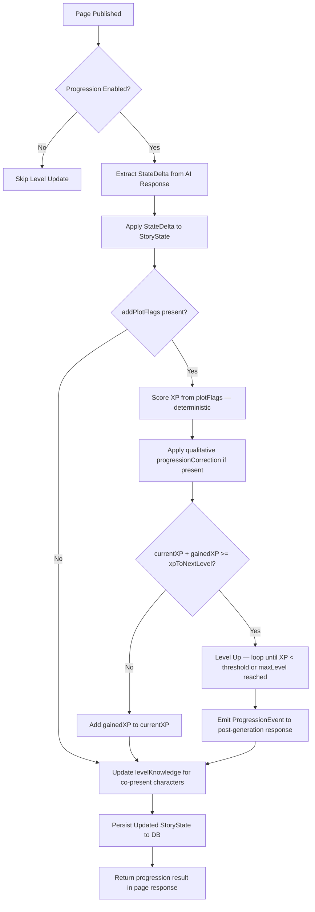
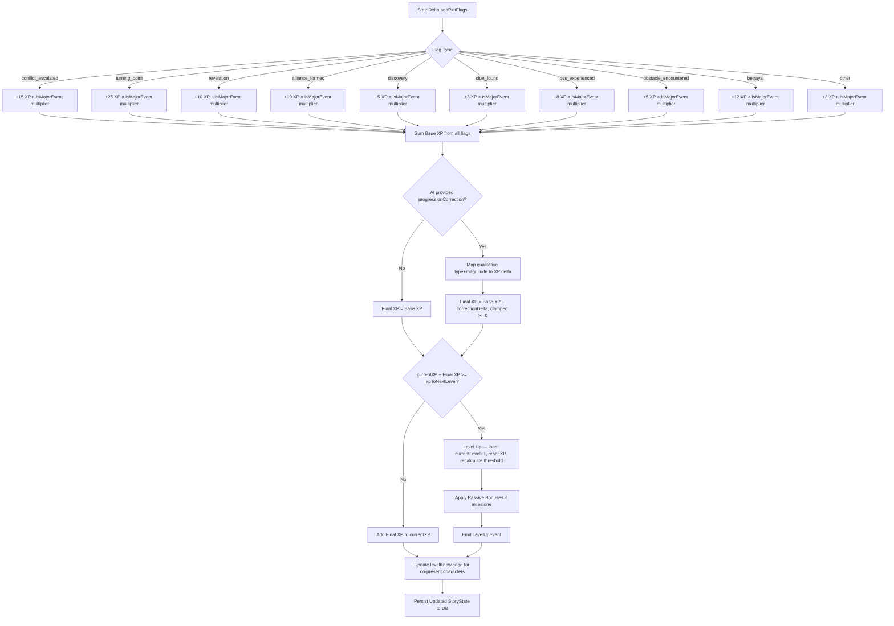
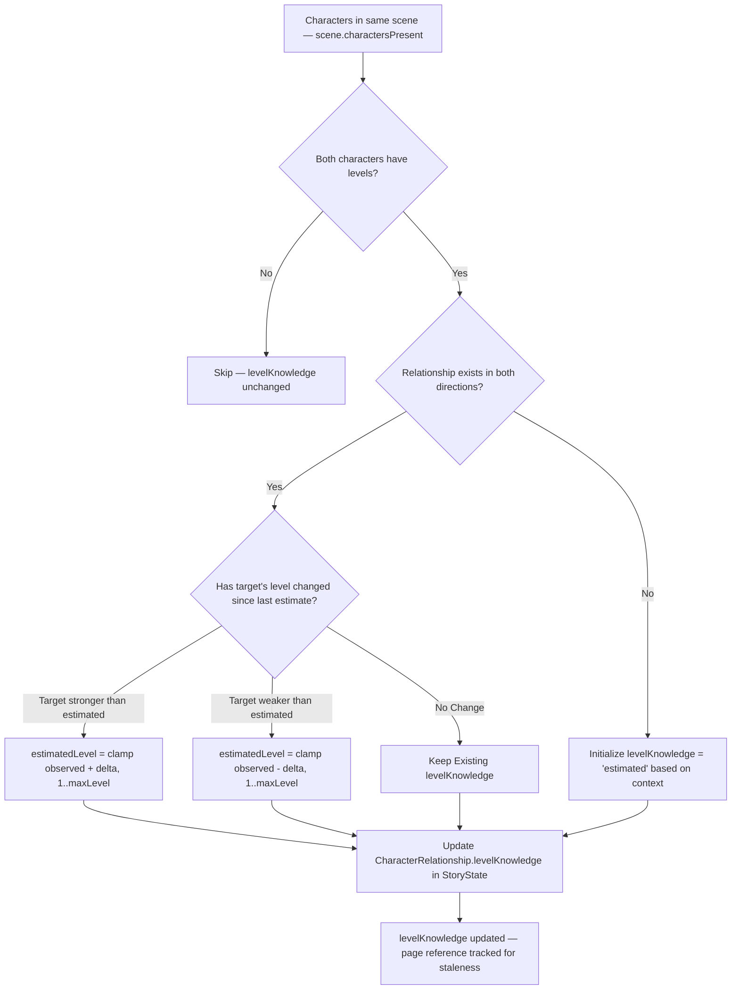
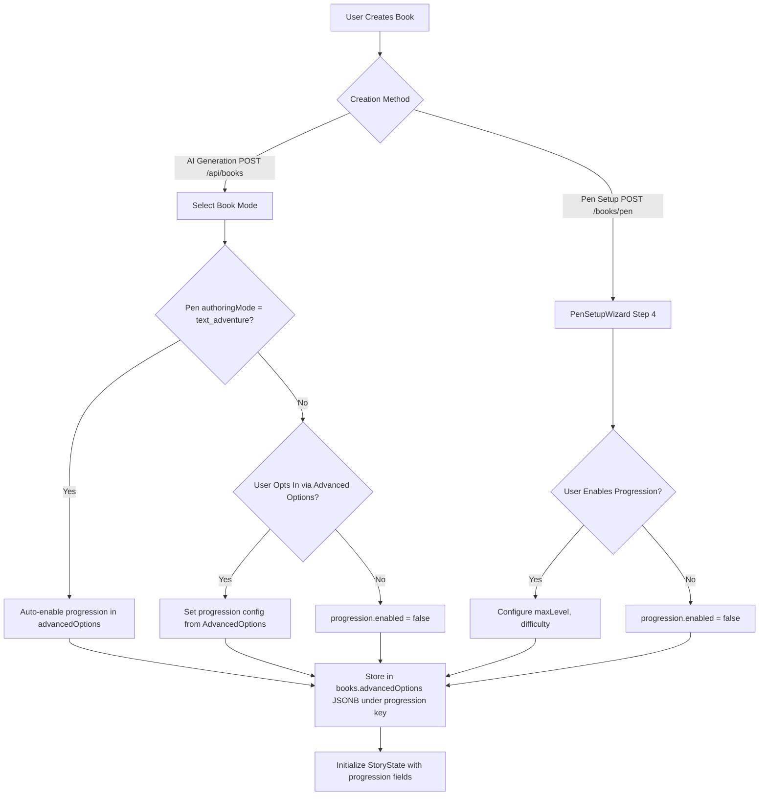

# Character Progression & Leveling System — Roadmap

> **Status:** Draft
> **Author:** Twistloom Engineering
> **Last Updated:** 2026-09-22
> **Related:** `TODO-leveling-system-chatgpt.md` (ChatGPT elaboration)
> **Audit:** See [Appendix B: Audit Trail](#appendix-b-audit-trail) for full critique log

---

## Table of Contents

- [1. Overview](#1-overview)
- [2. Problem Statement](#2-problem-statement)
- [3. Architectural Constraints](#3-architectural-constraints)
- [4. Pros & Cons Analysis](#4-pros--cons-analysis)
- [5. UX/UI Design Plan](#5-uxui-design-plan)
- [6. Mermaid Flow Diagrams](#6-mermaid-flow-diagrams)
- [7. Architecture Design](#7-architecture-design)
- [8. Design Rationale](#8-design-rationale)
- [9. Open Questions & Recommendations](#9-open-questions--recommendations)
- [10. Implementation Phases](#10-implementation-phases)
- [Appendix A: File Reference Matrix](#appendix-a-file-reference-matrix)
- [Appendix B: Audit Trail](#appendix-b-audit-trail)

---

## 1. Overview

The Character Progression System introduces an **optional, engine-owned** character leveling layer to Twistloom stories. It assigns each character an in-world `level` and each named character a per-relationship `levelKnowledge`, making power-aware conflict, mentorship, and world-building a first-class narrative concern — without forcing RPG numbers into every story.

**Core Principles**

| Principle | Rationale |
|-----------|-----------|
| **Optional per-book** | Enabled in the Pen creation wizard or advanced book-generation options; auto-enabled for `text_adventure` authoring mode; AI infers need for original/on-demand generation |
| **Hybrid XP (Engine + AI corrections)** | Base XP is accumulated by the server-side state machine from page events (deterministic, auditable). The AI can inject a bounded qualitative `progressionCorrection` for abnormal-world edge cases (time loops, world resets, cursed items) — following the established `urgencyCorrection` pattern. |
| **Narrative-first visibility** | Levels are visible in-world only when they matter: ReaderPageInfo, lore popover, CastChip in pen editor; hidden by default when they break immersion |
| **Separation of fact & knowledge** | `level` is the objective truth; `levelKnowledge` is a relationship-level belief about another character's level, allowing dramatic irony and estimation mechanics |
| **Progressive disclosure** | MVP ships level + XP + maxLevel only; depth layers (milestone powers, hidden levels, challenges) are additive future work |
| **Single source of truth** | MC level lives in ONE place (`ProgressionState`); NPC levels live on `CharacterMemory.level`. No dual storage, no synchronization bugs. |

---

## 2. Problem Statement

### 2.1 Missing Power-Context in Story Generation

Without explicit power-level data, the AI treats every character as roughly equal unless the author manually narrates dominance via prose. This makes:

- **Power-aware conflict** hard to generate (underdog victories, David-vs-Goliath moments)
- **Mentor/apprentice dynamics** unreliable (AI defaults to flat relationships)
- **World-building** shallow (no reference frame for how formidable a character truly is)
- **Reader comprehension** fragmented (readers must infer relative strength from context alone)

### 2.2 Current State Machine Gaps

The existing state engine (`src/utils/story.ts`) tracks:

- `sanity` / `composure` (MC psychological state)
- `health` / `injuries` (MC physical state)
- `sceneMood` / `sceneTension`
- `storyPhase` / `storyBeatType`
- `bookmarked` / `important` flags

But it has **no concept of**:

- Character progression over time
- Objective power measurement
- Knowledge that one character has about another character's power
- Milestone events that permanently change capability tiers

### 2.3 Reader Engagement Gap

Without progression, the reader has no quantitative hook — no "watching the bar fill up" moment. This is especially acute for:

- **Text Adventure mode** (already interactive; progression reinforces agency)
- **Interactive mode** with branching combat/competition plots
- **Long novels** where power creep is an implicit narrative arc

---

## 3. Architectural Constraints

| Constraint | Impact |
|------------|--------|
| **In-memory LRU caches** (`story-state-cache.ts`) | Level must be serializable in `StoryState` without breaking cache hit rates; avoid storing derived level as a separate cache key |
| **Redis distributed cache** (`cache.ts`) | Level-up milestone events must invalidate the cached state atomically |
| **Credit-constrained generation** (`executeWithCredits`) | Level progression must not trigger additional credit costs; milestone narratives are folded into the next page's generation context, not a separate API call |
| **Serverless deployment** (Vercel) | XP accumulation logic must be stateless across invocations — no in-memory accumulators between page turns |
| **SSE streaming** (`aiStreamSSE`) | Level-up notifications are delivered as post-generation events (after `applyStateDelta` completes), not streamed alongside prose chunks |
| **Database schema** (`src/db/schema.ts`) | Requires adding a `progression` JSONB column to `story_states` (nullable, backward-compatible). The `satisfies Record<keyof StoryState>` exhaustiveness check at `schema.ts:306` enforces that every `StoryState` field must have a corresponding table column. |
| **Multi-provider AI waterfall** | XP rules must be provider-agnostic — same logic regardless of whether Mistral, Gemini, or Cerebras is generating |
| **`StoryState` is a `type` alias** | Cannot use declaration merging. Extensions require modifying the existing `type` definition, not adding a separate `interface`. |

---

## 4. Pros & Cons Analysis

### 4.1 Pros

| Benefit | Description |
|---------|-------------|
| **Narrative depth** | Characters become more than labels — their relative power is a first-class story element |
| **Reader engagement** | Progression hooks ("the MC leveled up!") drive page turns and return visits |
| **World-building consistency** | Engine-owned levels prevent AI from contradicting itself about who is stronger |
| **Conflict resolution** | Power-aware conflict generates naturally when the AI has level data as context |
| **Optional opt-in** | Users who prefer pure prose can disable it entirely; no bloat for those who don't want it |
| **Dramatic irony** | `levelKnowledge` allows the reader to know more than the characters, or vice versa |
| **Leverages existing infrastructure** | Built on top of `StoryState`, `plotFlags`, and the state machine — no new architectural paradigms |

### 4.2 Cons

| Risk | Mitigation |
|------|------------|
| **Complexity increase** | Keep MVP minimal (3 fields on `ProgressionState`); defer depth layers to post-MVP |
| **AI hallucination of levels** | Engine owns base XP via `plotFlags`-based scoring; AI correction is qualitative (type + magnitude), bounded, and auditable — limited blast radius |
| **Over-gameification** | Default `levelVisibility` to `"contextual"` — never shown in raw HUD unless the book opts in |
| **Performance cost** | Level is a single integer on `StoryState`; negligible serialization overhead |
| **Migration burden** | Requires one nullable JSONB column (`progression`) on `story_states` — backward-compatible; existing rows get `NULL` |
| **AI prompt token bloat** | Level context is injected as a single line per character (~280 additional tokens for 10 characters); acceptable for the narrative value |
| **Branch-switching regression** | Level-up notifications suppressed during state reconstruction; one-time "Level context restored" banner on branch switch |

---

## 5. UX/UI Design Plan

### 5.1 Pen Editor (Author-Facing)

| Component | Current Behavior | After Leveling System |
|-----------|------------------|----------------------|
| **CastChip** (`pen/cast/CastChip.tsx`) | Shows avatar, name, presence, role, focus, health | Adds optional `LevelBadge` (small number overlay on avatar) + tooltip with XP progress |
| **PenSetupWizard** (`PenSetupWizard.tsx`) | 3 steps: Story, MC, Cast | Adds optional "Progression" step (4th) when leveling is enabled: set `maxLevel`, initial MC level, world difficulty |
| **SceneCastPanel** (`SceneCastPanel.tsx`) | Lists cast with health/role | Adds level indicator per character row |
| **Book Settings** (within `advancedOptions`) | Advanced options for creativity, tone | Adds `progression` config block with `enabled`, `maxLevel`, `difficulty` |

**Pen Setup Wizard Step 4 UI (MVP):**

```
☐ Enable Level System

Maximum Level: [ 50 ]
Difficulty:    [ Normal ▾ ]

Characters gain levels as the story progresses.
Useful for adventures, RPGs, fantasy, games, and
other progression-focused stories.
```

### 5.2 Reader View (Reader-Facing)

| Component | Current Behavior | After Leveling System |
|-----------|------------------|----------------------|
| **ReaderPageInfo** (`ReaderPageInfo.tsx`) | Shows MC health, sanity, injuries | Adds MC `level` + XP progress bar (if enabled) |
| **PageInfoModal** (`PageInfoModal.tsx`) | Multi-tab: Story, Scene, Timeline | Story tab shows `levelKnowledge` for known characters (e.g., "Level 3 — estimated") |
| **CharacterCard** (lore popover) | Shows character bio, health | Shows level badge + XP-to-next-level in tooltip |
| **Level-Up Toast** (new) | N/A | Non-blocking toast when MC levels up: "You reached Level 4! +2 Composure" |
| **Milestone Modal** (new) | N/A | Optional full-screen modal on milestone levels (5, 10, 15...) showing narrative description |

**Note on bonuses:** Twistloom uses `healthPercent` (derived from injuries) and `composure` (engine-owned SanityState), not additive HP. Level-up bonuses are progression-specific (e.g., "+2 Composure" which increases `maxComposure`) or narrative abilities — not "+5 HP".

### 5.3 Visual Design Tokens

```typescript
// New config: src/lib/config/progression.ts
export const LEVEL_COLORS = {
  1:  { bg: '#94a3b8', text: '#ffffff', glow: '#64748b' },   // Slate
  2:  { bg: '#60a5fa', text: '#ffffff', glow: '#3b82f6' },   // Blue
  3:  { bg: '#a78bfa', text: '#ffffff', glow: '#8b5cf6' },   // Violet
  4:  { bg: '#f472b6', text: '#ffffff', glow: '#ec4899' },   // Pink
  5:  { bg: '#fbbf24', text: '#1e1b4b', glow: '#f59e0b' },   // Gold (milestone)
  // ... escalates to tier-based
} as const;

export const XP_BAR_HEIGHT = 4;  // px, thin line beneath character name
export const LEVEL_BADGE_SIZE = 20; // px, circular overlay on avatar
```

---

## 6. Mermaid Flow Diagrams

### 6.1 Page Generation → State Delta → Level Update Flow



### 6.2 XP Accumulation Engine Logic (Hybrid: Engine Base + AI Correction)



### 6.3 Relationship Level Knowledge Update Flow



### 6.4 Book Creation → Progression Config Flow



---

## 7. Architecture Design

### 7.1 Type Extensions

```typescript
// src/types/story.ts — StateDelta extension
// NOTE: StateDelta is a `type` alias, not `interface` — must modify the existing type.
// Add to the existing StateDelta type:

export type StateDelta = {
  // ... existing fields ...

  /**
   * AI-owned qualitative correction for abnormal-world edge cases.
   * Follows the established `urgencyCorrection` pattern (src/types/story-thread.ts).
   *
   * The engine handles 90% of cases via deterministic plotFlag scoring.
   * This field is ONLY for when the deterministic result is wrong for the narrative:
   * - Time loops/skips: MC retains mastery from previous loops
   * - World reset: MC loses progress due to temporal displacement
   * - Abnormal physics: level operates differently in this realm
   * - Cursed/blessed item: temporary level shift
   *
   * The correction is ADDITIVE to the engine's base XP.
   * The AI provides a QUALITATIVE type + magnitude; the engine maps to XP delta.
   */
  progressionCorrection?: {
    /** Qualitative correction type — the engine maps this to an XP delta. */
    type: "retained_mastery" | "lost_progress" | "abnormal_realm" | "cursed_item" | "blessed_item";
    /** Bounded magnitude — the engine scales the XP delta by this. */
    magnitude: "minor" | "moderate" | "major";
    /** Brief explanation of why this correction is needed (audit trail). */
    reason: string;
  };
};

// src/types/story.ts — ProgressionState (MVP)
// Add as a new type, then add `progression?: ProgressionState` to StoryState.

export type ProgressionState = {
  /** MC's current level (1..maxLevel). SSOT for MC level. */
  currentLevel: number;
  /** XP accumulated toward next level */
  currentXP: number;
  /** XP required to reach the next level — computed on-the-fly, NOT stored.
   *  See computeXpToNextLevel(). */
  lastXpAwarded: number;
  /** MC's knowledge about NPC levels. Keyed by characterId. */
  mcLevelKnowledge: Record<string, {
    levelKnowledge: "unknown" | "estimated" | "known";
    estimatedLevel?: number;
    estimatedAtPage?: number;
  }>;
};

// src/types/character.ts — CharacterMemory extension
// NPC levels live here. MC level does NOT — MC uses ProgressionState.
// NOTE: CharacterMemory is a `type` alias, not `interface`.

export type CharacterMemory = {
  // ... existing fields ...
  /** NPC's own level. Optional — not every character has a level.
   *  MC level is NOT stored here (SSOT is ProgressionState.currentLevel). */
  level?: number;
};

// src/types/character.ts — CharacterRelationship extension
// Add to CharacterRelationshipContext (which is used in both
// CharacterMemory.relationships and CharacterMemory.relationshipToMC).

export type CharacterRelationshipContext = {
  // ... existing fields ...
  /** How much this character knows about the other's actual level. */
  levelKnowledge?: "unknown" | "estimated" | "known";
  /** The estimated level this character believes the other is at. */
  estimatedLevel?: number;
  /** Page when this estimate was last updated (for staleness detection). */
  estimatedAtPage?: number;
};

// src/types/book-creation.ts — AdvancedOptionsConfig extension
// progressionConfig lives inside advancedOptions (not a new column).

export interface AdvancedOptionsConfig {
  // ... existing fields ...
  progression?: {
    enabled: boolean;
    maxLevel: number;        // 2..100, default 50
    difficulty: "easy" | "normal" | "hard" | "nightmare";  // affects XP thresholds
  };
}
```

### 7.2 Database Schema Extension

```sql
-- story_states table addition (JSONB, nullable, backward-compatible)
ALTER TABLE story_states ADD COLUMN progression JSONB DEFAULT NULL;
-- Example value:
-- { "currentLevel": 7, "currentXP": 4820, "lastXpAwarded": 250,
--   "mcLevelKnowledge": { "alice": { "levelKnowledge": "known", "estimatedLevel": 12 } } }

-- books table: NO new column needed
-- progressionConfig lives inside the existing `advanced_options` JSONB column
-- as `advancedOptions.progression`. This follows the existing pattern for
-- book-level configuration knobs (writingPreset, creativity, etc.).
```

**Migration note:** The `satisfies Record<keyof StoryState>` exhaustiveness check at `src/db/schema.ts:306` enforces that every `StoryState` field must have a corresponding column. Adding `progression?: ProgressionState` to `StoryState` requires adding the `progression` JSONB column to `story_states`. Existing rows will have `NULL`, which `applyStateDelta` treats as "progression not yet initialized."

### 7.3 New Backend Module: `src/utils/progression.ts`

```typescript
/**
 * Core progression engine — scores plot flags and manages level progression.
 *
 * HYBRID MODEL:
 * - Base XP is always engine-owned (deterministic, auditable)
 * - AI can inject a bounded qualitative `progressionCorrection` for edge cases
 * - Follows the established `urgencyCorrection` pattern (src/types/story-thread.ts)
 * - The correction is ADDITIVE and clamped, not a replacement
 *
 * XP SOURCE: Uses existing `plotFlags` from StateDelta — no new AI output fields.
 * The `addPlotFlags` array already categorizes narrative events into types like
 * `conflict_escalated`, `turning_point`, `alliance_formed`, etc.
 *
 * It follows the same architectural pattern as story-state-cache.ts:
 * - Pure functions that take StoryState and return updated StoryState
 * - No side effects (no DB writes, no cache mutations)
 * - Called from applyStateDelta() in story.ts after processing narrative deltas
 */

import type { StateDelta, StoryState, ProgressionState } from "../types/story.js";
import type { PlotFlagType } from "../types/story.js";

// --- XP Table (maps plotFlagTypes to base XP values) ---

export const XP_BY_FLAG_TYPE: Record<PlotFlagType, number> = {
  conflict_escalated: 15,
  turning_point: 25,
  revelation: 10,
  alliance_formed: 10,
  discovery: 5,
  clue_found: 3,
  loss_experienced: 8,
  obstacle_encountered: 5,
  betrayal: 12,
  threat_emerged: 7,
  mystery_started: 2,
  other: 2,
};

/** Multiplier applied when isMajorEvent is true */
export const MAJOR_EVENT_MULTIPLIER = 2;

// --- Qualitative Correction Mapping ---

export type ProgressionCorrectionType = "retained_mastery" | "lost_progress" | "abnormal_realm" | "cursed_item" | "blessed_item";
export type ProgressionCorrectionMagnitude = "minor" | "moderate" | "major";

/** Maps qualitative correction to XP delta. Engine-owned, not AI-controlled. */
export const CORRECTION_XP_MAP: Record<ProgressionCorrectionType, Record<ProgressionCorrectionMagnitude, number>> = {
  retained_mastery: { minor: 10, moderate: 25, major: 40 },
  lost_progress:    { minor: -10, moderate: -25, major: -40 },
  abnormal_realm:   { minor: 8, moderate: 15, major: 25 },
  cursed_item:      { minor: -5, moderate: -15, major: -30 },
  blessed_item:     { minor: 5, moderate: 15, major: 30 },
};

export const CORRECTION_CLAMP = { min: -50, max: 50 };

// --- Core Functions ---

/**
 * Score XP from plot flags in the state delta.
 * Deterministic — same flags always yield same XP.
 */
export function scorePlotFlags(
  stateDelta: StateDelta,
  isMajorEvent: boolean
): { totalXP: number; scoredFlags: Array<{ type: PlotFlagType; xp: number }> }

/**
 * Process the AI's qualitative progression correction.
 * Maps type + magnitude to XP delta via CORRECTION_XP_MAP.
 * Clamped to [CORRECTION_CLAMP.min, CORRECTION_CLAMP.max].
 */
export function processProgressionCorrection(
  baseXP: number,
  correction: StateDelta["progressionCorrection"]
): { finalXP: number; applied: boolean; delta: number }

/**
 * Calculate level-up with loop for multi-level gains.
 * Returns all levels gained (not just a boolean).
 */
export function calculateLevelUp(
  currentXP: number,
  currentLevel: number,
  gainedXP: number,
  maxLevel: number
): {
  newLevel: number;
  newXP: number;
  levelsGained: number;
  milestoneLevels: number[];  // which levels were milestone (5, 10, 15...)
}

/**
 * Compute XP required for next level.
 * Book-length-aware formula: scales to maxLevel and book length.
 *
 * Formula: baseXP * (1 + 0.12 * level) * difficultyFactor
 * - baseXP = max(15, bookLength / maxLevel * avgXpPerPage)
 * - difficultyFactor: easy=0.8, normal=1.0, hard=1.3, nightmare=1.6
 *
 * For a 50-page book with maxLevel=10: ~75-120 XP per level
 * For a 200-page book with maxLevel=20: ~150-300 XP per level
 */
export function computeXpToNextLevel(
  level: number,
  maxLevel: number,
  bookLength: number,
  difficulty: "easy" | "normal" | "hard" | "nightmare"
): number

/**
 * Initialize ProgressionState for a new book.
 * Called during book creation when progression is enabled.
 */
export function createInitialProgressionState(
  initialLevel: number,
  maxLevel: number,
  bookLength: number,
  difficulty: "easy" | "normal" | "hard" | "nightmare"
): ProgressionState

/**
 * Update levelKnowledge for all characters present in the same scene.
 * Called from applyStateDelta after processing relationship updates.
 * Uses scene.charactersPresent (NOT presenceInScene — that field doesn't exist).
 */
export function updateLevelKnowledgeForScene(
  storyState: StoryState,
  scene: StoryScene
): ProgressionState
```

**Correction-to-XP mapping reference:**

| Type × Magnitude | minor | moderate | major |
|---|---|---|---|
| `retained_mastery` | +10 | +25 | +40 |
| `lost_progress` | -10 | -25 | -40 |
| `abnormal_realm` | +8 | +15 | +25 |
| `cursed_item` | -5 | -15 | -30 |
| `blessed_item` | +5 | +15 | +30 |

**Processing flow in `applyStateDelta`:**
```typescript
// 1. Score XP from existing plotFlags (deterministic, no new AI fields)
const { totalXP: baseXP } = scorePlotFlags(stateDelta, stateDelta.isMajorEvent ?? false);

// 2. AI correction is qualitative — engine maps to XP delta
const { finalXP } = processProgressionCorrection(baseXP, stateDelta.progressionCorrection);

// 3. Calculate level-up with multi-level support
const { newLevel, newXP, levelsGained, milestoneLevels } = calculateLevelUp(
  progression.currentXP, progression.currentLevel, finalXP, maxLevel
);

// 4. Update progression state
progression.currentLevel = newLevel;
progression.currentXP = newXP;
progression.lastXpAwarded = finalXP;

// 5. Update levelKnowledge for co-present characters
if (scene?.charactersPresent) {
  progression.mcLevelKnowledge = updateLevelKnowledgeForScene(storyState, scene);
}
```

### 7.4 Integration Points

| File | Change | Description |
|------|--------|-------------|
| `src/utils/story.ts` | Modify `applyStateDelta` | After processing health/sanity/scene changes, call `scorePlotFlags()` → `processProgressionCorrection()` → `calculateLevelUp()` → update `StoryState.progression`. Add `updateLevelKnowledgeForScene()` call. |
| `src/schema/story.ts` | Extend `STORY_STATE_GENERATION_SCHEMA` | Add optional `progressionCorrection` object (type, magnitude, reason) to the state delta schema — follows `urgencyCorrection` pattern in `UPDATE_THREAD_SCHEMA`. |
| `src/utils/prompt.ts` | Extend prompt template | Add field instruction: "progressionCorrection: ONLY for abnormal-world edge cases (time loops, world resets, abnormal physics, cursed items). NEVER for ordinary page events." |
| `src/utils/field-instructions.ts` | Add field instruction | Add `progressionCorrection` instruction alongside existing `urgencyCorrection` and `familiarityCorrection` instructions. |
| `src/services/book-creation.ts` | Extend `CreateBookParams` | Accept `progression` config from `advancedOptions.progression`, persist to `books.advancedOptions`. |
| `src/routes/books.ts` | Extend advanced options schema | Add `progression` to the validation schema for the async book creation route. |
| `src/db/schema.ts` | Add `progression` column | Add nullable `progression` JSONB column to `storyStates` table. Migration required. |
| `src/utils/companion-stream.ts` | Add post-generation progression event | After `applyStateDelta` completes, emit a `progression` SSE event in the response payload (not streamed alongside prose). |

### 7.5 Frontend Integration Points

> **Note:** Frontend files live in separate repos (`Twistloom-web`, `Twistloom-expo`, `Twistloom-flutter`). The paths below reference the conceptual component names — actual file paths vary per repo.

| Component | Change | Description |
|-----------|--------|-------------|
| `lib/config/progression.ts` | **New file** | Level colors, XP bar tokens, milestone definitions |
| `pen/cast/CastChip.tsx` | Add `LevelBadge` | Optional number overlay on avatar when progression is enabled |
| `reader/ReaderPageInfo.tsx` | Add level display | Show MC level + XP progress bar in the story info panel |
| `reader/PageInfoModal.tsx` | Add levelKnowledge tab | Show each known character's estimated level in the Story tab |
| `reader/LevelUpToast.tsx` | **New file** | Non-blocking toast notification on level-up |
| `reader/MilestoneModal.tsx` | **New file** | Full-screen modal on milestone levels (5, 10, 15...) |
| `pen/PenSetupWizard.tsx` | Add Step 4 | Optional progression configuration step in the Pen creation wizard |
| `lib/types/story.ts` | Add `ProgressionState` type | Mirror backend type for frontend consumption |

---

## 8. Design Rationale

### 8.1 Why Hybrid XP (Engine Base + AI Corrections)

The engine owns base XP accumulation because:

- **Deterministic**: Same events always yield the same XP — no randomness from model temperature
- **Auditable**: Every XP gain has a source event, flag type, and timestamp
- **Consistent**: The AI focuses on narrating; the engine focuses on scoring
- **Testable**: Pure functions with no side effects — trivially unit-testable

But the engine alone cannot handle **abnormal-world edge cases** where the deterministic formula produces nonsensical results:

- Time loops where the MC retains mastery across iterations
- World resets that strip accumulated power
- Abnormal physics where level operates differently
- Cursed or blessed items that temporarily shift capability

The AI's `progressionCorrection` (analogous to `urgencyCorrection`) provides a bounded additive delta for these cases. The AI signals the *type* and *magnitude* of the correction; the engine maps it to an XP value via a fixed table. This keeps the AI away from raw numbers (it's good at categorical judgment but bad at calibrated XP magnitudes).

### 8.2 Why `plotFlags` Instead of `extractProgressionHints`

The original design proposed a new `extractProgressionHints()` function that would "parse the AI's narrative output for progression-relevant signals." This was technically unviable — the `StateDelta` carries no signals about whether a conflict was "resolved" vs. "escalated," or whether a "bond was formed" vs. "betrayed."

The existing `plotFlags` system already categorizes narrative events into typed flags (`conflict_escalated`, `turning_point`, `revelation`, `alliance_formed`, etc.) that the AI already generates. By mapping these directly to XP values:

- **Zero new AI output fields needed** — uses existing `addPlotFlags` in `StateDelta`
- **Deterministic** — same flags always yield same XP
- **Provider-agnostic** — all AI providers generate `plotFlags` already
- **Auditable** — every XP gain traces to a specific flag type

The `isMajorEvent` boolean (already computed in `extractStateDelta`) serves as a 2× multiplier for high-impact pages.

### 8.3 Why Qualitative `progressionCorrection` (Not a Number)

The original design gave the AI a `{ xpDelta: number }` field. This reintroduces hallucination risk — the AI has no calibration for what "+30 XP" means relative to `xpToNextLevel`. It's fundamentally different from `urgencyCorrection` (which adjusts a 0–1 scale the AI already conceptualizes).

The qualitative approach (`type` + `magnitude`) keeps the AI in its strength zone — categorical judgment — while the engine handles the numeric mapping. The AI says "this is a major time loop effect"; the engine maps it to +40 XP via `CORRECTION_XP_MAP`.

**DRY note:** The `reason` field in `progressionCorrection` is an audit trail not present in `urgencyCorrection` or `familiarityCorrection`. This is a deliberate deviation for financial integrity — XP directly affects game state. If audit trails become valuable for other corrections, they should be added to all of them retroactively.

### 8.4 Why `level` + `levelKnowledge` (Not Just `level`)

Storing only `level` on each character would create a flat, omniscient view. By separating:

- **`level`** (on `CharacterMemory` for NPCs, `ProgressionState` for MC): The objective truth
- **`levelKnowledge`** (on `CharacterRelationship` + `ProgressionState.mcLevelKnowledge`): What a character *believes* about another's level

...the system enables:

- **Dramatic irony**: The reader knows the MC is Level 8, but the antagonist only estimates Level 5
- **Mentor dynamics**: A mentor's `levelKnowledge` of the MC grows from `"unknown"` to `"estimated"` to `"known"` as they train together
- **Surprise encounters**: A character underestimated (levelKnowledge = 3) reveals themselves at level 7
- **Narrative tension**: The AI generates prose that reflects the *knowledge gap* between characters

**MC→NPC knowledge:** Since the MC is NOT stored in `storyState.characters` (the MC has a separate `StoryMC` type), MC→NPC `levelKnowledge` lives on `ProgressionState.mcLevelKnowledge` (a `Record<string, ...>` keyed by characterId). NPC→MC and NPC→NPC knowledge lives on `CharacterRelationship.levelKnowledge`.

### 8.5 Why `level` is Optional on `CharacterMemory`

Not every character in a progression-enabled book needs a level. A shopkeeper, a child, or a background character might not have a combat-relevant level. Making `level?: number` (optional) allows the engine to treat characters without levels as "level unknown" — the AI can still reference them narratively without forcing numeric assignment.

### 8.6 Why Optional Per-Book (Not Global Toggle)

Making progression global would:

- Break stories where progression is tonal pollution (slice-of-life, romance)
- Force all authors into RPG-adjacent writing
- Increase cognitive load for readers who don't want it

By making it optional per-book:

- **Text adventure authoring mode** auto-enables it (progression is inherent to the genre)
- **Novel mode** defaults to off (pure prose, no numbers)
- **Interactive mode** lets the author choose (branching + progression = rich agency)
- **Multiverse mode** lets the author choose (parallel timelines with progression = complex but compelling)

### 8.7 Why `progressionConfig` Lives in `advancedOptions` (Not a New Column)

The `books` table already has an `advancedOptions` JSONB column typed as `AdvancedOptionsConfig`. Adding progression config there:

- Avoids a new column on `books` (no migration for books table)
- Follows the existing pattern for book-level configuration knobs (writingPreset, creativity, etc.)
- Keeps book-creation configuration in a single JSONB

The `progression` column is only added to `story_states` (where progression state actually lives), not to `books`.

### 8.8 Why No New Database Tables (MVP)

The `story_states` table already stores the full game state. Adding `progression` as a nested object inside the JSONB:

- Requires only one nullable column migration
- Follows the existing pattern for `sanity`, `composure`, `health`, `injuries`, `sceneMood`, etc.
- Is trivially serializable/deserializable
- Fits within the existing LRU cache structure (`StoryStateCacheEntry`)
- Can be added to existing story states without any data migration (NULL = not initialized)

New tables (e.g., `xp_events_log`) are a post-MVP consideration for analytics and audit trails.

### 8.9 Why `progressionCorrection` in StateDelta (Not a Separate AI Call)

The AI already generates a `stateDelta` at the end of each page. Adding a `progressionCorrection` object to that delta:

- Costs zero additional tokens (it's 3 lines in the existing output format)
- Requires no additional API call (no latency, no credit cost)
- Stays within the existing streaming architecture (`pipeSSEStreamAndExtractText`)
- Is backward-compatible (the field is optional — old pages without it work fine)
- Follows the established `urgencyCorrection` pattern — same architecture, same processing

**Credit note:** Milestone narratives are folded into the next page's generation context (the AI is told "MC just leveled up, incorporate this into the narrative"), not a separate API call. This keeps progression zero-cost.

### 8.10 Why the Correction is Additive (Not Override)

The correction follows `urgencyCorrection`'s design: it is **additive to the base XP**, not a replacement. This is deliberate:

- **Additive (correct pattern)**: `finalXP = baseXP + correction`. The engine's deterministic scoring always runs. The AI shifts the result up or down within a bounded range. Normal stories work identically with or without the correction.
- **Override (wrong pattern)**: `finalXP = correction`. The engine's scoring is discarded. The AI controls XP entirely. This reintroduces hallucination risk and defeats the purpose of the engine.

The `familiarityCorrection` pattern (`src/types/places.ts:206`) was a cautionary tale — the correction was applied then immediately overwritten by `calculatePlaceFamiliarity()`, making it a no-op. **This has been fixed** (see `src/utils/places.ts:136-147`): the deterministic formula now runs first, and the AI correction is applied as an additive delta *after*, matching the `urgencyCorrection` pattern. The `progressionCorrection` follows this same corrected design from the start.

### 8.11 Why Book-Length-Aware XP Scaling

A fixed XP formula (`100 * level^1.5`) creates an MMO-tuned curve that doesn't fit Twistloom's story lengths. At 20 XP/page, a Level 5+ character would need hundreds of pages to level up — inappropriate for a 20–80 page story.

The book-length-aware formula targets level-ups approximately every `(bookLength / maxLevel)` pages, using `avgXpPerPage` (estimated 15) as a scaling factor. This ensures:

- **50-page book, maxLevel 10**: ~5 pages per level, ~75–120 XP/level
- **200-page book, maxLevel 20**: ~10 pages per level, ~150–300 XP/level
- **Difficulty modifiers** let authors fine-tune pacing without changing the formula

---

## 9. Open Questions & Recommendations

### Q1: Should levels be visible in the reader by default?

| Option | Pros | Cons |
|--------|------|------|
| **A: Always visible** | Reader always has context | Breaks immersion in literary stories |
| **B: Never visible** | Pure prose experience | Reader misses progression hooks |
| **C: Contextual (default)** | Visible when relevant, hidden when not | Requires AI to signal when to show/hide |
| **D: Author-controlled** | Full author agency | Extra config burden |

**Recommendation:** **C (Contextual)** — Show level in `ReaderPageInfo` always, but hide the `LevelBadge` on `CastChip` unless the author explicitly enables `"levelVisibility": "always"` in the book's progression config. This gives the reader the data without cluttering the prose view.

### Q2: Should XP scale with book difficulty?

| Option | Pros | Cons |
|--------|------|------|
| **A: Fixed XP table** | Predictable, easy to balance | Same difficulty regardless of story tone |
| **B: Difficulty-scaled thresholds** | XP requirements adjust to difficulty | Harder to predict; more config |
| **C: AI-suggested difficulty** | Adaptive to narrative | AI hallucination risk |

**Recommendation:** **B (Difficulty-scaled thresholds)** — The `difficulty` field multiplies the XP-to-next-level threshold (easy=0.8×, normal=1.0×, hard=1.3×, nightmare=1.6×). XP awarded stays fixed; the author controls how fast characters level. This keeps the scoring engine deterministic while letting authors tune pacing.

### Q3: How should milestone levels (5, 10, 15...) be handled?

| Option | Pros | Cons |
|--------|------|------|
| **A: Just a number** | Minimal implementation | Loses narrative weight |
| **B: Passive bonus only** | Engine-applied (e.g., +2 Composure) | No narrative event |
| **C: Milestone event + bonus** | Full narrative moment | Requires AI to generate the event |
| **D: Milestone event (AI) + optional bonus** | Author chooses | More complex |

**Recommendation:** **D (Milestone event + optional bonus)** — On milestone levels, the engine adds a `milestoneEvent` to the state delta, and the AI generates a brief narrative paragraph about the level-up. The bonus is optional (configured per-book). The milestone narrative is incorporated into the *next page's* generation context, not a separate API call (zero credit cost).

### Q4: How should `levelKnowledge` update automatically?

| Option | Pros | Cons |
|--------|------|------|
| **A: Automatic (every page)** | Always current | Unrealistic — characters don't re-assess every page |
| **B: On encounter only** | Realistic | Might lag behind actual level |
| **C: Hybrid — auto-decay + encounter refresh** | Balanced | More complex |

**Recommendation:** **B (On encounter only)** for MVP. `levelKnowledge` updates only when two characters are in the same scene together (i.e., both in `scene.charactersPresent`). This is simple to implement, realistic, and creates natural information asymmetry.

**Implementation note:** The field is `scene.charactersPresent` on the `StoryScene` type — NOT `presenceInScene` (which does not exist in the codebase).

### Q5: How should the AI's progressionCorrection interact with engine scoring?

| Option | Pros | Cons |
|--------|------|------|
| **A: Qualitative correction (default)** | Engine scoring always runs; AI provides type+magnitude | AI may misuse for ordinary events |
| **B: Override** | AI has full control | Reintroduces hallucination risk |
| **C: Engine validates, then applies** | Balanced | More complex |
| **D: No correction at all** | Purely deterministic | Cannot handle abnormal-world edge cases |

**Recommendation:** **A (Qualitative correction)** — The engine always scores base XP from `plotFlags`. The AI can inject a bounded `progressionCorrection` with a qualitative `type` and `magnitude` for abnormal-world edge cases. The engine maps this to an XP delta via `CORRECTION_XP_MAP`. This follows the `urgencyCorrection` pattern: the engine handles 90% of cases, the AI handles the 10% that require narrative context. The field instruction explicitly states: "NEVER for ordinary page events." Combined with the fixed mapping and clamp, misuse has limited blast radius.

### Q6: Should progression data be included in the explore/bookshelf UI?

| Option | Pros | Cons |
|--------|------|------|
| **A: No** | Keeps explore clean | Reader can't preview progression books |
| **B: Yes, as a badge** | Visual discoverability | UI noise |
| **C: Yes, as a filter** | Targeted discovery | Extra filter complexity |

**Recommendation:** **C (Filter)** — Add a "Has Progression" toggle to the explore filter bar (`BookModeFilter.tsx` pattern). Books with `advancedOptions.progression.enabled` show a small progression icon. This is discoverable without being intrusive.

### Q7: How should retroactive progression work for existing books?

| Option | Pros | Cons |
|--------|------|------|
| **A: Not supported** | Clean | Existing books can't opt in |
| **B: Opt-in retroactive calculation** | Backward-compatible | Computationally expensive |
| **C: Start from current page** | Quick | Incomplete XP history |

**Recommendation:** **C (Start from current page)** — If an existing book enables progression, XP accumulation begins from the current page forward. The MC's initial level defaults to 1 (or configurable). No attempt is made to retroactively score past pages.

### Q8: How should progression behave when disabled mid-book or on branch switch?

| Option | Pros | Cons |
|--------|------|------|
| **A: Freeze — state persists but no new XP** | Simple | Stale data clutters state |
| **B: Hide — UI hides progression, state persists** | Clean UX | State still serialized |
| **C: Strip — remove progression from state** | Clean state | Irreversible; loses data |

**Recommendation:** **B (Hide)** — When progression is disabled (author toggles off), the UI hides all progression elements. `ProgressionState` persists in the DB but is not displayed. If re-enabled, progression resumes from the frozen state. On branch switch, level-change notifications are suppressed during state reconstruction; a one-time "Level context restored" banner shows the current level.

### Q9: How should NPC levels be assigned?

| Option | Pros | Cons |
|--------|------|------|
| **A: AI-authored in CharacterMemory** | Flexible | Inconsistent across providers; hallucination risk |
| **B: Engine-inferred from importance/role/phase** | Deterministic | Less author control |
| **C: Author-configured in Pen** | Precise | Extra config burden |
| **D: Hybrid — engine infers, author overrides** | Balanced | More complex |

**Recommendation:** **D (Hybrid)** — For MVP, the engine infers NPC levels based on `importance` (major→higher range), `relationshipToMC.type` (mentor→MC+3..5, rival→MC±2), and `storyPhase` (EARLY→lower, LATE→higher). The author can override individual NPC levels in Pen mode. This keeps NPC level assignment deterministic and provider-agnostic while allowing author intent.

### Q10: How should the XP breakdown be surfaced to the reader?

| Option | Pros | Cons |
|--------|------|------|
| **A: Just "You earned X XP"** | Simple | Opaque — reader doesn't know why |
| **B: Breakdown popover on XP bar** | Transparent, educational | More UI work |
| **C: Narrative integration only** | Immersive | No quantitative hook |

**Recommendation:** **B (Breakdown popover)** — Show a small popover when the reader taps the XP bar, listing: `conflict_escalated +15, turning_point +25, isMajorEvent ×2`. This provides the "why" behind XP gains and reinforces the progression hook. Data comes from `lastPageXpBreakdown` (a lightweight field on `ProgressionState` for the current page only).

---

## 10. Implementation Phases

### Prerequisites / Already Complete

| Task | Status |
|------|--------|
| Fix `familiarityCorrection` no-op bug (`src/utils/places.ts`) | ✅ Done |

### Phase 1: MVP — Core Engine (2-3 weeks)

**Goal:** Character level + XP + maxLevel in the state engine, with basic UI.

| Task | Files | Effort |
|------|-------|--------|
| Add `ProgressionState` type | `src/types/story.ts` | S |
| Add `progression?: ProgressionState` to `StoryState` | `src/types/story.ts` | S |
| Add `level?: number` to `CharacterMemory` | `src/types/character.ts` | S |
| Add `levelKnowledge`, `estimatedLevel`, `estimatedAtPage` to `CharacterRelationshipContext` | `src/types/character.ts` | S |
| Add `progression?` to `AdvancedOptionsConfig` | `src/types/book-creation.ts` | S |
| Add `progression` JSONB column to `story_states` | `src/db/schema.ts` (migration) | S |
| Implement `src/utils/progression.ts` (scorePlotFlags, processProgressionCorrection, calculateLevelUp, computeXpToNextLevel, createInitialProgressionState, updateLevelKnowledgeForScene) | `src/utils/progression.ts` (new) | L |
| Integrate into `applyStateDelta` | `src/utils/story.ts` | M |
| Add `progressionCorrection` to AI output schema | `src/schema/story.ts` | S |
| Add `progressionCorrection` field instruction to prompt template | `src/utils/prompt.ts`, `src/utils/field-instructions.ts` | S |
| Accept `progression` in `advancedOptions` during book creation | `src/routes/books.ts`, `src/services/book-creation.ts` | M |
| Add level display to `ReaderPageInfo` | `src/components/reader/ReaderPageInfo.tsx` | S |
| Add `LevelBadge` to `CastChip` | `src/components/pen/cast/CastChip.tsx` | S |
| Add `ProgressionState` type to frontend | `src/lib/types/story.ts` | S |
| Unit tests for `progression.ts` | `tests/utils/progression.test.ts` | M |

### Phase 2: Reader Experience (1-2 weeks)

**Goal:** Level-up notifications, milestone modals, relationship knowledge display.

| Task | Files | Effort |
|------|-------|--------|
| Implement `LevelUpToast` | `src/components/reader/LevelUpToast.tsx` (new) | S |
| Implement `MilestoneModal` | `src/components/reader/MilestoneModal.tsx` (new) | M |
| Add `levelKnowledge` to `PageInfoModal` Story tab | `src/components/reader/PageInfoModal.tsx` | M |
| Emit post-generation `progression` event | `src/utils/companion-stream.ts` | M |
| Add progression config to PenSetupWizard Step 4 | `src/components/pen/PenSetupWizard.tsx` | M |
| Add progression config to advanced options UI | `src/components/home/StoryGeneratorInput.tsx` | S |
| Implement XP breakdown popover | `src/components/reader/XpBreakdownPopover.tsx` (new) | M |

### Phase 3: Depth Layers (Post-MVP, 2-3 weeks)

**Goal:** Level visibility controls, milestone abilities, hidden levels, analytics.

| Task | Files | Effort |
|------|-------|--------|
| Add `levelVisibility` config (hidden/contextual/always) | Book config, CastChip, ReaderPageInfo | M |
| Add milestone ability processing | `src/utils/progression.ts` | M |
| Add XP event audit log table | `src/db/schema.ts` (migration) | M |
| Add progression analytics to player profile | `src/utils/player-profile.ts` | S |
| Add "Has Progression" explore filter | `src/components/books/filters/BookModeFilter.tsx` | S |
| Add progression badge to book cards | Explore UI components | S |

### Phase 4: Advanced Features (Future)

| Feature | Description |
|---------|-------------|
| **Challenge system** | Characters can challenge each other; XP awarded based on level delta |
| **Companion progression** | Named companions have their own XP track (separate from MC) |
| **Retroactive scoring** | AI-assisted reconstruction of XP history for existing books |
| **Progression leaderboard** | Compare MC levels across books (per user) |
| **Milestone ability unlocks** | Custom abilities granted at specific levels (author-configurable) |
| **Level-aware action generation** | Actions filtered/suggested based on level delta with encountered characters |
| **Multi-dimensional progression** | Skills, ranks, factions, reputation as additional progression axes |

---

## Appendix A: File Reference Matrix

| Current File | Role in Leveling System |
|--------------|------------------------|
| `src/types/story.ts` | Extend `StoryState` with `progression?: ProgressionState`; add `ProgressionState` type; extend `StateDelta` with `progressionCorrection` |
| `src/types/character.ts` | Add `level?: number` to `CharacterMemory`; add `levelKnowledge`, `estimatedLevel`, `estimatedAtPage` to `CharacterRelationshipContext` |
| `src/types/book-creation.ts` | Add `progression?` to `AdvancedOptionsConfig` |
| `src/utils/story.ts` | Call progression engine from `applyStateDelta`; call `updateLevelKnowledgeForScene` |
| `src/utils/progression.ts` | **New** — Core XP engine (scorePlotFlags, processProgressionCorrection, calculateLevelUp, computeXpToNextLevel, createInitialProgressionState, updateLevelKnowledgeForScene) |
| `src/utils/prompt.ts` | Add `progressionCorrection` field instruction to prompt template |
| `src/utils/field-instructions.ts` | Add `progressionCorrection` instruction alongside `urgencyCorrection` |
| `src/schema/story.ts` | Add `progressionCorrection` to AI output state delta schema |
| `src/db/schema.ts` | Add `progression` JSONB column to `story_states` table (migration required) |
| `src/routes/books.ts` | Accept `progression` in `advancedOptions` validation |
| `src/services/book-creation.ts` | Persist `progression` config during book creation |
| `src/utils/companion-stream.ts` | Emit post-generation `progression` events |
| `src/utils/branch-traversal.ts` | Carry `progression` state through branch switches (automatic via `applyStateDelta` reconstruction) |
| `src/services/story-state-cache.ts` | Include `progression` in cache entry shape (automatic via `StoryState` type change) |
| `src/config/book-creation.ts` | Add progression presets and defaults |
| `src/lib/config/progression.ts` | **New (frontend)** — Level colors, XP bar tokens, milestones |
| `src/components/pen/cast/CastChip.tsx` | Add `LevelBadge` overlay |
| `src/components/reader/ReaderPageInfo.tsx` | Add MC level + XP bar |
| `src/components/reader/PageInfoModal.tsx` | Add `levelKnowledge` display |
| `src/components/reader/LevelUpToast.tsx` | **New** — Level-up notification |
| `src/components/reader/MilestoneModal.tsx` | **New** — Milestone celebration |
| `src/components/reader/XpBreakdownPopover.tsx` | **New** — XP breakdown popover |
| `src/components/pen/PenSetupWizard.tsx` | Add Step 4 (Progression config) |

---

## Appendix B: Audit Trail

### Audit Summary

The roadmap was audited by two independent reviewers (Antigravity + Opencode) against the actual codebase. Below is the consolidated finding log with disposition.

| Finding | Source | Severity | Disposition |
|---------|--------|----------|-------------|
| C-1. SSOT Violation: Dual MC level storage | Antigravity | 🔴 Critical | **Fixed** — MC level SSOT is `ProgressionState.currentLevel`; removed from `CharacterMemory` |
| C-2. `satisfies` check requires DB column | Antigravity | 🔴 Critical | **Fixed** — Added migration for `progression` JSONB column on `story_states` |
| C-3. `extractProgressionHints` unimplementable | Antigravity + Opencode R9 | 🔴 Critical | **Fixed** — Replaced with `plotFlags`-based scoring (Idea I-1) |
| C-4. `progressionCorrection` hallucination risk | Antigravity + Opencode R4 | 🔴 Critical | **Fixed** — Changed to qualitative type+magnitude (Idea I-2) |
| M-1. MC→NPC `levelKnowledge` has no home | Antigravity | 🟠 Major | **Fixed** — Added `ProgressionState.mcLevelKnowledge` Record |
| M-2. SSE stream timing | Antigravity | 🟠 Major | **Fixed** — Progression is post-generation, not streamed with prose |
| M-3. Multi-level-up not handled | Antigravity | 🟠 Major | **Fixed** — `calculateLevelUp` returns `levelsGained` + `milestoneLevels[]` |
| M-4. XP curve mis-tuned for story length | Antigravity + Opencode R10 | 🟠 Major | **Fixed** — Book-length-aware formula with difficulty scaling |
| M-5. Branch-switching regression | Antigravity + Opencode R8 | 🟠 Major | **Fixed** — Added Q8 (suppress notifications, "Level context restored" banner) |
| M-6. `presenceInScene` doesn't exist | Antigravity | 🟠 Major | **Fixed** — Replaced with `scene.charactersPresent` |
| Mo-1. `progressionCorrection` DRY deviation | Antigravity | 🟡 Moderate | **Acknowledged** — Documented in §8.3 as deliberate for audit trail |
| Mo-2. MVP type contains Phase 3 fields | Antigravity + Opencode R6 | 🟡 Moderate | **Fixed** — Removed `milestoneAbilities` and `totalEventsScored` from MVP |
| Mo-3. Type extension approach (type vs interface) | Antigravity | 🟡 Moderate | **Fixed** — All type extensions now say "modify existing type" |
| Mo-4. `totalEventsScored` serialization bloat | Antigravity + Opencode R6 | 🟡 Moderate | **Fixed** — Removed from `ProgressionState`; analytics only |
| Mo-5. Token budget underestimated | Antigravity | 🟡 Moderate | **Acknowledged** — Updated §4.2 to "~280 additional tokens" |
| Mo-6. No progression disabling behavior | Antigravity | 🟡 Moderate | **Fixed** — Added Q8 (Hide option, freeze state) |
| Mo-7. "+5 HP" reference is wrong | Antigravity | 🟡 Moderate | **Fixed** — Replaced with "+2 Composure" (engine-owned resource) |
| Mo-8. `progressionConfig` should be in `advancedOptions` | Antigravity | 🟡 Moderate | **Fixed** — Moved to `advancedOptions.progression`, no new `books` column |
| R1. `progressionConfig` on books table architecturally wrong | Opencode | 🔴 High | **Fixed** — Same as Mo-8 |
| R2. `CharacterMemory.level` violates separation of concerns | Opencode | 🔴 High | **Fixed** — Same as C-1 |
| R3. `levelKnowledge` type mismatch | Opencode | 🟡 Medium | **Fixed** — Added `estimatedAtPage`; unified with Antigravity M-1 |
| R5. Redundant `xpToNextLevel` field | Opencode | 🟢 Low | **Fixed** — Removed; computed on-the-fly |
| R7. Missing `applyStateDelta` integration for levelKnowledge | Opencode | 🔴 High | **Fixed** — Added `updateLevelKnowledgeForScene` integration |
| R11. Credit cost contradiction | Opencode | 🟡 Medium | **Fixed** — Clarified in §3 and §8.9 (milestone narratives in next page context) |
| R12. "Done" task in Phase 1 | Opencode | 🟢 Low | **Fixed** — Moved to Prerequisites section |
| B-1. `level` should be optional | Antigravity | 🔵 Minor | **Fixed** — `level?: number` on `CharacterMemory` |
| B-2/B-3. Mermaid diagram gaps | Antigravity | 🔵 Minor | **Fixed** — Redrew all diagrams with complete flow |
| B-4. No i18n discussion | Antigravity | 🔵 Minor | **Acknowledged** — Out of scope for MVP; add to Phase 3 |
| B-5. Frontend file paths reference wrong repo | Antigravity | 🔵 Minor | **Fixed** — Added note about separate frontend repos |
| B-6. `ProgressionState` initialization not specified | Antigravity | 🔵 Minor | **Fixed** — Added `createInitialProgressionState` function |
| B-7. `difficultyDelta` semantically undefined | Antigravity | 🔵 Minor | **Fixed** — Removed `difficultyDelta` from `ProgressionEvent`; not needed with plotFlags approach |
| I-1. Use `plotFlags` for XP | Antigravity | 💡 Idea | **Adopted** — Core of new XP engine design |
| I-2. Qualitative `progressionCorrection` | Antigravity | 💡 Idea | **Adopted** — Type + magnitude mapping |
| I-3. XP source tracking | Antigravity | 💡 Idea | **Adopted** — Added Q10, `lastPageXpBreakdown` |
| I-4. Book-length-aware XP scaling | Antigravity | 💡 Idea | **Adopted** — New `computeXpToNextLevel` formula |
| I-5. Engine-infer NPC levels | Antigravity | 💡 Idea | **Adopted** — Added Q9 (hybrid approach) |
| I-6. Leverage `CharacterRecognitionLevel` | Antigravity | 💡 Idea | **Deferred** — Post-MVP; recognition is about names, not power |
| I-7. Book mode defaults | Antigravity | 💡 Idea | **Adopted** — Referenced in §8.6 (text_adventure auto-enables) |
| D9. `text_adventure` is `AuthoringMode`, not `BookMode` | Opencode | 🟡 Medium | **Fixed** — Corrected all references to `authoringMode` |
