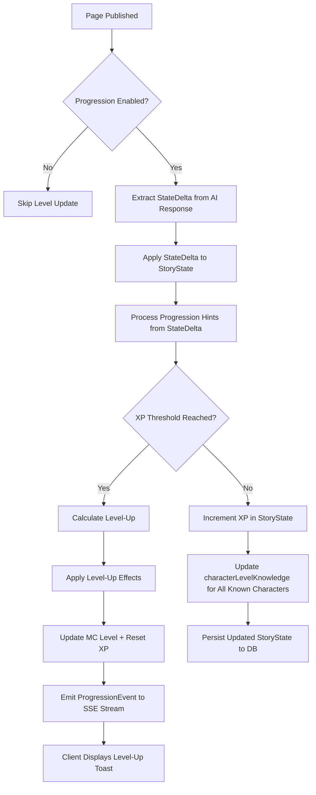
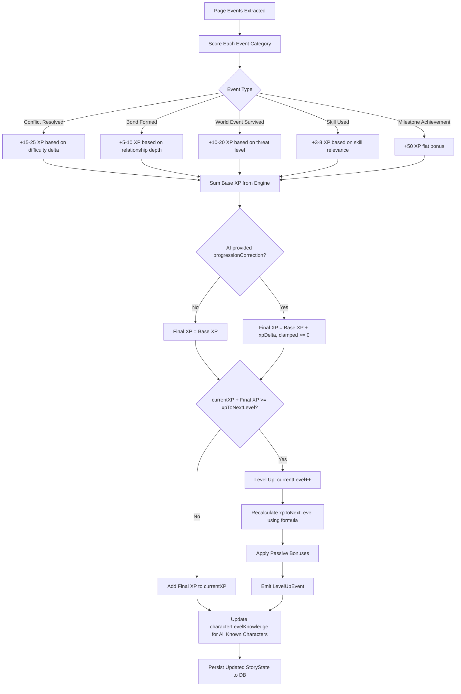
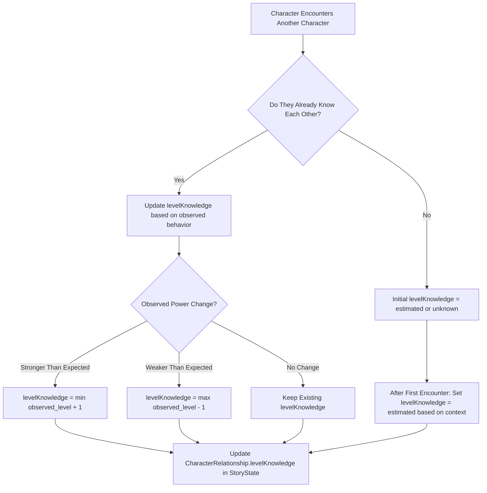
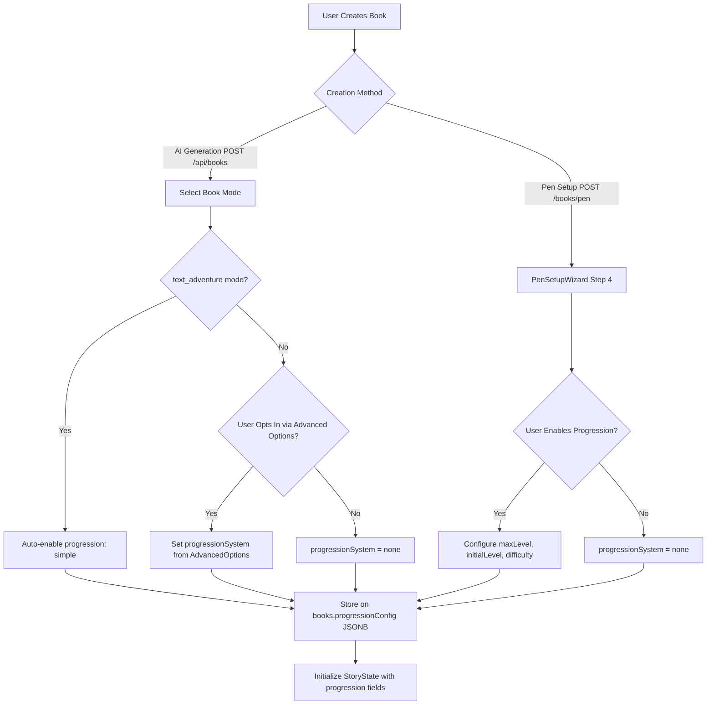

# Character Progression & Leveling System — Roadmap

> **Status:** Draft
> **Author:** Twistloom Engineering
> **Last Updated:** 2026-09-03
> **Related:** `TODO-leveling-system-chatgpt.md` (ChatGPT elaboration)

---

## Table of Contents

- [1. Overview](#1-overview)
- [2. Problem Statement](#2-problem-statement)
- [3. Architectural Constraints](#3-architectural-constraints)
- [4. Pros & Cons Analysis](#4-pros--cons-analysis)
- [5. UX/UI Design Plan](#5-uxui-design-plan)
- [6. Mermaid Flow Diagrams](#6-mermaid-flow-diagrams)
- [7. Architecture Design](#7-architecture-design)
- [8. Design Rationale](#8-design-rationale)
- [9. Open Questions & Recommendations](#9-open-questions--recommendations)
- [10. Implementation Phases](#10-implementation-phases)

---

## 1. Overview

The Character Progression System introduces an **optional, engine-owned** character leveling layer to Twistloom stories. It assigns each character (MC and named cast) an in-world `level` and each named character a per-relationship `levelKnowledge`, making power-aware conflict, mentorship, and world-building a first-class narrative concern — without forcing RPG numbers into every story.

**Core Principles**

| Principle | Rationale |
|-----------|-----------|
| **Optional per-book** | Enabled in the Pen creation wizard or advanced book-generation options; auto-checked for `text_adventure` mode; AI infers need for original/on-demand generation |
| **Hybrid XP (Engine + AI corrections)** | Base XP is accumulated by the server-side state machine from page events (deterministic, auditable). The AI can inject a bounded `progressionCorrection` delta for abnormal-world edge cases (time loops, world resets, cursed items) — following the established `urgencyCorrection` pattern. |
| **Narrative-first visibility** | Levels are visible in-world only when they matter: ReaderPageInfo, lore popover, CastChip in pen editor; hidden by default when they break immersion |
| **Separation of fact & knowledge** | `level` is the objective truth; `levelKnowledge` is a relationship-level belief about another character's level, allowing dramatic irony and estimation mechanics |
| **Progressive disclosure** | MVP ships level + XP + maxLevel only; depth layers (milestone powers, hidden levels, challenges) are additive future work |

---

## 2. Problem Statement

### 2.1 Missing Power-Context in Story Generation

Without explicit power-level data, the AI treats every character as roughly equal unless the author manually narrates dominance via prose. This makes:

- **Power-aware conflict** hard to generate (underdog victories, David-vs-Goliath moments)
- **Mentor/apprentice dynamics** unreliable (AI defaults to flat relationships)
- **World-building** shallow (no reference frame for how formidable a character truly is)
- **Reader comprehension** fragmented (readers must infer relative strength from context alone)

### 2.2 Current State Machine Gaps

The existing state engine (`src/utils/story.ts`) tracks:

- `sanity` / `composure` (MC psychological state)
- `health` / `injuries` (MC physical state)
- `sceneMood` / `sceneTension`
- `storyPhase` / `storyBeatType`
- `bookmarked` / `important` flags

But it has **no concept of**:

- Character progression over time
- Objective power measurement
- Knowledge that one character has about another character's power
- Milestone events that permanently change capability tiers

### 2.3 Reader Engagement Gap

Without progression, the reader has no quantitative hook — no "watching the bar fill up" moment. This is especially acute for:

- **Text Adventure mode** (already interactive; progression reinforces agency)
- **Interactive mode** with branching combat/competition plots
- **Long novels** where power creep is an implicit narrative arc

---

## 3. Architectural Constraints

| Constraint | Impact |
|------------|--------|
| **In-memory LRU caches** (`story-state-cache.ts`) | Level must be serializable in `StoryState` without breaking cache hit rates; avoid storing derived level as a separate cache key |
| **Redis distributed cache** (`cache.ts`) | Level-up milestone events must invalidate the cached state atomically |
| **Credit-constrained generation** (`executeWithCredits`) | Level progression must not trigger additional credit costs unless the user opts into a premium "milestone event" generation |
| **Serverless deployment** (Vercel) | XP accumulation logic must be stateless across invocations — no in-memory accumulators between page turns |
| **SSE streaming** (`aiStreamSSE`) | Level-up notifications must stream alongside the story text, not block it |
| **Database schema** (`src/db/schema.ts`) | Level is stored on `story_states` as a JSONB column (existing pattern); no new tables required for MVP |
| **Multi-provider AI waterfall** | XP rules must be provider-agnostic — same logic regardless of whether Mistral, Gemini, or Cerebras is generating |

---

## 4. Pros & Cons Analysis

### 4.1 Pros

| Benefit | Description |
|---------|-------------|
| **Narrative depth** | Characters become more than labels — their relative power is a first-class story element |
| **Reader engagement** | Progression hooks ("the MC leveled up!") drive page turns and return visits |
| **World-building consistency** | Engine-owned levels prevent AI from contradicting itself about who is stronger |
| **Conflict resolution** | Power-aware conflict generates naturally when the AI has level data as context |
| **Optional opt-in** | Users who prefer pure prose can disable it entirely; no bloat for those who don't want it |
| **Dramatic irony** | `levelKnowledge` allows the reader to know more than the characters, or vice versa |
| **Leverages existing infrastructure** | Built on top of `StoryState`, `CharacterRelationship`, and the state machine — no new architectural paradigms |

### 4.2 Cons

| Risk | Mitigation |
|------|------------|
| **Complexity increase** | Keep MVP minimal (3 fields); defer depth layers to post-MVP |
| **AI hallucination of levels** | Engine owns base XP; AI correction is bounded (`[-50, +50]`), additive, and auditable — limited blast radius |
| **Over-gameification** | Default `levelVisibility` to `"contextual"` — never shown in raw HUD unless the book opts in |
| **Performance cost** | Level is a single integer on `StoryState`; negligible serialization overhead |
| **Migration burden** | Level fields are nullable on existing types — backward-compatible; no DB migration required |
| **AI prompt token bloat** | Level context is injected as a single line in the character block, not a full stat sheet |

---

## 5. UX/UI Design Plan

### 5.1 Pen Editor (Author-Facing)

| Component | Current Behavior | After Leveling System |
|-----------|------------------|----------------------|
| **CastChip** (`pen/cast/CastChip.tsx`) | Shows avatar, name, presence, role, focus, health | Adds optional `LevelBadge` (small number overlay on avatar) + tooltip with XP progress |
| **PenSetupWizard** (`PenSetupWizard.tsx`) | 3 steps: Story, MC, Cast | Adds optional "Progression" step (4th) when leveling is enabled: set `maxLevel`, initial MC level, world difficulty |
| **SceneCastPanel** (`SceneCastPanel.tsx`) | Lists cast with health/role | Adds level indicator per character row |
| **Book Settings** (new) | Advanced options for creativity, tone | Adds `progressionSystem: "none" | "simple" | "detailed"` selector |

### 5.2 Reader View (Reader-Facing)

| Component | Current Behavior | After Leveling System |
|-----------|------------------|----------------------|
| **ReaderPageInfo** (`ReaderPageInfo.tsx`) | Shows MC health, sanity, injuries | Adds MC `level` + XP progress bar (if enabled) |
| **PageInfoModal** (`PageInfoModal.tsx`) | Multi-tab: Story, Scene, Timeline | Story tab shows `levelKnowledge` for known characters (e.g., "Level 3 — estimated") |
| **CharacterCard** (lore popover) | Shows character bio, health | Shows level badge + XP-to-next-level in tooltip |
| **Level-Up Toast** (new) | N/A | Non-blocking toast when MC levels up: "You reached Level 4! +1 Composure, +5 HP" |
| **Milestone Modal** (new) | N/A | Optional full-screen modal on milestone levels (5, 10, 15...) showing unlocked abilities |

### 5.3 Visual Design Tokens

```typescript
// New config: src/lib/config/progression.ts
export const LEVEL_COLORS = {
  1:  { bg: '#94a3b8', text: '#ffffff', glow: '#64748b' },   // Slate
  2:  { bg: '#60a5fa', text: '#ffffff', glow: '#3b82f6' },   // Blue
  3:  { bg: '#a78bfa', text: '#ffffff', glow: '#8b5cf6' },   // Violet
  4:  { bg: '#f472b6', text: '#ffffff', glow: '#ec4899' },   // Pink
  5:  { bg: '#fbbf24', text: '#1e1b4b', glow: '#f59e0b' },   // Gold (milestone)
  // ... escalates to tier-based
} as const;

export const XP_BAR_HEIGHT = 4;  // px, thin line beneath character name
export const LEVEL_BADGE_SIZE = 20; // px, circular overlay on avatar
```

---

## 6. Mermaid Flow Diagrams

### 6.1 Page Generation → State Delta → Level Update Flow



### 6.2 XP Accumulation Engine Logic (Hybrid: Engine Base + AI Correction)



### 6.3 Relationship Level Knowledge Update Flow



### 6.4 Book Creation → Progression Config Flow



---

## 7. Architecture Design

### 7.1 Type Extensions

```typescript
// src/types/story.ts — StateDelta extension
export interface StateDelta {
  // ... existing fields (sanityDelta, composureDelta, healthDelta, etc.) ...

  /**
   * AI-owned correction for abnormal-world edge cases.
   * Follows the established `urgencyCorrection` pattern (src/types/story-thread.ts).
   *
   * The engine handles 90% of cases via deterministic scoring.
   * This field is ONLY for when the deterministic result is wrong for the narrative:
   * - Time loops/skips: MC retains mastery from previous loops (+10 to +30)
   * - World reset: MC loses progress due to temporal displacement (-20 to -40)
   * - Abnormal physics: level operates differently in this realm (+/-10 to 20)
   * - Cursed/blessed item: temporary level shift (+/-5 to 15)
   *
   * The correction is ADDITIVE to the engine's base XP (like urgencyCorrection).
   * Clamped to [-50, +50] to prevent runaway values.
   */
  progressionCorrection?: {
    /** Additive XP delta. Positive = bonus, negative = penalty. */
    xpDelta: number;
    /** Brief explanation of why this correction is needed (audit trail). */
    reason: string;
  };
}

// src/types/story.ts — StoryState extension
export interface ProgressionState {
  /** Current MC level (1..maxLevel). Undefined when progression is disabled. */
  currentLevel: number;
  /** XP accumulated toward next level */
  currentXP: number;
  /** XP required to reach the next level (computed from formula) */
  xpToNextLevel: number;
  /** XP awarded for the last level-up (for the "You earned X XP!" display) */
  lastXpAwarded: number;
  /** Milestone abilities unlocked at specific levels (e.g., "level_5_unlock") */
  milestoneAbilities: string[];
  /** Total events scored for XP (analytics/debug) */
  totalEventsScored: number;
}

// src/types/character.ts — CharacterMemory extension
export interface CharacterMemory {
  // ... existing fields ...
  /** Character's own level (known to the reader, not necessarily to other characters) */
  level: number;
}

// src/types/character.ts — CharacterRelationship extension
export interface CharacterRelationship {
  // ... existing fields ...
  /** How much this character knows about the other's actual level */
  levelKnowledge: "unknown" | "estimated" | "known";
  /** The estimated level this character believes the other is at */
  estimatedLevel: number | null;
}
```

### 7.2 Database Schema Extension

```sql
-- books table addition (JSONB, nullable, backward-compatible)
ALTER TABLE books ADD COLUMN progression_config JSONB DEFAULT NULL;
-- Example value:
-- { "enabled": true, "maxLevel": 20, "difficulty": "normal", "initialLevel": 1 }

-- story_states table addition (JSONB, within existing state JSON)
-- No schema change needed — progression lives inside the existing `state` JSONB column
```

### 7.3 New Backend Module: `src/utils/progression.ts`

```typescript
/**
 * Core progression engine — processes state deltas and awards XP.
 *
 * HYBRID MODEL:
 * - Base XP is always engine-owned (deterministic, auditable)
 * - AI can inject a bounded `progressionCorrection` for edge cases
 * - Follows the established `urgencyCorrection` pattern (src/types/story-thread.ts)
 * - The correction is ADDITIVE and clamped, not a replacement
 *
 * It follows the same architectural pattern as story-state-cache.ts:
 * - Pure functions that take StoryState and return updated StoryState
 * - No side effects (no DB writes, no cache mutations)
 * - Called from applyStateDelta() in story.ts after processing narrative deltas
 */

export interface ProgressionEvent {
  type: "conflict_resolved" | "bond_formed" | "world_event_survived" | "skill_used" | "milestone_achievement";
  description: string;
  difficultyDelta?: number;  // How much harder/easier than expected
  relationshipDepth?: number; // 0-1 for bond quality
  threatLevel?: number;       // 0-1 for world events
  skillRelevance?: number;    // 0-1 for skill usage
}

/**
 * Process the AI's progression correction — additive delta like urgencyCorrection.
 * Clamped to [-CORRECTION_MAX, +CORRECTION_MAX] to prevent runaway values.
 */
export const CORRECTION_MAX = 50;

export function processProgressionCorrection(
  baseXP: number,
  correction: { xpDelta: number; reason: string } | undefined
): { finalXP: number; applied: boolean }

export function scoreProgressionEvents(
  events: ProgressionEvent[],
  currentLevel: number,
  maxLevel: number
): { totalXP: number; scored: ProgressionEvent[] }

export function calculateLevelUp(
  currentXP: number,
  currentLevel: number,
  gainedXP: number,
  maxLevel: number
): { newLevel: number; newXP: number; newXpToNextLevel: number; didLevelUp: boolean }

export function computeXpToNextLevel(level: number, maxLevel: number): number
// Formula: baseXP * (level ^ exponent) + levelBonus
// baseXP = 100, exponent = 1.5, levelBonus = level * 10

export function extractProgressionHints(
  stateDelta: StateDelta,
  storyState: StoryState
): ProgressionEvent[]
// Parses the AI's narrative output for progression-relevant signals
// Uses the existing StateDelta structure — no new AI prompt fields needed
```

**Processing flow in `applyStateDelta`:**
```typescript
// 1. Extract progression-relevant events from the state delta
const events = extractProgressionHints(stateDelta, storyState);

// 2. Engine scores base XP from events (deterministic)
const { totalXP: baseXP } = scoreProgressionEvents(events, currentLevel, maxLevel);

// 3. AI correction is additive (like urgencyCorrection in processThreadUpdates)
const { finalXP } = processProgressionCorrection(baseXP, stateDelta.progressionCorrection);

// 4. Calculate level-up
const { newLevel, newXP, didLevelUp } = calculateLevelUp(
  currentXP, currentLevel, finalXP, maxLevel
);
```

### 7.4 Integration Points

| File | Change | Description |
|------|--------|-------------|
| `src/utils/story.ts` | Modify `applyStateDelta` | After processing health/sanity/scene changes, call `extractProgressionHints()` → `scoreProgressionEvents()` → `processProgressionCorrection()` → `calculateLevelUp()` → update `StoryState.progression` |
| `src/schema/story.ts` | Extend `STORY_STATE_GENERATION_SCHEMA` | Add optional `progressionCorrection` object to the state delta schema (xpDelta + reason) — follows `urgencyCorrection` pattern in `UPDATE_THREAD_SCHEMA` |
| `src/utils/prompt.ts` | Extend prompt template | Add field instruction: "progressionCorrection: ONLY for abnormal-world edge cases (time loops, world resets, abnormal physics, cursed items). NEVER for ordinary page events." |
| `src/utils/field-instructions.ts` | Add field instruction | Add `progressionCorrection` instruction alongside existing `urgencyCorrection` and `familiarityCorrection` instructions |
| `src/services/book-creation.ts` | Extend `CreateBookParams` | Accept `progressionConfig` from advanced options, persist to `books.progression_config` |
| `src/routes/books.ts` | Extend advanced options schema | Add `progressionSystem` to the validation schema for the async book creation route |
| `src/utils/companion-stream.ts` | Add progression event streaming | When a level-up occurs during page generation, emit a `progression` SSE event alongside the prose chunks |

### 7.5 Frontend Integration Points

| File | Change | Description |
|------|--------|-------------|
| `src/lib/config/progression.ts` | **New file** | Level colors, XP bar tokens, milestone definitions |
| `src/components/pen/cast/CastChip.tsx` | Add `LevelBadge` | Optional number overlay on avatar when progression is enabled |
| `src/components/reader/ReaderPageInfo.tsx` | Add level display | Show MC level + XP progress bar in the story info panel |
| `src/components/reader/PageInfoModal.tsx` | Add levelKnowledge tab | Show each known character's estimated level in the Story tab |
| `src/components/reader/LevelUpToast.tsx` | **New file** | Non-blocking toast notification on level-up |
| `src/components/reader/MilestoneModal.tsx` | **New file** | Full-screen modal on milestone levels (5, 10, 15...) |
| `src/components/pen/PenSetupWizard.tsx` | Add Step 4 | Optional progression configuration step in the Pen creation wizard |
| `src/lib/types/story.ts` | Add `ProgressionState` type | Mirror backend type for frontend consumption |

---

## 8. Design Rationale

### 8.1 Why Hybrid XP (Engine Base + AI Corrections)

The engine owns base XP accumulation because:

- **Deterministic**: Same events always yield the same XP — no randomness from model temperature
- **Auditable**: Every XP gain has a source event, difficulty delta, and timestamp
- **Consistent**: The AI focuses on narrating; the engine focuses on scoring
- **Testable**: Pure functions with no side effects — trivially unit-testable

But the engine alone cannot handle **abnormal-world edge cases** where the deterministic formula produces nonsensical results:

- Time loops where the MC retains mastery across iterations
- World resets that strip accumulated power
- Abnormal physics where level operates differently
- Cursed or blessed items that temporarily shift capability

The AI's `progressionCorrection` (analogous to `urgencyCorrection`) provides a bounded additive delta for these cases. The AI signals *why* the correction is needed; the engine applies it. This follows the proven pattern from `src/types/story-thread.ts:113` where `urgencyCorrection` handles exceptional narrative shifts that the automatic urgency decay/bump system cannot infer.

### 8.2 Why `level` + `levelKnowledge` (Not Just `level`)

Storing only `level` on each character would create a flat, omniscient view. By separating:

- **`level`** (on `CharacterMemory`): The objective truth — what the character *actually* is
- **`levelKnowledge`** (on `CharacterRelationship`): What Character A *believes* Character B is

...the system enables:

- **Dramatic irony**: The reader knows the MC is Level 8, but the antagonist only estimates Level 5
- **Mentor dynamics**: A mentor's `levelKnowledge` of the MC grows from `"unknown"` to `"estimated"` to `"known"` as they train together
- **Surprise encounters**: A character underestimated (levelKnowledge = 3) reveals themselves at level 7
- **Narrative tension**: The AI generates prose that reflects the *knowledge gap* between characters

### 8.3 Why Optional Per-Book (Not Global Toggle)

Making progression global would:

- Break stories where progression is tonal pollution (slice-of-life, romance)
- Force all authors into RPG-adjacent writing
- Increase cognitive load for readers who don't want it

By making it optional per-book:

- **Text adventure mode** auto-enables it (progression is inherent to the genre)
- **Novel mode** defaults to off (pure prose, no numbers)
- **Interactive mode** lets the author choose (branching + progression = rich agency)
- **Multiverse mode** lets the author choose (parallel timelines with progression = complex but compelling)

### 8.4 Why No New Database Tables (MVP)

The `story_states` table already stores the full game state as a JSONB `state` column. Adding `progression` as a nested object inside that JSONB:

- Requires zero schema migrations
- Follows the existing pattern for `sanity`, `composure`, `health`, `injuries`, `sceneMood`, etc.
- Is trivially serializable/deserializable
- Fits within the existing LRU cache structure (`StoryStateCacheEntry`)
- Can be added to existing story states without any data migration

New tables (e.g., `character_levels`, `xp_events_log`) are a post-MVP consideration for analytics and audit trails.

### 8.5 Why `progressionCorrection` in StateDelta (Not a Separate AI Call)

The AI already generates a `stateDelta` at the end of each page. Adding a `progressionCorrection` object to that delta:

- Costs zero additional tokens (it's 2-3 lines in the existing output format)
- Requires no additional API call (no latency, no credit cost)
- Stays within the existing streaming architecture (`pipeSSEStreamAndExtractText`)
- Is backward-compatible (the field is optional — old pages without it work fine)
- Follows the established `urgencyCorrection` pattern — same architecture, same processing

### 8.6 Why the Correction is Additive (Not Override)

The correction follows `urgencyCorrection`'s design: it is **additive to the base XP**, not a replacement. This is deliberate:

- **Additive (correct pattern)**: `finalXP = baseXP + correction`. The engine's deterministic scoring always runs. The AI shifts the result up or down within a bounded range. Normal stories work identically with or without the correction.
- **Override (wrong pattern)**: `finalXP = correction`. The engine's scoring is discarded. The AI controls XP entirely. This reintroduces hallucination risk and defeats the purpose of the engine.

The `familiarityCorrection` pattern (`src/types/places.ts:206`) was a cautionary tale — the correction was applied then immediately overwritten by `calculatePlaceFamiliarity()`, making it a no-op. **This has been fixed** (see `src/utils/places.ts:136-147`): the deterministic formula now runs first, and the AI correction is applied as an additive delta *after*, matching the `urgencyCorrection` pattern. The `progressionCorrection` follows this same corrected design from the start.

The clamp `[-50, +50]` prevents runaway values while allowing meaningful shifts (a level-up is ~100-300 XP depending on level, so ±50 is a significant but not game-breaking adjustment).

---

## 9. Open Questions & Recommendations

### Q1: Should levels be visible in the reader by default?

| Option | Pros | Cons |
|--------|------|------|
| **A: Always visible** | Reader always has context | Breaks immersion in literary stories |
| **B: Never visible** | Pure prose experience | Reader misses progression hooks |
| **C: Contextual (default)** | Visible when relevant, hidden when not | Requires AI to signal when to show/hide |
| **D: Author-controlled** | Full author agency | Extra config burden |

**Recommendation:** **C (Contextual)** — Show level in `ReaderPageInfo` always, but hide the `LevelBadge` on `CastChip` unless the author explicitly enables `"levelVisibility": "always"` in the book's progression config. This gives the reader the data without cluttering the prose view.

### Q2: Should XP scale with book difficulty?

| Option | Pros | Cons |
|--------|------|------|
| **A: Fixed XP table** | Predictable, easy to balance | Same difficulty regardless of story tone |
| **B: Difficulty-scaled** | XP adjusts to story intensity | Harder to predict; more config |
| **C: AI-suggested difficulty** | Adaptive to narrative | AI hallucination risk |

**Recommendation:** **A (Fixed XP table)** for MVP. The `difficulty` field in `progressionConfig` affects *level-up thresholds* (how much XP needed), not *XP awarded*. This keeps the scoring engine deterministic while letting the author control pacing.

### Q3: How should milestone levels (5, 10, 15...) be handled?

| Option | Pros | Cons |
|--------|------|------|
| **A: Just a number** | Minimal implementation | Loses narrative weight |
| **B: Passive bonus only** | Engine-applied (e.g., +5 HP) | No narrative event |
| **C: Milestone event + bonus** | Full narrative moment | Requires AI to generate the event |
| **D: Milestone event (AI) + optional bonus** | Author chooses | More complex |

**Recommendation:** **D (Milestone event + optional bonus)** — On milestone levels, the engine adds a `milestoneEvent` to the state delta, and the AI generates a brief narrative paragraph about the level-up. The bonus is optional (configured per-book). This leverages the existing AI generation pipeline without adding a new API call.

### Q4: Should `levelKnowledge` update automatically or require an in-story interaction?

| Option | Pros | Cons |
|--------|------|------|
| **A: Automatic (every page)** | Always current | Unrealistic — characters don't re-assess every page |
| **B: On encounter only** | Realistic | Might lag behind actual level |
| **C: Hybrid — auto-decay + encounter refresh** | Balanced | More complex |

**Recommendation:** **B (On encounter only)** for MVP. `levelKnowledge` updates only when two characters are in the same scene together (i.e., both in `presenceInScene`). This is simple to implement, realistic, and creates natural information asymmetry.

### Q5: How should the AI's progressionCorrection interact with engine scoring?

| Option | Pros | Cons |
|--------|------|------|
| **A: Additive correction (default)** | Engine scoring always runs; AI shifts result for edge cases | AI may misuse for ordinary events |
| **B: Override** | AI has full control | Reintroduces hallucination risk |
| **C: Engine validates, then applies** | Balanced | More complex |
| **D: No correction at all** | Purely deterministic | Cannot handle abnormal-world edge cases |

**Recommendation:** **A (Additive correction)** — The engine always scores base XP deterministically. The AI can inject a bounded `progressionCorrection` (`[-50, +50]`) for abnormal-world edge cases (time loops, world resets, cursed items). This follows the `urgencyCorrection` pattern exactly: the engine handles 90% of cases, the AI handles the 10% that require narrative context the engine cannot infer. The field instruction explicitly states: "NEVER for ordinary page events." Combined with the clamp, misuse has limited blast radius.

### Q6: Should progression data be included in the explore/bookshelf UI?

| Option | Pros | Cons |
|--------|------|------|
| **A: No** | Keeps explore clean | Reader can't preview progression books |
| **B: Yes, as a badge** | Visual discoverability | UI noise |
| **C: Yes, as a filter** | Targeted discovery | Extra filter complexity |

**Recommendation:** **C (Filter)** — Add a "Has Progression" toggle to the explore filter bar (`BookModeFilter.tsx` pattern). Books with `progressionConfig.enabled` show a small progression icon. This is discoverable without being intrusive.

### Q7: How should retroactive progression work for existing books?

| Option | Pros | Cons |
|--------|------|------|
| **A: Not supported** | Clean | Existing books can't opt in |
| **B: Opt-in retroactive calculation** | Backward-compatible | Computationally expensive |
| **C: Start from current page** | Quick | Incomplete XP history |

**Recommendation:** **C (Start from current page)** — If an existing book enables progression, XP accumulation begins from the current page forward. The MC's initial level defaults to 1 (or configurable). No attempt is made to retroactively score past pages.

---

## 10. Implementation Phases

### Phase 1: MVP — Core Engine (2-3 weeks)

**Goal:** Character level + XP + maxLevel in the state engine, with basic UI.

| Task | Files | Effort |
|------|-------|--------|
| **Fix `familiarityCorrection` no-op bug** | `src/utils/places.ts` | S ✅ Done |
| Add `ProgressionState` type | `src/types/story.ts` | S |
| Add `progressionConfig` to book types | `src/types/book.ts`, `src/types/book-creation.ts` | S |
| Implement `src/utils/progression.ts` (score, calculate, compute, processCorrection) | `src/utils/progression.ts` (new) | L |
| Integrate into `applyStateDelta` | `src/utils/story.ts` | M |
| Add `progressionCorrection` to AI output schema | `src/schema/story.ts` | S |
| Add `progressionCorrection` field instruction to prompt template | `src/utils/prompt.ts`, `src/utils/field-instructions.ts` | S |
| Persist `progressionConfig` on books table | `src/db/schema.ts` (migration) | S |
| Accept `progressionConfig` in book creation route | `src/routes/books.ts`, `src/services/book-creation.ts` | M |
| Add level display to `ReaderPageInfo` | `src/components/reader/ReaderPageInfo.tsx` | S |
| Add `LevelBadge` to `CastChip` | `src/components/pen/cast/CastChip.tsx` | S |
| Add `ProgressionState` type to frontend | `src/lib/types/story.ts` | S |
| Unit tests for `progression.ts` | `tests/utils/progression.test.ts` | M |

### Phase 2: Reader Experience (1-2 weeks)

**Goal:** Level-up notifications, milestone modals, relationship knowledge display.

| Task | Files | Effort |
|------|-------|--------|
| Implement `LevelUpToast` | `src/components/reader/LevelUpToast.tsx` (new) | S |
| Implement `MilestoneModal` | `src/components/reader/MilestoneModal.tsx` (new) | M |
| Add `levelKnowledge` to `PageInfoModal` Story tab | `src/components/reader/PageInfoModal.tsx` | M |
| Stream `progression` SSE event | `src/utils/companion-stream.ts` | M |
| Add progression config to PenSetupWizard | `src/components/pen/PenSetupWizard.tsx` | M |
| Add progression config to advanced options UI | `src/components/home/StoryGeneratorInput.tsx` | S |

### Phase 3: Depth Layers (Post-MVP, 2-3 weeks)

**Goal:** Milestone abilities, hidden levels, challenge system, analytics.

| Task | Files | Effort |
|------|-------|--------|
| Add `milestoneAbilities` processing | `src/utils/progression.ts` | M |
| Add `levelVisibility` config (hidden/contextual/always) | Book config, CastChip, ReaderPageInfo | M |
| Add XP event audit log table | `src/db/schema.ts` (migration) | M |
| Add progression analytics to player profile | `src/utils/player-profile.ts` | S |
| Add "Has Progression" explore filter | `src/components/books/filters/BookModeFilter.tsx` | S |
| Add progression badge to book cards | Explore UI components | S |

### Phase 4: Advanced Features (Future)

| Feature | Description |
|---------|-------------|
| **Challenge system** | Characters can challenge each other; XP awarded based on level delta |
| **Companion progression** | Named companions have their own XP track (separate from MC) |
| **Retroactive scoring** | AI-assisted reconstruction of XP history for existing books |
| **Progression leaderboard** | Compare MC levels across books (per user) |
| **Milestone ability unlocks** | Custom abilities granted at specific levels (author-configurable) |

---

## Appendix A: File Reference Matrix

| Current File | Role in Leveling System |
|--------------|------------------------|
| `src/types/story.ts` | Extend `StoryState` with `progression: ProgressionState` |
| `src/types/character.ts` | Extend `CharacterMemory` with `level`; `CharacterRelationship` with `levelKnowledge`, `estimatedLevel` |
| `src/types/book.ts` | Extend `CreateBookParams` with `progressionConfig` |
| `src/types/book-creation.ts` | Extend `AdvancedOptionsConfig` with progression settings |
| `src/utils/story.ts` | Call progression engine from `applyStateDelta` |
| `src/utils/progression.ts` | **New** — Core XP engine (score, calculate, processCorrection, emit events) |
| `src/utils/prompt.ts` | Add `progressionCorrection` field instruction to prompt template |
| `src/utils/field-instructions.ts` | Add `progressionCorrection` instruction alongside `urgencyCorrection` |
| `src/schema/story.ts` | Add `progressionCorrection` to AI output state delta schema |
| `src/db/schema.ts` | Add `progression_config` JSONB column to `books` table |
| `src/routes/books.ts` | Accept `progressionConfig` in book creation validation |
| `src/services/book-creation.ts` | Persist `progressionConfig` during book creation |
| `src/utils/companion-stream.ts` | Emit `progression` SSE events on level-up |
| `src/utils/branch-traversal.ts` | Carry `progression` state through branch switches |
| `src/services/story-state-cache.ts` | Include `progression` in cache entry shape |
| `src/config/book-creation.ts` | Add progression presets and defaults |
| `src/lib/config/progression.ts` | **New (frontend)** — Level colors, XP bar tokens, milestones |
| `src/components/pen/cast/CastChip.tsx` | Add `LevelBadge` overlay |
| `src/components/reader/ReaderPageInfo.tsx` | Add MC level + XP bar |
| `src/components/reader/PageInfoModal.tsx` | Add `levelKnowledge` display |
| `src/components/reader/LevelUpToast.tsx` | **New** — Level-up notification |
| `src/components/reader/MilestoneModal.tsx` | **New** — Milestone celebration |
| `src/components/pen/PenSetupWizard.tsx` | Add Step 4 (Progression config) |
