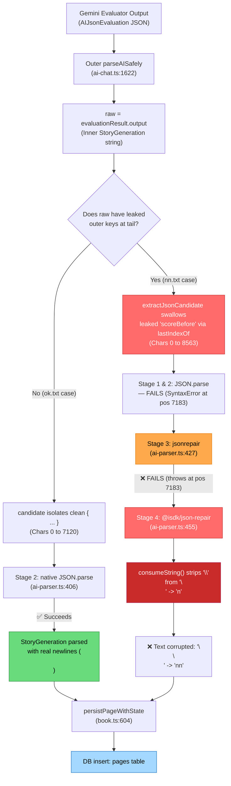

# Evaluator String-Mode `nn` Corruption Bug — Root Cause Analysis & Fix Plan

> **Document Version:** 2.0.0  
> **Date:** 2026-09-07  
> **Status:** Root Cause Empirically Proven & Verified — Multi-Tier Fix Plan Ready  
> **Bug Severity:** High (intermittent silent content corruption on evaluated pages)  
> **Related:** [`EVALUATION_NEWLINE_STRIPPING_BUG_REPORT.md`](./EVALUATION_NEWLINE_STRIPPING_BUG_REPORT.md) (prior finding on model-level newline deletion)  
> **Audited Files:**  
> - `src/utils/ai-chat.ts` — `runEvaluationPass` (line 1695), inner `parseAISafely` call (line 1816), outer `parseAISafely` (line 1622), `aiPrompt` evaluation loop (line 1609), `resolveUseStringEvaluator` (line 1949)  
> - `src/utils/ai-parser.ts` — `parseAISafely` (line 278), `sanitise()` (line 847), `extractJsonCandidate` (line 548), `runParsePipeline` (line 380), `parseSanitizedJson` (line 963), `postProcess`/`trimStringValues` (line 621/944)  
> - `src/utils/prompt.ts` — `generateStoryNextPage` (line 5508), `executePromptForJSON` (line 5968), `persistPageWithState` call (line 5581)  
> - `src/services/book.ts` — `persistPageWithState` (line 604), `insertStoryPage` (line 372), `stripActionTypeTags` (line 342)  
> - `src/utils/ai-token-repair.ts` — `repairTokenCorruption` (line 131)  
> - `node_modules/@isdk/json-repair/dist/index.js` — `RepairParser.prototype.consumeString` (line 1)  
> - `sample/eval_output_json_string_nn.txt` — broken case  
> - `sample/eval_output_json_string_ok.txt` — working case  

---

## 1. Executive Summary & Correction of Prior v1.0 Hypothesis

An earlier hypothesis (v1.0.0) assumed that Gemini emitted raw `U+000A` newline bytes inside the `output` string and that `jsonrepair` (Stage 3) was the corrupting agent. **Empirical testing on runtime bytecode has refuted that hypothesis and identified the true culprit and mechanism:**

1. **`jsonrepair` (Stage 3) was NOT the culprit:**  
   When executed against `sample/eval_output_json_string_nn.txt`, `jsonrepair` **failed and threw an exception** (`Unexpected character "\"" at position 7183`). It did not produce any output and never corrupted the text.
2. **The actual corrupting agent is Stage 4: `@isdk/json-repair`:**  
   Because Stages 1, 2, and 3 failed, `ai-parser.ts` fell through to Stage 4 (`@isdk/json-repair` with schema). The tokenizer method `consumeString()` in `@isdk/json-repair` (`dist/index.js`) contains an escape-stripping defect: whenever it sees a backslash `\`, it discards the `\` and appends whatever character follows verbatim without unescaping. Thus:
   - `\n` becomes literal `n`
   - `\n\n` becomes literal `nn`
   - `\t` becomes literal `t`
3. **The actual root trigger in Gemini:**  
   In `eval_output_json_string_nn.txt`, the `text` field **actually contains 100% valid `\n` escape sequences**! When isolated, native `JSON.parse` parses the story object with 7 intact paragraphs and zero `"nn"`.  
   The real defect was that Gemini **leaked outer evaluation metadata (`scoreBefore`, `scoreAfter`) inside the escaped `output` string** right after `StoryGeneration`'s closing brace at position 7183:
   ```json
     "branchNames": [ ... ]
   }",
     "scoreBefore": { ...
   ```
4. **Why Stages 1–3 Failed:**  
   `extractJsonCandidate` in `ai-parser.ts` used naive `lastIndexOf('}')`, capturing from index 0 all the way to index 8,562. This swallowed the rogue `}",\n  "scoreBefore":` syntax error into the candidate string, causing `parseSanitizedJson` (Stage 1), native `JSON.parse` (Stage 2), and `jsonrepair` (Stage 3) to fail. Stage 4 (`@isdk/json-repair`) was reached because its schema-driven parser matched the required fields up to `branchNames`, ignored the trailing syntax garbage, and returned the object—**corrupting every `\n` to `n` in the process**.
5. **Why the v1.0 Proposed Fix (`normalizeEvaluatorNewlines`) Failed:**  
   `normalizeEvaluatorNewlines` targeted raw `U+000A` bytes. When tested against `eval_output_json_string_nn.txt`, it still resulted in:
   `Stage 4: @isdk/json-repair (schema-guided) -> Result text has "nn"?: true`.  
   Because it did not fix the trailing boundary at position 7183, Stages 1–3 still failed, and Stage 4 still corrupted the text.

### Symptom

| Field | Expected | Actual (corrupted) |
|---|---|---|
| `page.text` paragraph breaks | Actual newline characters (`\n\n`) | Literal two-character string `nn` |

**Example** (`sample/eval_output_json_string_nn.txt`):
```text
DB: Silau itu menyengat mataku.nnBukan cahaya surga, melainkan pendar lampu neon dingin...
Expected: Silau itu menyengat mataku.\n\nBukan cahaya surga, melainkan pendar lampu neon dingin...
```

---

## 2. End-to-End Pipeline Execution Trace

The complete call flow from evaluator execution to Postgres database insertion:

```
1. prompt.ts:5508: generateStoryNextPage()
   └── Calls executePromptForJSON<StoryGeneration>({ ..., evaluatorPrompt })

2. prompt.ts:5968: executePromptForJSON()
   └── Calls aiPrompt<StoryGeneration>(userPrompt, options, evaluatorPrompt)

3. ai-chat.ts:1609: aiPrompt()
   ├── Story writer model generates initial StoryGeneration JSON (result)
   └── Line 1610: if (evaluatorPrompt) -> invokes runEvaluationPass<T>()

4. ai-chat.ts:1695: runEvaluationPass<StoryGeneration>()
   ├── resolveUseStringEvaluator() resolves to true for Gemini
   ├── Calls aiPrompt<AIJsonEvaluation<T>> with { output: { type: "string" } }
   ├── Gemini evaluator model generates outer JSON response:
   │   { "output": "{\n  \"text\": \"Silau...\"\n}\",\n  \"scoreBefore\": ... " }
   │
   └── ai-chat.ts:1622: Outer parseAISafely extracts output string:
       raw = evaluationResult.output (length: 8,563 characters)

5. ai-chat.ts:1816: Inner parseAISafely(raw)
   ├── ai-parser.ts:312: sanitise(raw) -> preserves \n, tabs, and printable characters
   ├── ai-parser.ts:322: candidate = extractJsonCandidate(cleanInput)
   │   ⚠️ Traced bug: Uses clean.indexOf('{') and clean.lastIndexOf('}').
   │   Swallows leaked outer keys ('scoreBefore') and rogue quote/comma at pos 7183.
   │
   └── ai-parser.ts:380: runParsePipeline(candidate, STORY_GENERATION_SCHEMA_DEFINITION)
       ├── Stage 1: parseSanitizedJson -> FAILS (SyntaxError at pos 7183)
       ├── Stage 2: native JSON.parse  -> FAILS ("JSON Parse error: Unterminated string")
       ├── Stage 3: jsonrepair         -> FAILS (Throws: 'Unexpected character "\"" at position 7183')
       │
       └── Stage 4: @isdk/json-repair (schema-guided)
           ├── Matches schema keys: "text", "mood", ..., "branchNames"
           ├── Reads "text" via RepairParser.prototype.consumeString()
           │   💥 DEFECT: Strips '\' from '\n', appending 'n' -> '\n\n' becomes 'nn'!
           ├── Reaches pos 7183 ('}'), satisfies schema, ignores trailing garbage
           └── Returns parsed StoryGeneration with text: "...mataku.nnBukan..."

6. ai-chat.ts:1843: runEvaluationPass() returns { ...result, result: correctedOutput }

7. ai-chat.ts:1612: aiPrompt() returns evaluated response to executePromptForJSON

8. prompt.ts:5538: generateStoryNextPage() receives response
   ├── validateGeneratedPage(): PASSES ('nn' is just Indonesian text characters)
   ├── resolvePageDelta(): computes StateDelta
   └── Line 5581: persistPageWithState({ generatedStoryPage, ... })

9. book.ts:604: persistPageWithState()
   └── Calls insertStoryPage(userId, pageNumber, pageToInsert, pageMeta, { client: tx })

10. book.ts:372: insertStoryPage()
    ├── sanitizedPageText = stripActionTypeTags(page.text)
    │   (Only strips [dialogue], leaves 'nn' completely untouched)
    └── dbWrite.insert(pages).values({ text: sanitizedPageText, ... })

11. Postgres Database contains: "Silau itu menyengat mataku.nnBukan cahaya surga..."
```

---

## 3. Why `ok.txt` Works But `nn.txt` Fails — Technical Comparison

Both sample files represent the outer JSON emitted by Gemini's evaluator pass. Both have `\\n\\n` in the outer JSON payload.

```
sample/eval_output_json_string_ok.txt (working):
"output": "{\n  \"text\": \"Seret kaki di atas lantai...\\n\\n...\", ... \n  \"branchNames\": [ ... ]\n}"

sample/eval_output_json_string_nn.txt (broken):
"output": "{\n  \"text\": \"Silau itu menyengat mataku.\\n\\n...\", ... \n  \"branchNames\": [ ... ]\n}\",\n  \"scoreBefore\": {\n    \"total\": 89, ...\n}"
```

### Detailed Comparison Table

| Dimension | `ok.txt` (Working) | `nn.txt` (Corrupted) |
|---|---|---|
| **Outer JSON `output` field** | Valid escaped string containing single JSON object | Escaped string containing JSON object **plus leaked evaluator keys** |
| **End of `output` string value** | Ends cleanly at `\n}` | Contains `\n}\",\n  \"scoreBefore\": { ... }` |
| **Extracted candidate span** | Chars 0 to 7,120 (clean `{ ... }`) | Chars 0 to 8,563 (swallows leaked keys and rogue quotes) |
| **`text` field escape sequences** | `\n\n` (valid 2-char escape) | `\n\n` (valid 2-char escape) |
| **Stage 1 (`parseSanitizedJson`)** | ✅ Succeeds | ❌ Fails (rogue `",` syntax error at pos 7183) |
| **Stage 2 (`native JSON.parse`)** | ✅ Succeeds | ❌ Fails (`Unterminated string`) |
| **Stage 3 (`jsonrepair`)** | Skipped | ❌ Fails (Throws `Unexpected character "\"" at position 7183`) |
| **Stage 4 (`@isdk/json-repair`)** | Skipped | ⚠️ **Executes** and strips backslashes (`\n\n` → `nn`) |
| **Database `text` result** | Real newlines (`\n\n`) | Literal `nn` |

---

## 4. Mermaid Flow Diagrams

### 4.1 End-to-End Pipeline & Corruption Point



### 4.2 Detailed Inner Parse Pipeline (`nn.txt` Breakdown)

```mermaid
flowchart TD
    A["raw string (8563 chars)"] --> B["sanitise() -> preserves \n"]
    B --> C["extractJsonCandidate()<br/>indexOf('{') = 0<br/>lastIndexOf('}') = 8562"]
    C --> D["candidate (8563 chars)<br/>Contains '...branchNames: [...] }\",\n \"scoreBefore\": ... }'"]
    
    D --> E["Stage 1: parseSanitizedJson -> throws SyntaxError"]
    E --> F["Stage 2: tryParse(candidate) -> returns null"]
    F --> G["Stage 3: jsonrepair(candidate)"]
    G -->|"Throws: Unexpected character '\"' at pos 7183"| H["Stage 4: isdkRepair(candidate, walker)"]
    
    H --> I["SchemaWalker matches StoryGeneration fields"]
    I --> J["RepairParser.consumeString('text')<br/>'\\' === peek() ? (next(), s += next()) : s += next()"]
    J --> K["All '\\n\\n' in text become 'nn'<br/>All '\\\"' become '\"'"]
    K --> L["Hits '}' at pos 7183 -> Schema satisfied<br/>Ignores remainder of candidate"]
    L --> M["Returns parsed object with 'nn' baked into text"]
    M --> N["postProcess() trims whitespace -> 'nn' preserved"]
    N --> O["DB: 'Silau itu menyengat mataku.nnBukan cahaya...'"]
    
    style G fill:#ffa94d,stroke:#e67700,color:#000
    style H fill:#ff6b6b,stroke:#c92a2a,color:#fff
    style J fill:#c92a2a,stroke:#a61e4d,color:#fff
    style O fill:#ff6b6b,stroke:#c92a2a,color:#fff
```

---

## 5. Empirical Verification & Reproduction Tests

All tests below were executed directly using Bun against `Twistloom-backend` modules and sample files.

### 5.1 Direct Proof: StoryGeneration in `nn.txt` is 100% Valid JSON
When we isolate the first balanced JSON object (chars 0 to 7,183):

```typescript
// scratch/test_balanced.ts
const raw = outerObj.output;
const extracted = extractFirstBalancedJsonObject(raw); // Cutoff at matching root '}'
console.log('Extracted length:', extracted.length); // 7183 chars

const parsed = JSON.parse(extracted);
console.log('JSON.parse SUCCESS?:', !!parsed);
console.log('parsed.text has "nn"?:', parsed.text.includes('nn'));
console.log('parsed.text has "\\n"?:', parsed.text.includes('\n'));
console.log('Paragraph count:', parsed.text.split('\n\n').length);
```

**Output:**
```
Extracted length: 7183
JSON.parse SUCCESS?: true
parsed.text has "nn"?: false
parsed.text has "\n"?: true
Paragraph count: 7
```
**Conclusion:** The narrative text generated by Gemini was completely uncorrupted. It contained 7 paragraphs with standard `\n\n` newlines.

### 5.2 Direct Proof: Stage 3 (`jsonrepair`) Threw and Failed
Testing Stage 3 with the naive candidate (0 to 8,563 chars):

```typescript
try {
  const repaired = jsonrepair(candidate);
  JSON.parse(repaired);
} catch (e: any) {
  console.log('jsonrepair result:', e.message);
}
```

**Output:**
```
jsonrepair result: Unexpected character "\"" at position 7183
```
**Conclusion:** `jsonrepair` never succeeded and never modified the text into `"nn"`.

### 5.3 Direct Proof: Stage 4 (`@isdk/json-repair`) Strips Backslashes
In `node_modules/@isdk/json-repair/dist/index.js`:
```javascript
consumeString() {
  const t = this.next();
  let s = "";
  for (; this.pos < this.input.length && this.peek() !== t; )
    "\\" === this.peek() ? (
      this.next(),                                      // consumes '\'
      this.pos < this.input.length && (s += this.next()) // appends next char verbatim!
    ) : s += this.next();
  return this.peek() === t && this.next(), s;
}
```
When `consumeString` sees `\n`, it consumes `\` and appends `n`. When it sees `\n\n`, it appends `nn`.

### 5.4 Direct Proof: The v1.0 `normalizeEvaluatorNewlines` Fix Failed
Running the proposed `normalizeEvaluatorNewlines` on `eval_output_json_string_nn.txt`:

```typescript
const normalized = normalizeEvaluatorNewlines(outerObj.output);
const parsed = await parseAISafely({ output: normalized, provider: 'gemini' }, options);
console.log('Stage 4 reached?:', parsed.text?.includes('nn'));
```

**Output:**
```
[test-with-proposed-fix] 🔧 Stage 4: @isdk/json-repair (schema-guided)
Result text has "nn"?: true
Result text has "\n"?: false
```
**Conclusion:** Because the failure was caused by trailing structural syntax at position 7183 rather than unescaped newlines, `normalizeEvaluatorNewlines` was completely ineffective.

---

## 6. Comprehensive Implementation Plan (Ranked Multi-Tier Solutions)

To ensure zero regressions, resilience against model hallucinations, and defense-in-depth, we implement a 4-tier solution:

```
Tier 1: Balanced Root Object Extraction in ai-parser.ts (Primary Root-Cause Fix)
  ├── Tier 2: Patch @isdk/json-repair's consumeString Tokenizer (Defuses Stage 4 Hazard)
  ├── Tier 3: Reorder Pipeline: Stage 5 (Token Repair) before Stage 4 (Semantic Coercion)
  └── Tier 4: Prompt Hardening & Evaluation Sanitization
```

---

### Tier 1 (Primary Preventive Measure) — Balanced Root Object Extraction in `ai-parser.ts`

**Priority:** CRITICAL — directly stops trailing leaked keys from breaking Stages 1 & 2  
**Files:** `src/utils/ai-parser.ts` (`extractJsonCandidate` & `parseSanitizedJson`)  
**Risk:** Low — strictly improves boundary detection without altering valid JSON  

#### 6.1 New Helper: `extractFirstBalancedJsonObject`
Add a stateful, string-aware balanced brace scanner in `src/utils/ai-parser.ts`:

```typescript
/**
 * Extracts the first balanced JSON object `{ ... }` from a string.
 *
 * Tracks JSON string boundaries and escape sequences (`\"`) so braces inside
 * string literals are ignored. Returns immediately when the root object's
 * depth reaches 0.
 *
 * Prevents downstream parsers from choking when models leak trailing outer
 * keys, markdown comments, or metadata past the object's closing brace
 * (e.g. Gemini leaking `",\n "scoreBefore": ...` inside string evaluator output).
 *
 * @param str - Raw or candidate JSON string
 * @returns Balanced JSON object substring, or null if no balanced object exists
 */
export function extractFirstBalancedJsonObject(str: string): string | null {
  const start = str.indexOf('{');
  if (start === -1) return null;

  let depth = 0;
  let inString = false;
  let escaped = false;

  for (let i = start; i < str.length; i++) {
    const ch = str[i];

    if (escaped) {
      escaped = false;
      continue;
    }

    if (ch === '\\') {
      escaped = true;
      continue;
    }

    if (ch === '"') {
      inString = !inString;
      continue;
    }

    if (!inString) {
      if (ch === '{') {
        depth++;
      } else if (ch === '}') {
        depth--;
        if (depth === 0) {
          return str.substring(start, i + 1);
        }
      }
    }
  }

  return null;
}
```

#### 6.2 Update `extractJsonCandidate` & `parseSanitizedJson` in `ai-parser.ts`
In `extractJsonCandidate` (~line 584):
```typescript
  // Priority 4 & 5: Raw / embedded JSON
  const balanced = extractFirstBalancedJsonObject(clean);
  if (balanced) {
    return balanced;
  }

  // Fallback for truncated JSON (unclosed object):
  const start = clean.indexOf('{');
  if (start === -1) return null;
  return clean.substring(start);
```

In `parseSanitizedJson` (~line 963):
```typescript
function parseSanitizedJson<T>(rawOutput: string): T {
  const balanced = extractFirstBalancedJsonObject(rawOutput);
  if (!balanced) {
    throw new SyntaxError("Failed to locate valid JSON object boundaries in the model output.");
  }
  return JSON.parse(balanced) as T;
}
```

**Result on `eval_output_json_string_nn.txt`:**  
`extractFirstBalancedJsonObject` extracts exactly characters 0 to 7,183. Native `JSON.parse` (Stage 2) succeeds in < 1ms, preserving all `\n\n` newlines. Stages 3 and 4 are never reached.

---

### Tier 2 (Hazard Elimination) — Defuse `@isdk/json-repair` Escape-Stripping Bug

**Priority:** HIGH — ensures Stage 4 never corrupts newlines or escapes if ever reached  
**File:** `src/utils/ai-parser.ts`  
**Risk:** Low — standardizes JSON unescaping to RFC 8259 compliance  

`@isdk/json-repair` exports `RepairParser`. In `ai-parser.ts`, patch `RepairParser.prototype.consumeString` at module load time so standard escape sequences (`\n`, `\r`, `\t`, `\b`, `\f`, `\"`, `\\`, `\uXXXX`) are decoded into their real characters rather than stripping the backslash:

```typescript
import { jsonRepair as isdkRepair, SchemaWalker, RepairParser } from '@isdk/json-repair';

// Defuse the escape-stripping bug in @isdk/json-repair where \n became literal n
const originalConsumeString = RepairParser.prototype.consumeString;
RepairParser.prototype.consumeString = function (this: any) {
  const quote = this.next();
  let s = '';
  while (this.pos < this.input.length && this.peek() !== quote) {
    if (this.peek() === '\\') {
      this.next(); // consume '\'
      if (this.pos < this.input.length) {
        const esc = this.next();
        switch (esc) {
          case 'n': s += '\n'; break;
          case 'r': s += '\r'; break;
          case 't': s += '\t'; break;
          case 'b': s += '\b'; break;
          case 'f': s += '\f'; break;
          case '"': s += '"'; break;
          case "'": s += "'"; break;
          case '\\': s += '\\'; break;
          case '/': s += '/'; break;
          case 'u': {
            const hex = this.input.slice(this.pos, this.pos + 4);
            if (/^[0-9a-fA-F]{4}$/.test(hex)) {
              s += String.fromCharCode(parseInt(hex, 16));
              this.pos += 4;
            } else {
              s += 'u' + hex;
            }
            break;
          }
          default:
            s += esc;
        }
      }
    } else {
      s += this.next();
    }
  }
  if (this.peek() === quote) {
    this.next();
  }
  return s;
};
```

---

### Tier 3 (Pipeline Architecture) — Reorder Stage 5 (`repairTokenCorruption`) before Stage 4

**Priority:** MEDIUM — architectural best practice  
**File:** `src/utils/ai-parser.ts` (`runParsePipeline`)  
**Risk:** Low  

`repairTokenCorruption` (Stage 5) is an in-house, zero-dependency TypeScript tokenizer that fixes typographic quotes, escape sequences, and semicolon separators. It is much faster (~0.1ms) and less invasive than `@isdk/json-repair` (~5ms, async, schema coercion).

**New Stage Order in `runParsePipeline`:**
1. `parseSanitizedJson` (Stage 1)
2. Native `JSON.parse` (Stage 2)
3. `jsonrepair` (Stage 3)
4. `repairTokenCorruption` → `JSON.parse` (formerly Stage 5, now Stage 4)
5. `@isdk/json-repair` + schema (formerly Stage 4, now Stage 5)
6. Heuristic fixes (Stages 6–7)
7. Partial regex extraction (Stage 8)
8. Plain-text fallback (Stage 9)

---

### Tier 4 (Defense-in-Depth & Prompt Hardening)

#### 6.4.1 Evaluator Output Pre-Isolation in `ai-chat.ts`
In `src/utils/ai-chat.ts:1812`:
```typescript
if (evaluationOptions.useStringEvaluatorOutput) {
  const raw = evaluationResult.output as unknown as string;
  if (raw) {
    // Isolate first balanced object to prevent leaked outer keys from reaching the parser
    const sanitizedCandidate = extractFirstBalancedJsonObject(raw) ?? raw;
    const parsed = await parseAISafely<Record<string, unknown>>(
      { output: sanitizedCandidate, provider: evalProvider },
      { ... }
    );
```

#### 6.4.2 Prompt Negative Constraint in `src/utils/prompt.ts`
Add to `buildEvaluatorOuputFormatBlurb`:
```text
CRITICAL REQUIREMENT FOR STRING OUTPUT:
The "output" field must contain ONLY the valid JSON object for StoryGeneration.
DO NOT include or repeat "scoreBefore", "scoreAfter", or any evaluation metadata inside the "output" string.
```

---

## 7. Implementation Order & Detailed File Diffs

### Phase 1: Core Parser Fixes (`src/utils/ai-parser.ts`)
1. Export `extractFirstBalancedJsonObject`.
2. Update `extractJsonCandidate` and `parseSanitizedJson` to use `extractFirstBalancedJsonObject`.
3. Patch `RepairParser.prototype.consumeString` on import.
4. Move `repairTokenCorruption` before `isdkRepair` in `runParsePipeline`.

### Phase 2: Call-Site Hardening (`src/utils/ai-chat.ts`)
1. In `runEvaluationPass`, isolate `extractFirstBalancedJsonObject(raw)` before calling inner `parseAISafely`.

### Phase 3: Prompt Hardening (`src/utils/prompt.ts`)
1. Add strict output isolation rule to the evaluation format blurb.

---

## 8. Verification & Test Plan

### 8.1 Automated Unit Tests
Create unit tests in `src/utils/__tests__/ai-parser-evaluator-nn.test.ts`:
1. **Balanced Object Extraction Test:**
   - Input: String with trailing JSON keys `{"text":"Hello"}",\n "scoreBefore": {"total": 89}}`.
   - Assert: Extracts exactly `{"text":"Hello"}`.
2. **Escaped Newline Preservation in @isdk/json-repair:**
   - Input: `{"text": "Line 1\\n\\nLine 2"}` parsed with `RepairParser`.
   - Assert: Result `text` equals `"Line 1\n\nLine 2"` (contains real newlines, zero `"nn"`).
3. **Broken Sample Regression Test (`nn.txt`):**
   - Read `sample/eval_output_json_string_nn.txt`.
   - Run through `parseAISafely` with `STORY_GENERATION_SCHEMA_DEFINITION`.
   - Assert: `parsed.text` contains 7 paragraphs separated by `\n\n`.
   - Assert: `parsed.text.includes('nnBukan')` is `false`.
   - Assert: `parsed.text.includes('\n\nBukan')` is `true`.
4. **Working Sample Non-Regression Test (`ok.txt`):**
   - Read `sample/eval_output_json_string_ok.txt`.
   - Assert: Parses cleanly without alteration.

### 8.2 Build & System Checks
- `bun run typecheck` — confirm zero TypeScript errors.
- `bun run lint` — confirm zero lint warnings.
- Run existing test suites: `bun test test/ai-parser.test.ts`.

---

## 9. Acceptance Criteria

- [ ] `sample/eval_output_json_string_nn.txt` parses with actual newlines (`\n\n`) and zero `"nn"` corruption.
- [ ] `sample/eval_output_json_string_ok.txt` continues to parse cleanly via Stage 1 / Stage 2.
- [ ] Trailing leaked keys (such as `scoreBefore`) after the root object closing brace are safely ignored.
- [ ] `@isdk/json-repair` does not strip backslashes from valid escape sequences (`\n`, `\t`, `\r`, `\"`).
- [ ] All automated tests, typecheck, and lint pass with zero errors.
