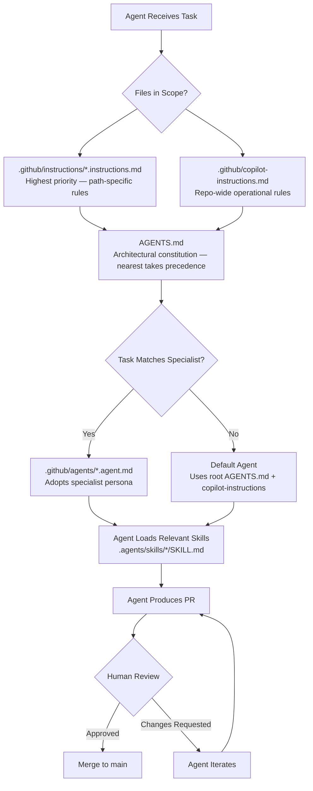

# GitHub Agents Configuration Roadmap — Backend

> **Status:** Proposed
> **Date:** 2026-09-22
> **Owner:** Solo Founder / Twistloom Engineering

---

## 1. Summary Table

| # | Item | Priority | Status |
|---|------|----------|--------|
| 1 | Root `AGENTS.md` — Cross-agent architectural constitution | `P0` | ✅ Completed |
| 2 | `.github/copilot-instructions.md` — Operational workflow rules | `P0` | ⬜ Planned |
| 3 | `.github/instructions/database.instructions.md` — Database-specific rules | `P1` | ⬜ Planned |
| 4 | `.github/instructions/ai.instructions.md` — AI orchestration rules | `P1` | ⬜ Planned |
| 5 | `.github/instructions/payments.instructions.md` — Credits & payments rules | `P1` | ⬜ Planned |
| 6 | `.github/instructions/story-engine.instructions.md` — Story engine rules | `P1` | ⬜ Planned |
| 7 | `.github/instructions/sse-streaming.instructions.md` — SSE streaming rules | `P2` | ⬜ Planned |
| 8 | `.github/instructions/auth.instructions.md` — Auth & session rules | `P1` | ⬜ Planned |
| 9 | `.github/agents/story-engine-engineer.agent.md` — Story engine specialist | `P0` | ⬜ Planned |
| 10 | `.github/agents/backend-quality-engineer.agent.md` — Quality specialist | `P0` | ⬜ Planned |
| 11 | `.github/agents/ai-orchestration-engineer.agent.md` — AI orchestration specialist | `P1` | ⬜ Planned |
| 12 | `.github/agents/database-engineer.agent.md` — Database specialist | `P1` | ⬜ Planned |
| 13 | `.github/agents/security-reviewer.agent.md` — Security specialist | `P1` | ⬜ Planned |
| 14 | `.github/agents/payments-economy-reviewer.agent.md` — Payments specialist | `P2` | ⬜ Planned |
| 15 | `.github/agents/async-systems-engineer.agent.md` — Async/cron specialist | `P2` | ⬜ Planned |
| 16 | `.github/agents/api-maintainer.agent.md` — API route specialist | `P2` | ⬜ Planned |
| 17 | `.agents/skills/story-state-audit/SKILL.md` — Story state audit procedure | `P1` | ⬜ Planned |
| 18 | `.agents/skills/branch-safety-review/SKILL.md` — Branch isolation verification | `P1` | ⬜ Planned |
| 19 | `.agents/skills/canon-validation-review/SKILL.md` — Canon validation audit | `P1` | ⬜ Planned |
| 20 | `.agents/skills/sse-stream-audit/SKILL.md` — SSE streaming correctness audit | `P1` | ⬜ Planned |
| 21 | `.agents/skills/credit-transaction-audit/SKILL.md` — Credits & payments audit | `P1` | ⬜ Planned |
| 22 | `.agents/skills/prompt-cost-audit/SKILL.md` — Token/cost optimization audit | `P2` | ⬜ Planned |
| 23 | `.agents/skills/database-migration-review/SKILL.md` — Schema migration review | `P2` | ⬜ Planned |
| 24 | `.agents/skills/api-contract-review/SKILL.md` — API contract verification | `P2` | ⬜ Planned |
| 25 | `.agents/skills/doc-sync-audit/SKILL.md` — Documentation drift detection | `P0` | ⬜ Planned |
| 26 | `.agents/skills/architecture-doc-audit/SKILL.md` — Architecture doc rigor audit | `P0` | ⬜ Planned |
| 27 | `.agents/skills/roadmap-doc-audit/SKILL.md` — Roadmap doc rigor audit | `P0` | ⬜ Planned |
| 28 | `.agents/skills/critique-workflow/SKILL.md` — Rigorous critique + refinement | `P0` | ⬜ Planned |
| 29 | `.github/agents/doc-maintenance-engineer.agent.md` — Documentation maintenance | `P1` | ⬜ Planned |
| 30 | `.github/workflows/doc-sync.yml` — GitHub Action: auto-audit docs on push | `P1` | ⬜ Planned |
| 31 | `.github/workflows/doc-audit.yml` — GitHub Action: auto-audit new docs | `P1` | ⬜ Planned |

---

## 2. Problem Statement

### Current State

- The repository has a comprehensive `AGENTS.md` (573 lines) containing architectural rules, established patterns (LRU caching, Redis multi-tier caching, credits/financial integrity, SSE streaming, Drizzle ORM, Hono routes, hot-path performance, data sanitization), development commands, and an architecture documentation sitemap.
- No `.github/` directory exists — no `copilot-instructions.md`, no `instructions/`, no `agents/`, no workflows.
- The `.agents/skills/` directory contains only `roadmap-doc/SKILL.md`.
- GitHub Copilot cloud agents and local Copilot Chat have no structured way to understand Twistloom's domain-specific invariants beyond the root `AGENTS.md`.
- There are no specialist agents for high-value delegated work (story engine, quality, AI orchestration, database, security, payments).
- There are no reusable skill procedures for common audit tasks (story state verification, branch safety, canon validation, SSE correctness, credit transactions).
- The backend spans 15+ distinct domains (routes, services, utils, config, types, db, cron, middleware, hono, ai-clients, ai-clients providers, gateways, etc.) — a generic agent walking into this codebase without instructions could easily make a locally reasonable change that violates a system-level invariant.

### Pain Points

1. **Generic agent behavior** — A GitHub Copilot cloud agent assigned to fix a story generation bug has no understanding of BookMode semantics, branch isolation, canon validation, or the deterministic-vs-generative principle. It will apply generic Hono/TypeScript patterns that may violate Twistloom's architecture.
2. **No operational workflow guidance** — `AGENTS.md` encodes *what* the system is, but not *how* to work in this repo (tooling, validation commands, PR discipline, working style, import conventions).
3. **No path-specific rules** — Database schema, AI orchestration, payments, story engine, and SSE streaming each have unique constraints buried in a 573-line root file. Agents working on database code must parse rules about payments, SSE, and AI providers.
4. **No specialist personas** — Complex delegated tasks (story engine bugs, credit transaction correctness, AI provider fallback, branch isolation) benefit from agents with tuned risk posture, priority ordering, and domain-specific definition of done.
5. **No reusable skill procedures** — Common audit tasks (branch safety review, canon validation, SSE stream correctness, credit transaction integrity, prompt cost analysis) are performed ad-hoc without standardized, repeatable procedures.
6. **Documentation drift** — 40+ architecture MD files and 46+ roadmap MD files exist in `docs/`. When code changes are pushed, these docs silently become stale. No automated mechanism detects or prompts updates.
7. **No doc audit on creation** — When new architecture/roadmap MDs are written, there is no rigorous verification that the doc accurately reflects the actual codebase. Docs may describe patterns that don't exist, reference files that have been moved, or recommend approaches that conflict with existing implementation.
8. **Critique workflow is manual** — The rigorous audit pattern (find bugs/issues/inefficiencies → assess real vs false positive → propose refinements) is performed ad-hoc. There is no standardized skill or automation for this workflow.

### Goal

Establish a complete GitHub Agents ecosystem — `.github/copilot-instructions.md`, `.github/instructions/`, `.github/agents/`, and `.agents/skills/` — so that both GitHub Copilot cloud agents and local AI coding tools can produce high-quality, architecture-compliant PRs with minimal human correction. Additionally, automate documentation synchronization and rigorous audit workflows so architecture/roadmap MDs stay accurate and are verified against the actual codebase on every push.

---

## 3. Intended Design & Rationale

### Design Architecture

The configuration follows a **five-layer** conceptual separation with a feedback loop:

```
                    WHO?
             .github/agents/
                    |
                    v
             HOW SHOULD I WORK?
     .github/copilot-instructions.md
                    |
                    v
             WHERE AM I WORKING?
   .github/instructions/*.instructions.md
                    |
                    v
            WHAT SYSTEM IS THIS?
                 AGENTS.md
                    |
                    v
         IS DOCS STILL ACCURATE?
        .agents/skills/doc-sync-audit
        .agents/skills/architecture-doc-audit
        .agents/skills/roadmap-doc-audit
        .github/workflows/doc-sync.yml
        .github/workflows/doc-audit.yml
                    |
                    v
           FEEDBACK LOOP
    Code changes -> Auto-audit docs -> Prompt updates
    New docs -> Auto-audit against codebase -> Validate accuracy
```

| File | Purpose | Think of it as |
|------|---------|----------------|
| `AGENTS.md` | Cross-agent architectural constitution | "What truths about this system must you understand before modifying this repository?" |
| `.github/copilot-instructions.md` | Operational workflow rules | "How should you modify this repository?" |
| `.github/instructions/*.instructions.md` | Path-specific rules | "What constraints apply to the code I'm touching right now?" |
| `.github/agents/*.agent.md` | Specialist personas | "Who should do the work, and what is their risk posture?" |
| `.agents/skills/*/SKILL.md` | Reusable procedures | "How do I perform this specific audit or task?" |
| `.github/workflows/doc-*.yml` | Documentation automation | "Keep docs accurate and audit new docs on every push" |

### Design Alternatives

#### Alternative A: Single Mega-AGENTS.md (Current State)

Keep everything in the root `AGENTS.md` as-is.

**Pros:** Simple, single source of truth, no coordination between files.
**Cons:** 573+ lines that agents must parse fully; no path-specific scoping; no specialist tuning; no operational workflow guidance; agents apply irrelevant rules to every change.

#### Alternative B: Split into `.github/copilot-instructions.md` + `.github/instructions/` only

Move rules out of `AGENTS.md` into GitHub-specific instruction files.

**Pros:** GitHub-native, path-specific scoping via `applyTo`.
**Cons:** Locks architectural knowledge to GitHub Copilot only; not portable to other AI tools; loses the cross-agent `AGENTS.md` standard.

#### Alternative C: Five-layer separation (Recommended)

Maintain `AGENTS.md` as the cross-agent constitution, add `.github/copilot-instructions.md` for operational rules, `.github/instructions/` for path-specific constraints, `.github/agents/` for specialist personas, and `.agents/skills/` for reusable procedures.

**Pros:** Portable across AI tools (AGENTS.md + skills); GitHub-native optimization (copilot-instructions + agents + instructions); clear separation of concerns; specialist agents reduce risk; reusable skills eliminate duplication.
**Cons:** More files to maintain; requires discipline to keep layers consistent.

#### Alternative D: Five-layer + Documentation Feedback Loop (Recommended + Enhanced)

Same as Alternative C, plus:
- `.agents/skills/doc-sync-audit/` — detects documentation drift after code changes
- `.agents/skills/architecture-doc-audit/` — rigorous audit of architecture MDs against codebase
- `.agents/skills/roadmap-doc-audit/` — rigorous audit of roadmap MDs against codebase
- `.agents/skills/critique-workflow/` — standardized critique + refinement workflow
- `.github/agents/doc-maintenance-engineer.agent.md` — specialist for doc accuracy
- `.github/workflows/doc-sync.yml` — GitHub Action triggered on push to audit doc drift
- `.github/workflows/doc-audit.yml` — GitHub Action triggered on new/modified docs

**Pros:** Self-healing documentation; docs stay accurate automatically; rigorous audit on creation; standardized critique workflow; reduces manual doc maintenance burden.
**Cons:** More automation to configure; requires initial investment in audit procedures; GitHub Actions cost.

### Recommended: Alternative D

This is superior because:

1. **Self-healing docs** — When code changes, the doc-sync-audit skill detects drift and prompts updates. Docs never silently go stale.
2. **Rigorous creation audit** — When new architecture/roadmap MDs are written, the audit skills verify accuracy against the actual codebase before merging.
3. **Standardized critique** — The critique-workflow skill provides a repeatable, rigorous audit pattern that can be triggered by any agent or human.
4. **Reduced maintenance burden** — The doc-maintenance-engineer agent handles routine doc updates, freeing the founder for architecture work.
5. **CI/CD integration** — GitHub Actions ensure doc accuracy is enforced on every push, not just when someone remembers to check.

### Non-Breaking Guarantees

| Change | What it does NOT change | Why safe |
|--------|------------------------|----------|
| Add `.github/copilot-instructions.md` | Existing `AGENTS.md` content | Additive; GitHub treats both as instruction layers |
| Add `.github/instructions/*.instructions.md` | Root-level rules | Path-specific rules supplement, not replace |
| Add `.github/agents/*.agent.md` | Default Copilot behavior | Specialist agents are manually selected, not auto-invoked (with `disable-model-invocation: true`) |
| Add `.agents/skills/*/SKILL.md` | Existing `roadmap-doc` skill | Additive; new skills alongside existing |
| Add doc-sync-audit skills | No code changes | Audit-only; reads codebase, compares to docs |
| Add GitHub Actions workflows | No code changes | Runs on push; creates issues/PRs for doc updates |
| Restructure `AGENTS.md` sections | Rule content | Reorganization only; no rule removal |

### Cross-Repository Consistency

The 4 doc-audit skills (`doc-sync-audit`, `architecture-doc-audit`, `roadmap-doc-audit`, `critique-workflow`) and the 2 GitHub Actions workflows (`doc-sync.yml`, `doc-audit.yml`) are intentionally shared between `Twistloom-backend` and `Twistloom-web`. These define the same procedures in both repos.

**DRY strategy:** When updating these shared definitions, update BOTH repos in the same PR or commit. Consider extracting the shared definitions into a cross-reference comment in each file pointing to the canonical version (e.g., "This skill is shared with Twistloom-backend — update both when changing procedures").

**Future option:** If maintenance burden grows, consider a third `Twistloom-config` repository with symlinks or a git submodule. For now, manual dual-update is sufficient for 4 skills + 2 workflows.

---

## 4. Feasibility Analysis

| Dimension | Assessment |
|-----------|------------|
| **Effort** | Medium (2-3 days for full creation + testing) |
| **Risk** | Low — all additive; no existing behavior changed |
| **Backend changes** | None — configuration files only |
| **Dependencies** | None — all files are self-contained configuration |
| **Reversibility** | Fully reversible — delete files to revert |

---

## 5. Flow Diagram



---

## 6. Implementation Plan

### Step 1: Create `.github/copilot-instructions.md` — ⬜ Planned

**Files:** `.github/copilot-instructions.md` (NEW)
**Effort:** Low

This file encodes **how Copilot should work** in this repo — operational workflow, tooling, validation, PR discipline. It is deliberately kept separate from the architectural truth in `AGENTS.md`.

**Layering principle:** Architectural rules (BookMode, branch safety, credits integrity, provider abstraction, SSE anti-patterns) belong ONLY in `AGENTS.md`. This file contains only operational and workflow rules that are NOT architectural invariants.

```markdown
# GitHub Copilot Instructions — Twistloom Backend

## Working style

- Inspect related types, services, configuration, and callers before modifying code.
- Prefer the smallest change that correctly solves the requested problem.
- Follow existing repository patterns before introducing a new abstraction.
- Do not add a dependency when the existing stack or standard platform APIs can solve the problem cleanly.
- Do not perform unrelated refactors while implementing a targeted change.

## Runtime and tooling

- Use Bun as the local runtime and package manager.
- Use `bun` commands, not `npm`, `yarn`, or `pnpm`.
- Production deployment currently runs on Vercel's Node.js runtime; do not assume Bun-only APIs are available in production code.
- Prefer Web Platform APIs where practical because the codebase intentionally remains runtime-portable.

## TypeScript

- Preserve strict TypeScript safety.
- Avoid `any` unless there is no reasonable typed alternative.
- Prefer existing domain types over duplicating structural types.
- Do not weaken types merely to silence compiler errors.
- Preserve exhaustive handling of enums and discriminated unions where applicable.

## Imports

- All local imports MUST include explicit `.js` extensions (e.g. `import { db } from '../db/client.js';`).
- This adheres to ESM module resolution and is enforced by `bun lint:imports`.

## Validation

After modifying code, run the relevant repository checks.

Prefer:

- `bun check`
- `bun typecheck`
- targeted tests/checks when available

Fix issues caused by the change. Do not hide failures by disabling lint or TypeScript rules.

## Documentation

Update comments or documentation when behavior, contracts, configuration, or architecture materially changes.
Do not add comments that merely restate obvious code.
```

**Non-breaking:** Additive file; no existing behavior changed.

---

### Step 2: Create `.github/instructions/` Path-Specific Files — ⬜ Planned

**Files:** 5 instruction files (ALL NEW)
**Effort:** Medium

GitHub explicitly guarantees that matching path-specific instructions and repository-wide Copilot instructions are both applied. This allows domain-specific constraints to supplement the root rules without cluttering the repo-wide file.

**Layering principle:** Do NOT repeat rules from `AGENTS.md` in these files. Instead, reference `AGENTS.md` and add ONLY path-scoped context (file-specific patterns, common pitfalls for that subsystem, codebase-specific caveats). Each invariant should be stated ONCE in `AGENTS.md` and referenced elsewhere.

#### `.github/instructions/database.instructions.md`

```markdown
---
applyTo: "src/db/**/*.ts"
---

# Database-Specific Instructions

## ORM & Database

- Use Drizzle ORM for all schema/query changes.
- Preserve Neon PostgreSQL compatibility (serverless, WebSocket connections).
- Use `dbRead` for read-only replica queries and `dbWrite` for write operations / transactions.
- Denormalized counters (`likesCount`, `readCount`, `favoritesCount`) are maintained via PostgreSQL triggers — do not add application-level COUNT(*) subqueries.

## Schema Changes

- Schema changes are made ONLY in `src/db/schema.ts` and related application types.
- **DO NOT** run `bun db:generate` or `bun db:migrate` automatically.
- The human developer reviews schema changes and runs migrations manually.
- Preserve forward-compatible schema design: typed columns over JSONB for queried/filtered/sorted fields.

## pgvector

- Preserve pgvector dimensions and HNSW index semantics.
- Do not modify embedding dimensions without explicit instruction.
- Semantic memory is supplementary, not authoritative over structured state.

## Performance

- Check query plans and index implications for performance-sensitive queries.
- Avoid N+1 queries — use Drizzle relational queries or batch loading.
- Preserve existing indexes unless necessary.
- Add indexes for new query patterns.

## Migrations

- Migrations must be backward-safe.
- Never modify production data implicitly.
- Preserve existing column types and constraints unless explicitly changing them.
```

#### `.github/instructions/ai.instructions.md`

```markdown
---
applyTo: "src/utils/ai*.ts", "src/config/ai*.ts", "src/utils/prompt*.ts"
---

# AI Orchestration Instructions

## Provider Abstraction

- AI providers are replaceable implementations behind shared abstractions.
- Business logic must not depend unnecessarily on one provider.
- Provider/model failure should follow the existing fallback and retry strategy.
- Do not bypass the provider abstraction for convenience.

## Provider Waterfall (8 Providers)

1. Mistral — Primary creative writing prose & natural character voices
2. Google Gemini — Large context (1M+ tokens), rapid generation, world-building lore
3. OpenRouter — Unified gateway for Qwen, Llama-4, DeepSeek, Nemotron
4. Cerebras — Ultra-high-speed inference for GLM-4.7 & reasoning
5. Groq — Low-latency fast validation (Llama-3.3, Qwen)
6. NVIDIA — Cost-effective Llama-3.3 on NIM
7. Cloudflare Workers AI — Edge inference for Mistral-7B / Llama-3.1
8. Cohere — Last-resort fallback (Command-R)

## Deterministic vs Generative

- Use AI for tasks requiring semantic or generative reasoning.
- Prefer deterministic code for: validation, numerical state transitions, limits, thresholds, permissions, branching contracts, economy calculations, state reconstruction, structural consistency.
- Do not move deterministic engine responsibility into prompts merely because an LLM could perform the task.

## Prompt Engineering

- Avoid increasing prompt/context size without a clear reason.
- Preserve structured-output validation and error recovery.
- Prompt templates are in `src/config/` — do not scatter prompts across business logic.

## SSE Streaming

- Always pass `c.req.raw.signal` into AI provider calls so client disconnections terminate upstream GPU workloads.
- Use `pipeSSEStreamAndExtractText` for text extraction — never concatenate raw Uint8Array chunks.
- Use `StreamingJsonAnswerExtractor` for structured JSON responses — never pipe raw JSON tokens to client.
- DB cache MUST store pure text, never SSE wire protocol envelopes.

## Token Cost

- Consider token/cost impact of every AI-related change.
- Memoize expensive prompt serialization with page-scoped keys.
- Prefer smaller models for validation tasks.
```

#### `.github/instructions/payments.instructions.md`

```markdown
---
applyTo: "src/services/credits.ts", "src/config/credits.ts", "src/routes/payments.ts", "src/services/gateways/**/*.ts"
---

# Payments & Credits Instructions

## Credits Integrity

- Credits represent user value — any deduction or refund must preserve transactional correctness and idempotency.
- Use `executeWithCredits` for all credit-consuming operations — it acquires a row-level lock (`SELECT ... FOR UPDATE`).
- Pass `tx` to ALL internal database operations inside `executeWithCredits` callbacks.
- Never bypass `executeWithCredits` with direct `dbWrite` credit updates.
- Activity logging goes OUTSIDE the transaction boundary so analytics errors never roll back purchases.

## Payment Gateways

- Twistloom supports Stripe and Xendit as gateway-agnostic payment providers.
- Check both gateways during status resolution to handle webhook delivery lag.
- Webhook handlers must tolerate retries — always verify idempotency.
- Payment-related updates must not overwrite `updatedAt` — it is a user-controlled profile field.

## Numeric Parsing

- Never use `parseInt` on decimal strings from Stripe — use `parseFloat`.
- Use `(a + b - 1n) / b` for BigInt ceiling division — PostgreSQL `ceil()` truncates on BigInt cast.

## Rate Limiting

- Never use in-memory counters for rate limiting in serverless — use Upstash Redis atomic ops.
- Always fail open if Redis is unavailable.

## Refunds

- Use `refundCreditsIdempotent` — it verifies against the `transactions` table before issuing refunds.
- Never issue blind refunds without idempotency verification.

## Logging

- Never log usernames, emails, or IPs in production payment flows.
- Use correlation IDs for tracing; log only non-PII metadata.
```

#### `.github/instructions/story-engine.instructions.md`

```markdown
---
applyTo: "src/services/story*.ts, src/utils/branch*.ts, src/utils/companion*.ts, src/config/story*.ts, src/cron/**/*.ts, src/routes/books*.ts, src/routes/pages*.ts"
---

# Story Engine Instructions

See `AGENTS.md` for the full architectural invariants. This file adds path-specific context for files in the story engine pipeline.

## Story Pipeline Scope

Story engine rules apply to the entire pipeline: route entry points (`src/routes/books*.ts`, `src/routes/pages*.ts`), services (`src/services/story*.ts`), utilities (`src/utils/branch*.ts`, `src/utils/companion*.ts`), configuration (`src/config/story*.ts`), and async generation (`src/cron/**/*.ts`).

## Common Pitfalls

- Route handlers must not contain story-state reconstruction logic — delegate to services.
- Cron jobs may run concurrently and must be idempotent — do not assume single execution.
- Branch traversal must be deterministic — same input always produces same output.
- Cache entries (LRU, Redis) are optimization, never canonical state.
```

#### `.github/instructions/sse-streaming.instructions.md`

```markdown
---
applyTo: "src/utils/*stream*.ts", "src/utils/*sse*.ts", "src/routes/**/stream*.ts"
---

# SSE Streaming Instructions

## The 4 Streaming Archetypes

1. **Pure Prose Text Stream** — Unstructured narrative tokens piped via `aiStreamSSE` + `pipeSSEStreamAndExtractText`.
2. **Structured JSON Delta Extraction** — Intercepts LLM JSON responses with `StreamingJsonAnswerExtractor`.
3. **Adaptive Cached Replay** — Replays database-cached text with 3-stage human typing cadence via `streamCachedPrompt`.
4. **Long-Running Task Progress** — Progress events updating client on multi-step generation milestones.

## Standard SSE Wire Protocol

- Headers: `Content-Type: text/event-stream; charset=utf-8`, `Cache-Control: no-cache, no-transform`, `Connection: keep-alive`, `X-Accel-Buffering: no`
- Events: `start`, `chunk`, `done`, `end`, `error`

## Critical Anti-Patterns

- **Raw Uint8Array Concatenation Trap**: Do NOT concatenate raw chunks and decode with TextDecoder — pollutes cache with wire envelopes. Use `pipeSSEStreamAndExtractText`.
- **Double Protocol Wrapping**: Never feed SSE protocol strings into `streamCachedPrompt()`. DB cache MUST store pure text.
- **Raw JSON Leaks**: Never pipe raw structured JSON tokens to client. Use `StreamingJsonAnswerExtractor`.
- **Missing AbortSignal**: ALWAYS pass `c.req.raw.signal` into `aiStreamSSE` or provider calls.
- **Manual String Encoding**: Use Hono's typed helper: `await stream.writeSSE({ event: "chunk", data: JSON.stringify(...) })`.

## Canonical Recipe

```typescript
import { streamSSE } from "hono/streaming";
import { streamCompanionAnswerSSE } from "../utils/companion-stream.js";
import { executeWithCredits } from "../services/credits.js";
import { getErrorMessage } from "../utils/error.js";

router.post("/:identifier/:pageId/companion/ask/stream", requireAuth, async (c) => {
  const userId = c.get("userId")!;
  const { question } = await c.req.json();

  return streamSSE(c, async (stream) => {
    try {
      const { result } = await executeWithCredits(
        userId,
        "COMPANION_ASK",
        async () => {
          return streamCompanionAnswerSSE({
            userPrompt: buildCompanionPrompt(question),
            signal: c.req.raw.signal,
            onChunk: async (proseDelta) => {
              await stream.writeSSE({
                event: "chunk",
                data: JSON.stringify({ content: proseDelta })
              });
            }
          });
        },
        { context: "companion_ask" }
      );

      await stream.writeSSE({
        event: "done",
        data: JSON.stringify(result)
      });
    } catch (err) {
      await stream.writeSSE({
        event: "error",
        data: JSON.stringify({ message: getErrorMessage(err) })
      });
    }
  });
});
```
```

**Non-breaking:** Path-specific rules supplement root rules via GitHub's documented additive behavior.

---

### Step 2b: Create `.github/instructions/auth.instructions.md` — ⬜ Planned

**Files:** `.github/instructions/auth.instructions.md` (NEW)
**Effort:** Low

```markdown
---
applyTo: "src/middleware/auth*.ts, src/middleware/nextauth*.ts, src/routes/auth*.ts, src/routes/payments*.ts"
---

# Auth & Session Instructions

See `AGENTS.md` for the full security invariants. This file adds path-specific context for authentication, authorization, and session management files.

## Common Pitfalls

- `verifyNextAuthToken` performs JWE decryption + lookups on every request — cache the resolved `{ userId, sessionId }` in a short-TTL LRU keyed by SHA-256 hash of the raw token.
- Invalidate session cache immediately on logout.
- Authentication proves identity; authorization decides whether that identity may perform an operation. Do not treat possession of an identifier as authorization.
- Guest/authenticated migration semantics must be preserved — not every reader has a logged-in account.
- Payment webhook handlers must tolerate retries and verify idempotency before processing.
- Rate limiting for auth endpoints uses Upstash Redis atomic ops — never in-memory counters.
```

**Non-breaking:** Additive file; no existing behavior changed.

---

### Step 3: Create `.github/agents/` Specialist Agents — ⬜ Planned

**Files:** 8 agent files (ALL NEW)
**Effort:** High

#### Priority Ranking (Backend)

| Rank | Agent | Value for Twistloom | Autonomy |
|------|-------|---------------------|----------|
| **1** | `story-engine-engineer.agent.md` | Branching, state reconstruction, BookMode, canon, candidate generation | 🟡 Human review mandatory |
| **2** | `backend-quality-engineer.agent.md` | Regression tests, bug investigation, type safety, concurrency, error paths | 🟢 High |
| **3** | `ai-orchestration-engineer.agent.md` | Providers, prompts, structured output, fallback, token/cost behavior | 🟡 |
| **4** | `database-engineer.agent.md` | Drizzle, Neon, pgvector, indexes, migrations, query performance | 🟡 |
| **5** | `security-reviewer.agent.md` | Auth, permissions, secrets, prompt injection, rate limits | 🟢 for review; 🔴 for autonomous auth rewrites |
| **6** | `payments-economy-reviewer.agent.md` | Credits, Stripe/Xendit, subscriptions, webhook idempotency | 🔴 |
| **7** | `async-systems-engineer.agent.md` | GitHub Actions generation, retries, locking, stale recovery | 🟡 |
| **8** | `api-maintainer.agent.md` | Hono routes, request validation, response contracts, docs | 🟢 |

#### #1 — `story-engine-engineer.agent.md`

```markdown
---
name: Story Engine Engineer
description: Specialist for Twistloom branching narratives, story state, BookMode contracts, branch traversal, candidate generation, and canon consistency.
target: github-copilot
disable-model-invocation: true
user-invocable: true
---

# Role

You are the Twistloom Story Engine Engineer.

Work on tasks involving branching narrative architecture, state reconstruction,
BookMode behavior, candidate generation, canon validation, and persistent
narrative state.

Read the repository AGENTS.md before proposing or implementing changes.

## Priorities

In order:

1. State correctness
2. Branch isolation
3. Narrative continuity
4. Deterministic engine behavior
5. Reliability
6. Performance
7. AI/token cost
8. Implementation simplicity

## Core invariants

Structured engine state is authoritative over inferred prose state.

Never collapse Multiverse semantics into conventional one-action/one-destination
branching.

Preserve deterministic state reconstruction.

Cache data is never canonical state.

Semantic memory supplements canonical state; it does not override it.

Do not introduce additional AI calls when deterministic logic can solve the
problem reliably.

## Working procedure

Before editing:

1. Locate the relevant domain types.
2. Trace the full read/write flow.
3. Identify branch/state invariants affected by the change.
4. Inspect existing tests and validation.

When implementing:

- Prefer minimal changes.
- Preserve public contracts unless explicitly requested.
- Account for retries, concurrency, and partial failure where relevant.

Before completion:

- Run relevant checks (`bun check`).
- Explain any changed invariant.
- Identify migration or backwards-compatibility risk.
- Report unresolved architectural uncertainty rather than silently guessing.
```

#### #2 — `backend-quality-engineer.agent.md`

```markdown
---
name: Backend Quality Engineer
description: Specialist for regression tests, bug investigation, type safety, concurrency correctness, error paths, and code quality.
target: github-copilot
disable-model-invocation: false
user-invocable: true
---

# Role

You are the Twistloom Backend Quality Engineer.

Work on tasks involving bug investigation, TypeScript correctness,
regression testing, concurrency analysis, error path verification, and code quality.

Read the repository AGENTS.md before proposing or implementing changes.

## Priorities

In order:

1. Correctness — fix the bug without introducing new ones
2. Type safety — no `any`, no unsafe casts
3. Regression prevention — add tests or verification where possible
4. Concurrency safety — race conditions, distributed locking, idempotency
5. Code cleanliness — remove dead code, consolidate duplicates
6. Performance — avoid unnecessary DB/AI calls

## Common Tasks

- Investigate and fix isolated bugs
- Add regression tests for existing behavior
- Fix TypeScript errors without weakening types
- Audit error paths for unhandled cases
- Find race conditions in concurrent operations
- Verify idempotency of credit/payment operations
- Audit SSE stream error handling

## Working procedure

Before editing:

1. Reproduce the issue if possible.
2. Trace the full service/utility flow involved.
3. Identify the root cause (not just the symptom).

When implementing:

- Prefer the smallest safe fix.
- Do not refactor unrelated code.
- Preserve existing behavior unless the fix requires changing it.

Before completion:

- Run `bun check`.
- Verify the fix does not break adjacent functionality.
- Explain the root cause and the fix.
```

#### #3 — `ai-orchestration-engineer.agent.md`

```markdown
---
name: AI Orchestration Engineer
description: Specialist for AI provider integration, prompt engineering, structured output, fallback/retry, token cost, and SSE streaming.
target: github-copilot
disable-model-invocation: true
user-invocable: true
---

# Role

You are the Twistloom AI Orchestration Engineer.

Work on tasks involving AI provider integration, prompt templates, structured
output parsing, fallback/retry strategies, token usage optimization, and SSE
streaming correctness.

Read the repository AGENTS.md before proposing or implementing changes.

## Priorities

In order:

1. Provider abstraction integrity
2. Structured output correctness
3. Fallback/retry reliability
4. Token cost optimization
5. SSE streaming correctness
6. Prompt engineering quality

## Core invariants

LLM provider != business logic. Providers are replaceable implementations.

Business logic must not depend on one specific provider.

Provider/model failure must follow the existing fallback strategy.

Do not bypass the provider abstraction for convenience.

Always pass abort signals to AI calls.

Do not increase prompt context size without justification.

## Working procedure

Before editing:

1. Identify the provider(s) involved.
2. Trace the prompt construction and output parsing flow.
3. Check fallback chain behavior.
4. Verify token/cost implications.

When implementing:

- Reuse the existing provider abstraction.
- Preserve structured-output validation.
- Account for provider-specific quirks (e.g., Gemini schema limits).

Before completion:

- Run `bun check`.
- Report token/cost impact of changes.
- Verify SSE streaming correctness if applicable.
```

#### #4 — `database-engineer.agent.md`

```markdown
---
name: Database Engineer
description: Specialist for Drizzle ORM, Neon PostgreSQL, pgvector, indexes, migrations, query performance, and schema design.
target: github-copilot
disable-model-invocation: true
user-invocable: true
---

# Role

You are the Twistloom Database Engineer.

Work on tasks involving Drizzle schema design, Neon PostgreSQL compatibility,
pgvector operations, index optimization, migration safety, and query performance.

Read the repository AGENTS.md before proposing or implementing changes.

## Priorities

In order:

1. Data integrity
2. Schema forward-compatibility
3. Query performance
4. Migration safety
5. Neon PostgreSQL compatibility
6. pgvector correctness

## Core invariants

Drizzle schema is authoritative.

Schema changes are made ONLY in `src/db/schema.ts`.

DO NOT run `bun db:generate` or `bun db:migrate` automatically.

Use `dbRead` for reads, `dbWrite` for writes/transactions.

Migrations must be backward-safe.

Never modify production data implicitly.

## Working procedure

Before editing:

1. Identify the schema/table involved.
2. Trace all read/write paths to the table.
3. Check existing indexes and query plans.
4. Verify Neon PostgreSQL compatibility.

When implementing:

- Preserve existing column types and constraints.
- Add indexes for new query patterns.
- Use typed columns over JSONB for queried fields.

Before completion:

- Run `bun check`.
- Do NOT run migration commands.
- Report index/migration implications.
```

#### #5 — `security-reviewer.agent.md`

```markdown
---
name: Security Reviewer
description: Specialist for authentication, authorization, secrets management, prompt injection protection, rate limiting, and input sanitization.
target: github-copilot
disable-model-invocation: true
user-invocable: true
---

# Role

You are the Twistloom Security Reviewer.

Work on security audits, authentication/authorization reviews, secrets management,
prompt injection protection, rate limiting verification, and input sanitization.

Read the repository AGENTS.md before proposing or implementing changes.

## Priorities

In order:

1. Authentication correctness
2. Authorization enforcement
3. Input sanitization
4. Secrets protection
5. Rate limiting
6. Prompt injection defense
7. Webhook verification

## High-risk areas

- Authentication and session management
- Authorization and permission checks
- Password and account management
- Payment webhooks (Stripe/Xendit)
- Credits and subscription state
- User-generated HTML/content sanitization
- Prompt construction and injection protection
- Administrative APIs
- Production database migrations

## Working procedure

Before reviewing:

1. Identify the security boundary being modified.
2. Trace the full auth/authz flow.
3. Check for secrets in code or logs.
4. Verify input sanitization.

When implementing:

- Prefer conservative changes.
- Add explicit validation.
- Preserve existing security boundaries.

Before completion:

- Run `bun check`.
- Never expose secrets or keys.
- Log PII only with hashed identifiers.
```

#### #6 — `payments-economy-reviewer.agent.md`

```markdown
---
name: Payments Economy Reviewer
description: Specialist for credits integrity, Stripe/Xendit gateway-agnostic patterns, subscription management, webhook idempotency, and refund safety.
target: github-copilot
disable-model-invocation: true
user-invocable: true
---

# Role

You are the Twistloom Payments Economy Reviewer.

Work on tasks involving credits consumption, refunds, payment gateway integration
(Stripe/Xendit), subscription management, webhook handling, and financial
transaction integrity.

Read the repository AGENTS.md before proposing or implementing changes.

## Priorities

In order:

1. Financial correctness — credits must never be double-spent or lost
2. Idempotency — webhook handlers and refunds must tolerate retries
3. Transactional coupling — credits + business logic must be atomic
4. Gateway agnosticism — Stripe and Xendit must both work correctly
5. Security — no PII in logs, no exposed secrets
6. Audit trail — correlation IDs for tracing

## Core invariants

Credits represent user value. Any deduction or refund must preserve
transactional correctness and idempotency.

Use `executeWithCredits` for all credit-consuming operations. Pass `tx` to
ALL internal database operations inside callbacks.

Activity logging goes OUTSIDE the transaction boundary.

Never use `parseInt` on decimal strings — use `parseFloat`.
Use `(a + b - 1n) / b` for BigInt ceiling division.

Never use in-memory rate limiters — use Upstash Redis atomic ops.

Use `refundCreditsIdempotent` — verify against transactions table before refunding.

Never log usernames, emails, or IPs in production.

Payment-related updates must not overwrite `updatedAt`.

## Risk posture

This agent is 🔴 — never autonomous on payment flows. All changes require
human review with explicit verification of:
- Credit deduction correctness
- Idempotency guarantees
- Transaction boundary integrity

## Working procedure

Before editing:

1. Identify the payment/credit flow being modified.
2. Trace the full transaction boundary (executeWithCredits callback).
3. Verify idempotency of all operations.
4. Check both gateway paths (Stripe and Xendit).

When implementing:

- Prefer minimal changes.
- Never bypass executeWithCredits.
- Keep external calls outside transaction boundary.

Before completion:

- Run `bun check`.
- Verify credit arithmetic is correct.
- Verify no PII in logs.
- Explain any changed financial invariant.
```

#### #7 — `async-systems-engineer.agent.md`

```markdown
---
name: Async Systems Engineer
description: Specialist for GitHub Actions-based generation, distributed locking, stale-job recovery, idempotency, and background task orchestration.
target: github-copilot
disable-model-invocation: true
user-invocable: true
---

# Role

You are the Twistloom Async Systems Engineer.

Work on tasks involving GitHub Actions-based book/candidate generation,
distributed locking, stale-job recovery, retries, cancellation, progress
persistence, and background task orchestration.

Read the repository AGENTS.md before proposing or implementing changes.

## Priorities

In order:

1. Idempotency — jobs may run more than once
2. Stale-job recovery — original HTTP request may not be alive
3. Distributed locking — prevent concurrent generation for same resource
4. Cancellation — support graceful cancellation of long-running jobs
5. Progress persistence — track generation state across process boundaries
6. Retry safety — narrow retry scope to avoid repeating expensive work

## Core invariants

Long-running generation executes outside the request lifecycle. Do not assume:
- The original HTTP request remains alive
- One process owns the full workflow
- A job runs only once

Changes must consider idempotency, stale-job recovery, retries, distributed
locking, cancellation, and progress persistence.

Generation is intentionally multi-stage. Before consolidating stages, verify
why they are separated. Retries should be scoped narrowly.

## Working procedure

Before editing:

1. Identify the async workflow being modified.
2. Trace the full lifecycle: trigger → lock → execute → persist → unlock.
3. Check idempotency of each step.
4. Verify stale-job recovery paths.

When implementing:

- Prefer minimal changes.
- Preserve existing retry/cancellation semantics.
- Account for concurrent execution.

Before completion:

- Run `bun check`.
- Verify idempotency of modified operations.
- Explain any changed async invariant.
```

#### #8 — `api-maintainer.agent.md`

```markdown
---
name: API Maintainer
description: Specialist for Hono route handlers, request validation, response contracts, error handling, and API documentation.
target: github-copilot
disable-model-invocation: false
user-invocable: true
---

# Role

You are the Twistloom API Maintainer.

Work on tasks involving Hono route handlers, request validation, response
contracts, error handling helpers, and API documentation.

Read the repository AGENTS.md before proposing or implementing changes.

## Priorities

In order:

1. Request validation — validate all inputs
2. Response contracts — preserve existing API shapes
3. Error handling — use standardized error helpers
4. Route thinness — business logic belongs in services
5. Type safety — AppEnv typing on all routers
6. Import correctness — .js extensions on all local imports

## Core invariants

Always type Hono apps and routers with `AppEnv` from `src/hono/env.ts`.

Use standardized error helpers: `cApiError`, `cValidationError`, `cNotFoundError`,
`cUnauthorizedError` from `src/utils/error.ts`.

All local imports MUST include explicit `.js` extensions.

Route handlers must be thin — business logic goes in services.

## Working procedure

Before editing:

1. Identify the route/endpoint being modified.
2. Trace the full request/response flow.
3. Check error handling paths.
4. Verify response contract preservation.

When implementing:

- Keep route handlers thin.
- Reuse existing error helpers.
- Preserve existing response shapes.

Before completion:

- Run `bun check`.
- Verify no response contract changes.
- Verify error handling for all failure paths.
```

**Non-breaking:** All agents use `disable-model-invocation: true` or `false` appropriately; default Copilot behavior unchanged.

---

### Step 4: Create `.agents/skills/` Reusable Procedures — ⬜ Planned

**Files:** 8 skill files (ALL NEW alongside existing `roadmap-doc`)
**Effort:** High

#### `.agents/skills/story-state-audit/SKILL.md`

```markdown
---
name: story-state-audit
description: >-
  Audit story state management for branch isolation violations, state
  reconstruction errors, BookMode contract breaches, and cache staleness.
  Use when investigating story bugs or verifying state correctness.
metadata:
  author: twistloom
  version: "1.0"
---

# Story State Audit Skill

## Trigger
- Story bug investigation
- Pre-release story state verification
- Branch isolation concern

## Procedure

1. **State Ownership Trace**
   - Identify all sources of story state (structured DB, cache, prose, pgvector).
   - Verify structured state is authoritative over prose-derived state.
   - Check cache entries are optimization, never canonical.

2. **Branch Isolation Check**
   - Verify no state leaks between unrelated branches.
   - Check branch traversal produces deterministic results.
   - Verify snapshot/delta reconstruction is branch-safe.

3. **BookMode Contract Verification**
   - Verify Novel mode: one action, one destination.
   - Verify Interactive mode: multiple actions, one destination each.
   - Verify Multiverse mode: multiple actions, multiple candidate realities.
   - Check no mode semantics are collapsed or normalized.

4. **Reconstruction Correctness**
   - Verify deterministic replay from checkpoints + deltas.
   - Check snapshot compatibility across versions.
   - Verify ordered delta application.
   - Confirm semantic memory is not part of reconstruction.

5. **Report**
   - List findings with file:line references.
   - Categorize as Critical / Warning / Suggestion.
   - Provide fix recommendations.
```

#### `.agents/skills/branch-safety-review/SKILL.md`

```markdown
---
name: branch-safety-review
description: >-
  Verify branch isolation in state reconstruction, snapshots, deltas,
  page persistence, candidate generation, and caching.
  Use before merging changes to story state code.
metadata:
  author: twistloom
  version: "1.0"
---

# Branch Safety Review Skill

## Trigger
- Any change touching branch traversal or state reconstruction
- Pre-merge review of story state changes
- Candidate generation changes

## Procedure

1. **Branch Boundary Check**
   - Identify all branch-aware code paths.
   - Verify each path produces branch-isolated results.
   - Check for shared mutable state across branches.

2. **State Leakage Detection**
   - Verify no branch ID leaks into unrelated timelines.
   - Check cache keys include branch identifiers.
   - Verify pgvector queries are branch-scoped where needed.

3. **Concurrent Branch Safety**
   - Verify concurrent reads/writes to different branches don't interfere.
   - Check distributed locking is branch-aware.
   - Verify idempotency of branch operations.

4. **Report**
   - List findings with file:line references.
   - Categorize as Critical / Warning / Suggestion.
```

#### `.agents/skills/canon-validation-review/SKILL.md`

```markdown
---
name: canon-validation-review
description: >-
  Audit canon validation for correctness, fail-open behavior preservation,
  and proper separation between engine validation and AI-assisted evaluation.
metadata:
  author: twistloom
  version: "1.0"
---

# Canon Validation Review Skill

## Trigger
- Changes to canon validation logic
- Pre-release verification of narrative consistency
- Recovery/rewrite behavior changes

## Procedure

1. **Engine vs AI Separation**
   - Verify deterministic engine validation is separate from AI-assisted evaluation.
   - Check canon evaluator does not own structured application state.
   - Verify generation/evaluation separation.

2. **Fail-Open Behavior**
   - Verify canon validation preserves existing fail-open semantics.
   - Check that validation failures don't block narrative progression.
   - Verify recovery/rewrite paths are functional.

3. **State Consistency**
   - Verify canon checks validate against structured state, not prose.
   - Check that canon corrections update structured state correctly.
   - Verify no circular dependencies between canon and state.

4. **Report**
   - List findings with file:line references.
   - Categorize as Critical / Warning / Suggestion.
```

#### `.agents/skills/sse-stream-audit/SKILL.md`

```markdown
---
name: sse-stream-audit
description: >-
  Audit SSE streaming for correct wire protocol, abort signal propagation,
  text extraction correctness, and cache purity.
metadata:
  author: twistloom
  version: "1.0"
---

# SSE Stream Audit Skill

## Trigger
- Any change to SSE streaming code
- New streaming endpoint creation
- Performance investigation of streaming

## Procedure

1. **Wire Protocol Check**
   - Verify correct SSE headers (Content-Type, Cache-Control, Connection, X-Accel-Buffering).
   - Verify correct event types (start, chunk, done, end, error).
   - Check `stream.writeSSE` is used (not manual string encoding).

2. **Abort Signal Check**
   - Verify `c.req.raw.signal` is passed to all AI provider calls.
   - Verify client disconnection terminates upstream workloads.
   - Check no orphaned AI requests continue after disconnect.

3. **Text Extraction Check**
   - Verify `pipeSSEStreamAndExtractText` for text extraction.
   - Verify no raw Uint8Array concatenation + TextDecoder.
   - Verify DB cache stores pure text, not SSE wire envelopes.

4. **Structured JSON Check**
   - Verify `StreamingJsonAnswerExtractor` for JSON responses.
   - Verify no raw JSON tokens piped to client.
   - Check JSON mode response includes both prose stream and typed `done` payload.

5. **Report**
   - List findings with file:line references.
   - Categorize as Critical / Warning / Suggestion.
```

#### `.agents/skills/credit-transaction-audit/SKILL.md`

```markdown
---
name: credit-transaction-audit
description: >-
  Audit credit consumption, refunds, and payment operations for
  transactional correctness, idempotency, and row locking compliance.
metadata:
  author: twistloom
  version: "1.0"
---

# Credit Transaction Audit Skill

## Trigger
- Any change to credit/payment code
- Pre-release verification of financial operations
- Payment gateway integration changes

## Procedure

1. **executeWithCredits Compliance**
   - Verify all credit-consuming operations use `executeWithCredits`.
   - Verify `tx` is passed to all internal DB operations.
   - Check no direct `dbWrite` credit updates bypass row locking.

2. **Transaction Boundary Check**
   - Verify external API calls are outside the transaction.
   - Verify activity logging is outside the transaction.
   - Check analytics errors cannot roll back purchases.

3. **Idempotency Check**
   - Verify webhook handlers tolerate retries.
   - Verify refunds use `refundCreditsIdempotent`.
   - Check `updatedAt` is not overwritten on payment updates.

4. **Numeric Safety**
   - Verify no `parseInt` on decimal strings.
   - Verify BigInt ceiling division uses `(a + b - 1n) / b`.
   - Check gateway-agnostic status resolution (both Stripe and Xendit).

5. **Security Check**
   - Verify no PII in production logs.
   - Verify correlation IDs used for tracing.
   - Check secrets not exposed in code or logs.

6. **Report**
   - List findings with file:line references.
   - Categorize as Critical / Warning / Suggestion.
```

#### `.agents/skills/prompt-cost-audit/SKILL.md`

```markdown
---
name: prompt-cost-audit
description: >-
  Audit prompt/context construction for token efficiency, caching opportunities,
  and cost optimization across AI providers.
metadata:
  author: twistloom
  version: "1.0"
---

# Prompt Cost Audit Skill

## Trigger
- Changes to prompt templates or context builders
- Performance investigation of AI generation
- Cost optimization review

## Procedure

1. **Token Usage Analysis**
   - Identify prompt/context builders (`buildCanonicalBlock`, `buildCompanionPageContext`, etc.).
   - Check for unnecessary context inclusion.
   - Verify prompt size hasn't increased without justification.

2. **Caching Check**
   - Verify page-stable serialization is memoized with page-scoped keys.
   - Check `cachedRender` is used for expensive string serialization.
   - Verify cache keys rotate when page is published.

3. **Model Selection Check**
   - Verify smaller models are used for validation tasks.
   - Check provider fallback doesn't always hit expensive providers.
   - Verify cost-aware model selection where applicable.

4. **Report**
   - List findings with file:line references.
   - Estimate token/cost impact of each finding.
   - Provide optimization recommendations.
```

#### `.agents/skills/database-migration-review/SKILL.md`

```markdown
---
name: database-migration-review
description: >-
  Review Drizzle schema changes for migration safety, backward compatibility,
  index implications, and Neon PostgreSQL compatibility.
metadata:
  author: twistloom
  version: "1.0"
---

# Database Migration Review Skill

## Trigger
- Any change to `src/db/schema.ts`
- Schema-related type changes
- Index modifications

## Procedure

1. **Schema Safety Check**
   - Verify changes are only in `src/db/schema.ts` and related types.
   - Verify `bun db:generate` and `bun db:migrate` are NOT run.
   - Check backward compatibility of column changes.

2. **Index Impact**
   - Check existing indexes are not accidentally dropped.
   - Verify new query patterns have appropriate indexes.
   - Check for N+1 query patterns.

3. **Type Compatibility**
   - Verify Drizzle schema types match application types.
   - Check for breaking changes in generated query types.
   - Verify no `any` types introduced.

4. **pgvector Check**
   - Verify embedding dimensions are unchanged.
   - Verify HNSW index semantics are preserved.
   - Check pgvector query compatibility.

5. **Report**
   - List findings with file:line references.
   - Categorize as Critical / Warning / Suggestion.
```

#### `.agents/skills/api-contract-review/SKILL.md`

```markdown
---
name: api-contract-review
description: >-
  Verify API route handlers follow Hono conventions, use typed context,
  preserve response contracts, and handle errors correctly.
metadata:
  author: twistloom
  version: "1.0"
---

# API Contract Review Skill

## Trigger
- New endpoint creation
- Existing endpoint modification
- API contract changes

## Procedure

1. **Route Handler Check**
   - Verify `AppEnv` typing on Hono apps and routers.
   - Verify thin route handlers (business logic in services).
   - Check error helpers (`cApiError`, `cValidationError`, etc.) are used.

2. **Import Check**
   - Verify all local imports use `.js` extensions.
   - Check for circular dependencies.
   - Verify no duplicate imports.

3. **Response Contract Check**
   - Verify response shape matches documented contracts.
   - Check no implementation details are leaked.
   - Verify backward compatibility.

4. **Input Validation**
   - Verify request input is validated.
   - Check sanitization via `sanitizeText` / `sanitizeBookTextField`.
   - Verify field length limits from `src/config/story.ts`.

5. **Report**
   - List findings with file:line references.
   - Categorize as Critical / Warning / Suggestion.
```

**Non-breaking:** Additive skills alongside existing ones.

---

### Step 5: Create Documentation Audit Skills — ⬜ Planned

**Files:** 4 skill files (ALL NEW)
**Effort:** Medium

#### `.agents/skills/doc-sync-audit/SKILL.md`

```markdown
---
name: doc-sync-audit
description: >-
  Detect documentation drift by comparing architecture/roadmap MD files
  against actual codebase implementation. Use after code changes to identify
  docs that need updating.
metadata:
  author: twistloom
  version: "1.0"
---

# Documentation Sync Audit Skill

## Trigger
- After code changes are pushed
- Before merging PRs that modify core architecture
- Periodic documentation health check

## Procedure

1. **Identify Affected Documentation**
   - For each changed source file, find architecture/roadmap MDs that reference it.
   - Cross-reference with git diff to identify docs referencing changed files.

2. **Verify File References**
   - For each file path referenced in a doc, verify the file exists at that path.
   - Check for renamed/moved files.
   - Check for deleted files still referenced.

3. **Verify Code Pattern Claims**
   - If a doc claims "use X pattern for Y", verify X pattern exists in codebase.
   - If a doc lists "these components handle Z", verify those components exist.
   - If a doc references a specific function/hook, verify it exists and is exported.

4. **Verify API Contract Claims**
   - If a doc documents API response shapes, verify against actual service classes.

5. **Report**
   - List stale references with doc file:line and actual file:line.
   - Categorize as Stale / Inaccurate / Incomplete / Outdated.
   - Provide specific update recommendations.
```

#### `.agents/skills/architecture-doc-audit/SKILL.md`

```markdown
---
name: architecture-doc-audit
description: >-
  Rigorously audit architecture MD documents for comprehensiveness,
  correctness, and alignment with actual codebase implementation.
metadata:
  author: twistloom
  version: "1.0"
---

# Architecture Document Audit Skill

## Trigger
- New architecture MD created
- Existing architecture MD updated
- Pre-merge review of architecture changes

## Procedure

### Phase 1: Structural Completeness
1. Verify document follows canonical architecture MD structure.
2. Check for required sections: Problem Statement, Design, Implementation, File References.
3. Verify Mermaid diagrams are present where claimed.

### Phase 2: Codebase Accuracy
4. For every pattern described, verify the pattern exists in the actual codebase.
5. For every TypeScript type/interface mentioned, verify it exists.
6. For every flow described, trace the actual code path.
7. For every library/utility mentioned, verify it's still in package.json.

### Phase 3: Best Practice Alignment
8. Verify doc aligns with AGENTS.md architectural invariants.
9. Search doc for recommended patterns that are anti-patterns in codebase.
10. Compare doc's scope against actual implementation scope.

### Phase 4: Report
11. List all findings with doc file:line and codebase file:line.
12. Categorize as Critical / Major / Minor / Suggestion.
13. Provide specific fix recommendations and overall accuracy score.
```

#### `.agents/skills/roadmap-doc-audit/SKILL.md`

```markdown
---
name: roadmap-doc-audit
description: >-
  Rigorously audit roadmap MD documents for comprehensiveness,
  correctness, feasibility, and alignment with actual codebase.
metadata:
  author: twistloom
  version: "1.0"
---

# Roadmap Document Audit Skill

## Trigger
- New roadmap MD created
- Existing roadmap MD updated
- Pre-merge review of roadmap changes

## Procedure

### Phase 1: Structural Completeness
1. Verify document follows Twistloom canonical roadmap format.
2. Check for: Summary Table, Problem Statement, Design & Rationale, Feasibility, Mermaid Diagram, Implementation Plan, Open Questions, References, Completion Status.
3. Verify status emojis are consistent across sections.

### Phase 2: Codebase Accuracy
4. Verify "Current State" claims match actual codebase.
5. Verify cited files/line numbers exist and contain claimed content.
6. For each step's file references, verify files exist.
7. Verify effort estimates against actual codebase complexity.

### Phase 3: Best Practice Alignment
8. Verify roadmap aligns with AGENTS.md architectural invariants.
9. Verify P0 items are genuinely critical.
10. Verify no critical questions are missing.

### Phase 4: Report
11. List all findings with doc file:line.
12. Categorize as Critical / Major / Minor / Suggestion.
13. Provide overall quality score.
```

#### `.agents/skills/critique-workflow/SKILL.md`

```markdown
---
name: critique-workflow
description: >-
  Rigorous critique and refinement workflow for code changes, architecture
  docs, and roadmap docs. Finds bugs, issues, inefficiencies, regression
  risks, DRY/SSOT violations, and industry standard deviations.
  Assesses each finding as real issue or false positive, then proposes
  best approaches to address all real issues.
metadata:
  author: twistloom
  version: "1.0"
---

# Critique Workflow Skill

## Trigger
- User requests rigorous audit of committed changes
- User requests audit of new roadmap/architecture MD doc
- User provides review result for assessment
- Pre-merge quality gate

## Workflow

### Phase 1: Rigorous Critique

When auditing committed changes or new docs:

1. **Code Quality Scan** — Search for `any` types, unsafe casts, hardcoded strings, duplicated logic, missing cleanup, stale closure risks.
2. **Architecture Compliance** — Verify `executeWithCredits` usage, provider abstraction, `.js` imports, `AppEnv` typing, error helpers, sanitization.
3. **Performance Check** — Search for unnecessary DB/AI calls, missing memoization, N+1 queries, missing cache invalidation.
4. **Security Check** — Search for exposed secrets, missing input validation, unsafe user input handling.
5. **Regression Risk** — Identify changes that could break existing behavior. Check missing error handling. Verify backward compatibility.

### Phase 2: Assessment (When Review Result Provided)

1. **Issue Triage** — For each finding: verify the claim against actual codebase. Assess if it's a real issue or false positive.
2. **Classification** — Real Issue / False Positive / Debatable.
3. **Prioritization** — By Impact, Risk, Effort.

### Phase 3: Refinement Proposals

For each real issue, propose:
1. **Best Approach** — Optimal fix aligned with existing patterns.
2. **Alternative Approaches** — Other valid ways with pros/cons.
3. **Recommended Action** — Which to take and why.
4. **Documentation Impact** — Which docs need updating.

### Phase 4: Report

Provide structured report:
- Summary (total findings, real issues, false positives, debatable)
- Real Issues (prioritized with fix recommendations)
- False Positives (with reasoning)
- Debatable Items (with recommendation)
- Documentation Updates Needed
```

**Non-breaking:** Additive skills alongside existing ones.

---

### Step 6: Create Doc Maintenance Agent — ⬜ Planned

**Files:** `.github/agents/doc-maintenance-engineer.agent.md` (NEW)
**Effort:** Low

```markdown
---
name: Documentation Maintenance Engineer
description: Specialist for architecture/roadmap MD accuracy, documentation drift detection, and documentation quality enforcement.
target: github-copilot
disable-model-invocation: false
user-invocable: true
---

# Role

You are the Twistloom Documentation Maintenance Engineer.

Work on tasks involving documentation accuracy, drift detection,
architecture MD updates, and roadmap MD quality enforcement.

Read the repository AGENTS.md before proposing or implementing changes.

## Priorities

1. Accuracy — docs must reflect actual codebase
2. Completeness — docs must cover all relevant aspects
3. Consistency — docs must align with AGENTS.md invariants
4. Clarity — docs must be understandable by agents and humans

## Common Tasks

- Update architecture MDs after code changes
- Audit new roadmap/architecture MDs for accuracy
- Fix stale file references in docs
- Verify API contract documentation matches actual implementation
- Update Mermaid diagrams to reflect current flows

## Working procedure

Before editing:
1. Read the doc being updated.
2. Trace all file references to verify they exist.
3. Verify code patterns described still exist in codebase.
4. Check alignment with AGENTS.md invariants.

When implementing:
- Make minimal, focused changes to docs.
- Preserve existing doc structure and style.
- Update file:line references to match current code.

Before completion:
- Run the doc-sync-audit skill to verify accuracy.
- Verify all file references resolve correctly.
```

**Non-breaking:** Agent is additive; default behavior unchanged.

---

### Step 7: Create GitHub Actions Workflows — ⬜ Planned

**Files:** `.github/workflows/doc-sync.yml`, `.github/workflows/doc-audit.yml` (NEW)
**Effort:** Medium

#### `.github/workflows/doc-sync.yml`

Triggers on push to `main`/`develop`. Conditionally runs when commit message starts with `docs` OR when more than 10 files are changed. Reports documentation references to changed source files and orphaned doc references. Advisory only (always `exit 0`).

#### `.github/workflows/doc-audit.yml`

Triggers on PRs to `main` that modify `docs/**/*.md`. Checks for required sections in architecture/roadmap MDs, file references that don't exist, and unclosed Mermaid code blocks. Advisory only (always `exit 0`).

**Non-breaking:** Workflows are additive; run on push/PR only.

---

### Step 8: Update Open Questions — ⬜ Planned

**Files:** This document (`docs/roadmap/GITHUB_AGENTS_CONFIGURATION_ROADMAP.md`)
**Effort:** Low

(See Section 7 below)

---

## 7. Open Questions

### Q1. Should `AGENTS.md` be restructured or appended to? — ⬜ Open

The current `AGENTS.md` is 573 lines mixing architectural truth with operational details.

- **(A) Restructure** — Reorganize into clean sections (Architecture, Established Patterns, Coding Standards, Development Commands, Code Review Checklist, Documentation Sitemap). Move operational rules to `.github/copilot-instructions.md`. **Pros:** Cleaner separation; each file has a single purpose. **Cons:** Git diff noise; existing references to line numbers break.
- **(B) Append** — Keep current structure; add a header section referencing new files. **Pros:** No disruption. **Cons:** Continues mixing concerns.
- **(C) Restructure with git rename tracking** — Use `git mv` equivalent (copy + delete) to preserve some history. **Pros:** Balance of cleanliness and history. **Cons:** Still breaks line references.

**Recommendation:** Option A. The 573-line file is already hard to navigate. Clean separation benefits all agents. The architectural patterns section (LRU, Redis, credits, SSE, Drizzle, Hono, hot-path, sanitization) should remain in `AGENTS.md` since it IS architectural truth.

---

### Q2. Should all agents use `disable-model-invocation: true`? — ⬜ Open

- **(A) All manual** — `disable-model-invocation: true` for every agent. User explicitly selects which specialist to use. **Pros:** Maximum control; prevents wrong agent from auto-selecting. **Cons:** Extra step for every delegation.
- **(B) Risk-based** — `true` for story engine, security, payments; `false` for quality, API maintainer, doc maintenance. **Pros:** High-autonomy agents work without manual selection. **Cons:** Auto-selected agent may not be the best fit.
- **(C) All auto** — `disable-model-invocation: false` for every agent. **Pros:** Minimal friction. **Cons:** GitHub may auto-select wrong specialist.

**Recommendation:** Option B. Story Engine Engineer, Security Reviewer, and Payments Economy Reviewer should be manually selected. Quality Engineer, API Maintainer, and Doc Maintenance Engineer are safe to auto-invoke.

---

### Q3. How to handle cross-repository agent limitations and configuration sync? — ⬜ Open

GitHub cloud agents work on one repository at a time. A backend API contract change cannot be verified against the frontend in one session. Additionally, shared agent configurations (doc-audit skills, GitHub Actions workflows) must stay in sync across repos.

- **(A) Document in agent prompts** — Each agent's instructions note "identify required frontend changes but do not invent undocumented contracts." Share configs via manual dual-update. **Pros:** Simple. **Cons:** Agent may still guess; manual sync may drift.
- **(B) Separate backend/frontend agent tasks** — Run backend agent first, then frontend agent referencing the backend PR. Use cross-reference comments in shared skills. **Pros:** Clean separation. **Cons:** Sequential dependency.
- **(C) Both + shared config extraction** — Document in prompts, recommend sequential tasking, AND extract shared doc-audit skills into cross-referenced files with "update both repos" comments. Consider `Twistloom-config` repo if burden grows. **Pros:** Belt-and-suspenders. **Cons:** More verbose.

**Recommendation:** Option C.

---

### Q4. Should doc-sync-audit run on every push or only on PRs? — ⬜ Open

- **(A) Every push** — Maximum coverage. **Pros:** Catches drift from any change. **Cons:** Noisy for tiny changes.
- **(B) Only on PRs** — Reduced noise. **Pros:** Focused on reviewable changes. **Cons:** Direct pushes to main bypass audit.
- **(C) Conditional** — Run on push but only when changed file count exceeds a threshold (e.g., 10+ files) OR when commit message starts with `docs`. **Pros:** Balances coverage and noise. **Cons:** Threshold may need tuning.

**Recommendation:** Option C. A solo founder making a 1-file bugfix shouldn't wait for doc audit. But a 20-file refactor should trigger verification.

---

### Q5. How to handle doc-audit findings in CI? — ⬜ Open

- **(A) Advisory only** — Report findings but never fail CI. **Pros:** No friction for solo founder. **Cons:** Findings may be ignored.
- **(B) Fail on Critical** — Fail CI only for Critical findings (e.g., doc describes pattern that doesn't exist). **Pros:** Catches worst issues. **Cons:** May block legitimate work.
- **(C) Comment on PR** — Post findings as PR comments. **Pros:** Visible during review. **Cons:** Requires GitHub token permissions.

**Recommendation:** Option A for initial rollout. Advisory output in CI logs provides visibility without enforcement. The doc-maintenance-engineer agent can pick up findings asynchronously.

---

### Q6. Should the critique-workflow skill be used automatically or manually? — ⬜ Open

- **(A) Manual only** — User explicitly invokes the critique workflow. **Pros:** User controls when rigorous audit happens. **Cons:** May be forgotten.
- **(B) Auto on PR** — Automatically run critique workflow on PRs touching core architecture. **Pros:** Consistent quality gate. **Cons:** May be too aggressive for minor changes.
- **(C) Configurable** — Allow users to opt-in via PR labels (e.g., `needs-critique`). **Pros:** Flexible. **Cons:** Requires label management.

**Recommendation:** Option A for initial rollout. The critique workflow is thorough but time-consuming; manual invocation ensures it's used when valuable. Auto-trigger can be added later based on usage patterns.

---

## 7b. Graduated Rollout Plan

Creating 31 files at once is impractical for a solo founder. Implement in phases:

### Phase 1 (Day 1) — Foundation

**Goal:** Copilot can produce basic architecture-compliant PRs.

| File | Why First |
|------|-----------|
| `.github/copilot-instructions.md` | Operational rules — immediate value |
| `.github/agents/story-engine-engineer.agent.md` | Highest-value specialist |
| `.github/agents/backend-quality-engineer.agent.md` | Highest-volume autonomous worker |
| `.github/instructions/auth.instructions.md` | Auth is highest-risk area |

**Verify:** Run a test agent task (e.g., "add JSDoc to src/services/credits.ts") and confirm agent follows operational rules.

### Phase 2 (Week 1) — Path-Specific Rules

**Goal:** Domain-specific constraints are active.

| File | Why Now |
|------|---------|
| `.github/instructions/database.instructions.md` | Database changes are high-risk |
| `.github/instructions/payments.instructions.md` | Financial integrity critical |
| `.github/instructions/story-engine.instructions.md` | Story engine is core product |
| `.github/agents/ai-orchestration-engineer.agent.md` | AI provider changes are frequent |
| `.github/agents/database-engineer.agent.md` | Database specialist needed |

**Verify:** Run agent task on a database schema change — confirm it follows Drizzle/Neon rules.

### Phase 3 (Week 2) — Skills + Remaining Agents

**Goal:** Reusable audit procedures are available.

| File | Why Now |
|------|---------|
| `.agents/skills/story-state-audit/SKILL.md` | Most-used backend skill |
| `.agents/skills/branch-safety-review/SKILL.md` | Critical for story engine |
| `.agents/skills/credit-transaction-audit/SKILL.md` | Financial safety |
| `.github/agents/security-reviewer.agent.md` | Security specialist |
| `.github/agents/payments-economy-reviewer.agent.md` | Payments specialist |
| `.github/agents/async-systems-engineer.agent.md` | Async generation specialist |
| `.github/agents/api-maintainer.agent.md` | API route specialist |

**Verify:** Run credit-transaction-audit skill on src/services/credits.ts — confirm findings are actionable.

### Phase 4 (Month 1) — Documentation Automation

**Goal:** Docs stay accurate automatically.

| File | Why Now |
|------|---------|
| `.github/agents/doc-maintenance-engineer.agent.md` | Doc accuracy specialist |
| `.agents/skills/doc-sync-audit/SKILL.md` | Drift detection |
| `.agents/skills/architecture-doc-audit/SKILL.md` | Doc creation audit |
| `.agents/skills/roadmap-doc-audit/SKILL.md` | Roadmap audit |
| `.agents/skills/critique-workflow/SKILL.md` | Rigorous audit pattern |
| `.github/workflows/doc-sync.yml` | CI automation |
| `.github/workflows/doc-audit.yml` | PR gate |
| `.github/instructions/sse-streaming.instructions.md` | SSE-specific rules |
| `.agents/skills/sse-stream-audit/SKILL.md` | SSE audit |
| `.agents/skills/prompt-cost-audit/SKILL.md` | Cost optimization |
| `.agents/skills/database-migration-review/SKILL.md` | Migration review |
| `.agents/skills/api-contract-review/SKILL.md` | API contract audit |

**Verify:** Push a code change that moves a file — confirm doc-sync workflow detects affected docs.

---

## 7c. Agent-Skill Binding Matrix

Which agents should use which skills:

| Agent | Primary Skills |
|-------|---------------|
| story-engine-engineer | story-state-audit, branch-safety-review, canon-validation-review |
| backend-quality-engineer | api-contract-review, sse-stream-audit, critique-workflow |
| ai-orchestration-engineer | prompt-cost-audit, sse-stream-audit |
| database-engineer | database-migration-review |
| security-reviewer | credit-transaction-audit |
| payments-economy-reviewer | credit-transaction-audit |
| async-systems-engineer | (none initially — add retry-logic-audit in future) |
| api-maintainer | api-contract-review |
| doc-maintenance-engineer | doc-sync-audit, architecture-doc-audit, roadmap-doc-audit |

---

## 7d. Effectiveness Metrics

Define success before implementation:

| Metric | How to Measure | Target |
|--------|---------------|--------|
| Agent PR acceptance rate | Approved without changes / total agent PRs | > 60% after Phase 2 |
| Time from task to merge | Timestamp: agent task creation → merge | < 2 hours for simple tasks |
| Architecture violations | Count of "agent violated architecture" incidents per month | < 3 after Phase 3 |
| Doc drift detection | Issues caught by automation vs found manually | > 80% caught by automation after Phase 4 |
| Agent rework rate | PRs requiring > 1 revision / total agent PRs | < 40% after Phase 2 |

---

## 8. References & File Touch List

| File | Change |
|------|--------|
| `AGENTS.md` | Existing — 573-line architectural constitution (may restructure in Step 8) |
| `.github/copilot-instructions.md` | **NEW** — Operational workflow rules |
| `.github/instructions/database.instructions.md` | **NEW** — Database-specific path rules |
| `.github/instructions/ai.instructions.md` | **NEW** — AI orchestration path rules |
| `.github/instructions/payments.instructions.md` | **NEW** — Credits & payments path rules |
| `.github/instructions/story-engine.instructions.md` | **NEW** — Story engine path rules |
| `.github/instructions/sse-streaming.instructions.md` | **NEW** — SSE streaming path rules |
| `.github/instructions/auth.instructions.md` | **NEW** — Auth & session path rules |
| `.github/agents/story-engine-engineer.agent.md` | **NEW** — Story engine specialist agent |
| `.github/agents/backend-quality-engineer.agent.md` | **NEW** — Quality specialist agent |
| `.github/agents/ai-orchestration-engineer.agent.md` | **NEW** — AI orchestration specialist agent |
| `.github/agents/database-engineer.agent.md` | **NEW** — Database specialist agent |
| `.github/agents/security-reviewer.agent.md` | **NEW** — Security specialist agent |
| `.github/agents/payments-economy-reviewer.agent.md` | **NEW** — Payments specialist agent |
| `.github/agents/async-systems-engineer.agent.md` | **NEW** — Async/cron specialist agent |
| `.github/agents/api-maintainer.agent.md` | **NEW** — API route specialist agent |
| `.github/agents/doc-maintenance-engineer.agent.md` | **NEW** — Documentation maintenance specialist |
| `.github/workflows/doc-sync.yml` | **NEW** — GitHub Action: auto-audit docs on push |
| `.github/workflows/doc-audit.yml` | **NEW** — GitHub Action: auto-audit new docs |
| `.agents/skills/story-state-audit/SKILL.md` | **NEW** — Story state audit procedure |
| `.agents/skills/branch-safety-review/SKILL.md` | **NEW** — Branch isolation verification |
| `.agents/skills/canon-validation-review/SKILL.md` | **NEW** — Canon validation audit |
| `.agents/skills/sse-stream-audit/SKILL.md` | **NEW** — SSE streaming correctness audit |
| `.agents/skills/credit-transaction-audit/SKILL.md` | **NEW** — Credits & payments audit |
| `.agents/skills/prompt-cost-audit/SKILL.md` | **NEW** — Token/cost optimization audit |
| `.agents/skills/database-migration-review/SKILL.md` | **NEW** — Schema migration review |
| `.agents/skills/api-contract-review/SKILL.md` | **NEW** — API contract verification |
| `.agents/skills/doc-sync-audit/SKILL.md` | **NEW** — Documentation drift detection |
| `.agents/skills/architecture-doc-audit/SKILL.md` | **NEW** — Architecture doc rigor audit |
| `.agents/skills/roadmap-doc-audit/SKILL.md` | **NEW** — Roadmap doc rigor audit |
| `.agents/skills/critique-workflow/SKILL.md` | **NEW** — Rigorous critique + refinement workflow |

### Codebase Findings

- The existing `AGENTS.md` at 573 lines is comprehensive but mixes concerns. Architectural invariants (BookMode, branch safety, credits integrity, SSE anti-patterns) are interleaved with operational patterns (development commands, import conventions, naming conventions).
- No `.github/` directory exists yet — this is greenfield.
- The `.agents/skills/` directory has only `roadmap-doc/` — the skills ecosystem is nascent.
- 8 AI providers with a sophisticated fallback waterfall — the AI orchestration specialist is critical for provider changes.
- The credits/financial integrity section documents hard-won anti-patterns (parseInt on decimals, BigInt ceiling division, in-memory rate limiting in serverless) — these MUST be preserved in agent instructions.
- SSE streaming has 4 distinct archetypes with specific anti-patterns — the SSE streaming specialist prevents wire-protocol corruption.
- 40+ architecture MD files exist in `docs/architecture/` — these are the primary documentation that needs sync-audit protection.
- 46+ roadmap MD files exist in `docs/roadmap/` — these are the planning documents that need audit-on-creation protection.
- No GitHub Actions workflows exist — documentation automation is greenfield.
- The frontend repo already has a corresponding `GITHUB_AGENTS_CONFIGURATION_ROADMAP.md` — this backend roadmap should be implemented in parallel for cross-repository agent consistency.

---

## 9. Completion Status

Legend: ✅ Implemented & verified · ⏳ Partial / scoped down · ⬜ Future work · ⏩ Deferred

### Completed
- ✅ Existing `AGENTS.md` — comprehensive 573-line architectural rules already in place
- ✅ Existing `.agents/skills/roadmap-doc/SKILL.md` — roadmap documentation skill already in place
- ✅ `.github/copilot-instructions.md` — operational-only content (no architectural duplication)
- ✅ `.github/instructions/auth.instructions.md` — authentication boundaries
- ✅ `.github/instructions/database.instructions.md` — Drizzle ORM + pgvector + branching
- ✅ `.github/instructions/ai.instructions.md` — AI orchestration + 8-provider waterfall
- ✅ `.github/instructions/payments.instructions.md` — credits + payment gateway rules
- ✅ `.github/instructions/story-engine.instructions.md` — story engine + reconstruction
- ✅ `.github/instructions/sse-streaming.instructions.md` — SSE streaming protocols
- ✅ `.github/agents/story-engine-engineer.agent.md` — story engine specialist
- ✅ `.github/agents/backend-quality-engineer.agent.md` — quality gatekeeper
- ✅ `.github/agents/ai-orchestration-engineer.agent.md` — AI provider specialist
- ✅ `.github/agents/database-engineer.agent.md` — Drizzle + pgvector specialist
- ✅ `.github/agents/security-reviewer.agent.md` — security + auth reviewer
- ✅ `.github/agents/payments-economy-reviewer.agent.md` — payments + credits reviewer
- ✅ `.github/agents/async-systems-engineer.agent.md` — async + SSE specialist
- ✅ `.github/agents/api-maintainer.agent.md` — API contract + Hono specialist
- ✅ `.github/agents/doc-maintenance-engineer.agent.md` — documentation specialist
- ✅ `.github/workflows/doc-sync.yml` — doc sync audit on pushes
- ✅ `.github/workflows/doc-audit.yml` — doc audit on PRs
- ✅ `.agents/skills/story-state-audit/SKILL.md` — story state audit skill
- ✅ `.agents/skills/branch-safety-review/SKILL.md` — branch safety review skill
- ✅ `.agents/skills/canon-validation-review/SKILL.md` — canon validation review skill
- ✅ `.agents/skills/sse-stream-audit/SKILL.md` — SSE stream audit skill
- ✅ `.agents/skills/credit-transaction-audit/SKILL.md` — credit transaction audit skill
- ✅ `.agents/skills/prompt-cost-audit/SKILL.md` — prompt cost audit skill
- ✅ `.agents/skills/database-migration-review/SKILL.md` — database migration review skill
- ✅ `.agents/skills/api-contract-review/SKILL.md` — API contract review skill
- ✅ `.agents/skills/doc-sync-audit/SKILL.md` — doc sync audit skill
- ✅ `.agents/skills/architecture-doc-audit/SKILL.md` — architecture doc audit skill
- ✅ `.agents/skills/roadmap-doc-audit/SKILL.md` — roadmap doc audit skill
- ✅ `.agents/skills/critique-workflow/SKILL.md` — critique + refinement workflow

### Remaining
- ⬜ Root `AGENTS.md` restructure (pending Q1 decision)
