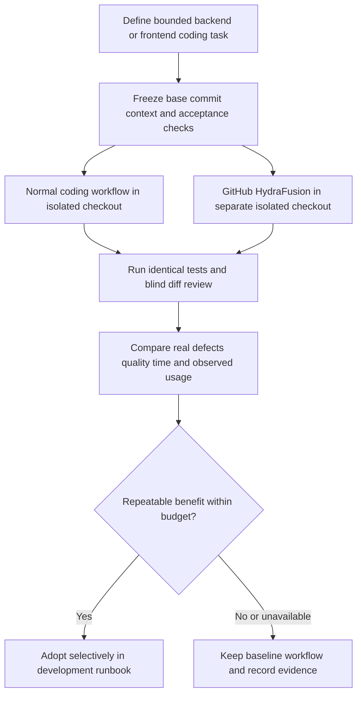
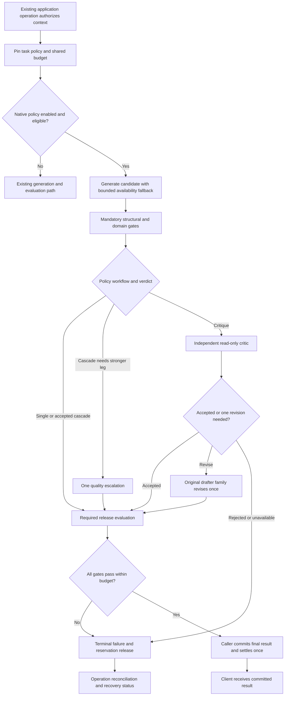

# HydraFusion Adoption & Adaptive AI Orchestration Roadmap

> **Status:** Proposed
> **Date:** 2026-10-05
> **Owner:** Twistloom Engineering, AI Platform, Web, Mobile, and QA teams (proposed; assign named owners before execution)

This roadmap develops the ideas in `TODO-character-interacive-hydrafusion-chatgpt.md:348` into two separate tracks: **GitHub HydraFusion for development** and **Twistloom-native adaptive orchestration for application AI**. The TODO is advisory source material, not a command to install software, change settings, launch agents, or spend provider credits. Native orchestration below is a proposed design inspired by selective workflows; it is not an implementation of GitHub's internal system or a claimed public HydraFusion API.

Code and official GitHub announcements were inspected on 2026-10-05. No Copilot session, provider experiment, application change, or deployment was run for this roadmap. Backend `src/` paths are relative to Twistloom-backend; `Twistloom-web/` and `Twistloom-flutter/` paths are relative to the workspace root. **NEW** denotes proposed files; line numbers are discovery anchors.

Companion product plan: [Interactive Character Guide & Talk to Character](INTERACTIVE_CHARACTER_CONVERSATION_ROADMAP.md). Safe Character Guide and text chat can ship using current provider infrastructure. Adaptive character validation must use that roadmap's knowledge boundaries and committed-answer delivery, not introduce full-canon prompts or stream unvalidated drafts.

---

## 1. Summary Table

| # | Item | Priority | Status |
|---|------|----------|--------|
| 1 | Confirm GitHub availability and freeze two-track scope | `P0` | ⬜ Planned |
| 2 | Define backend/frontend development task packets and pilot controls | `P0` | ⬜ Planned |
| 3 | Benchmark Copilot HydraFusion against the normal coding workflow | `P0` | ⬜ Planned |
| 4 | Inventory native call graphs and establish quality/cost baselines | `P0` | ⬜ Planned |
| 5 | Specify versioned native policies, hard gates, and shared budgets | `P0` | ⬜ Planned |
| 6 | Add bounded executor and reusable single/evaluation adapters | `P0` | ⬜ Planned |
| 7 | Implement quality cascade and calibrated evaluator escalation | `P1` | ⬜ Planned |
| 8 | Implement independent critique and one revision | `P1` | ⬜ Planned |
| 9 | Run offline and capped shadow experiments with evidence gates | `P0` | ⬜ Planned |
| 10 | Integrate one native backend task behind policy flags | `P1` | ⬜ Planned |
| 11 | Add truthful web/mobile progress and stable recovery handling | `P1` | ⬜ Planned |
| 12 | Validate failures, concurrency, contracts, and performance | `P0` | ⬜ Planned |
| 13 | Roll out, monitor, rollback, and decide expansion | `P0` | ⬜ Planned |

**Dependency rule:** Track A is Steps 1–3 and its operational decision in Step 13. Track B is Steps 4–13, with Steps 7/8 optional per approved policy. Steps 4–5 establish baseline evidence and the design; Steps 6–9 implement and measure a capped experiment after its entry review. Production integration/activation in Steps 10–13 requires the Step 9 go decision. Verification runs throughout and must pass before activation. There is no dependency requiring Copilot adoption to enable native orchestration, or native orchestration to build character chat.

---

## 2. Implementation Recommendation (Advisory Assessment)

> **Status:** Advisory — recorded 2026-10-05 when this proposal was reviewed. This section is decision *input*, not an owner decision: the binding adoption gates remain Step 3 (development workflow) and Step 9 (native go/no-go), and no row in §1 or §10 changes until a named owner records that decision.

**Recommended scope: approximately 35% of this roadmap, front-loaded, with a hard re-decision point after Step 4.**

| Track / Steps | Recommended share | Recommendation | Rationale |
|---|---|---|---|
| Track A — Steps 1–3, trimmed | ~65% of Track A | Do Step 1 in full, Step 2 trimmed (a couple of informal paired tasks + short runbook); **skip Step 3 as written** | Cheap, reversible, documentation-only. The formal blinded benchmark (6+ frozen packets, randomized order, JSON results) is disproportionate effort for a preview IDE feature whose account eligibility and usage terms are still unverified (§4.1). Adopt HydraFusion ad hoc per task; a controlled study is not a prerequisite for using a coding tool |
| Track B — Steps 4–5 | Adopt now | Step 4 (call-graph inventory + quality/cost baseline) in full; Step 5 limited to types/policy/gates **specification only**, no executor | Pure measurement and design with zero production risk. The baseline corpus and harness also feed [LLM optimization](LLM_OPTIMIZATION_ROADMAP.md), [multi-turn generation](MULTI_TURN_PAGE_GENERATION_ROADMAP.md), and [candidate robustness](CANDIDATE_GENERATION_ROBUSTNESS_ROADMAP.md) regardless of whether orchestration ships |
| Track B — Steps 6–13 | ~25% of Track B | **Defer** pending Step 4 baseline evidence and the Step 9 decision | Roughly 50–70 engineer-days of new executor/budget/cascade/critique infrastructure for an outcome this document itself admits is unproven: "There is no evidence yet that a generic router improves Twistloom prose, character grounding, or total engineering cost" (§3 Pain Points) |

### Why not more, sooner

1. **Cost asymmetry on the hottest path.** Multi-leg workflows multiply token spend, latency, quotas, and failure surface on *every* generation call. At the 10M-concurrent-user design target (AGENTS.md §1), a modest cost/latency regression on story generation outweighs a speculative quality gain far more than it would at small scale.
2. **An expensive legitimate no-go.** Steps 6–9 alone can consume 40+ engineer-days before Step 9 returns the document's own valid outcome — "keep the baseline, record why." Deferring those steps keeps that spend conditional on Step 4 revealing a real gap.
3. **Alternative A captures most of the near-term value.** Baseline instrumentation (§4.2 Alternative A) is a prerequisite for *any* later calibration — escalation thresholds, cascade decisions, critique value cannot be chosen without it. The baseline may also show the existing `runEvaluationPass` + canon-validation pipeline (§9, Codebase Findings 2–3) is already sufficient, collapsing Track B to a no-go at near-zero cost.
4. **Priority conflict with user-facing work.** The companion [interactive character roadmap](INTERACTIVE_CHARACTER_CONVERSATION_ROADMAP.md) explicitly must not depend on native orchestration (§7 Step 10). Shipping the character MVP — revenue-facing work — outranks internal speculative orchestration that shares its AI-platform prerequisites.

### Recommended execution order

1. **Now:** Step 1 (full) + trimmed Step 2 → informal Track A adoption, runbook only; Step 4 (full) + Step 5 (spec-only).
2. **Decision point after Step 4:** revisit Steps 6–9 *only* if the baseline reveals a measurable quality or cost gap that the existing evaluation + canon pipeline cannot close. Otherwise record a Track B no-go and stop.
3. **Deferred by default:** Steps 3 and 6–13 should move from ⬜ Planned to ⏩ Deferred until that decision; this is consistent with the document's own gating (§1 Dependency rule, §7 Step 9).
4. Character conversation work proceeds independently and may later supply a curated benchmark task family — it is never blocked on this roadmap.

---

## 3. Problem Statement

### Current State

- Twistloom has layered engineering instructions (`AGENTS.md:1`, `.github/copilot-instructions.md:1`, `.github/instructions/`) and specialist/skill configuration. [GitHub Agents configuration roadmap](GITHUB_AGENTS_CONFIGURATION_ROADMAP.md) is related work; its historical planned/completed statements must be checked against current files, not copied as a fresh absence report.
- GitHub's HydraFusion preview selects a model workflow. Its Single, Cascade, and Critique descriptions are verified in the [GitHub research announcement](https://github.blog/ai-and-ml/github-copilot/project-hydrafusion-frontier-quality-via-multi-model-orchestration/). Its September 30 [VS Code/app announcement](https://github.blog/changelog/2026-09-30-hydrafusion-in-vs-code-and-the-github-copilot-app/) describes current entry points and eligibility. These sources do not establish availability in the owner's account or expose a callable production story-generation API.
- Native application AI already has task-specific pools (`src/config/ai-clients.ts:565`, `:749`, `:917`, `:1013`), provider/model retry (`src/config/ai-chat.ts:70`), parsing/repair (`src/utils/ai-parser.ts:123`), and transport variants (`src/utils/ai-chat.ts:1539`, `src/utils/ai-chat-stream.ts:1`). Count or name of configured providers is not a durable implementation goal.
- `aiPrompt` can call `runEvaluationPass` when an evaluator prompt is supplied (`src/utils/ai-chat.ts:1742`, `:1823`). The evaluator scores/corrects output; this differs from an independent read-only critic followed by revision by the drafter. Its failure path can fall back to parsing the original draft. A strict new policy must explicitly decide whether unevaluated output is admissible.
- Story page generation builds an evaluator (`src/utils/prompt.ts:5344`) and multi-turn generation evaluates after merging (`src/utils/prompt.ts:1804`). `USE_MULTI_TURN_GENERATION` is currently false (`src/config/ai-chat.ts:17`). These paths and canon validation (`src/services/canon-validation.ts:501`) must be inventoried so a wrapper does not evaluate the same artifact twice.
- Credit reservation/settlement and expiry recovery exist (`src/services/credits.ts:663`, `:741`, `src/services/credit-reservations.ts:62`). Page generation checkpoints also exist (`src/services/page-generation-checkpoints.ts:1`). These are the lifecycle owners to reuse.
- Web has generation step/progress surfaces and SSE utilities (`Twistloom-web/src/components/dashboard/GenerationStepIndicator.tsx:1`, `Twistloom-web/src/lib/utils/sse-reader.ts:1`). Flutter owns reader transport through its repository and Companion service. Neither needs a model-brand picker or provider selection UI to support server-chosen workflows.

### Pain Points

1. Backend changes can violate branch, transaction, auth, cache, or provider invariants; frontend changes can violate auth readiness, query ownership, navigation, localization, and stream isolation. A locally plausible diff or model self-review is not sufficient evidence.
2. Failure fallback and quality escalation are different. Existing provider waterfalls recover availability; they do not prove whether a successful but weak answer needs a stronger model or independent critique.
3. Additional workflow stages multiply token cost, latency, quotas, and failure opportunities. Nested retries/evaluation can silently exceed operation deadlines or bill the reader repeatedly if ownership is unclear.
4. Model confidence is uncalibrated. The TODO's `0.85` example cannot safely become a production threshold without labeled data and task/language-specific calibration.
5. Existing evaluation's best-effort behavior may be reasonable for current callers but is not an acceptable universal policy for strict knowledge authorization or safety boundaries.
6. There is no evidence yet that a generic router improves Twistloom prose, character grounding, or total engineering cost. Coding benchmark results are not product-generation results.

### Goal

Adopt GitHub HydraFusion selectively when it improves verified engineering outcomes, and introduce only those bounded native workflows that demonstrate better quality/cost tradeoffs while preserving application contracts, knowledge boundaries, credits, and release safety.

---

## 4. Intended Design & Rationale

### 4.1 Track A: GitHub HydraFusion for development

As verified on 2026-10-05, the current VS Code entry point is version 1.140+ or Insiders, using the Copilot Chat model picker; if absent, the documented setting is `chat.copilot.hydraFusion.enabled`. The September 30 announcement lists Pro, Pro+, Business, and Enterprise; organization/enterprise access may require preview permission. The launch announcement also documents the CLI `/experimental` entry point. Recheck the current client and account before use, because preview availability and controls can change. [GitHub setup announcement](https://github.blog/changelog/2026-09-30-hydrafusion-in-vs-code-and-the-github-copilot-app/), [CLI research announcement](https://github.blog/ai-and-ml/github-copilot/project-hydrafusion-frontier-quality-via-multi-model-orchestration/).

This is developer tooling adoption: no new backend provider type, frontend dependency, `npm install hydrafusion`, or Copilot subscription token in production. Copilot chooses its workflow; describing a task as review-sensitive does not guarantee it will use Critique. Record the actual strategy if the client exposes it; otherwise mark it unknown.

Use short, reviewable task packets with exact repositories/base commits, problem/reproduction, allowed files, invariant constraints, acceptance checks, and expected artifacts. Favor substantial, bounded tasks such as a transaction race with a failing reproduction or cross-client unknown-outcome handling. Fast normal models remain suitable for trivial changes. All diffs still require repository checks and human review. Use isolated worktrees/checkouts at equal base commits for paired experiments; do not run both candidates against one dirty working tree or hand the second workflow the first workflow's solution.

The normal model/workflow is the **baseline**, not a deliberately weak competitor. Hold task context, time/spend budgets, test environment, allowed scope, and human assistance policy constant. Randomize/counterbalance order, retain failures, and adjudicate blind when practical. A critic finding an issue is useful only if the issue is real and the resulting patch passes the reproduction. Tests added and comments emitted are not quality outcomes by themselves.

The final runbook will provide reusable task prompts and measured selection guidance without duplicating architectural instructions or adding provider-brand rules to AGENTS. Owner/client settings are not changed by this documentation task. If preview is unavailable, continue the normal workflow and record the blocked arm; do not simulate unavailable GitHub behavior and label it HydraFusion.

### 4.2 Track B: Native design alternatives

| Alternative | Advantages | Disadvantages |
|-------------|------------|---------------|
| A: Keep current generation/evaluation and improve instrumentation | Lowest risk; preserves behavior; yields meaningful baseline | Does not provide selective workflows yet |
| B: Deterministic, versioned per-task policies over existing AI execution | Explicit ownership, capped stages, testable routing and rollback | Requires adapters, telemetry, calibration, and careful integration |
| C: LLM meta-router plans arbitrary model graphs for every call | Flexible workflow discovery | Router cost, unstable plans, nested retries, harder attribution and deadlines |
| D: Reproduce all of GitHub HydraFusion or invoke Copilot for runtime | Brand similarity | Public product descriptions are insufficient implementation/API contracts; unsuitable production dependency |

**Recommended: A first, then B only after evidence.** C/D are out of scope. Native naming is `adaptive-ai` / “adaptive orchestration”; do not imply a GitHub affiliation or exact internal algorithm. The first production pilot changes a bounded existing evaluation decision, not every story and chat call.

### 4.3 Versioned native policy contract

```ts
// Proposed types; task and family catalogs need explicit owners.
type AdaptiveWorkflow = "single" | "cascade" | "critique";
type EvaluationRequirement = "required" | "optional";

interface AdaptiveTaskPolicy {
  id: string;
  version: number;
  task: AdaptiveTaskKind;
  workflow: AdaptiveWorkflow;
  evaluationRequirement: EvaluationRequirement;
  deadlineMs: number;
  maxProviderRequests: number;
  maxInputTokens: number;
  maxOutputTokens: number;
  maxEstimatedCostMicrounits: number;
  maxEscalations: 0 | 1;
  maxRevisions: 0 | 1;
  draftPool: ModelPoolId;
  judgePool?: ModelPoolId;
  escalationPool?: ModelPoolId;
  criticMustUseDifferentFamily: boolean;
}
```

Route from allowlisted **task metadata and deterministic risk signals**: task kind, schema/parse outcome, scope/version availability, input length, language, canon constraints, candidate count, and a calibrated evaluator verdict. User prose may influence story content but cannot select a cheaper policy or disable gates. Unrecognized task/policy falls back to its known legacy route before starting the adaptive executor. Freeze policy versions in each operation so a rollout cannot change behavior halfway through a request.

Keep **availability fallback** inside the model executor and **quality workflow** in the adaptive service. Every actual provider HTTP attempt, retry, judge, escalation, revision, and repair call consumes a shared operation budget. Local parse repair consumes CPU/deadline even if it consumes no provider request. Introduce an explicit execution-budget object through both JSON and streaming adapters; do not wrap the current unrestricted waterfalls and call their outer invocations “one request.” Step 6 audits current retry accounting and adds the minimum required control hooks.

Existing global pools remain available. An adaptive policy references task-specific pool IDs and filters for capability, context length, output schema support, language suitability, quota availability, and configured credentials. A stronger pool must have demonstrated quality for the task; a larger model name or higher price is not sufficient evidence. Critic independence is by actual model family, including hosted gateway aliases, not provider brand alone. If family metadata is missing, independence is unknown and cannot pass a strict critique policy.

### 4.4 Hard gates and release invariants

Mandatory gates always run: authenticated authorization, branch/checkpoint context, schema/type/completeness, input sanitization, valid entity references, configured safety/disclosure rules, transactional persistence, and canonical state invariants for the task. Style judgments can be optional; authorization and spoiler projections cannot. The term **Single** means one draft leg with the gates/evaluation the task requires, not “skip every judge.” Publish both workflow and evaluation mode in internal telemetry to avoid ambiguous cost comparison.

Validators return typed outcomes with reason codes and authorized source references; no success from an empty repaired object, a missing required evaluator, or a swallowed exception. A schema parse is only structural validity; a stylistic score is not proof of canon/disclosure safety. Reapply gates to every escalated or revised output. Judges see the same task-authorized context, never undisclosed character lore.

Current `runEvaluationPass` can return corrected output and may fail best-effort. Preserve that behavior for existing callers. Adaptive `required` policies reject missing/invalid evaluation; `optional` policies may accept only after mandatory deterministic gates and a recorded fallback reason. Do not silently interpret evaluator outage as high confidence.

### 4.5 The three bounded workflows

| Workflow | Native execution | Bounds and exit policy |
|----------|------------------|------------------------|
| Single | Draft with existing provider executor → mandatory gates → required/optional evaluation → result | Availability fallback obeys total budget; no adaptive revision/escalation |
| Cascade | Efficient candidate or economical evaluator → gates/verdict → accept, or one approved stronger leg → rerun gates/verdict | At most one quality escalation; transport failure alone stays availability fallback |
| Critique | Draft → structured read-only critic from a different verified family → optional one revision by original drafter family → rerun all release gates | One critique/revision cycle; no critic side effects, no recursive debate, no merge of conflicting drafts |

**Evaluator-first pilot:** keep current draft generation and canon pipeline fixed; compare baseline evaluator with an economical evaluator that escalates on calibrated uncertainty, contradiction, or invalid verdict. Initially run in shadow/offline. Do not skip all model evaluation in the first production experiment. Economical judge output can inspect/correct like the current evaluator; this is distinct from the read-only Critique schema.

For a draft-quality cascade, invalid schema/completeness can trigger one stronger draft if policy allows and budget remains. Revised output must still match the original authorized context and immutable generation request. If mandatory gates fail after the final leg, return typed failure; no rejected draft is saved or displayed. Choose a previously validated baseline candidate only when the policy explicitly permits it and no strict requirement failed.

Critic schema: categorical verdict (`accept`, `revise`, `reject`), bounded issue list with severity, reason code, affected field, and source IDs; no corrected prose, new canon, executable actions, or tools. Validate findings; unsupported “critical” accusations do not automatically become fact. The original drafter revises from accepted findings using the identical context/scope. If that family is unavailable, fail or use an explicitly defined validated baseline path; do not silently label another family as the original reviser. An unavailable independent critic is strict failure for a required Critique policy.

No threshold such as `confidence >= 0.85` is adopted from the TODO. Use calibrated categorical decisions or empirically selected thresholds by task/language. Record false accepts, false escalations, evaluator disagreement, and confidence reliability on held-out labeled cases. Threshold/version changes require new evidence.

### 4.6 Operation, persistence, credit, and cache ownership

One **application operation** owns request identity, policy version, context revision, budget, cancellation, final candidate, and ledger outcome. The adaptive executor returns a validated result and a structured execution receipt; it does not write story pages or debit users. Existing generation/character/Pen services own durable operations/checkpoints and settlement. Reuse their idempotency rather than creating a second generic job framework. New candidate storage is needed only where a concrete worker/recovery contract requires it; otherwise use bounded transient memory.

Reserve credits once before provider work, generate outside transactions, and settle the final output and charge in a short shared `tx`. Strict failure/cancel/timeout releases the reservation through existing helpers; process termination must reconcile via the operation plus reservation sweeper. Zero-cost requests still need operation idempotency and spend quotas. Internal model attempts are platform cost, not additional automatic reader charges. A new reader price or optional enhanced tier requires a separate product decision and server quote revision; current costs remain unchanged during the pilot.

Resume through committed checkpoints. A stage retry reuses its artifact/context/policy revision and remaining budget; it must not repeat paid side effects or reset cost totals. Candidate generation fan-out has a parent budget and bounded concurrency; each candidate cannot independently spend the full parent limit. Cancellation propagates through every leg and abort prevents subsequent fallback.

Cache prompt renders only with the correct page/content/policy/scope revision. Private conversations also require account/session/character/history identity; generic book/page caches are not final-answer caches. Do not treat rejected drafts, partial JSON, critic output, or unvalidated corrections as cacheable public answers. Prompt caching, output caching, and operation replay are separate owners. Public cache rules remain those of the original endpoint.

### 4.7 Unified budgets and cost accounting

Proposed pilot bounds, to freeze after Step 4 measurements:

- Maximum one escalation or one revision, never an unconstrained combination of both. Initial provider request caps: 3 for Single, 5 for Cascade, 6 for Critique, including actual transport retries and fallback. These caps may be too small for some legacy paths; validate and tune rather than apply blindly.
- One wall-clock deadline including context fetch, embeddings, generation, repair, judges, and persistence reserve. Preserve time for settlement/release; do not exhaust the entire runtime window in provider inference. Serverless duration limits are a deployment dependency, not a per-model timeout.
- Token and monetary ceilings include every leg, failed attempt, embeddings, prompt-cache charges, and unknown usage. Track actual usage where available and conservative upper-bound estimates otherwise. Failed requests with unknown provider usage cannot be recorded as zero cost. Use a versioned rate snapshot and distinguish estimated provider cost from billed invoices and reader credits.
- Per-user/task admission, global provider concurrency/rate quotas, and daily spend caps apply before expensive work. Existing rate-limit failure policy stays compatible; durable operation idempotency and local operation budgets do not rely on Redis availability. If a spend ceiling cannot be enforced, disable the adaptive experiment rather than invoke unlimited providers.

Budget pseudocode:

```ts
const budget = createOperationBudget(policy, deadline, signal);
const draft = await executor.draft(input, { budget, evaluation: "external" });
const gated = await validateCandidate(draft, input.scope, budget);
const decision = await decideNextStage(policy, gated, budget);
const candidate = await executeAllowedStage(decision, gated, { budget });
const final = await enforceReleaseGates(candidate, input.scope, budget);
return { result: final, receipt: budget.executionReceipt() };
// Persistence and ledger settlement belong to the caller's short transaction.
```

The `evaluation: "external"` sketch is a proposed adapter boundary, not an existing `aiPrompt` option. It means the new owner performs evaluation exactly once for a selected artifact; current callers retain inline evaluation until migrated behind a policy flag.

### 4.8 Frontend contracts and UX

Production users interact with their story or character, not a model graph. Preserve existing final response fields and wire behavior unless a versioned contract intentionally changes release timing. Expose only meaningful additive progress: generating, checking, improving when another stage actually runs, and saving. Do not show “improving” while doing a cache lookup, provider names, critic findings, confidence scores, chain-of-thought, or failed drafts.

Add optional operation/request ID, progress stage, final revision, and terminal code fields where the endpoint already has a durable owner; update both clients' typed decoders. Unknown progress events are ignored safely. Character chat must follow validated-after-commit prose release in its companion roadmap. An orchestration pilot must not stream a rejected candidate and later overwrite it. Existing story-generation preview behavior requires an explicit delivery decision before enabling adaptive revision; preferably keep candidate prose private until publish/commit for the pilot.

Web follows API service → query/command hook → UI, memoized clients, auth readiness, centralized query keys, scoped abort/epoch guards, and EN/ID translations. Flutter follows repository → Riverpod controller → widget with typed errors, both ARBs, cancellation, foreground handling, and account identity isolation. Client recovery asks the owning operation/status endpoint before retrying any charged request. Fallback and additional model legs never require another purchase prompt or alter the displayed balance optimistically.

### 4.9 Non-Breaking Guarantees

| Change | What it does not change | Why safe |
|--------|------------------------|----------|
| Copilot pilot/runbook | Production API, package graph, user credits, repo architectural constitution | Development workflow only |
| Add native policy/executor | Existing callers' provider ordering and best-effort evaluator behavior | Explicit opt-in wrapper/adapters, legacy default |
| Adaptive evaluation | Required canon, schema, access, spoiler, and transaction gates | These remain mandatory independent of workflow |
| Multi-model stages | Number of reader charges or story commits | One caller-owned operation/reservation/settlement |
| Add progress metadata | Existing final result meaning | Additive decoding and old-client tests |
| Shadow runs | Reader-visible answer and published canon | No persistence/ledger side effects; shadow budget separately enforced |
| Server policy flags | User control of secrets or choice of internal models | Server-only decision with safe client fallback |

---

## 5. Feasibility Analysis

| Dimension | Assessment |
|-----------|------------|
| **Effort** | Track A: 3–5 engineer-days setup plus 5–10 pilot/review days. Track B: 8–12 baseline/design days; 25–40 backend, 5–10 web, 4–8 mobile, and 10–15 QA/benchmark days if entry gates pass. Estimates depend on sample size and existing test coverage |
| **Risk** | Medium for development adoption; high for native cost/quality regressions, timeout amplification, and release of invalid drafts |
| **Backend changes** | None for Track A; significant policy/executor/instrumentation, bounded fallback, and one caller integration for Track B |
| **Frontend changes** | Development task packets for both repositories; additive typed progress/recovery/UI for native pilot only |
| **Dependencies** | Actual Copilot entitlement for A; labeled native corpus, accurate usage/rates, model-family metadata, existing lifecycle owners, deployment budgets for B |
| **Reversibility** | Copilot selection reversible. Native server flags return to legacy before new operations; in-flight operations retain pinned policy or cancel/release; ledger/history remain intact |
| **Scale** | Additional calls increase provider load; no free-tier/capacity assumption. Budget/admission controls and representative concurrency evidence required |

Native effort is justified only by measured improvement. Do not schedule a promised production date before the Step 9 gate. Character chat can proceed independently and supply a future curated benchmark task once its knowledge authorization exists.

---

## 6. Flow Diagram (Mermaid)





---

## 7. Implementation Plan

### Step 1: Confirm availability and freeze two-track scope — ⬜ Planned

**Files:** `TODO-character-interacive-hydrafusion-chatgpt.md:677`, `AGENTS.md:1`, `.github/copilot-instructions.md:1`; **NEW** `docs/runbooks/hydrafusion-development.md`.
**Effort:** Low–Medium. **Owner:** Engineering lead. **Depends on:** None.

Record Copilot client/version, account eligibility, organization preview policy, model-picker availability, actual usage visibility, and dated official sources. Document current VS Code/CLI entry points from §4.1, but let the owner control installation/subscription/settings changes. No global preview enablement is assumed. If unavailable, record a blocked experimental arm with a usable normal-model fallback.

Declare Track A and Track B independent, freeze initial bounded engineering tasks, and forbid treating an IDE feature as a production provider/API. Choose named owners, allowable experiment spend, and evidence retention. Native design review is not authorization to run paid benchmarks or deploy.

**Acceptance:** Reproducible current availability notes; two-track boundary understood by all owners; no invented package/API or unverified account entitlement.
**Non-breaking:** Documentation-only setup; production code and repo instructions stay compatible.

---

### Step 2: Define development task packets and pilot controls — ⬜ Planned

**Files:** `.github/instructions/payments.instructions.md:1`, `.github/instructions/ai.instructions.md:1`, `.github/instructions/story-engine.instructions.md:1`, `Twistloom-web/AGENTS.md:1`, `Twistloom-flutter/AGENTS.md:1`; **NEW** `docs/benchmarks/hydrafusion/development-task-packets.md`.
**Effort:** Medium. **Owner:** Backend/web/mobile leads + reviewer. **Depends on:** Step 1.

Select at least six distinct bounded tasks initially, with backend and frontend represented: credit-operation race, branch-memory isolation, provider abort/budget defect, web stream supersession or unknown-outcome recovery, auth-ready query/typed service integration, and mobile disposal/account switch. Avoid live purchase calls or deployment in pilot tasks. Include known-good tasks with no planted bug to measure false positives and unnecessary edits.

Each packet includes base commit per repo, scope, reproducible failing test or behavior, exact invariants, required commands, dependency constraints, definition of done, stop conditions, and reviewer rubric. Cross-repo tasks freeze both commits and contract fixtures. Agent-specific instructions remain in existing owners; packets point to them rather than copying contradictory rules.

Provide a reusable prompt with concrete task parameters: read applicable guidance, reproduce, fix within allowed files, preserve API/ledger/branch invariants, run named checks, and return a diff plus evidence. Workflow choice is GitHub's; record what is visible without asserting that “payments always uses Critique.”

**Acceptance:** Comparable isolated task inputs and predefined scoring; success criteria cannot be satisfied by writing a confident explanation without a working patch.
**Non-breaking:** No production changes or edits to unrelated user work; pilots use isolated checkouts.

---

### Step 3: Benchmark Copilot HydraFusion against normal coding workflow — ⬜ Planned

**Files:** `package.json:1`, `Twistloom-web/package.json:1`, `Twistloom-flutter/tool/flutter.ps1:1`; **NEW** `docs/benchmarks/hydrafusion/development-results.md`, `docs/benchmarks/hydrafusion/development-results.json`.
**Effort:** Medium–High. **Owner:** Engineering QA + blinded reviewer. **Depends on:** Step 2.

Run paired candidate workflows at equal base commits with fresh sessions, randomized order, and identical time/assistance budgets. Measure correct first attempt, reproduction fixed, hidden regression pass, real defects found, introduced defects, unnecessary edits, reviewer corrections, wall time, human review time, and visible usage/cost. Mark unknown cost/workflow as unknown; do not infer token spend from “number of models” or promise vendor benchmark savings.

Use backend targeted tests and `bun check`; web `pnpm typecheck`, scoped ESLint, targeted Vitest/Playwright and relevant contract checks; mobile the project wrapper's analyze/tests following current guidance. Do not mechanically run web builds or native signed builds for every task. Retain failures and raw command summaries without secrets.

Proposed adoption gate: no unresolved critical introduced defect, no reduction in paired task correctness, and either at least 20% less combined implementation/review time or at least 15% lower measured usage at comparable quality. These thresholds are pilot hypotheses; six tasks provide a feasibility signal, not statistical proof. Repeat across additional task types and trials before broad default adoption.

**Acceptance:** Dated paired results and review evidence; owner chooses selective adoption, another pilot, or no-go; no “HydraFusion is better” claim from one successful task.
**Non-breaking:** A winning patch is still independently reviewed before normal merge/deploy; benchmarking does not authorize either action.

---

### Step 4: Inventory native call graphs and establish baselines — ⬜ Planned

**Files:** `src/utils/ai-chat.ts:1539`, `src/utils/ai-chat.ts:1823`, `src/utils/ai-chat-stream.ts:1`, `src/utils/prompt.ts:1804`, `src/utils/prompt.ts:5678`, `src/services/canon-validation.ts:501`, `src/utils/candidate-generation.ts:1`, `src/services/pen.ts:1`, `src/utils/ai-cost.ts:1`, `src/utils/ai-logger.ts:1`; **NEW** `docs/benchmarks/hydrafusion/native-baseline.md`, `scripts/benchmark-adaptive-ai.ts`, `tests/fixtures/adaptive-ai/cases.json`.
**Effort:** High. **Owner:** AI platform + narrative QA. **Depends on:** None; independent of Track A.

Map each task's generation, evaluator, parser repair, canon validation/rewrite, vector retrieval, provider retries, stream timing, persistence, and billing owner. Include disabled multi-turn mode as a compatibility path, not a claimed active production path. Inventory inline and post-merge evaluation so each artifact has one explicit owner. Record actual attempt counts rather than top-level helper calls.

Create a frozen corpus with English/Indonesian, varied genre/length, long context, branching, schema failures, contradiction, multilingual persona, missing providers, and clean cases. Keep author-private/reader-private data out of fixtures or secure approved access. Recommended starting floor: 100 distinct native cases split into task/language strata with multiple repeated runs, a separate calibration set, and held-out release set; larger safety claims require more than this floor.

Measure valid-result rate, canon/disclosure failures, blind narrative ratings, correction rate, total tokens/estimated cost including unsuccessful legs, p50/p95/p99, provider requests, abort responsiveness, persistence and refund outcomes. Benchmark the actual current pipeline, including its evaluation/canon stages, not an artificially cheap raw draft baseline. Baseline comparable tasks and policy versions must be pinned.

**Acceptance:** Reproducible harness with mocked deterministic tests and separately labeled real-provider runs; gaps in rates/usage and live production measurements recorded; one candidate task chosen from measured evidence.
**Non-breaking:** No new runtime policy yet; harness does not save generated pages or charge reader accounts.

---

### Step 5: Specify policies, hard gates, and shared budgets — ⬜ Planned

**Files:** `src/types/ai-chat.ts:99`, `src/config/ai-chat.ts:70`, `src/config/ai-clients.ts:565`, `src/config/ai-clients.ts:1013`, `src/config/canon-validation.ts:1`; **NEW** `src/types/adaptive-ai.ts`, `src/config/adaptive-ai.ts`, `docs/contracts/adaptive-ai-v1.md`, `tests/adaptive-ai-policy.test.ts`.
**Effort:** High. **Owner:** AI platform + backend architecture reviewer. **Depends on:** Step 4.

Define task vocabulary, model pool/family metadata, static policy versions, required versus optional evaluation, retry/deadline/cost/token limits, stage failure decisions, and final receipt shape. Validate policy configurations at startup or selection; missing/contradictory pools cannot silently disable gates. Record deterministic routing reasons without storing prompt bodies.

Specify how budget survives provider retries, candidate fan-out, stage resume, and model rate changes. Define unavailable-family behavior, unknown-usage conservative accounting, unknown-policy legacy fallback, and revision ownership. Select thresholds from calibration evidence, not confidence prose. Preserve all canon/disclosure invariants and decide which gates can be locally deterministic versus require a model.

**Acceptance:** Versioned policy truth table for every failure/budget state; no path bypasses hard gates; planned frontend extensions are additive; reviewer approves the first experiment and explicit spend cap before provider execution.
**Non-breaking:** Default mode remains legacy; existing public API and prices unchanged.

---

### Step 6: Add bounded executor and single/evaluation adapters — ⬜ Planned

**Files:** `src/utils/ai-chat.ts:1539`, `src/utils/ai-chat.ts:1823`, `src/utils/ai-chat-stream.ts:1`, `src/utils/ai-parser.ts:123`, `src/utils/ai-limiters.ts:1`, `src/utils/ai-cost.ts:1`, `src/utils/ai-logger.ts:1`; **NEW** `src/services/adaptive-ai.ts`, `src/services/adaptive-ai-executor.ts`, `src/utils/ai-operation-budget.ts`, `tests/adaptive-ai-executor.test.ts`.
**Effort:** High. **Owner:** AI platform. **Depends on:** Step 5 and experiment entry approval.

Implement the shared budget/receipt and thin adapters over existing execution/parse/provider factories. Add per-HTTP-attempt budget hooks and deadline/cancellation propagation where required; do not duplicate all provider adapters. Expose generation-only and explicit evaluation invocation to the adaptive owner, without suppressing evaluation for legacy callers. Check structured and string evaluator modes and post-merge evaluation compatibility.

Budget enforcement must happen before each stage/attempt and reserve time for cleanup. Record model family, stage, usage, error classification, parse/gate outcomes, and remaining budget. Keep receipts internal unless a safe public field has been separately reviewed. No process-local metric alone should be described as fleet-wide cost control; aggregate via the existing deployment-appropriate telemetry owner.

**Acceptance:** With policy disabled, fixtures match old contract behavior; enabled Single has predictable required evaluation and exact bounded attempt accounting; abort prevents next provider leg; no second evaluator fires accidentally.
**Non-breaking:** Existing default pools and callers are retained; necessary adapter changes receive focused regression tests rather than global orchestration rewrites.

---

### Step 7: Implement quality cascade and evaluator escalation — ⬜ Planned

**Files:** `src/services/adaptive-ai.ts` (**NEW**, Step 6), `src/config/adaptive-ai.ts` (**NEW**, Step 5), `src/utils/ai-chat.ts:1823`; **NEW** `src/services/adaptive-ai-quality-gate.ts`, `tests/adaptive-ai-cascade.test.ts`.
**Effort:** High. **Owner:** AI platform + narrative QA. **Depends on:** Step 6 and calibrated candidate policy.

Add one economical evaluator → stronger evaluator escalation path while keeping generation/canon unchanged in the first experiment. Define uncertainty/invalid verdict/contradiction signals and map them to explicit accept/escalate/reject outcomes. Maintain budget and immutable context across stages. A transport error consumes an availability retry; it is not evidence that the draft failed quality.

Keep optional draft-quality cascade separate from evaluator escalation. Enable only the path selected by policy, with one quality escalation and mandatory revalidation after any corrected/stronger output. Reject when the final required evaluation is unavailable or budget cannot safely finish; do not silently downgrade strict policies.

**Acceptance:** Deterministic fixtures cover cheap pass, false accept, low confidence, invalid judge, stronger failure, depleted budget, and abort; calibration report quantifies escalation and false-accept rates by task/language.
**Non-breaking:** No unconditional evaluation skipping or global provider reordering; existing legacy task remains selectable.

---

### Step 8: Implement independent critique and one revision — ⬜ Planned

**Files:** `src/services/adaptive-ai.ts` (**NEW**, Step 6), `src/types/adaptive-ai.ts` (**NEW**, Step 5), `src/config/ai-clients.ts:1013`; **NEW** `src/utils/adaptive-ai-critique-prompt.ts`, `src/services/adaptive-ai-critique.ts`, `tests/adaptive-ai-critique.test.ts`.
**Effort:** High. **Owner:** AI platform + narrative reviewer. **Depends on:** Step 6; enabled only for an evidence-backed task.

Implement a structured read-only critic with no persistence/credit/tool authority. Resolve model-family independence across direct and gateway aliases. Validate issue references against authorized context; original drafter family revises at most once. Re-run all structural/domain/release gates after revision and measure whether accepted criticism improves the result or introduces regressions.

Test critic accepting, rejecting, finding a real violation, hallucinating a violation, changing private knowledge scope, unavailable independent family, exhausted budget, and unavailable original drafter. No ensemble voting, majority merge, or recursive revision chain in this roadmap.

**Acceptance:** At most one critique/revision cycle, verified family separation when required, unchanged context authority, and safe final failure when the strict workflow cannot complete.
**Non-breaking:** Existing score/correct evaluator is not renamed Critique; the new workflow is isolated and optional.

---

### Step 9: Run offline and capped shadow experiments with evidence gates — ⬜ Planned

**Files:** `scripts/benchmark-adaptive-ai.ts` (**NEW**, Step 4), `src/config/adaptive-ai.ts` (**NEW**, Step 5); **NEW** `docs/benchmarks/hydrafusion/native-results.md`, `docs/benchmarks/hydrafusion/native-results.json`.
**Effort:** High. **Owner:** QA/statistical reviewer + AI platform. **Depends on:** Relevant Steps 6–8.

Compare legacy, bounded Single, evaluator Cascade, and eligible Critique on identical held-out contexts. Use blind author ratings and explicit factual/disclosure checks, repeated seeds/runs where supported, equal sampling settings, and versioned pricing snapshots. Keep the corpus used for threshold tuning separate from acceptance cases. Report sample counts, uncertainty, disagreements, failure distribution, and per-language/task results; do not hide one subgroup behind an overall average.

Shadow only sampled approved operations under a separate provider spend cap. Shadow executes no story/credit/cache side effects and never feeds the live answer. If the hosting runtime cannot guarantee bounded durable execution, use an approved queue/worker path or offline-only tests; do not run unawaited background promises after serverless response. Author/reader content use must follow agreed access/retention controls.

Proposed go/no-go criteria:

| Metric | Candidate promotion requirement |
|--------|---------------------------------|
| Authorization, disclosure, financial/state corruption | Zero critical regression in curated adversarial and concurrency suites; finite samples do not prove universal safety |
| Canon/structured validity | No observed regression against current pipeline; compare failure-rate uncertainty by task/language |
| Blind narrative quality | Within an agreed non-inferiority margin, proposed 0.2 on a 5-point rubric, with no material subgroup regression |
| Economics or quality benefit | At least 20% lower estimated provider cost per accepted result at comparable quality, or a defined quality gain worth documented extra cost |
| Latency | Within the product's frozen SLO and operation runtime budget; proposed p95 increase at most 20% for the pilot |
| Reliability | Required evaluator outage and unknown usage remain safe; retry/cancel/reconciliation checks pass |

Predeclare thresholds and adjudication before trials. A no-go is a successful experiment outcome: keep the baseline, record why, and do not proceed to enabled Steps 10/11. If evidence is inconclusive, collect more cases within approved spend instead of claiming success.

**Acceptance:** Named owner records promote/iterate/no-go with links to reproducible results; only approved task/policy/language cohorts proceed.
**Non-breaking:** Shadow cannot change user output, published canon, charge count, or shared final-answer caches.

---

### Step 10: Integrate one native backend task behind flags — ⬜ Planned

**Files:** `src/utils/prompt.ts:1804`, `src/utils/prompt.ts:5678`, `src/utils/prompt.ts:6124`, `src/services/canon-validation.ts:501`, `src/services/page-generation-checkpoints.ts:1`, `src/services/credits.ts:741`, `src/services/credit-reservations.ts:62`; **NEW** `tests/adaptive-ai-task-integration.test.ts`.
**Effort:** High. **Owner:** Owning story/Pen service + AI platform. **Depends on:** Step 9 go decision.

Prefer evaluator escalation for one bounded story-page task when Step 9 supports it. Freeze task's evaluation/canon owner and remove its duplicate evaluation only within the flag-selected path. Keep Pen finalize, multi-turn, candidate fan-out, translation, and generic Companion on their existing paths until separately benchmarked. If a safer task wins the benchmark, update this roadmap's pilot scope and file list before integration.

Use existing durable generation operation/checkpoint and reservation owners. Persist only the final validated artifact, annotate internal audit with policy version and receipt, and settle once. Every branch/candidate/state update uses caller-propagated `tx`. Reconciliation reuses the stored request/policy/context/cost snapshot and honors cancellation/expiry. Explicitly validate free/demo operations and late workers.

Integrating future character conversations requires their knowledge authorization and durable operation steps first. A global story judge with full canon must never be reused as a character disclosure judge. Do not make adaptive orchestration a prerequisite for the character MVP.

**Acceptance:** Legacy and adaptive runs produce the same public contract and one publish/ledger outcome; no draft release before the pilot's final gate; strict failures release and reconcile correctly; server flag disables new adaptive operations.
**Non-breaking:** Current public task semantics, costs, and unselected pipelines remain intact.

---

### Step 11: Add truthful web/mobile progress and recovery handling — ⬜ Planned

**Files:** `Twistloom-web/src/components/dashboard/GenerationStepIndicator.tsx:1`, `Twistloom-web/src/components/ui/GenerationProgressList.tsx:1`, `Twistloom-web/src/lib/services/books-api.ts:410`, `Twistloom-web/src/lib/utils/sse-reader.ts:1`, `Twistloom-web/src/lib/types/sse.ts:1`, `Twistloom-web/messages/en.json:1`, `Twistloom-web/messages/id.json:1`, `Twistloom-flutter/lib/features/reader/reader_repository.dart:1`, `Twistloom-flutter/lib/core/l10n/app_en.arb:1`, `Twistloom-flutter/lib/core/l10n/app_id.arb:1`; **NEW** `Twistloom-web/tests/unit/adaptive-ai-progress.test.tsx`, `Twistloom-flutter/test/features/reader/adaptive_ai_progress_test.dart`.
**Effort:** Medium. **Owner:** Web/mobile generation surface owners. **Depends on:** Contract Step 5 and pilot Step 10.

Map actual stages to localized generating/checking/improving/saving messages with stable operation identity. Ignore unknown additive events and accept legacy events. Preserve abort/epoch guards, reader scroll, auth readiness, existing API service/repository ownership, and account isolation. Update endpoint-specific status decoding rather than expose a new generic public orchestration API.

Show uncertainty after dropped transport and reconcile through the owning generation status endpoint. Never automatically resend a charged mutation with a new ID, or present extra stages as a second charge. Final content/balance comes from committed server state. Native background/resume and web unmount/supersession must terminate owned requests without publishing stale output. No provider/model/workflow brand selector is added to normal reader flows.

**Acceptance:** Older clients receive a valid final response; both locales have progress/error parity; interrupted stream and resumed status agree; no rejected/revised-away draft shown; controls remain accessible and usable on slow networks.
**Non-breaking:** UI works with policy disabled; extra stages do not invalidate unrelated reader queries or change existing story prices.

---

### Step 12: Validate failure boundaries, concurrency, contracts, and performance — ⬜ Planned

**Files:** `tests/test-companion-config-parity.test.ts:1`, `src/services/credit-reservations.ts:62`; **NEW** `tests/adaptive-ai-budget.test.ts`, `tests/adaptive-ai-failure-matrix.test.ts`, `tests/adaptive-ai-contract.test.ts`, `docs/checkpoints/adaptive-ai-validation.md`.
**Effort:** High. **Owner:** QA/security/platform + client owners. **Depends on:** Each changed step; final gate after Steps 10–11.

| Boundary | Required tests/evidence |
|----------|-------------------------|
| Policy selection | Unknown task/version, ineligible language/family/schema, rollout changes mid-operation, disabled flag |
| Availability vs quality | Draft transport failure, quality rejection, invalid evaluator, required evaluation unavailable, independent-family outage |
| Output release | Empty/truncated/repaired JSON, invalid sources, semantic canon error, revision introduces new violation, no provisional leakage |
| Budgets | Retry/fallback counted per HTTP request, tokens/cost unknown, deadline during judge, parent candidate fan-out, settlement reserve, global quota outage |
| Cancellation/lifecycle | Abort in each leg, no later fallback, late worker after expiry, duplicate request, process death before/after checkpoint/settlement |
| Ledger/state | Real-database duplicate/concurrent requests, free-demo, settle/refund/sweep race, exact one final page/turn and charge outcome |
| Client contract | Old/new decoders, fragmented SSE, unknown progress, scope/account switch, dropped final event, authoritative balance preservation |
| Quality/capacity | Held-out task/language regressions, long context/journeys, concurrent load, provider outage, measured p95/p99 and total cost |

Run backend focused Bun suites and `bun check`; web targeted Vitest/Playwright, `pnpm typecheck`, scoped ESLint, relevant contract checks and `pnpm doc:drift`; mobile wrapper analyze/tests plus affected runtime/device checks. Adapters changing serverless runtime behavior need deployment-equivalent validation. Do not run database migrations automatically or claim signed/native/cloud validation from local mocks.

**Acceptance:** All mandatory gates pass, no critical financial/access/knowledge regressions, rollback and reconciliation drills complete, budgets reflect real attempt graphs, limitations documented in dated evidence.
**Non-breaking:** Regression suite explicitly covers legacy generation/evaluation, disabled multi-turn compatibility, Pen, generic Companion, and old frontend responses relevant to the change.

---

### Step 13: Roll out, monitor, rollback, and decide expansion — ⬜ Planned

**Files:** `src/config/adaptive-ai.ts` (**NEW**, Step 5), `src/utils/ai-logger.ts:1`, `src/services/page-generation-checkpoints.ts:1`; **NEW** `docs/runbooks/adaptive-ai.md`; update `docs/runbooks/hydrafusion-development.md` (**NEW**, Step 1) with measured Track A conclusions.
**Effort:** Medium–High. **Owner:** Platform + engineering/product. **Depends on:** Step 3 for development adoption; Steps 9–12 for native release.

Track A: publish recommended task types and actual paired outcomes, keep a normal-model fallback, and recheck preview availability/usage terms when client/account changes. Avoid turning all trivial edits into compound coding runs. Periodically reassess only when material tool/model/task changes justify it.

Track B: disabled → offline → capped shadow → internal cohort → proposed 1%/5%/25%/wider cohorts after gates. Assignment is stable by operation/cohort and pinned policy; old operations do not switch midway. Monitor task/language/policy quality, accepted-result cost, stage attempts/escalations, latency, timeout, validation failure, abort lag, duplicate suppression, refund backlog, and admission rejection. Compare a contemporaneous legacy control; release must not erase the baseline needed to detect regressions.

Rollback triggers include any critical disclosure/state/ledger regression, observed SLO breach, budget enforcement failure, or materially worse quality. Stop new adaptive operations via server flags; retain operation status and reservation reconciliation. In-flight operations complete their pinned safe policy within budget or cancel/release; they must not restart legacy with a second debit. Additive columns/receipts remain readable through rollback; no destructive table removal is needed.

Expansion requires task-specific evidence: character conversations after knowledge gates; Pen finalization only with its canon/revision contract; translation with language fidelity rubric; broader story drafts after prose/canon benchmarks. Every new task/model-family/policy-version cohort repeats relevant evaluation. No generic meta-router, unbounded debate, automatic model purchases, or customer-visible “HydraFusion mode” is included.

**Acceptance:** Runbooks, named alert owners, monitored control cohort, successful disable/recovery drill, and explicit adopt/iterate/no-go decisions for both tracks. “No native rollout” remains a valid result if benchmarks do not justify it.
**Non-breaking:** Legacy routes remain available; rollback preserves committed user results and financial audit trails.

---

## 8. Open Questions

### Q1. Which native task should enter production first? — ⬜ Open

- **(A)** Economical evaluator with escalation for a bounded story-page task — retains proven generation shape; measurable evaluation savings.
- **(B)** Full cheap-draft cascade across all story generation — larger potential savings; broader prose/canon and delivery risk.
- **(C)** Character conversation critique after its separate safety foundations — compact output; knowledge authorization still required and not yet implemented.

**Recommendation:** A if Step 9 supports it; otherwise keep the legacy route. C can become a later cohort. Do not preselect B without evidence.

---

### Q2. What counts as enough evidence for escalation thresholds? — ⬜ Open

- **(A)** Task/language labeled calibration plus a held-out corpus and repeated runs — defensible false-accept estimates; more review effort.
- **(B)** Model self-confidence or a global `0.85` cutoff — quick prototype; unreliable calibration and safety claims.

**Recommendation:** A. Use categorical outcomes unless confidence has measured predictive value; explicit uncertainty escalates/rejects within budget.

---

### Q3. How should users pay for extra native workflow legs? — ⬜ Open

- **(A)** Existing per-action price during pilot; provider stage cost absorbed inside platform budget — stable UX; requires hard spend ceilings.
- **(B)** Separate enhanced tier with quoted price and confirmed entitlement — transparent premium path; product, compatibility, and billing work.

**Recommendation:** A for the bounded experiment. B needs a separate owner decision and never arises from an automatic fallback retry.

---

### Q4. What happens when a required evaluator or independent critic is unavailable? — ⬜ Open

- **(A)** Fail/release, or use only a policy-approved previously validated result — protects strict requirements; lower availability.
- **(B)** Silently ship the unevaluated draft — higher availability; violates strict policy intent.

**Recommendation:** A. Optional style evaluation can have an explicit fallback, but mandatory authorization/schema/canon/disclosure gates remain binding.

---

### Q5. How should model-family independence be maintained? — ⬜ Open

- **(A)** Versioned catalog of actual family IDs, gateway aliases, capabilities, and provenance — transparent review; maintenance required.
- **(B)** Treat different provider names as different model families — simple; aliases can resolve to the same underlying model.

**Recommendation:** A. Unknown identity cannot satisfy a strict independence requirement; avoid promising independence from undocumented vendor routing.

---

### Q6. Does runtime execution need another job system? — ⬜ Open

- **(A)** Reuse current durable operations/checkpoints/workers and compatible synchronous budgets — least architectural duplication; must verify owner coverage.
- **(B)** Introduce a generic orchestration job platform — unified interface; major migration/ownership overhead.

**Recommendation:** A. Add only a missing bounded dispatch/recovery seam when a measured runtime constraint requires it; benchmark shadow may remain offline.

---

### Q7. Should both development workflows become mandatory? — ⬜ Open

- **(A)** Selective use for measured high-value task families, normal workflow fallback — adaptable and economical; needs judgment.
- **(B)** HydraFusion for every edit — uniform choice; preview dependency and unnecessary cost/latency.

**Recommendation:** A, based on paired task results and actual account usage rather than vendor benchmark headlines.

---

## 9. References & File Touch List

### Source and official references

- `TODO-character-interacive-hydrafusion-chatgpt.md:348` — workflow concepts; `:616` native caution/benchmark-first; `:677` tooling setup; `:799` paired engineering experiment. Placeholder ChatGPT citations in that file were not treated as source evidence.
- [GitHub HydraFusion research announcement, 2026-09-04](https://github.blog/ai-and-ml/github-copilot/project-hydrafusion-frontier-quality-via-multi-model-orchestration/) — verified 2026-10-05; primary source for workflow descriptions and preview nature. Its coding benchmark results are vendor evaluation, not expected Twistloom prose savings.
- [GitHub VS Code/app availability announcement, 2026-09-30](https://github.blog/changelog/2026-09-30-hydrafusion-in-vs-code-and-the-github-copilot-app/) — verified 2026-10-05; primary source for current setup, eligibility, and preview controls. Account access and billed usage remain unverified.
- [Interactive character roadmap](INTERACTIVE_CHARACTER_CONVERSATION_ROADMAP.md) — knowledge projection, private operation ownership, and validated delivery prerequisites for any conversation cohort.
- [AI LLM architecture](../architecture/AI_LLM_ARCHITECTURE.md), [AI chat streaming architecture](../architecture/AI_CHAT_STREAM_ARCHITECTURE.md), [SSE architecture](../architecture/SERVER_SENT_EVENTS_STREAMING_ARCHITECTURE.md), [Payments architecture](../architecture/PAYMENTS_ARCHITECTURE_BACKEND.md) — existing subsystem owners; reverify at implementation.
- [LLM optimization roadmap](LLM_OPTIMIZATION_ROADMAP.md), [Multi-turn page generation roadmap](MULTI_TURN_PAGE_GENERATION_ROADMAP.md), [Candidate robustness roadmap](CANDIDATE_GENERATION_ROBUSTNESS_ROADMAP.md), [GitHub Agents configuration roadmap](GITHUB_AGENTS_CONFIGURATION_ROADMAP.md) — coordinate overlapping work and distinguish historical claims from current code.

### Track A touch list

| File | Change |
|------|--------|
| `AGENTS.md:1`, `.github/copilot-instructions.md:1`, `.github/instructions/payments.instructions.md:1`, `.github/instructions/ai.instructions.md:1`, `.github/instructions/story-engine.instructions.md:1` | Existing — reference only; do not add HydraFusion-specific architecture rules |
| `Twistloom-web/AGENTS.md:1`, `Twistloom-flutter/AGENTS.md:1`, `package.json:1`, `Twistloom-web/package.json:1`, `Twistloom-flutter/tool/flutter.ps1:1` | Existing — pilot constraints and actual validation commands |
| `docs/runbooks/hydrafusion-development.md` | **NEW** — current setup, task prompts, selective use, results and fallback |
| `docs/benchmarks/hydrafusion/development-task-packets.md` | **NEW** — frozen paired tasks, base commits, acceptance rubric |
| `docs/benchmarks/hydrafusion/development-results.md`, `docs/benchmarks/hydrafusion/development-results.json` | **NEW** — outcomes, commands, known usage and uncertainty |

### Native backend touch list

| File | Change |
|------|--------|
| `src/types/ai-chat.ts:99`, `src/config/ai-chat.ts:70`, `src/config/ai-clients.ts:565`, `src/config/ai-clients.ts:1013` | Bounded execution hooks and explicit pool/family metadata; preserve legacy defaults |
| `src/utils/ai-chat.ts:1539`, `src/utils/ai-chat.ts:1823`, `src/utils/ai-chat-stream.ts:1`, `src/utils/ai-parser.ts:123` | Reusable generation/evaluation adapters, shared attempt budget, parse/gate accounting |
| `src/utils/ai-limiters.ts:1`, `src/utils/ai-cost.ts:1`, `src/utils/ai-logger.ts:1` | Admission/rate reuse, conservative versioned cost/usage, private structured telemetry |
| `src/utils/prompt.ts:1804`, `src/utils/prompt.ts:5678`, `src/utils/prompt.ts:6124` | One approved task's policy-selected evaluation ownership; later paths stay legacy |
| `src/services/canon-validation.ts:501`, `src/config/canon-validation.ts:1`, `src/utils/candidate-generation.ts:1`, `src/services/pen.ts:1` | Existing — mandatory gate/call-graph references; edit only if selected integration requires it |
| `src/services/credits.ts:663`, `src/services/credit-reservations.ts:62`, `src/services/page-generation-checkpoints.ts:1` | Existing operation/reservation/reconciliation owners; narrow integration, no new financial subsystem |
| `src/types/adaptive-ai.ts`, `src/config/adaptive-ai.ts`, `src/utils/ai-operation-budget.ts` | **NEW** — policies, receipts, stage types, attempt/time/token/cost limits |
| `src/services/adaptive-ai.ts`, `src/services/adaptive-ai-executor.ts`, `src/services/adaptive-ai-quality-gate.ts` | **NEW** — orchestration over current providers, explicit gate/escalation decisions |
| `src/services/adaptive-ai-critique.ts`, `src/utils/adaptive-ai-critique-prompt.ts` | **NEW** — isolated read-only critique and bounded revision |
| `scripts/benchmark-adaptive-ai.ts`, `tests/fixtures/adaptive-ai/cases.json` | **NEW** — reproducible task/language corpus and measurement harness |
| `tests/adaptive-ai-policy.test.ts`, `tests/adaptive-ai-executor.test.ts`, `tests/adaptive-ai-cascade.test.ts`, `tests/adaptive-ai-critique.test.ts` | **NEW** — policy, adapter, quality and independent-family cases |
| `tests/adaptive-ai-task-integration.test.ts`, `tests/adaptive-ai-budget.test.ts`, `tests/adaptive-ai-failure-matrix.test.ts`, `tests/adaptive-ai-contract.test.ts` | **NEW** — operation/credit, runtime, side effects, old-client contract evidence |
| `docs/contracts/adaptive-ai-v1.md`, `docs/checkpoints/adaptive-ai-validation.md`, `docs/runbooks/adaptive-ai.md` | **NEW** — internal/public boundaries, dated validation and rollout/recovery |
| `docs/benchmarks/hydrafusion/native-baseline.md`, `docs/benchmarks/hydrafusion/native-results.md`, `docs/benchmarks/hydrafusion/native-results.json` | **NEW** — measured baseline, calibrated thresholds, held-out go/no-go evidence |

### Frontend touch list

| File | Change |
|------|--------|
| `Twistloom-web/src/components/dashboard/GenerationStepIndicator.tsx:1`, `Twistloom-web/src/components/ui/GenerationProgressList.tsx:1` | Truthful stage display when the owning pilot surface uses these components |
| `Twistloom-web/src/lib/services/books-api.ts:410`, `Twistloom-web/src/lib/utils/sse-reader.ts:1`, `Twistloom-web/src/lib/types/sse.ts:1` | Additive typed progress/operation decoding, legacy compatibility, recovery ownership |
| `Twistloom-web/messages/en.json:1`, `Twistloom-web/messages/id.json:1` | All progress/error keys in both locales in the same implementation change |
| `Twistloom-web/tests/unit/adaptive-ai-progress.test.tsx` | **NEW** — stages, interrupted outcome, legacy/unknown event behavior |
| `Twistloom-flutter/lib/features/reader/reader_repository.dart:1`, `Twistloom-flutter/lib/features/reader/services/companion_service.dart:22` | Existing transport/lifecycle owners; only pilot-relevant consumer modified |
| `Twistloom-flutter/lib/core/l10n/app_en.arb:1`, `Twistloom-flutter/lib/core/l10n/app_id.arb:1`, `Twistloom-flutter/test/features/reader/adaptive_ai_progress_test.dart` | Both locales plus **NEW** native progress/recovery tests |

The final pilot's actual UI/controller files must be added to this list when Step 9 selects its task. This list intentionally identifies verified reuse points and proposed modules without inventing a currently existing frontend adaptive-orchestration subsystem. Native policy activation may need environment/flag configuration and additive audit schema fields; specify exact keys/columns at Step 5, keep secrets server-side, and respect manual migration review.

### Codebase Findings

1. Current native provider fallback already performs retries and output repair. An outer policy wrapper alone cannot enforce real provider-request caps without accounting inside those loops.
2. `runEvaluationPass` is a reusable score/correct primitive, but its best-effort fallback and corrected-output behavior differ from strict validation and a read-only critic. Reuse requires an explicit policy boundary.
3. Inline and post-merge evaluation coexist; the multi-turn toggle is disabled. Budget/cost baselines must reflect the active call graph and keep the alternate path compatible without claiming it is deployed.
4. Existing reservation and checkpoint owners can support one logical charge/result across multiple internal model stages. The new executor should not own debits, story mutation, or a parallel job registry.
5. GitHub's preview and native application orchestration share ideas, not an API contract. Tool availability and vendor coding evaluations do not demonstrate story quality, current account eligibility, or production economics.
6. Process-local parsing statistics are diagnostic, not complete aggregate fleet telemetry. Native quality/cost decisions need durable or centrally aggregated execution evidence with private content excluded.

---

## 10. Completion Status

Legend: ✅ Implemented & verified · ⏳ Partial / scoped down · ⬜ Future work · ⏩ Deferred

### Completed

No implementation/adoption step is completed. Official sources and existing code were inspected to write the proposal; no Copilot availability, paired pilot, native provider result, or application rollout has been verified.

### In Progress

No implementation work is recorded as started.

### Future / Deferred

- ⬜ Step 1 — Availability and two-track scope.
- ⬜ Step 2 — Backend/frontend task packets and comparable controls.
- ⬜ Step 3 — Paired development workflow benchmark.
- ⬜ Step 4 — Native call-graph inventory and baseline.
- ⬜ Step 5 — Policies, hard gates, and shared budgets.
- ⬜ Step 6 — Bounded executor and single/evaluation adapters after entry approval.
- ⬜ Step 7 — Quality cascade and evaluator escalation for approved tasks.
- ⬜ Step 8 — Independent critique and one revision for approved tasks.
- ⬜ Step 9 — Offline/shadow evidence and explicit go/no-go.
- ⬜ Step 10 — One native backend integration after go decision.
- ⬜ Step 11 — Web/mobile progress and recovery for that integration.
- ⬜ Step 12 — Failure, concurrency, contract, quality, and performance verification.
- ⬜ Step 13 — Selective developer adoption and gated native rollout/expansion decision.

Native activation remains gated even though its implementation plan is comprehensive. A benchmark no-go keeps legacy behavior and records downstream runtime work as skipped/deferred only when the owner makes that decision. Update §1/§7/§10 together and preserve the decision/evidence in §8 and checkpoint files; writing this roadmap is not implementation completion.
