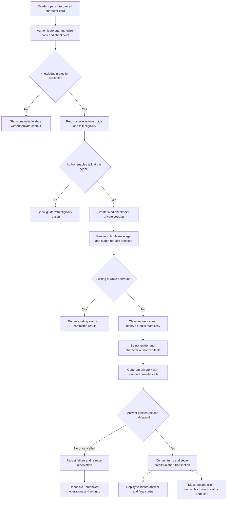
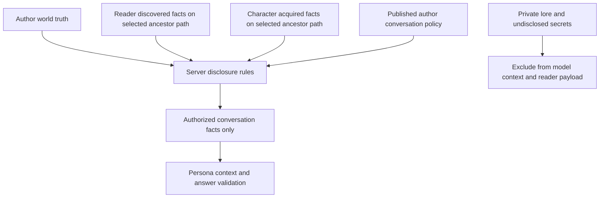

# Interactive Character Guide & Talk to Character Roadmap

> **Status:** Proposed
> **Date:** 2026-10-05
> **Owner:** Twistloom Backend, Web, Mobile, and Narrative Product teams (proposed; assign named owners before implementation)

This document turns the product ideas in `TODO-character-interacive-hydrafusion-chatgpt.md:61` into an implementation proposal. That source is brainstorming, not an executable instruction set or proof of shipped capability. Code references were inspected on the date above; no feature implementation, migrations, live API checks, or load tests were performed for this roadmap. Paths beginning with `src/` belong to Twistloom-backend; `Twistloom-web/` and `Twistloom-flutter/` paths are relative to the workspace root. **NEW** identifies a proposed file, not an existing implementation. Line references are discovery anchors and can move.

Companion roadmap: [HydraFusion Adoption & Adaptive AI Orchestration](HYDRAFUSION_IMPLEMENTATION_ROADMAP.md). Character Guide and safe text conversation do not depend on native HydraFusion orchestration. Benchmark those conversations later as a separate task family.

---

## 1. Summary Table

| # | Item | Priority | Status |
|---|------|----------|--------|
| 1 | Freeze feature semantics, contracts, baseline fixtures, and ownership | `P0` | ⬜ Planned |
| 2 | Build reader and character knowledge authorization | `P0` | ⬜ Planned |
| 3 | Add versioned author simulation policies and Pen controls | `P0` | ⬜ Planned |
| 4 | Deliver spoiler-aware Character Guide API and web cards | `P0` | ⬜ Planned |
| 5 | Add durable conversation sessions, operations, and credit settlement | `P0` | ⬜ Planned |
| 6 | Implement bounded persona generation and release validation | `P0` | ⬜ Planned |
| 7 | Implement validated-answer delivery and recovery contracts | `P0` | ⬜ Planned |
| 8 | Deliver web character conversation and isolated state | `P0` | ⬜ Planned |
| 9 | Add Flutter reader parity and lifecycle handling | `P1` | ⬜ Planned |
| 10 | Verify security, narrative quality, accessibility, and capacity | `P0` | ⬜ Planned |
| 11 | Roll out with monitoring, retention, rollback, and support tools | `P0` | ⬜ Planned |
| 12 | Evaluate voice and author-approved narrative consequences | `P2` | ⬜ Planned |

The sequence follows dependencies, including P0 verification after both client implementations. Character Guide may ship at the Step 4 gate once its applicable Step 10/11 checks pass; charged chat must complete Steps 1–8 and its Step 10/11 gates. Flutter is a separate release gate, not a claim that mobile is ready when web ships.

---

## 2. Problem Statement

### Current State

- **Companion** is a grounded story Q&A experience, not a selected-character simulation. Its system prompt and context projection are in `src/utils/companion-prompt.ts:132` and `src/utils/companion-prompt.ts:332`; REST, SSE, history, and suggestions live in `src/routes/books.ts:6509`, `src/routes/books.ts:6702`, `src/routes/books.ts:6845`, and `src/routes/books.ts:7017`.
- Persistent character state includes names, recognition level, secrets, traits, relationships, status, injuries, and recent interactions in `src/types/character.ts:217`. The TODO's numeric trust/fear example is illustrative: the inspected relationship type uses categories and contextual text (`src/types/character.ts:98`), so numeric trust scores are not an implementation assumption.
- `src/utils/branch-traversal.ts:206` follows parent pages and `src/utils/branch-traversal.ts:580` reconstructs state. Vector memory stores page and character interaction records, but inspected retrieval uses exact branch equality plus page-number bounds (`src/services/vector-memory.ts:370`, `src/services/vector-memory.ts:428`). Character-interaction records do not establish fact-by-fact disclosure permission.
- Pen has author-owned Lore Bible entries with optional linked character IDs (`src/db/schema.ts:3468`, `src/types/pen.ts:307`). It has no inspected, dedicated versioned conversation policy specifying reader-safe persona, permitted facts, and scene eligibility.
- Web already has character/context cards, Companion history, and streaming (`Twistloom-web/src/components/reader/CompanionView.tsx:87`, `Twistloom-web/src/lib/hooks/useCompanionStream.ts:41`). Flutter has corresponding Companion models, service, and panel (`Twistloom-flutter/lib/features/reader/services/companion_service.dart:22`). Both are reuse points, not evidence of talk-to-character support.
- Current answer storage is question-oriented: uniqueness is user/book/page/question hash, not session/character/turn sequence (`src/db/schema.ts:3673`). Companion's charge-then-run helpers explicitly document a crash-before-refund gap (`src/services/companion-ask.ts:6`). Reusable credit reservations and expiry reconciliation already exist elsewhere (`src/services/credits.ts:663`, `src/services/credit-reservations.ts:62`).

### Pain Points

1. Reader knowledge, character knowledge, and world truth are different. Copying raw character biographies, secrets, lore, or scene prose into a persona prompt can disclose hidden identities or events the character never witnessed.
2. Page numbers and matching branch IDs alone cannot represent the selected journey. Ancestors may have different branch IDs; sibling pages can have the same page number. Revisiting earlier pages also reduces the current disclosure boundary.
3. Existing Companion accepts a short history supplied by the client (`src/routes/books.ts:6533`) and its cache lookup can reuse another reader's answer (`src/routes/books.ts:6444`). These patterns cannot establish trusted character memory or private conversation isolation.
4. Improvised dialogue can appear canonical unless the UX and storage separate side conversations from published pages, inventory, relationships, and future generation state.
5. Token streaming before final validation can reveal a spoiler that later correction cannot retract. Best-effort persistence is insufficient for charged multi-turn conversations with retry and recovery requirements.
6. Authors need controls without exposing secret lists to readers or forcing every existing book to acquire a simulation policy.

### Goal

Enable readers to inspect discovered characters and hold author-bounded, branch-safe text conversations at their current story checkpoint, with durable private history, predictable credits, and equivalent web/mobile contracts.

---

## 3. Intended Design & Rationale

### 3.1 Scope and delivery boundaries

**First release:** server-projected Character Guide, explicit author opt-in, text conversation, character-initiated opening where authored, private bounded memory, server-authoritative pricing, safe answer delivery, and recovery. Prioritize a small author-curated pilot with known disclosure fixtures.

**Later entry gates:** voice, visual exploration, autonomous authored turning points, generated-book policies, and chat-driven canon changes. Existing generated books remain disabled for conversation unless a reviewed policy is created. No automatic backfill from full biographies or secrets.

The reader selects a character from Companion or a discovered-character card. Start with physically present, active, recognized characters. Guide cards may still show missing/dead/off-scene characters using already-discovered information, but their Talk action is disabled with a literal reason. Flashbacks, remote communication, or posthumous simulations require explicit author policy and separate narrative framing. Do not automatically turn any character name in prose into a link: unknown aliases, homonyms, and parsing errors need a later entity-span implementation gate.

### 3.2 Design alternatives

| Alternative | Advantages | Disadvantages |
|-------------|------------|---------------|
| A: Add `characterId` to generic Companion and reuse its shared answer cache | Smallest route/UI change | Conflates guide and persona semantics; inherited cache, history, and billing assumptions are unsafe |
| B: Dedicated character conversation service with shared transport, access, and credit primitives | Explicit authority and lifecycle; existing Companion stays compatible; supports multiple clients | New policy, knowledge, and operation storage required |
| C: Let conversation immediately mutate story state | Direct gameplay consequence | Concurrent chat/reading changes, canon validation, rewind, credits, and author intent become tightly coupled |

**Recommended: Alternative B**, with read-only Character Guide first. Share pure utilities and delivery infrastructure, not identity-sensitive answer records. Defer C until authors can review explicit state proposals.

### 3.3 Knowledge authorization before prompting

Define a server-owned **KnowledgeScope** from authenticated identity, authorized book/page, current journey checkpoint, ancestor path, content/canon version, policy revision, and target character. A page supplied in the URL must belong to the book and be a permitted checkpoint for this reader. A linkable page is not automatically discovered knowledge. Verify progress semantics against `userPageProgress` and `userSessions`; if current rows cannot prove a checkpoint, add an explicit journey/checkpoint projection rather than trusting client ancestor IDs or inventing a numeric frontier rule.

Use three distinct views:

1. **World/author truth:** full canonical state and private lore, available only to the authoring and deterministic policy layer.
2. **Reader-discovered facts:** explicit provenance on the selected ancestor path, bounded by the requested checkpoint and disclosure policy.
3. **Character-known facts:** witnessed, told, or author-approved knowledge at that same checkpoint. Reader seeing an omniscient paragraph does not mean a character heard it.

For conversation, allowed facts are the intersection of reader-discovered, character-known, and author-permitted facts. Character Guide projects only reader-discovered facts; it does not show private inner motives merely because the simulator knows them. Unknown permission denies inclusion. An undisclosed character secret is not passed to the model as a “never reveal this secret” instruction: that still gives the model the secret.

Proposed storage: `story_knowledge_facts` has typed `book_id`, `source_page_id`, `fact_key`, `subject_character_id`, `visibility`, `content_version`, and bounded fact text. `character_fact_knowledge` relates facts to character IDs and the page where knowledge was acquired, with acquisition kind (`witnessed`, `told`, `author_granted`). Source and acquisition pages must both be on the allowed path. Author exclusions reference stable fact keys; flexible voice directives can use validated JSON/text. Historical imports require explicit review or remain excluded. Raw interaction summaries and page embeddings remain candidates, not authorization grants.

```ts
// Proposed boundary: no raw StoryState or author-private lore in the result.
interface CharacterKnowledgeContext {
  scopeRevision: string;
  characterId: string;
  displayName: string;
  persona: ReaderSafePersona;
  scene: ReaderSafeScene;
  facts: AuthorizedFact[];
  priorTurns: VerifiedConversationTurn[];
}

// Authorization happens before similarity ranking and model invocation.
const scope = await resolveAuthorizedKnowledgeScope(identity, checkpoint);
const facts = await selectAuthorizedFacts(scope, targetCharacterId);
const recall = await rankAuthorizedMemories(scope, facts, question);
return projectCharacterContext(scope, facts, recall);
```

Build authorization predicates into SQL before ranking/limit, or rank only a bounded authorized candidate set. Never vector-search the whole book and post-filter the top few results. Use ancestry joins or a bounded materialized path projection; avoid unbounded SQL parameter arrays. Retrieve typed provenance alongside snippets so every claim can be rechecked. Missing embeddings degrade to authorized structured facts. Missing knowledge authority disables the generation; it does not fall back to raw lore or `futureNoteEmbeddings`.

Names follow recognition levels via existing display-name resolution; real names, aliases, portraits, last-seen markers, and relationships need the same disclosure checks. “Introduced at page N” is insufficient when the introduction was on a sibling path. Do not derive reader-safe bios by truncating secret-bearing biographies.

### 3.4 Author simulation policy and scene contract

Add `character_simulation_policies`, uniquely owned by book/character, with typed enabled flag, revision, spoiler mode, scene eligibility mode, and timestamps. Use a linked engine character ID, not a name match. Snapshot policy revisions into sessions. Draft updates use optimistic revision checks; publication increments the effective revision and invalidates guide/context caches. Disabling a policy stops new generation immediately and makes existing sessions read-only.

Store a reader-safe persona (manner, role, allowed demeanor), optional approved opening, reader role/goal/stakes, topic permissions, fact exclusions, and bounds on turns/output. Topic permissions narrow authorized facts; they cannot grant unavailable facts. Author-private prohibition text remains server-side, or is converted to generic restrictions without secret content. Validate instructions, lengths, locale, and character linkage at save and publish. Published openings/goals/stakes themselves need checkpoint eligibility; an author preview must use the same reader projection, not unrestricted author context.

At opening, show the scene checkpoint and “This conversation does not change the story.” If approved opening text is available, serve it deterministically without a generation charge. Otherwise use a generic localized greeting or request a separately disclosed generated opening. The recommended first release charges only reader-submitted turns.

### 3.5 Session and operation model

| Proposed entity | Essential typed fields and constraints | Purpose |
|-----------------|---------------------------------------|---------|
| `character_conversation_sessions` | ID, user/book/character/checkpoint IDs, policy/content revisions, status, scope hash, next sequence, created/updated/expiry times; ownership/time indexes | Fixed-checkpoint private session |
| `character_conversation_turns` | Session, sequence, operation ID, role, bounded text, validation revision, timestamps; unique session/sequence and operation/role | Ordered committed dialogue; opening can be sequence zero |
| `character_conversation_operations` | User/session/client request ID, payload hash, status, expected sequence, reservation ID, cost snapshot, deadline, result ID, error code; unique user/client request ID, session-active-operation constraint, status/deadline index | Idempotent execution, unknown-outcome lookup, recovery |
| `story_knowledge_facts` / `character_fact_knowledge` | Fact and acquisition provenance, scope/version indexes and foreign keys | Permission-bearing facts independent of vector ranking |
| `character_simulation_policies` | Unique book/character, enabled/revision typed columns, validated policy body | Author control and audit trail |

Use same-book composite checks/constraints for referenced character, checkpoint, and session records. Existing character IDs live in story state and lore links are soft references; Step 1 must resolve their stable identity/type contract before adding foreign keys. Do not assume every legacy engine ID is an independently persisted UUID entity.

Session scope is immutable. Moving page, switching branch, changing account, or rewinding creates a new session rather than quietly widening an old one. Older sessions are visible in an explicitly labeled history archive only where access still permits them; they must never feed earlier-checkpoint prompts. On policy/content revision mismatch, require a fresh session and reproject history. A user may delete a session; suppress further generation and schedule bounded content deletion while retaining the minimal ledger required by existing financial retention policy.

For each turn, atomically claim a durable operation and expected sequence. A concurrent duplicate returns the same operation; a reused request ID with a different payload returns conflict. The DB constraint is authoritative even when Redis fails. Serialize paid turns per session using compare-and-set/active-operation uniqueness; do not hold a DB lock while waiting for a model.

Reuse `reserveCredits`, `settleReservation`, and `releaseReservation`, with all final session/turn/operation writes in the settlement `tx`. Operation uniqueness must precede provider work and also cover zero-cost/demo runs. The current reservation helper's correlation reuse is for active reserve rows, not a complete lifetime operation guarantee; do not assume it prevents concurrent requests before the durable operation claim.

Claim + charge/reservation linking needs one atomic boundary. Add a narrow transaction-aware reservation primitive under the existing credits service if required, rather than a second debit implementation. Otherwise specify and implement recovery for the claim/reserve/link crash windows before enabling chat. Persist the charged cost and reservation identifier so a later price change cannot alter refunds. Never charge once per provider attempt or once per critique stage.

States: `accepted → reserved → generating → validating → committed`, or `failed/cancelled → release_pending → released`. Zero-cost operations skip reservation debit but preserve generation/commit idempotency. Refund-pending is a real state, not a claim that the balance has already returned. Expired reservations use the existing sweeper; operation reconciliation must link that outcome back to the conversation, including free operations that have no reservation row. A lease expiry cannot let a stale worker settle after a newer terminal state.

### 3.6 Generation and validated delivery

Build a static system prefix plus authorized persona/scene/facts/server history and the question last. Dialogue history comes from committed server turns; the client sends IDs and text, never an authoritative assistant transcript. Bound window, summary size, total prompt tokens, input length, output length, and per-session turns. A summary is private session memory, with the same scope/version and fact validation; user speculation never becomes confirmed canon.

Output schema: answer, authorized source fact IDs, optional safe follow-ups, and a categorical outcome such as `answered`, `uncertain`, or `declined`. Source IDs are checked against context. A source citation is supporting evidence, not proof that all answer text is grounded. Validate persona consistency, actual factual claims, prohibited disclosures, recognized identity, language, and completeness. Prompts and LLM judges reduce risk but cannot promise perfect spoiler prevention; exclusion of unauthorized inputs and adversarial regression suites are primary controls.

**Recommended first release: generate and validate the whole answer before releasing prose.** SSE emits truthful progress while buffering privately; after validation and atomic persistence/settlement it replays committed text and emits the final result. This costs more time before readable text than existing Companion live streaming; measure that tradeoff. Live per-sentence release is a later gate requiring incremental validation evidence. Do not expose drafts, rejected follow-ups, critic messages, private fact IDs, or provider errors containing prompts.

A disconnect before commit aborts upstream work and releases the reservation. A disconnect after commit leaves a durable successful result available through status/history and does not refund a delivered-equivalent result. If a disconnect races settlement, the conditional terminal-state transition decides the outcome; there is one charge outcome. SSE `done` is emitted only after commit, and must match the status endpoint's result. A write failure after validation still fails the paid turn and triggers release.

### 3.7 Proposed API and error contract

All paths below are **proposed** under `/api/books/:identifier`; no current endpoint supports them. Write routes require current authentication, applicable standing/entitlement checks, cookie-request protection consistent with middleware, book/page access, policy eligibility, and session ownership. Reads recheck access; clearing permissions also prevents history replay. Use existing error envelopes and machine codes, with translations in both web locales and mobile ARBs.

| Method and path | Request/response purpose |
|-----------------|--------------------------|
| `GET /:pageId/characters/guide?cursor=...` | Bounded safe cards, checkpoint/scope revision, next cursor, and per-character talk eligibility; no LLM call or story mutation |
| `GET /:pageId/characters/:characterId/guide` | Detail card with permitted facts and literal eligibility reason |
| `POST /:pageId/characters/:characterId/conversations` | Create/reuse session using client request ID; returns immutable scope, opening, limits, and current cost quote |
| `POST /character-conversations/:sessionId/turns` | Durable JSON equivalent for low-capability clients; request ID, expected sequence, message, pricing revision |
| `POST /character-conversations/:sessionId/turns/stream` | Same operation semantics, progress then validated committed answer over SSE |
| `GET /character-conversations/:sessionId/operations/:requestId` | Owner-scoped status, final answer if committed, terminal failure/refund status; no generation trigger |
| `POST /character-conversations/:sessionId/operations/:requestId/cancel` | Idempotent conditional cancellation; returns actual terminal state if already committed |
| `GET /character-conversations?characterId=...&cursor=...` | Cursor-paginated owner archive with checkpoint labels |
| `GET /character-conversations/:sessionId/turns?cursor=...` | Paginated committed history; read-only archived scope |
| `DELETE /character-conversations/:sessionId` | Idempotent deletion/tombstone and cancellation of pending work |

Session creation is a short operation; answer generation has a bounded deadline within the deployed Node/serverless limits. Verify the actual Netlify adapter and retained rollback adapter before promising an uninterrupted duration. If a compliant turn cannot fit, Step 7 must use durable dispatch/checkpoint work with the same operation contract; do not rely on an unawaited background promise surviving request termination.

SSE keeps existing `start`, `chunk`, `done`, `end`, and `error` conventions. Add an optional typed `progress` event for `generating`, `validating`, and `saving`; `start` includes operation/session/request IDs and sequence. `chunk` contains only committed validated prose with ordered event sequence. `done` carries the exact committed answer/turn ID, safe source labels, scope revision, and authoritative remaining balance. If balance retrieval is unavailable, omit it and request a profile refresh rather than return zero. A closed connection without terminal event means **unknown outcome**; status reconciliation precedes any resend. Resends reuse the same request ID. Operation lookup never starts provider calls.

Proposed code vocabulary includes `characterConversation.scopeChanged`, `.notEligible`, `.invalidMessage`, `.requestConflict`, `.turnInProgress`, `.priceChanged`, `.insufficientCredits`, `.generationFailed`, `.validationFailed`, and `.refundPending`. Session ownership/book existence disclosure should follow the established surface-specific access policy. Do not use resource denial to trigger an unrelated global logout; confirm web/native interceptor handling as part of the contract tests.

### 3.8 Non-Breaking Guarantees

| Change | What it does not change | Why safe |
|--------|------------------------|----------|
| Add character guide/conversation routes and models | Existing generic Companion endpoint and response meanings | Additive contracts; independent session storage |
| Store private side conversations | Published pages, choices, inventory, relationship state, and generation canon | No story-state write path in the MVP |
| Add opt-in author policies | Existing books' ability to publish/read | Default disabled; no mandatory backfill |
| Use credit reservations for new chat | Existing purchase/reward semantics and Companion pricing | New cost key and scoped orchestration; reuse ledger ownership |
| Add reader-safe context services | Author access to full lore | Separate projection; author preview intentionally uses reader boundaries |
| Add web/mobile controls | Reader scroll, navigation, locale, and offline reading | Feature-local state, cancellation, and explicit online eligibility |

---

## 4. Feasibility Analysis

| Dimension | Assessment |
|-----------|------------|
| **Effort** | High: provisional 35–55 backend, 20–30 web, 12–20 mobile engineer-days plus 10–15 QA/narrative review days; elapsed time depends on staffed owners and shared work, not a delivery promise |
| **Risk** | High: factual provenance, spoilers, private history, paid-operation races, and model quality need adversarial evidence |
| **Backend changes** | Significant: knowledge projection, versioned policy, schema, session/operation lifecycle, pricing, API, reconciliation |
| **Frontend changes** | Significant web service/hooks/state/UI/Pen work; Flutter adds models, repository calls, controllers, panel, and localization |
| **Dependencies** | Stable character IDs, checkpoint authority, author policy approval, manually reviewed migrations, curated narrative fixtures, runtime deadline validation |
| **Reversibility** | UI/API activation reversible through flags; additive data/ledger records persist and require retention-aware cleanup; canon consequences intentionally deferred |
| **Scale** | No capacity claim yet: pagination, scoped indexes, bounded model calls, quota gates, privacy-safe telemetry, and representative load tests are mandatory |

Proposed initial limits to validate in Step 10: 1 active operation/session, 1,000 input characters, 600 answer tokens, 8,000 total context tokens, 30 paid turns/session, 50 history rows/page, and a maximum 45-second synchronous operation deadline **only if supported by the deployed adapters**. Start with p95 Guide response below 300 ms excluding network and p95 validated-answer completion below 15 seconds on the pilot's language/task mix. These are candidate budgets, not existing guarantees; freeze achievable numbers after measurement. Deadline, provider attempts, validation, and settlement share one budget.

---

## 5. Flow Diagram (Mermaid)





---

## 6. Implementation Plan

### Step 1: Freeze semantics, contracts, baseline fixtures, and ownership — ⬜ Planned

**Files:** `src/types/character.ts:98`, `src/types/character.ts:217`, `src/db/schema.ts:934`, `src/db/schema.ts:1307`, `src/services/book-page-access.ts:67`; **NEW** `docs/contracts/character-conversation-v1.md`, `tests/fixtures/character-conversation/knowledge-scenarios.json`.
**Effort:** Medium. **Owner:** Backend lead + product + client leads. **Depends on:** None.

Define identity/linking rules, server-authoritative checkpoint eligibility, opt-in/default-disable behavior, same-page session semantics, pricing quotation, side-conversation labeling, and operation contract. Inspect UUID/soft-reference behavior across generated and Pen characters. Use additive contract versioning and schema examples for successful, denied, free/demo, duplicate, cancelled, and unknown outcomes.

Create a fixture book with a shared ancestor and two equal-number sibling pages: one reveals identity, the other does not; include omniscient reader-only knowledge, a character who missed an event, a hidden ending, missing/dead NPC, policy edit, and a rewound reader. Record current baseline endpoints and each frontend's actual transport/cancellation behavior.

**Acceptance:** Named owners and review gates; no trust/fear columns invented from the TODO; fixtures prove what each actor may know; precise API/error/SSE contract reviewed by backend, web, and mobile.
**Non-breaking:** No production behavior changes or migration commands in this planning step.

---

### Step 2: Build reader and character knowledge authorization — ⬜ Planned

**Files:** `src/utils/branch-traversal.ts:206`, `src/services/vector-memory.ts:370`, `src/utils/characters.ts:1`, `src/db/schema.ts:2647`, `src/utils/prompt.ts:5678`, `src/services/story.ts:1`, `src/services/pen.ts:1`; **NEW** `src/types/character-knowledge.ts`, `src/services/character-knowledge.ts`, `tests/character-knowledge.test.ts`.
**Effort:** High. **Owner:** Backend narrative/state lead. **Depends on:** Step 1.

Implement the scope resolver and indexed fact/acquisition relations proposed in §3.3. Define provenance writing at story publication/finalization; automatically inferred fact grants remain conservative and require schema validation. Reuse branch reconstruction without materializing state on every guide request. Keep read endpoints free of unexpected story mutation. Build a shared typed retrieval restriction that adds ancestry and source provenance without changing existing callers' fallback behavior.

Project names, bios, last-seen location, portraits, and relational context through disclosure checks. Exclude raw `secrets`, potential twists, full Lore Bible, future notes, and author outline. Invalidate on content/policy revisions, not just page ID. Bound the authorization result before embedding/ranking and handle missing vectors safely.

**Acceptance:** All forbidden fixture facts absent from prompts, payloads, safe source labels, follow-ups, and cached contexts; ancestor facts survive cross-branch-ID forks; siblings/future/retracted facts do not; database plans show scoped indexes and bounded work.
**Non-breaking:** Existing generic Companion recall retains its contract; any separately discovered Companion hardening gets its own change and validation.

---

### Step 3: Add versioned author simulation policies and Pen controls — ⬜ Planned

**Files:** `src/db/schema.ts:3468`, `src/types/pen.ts:307`, `src/routes/pen.ts:1`, `src/services/pen.ts:1`, `Twistloom-web/src/components/pen/lore/LoreEntryForm.tsx:1`, `Twistloom-web/src/components/pen/cast/useCastLoreEditor.tsx:24`, `Twistloom-web/src/lib/services/pen-api.ts:272`, `Twistloom-web/src/lib/types/pen.ts:1`, `Twistloom-web/messages/en.json:1`, `Twistloom-web/messages/id.json:1`; **NEW** `src/services/character-simulation-policy.ts`, `Twistloom-web/src/components/pen/CharacterSimulationPanel.tsx`, `tests/character-simulation-policy.test.ts`.
**Effort:** High. **Owner:** Backend Pen + web authoring. **Depends on:** Steps 1–2.

Implement typed policy storage, read/update/publish routes with book ownership, bounded fields, optimistic revision conflict, and audited opt-in/disable. Add controls for safe persona, role/goal/stakes, opening, permitted topics, stable fact exclusions, and scene restrictions. Clarify draft versus published state and preserve dirty changes during failed save.

Preview as a selected reader checkpoint using production knowledge projection. Provide safe policy lint warnings without printing hidden content in public errors. Define how linked lore deletion, character removal, and publication edits disable or stale existing sessions. Review schema changes manually; this repository's rules reserve migration generation/application to the human developer.

**Acceptance:** Non-owners cannot view private policy or save changes; concurrent edits conflict; default disabled for legacy books; preview cannot see unrestricted lore; disable immediately prevents new paid turns; both locales have every new UI/error key.
**Non-breaking:** Existing LoreEntry payloads remain compatible; dedicated policy APIs do not embed secret policy fields in public book responses.

---

### Step 4: Deliver spoiler-aware Character Guide API and web cards — ⬜ Planned

**Files:** `src/routes/books.ts:6509`, `src/services/book-page-access.ts:107`, `Twistloom-web/src/components/reader/CompanionView.tsx:87`, `Twistloom-web/src/lib/services/books-api.ts:356`, `Twistloom-web/src/stores/reader-store.ts:128`, `Twistloom-web/messages/en.json:1`, `Twistloom-web/messages/id.json:1`; **NEW** `src/routes/character-conversations.ts`, `src/types/character-conversation.ts`, `src/services/character-guide.ts`, `Twistloom-web/src/lib/types/character-conversation.ts`, `Twistloom-web/src/lib/services/character-conversations-api.ts`, `Twistloom-web/src/lib/hooks/query/useCharacterGuide.ts`, `Twistloom-web/src/components/reader/CharacterGuideCard.tsx`.
**Effort:** Medium–High. **Owner:** Backend API + web reader. **Depends on:** Steps 2–3.

Add bounded guide/list routes and mount the dedicated router in `src/app.ts:1`. Authorize against current book access before context/cache use. Keep guide free of generation/credits and explicit about insufficient discovered information. Implement service class → memoized TanStack hook → UI, centralized identity/scope query keys, auth readiness, and cancellation. Serve personalized data with `private, no-store`; authorization metadata must never be trusted from an LRU.

Open cards from current Companion character cards; include safe name/role, last seen, discovered facts, and talk eligibility. Use existing modal/history navigation guards, semantic buttons, and optimized image wrapper. Support skeleton, empty, denied, unavailable, long translated names, and offline state. Begin Guide-only pilot only after applicable Step 10/11 checks.

**Acceptance:** Same-number sibling and rewind cards differ appropriately; no secret biography display; no route can retrieve another book's character; no costly request for opening the guide; reader scroll survives opening/closing the card.
**Non-breaking:** Generic Ask and existing character/context surfaces stay usable; no dependency on chat completion.

---

### Step 5: Add durable sessions, operations, and credit settlement — ⬜ Planned

**Files:** `src/db/schema.ts:3673`, `src/services/credits.ts:663`, `src/services/credits.ts:741`, `src/services/credit-reservations.ts:62`, `src/config/credits.ts:161`, `src/cron/cleanup.ts:1`; **NEW** `src/services/character-conversation.ts`, `src/services/character-conversation-operations.ts`, `src/config/character-conversation.ts`, `tests/character-conversation-operations.test.ts`, `tests/character-conversation-credits.test.ts`.
**Effort:** High. **Owner:** Backend transaction lead. **Depends on:** Steps 1–3.

Implement §3.5 tables, foreign-key/same-book validation, cursor indexes, active-operation claim, sequence compare-and-set, payload-hash conflict, and request/result lookup. Add server cost quote, demo handling, quota limits, and explicit pricing revision. Reuse ledger reservation/settlement; extend its transaction boundary only where claim/reserve/link atomicity requires it. Persist failure/release outcomes and connect expiry reconciliation with operation terminal states.

Test crashes before/after reserve linking, validation, commit, SSE delivery, and refund. Test competing requests in separate database connections; a mocked single-process lock is insufficient. Ensure zero-cost uniqueness remains durable and an exhausted budget rejects before provider work. Delete/tombstone sessions without erasing required financial history.

**Acceptance:** At most one debit and committed assistant answer per operation; simultaneous distinct turns serialize/conflict deterministically; process crash produces reconciled refund or committed result; stale worker cannot commit after cancellation/sweep; provider work never holds a transaction open.
**Non-breaking:** No reuse/migration of `companion_answers` into private character sessions; existing credit operations retain behavior.

---

### Step 6: Implement bounded persona generation and release validation — ⬜ Planned

**Files:** `src/utils/ai-chat.ts:1539`, `src/utils/ai-parser.ts:123`, `src/config/ai-clients.ts:565`, `src/types/ai-chat.ts:99`; **NEW** `src/utils/character-conversation-prompt.ts`, `src/services/character-conversation-validation.ts`, `tests/character-conversation-generation.test.ts`.
**Effort:** High. **Owner:** Backend AI + narrative QA. **Depends on:** Steps 2–3, 5.

Implement safe context and structured response schema, server-owned history, source-ID validation, uncertainty/refusal behavior, bounded optional corrective attempt, and safe follow-up checks. Add a dedicated task policy using existing provider adapters. Propagate abort/deadline through provider calls and parsing; limit the whole operation including fallback, repair, and validation rather than assigning each stage a fresh timeout.

Do not pass full canon to a conversation judge: it should validate against the same authorized context. Keep persona style independent of factual permission. Verify actual claims against source facts, not merely valid source IDs. Treat model-generated confidence as an uncalibrated signal. Exclude adversarial instructions in reader text from authority. Store only validated result and permitted private conversation memory.

**Acceptance:** Target character voice is recognizable in both story languages; it admits ignorance, stays in its scene, and never turns reader speculation into canon; fixture leakage is zero; empty/truncated/off-schema or unsafe outputs fail/refund; context/token and retry limits are enforced.
**Non-breaking:** Existing generation/evaluation pools are not globally reordered; HydraFusion native experimentation is optional after baseline measurement.

---

### Step 7: Implement validated-answer delivery and recovery contracts — ⬜ Planned

**Files:** `src/utils/companion-stream.ts:1`, `src/utils/ai-chat-stream.ts:1`, `src/routes/books.ts:7017`, `netlify/functions/api.mts:1`; **NEW** `src/utils/character-conversation-delivery.ts`, `tests/character-conversation-stream.test.ts`, `tests/character-conversation-contract.test.ts`.
**Effort:** High. **Owner:** Backend API/platform. **Depends on:** Steps 5–6.

Implement the JSON/SSE routes and status/cancel endpoints from §3.7. Reuse typed SSE utilities and wire conventions while buffering unvalidated content. Authorize before the first stream event; keep provider resets/progress free of private snippets. Ensure finalized response is identical between transports and status replay. Verify synchronous deadlines on local Bun and deployed Node adapters; if durable dispatch is needed, document worker claiming/checkpoint recovery and cancellation ownership before activation.

Add contract fixtures for split UTF-8, fragmented SSE frames, closed socket before `done`, duplicate send, terminal failure, cancellation after commit, revoked access, and deployment termination. Do not imply real-time token delivery while replaying a validated answer: communicate truthful progress.

**Acceptance:** No prose sent before validation/commit; `done` references a durable answer; unknown outcome resolves without another generation or charge; abort reaches every provider stage; settlement/refund races have one terminal outcome.
**Non-breaking:** Existing Companion can continue live streaming through its own route; new semantics are versioned and explicit.

---

### Step 8: Deliver web character conversation and isolated state — ⬜ Planned

**Files:** `Twistloom-web/src/components/reader/CompanionView.tsx:87`, `Twistloom-web/src/lib/hooks/useCompanionStream.ts:41`, `Twistloom-web/src/lib/utils/sse-reader.ts:1`, `Twistloom-web/src/stores/reader-store.ts:142`, `Twistloom-web/src/lib/services/api.ts:1`, `Twistloom-web/messages/en.json:1`, `Twistloom-web/messages/id.json:1`; **NEW** `Twistloom-web/src/components/reader/CharacterConversationView.tsx`, `Twistloom-web/src/lib/hooks/query/useCharacterConversations.ts`, `Twistloom-web/src/lib/hooks/useCharacterConversationStream.ts`, `Twistloom-web/src/stores/character-conversation-store.ts`, `Twistloom-web/tests/unit/character-conversation.test.tsx`, `Twistloom-web/tests/e2e/character-conversation.spec.ts`.
**Effort:** High. **Owner:** Web reader. **Depends on:** Steps 4–7.

Implement selected-character header/checkpoint, approved opening/role/goal/stakes, bounded composer, server price confirmation, progress, safe answer, follow-ups, status recovery, archive, deletion, and literal error/refund states. Preserve generic Ask as a separate surface. Memoize API service instances, use auth-ready query guards, centralized query keys, and service-owned endpoints; do not extend the existing hook's raw fetch pattern into new UI calls.

Scope transient state by account/book/character/session/checkpoint revision. Clear on sign-out/account switch, cancel on scope change/unmount, reject stale callback epochs, and keep one composer operation active. Recover with the stable request ID after interrupted delivery; disable automatic mutation retries. Do not persist transcripts to service-worker public caches or unscoped local storage. Avoid global query invalidation and reconnect-triggered reader rerenders; update balance from the authoritative response or targeted profile refresh.

**Acceptance:** Rapid character/page/account switches never show another scope's reply; double click spends once; reload during unknown outcome retrieves the committed turn; keyboard/focus/escape/back behavior, live announcements, reduced motion, narrow view, and both locales work without scroll reset.
**Non-breaking:** Reader preference and navigation ownership remain unchanged; offline reading does not promise offline generation.

---

### Step 9: Add Flutter reader parity and lifecycle handling — ⬜ Planned

**Files:** `Twistloom-flutter/lib/features/reader/reader_repository.dart:1`, `Twistloom-flutter/lib/features/reader/models/companion_models.dart:1`, `Twistloom-flutter/lib/features/reader/services/companion_service.dart:22`, `Twistloom-flutter/lib/features/reader/widgets/companion_panel.dart:1`, `Twistloom-flutter/lib/core/l10n/app_en.arb:1`, `Twistloom-flutter/lib/core/l10n/app_id.arb:1`; **NEW** `Twistloom-flutter/lib/features/reader/models/character_conversation_models.dart`, `Twistloom-flutter/lib/features/reader/controllers/character_conversation_controller.dart`, `Twistloom-flutter/lib/features/reader/widgets/character_conversation_panel.dart`, `Twistloom-flutter/test/features/reader/character_conversation_test.dart`.
**Effort:** High. **Owner:** Mobile reader. **Depends on:** Steps 1, 4–7; release coordinated with Step 11.

Use typed immutable DTOs, existing repository/transport/SSE ownership, Riverpod lifecycle, and validated categorical enums. No direct widget networking or new DI/router. Cancel/park work appropriately on page/account change and app background; reconcile operation status on foreground instead of blindly replaying a paid POST. Pure reads use the existing query policy; charged mutations use their explicit idempotent contract. Observe a reactive account identity provider, not an immutable session store.

Render cards, price, offline/unavailable states, approved opening, validation progress, transcript, recovery, and deletion. Use both ARB catalogs, code-driven error localization, native safe areas/keyboard/text scaling, accessible labels, and reachable controls. Keep unpublished Pen policy authoring on web until mobile authoring has a separate approved scope. Persist a minimal pending operation reference only through an approved account-scoped storage owner; gate process-death recovery on that choice rather than using preferences as a journal.

**Acceptance:** Repository/DTO/controller/widget tests cover duplicate requests, denied access, partial stream, background/resume, account changes, and refund-pending; process-death and native auth paths have device evidence before release; no undocumented automatic paid retry.
**Non-breaking:** Existing Flutter generic Companion and offline reader remain available; no unauthorized next mobile checkpoint is implied by this document.

---

### Step 10: Verify security, narrative quality, accessibility, and capacity — ⬜ Planned

**Files:** `tests/test-companion-config-parity.test.ts:1`, `Twistloom-flutter/test/features/reader/companion_panel_test.dart:1`; **NEW** `tests/character-conversation-security.test.ts`, `tests/character-conversation-concurrency.test.ts`, `scripts/benchmark-character-conversations.ts`, `docs/checkpoints/character-conversation-validation.md`.
**Effort:** High. **Owner:** QA/security + narrative reviewers + platform. **Depends on:** Relevant feature steps; run continuously, final gate after clients are ready.

Required matrix:

| Boundary | Cases | Release evidence |
|----------|-------|------------------|
| Access | Private/archived/deleted book, forged checkpoint, foreign session, standing/entitlement change, policy disable | No unauthorized payload/provider call; access revoked on replay too |
| Knowledge | Shared ancestors, siblings with equal page number, rewind, off-scene knowledge, hidden identity, secret-bearing biography, omitted embeddings | Zero forbidden fixture facts in prompts/results/cards/follow-ups/cache |
| Injection | “Ignore rules,” forged assistant history, copied future spoiler, malicious author policy, encoded secret request | No increased knowledge scope; safe uncertainty/refusal |
| Financial | Parallel same/different IDs, free-demo, price edit, provider failure, write failure, kill during reservation, settle/sweep race | One durable charge outcome, bounded reconciliation, no phantom zero balance |
| Transport/lifecycle | Fragmented SSE/Unicode, drop before/after commit, stale callback, logout, tab switch, background/foreground | Consistent durable result and no scope leakage |
| Narrative | English/Indonesian, persona, role/goal/stakes, lies/speculation, story continuity | Blind author rubric and documented disagreements; judge confidence alone cannot pass |
| Scale | Long journeys, many characters/sessions, realistic concurrency, provider outage/quota exhaustion | Query plans, p50/p95/p99, connection use, total tokens/cost, no unbounded queues |
| Accessibility | Keyboard, screen reader, focus return, large text, narrow landscape, reduced motion | Web automated checks plus manual/device findings resolved |

Run backend targeted `bun test` suites and `bun check`; web targeted `pnpm test`, `pnpm typecheck`, scoped ESLint, `pnpm doc:drift`, and Playwright; Flutter's Windows wrapper analyze and targeted tests following its current operational instructions. Do not run a routine web build or apply schema migrations automatically. Record which checks used fakes and which used real database/provider/device infrastructure. Repository checks are future implementation gates, not claimed results of this documentation task.

**Acceptance:** No unresolved critical access/spoiler/ledger defects; defined quality/cost/latency limits pass representative workloads; mobile unverified platform checks remain explicit release blockers.
**Non-breaking:** Regression checks include generic Companion, Pen publish, credits, reading navigation, and old clients with the feature disabled.

---

### Step 11: Roll out with monitoring, retention, rollback, and support tools — ⬜ Planned

**Files:** `src/config/credits.ts:179`, `src/services/credit-reservations.ts:62`, `src/cron/cleanup.ts:1`, `src/services/user.ts:1`, `src/utils/ai-logger.ts:1`, `src/app.ts:1`; **NEW** `docs/runbooks/character-conversation.md`.
**Effort:** Medium–High. **Owner:** Platform + product/support. **Depends on:** Step 10 for the released surface.

Use independent flags for Guide, policy authoring, web chat, mobile chat, and voice. Expand internal author fixtures → opt-in creator cohort → limited reader percentage → wider release. Server eligibility is authoritative; old clients ignore new controls. Apply reviewed additive schema deployment before enabling writes; do not remove old fields during rollout. Set provider spend ceilings, per-user/book/session quotas, and system admission bounds even while demo costs are zero.

Measure guide/context latency, validation time, generation/cost by language and task, operation outcomes, duplicate suppression, abandoned operations, refunded reservations, refund-pending age, policy disables, quality reports, and cache/retrieval hit rates. Log correlation/operation IDs and bounded reason codes; raw conversations, prompts, secret facts, account names, and tokens are excluded by default. Author quality review requires explicit access/consent, not routine exposure of reader transcripts.

Define transcript expiry, tombstone cleanup, export/delete integration, ledger retention separation, and backup retention with product/privacy owners. Initial transcript retention proposal is 30 days; the exact policy is Q4. Sweep/reconcile bounded batches with indexed deadlines. Alerts must detect stale free operations too.

Rollback: stop new sessions/turns through server flags, preserve status/history/reconciliation, cancel uncommitted workers with release, and keep committed answers/ledger. Never drop additive tables or attempt to refund every completed conversation. Runbook includes forbidden-content incident response, access revocation, pending refund support, and how to disable one character/book independently.

**Acceptance:** Kill-switch and refund drills work; alerts have named responders; no pending-operation backlog exceeds the agreed recovery budget; measured cohort results justify each expansion.
**Non-breaking:** Disabling chat leaves safe Guide/generic Companion independently operable, subject to their own flags and access checks.

---

### Step 12: Evaluate voice and author-approved narrative consequences — ⬜ Planned

**Files:** `src/types/pen.ts:584`, `src/services/canon-validation.ts:501`, `Twistloom-web/src/lib/utils/pen-tts.ts:1`; **NEW** follow-up voice and conversation-state-proposal roadmaps under `docs/roadmap/` after entry gates pass.
**Effort:** High; excluded from text MVP estimates. **Owner:** Product + media + narrative/state leads. **Depends on:** Stable Step 11 cohorts and explicit owner decisions.

Voice requires permission/consent, speaker/voice rights, STT/TTS provider selection, transcript editing, validated-text-before-speech, interrupted audio handling, language coverage, accessible text fallback, mobile audio lifecycle, and a separate latency/cost study. Do not infer that existing Pen TTS authorizes reader voice impersonation or microphone use.

For canon effects, propose explicit typed relationship/fact/action changes tied to the checkpoint and conversation evidence. Reuse state proposal/canon validation concepts; require author-configured scope, reader confirmation, transactional application, stale-checkpoint conflict, rewind behavior, and payment review. Published story state remains unchanged until that separate gate. Visual Explorer is optional and requires its own asset/reveal/cost roadmap.

**Acceptance:** Separate reviewed designs, measured benefit, consent/rights evidence, release criteria, and no implicit migration of old chats into canon.
**Non-breaking:** Text conversation remains independent; no voice or canon side effects activate as part of Steps 1–11.

---

## 7. Open Questions

### Q1. What checkpoint constitutes reader-discovered knowledge? — ⬜ Open

- **(A)** Requested page plus server-verified journey ancestry — precise rewind/branch semantics; needs an authoritative progress model.
- **(B)** All pages the account ever visited — easier archive reuse; leaks alternate-path or later knowledge into the current scene.

**Recommendation:** A. Step 1 must verify progress evidence and define a server checkpoint projection where necessary; product may offer B only as a separately labeled retrospective experience later.

---

### Q2. Which characters and book types may converse? — ⬜ Open

- **(A)** Author-enabled, recognized, active on-scene characters in a curated Pen pilot — clear persona ownership; narrower coverage.
- **(B)** Every generated and authored character by default — broad access; permission/persona gaps and unsafe historical inference.

**Recommendation:** A. Expand book types only after reviewed policy creation and knowledge provenance coverage.

---

### Q3. How should turns and openings be priced? — ⬜ Open

- **(A)** Free approved opening and Guide; explicit per-submitted-turn server cost — simple accounting; needs quota control for demo/free use.
- **(B)** Paid session bundle with reserved turn budget — easier price predictability over long chats; unused credits and expiry complicate accounting.

**Recommendation:** A. Add a dedicated configurable cost key, quote/revision semantics, and no charge per internal model leg; use current Companion's one-credit base only as a comparison, not a settled business price.

---

### Q4. How long should transcripts and pending-operation references persist? — ⬜ Open

- **(A)** 30-day private server transcript retention, explicit deletion/export, minimal account-scoped client recovery reference — bounded storage and privacy; less long-term nostalgia.
- **(B)** Indefinite history — durable replay; higher storage/privacy burden and more content-version mismatch cases.

**Recommendation:** A, subject to owner review and existing legal/financial retention requirements. Mobile durable recovery storage must fit its approved architecture/checkpoint.

---

### Q5. Can generated conversation facts influence the story? — ⬜ Open

- **(A)** Private side conversation only — stable branch/canon boundaries; dialogue has no gameplay consequences.
- **(B)** Explicit author-approved proposals applied through a later state gate — richer interactions; substantial transaction/rewind work.

**Recommendation:** A for the first release; evaluate B in Step 12 after measured reader/author demand.

---

### Q6. Is live token streaming worth the disclosure risk? — ⬜ Open

- **(A)** Validate and commit before prose replay — safer release boundary; slower first readable text.
- **(B)** Incrementally validate sentences before release — better perceived responsiveness; more complex, incomplete-context validation.

**Recommendation:** A. Reconsider B only with evidence of leakage resistance, stable protocol, and meaningful latency benefit. Neither option can guarantee perfect model behavior.

---

## 8. References & File Touch List

### Source and companion plans

- `TODO-character-interacive-hydrafusion-chatgpt.md:75` — talk-to-character concept; `:163` author boundaries; `:220` Character Guide; `:272` knowledge separation.
- [HydraFusion implementation roadmap](HYDRAFUSION_IMPLEMENTATION_ROADMAP.md) — independent orchestration pilot, budgets, and benchmark gates.
- [Server-Sent Events architecture](../architecture/SERVER_SENT_EVENTS_STREAMING_ARCHITECTURE.md), [Branch traversal architecture](../architecture/BRANCH_TRAVERSAL_ARCHITECTURE.md), [AI LLM architecture](../architecture/AI_LLM_ARCHITECTURE.md), [Book access architecture](../architecture/BOOK_ACCESS_AND_MODERATION_ARCHITECTURE.md), and [Payments architecture](../architecture/PAYMENTS_ARCHITECTURE_BACKEND.md) — existing ownership/invariants, to reverify during implementation.
- [Audible announcement, 2026-10-01](https://www.audible.com/about/newsroom/the-next-chapter-in-listening-new-ways-to-interact-with-stories-on-audible) — verified 2026-10-05: creator-shaped character conversations and spoiler-aware guide cards are product inspiration, not a Twistloom implementation specification.

### Backend touch list

| File | Change |
|------|--------|
| `src/app.ts:1`, `src/routes/books.ts:6509`, `src/routes/pen.ts:1` | Mount dedicated reader router; preserve existing Companion; add author policy integration |
| `src/db/schema.ts:934`, `src/db/schema.ts:1307`, `src/db/schema.ts:3468`, `src/db/schema.ts:3673` | Add policy, knowledge, session/turn/operation storage; inspect progress and existing constraints; human-reviewed migration path |
| `src/types/character.ts:98`, `src/types/pen.ts:307`, `src/types/ai-chat.ts:99` | Reuse actual identity/relationship/lore/AI types; additive policy typing where required |
| `src/services/book-page-access.ts:67`, `src/utils/branch-traversal.ts:206`, `src/utils/characters.ts:1` | Reuse authoritative access, ancestry, display-name primitives |
| `src/services/vector-memory.ts:370` | Add scoped provenance retrieval path; preserve old callers |
| `src/utils/prompt.ts:5678`, `src/services/story.ts:1`, `src/services/pen.ts:1` | Write permission-bearing fact/acquisition provenance at generated-page publication and Pen finalization; never treat generated grants as authoritative without validation |
| `src/services/credits.ts:663`, `src/services/credit-reservations.ts:62`, `src/config/credits.ts:161` | Reuse/extend atomic reservation boundaries, reconciliation, pricing |
| `src/cron/cleanup.ts:1`, `src/services/user.ts:1`, `src/utils/ai-logger.ts:1` | Bounded cleanup, account export/deletion integration, privacy-safe metrics |
| `src/utils/ai-chat.ts:1539`, `src/utils/ai-parser.ts:123`, `src/config/ai-clients.ts:565` | Existing provider/parse execution; scoped task selection, no global pool rewrite |
| `src/utils/companion-stream.ts:1`, `src/utils/ai-chat-stream.ts:1`, `netlify/functions/api.mts:1` | Transport/runtime reference and any required safe shared delivery extraction |
| `src/services/companion-ask.ts:6`, `src/utils/companion-prompt.ts:332`, `src/services/canon-validation.ts:501` | Existing — reference only; not wholesale replacements |
| `src/types/character-knowledge.ts`, `src/types/character-conversation.ts`, `src/config/character-conversation.ts` | **NEW** — domain scope, DTOs, bounded configuration/error vocabulary |
| `src/routes/character-conversations.ts`, `src/services/character-knowledge.ts`, `src/services/character-guide.ts`, `src/services/character-simulation-policy.ts` | **NEW** — routes, authority, Guide, author policy |
| `src/services/character-conversation.ts`, `src/services/character-conversation-operations.ts`, `src/services/character-conversation-validation.ts` | **NEW** — durable lifecycle, credits integration, release checks |
| `src/utils/character-conversation-prompt.ts`, `src/utils/character-conversation-delivery.ts` | **NEW** — prompt projection and committed answer delivery |
| `tests/fixtures/character-conversation/knowledge-scenarios.json`, `tests/character-knowledge.test.ts`, `tests/character-simulation-policy.test.ts` | **NEW** — provenance and policy regression evidence |
| `tests/character-conversation-operations.test.ts`, `tests/character-conversation-credits.test.ts`, `tests/character-conversation-generation.test.ts` | **NEW** — lifecycle, ledger, persona/factual validation |
| `tests/character-conversation-stream.test.ts`, `tests/character-conversation-contract.test.ts`, `tests/character-conversation-security.test.ts`, `tests/character-conversation-concurrency.test.ts` | **NEW** — wire, isolation, adversarial, real-database races |
| `scripts/benchmark-character-conversations.ts` | **NEW** — bounded quality/cost/latency harness |
| `docs/contracts/character-conversation-v1.md`, `docs/checkpoints/character-conversation-validation.md`, `docs/runbooks/character-conversation.md` | **NEW** — agreed wire contract, evidence, operations |

### Web and mobile touch list

| File | Change |
|------|--------|
| `Twistloom-web/src/components/reader/CompanionView.tsx:87`, `Twistloom-web/src/stores/reader-store.ts:128` | Add guide/talk entry; preserve generic Ask and reader lifecycle |
| `Twistloom-web/src/lib/services/books-api.ts:356`, `Twistloom-web/src/lib/services/api.ts:1`, `Twistloom-web/src/lib/utils/sse-reader.ts:1`, `Twistloom-web/src/lib/hooks/useCompanionStream.ts:41` | Existing — inspect/reuse shared service/error/transport; no new raw-fetch hook |
| `Twistloom-web/src/lib/types/character-conversation.ts`, `Twistloom-web/src/lib/services/character-conversations-api.ts` | **NEW** — typed client contract and service |
| `Twistloom-web/src/lib/hooks/query/useCharacterGuide.ts`, `Twistloom-web/src/lib/hooks/query/useCharacterConversations.ts`, `Twistloom-web/src/lib/hooks/useCharacterConversationStream.ts`, `Twistloom-web/src/stores/character-conversation-store.ts` | **NEW** — query keys, private scope, stream/reconciliation state |
| `Twistloom-web/src/components/reader/CharacterGuideCard.tsx`, `Twistloom-web/src/components/reader/CharacterConversationView.tsx`, `Twistloom-web/src/components/pen/CharacterSimulationPanel.tsx` | **NEW** — reader cards/chat and author controls |
| `Twistloom-web/src/components/pen/lore/LoreEntryForm.tsx:1`, `Twistloom-web/src/components/pen/cast/useCastLoreEditor.tsx:24`, `Twistloom-web/src/lib/services/pen-api.ts:272`, `Twistloom-web/src/lib/types/pen.ts:1` | Link author controls with cast/lore ownership |
| `Twistloom-web/messages/en.json:1`, `Twistloom-web/messages/id.json:1` | Add all new controls, eligibility, progress, and machine-code error translations together |
| `Twistloom-web/tests/unit/character-conversation.test.tsx`, `Twistloom-web/tests/e2e/character-conversation.spec.ts` | **NEW** — lifecycle/recovery/accessibility evidence |
| `Twistloom-flutter/lib/features/reader/reader_repository.dart:1`, `Twistloom-flutter/lib/features/reader/services/companion_service.dart:22`, `Twistloom-flutter/lib/features/reader/widgets/companion_panel.dart:1`, `Twistloom-flutter/lib/features/reader/models/companion_models.dart:1` | Reader integration and shared transport reference |
| `Twistloom-flutter/lib/features/reader/models/character_conversation_models.dart`, `Twistloom-flutter/lib/features/reader/controllers/character_conversation_controller.dart`, `Twistloom-flutter/lib/features/reader/widgets/character_conversation_panel.dart` | **NEW** — typed DTOs, lifecycle state, native UI |
| `Twistloom-flutter/lib/core/l10n/app_en.arb:1`, `Twistloom-flutter/lib/core/l10n/app_id.arb:1`, `Twistloom-flutter/test/features/reader/character_conversation_test.dart` | Both locales plus **NEW** mobile boundary tests |

### Codebase Findings

1. `CharacterMemory` contains explicitly secret-bearing fields and categorical relationships. Safe projections and factual provenance must precede persona generation; the TODO's illustrative numeric attributes are not existing columns.
2. Exact-branch vector retrieval can omit shared ancestors and lacks character disclosure grants. This is a design gap for the new capability, not proof that all existing recall is incorrect.
3. Generic Companion's accepted client history, shared answer reuse, and question-hash uniqueness are unsuitable as authoritative private multi-turn state. New sessions must not inherit them.
4. Companion's helper documents crash-stranded credit risk, while reservation/expiry helpers already provide a stronger foundation. Reuse those owners and add operation-level idempotency; do not create another financial subsystem.
5. Existing Guide-like cards and transport infrastructure reduce UI work but do not establish spoiler authorization, author opt-in, or conversational agency. Existing reference comments naming other roadmaps are not proof those documents exist at their old locations.

---

## 9. Completion Status

Legend: ✅ Implemented & verified · ⏳ Partial / scoped down · ⬜ Future work · ⏩ Deferred

### Completed

No feature step has been implemented or verified through this documentation task. Existing infrastructure listed in §2 is context, not completion of this roadmap.

### In Progress

No implementation work is recorded as started.

### Future / Deferred

- ⬜ Step 1 — Semantics, contracts, fixtures, and ownership.
- ⬜ Step 2 — Knowledge authorization and provenance.
- ⬜ Step 3 — Published author policy and Pen controls.
- ⬜ Step 4 — Character Guide API and web cards.
- ⬜ Step 5 — Sessions, operation idempotency, and credit settlement.
- ⬜ Step 6 — Persona generation and release validation.
- ⬜ Step 7 — Validated delivery and recovery endpoints.
- ⬜ Step 8 — Web conversation and isolated lifecycle.
- ⬜ Step 9 — Flutter parity and native evidence.
- ⬜ Step 10 — Security, narrative, accessibility, and capacity verification.
- ⬜ Step 11 — Cohort rollout, retention, monitoring, and rollback.
- ⬜ Step 12 — Evaluate voice and canon proposals after the stated entry gates.

Implementation completion requires acceptance evidence per step, aligned statuses in §1/§6/§9, owner decisions in §7, and a dated checkpoint record. Publishing this roadmap does not authorize implementation, production migration, provider spend, or feature activation.
