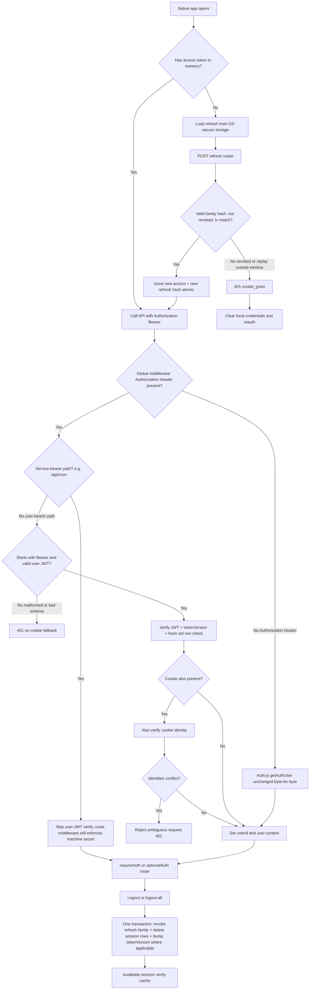

# Native Mobile Bearer Auth Roadmap

> **Status:** In Progress — backend Steps 2–8 landed & audit-corrected 2026-09-23; R1–R4 + R11 residual shipped same day (Step 10 suite 22/22, `logoutFromAllDevices` tx, `refresh_families` migration **applied**, family-keyed refresh rate limit, non-Bearer 401 + hybrid conflict 401, DUAL_AUTH Express samples → Hono); local `bun run check` + `bun test` green; **Step 1 fixtures/owner gates (1/9/11/12) and optional Google/mobile-me endpoints remain**
> **Date:** 2026-09-23 (architecture audit + implementation kickoff + security audit correction, same day)
> **Owner:** txufiknr
> **Parent gates:** Flutter [Q5 login/access](../../../Twistloom-flutter/docs/roadmap/TWISTLOOM_FLUTTER_APP_ROADMAP.md) · [Q6 session families](../../../Twistloom-flutter/docs/roadmap/TWISTLOOM_FLUTTER_APP_ROADMAP.md) · [MOBILE_AUTH_CONTRACT](../../../Twistloom-flutter/docs/roadmap/MOBILE_AUTH_CONTRACT.md) · Flutter [CHECKPOINT_02](../../../Twistloom-flutter/docs/checkpoints/CHECKPOINT_02_M0_FEASIBILITY.md) gaps **G-auth-1/2/3/4/5/6**, **A1**, **E1**
> **This document is the plan + status ledger.** Backend Steps 2–8 are implemented (see §9); remaining work is explicitly listed there. Stop → review → continue on the owner's command.
> **Audit revision (2026-09-23):** cookie-regression baseline + CI now precede the middleware change (Step 3); Redis-backed rate limiting mandated for token/refresh; bearer verify now requires a fresh `sid` session-row check (not only `tokenVersion`); `jose` dependency and secret-rotation plan made explicit; local open questions renamed **EQ1–EQ5** to eliminate collision with parent Q5/Q6; steps resequenced (CORS and test harness first).
> **Non-breaking revision (2026-09-23, second pass):** found and fixed a **critical** flaw in the first draft — “any `Authorization` header claims bearer intent” would have **hard-failed all cron jobs**, because `POST /api/cron/*` already authenticates with `Authorization: Bearer <CRON_SECRET>` (`src/routes/cron.ts:37`) through the same global `app.ts:134` middleware. Step 5 now mandates a **service-bearer allow-list** (path/exemption registry) so machine secrets never enter the user-JWT branch. Twistloom-web non-breaking claims are now **evidence-backed** (see §3 Non-Breaking Contract) rather than assumed.
> **Audit correction (2026-09-23, third pass):** post-implementation security audit of Steps 4–8 found and fixed: (1) **`POST /logout` now hard-deletes the session row** (`logoutFromSpecificDevice`, cascade removes families) after a soft-revoke pass — previously cache-clear-only; (2) **ban enforced at `/mobile/token`** (403 `Account banned` before any write) **and at refresh** (`evaluateRotation` fails closed with `reason: "banned"` + revokes family); (3) **mobile login is atomic** — session + family inserts share one `dbWrite.transaction`; (4) **bearer identity LRU** (15s TTL, SHA-256(raw token) key, gated by `CPU_OPTIMIZATIONS_ENABLED`) with immediate invalidation on logout; (5) **logout-all soft-revokes** families relying on `ON DELETE CASCADE` instead of a hard `DELETE`; (6) dead `revokeFamilyById` / `getActiveFamily` removed; (7) `MOBILE_REFRESH_RECOVERY` removed from `.env.example`; (8) real envelope + logout-route tests added to `tests/auth-cookie-baseline.test.ts`. §9 Completion Status and Steps 4/6/7/8 below reflect these corrections.

---

## 1. Summary Table

| # | Item | Priority | Status |
|---|------|----------|--------|
| 1 | Finalize M0 auth fixtures and owner decisions (parent Q5/Q6, durations, recovery, rotation, rate-limit substrate) | `P0` | ⏳ Partial (engineering defaults recorded: EQ3=B, EQ4=A, ≤15s LRU, Redis limits; **parent Q5/Q6 + written EQ3 acceptance still open**) |
| 2 | Origin/CORS/credential posture for native clients (A1) | `P0` | ✅ Done (confirmed already-permitting; no code change) |
| 3 | Cookie-regression test baseline + `test` script + CI harness (**pre-bearer gate**) | `P0` | ✅ Done (`bun test` + `.github/workflows/ci.yml` + envelope/logout/cron baseline; **full signed-cookie `requireAuth` cases live in Step 10**) |
| 4 | Access-token issuance under `/api/auth/*` (email + Google; Apple gated) | `P0` | ✅ Done password path (`POST /api/auth/mobile/token` — ban 403 + atomic txn); **`/mobile/google` + `/mobile/me` not implemented (optional)** |
| 5 | Bearer verification on the global API middleware path (G-auth-1) | `P0` | ✅ Done (`src/middleware/bearer.ts` + `app.ts` wiring; 15s SHA-256-keyed identity LRU, logout-invalidated) |
| 6 | Refresh rotation + hashed session-family storage (G-auth-2) | `P0` | ✅ Done (`POST /api/auth/mobile/refresh` + `refresh_families` schema + SQL `0099` **applied**; ban fails closed; family-keyed secondary rate limit) |
| 7 | Real revocation: enforce `tokenVersion` + fresh `sid` check (G-auth-4) | `P0` | ✅ Done (bearer `tv`+`sid`; password change/reset bump `tv` + revoke families; ban at issue + refresh); **cookie-path `tv` parity still EQ5** |
| 8 | Logout / logout-others / logout-all wired for bearer families | `P0` | ✅ Done (cookie body frozen; logout deletes session row; **`logoutFromAllDevices` one transaction**: delete + `tv++`; cascade removes families) |
| 9 | Apple Sign-in identity verification (or documented exception) | `P1` | ⬜ Planned (gated on parent Q5) |
| 10 | Integration tests: full suite — cookie regression + bearer/refresh/revocation (G-auth-6) | `P0` | ✅ Done local gate (`tests/bearer-auth-matrix.test.ts` 22/22 + baseline/unit green; **staging live capture still Step 11**) |
| 11 | Wire-contract fixture registration + mobile live auth capture (E1) | `P0` | ⬜ Planned (needs deployed/staging backend + Flutter capture; sibling Flutter contract paths not present in this workspace) |
| 12 | Pen/app-scoped audiences beyond provisional reader id (G-auth-3) | `P1` | ⬜ Planned (gated on parent Q6) |

> **Sequencing invariant:** Step 3 (cookie baseline + CI) must merge **before** Step 5 touches `src/app.ts:134-141`. Step 2 is zero-risk and can ship in parallel with Step 1.

---

## 2. Problem Statement

### Current State (post-implementation, 2026-09-23)

The backend is now a **dual-credential** Auth.js cookie + mobile bearer service. The Next.js web app still issues the session cookie; native Flutter exchanges credentials at `/api/auth/mobile/*` for access JWT + rotating opaque refresh.

- Global auth runs before body parsing: `src/app.ts` → `bearerAuthMiddleware` (no-op without `Authorization`; `/api/cron/*` service-bearer exempt) → `verifyNextAuthToken` only if `userId` not set → `c.set("user")` / `c.set("userId")`.
- Cookie verification lives in `src/middleware/nextauth.ts` (`extractAuthjsToken`, `getAuthUser`, session-verify cache **60s** at `SESSION_VERIFY_TTL_MS`, ban LRU **5min**) — **byte-for-byte else-branch** when no user `Authorization` (NB-1).
- Bearer verification lives in `src/middleware/bearer.ts`: jose HS256 + `tv` + ban + fresh `sid` + **15s SHA-256-keyed identity LRU** (`CPU_OPTIMIZATIONS_ENABLED`), invalidated on logout.
- `requireAuth` / `optionalAuth` / `requireVerifiedEmail` gate routes (`nextauth.ts`).
- `/api/auth/*` in `src/routes/auth.ts` implements `verify-credentials`, signup, password/email flows, Google ID-token verify (`handleGoogleAuth`), **`POST /mobile/token` (ban 403 + atomic session/family txn)**, **`POST /mobile/refresh` (RFC 9700 rotate; ban fail-closed)**, device bookkeeping, and multi-device logout with **session-row delete + family cascade + bearer-cache invalidation**.
- `POST /api/auth/logout` soft-revokes families, **hard-deletes the session row** (cascade removes remaining families), invalidates the bearer identity cache when a token was presented, and still returns the byte-identical cookie body; cookie deletion remains the frontend `signOut()` job.
- CORS already allows `Authorization` (`app.ts`) and **no-Origin** requests — native plumbing ready (Step 2 confirmed; still confirm Flutter HTTP stack sends no `Origin`).
- Inbound `Authorization` consumers: user bearer (new branch) + static `CRON_SECRET` in `src/routes/cron.ts` (service-bearer registry — NB-2). Workflow/Stripe/Xendit use other headers.

**Still open (not pre-implementation inventory):** Apple login (Step 9), `/mobile/google` + `/mobile/me` (optional), audience enforcement beyond provisional `aud` (Step 12), cookie-path `tv` parity (EQ5), Step 11 live fixtures, parent Q5/Q6 owner answers. **Step 10 local matrix is green** (`tests/bearer-auth-matrix.test.ts` 22/22); migration `0099` applied.

### Pain Points

> **Status note (2026-09-23):** items 1–4 and 7 are **addressed by Steps 4–8** (implementation + audit correction). Remaining pain is product-gate and verification depth, not missing core plumbing.

1. ~~**Flutter cannot authenticate**~~ — **closed:** issue + refresh + bearer verify landed (G-auth-1/2). Flutter integration still needs Step 11 fixtures.
2. ~~**Revocation is incomplete**~~ — **closed for bearer:** `tv` + fresh `sid` + family revoke + logout session delete; residual = cookie-path `tv` (EQ5) only (`logoutFromAllDevices` now one transaction).
3. ~~**Web cookie path must not regress / no tests**~~ — **closed for local gate:** baseline + CI + Step 10 bearer/cookie matrix green; **live staging capture still Step 11** (G-auth-6 evidence for M0).
4. ~~**Ambiguous identity**~~ — **closed:** invalid bearer + valid cookie → 401; non-Bearer scheme → 401; dual-credential conflict → 401 (`app.ts` hybrid dual-verify).
5. **Apple / audiences undecided** — G-auth-5 (parent Q5) and G-auth-3 (parent Q6) remain owner product gates.
6. **Lost refresh response** — EQ3=B (forced re-auth) is the implemented default; **written mobile-product acceptance still required** as Step 1 artifact; EQ3=A is a fast-follow only.
7. ~~**Serverless rate-limit gap**~~ — **closed for token/refresh:** Redis `checkRateLimit` on `/mobile/token` + `/mobile/refresh` (**IP + family-id** secondary limit).

### Goal

Add a **dual-credential** path: issue and verify short-lived bearer access tokens plus rotating refresh secrets for native clients, with real family revocation — **without changing** the Auth.js cookie path, web response shapes, CORS/CSRF behavior, or object-level authorization rules.

---

## 3. Intended Design & Rationale

### Design Alternatives

#### Alternative A: Cookie-only for mobile (shared WebKit/cookie jar)

**Pros:** Zero new crypto; reuses `verifyNextAuthToken` as-is.
**Cons:** iOS/Android cookie lifecycle, SameSite/`Secure` packaging, and logout UX are hostile for native apps; still leaves G-auth-1 open; breaks the mobile contract’s bearer requirement.

#### Alternative B: Opaque server-side session string only (no JWT access token)

**Pros:** Instant revocation; simpler keys.
**Cons:** Every request hits session store (cost/latency on serverless); harder to keep short-lived access tokens without a cache tier; still needs refresh protocol.

#### Alternative C: Dual credential — httpOnly cookie (web) + short-lived bearer/refresh (native) (recommended)

```text
Native login → { accessToken (JWT, minutes), refreshToken (opaque, long), expiresIn }
API request  → Authorization: Bearer <accessToken>
Refresh      → rotate refresh (hash stored), issue new access
Logout       → revoke family (refresh hashes + enforce tokenVersion/session sid)
Web          → unchanged Auth.js cookie path (httpOnly session cookie)
```

**Pros:** Aligns with `MOBILE_AUTH_CONTRACT` (memory-only access, OS-secure refresh, server hash + family); reuses `createSession` / `auth_sessions`; CORS already allows `Authorization`; one identity store, two credential adapters — the long-term multi-platform shape, not a stopgap.
**Cons:** Requires careful rotation/recovery design and enforcement of `tokenVersion` **and session-row existence** at verify time; two credential paths are maintained forever (accepted cost of multi-platform).

#### Why dual credential is the long-term architecture (industry standard)

Alternative C is not a greenfield compromise. Shipping web **and** native from one backend with a single identity system and two credential presentations is what large platforms do:

| Platform | First-party web | Native / third-party API |
|----------|-----------------|--------------------------|
| **Meta** (Graph API) | session cookies | short-lived page/user access tokens |
| **Google** | first-party cookies | OAuth bearer tokens |
| **X** | web session cookies | OAuth API bearer tokens |

**Standards alignment (first-party native):** the native face follows **OAuth 2.1 / RFC 9700** refresh-token guidance for native apps — **rotation on use, reuse detection outside a bounded window, no universal grace period** (exactly Step 6’s theft rule). The Meta/Google/X table above illustrates the *one-identity/two-credential* industry shape; RFC 9700 is the governing best-practice document for the refresh protocol itself.

**Greenfield take:** if Twistloom were designed today with web + Flutter planned, you would still build **one** user/permission store and **two** credential faces — Auth.js httpOnly cookie for browser clients, OAuth-shaped short-lived bearer + rotating refresh for native. The existing cookie path is simply the web face of that design; this roadmap adds the native face. The resource server (global middleware) accepts both credentials and rejects mixed conflicting identities.

**Clarifications that are not tradeoffs:**

- **httpOnly cookie remains correct** for first-party web (browser-managed transport, no JS-readable token). It is wrong as the *primary* design for native apps (WebKit/cookie-jar lifecycle, SameSite/`Secure` packaging, logout UX).
- **JWT vs opaque access token** is a style choice, not a platform requirement. Opaque access + server session is a **first-class Alternative C variant for v1** worth considering if Step 1 concludes instant revoke outweighs local warm-path verify (no `tv`/`sid` claim gymnastics; Stripe-style). Default here remains JWT access + opaque rotating refresh because it matches the signed `MOBILE_AUTH_CONTRACT` (`aud`/`tv`/`sid`/`iss`) and avoids a DB/Redis hit on every native API call — but both stay valid under C; freeze one **before** Flutter M0 ships, not after.
- **Two code paths forever** is accepted by every large platform above; the goal is one identity system + two credential adapters, not one credential for every client.
- **Framing (do not undersell):** a **first-party OAuth 2.0 resource server + Auth.js session for the browser** — not “we invented mobile login.” A managed OIDC IdP (Auth0/Clerk/Firebase/Supabase) remains a valid ops choice if the team does not want to own refresh rotation; self-issuing is legitimate because Twistloom already owns email/password + Google verification. Full OIDC (auth-code + PKCE in the system browser) is an **optional purity upgrade later**, not an M0 prerequisite — for one web app + one Flutter app on one API, C is enough and durable.

**Real risks of Alternative C** (mitigated in Steps 1–10, not by choosing A or B): under-investing in refresh rotation recovery, family revocation/`tokenVersion`/`sid` enforcement, separate mobile signing secret from `AUTH_SECRET`, missing test/CI safety net before touching global middleware, in-memory rate limits on token endpoints, and cookie-regression tests so the web path stays first-class.

### Recommended: Alternative C

Issue **JWT access tokens** (issuer, algorithm allow-list, audience, expiry with ±30–60s clock-skew leeway, `tokenVersion`/`sessionId` claim) and **opaque refresh tokens** stored as hashes keyed by session family. Global middleware: **if an `Authorization` header is present and the path is not in the service-bearer registry**, the request claims **user** bearer intent — verify bearer (JWT + `tv` + fresh `sid` row check); if a cookie is *also* present, verify it too and **reject conflicting identities**. Service-bearer paths (`/api/cron/*`) skip the user-JWT branch (their route middleware already owns `CRON_SECRET`). No `Authorization` header → existing cookie path byte-for-byte. No fallback from an invalid bearer to the cookie.

**Why:** matches the signed mobile contract, keeps web cookies first-class, turns existing `users.token_version` + `auth_sessions` into real revocation controls instead of unused bookkeeping, and is the durable multi-platform architecture rather than a transitional bridge.

### Non-Breaking Contract (Twistloom-web) — evidence, not assertion

**Honest scope:** a roadmap cannot metaphysically *guarantee* future code. What follows is a **testable contract**: if every obligation below holds and Step 3 + Step 10 are green in CI, Twistloom-web auth behavior is non-breaking by construction. A missing obligation is a known hole, not a residual unknown.

**Twistloom-web credential facts (verified 2026-09-23):**

| Fact | Source | Implication for this plan |
|------|--------|---------------------------|
| Browser API calls are **cookie-only** (`credentials: 'include'`); **zero** `Authorization` headers in `Twistloom-web/src/**` | grep of web `src/` for `Authorization`/`Bearer` on outbound API = no matches | Web never enters the user-bearer branch → takes the `else` cookie path |
| Client traffic is same-origin via rewrite `/api/backend/:path*` → backend `/api/:path*` | `Twistloom-web/next.config.ts:82-89` | No CORS/OPTIONS change affects web; no `Origin` loss |
| Server-side fetches forward **Cookie only** (no `Authorization`) | `Twistloom-web/src/lib/utils/fetch.ts:21-40` | SSR/session-refresh path also stays on cookie branch |
| Session cookies: `authjs.session-token` / `__Secure-authjs.session-token` | web `src/auth.ts`, `fetch.ts` | Cookie names/`AUTH_SECRET` untouched by Steps 4–8 |
| Web `authorize()`/`jwt()` depend on **unmodified** `POST /api/auth/verify-credentials` JSON | Step 4 requirements | Additive mobile routes only; never edit that response shape |
| Logout UX: frontend `signOut()` + optional `POST /api/auth/logout` → `{ message: "Logged out successfully" }` | web `UserDropdown` etc.; backend `auth.ts:674-683` | Step 8 must keep **byte-identical** success body for cookie-only logout |
| Web 401 handler signs the user out (single shared path) | web `authEventEmitter` / API interceptor | Cookie-path 401 semantics must not tighten for valid sessions |

**Obligations (all required):**

| # | Obligation | Enforced by |
|---|------------|-------------|
| NB-1 | Requests **without** `Authorization` call `verifyNextAuthToken` with **zero** code-path delta (byte-for-byte else-branch) | Step 3 baseline suite + Step 5 code review |
| NB-2 | **Service-bearer registry** exempts `/api/cron/*` (and any future machine `Authorization` consumer) **before** user-JWT verify | Step 5 design + Step 10 cron regression test (`Bearer CRON_SECRET` still reaches `cron.ts` middleware) |
| NB-3 | No edit to cookie names, `AUTH_SECRET` usage, `initAuthConfig`, `getAuthUser`, ban-403 shape, lockout-429 shape, or `verify-credentials` success JSON | Step 3 shape snapshots fail CI on drift |
| NB-4 | Bearer `tokenVersion`/`sid` enforcement does **not** apply to the cookie path until EQ5 parity (explicitly deferred) | Step 7 + EQ5 |
| NB-5 | Schema changes for refresh families are **additive-only** (new table or new nullable columns; no `ALTER` of columns web reads on hot paths) | Human-reviewed migration (AGENTS.md §3.5) |
| NB-6 | Existing endpoint rate limits for web-facing routes are **not** tightened in this roadmap; new Redis limits apply only to **new** token/refresh endpoints | Step 4/6 scope |
| NB-7 | Cookie-path error envelopes (`{ success, error }` prose) unchanged; new `code` fields only on **new** bearer errors | Step 1 envelope decision + Step 3 snapshots |
| NB-8 | Step 5 merge is blocked until Step 3 green on `main` (and stays green on every subsequent PR touching `app.ts`/`middleware/**`/`routes/auth.ts`) | CI required checks |

**Residual risk (accepted, documented):** a bug *inside* the new `else` branch, or a future web client that starts sending `Authorization` without registering in the service registry. Mitigations: NB-1 review + baseline suite; inventory re-run at Step 5 and Step 10 (grep inbound `c.req.header("authorization")`).

| Change | What it does NOT change | Non-breaking mechanism |
|--------|-------------------------|------------------------|
| Add bearer branch in global auth | Cookie verification, `AUTH_SECRET`, cookie names, web request headers | Bearer branch only when `Authorization` present **and not service-registry**; web sends neither → else-branch; **Step 3 merges first** (NB-1, NB-2, NB-8) |
| New `/api/auth/mobile/*` issue/refresh | `verify-credentials` / Google / signup JSON used by NextAuth `authorize()`/`jwt()` | Additive routes only (NB-3) |
| Enforce `tv` + `sid` on **bearer** verify | Cookie path until EQ5 | Bearer-only scope (NB-4) |
| Family revoke on logout-all / password reset | Object-level permissions, ban 403 path | Auth is identity; authorization stays on `requireAuth` + domain rules |
| Keep `credentials: true` CORS + `Authorization` allow-list | No `origin: '*'` | Already configured `app.ts:91-103`; web same-origin rewrite never depends on CORS |
| Service-bearer exemption for cron | Cron route’s own constant-time secret check | Skip only user-JWT parse; `cron.ts:31-60` still runs |

### Credential rules (contract-aligned)

- Access token: short-lived, memory-only on client; validate **issuer, alg allow-list, audience, expiry (±30–60s skew leeway), session/`tokenVersion` validity, and `sid` session-row existence (fresh read — never the 10-min `sessionExists` LRU)**.
- Refresh: high-entropy opaque secret; server stores **hash** + family metadata; rotate on use; **bounded idempotent recovery** or forced re-auth (never universal grace) per **RFC 9700**.
- **Service-bearer exemption is mandatory, not optional.** `POST /api/cron/*` already sends `Authorization: Bearer <CRON_SECRET>` (`cron.ts:37`) through `app.ts:134`. The user-JWT branch **must not** evaluate non-user secrets: before JWT verify, if `path` is in the **service-bearer registry** (initial membership: `/api/cron/*`) or the value matches `CRON_SECRET` (constant-time), **skip user-JWT verify** and `await next()` — route-level cron middleware still enforces the secret. Any future machine caller that reuses the `Authorization` scheme must register here in the same PR that introduces it. Inbound inventory as of 2026-09-23: **only** `cron.ts` reads `c.req.header("authorization")`; `workflow-webhook` (`x-internal-secret`), Stripe (`stripe-signature`), Xendit (`x-callback-token`) do not use this header.
- **User-facing present `Authorization` (not in the service registry) claims bearer intent** — non-Bearer schemes (`Basic`, bare `Bearer`, empty) → **401**, never silent fallback to cookie.
- Mixed cookie+bearer with conflicting user → **401/403**, do not fall back silently. (Conflict detection may verify *both* credentials — dual cost applies only to hybrid requests; pure-native and pure-web paths verify exactly one.)
- Invalid bearer + valid cookie → **401** (no fallback) — **except** on service-bearer-registry paths, which never enter this branch.
- No tokens in logs, URLs, analytics; attach only to trusted API origin. Security events (issue/refresh/revoke/password-change) emit `logAuditEvent` with correlation IDs only — never token material (AGENTS.md §3.9.F).
- Credits/permissions remain server-authoritative.

---

## 4. Feasibility Analysis

| Dimension | Assessment |
|-----------|------------|
| **Effort** | High — issuance + refresh families + middleware + revocation + tests; multi-day backend + mobile fixture work |
| **Risk** | High — auth regression can lock web users; weak recovery can allow token theft or account lockout UX. **Mitigant: Step 3 cookie-baseline + CI lands before Step 5.** |
| **Backend changes** | Significant — new routes, token service, schema for refresh hashes, middleware branch, logout wiring |
| **Dependencies** | Owner **Q5** (providers/Apple), **Q6** (session families/audience); mobile M0 fixture capture; **new npm dependency `jose`** (not currently in `package.json`; do not rely on the transitive copy under `@hono/auth-js`); env secrets (`MOBILE_ACCESS_SECRET`, separate from `AUTH_SECRET`) with documented rotation plan; **Upstash Redis** as required rate-limit substrate for token/refresh (not in-memory `checkRateLimitByIP`); test harness (`bun test` script) + CI workflow (none exist today); Apple client config if Q5 requires it |
| **Reversibility** | Partially — additive routes are reversible; schema + enforced `tokenVersion` on cookie path needs careful rollback. **Schema migrations are generated and executed by the human owner only** (AGENTS.md §3.5 — agents edit `src/db/schema.ts` but never run `db:generate`/`db:migrate`). |

---

## 5. Flow Diagram



---

## 6. Implementation Plan

### Step 1: Finalize M0 auth fixtures and owner decisions — ⏳ Partial (engineering defaults recorded; parent Q5/Q6 still open)

**Files:** Flutter `docs/roadmap/MOBILE_AUTH_CONTRACT.md` · parent `Q5`/`Q6` · this roadmap §7 (EQ1–EQ5) · Flutter `docs/contracts/M0_API_WIRE_CONTRACTS.md`

**Effort:** Medium (coordination)

- Record owner answers for **parent Q5** (login providers; Apple on iOS or documented exception) and **parent Q6** (app-scoped families vs shared pair).
- Fix engineering parameters **before** coding:
  - access TTL, refresh TTL;
  - refresh rotation recovery protocol (idempotent window **or** forced re-auth) — if EQ3=B (forced re-auth), obtain the **written** mobile-product UX acceptance as a Step 1 artifact;
  - revocation latency bound: verify-cache TTL for bearer (**recommend none, or ≤15s**) and residual access-TTL window (nullified by the fresh `sid` check in Step 7);
  - **`MOBILE_ACCESS_SECRET` rotation plan** (dual-secret verify window + `kid` header policy, even if M0 ships HS256 only) — required by EQ4;
  - rate-limit substrate for token/refresh: **Upstash Redis** (per AGENTS.md §3.9.C), limits per IP and per family;
  - machine error envelope (`code` if added, or documented 401/403/429 shapes including lockout `lockedUntil`).
- Define request/response JSON fixtures for issue + refresh + me/session identity and register them for mobile E1 capture.

**Non-breaking:** Documentation only.

---

### Step 2: Origin/CORS/credential posture (A1) — ✅ Done

**Files:** `src/app.ts:76-115` · architecture note in this doc / `docs/architecture/`

**Effort:** Low · **Risk:** none (documentation/confirmation only) · **Can ship immediately, parallel to Step 1**

- Confirm and document: native uses **bearer with no cookies and no Origin** — already allowed (`app.ts:95`, CSRF `app.ts:112`).
- **Verify the Flutter HTTP stack (`dio`/`HttpClient`) sends no `Origin` header by default**; if any stack or proxy adds one, register it in `allowedOrigins` — otherwise native POSTs with an Origin would be CORS-blocked despite the no-Origin allowance.
- Keep `credentials: true` and `allowHeaders` including `Authorization`.
- Do not add wildcard origins.
- Decide whether a custom `X-Twistloom-Client: mobile` header is useful for metrics/rate-limit keys (optional).

**Non-breaking:** Web allow-list and CSRF no-Origin rules unchanged.

---

### Step 3: Cookie-regression test baseline + test/CI harness (**pre-bearer gate**) — ✅ Done (scope as shipped)

**Files:** `package.json` (`"test": "bun test"`) · `.github/workflows/ci.yml` · `tests/auth-cookie-baseline.test.ts` · `tests/mobile-tokens.test.ts` · `tests/test-cron.test.ts` patterns

**Effort:** Medium · **Gate: must merge BEFORE Step 5 modifies global middleware** — **satisfied**

**Shipped baseline (green in CI):**

| Test | Status |
|------|--------|
| `verify-credentials` success JSON shape (8 keys frozen) | ✅ |
| Cookie logout body exact snapshot `{ "message": "Logged out successfully" }` (real `authRouter.request("/logout")`) | ✅ |
| Error envelope helpers (`cValidationError` / `cUnauthorizedError` / `cForbiddenError` / `cRateLimitError`) → `{ success:false, error }` | ✅ |
| Mobile token error envelope aligned with NB-5 | ✅ |
| Cron router + `Authorization: Bearer <CRON_SECRET>` still validates (not 401 from global-auth-shaped path) | ✅ |
| Signed-cookie → global `app.ts` `requireAuth` / ban-403 / lockout-429 / `optionalAuth` anonymous | ⏳ **Deferred to Step 10** (needs signed test-cookie factory `tests/helpers/auth-session.ts` + global-app harness — **not yet written**) |

Harness notes:
- CI runs `bun run check` **and** `bun test` on every PR (not path-filtered today — broader than the original plan; acceptable).
- Step 10 owns the missing signed-cookie + global middleware matrix; do not claim full G-auth-6 until those land.

**Non-breaking:** Test/infra only.

---

### Step 4: Access-token issuance under `/api/auth/*` — ✅ Done (password path); Google/me optional backlog

**Files:** `src/routes/auth.ts` (`POST /mobile/token`) · `src/services/mobile-tokens.ts` · `src/services/token-family.ts` · `package.json` (`jose` ^6.1.0) · `.env.example` (`MOBILE_ACCESS_SECRET`)

**Effort:** High (shipped) · **Optional remaining:** `POST /api/auth/mobile/google`, `GET /api/auth/mobile/me`

**Implemented surface:**

| Method | Path | Auth | Role |
|--------|------|------|------|
| POST | `/api/auth/mobile/token` | public + **Redis** IP rate limit | Email/password → access + refresh (ban 403 pre-write; atomic session+family txn) |
| POST | `/api/auth/mobile/google` | — | **Not implemented** — wrap `handleGoogleAuth` when needed (backlog) |
| GET | `/api/auth/mobile/me` | — | **Not implemented** — optional typed identity for session restore (backlog) |

Requirements:

- **Do not change** `POST /api/auth/verify-credentials` success JSON used by web NextAuth (`auth.ts:228-249`).
- Reuse lockout (`checkAccountLockout` / `recordFailedLogin`), disposable-email and password rules.
- Access JWT via **`jose`**: `sub` (userId), `sid` (sessionId), `aud` (provisional `reader`), `iss`, `exp` (±30–60s skew leeway on verify), `tv` (`tokenVersion`), alg allow-list (`algorithms: ['HS256']` for M0 per EQ4; `kid` header emitted now to keep rotation non-breaking).
- **`aud` is provisional until Step 12:** carried and format-validated, but does **not** gate route access until parent Q6 = A is confirmed (EQ2). Reader tokens are accepted on reader+pen routes until then; object-level permissions still apply.
- Refresh: 256-bit opaque random; store **SHA-256** hash (reuse `hashSHA256` from `src/utils/hash.ts`), family id, userId, sessionId, `expiresAt`, append-only `usedHashes` for rotation + reuse detection; never return server hash to client.
- Persist family row tied to existing `auth_sessions` where possible (`src/services/session-manager.ts`).
- **Ban check before any write:** select `bannedAt` with `tokenVersion`; banned users → **403 `{ "success": false, "error": "Account banned" }`** (audit correction; `auth.ts:769`).
- **Atomic session + family:** wrap `createSession(userId, tx)` + `createRefreshFamily(..., tx)` in one `dbWrite.transaction` so a mid-login failure cannot leave an orphaned session without a family (`auth.ts:771-791`).
- **Rate limiting:** use Redis-backed `checkRateLimit` (`src/utils/redis.ts`) keyed by IP — **not** the in-memory `checkRateLimitByIP` (AGENTS.md §3.9.C; in-memory counters reset on serverless cold start).
- Emit `logAuditEvent` on successful issuance (metadata only — no tokens, no PII beyond userId).

**Non-breaking:** Web Google/credentials flows unchanged.

---

### Step 5: Bearer verification on global API middleware — ✅ Done

**Gate:** Step 3 baseline suite green in CI.

**Files:** `src/app.ts:134-141` · **NEW** `src/middleware/bearer.ts` (or extend `src/middleware/nextauth.ts` carefully) · `src/hono/env.ts` types · `package.json` (`jose` if not already added)

**Effort:** High (correctness-critical)

```ts
// Pseudocode — placement before/inside verifyNextAuthToken call site
const authHeader = c.req.header('Authorization');
if (authHeader !== undefined && !isServiceBearerPath(c.req.path)) {
  // User-bearer branch only. Service paths (cron) fall through to next()
  // so their route middleware still sees Authorization unchanged.
  const token = authHeader.startsWith('Bearer ') ? authHeader.slice(7).trim() : null;
  if (!token) return cApiError(c, 'Invalid authorization scheme', undefined, 401);
  // verify JWT: iss, algorithms allow-list, aud, exp (±skew), tokenVersion vs users row,
  //            sid session-row FRESH DB read (never sessionExists's 10-min LRU)
  //            warm hit: 15s LRU keyed by SHA-256(raw token) skips JWT+DB
  //            (CPU_OPTIMIZATIONS_ENABLED; logout calls invalidateBearerCache)
  // if Cookie also present → verify cookie identity too;
  //   conflicting userId → 401 (never silently prefer one)
  // valid but banned → 403 account_banned (same as cookie path)
  // set c.user / c.userId exactly like cookie path
  // fire-and-forget updateSessionMetadata(sid, ua, ip) — parity with cookie path
} else {
  // Cookie path — also the fallthrough for service-bearer paths (cron).
  await verifyNextAuthToken(c); // existing cookie path, byte-for-byte
}
// isServiceBearerPath: start with /^\/api\/cron(\/|$)/ — the ONLY inbound
// Authorization consumer today (cron.ts:37). Extend the registry in the same
// PR if any future machine actor adopts Authorization. Do NOT auto-classify
// by token shape (a leaked CRON_SECRET must not be parsed as a user JWT,
// and a malformed user JWT must not be treated as a service secret).
```

- **Service-bearer registry (NB-2):** `/api/cron/*` skips the user-JWT branch entirely; `cron.ts:31-60` still enforces `CRON_SECRET` (or forbidden-if-unset outside dev/test). Step 10 must include: `POST /api/cron/<any>` with `Authorization: Bearer <CRON_SECRET>` → **not** 401 from global auth.
- **No fallback:** invalid/malformed bearer + valid cookie → **401** (mobile contract L33: reject ambiguous mechanisms rather than falling back to cookies).
- Bearer invalid/expired → **401** with a typed envelope documented for mobile (prefer adding stable `code` on **new** auth errors without breaking web’s default `{ success, error }` prose envelope — decide in Step 1).
- Bearer valid but banned → same **403 `account_banned`** path as cookie (`nextauth.ts:215-231`).
- Empty/missing both → unauthenticated (public/`optionalAuth` continue to work).
- **Conflict-detection cost:** requests carrying *both* credentials pay dual verification (JWE+DB and JWT+DB). Pure-native and pure-web requests verify exactly one. Documented so this is never “optimized” away by skipping the cookie check on hybrid requests.
- **Bearer identity cache (audit correction):** after a full successful verify (JWT + `loadUserForBearer` + fresh `sessionRowExistsFresh`), cache `{userId, email, claims}` for **≤15s** keyed by `hashSHA256(raw token)` (`src/middleware/bearer.ts`). Never keyed by plaintext. Gated by `CPU_OPTIMIZATIONS_ENABLED` (disabled ⇒ always-fresh). Warm hits still call `touchBearerSession`. `POST /logout` / bearer logout paths call `invalidateBearerCache(extractBearerToken(...))` so a warm entry cannot outlive logout. Process-local only — acceptable because residual trust window ≤15s and `sid`/`tv` fresh reads still run on cold path (AGENTS.md §3.7.C pattern).
- **Re-run inbound inventory before merge:** `grep -r 'header([\"'\'']authorization' src/` — only registered service paths + the new user branch may appear.

**Non-breaking:** Twistloom-web sends no `Authorization` (evidence table §3) → always takes the cookie `else`-branch (NB-1). Cron keeps working via the service registry (NB-2). Step 3 CI proves both on every PR (NB-8).

---

### Step 6: Refresh rotation + session-family storage — ✅ Done (strict reuse; EQ3=A not enabled)

**Files:** `src/services/token-family.ts` · `src/db/schema.ts` (`refresh_families`) · **SQL `drizzle/0099_*.sql` generated** · `src/routes/auth.ts` (`POST /mobile/refresh`) · `src/services/session-manager.ts`

**Effort:** High (shipped)

**Residual:** none for migration — `refresh_families` migration **applied** (`drizzle/0099_wealthy_gamma_corps.sql`, owner-confirmed 2026-09-23). Refresh rate limit is **IP + family-id** (Redis `checkRateLimit`; family key via `peekFamilyIdByPresentedHash`, hash-bucket fallback for unknown tokens).

- `POST` refresh: present refresh secret → lookup hash → validate family not revoked/expired and `tv` matches → **atomic rotate** in one Drizzle transaction (invalidate old hash, store new) → new access JWT.
- **Family/session validation uses a fresh indexed DB read** — never `sessionExists`’s 10-min process-local LRU (`session-manager.ts:39-42`): on serverless, instance A’s delete does not invalidate instance B’s cache, which would accept revoked families cross-instance for up to 10 minutes. If a cache tier is desired, use Redis with a short negative TTL (AGENTS.md §3.2).
- **Recovery protocol (must match Step 1 / EQ3):** either (a) bounded idempotent attempt: same refresh + same `attemptId` within N seconds returns the same rotated pair once, or (b) no recovery → `invalid_grant` forces re-login. Document which; EQ3=B requires written product acceptance from Step 1.
- Theft detection: refresh reuse **outside** allowed window → revoke entire family (**RFC 9700** reuse-detection rule).
- **Banned user fails closed (audit correction):** `evaluateRotation` receives `RotationUserRow { tokenVersion, bannedAt }`; if `bannedAt` is set → `reason: "banned"`, `revoke: true` (family revoked), refresh returns **401** (never rotates a ban-time token). `rotateRefreshToken` reloads live `bannedAt` before accepting a rotation.
- Rate-limit refresh endpoint via **Redis**: keyed by IP **and** by family id — never in-memory.
- Single-flight is a **client** concern; server must still be safe under concurrent refresh (conditional `UPDATE … WHERE hash = old RETURNING` inside the transaction).
- Emit `logAuditEvent` on rotation failure / family revoke (metadata only).

**Non-breaking:** Cookie path does not consume this table.

---

### Step 7: Real revocation — enforce `tokenVersion` + fresh `sid` — ✅ Done (bearer path + credential change)

**Files:** `src/middleware/bearer.ts` · `src/services/session-manager.ts` · `src/services/trust-safety.ts` · `src/utils/password-reset.ts` · `src/routes/auth.ts` (`PUT /password`) · `src/db/schema.ts`

**Effort:** Medium–High (shipped)

- On **bearer** verify: reject if JWT `tv` ≠ current `users.token_version` **AND** reject if JWT `sid` session row no longer exists (**fresh read**). The `sid` check is what makes **single-device** logout (`logout-session`, `logout-all` others) kill outstanding access tokens — those flows do **not** bump `tv`, so `tv` alone would leave the revoked device valid until `exp`.
- **Ban enforcement (audit correction):** banned users are rejected at **issue** (`/mobile/token` → 403 `Account banned` before any write) and at **refresh** (`evaluateRotation` fails closed with `reason: "banned"` + family revoke). Bearer verify already rejected banned users; the gap was that a ban could still mint a fresh session+family via mobile login.
- ~~Password reset and `PUT /password` lack `tv` bump~~ — **fixed:** `resetPassword` and `PUT /password` bump `tokenVersion` + revoke families in one transaction.
- On logout-all / ban / account deletion: bump `tokenVersion` + revoke families + delete sessions. `logoutFromAllDevices` now folds session-delete and `tv` bump into **one `dbWrite.transaction`** (`session-manager.ts`); session deletes cascade-remove all bound families, so no separate `revokeAllFamiliesForUser` runs on this path (a post-delete soft-revoke would match zero rows). Soft-revoke remains on password change/reset, which do not delete session rows.
- `sessionExists` remains unsuitable as the verify-path authority (10-min process-local LRU); bearer `sid` check and refresh family validation use fresh reads.
- **Revocation latency:** fresh `sid` + `tv` reads + **≤15s bearer identity LRU** (SHA-256 token key, logout-invalidated, `CPU_OPTIMIZATIONS_ENABLED`) → single-device/logout-all latency ≈ in-flight + ≤15s warm window on non-logout paths (logout invalidates immediately); ban latency ≤ 5-min process-local ban-cache bound.
- Optionally later: enforce `tokenVersion` on cookie path for parity — **only after** Step 3 + Step 10 suites are green (EQ5).

**Non-breaking:** Cookie clients keep working until an explicit parity step (EQ5) is approved.

---

### Step 8: Logout routes for bearer families — ✅ Done (audit-corrected: session delete + cascade)

**Files:** `src/routes/auth.ts:907+` (`logout`), `:1150+` (`logout-all`), `logout-all-devices`, `logout-session`) · `src/services/session-manager.ts` · `src/middleware/bearer.ts` (`invalidateBearerCache`)

**Effort:** Medium

- `POST /api/auth/logout`: accept **Bearer** (and/or cookie); soft-revoke families for the current `sid` **then hard-delete the session row** via `logoutFromSpecificDevice(userId, sessionId)` (`ON DELETE CASCADE` removes any remaining families); **immediately invalidate** the bearer identity LRU for the presented token (`extractBearerToken` → `invalidateBearerCache`); still invalidate verify cache for cookies. **Idempotent:** invalid/expired/absent credentials still return **200** — logout must not become an oracle for token validity. **Cookie-only requests (success *and* catch path) must keep the exact current body** `{ "message": "Logged out successfully" }` (web `signOut` / NB-3) — no bearer-only fields on this route.
- `logout-all` / `logout-all-devices`: revoke **all** refresh families + `tokenVersion++` (already present for devices) + delete session rows — **one transaction** (Step 7). **Audit correction:** family cleanup relies on `ON DELETE CASCADE` from session deletes — **no hard `DELETE` of `refresh_families`** (was a two-statement race). On `logout-all-devices` every session is deleted, so cascade removes all families and no separate soft-revoke runs (a post-delete `revokedAt` update would match zero rows); on `logout-all` (others) a defensive soft-revoke pass covers any orphans while the current session's family remains. Response shape unchanged enough for web.
- Mobile offline logout: client deletes local secrets; server may not see the call — contract already accepts that; do not claim instant server revocation offline.
- Emit `logAuditEvent` for bearer logout actions.

**Non-breaking:** Web `signOut()` cookie deletion remains the frontend job; logout response body byte-identical on every path (NB-3).

---

### Step 9: Apple Sign-in identity verification — ⬜ Planned

**Files:** `src/routes/auth.ts` (new) · env `APPLE_*` client id/team · link/unlink patterns like Google (`auth.ts:1396+`)

**Effort:** Medium–High · **Gate:** owner **parent Q5** Apple commitment (EQ1)

- Verify Apple ID token: issuer, audience, expiry, nonce as applicable; link by **stable provider subject**, never merge on email alone.
- Support private relay email for new accounts.
- If Q5 = documented exception (email+Google only on iOS), mark this step **⏩ Skipped** with the written exception in the contract.

**Non-breaking:** Existing Google/credentials link flows unchanged.

---

### Step 10: Integration tests — full suite (G-auth-6 + mobile acceptance) — ⏳ Partial (unit + envelope/logout/cron green; DB-backed matrix open)

**Files:** `tests/` (extends Step 3) · **NEW planned** `tests/helpers/auth-session.ts` (signed-cookie factory) · `.github/workflows/ci.yml` (exists)

**Effort:** Medium–High · **Gate for M0 auth claims** · **Highest-value remaining engineering item**

**Covered today (no DB):** JWT sign/verify/rotation secrets, service-bearer path exemption, `hashSHA256`, full `evaluateRotation` matrix (reuse/tv/banned/expired/missing), error envelopes, real `/logout` body, cron router secret check.

**Open cases (from mobile auth contract + checkpoint):**

| Test | Expect | Blocked by |
|------|--------|------------|
| Valid signed cookie → global `app.ts` `requireAuth` | **Pass**, correct `userId` | signed-cookie helper + app harness |
| No credentials → `requireAuth` / `optionalAuth` | **401** / anonymous pass | app harness |
| Banned user cookie | **403** within ban-cache bound | app harness |
| Lockout on password login | **429** + `lockedUntil` | harness or route-level |
| Valid reader bearer → same `userId` | **Pass** | app harness + test JWT |
| Expired / forged / wrong-alg / wrong-`kid` | **401** | app harness |
| Non-Bearer scheme on user path | **401**, no cookie fallback | app harness |
| Cron `Bearer <CRON_SECRET>` through **global** auth | not 401 | app harness (router-level covered) |
| Invalid bearer + valid cookie | **401** | app harness |
| Wrong audience | **401/403**; N/A while `aud` provisional | Q6 / Step 12 |
| Revoked family / `tv` mismatch | **401** | app harness |
| Single-device logout kills bearer via fresh `sid` | **401** next request | app harness |
| Cookie+bearer same / different users | allow / **401** | app harness |
| Refresh rotate once / reuse / concurrent | new pair / family revoke / one wins | route tests (unit partial) |
| Lockout mobile login / ban mid-session | **429** / **403** | route tests |
| Anonymous `optionalAuth` explore/detail/page | still works | app harness |

**Non-breaking:** Suite must run on PRs that touch middleware/auth (CI exists).

---

### Step 11: Wire-contract fixtures + mobile live capture (E1) — ⬜ Planned

**Files:** Flutter `docs/contracts/M0_API_WIRE_CONTRACTS.md` · Flutter `docs/checkpoints/CHECKPOINT_02_M0_FEASIBILITY.md` addendum · backend route docs `docs/api/AUTH_API_DOCUMENTATION.md`

**Effort:** Low–Medium · **Gate:** deployed backend or staging + owner/test credentials

- Register real paths, request/response examples, error codes.
- Mobile captures live issue/refresh/401 fixtures (public GETs already captured; auth still open).
- Update G-auth-* gap register as each item lands with dated evidence.
- **Adjacent doc debt (same PR if convenient):** ~~`AUTH_API_DOCUMENTATION.md` currently lists `gender` as required at signup~~ **fixed 2026-09-23** — now marked optional; ~~`DUAL_AUTH_ARCHITECTURE.md` Express-era `req/res` samples remain historical~~ **fixed 2026-09-23 (R11)** — verify-credentials / signup / forgot-password / reset-password / rate-limit / route-registration samples now real Hono handlers.

**Non-breaking:** Docs + fixtures only.

---

### Step 12: Pen / dual audiences (G-auth-3) — ⬜ Planned

**Files:** token service `aud` claim enforcement · any Pen-only middleware · parent **Q6**

**Effort:** Medium · **Gate:** parent Q6 = A (app-scoped families)

- If Q6 = A: issue distinct audiences/families; reject reader token on Pen-only operations (this is when `aud` moves from provisional/carried to **enforced**).
- If Q6 = B (shared pair): document that audience does **not** grant Pen rights; object-level permissions still apply; may mark dual-audience step ⏩ Deferred with rationale.

**Non-breaking:** Audience is not a replacement for `requireAuth`/admin checks.

---

## 7. Open Questions

> Local engineering questions are prefixed **EQ** to avoid collision with **parent Q5/Q6** (owner product gates). EQ1/EQ2 *carry* the parent answers into this roadmap.

### EQ1. Login providers and Apple commitment (carries **parent Q5**) — ⬜ Open

Options from parent:

- **(A)** Public discovery/reading; login for saves/generation; email/password + Google + **Apple on iOS** — **Recommendation** if App Store Sign-in rules apply to the account feature set.
- **(B)** Sign-in required for all reading — heavier anonymous UX impact.
- **(C)** Email/password only — fastest backend, weaker product parity.

**Recommendation:** Option A (or A with a **written** Apple exception if Apple login is out of scope for v1). Blocks Step 9 and mobile onboarding copy.

---

### EQ2. Session relationship / audience (carries **parent Q6**) — ⬜ Open

- **(A)** Separate app-scoped session families (reader vs Pen) — **Recommendation** (matches mobile contract provisional default; independent revoke).
- **(B)** Shared token pair across apps — smaller surface, higher blast radius if leaked.

**Recommendation:** Option A. Until decided, implement Steps 1 and 4 with provisional `aud: "reader"` carried-but-not-enforced and leave Step 12 pending.

---

### EQ3. Lost-refresh recovery protocol — ⬜ Open (engineering)

- **(A)** Bounded idempotent refresh attempt (short window + attempt binding + atomic family transition) — better UX, more complex, theft rules required.
- **(B)** No recovery: any lost rotated refresh → re-login — simpler and safer, harsher UX.

**Recommendation:** **B first** for M0 ship risk, with A as a fast-follow only if mobile product rejects re-auth UX. Never a universal grace period. **If B is chosen, Step 1 must capture the written mobile-product acceptance** — background refresh + secure-storage write races make lost responses common, not rare (MOBILE_AUTH_CONTRACT “Refresh rotation”).

---

### EQ4. Access token algorithm, secret ownership, and rotation — ⬜ Open (engineering)

- **(A)** `HS256` + dedicated `MOBILE_ACCESS_SECRET` (not the web `AUTH_SECRET`) — simple on Vercel.
- **(B)** `RS256` / JWKS — better for multi-service verify, more ops.

**Recommendation:** Option A for M0 with a **separate** secret from `AUTH_SECRET` (cookie JWE material must not double as mobile signing key without an explicit security review). **Always emit a `kid` header and honor an alg allow-list now** so a later move to RS256/JWKS is non-breaking. **Rotation plan (dual-secret verify window) is a required Step 1 deliverable** — not optional follow-up.

---

### EQ5. Enforce `tokenVersion` on cookie path too? — ⬜ Open (engineering)

- **(A)** Bearer-only first — lower web regression risk; cookie revocation still weak.
- **(B)** Both paths immediately — consistent logout-all/ban, higher regression risk.

**Recommendation:** Ship bearer enforcement (Step 7) first; schedule cookie parity under G-auth-4 tests as a follow-up PR once Steps 3 and 10 are green.

---

## 8. References & File Touch List

### Backend (implementation)

| File | Change |
|------|--------|
| `src/app.ts:76-115` | Existing — CORS/CSRF; confirm A1 posture + Flutter no-Origin (Step 2) |
| `src/app.ts:117-141` | Existing — insert bearer branch beside cookie `verifyNextAuthToken` (**only after Step 3 green**) |
| `src/middleware/nextauth.ts` | Existing — cookie path; ban/session-verify caches; **do not break** |
| **NEW** `src/middleware/bearer.ts` | Bearer parse (**any `Authorization` presence claims intent**) + JWT verify + `tv` + fresh `sid` + mixed-credential reject |
| **NEW** `src/services/mobile-tokens.ts` | Sign/verify access JWT (`jose`, `kid`, alg allow-list, skew leeway); hash/rotate refresh; family revoke |
| **NEW** `src/services/token-family.ts` | Optional if split from mobile-tokens |
| `src/routes/auth.ts` | Existing — additive mobile token/refresh/logout-bearer handlers; reuse `verify-credentials` helpers, `handleGoogleAuth`; password-change paths gain `tv` bump |
| `src/routes/index.ts` | Mount if new sub-router |
| `src/services/session-manager.ts` | Family ↔ `auth_sessions`; transactional delete+bump+revoke; **do not use `sessionExists` LRU as revocation authority** |
| `src/utils/password-reset.ts` | `resetPassword` must bump `tokenVersion` + revoke refresh families (same tx) |
| `src/utils/redis.ts` | Reuse `checkRateLimit` for token/refresh IP + family limits (**not** in-memory `checkRateLimitByIP`) |
| `src/db/schema.ts` | **NEW** refresh-family / hash columns or table; **human** runs `db:generate`/`db:migrate` (AGENTS.md §3.5) |
| `src/hono/env.ts` | Context types if needed (`src/types/express.d.ts` only if `AuthUser` gains fields — context bindings live in `env.ts`) |
| `package.json` | **Add `jose` dependency**; **add `"test": "bun test"` script** |
| **NEW** `.github/workflows/ci.yml` | PR gate: `bun run check` + `bun test` for auth-touching paths |
| **NEW** `tests/auth-cookie-baseline.test.ts` | Step 3 envelope + logout + cron baseline (**shipped**) |
| **PLANNED** `tests/helpers/auth-session.ts` | Signed test-cookie factory for Step 10 global-app matrix (**not yet written**) |
| `tests/` | Step 10 bearer/refresh/revocation suite (**partial — unit green, DB matrix open**) |
| `docs/api/AUTH_API_DOCUMENTATION.md` | Document new routes; fix gender-required drift while editing |
| `docs/roadmap/AUTH_ENHANCEMENT_ROADMAP.md` | Cross-link this roadmap (cookie-era hardening ≠ mobile bearer) |
| `.env.example` | `MOBILE_ACCESS_SECRET` (+ rotation note); no Apple until parent Q5 |

### Existing auth surface (reference only — do not reshape for web)

| File | Note |
|------|------|
| `src/routes/auth.ts:183` | `POST /verify-credentials` — web contract; no tokens (unchanged, NB-1/NB-3) |
| `src/routes/auth.ts` (`handleGoogleAuth`) | Google ID token verify — reuse inside optional `/mobile/google` (not yet wrapped) |
| `src/routes/auth.ts` (`POST /logout`) | Session delete + family cascade + bearer-cache invalidation; byte-identical body (post-audit) |
| `src/routes/cron.ts:31-60` | Only current inbound Bearer pattern (static `CRON_SECRET`) — **service-bearer registry member; must not enter user-JWT branch** |
| `src/middleware/nextauth.ts:68-87` | 60s session-verify cache (G-auth-4 bound) |
| `src/middleware/nextauth.ts:215-231` | Ban → 403 `account_banned` path to mirror |
| `src/services/session-manager.ts:39-77` | `sessionExists` — 10-min **process-local** LRU; unsuitable as the verify-path authority (bearer/refresh use fresh `sid` reads + the 15s identity LRU instead) |
| `src/services/trust-safety.ts:185-202` | Ban + `tokenVersion++` |
| `src/middleware/rate-limit.ts:245-262` | In-memory IP limiter — **do not use** for token/refresh (AGENTS.md §3.9.C) |

### Flutter / contracts (downstream, not this backend edit)

| File | Note |
|------|------|
| `../../../Twistloom-flutter/docs/roadmap/MOBILE_AUTH_CONTRACT.md` | Credential/refresh/acceptance rules |
| `../../../Twistloom-flutter/docs/checkpoints/CHECKPOINT_02_M0_FEASIBILITY.md` | G-auth-1/2/4/5/6, A1, E1 |
| `../../../Twistloom-flutter/docs/contracts/M0_API_WIRE_CONTRACTS.md` | Envelope + open auth fixtures |
| `../../../Twistloom-flutter/docs/roadmap/MOBILE_API_RELIABILITY_ROADMAP.md` | Interceptor/replay; auth owns credentials |

### Codebase Findings (inventory 2026-09-23; resolution marked)

1. ~~**`users.token_version` is write-only in practice**~~ — **resolved for bearer:** verify path reads `tv`; password change/reset bump it.
2. ~~**`sessionExists` unused by verify path**~~ — **accepted design:** device tracking only; bearer/refresh use fresh `sid` + 15s identity LRU.
3. ~~**`POST /logout` did not delete sessions**~~ — **fixed 2026-09-23:** soft-revoke + session delete + cascade + bearer-cache invalidation.
4. **Lockout 429 envelope is non-uniform** (`error` + `lockedUntil`) — mobile still needs a **fixture (E1)** documenting this shape (Step 11).
5. ~~**CORS/CSRF already allow native no-Origin + `Authorization`**~~ — **confirmed Step 2**; residual = confirm Flutter sends no `Origin`.
6. ~~**No JWT library in `package.json`**~~ — **resolved:** `jose` ^6.1.0 direct dependency.
7. ~~**No `test` script, no CI, zero auth tests**~~ — **resolved for baseline:** script + CI + envelope/logout/cron/JWT/rotation unit tests; full matrix → Step 10.
8. ~~**`checkRateLimitByIP` is in-memory**~~ — **resolved:** Redis IP + family-id limits on token/refresh.
9. ~~**`resetPassword` / `PUT /password` no `tv` bump**~~ — **resolved:** both bump `tv` + revoke families in tx.
10. ~~**`logoutFromAllDevices` runs session-delete and `tv` bump as two non-transactional statements**~~ — **fixed 2026-09-23:** one `dbWrite.transaction` (delete sessions + `tv++`; cascade removes families — no separate soft-revoke, which would match zero rows post-delete); route no longer double-calls revoke.
11. ~~**Cron `Authorization` would 401 under naive branch**~~ — **resolved:** service-bearer registry exempts `/api/cron/*` (NB-2).
12. ~~**Non-Bearer `Authorization` silently fell through to cookie path**~~ — **fixed 2026-09-23:** present non-service header that is not `Bearer <token>` → 401 `Invalid authorization scheme`.
13. ~~**Hybrid dual-credential conflict not dual-verified**~~ — **fixed 2026-09-23:** bearer + session cookie both present → verify cookie too; different identities → 401 `Conflicting credentials`.

---

## 9. Completion Status

Legend: ✅ Implemented & verified · ⏳ Partial / scoped down · ⬜ Future work · ⏩ Deferred

**Scorecard (2026-09-23, post R1–R4 + R11):** 9/12 summary items fully done (2–8, 10); 1 partial (1); 3 planned/gated (9, 11, 12). Residual ledger: R1–R4 + R11 ✅ done; R5–R10 open (owner gates / live capture / EQ5). Local gate: `bun run check` clean · `bun test` green (baseline + unit + Step 10 matrix 22/22).

### Completed

- ✅ Cookie Auth.js verification + `/api/auth` web surface — production path for Next.js clients (pre-existing).
- ✅ Google ID-token verify + device session bookkeeping — reusable building blocks.
- ✅ Source inventory of gaps G-auth-1/2/3/4/5/6 — Flutter CHECKPOINT_02 / this roadmap §2.
- ✅ CORS already permits `Authorization` and no-Origin clients — A1 plumbing ready (Step 2).
- ✅ Architecture audit of this roadmap (2026-09-23) — test-first sequencing, Redis rate limits, `sid` revocation, `jose`/CI dependencies, EQ rename incorporated.
- ✅ Non-breaking second pass (2026-09-23) — service-bearer exemption for cron, Twistloom-web evidence table + NB-1…NB-8, opaque/JWT decision framed, logout cookie body frozen.
- ✅ **Security audit correction pass (2026-09-23, third pass)** — logout deletes session row + invalidates bearer cache; ban at `/mobile/token` (403) and refresh (fail-closed `banned` + family revoke); atomic mobile login transaction; 15s SHA-256-keyed bearer identity LRU (`CPU_OPTIMIZATIONS_ENABLED`); logout-all soft-revoke/cascade (no hard family DELETE); removed dead `revokeFamilyById`/`getActiveFamily`; removed `MOBILE_REFRESH_RECOVERY` from `.env.example`; real envelope + logout-route tests.
- ✅ Step 2 — CORS/A1 confirmed (no code change required).
- ✅ Step 3 — `"test": "bun test"`, `.github/workflows/ci.yml`, envelope + real `/logout` + cron baseline + `evaluateRotation` unit matrix.
- ✅ Step 4 — `POST /api/auth/mobile/token` HS256 + opaque refresh family; Redis IP limit; ban 403 pre-write; atomic session+family transaction; `verify-credentials` untouched.
- ✅ Step 5 — `src/middleware/bearer.ts` in global auth; `/api/cron/*` service-bearer exemption; `tv` + ban + fresh `sid`; 15s identity LRU with logout invalidation; **non-Bearer scheme 401**; **hybrid conflict 401**.
- ✅ Step 6 — `refresh_families` schema + SQL `0099` **applied**; `POST /api/auth/mobile/refresh` atomic rotate; reuse → family revoke (EQ3=B); ban fails closed; **family-keyed Redis secondary limit**.
- ✅ Step 7 — bearer `tv`/`sid`; `resetPassword` + `PUT /password` bump `tv` + revoke families; ban at issue + refresh.
- ✅ Step 8 — logout soft-revoke + session delete + cascade + bearer-cache invalidation; **`logoutFromAllDevices` single transaction** (delete + `tv++`; cascade removes families); cookie body byte-identical on all paths.
- ✅ Step 10 local gate — `tests/helpers/auth-session.ts` (Auth.js JWE factory plain + secure) + `tests/bearer-auth-matrix.test.ts` (no-auth, cron exempt, non-Bearer 401, forged/expired/wrong-secret 401, valid bearer + userId, sid revoked 401, banned 403, tv mismatch 401, cookie factory round-trip + `getAuthUser` decrypt, NB-4 logout body).
- ✅ `jose` direct dependency + `MOBILE_ACCESS_SECRET` (+ `_PREVIOUS` dual-secret verify) in code and `.env.example`.

### In Progress / Residual (real remaining work)

| # | Item | Type | Feasibility now |
|---|------|------|-----------------|
| ~~R1~~ | ~~**Step 10 full integration suite**~~ | Engineering · P0 | **✅ Done 2026-09-23** — `tests/bearer-auth-matrix.test.ts` 22/22 + `tests/helpers/auth-session.ts`. |
| ~~R2~~ | ~~**Confirm `refresh_families` migration applied**~~ | Owner ops · P0 | **✅ Done 2026-09-23** — owner confirmed `drizzle/0099` applied; AUTH_API + this ledger updated. |
| ~~R3~~ | ~~**`logoutFromAllDevices` → one transaction**~~ | Engineering · P1 | **✅ Done 2026-09-23** — delete + `tv++` share `dbWrite.transaction`; cascade removes families (no post-delete soft-revoke — would match zero rows). |
| ~~R4~~ | ~~**Refresh family-id rate limit**~~ | Engineering · P2 | **✅ Done 2026-09-23** — IP + family (or hash-bucket) Redis limits on `/mobile/refresh`. |
| R5 | **Optional `POST /mobile/google` + `GET /mobile/me`** | Engineering · P1–P2 | **High if Flutter needs them for M0;** otherwise defer. Thin wraps of existing `handleAuth`/claims. |
| R6 | **Step 1 residual: parent Q5/Q6 answers + written EQ3=B acceptance + wire fixtures** | Owner/product · P0 for 9/11/12 | **Blocked on owner.** Engineering can draft fixture JSON from live routes in parallel. |
| R7 | **Step 11 E1 live capture** (staging + Flutter) | Cross-team · P0 for M0 exit | **Medium — needs deploy + test credentials.** Backend docs already updated. |
| R8 | **Step 9 Apple** or written Q5 exception | Gated · P1 | **Blocked on Q5.** If exception: mark ⏩ Skipped same day (Low). If implement: Medium–High. |
| R9 | **Step 12 pen audiences** or document shared-pair (Q6=B) | Gated · P1 | **Blocked on Q6.** Q6=B → Low (doc only); Q6=A → Medium (enforce `aud`). |
| R10 | **EQ5 cookie-path `tv` parity** | Engineering after R1 | **Medium — Step 10 local gate is green.** Web regression risk; keep bearer-only until EQ5 approved. |
| ~~R11~~ | ~~**DUAL_AUTH residual Express-era samples**~~ | Docs · P2 | **✅ Done 2026-09-23** — verify-credentials / signup / forgot-password / reset-password samples replaced with real Hono handlers; rate-limit + route registration sections updated (`router.route`, `c.get("userId")`). |

### Future / Deferred

- ⬜ Steps 1 residual, 9, 11–12 (owner decisions, Apple, live fixtures, audiences) — see R5–R10 (R11 docs cleanup done).
- ⬜ Google mobile token endpoint + `/mobile/me` — backlog until Flutter requests them.
- ⬜ Cookie-path `tokenVersion` enforcement parity — until **EQ5** approved (Step 10 local gate already green).
- ⏩ Biometrics / secure local unlock UI — Flutter post-launch.
- ⏩ Pen dual audiences — until parent Q6 / **EQ2** decided (Step 12).
- ⏩ EQ3=A idempotent refresh window — only if mobile product rejects forced re-auth UX.

**Gate:** Do not claim mobile auth integration, M0 exit, or M1 authenticated journeys until **Step 11 fixtures** exist with dated evidence (Step 10 local matrix is green in-repo). Core issue/refresh/verify/logout (Steps 4–8) and R1–R4 + R11 are implemented; remaining risk is owner gates (R6–R9), live capture (R7), and optional endpoints (R5). Owner stop → review → continue applies to further backend work.
