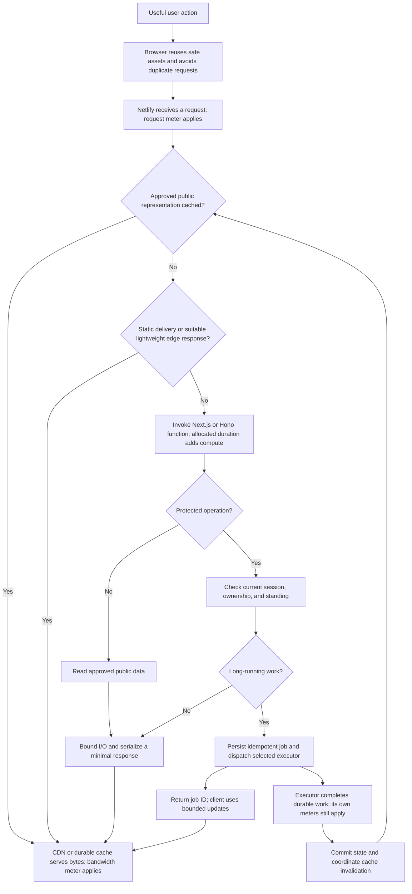

# Netlify Free-Tier Optimization Roadmap

> **Status:** Proposed — research complete; implementation assessment pending
> **Date:** 2026-10-05
> **Owner:** Backend + Web / Taufik Nur Rahmanda
> **Scope:** `Twistloom-backend` (Hono, Node.js functions) and `Twistloom-web` (Next.js), both deployed on Netlify
> **Evidence boundary:** Platform research and existing roadmap context only. No deep source audit, deployment changes, account access, traffic measurements, or implementation verification in this document.

---

## 1. Summary Table

| # | Item | Priority | Status |
|---|------|----------|--------|
| 1 | Confirm plan, ground existing implementation, and measure both sites | P0 | ⬜ Planned |
| 2 | Establish one credit budget and operational guardrails | P0 | ⬜ Planned |
| 3 | Reduce unnecessary production deploys and preview side effects | P0 | ⬜ Planned |
| 4 | Reject abusive or invalid traffic before expensive work | P1 | ⬜ Planned |
| 5 | Reduce image, JavaScript, font, and response bandwidth | P1 | ⬜ Planned |
| 6 | Avoid routing large uploads and downloads through functions | P1 | ⬜ Planned |
| 7 | Verify and extend safe public backend CDN/durable caching | P1 | ⬜ Planned |
| 8 | Coordinate invalidation across backend, Next.js, and browser caches | P1 | ⬜ Planned |
| 9 | Prefer static rendering and deliberate revalidation for public pages | P1 | ⬜ Planned |
| 10 | Reduce polling, speculative prefetch, and duplicate requests | P1 | ⬜ Planned |
| 11 | Remove unnecessary frontend-to-backend proxy and rendering work | P1 | ⬜ Planned |
| 12 | Reduce database/cache round trips and connection overhead | P1 | ⬜ Planned |
| 13 | Bound timeouts, concurrency, and retries on request paths | P1 | ⬜ Planned |
| 14 | Choose economical streaming and long-job execution patterns | P1 | ⬜ Planned |
| 15 | Evaluate scheduled, background, and durable workflow alternatives | P2 | ⬜ Planned |
| 16 | Benchmark selective backend lazy imports and smaller function graphs | P2 | ⬜ Planned |
| 17 | Defer optional frontend components and client libraries | P2 | ⬜ Planned |
| 18 | Consider narrowly scoped Edge Functions where they remove compute | P2 | ⬜ Planned |
| 19 | Keep observability useful and inexpensive | P2 | ⬜ Planned |
| 20 | Validate savings, roll out incrementally, and define capacity limits | P2 | ⬜ Planned |

**Planned means pending assessment, not proven absent.** The later audit may mark an item completed with evidence, narrow it to a gap, or skip it. The order favors broad savings and low implementation risk; measured dominant costs can move a later item forward after Steps 1–2.

---

## 2. Problem Statement

### Current State

- Both projects now use Netlify, as confirmed by the owner. Their correct URLs are `https://twistloom-web.netlify.app` and `https://twistloom-backend.netlify.app`; they remain private. This research does not require publishing either site or bypassing its access gate.
- [`NETLIFY_MIGRATION_ROADMAP.md`](NETLIFY_MIGRATION_ROADMAP.md) documents the backend Node.js adapter and an optimization extension in §11. Its Steps 13–15 report cache directives, public durable caching, and tag purging as done. Those are **documented completion claims to verify later**, not newly discovered omissions.
- [`VERCEL_FLUID_ACTIVE_CPU_OPTIMIZATION_ROADMAP.md`](VERCEL_FLUID_ACTIVE_CPU_OPTIMIZATION_ROADMAP.md) records the previous active-CPU optimization approach. This roadmap replaces its hosting economics for Netlify while retaining useful hypotheses about request amplification, dependency loading, and repeated work.
- The web [`OPEN_FINDINGS_REGISTER.md`](../../../Twistloom-web/docs/roadmap/OPEN_FINDINGS_REGISTER.md) is a separate findings/completion register. This research does not reopen its closed findings or override its evidence gates.
- Actual account plan, team ownership, deployed adapter/runtime versions, traffic distribution, and credit consumption have not been inspected. References to source paths below identify future audit candidates only; exact edit locations will be recorded during that audit.

### Pain Points

1. **A pooled budget can be exhausted without expensive CPU work.** Deploys, bytes served, requests, and function duration compete for the same allowance. Assuming separate full budgets for web and backend would overstate capacity if they belong to one team.
2. **Network waits and streams can dominate function cost.** Reducing parsing or import work may have little impact if an invocation spends most of its time waiting for the database or a provider.
3. **Frontend work contributes independently.** SSR, route handlers, Server Actions, images, client assets, RSC payloads, prefetch, and backend calls all need consideration.
4. **Historical guidance needs qualification.** The migration enhancement targets cannot all fit in 300 credits; its “0 credits” cache-hit diagram is incorrect for request/bandwidth meters; scheduled eligibility was left unverified; the former session-cache recommendation must not relax current authorization guarantees.
5. **Potential inefficiencies are hypotheses.** This document does not establish that either project currently has any particular bottleneck, unsafe cache, duplicate request, or unnecessary eager import.

### Goal

Keep both applications reliable within the actual Free-plan allowance by reducing measured credit consumption per useful user action while preserving security, correctness, freshness, and user experience.

---

## 3. Intended Design & Rationale

### 3.1 Verified platform facts and plan assumptions

Research checked on **2026-10-05**, using the official sources linked here and in §8. The primary model is **credit-based Free**; if the account is Legacy Free, rebuild the budget from that plan before implementing budget-driven changes. A recent migration does not prove the account's pricing model.

| Meter | Credit-based rate | Planning implication |
|-------|-------------------|----------------------|
| Monthly Free allowance | 300 credits | Budget at team level |
| Successful production deploy | 15 credits | Count web and backend releases separately |
| Deploy Preview / branch deployment | 0 deployment credits | Runtime traffic is still metered |
| Compute | 10 credits / GB-hour | Allocated memory × execution duration |
| Bandwidth | 20 credits / GB | Assets and API/download/image responses matter |
| Web requests | 2 credits / 10,000 requests | Cache hits still consume this meter |

Sources: [Netlify pricing](https://www.netlify.com/pricing/), [How credits work](https://docs.netlify.com/manage/accounts-and-billing/billing/billing-for-credit-based-plans/how-credits-work/). Failed deploys and rollback to a previous production deploy do not consume deployment credits; active previews still generate runtime usage.

Usage is aggregated across a team's projects. Exhausting available credits pauses the team's sites. Documented built-in notices include 50%, 75%, and 100%; another billing FAQ also lists 90%, so confirm account behavior rather than depending on that additional notice. Do not assume configurable 70%/90% alerts exist on Free. See [usage monitoring](https://docs.netlify.com/manage/accounts-and-billing/billing/billing-for-credit-based-plans/monitor-usage-for-credit-based-plans/) and [billing FAQ](https://docs.netlify.com/manage/accounts-and-billing/billing/billing-for-credit-based-plans/billing-faq-for-credit-based-plans/).

**Other optional consumers:** Netlify AI Gateway/Agent Runners convert model usage at 180 credits per USD; Agent Runners also use compute. Preview Servers and Netlify Database have compute meters. External AI, Neon, Redis, media, and queue providers retain their own quotas and bills. Do not assume those services use Netlify credits unless routed through a Netlify-metered product. [AI pricing](https://docs.netlify.com/manage/accounts-and-billing/billing/billing-for-credit-based-plans/pricing-for-ai-features/), [credit-based plan details](https://docs.netlify.com/manage/accounts-and-billing/billing/billing-for-credit-based-plans/credit-based-pricing-plans/).

| Runtime property | Verified platform behavior | Free-tier consequence |
|------------------|----------------------------|-----------------------|
| Functions memory | Default 1024 MB; billing uses allocation, not observed heap | Less heap use alone does not lower the memory multiplier |
| Function region | New-site default `cmh` / Ohio; customization requires Pro or Enterprise | Measure dependency distance; do not plan a Free function-region switch |
| Memory/vCPU customization | Credit-based Pro or Enterprise | Do not propose a 256 MB function or paid tuning as a Free saving |
| Synchronous function | 60-second execution limit | Set application deadlines with room for cleanup |
| Scheduled function | 30-second execution limit | Keep work bounded or dispatch it |
| Background function | Up to 15 minutes | Longer eligibility is not free execution |
| Payloads | 6 MB buffered; 20 MB streamed; 256 KB background; binary request effectively ~4.5 MB | Direct transfers are preferable for large files |

Sources: [function configuration](https://docs.netlify.com/build/functions/configuration/), [function billing](https://docs.netlify.com/build/functions/usage-and-billing/). Defaults describe the platform, not verified settings of these deployments.

### 3.2 Use one budget, not independent maxima

For an estimated billing cycle:

```text
estimated credits = 15 × D + 10 × H + 20 × B + 2 × R / 10,000 + 180 × A + O

D = successful production deploys across all sites in the team
H = function GB-hours; sum allocated_GB × billed_seconds / 3,600
B = web bandwidth in GB, using Netlify's reported units
R = web requests, including previews and static/cache-served requests
A = Netlify-metered AI model usage in USD, if enabled
O = other metered usage, including Preview Servers / Database where applicable
```

Keep additional compute/bandwidth consumers in `O` if excluded from `H`/`B`; do not count them twice. This is a planning approximation, not a replacement for the account dashboard or undocumented rounding rules.

**Illustrative team envelope, not a traffic forecast:**

| Allocation | Example usage | Credits |
|------------|---------------|---------|
| Deploys | 8 total, e.g. 4 paired web/backend releases | 120 |
| Web bandwidth | 2 GB | 40 |
| Function compute | 4 GB-hours | 40 |
| Web requests | 50,000 | 10 |
| Optional meters | Disabled / absent for this example | 0 |
| Planned usage | All meters combined | **210** |
| Reserve | Incidents, usage variance, emergency releases | **90** |

Derived comparisons help prioritize work: one paired release costs 30 credits; preventing 1 GB of bandwidth saves 20; eliminating one hour at 1 GB saves 10; preventing 10,000 requests saves 2 **plus their avoided compute/bytes**. At 1 GB allocation, shortening 10,000 invocations by 500 ms saves about 13.89 compute credits. These are calculations from the rates, not measured project savings.

Twenty production deploys or 15 GB bandwidth each consume the entire 300-credit pool alone. The migration §11.5 examples of 225 deploy credits, ~210 compute credits, and 200 bandwidth credits total ~635 before requests; use a joint envelope instead.

### 3.3 Design alternatives

**Alternative A — Optimize the existing two-site topology first.** Keep Next.js and Hono separate; improve deployment cadence, delivery, cache policy, request volume, and duration. Lowest disruption; separate deploy costs and cross-site boundaries remain.

**Alternative B — Consolidate deployments or substantially rewrite for Edge/static hosting.** May remove a deployment or some compute, but introduces routing, credentials, runtime compatibility, cache invalidation, release coupling, and rollback work. A larger shared bundle or broader redeploys can erase savings.

**Alternative C — Upgrade before optimizing.** Buys capacity and some tuning controls, but adds recurring cost and does not address waste. Useful when required traffic exceeds a realistic Free budget or reliability requirements cannot tolerate a hard cap.

**Recommendation: Alternative A.** Treat consolidation, paid tuning, and broad runtime changes as later decisions supported by measured savings. Netlify's credit model rewards fewer served bytes, fewer unnecessary releases/requests, and fewer allocated execution seconds; optimize those first.

### 3.4 What transfers from the Fluid roadmap

| Previous idea | Netlify interpretation |
|---------------|-------------------------|
| Avoid repeated CPU/import work | Useful if it meaningfully reduces initialization or invocation duration |
| Awaiting external I/O was relatively cheap in the previous model | Count waiting time inside a running Netlify function; reduce round trips and long holds |
| Coalesce status polling | Reduce real network calls first; instance-local coalescing is incomplete across cold instances |
| Cache public reads | CDN/durable hits avoid origin invocation; request and bandwidth meters remain |
| Cache JWT verification | Consider immutable verification work only; do not cache positive session/ban authorization across requests |
| Move work after responding | `waitUntil()` improves response latency but includes async duration in billing |
| Stream for faster first output | Can improve UX while increasing held duration; compare with finite requests/jobs |

The async billing point is explicitly documented in the [Functions API](https://docs.netlify.com/build/functions/api/). The comparison describes the historical roadmap, not a claim about current Vercel pricing.

### 3.5 Do inline lazy imports help?

**Yes, selectively. They are a conditional duration/bandwidth optimization, not a Netlify pricing feature.**

For **Hono/Node.js**, importing a heavy, rarely needed dependency inside its handler can postpone initialization until that route runs. Candidate classes include export/rendering libraries, optional AI-provider SDKs, and administrative tools. Static imports remain appropriate for lightweight or almost-always-used dependencies. AWS explains both selective initialization and reusable execution environments in its [Lambda optimization guide](https://aws.amazon.com/blogs/compute/operating-lambda-performance-optimization-part-2/) and [best practices](https://docs.aws.amazon.com/lambda/latest/dg/best-practices.html); these are engineering guidance, not Netlify billing guarantees.

Crucial qualifications:

1. **Deferred execution is not necessarily a smaller deployment.** With esbuild code splitting disabled, dynamic imports remain in the same bundle with asynchronous semantics. Inspect Netlify's actual artifacts before claiming bundle separation or smaller ZIPs. [esbuild splitting](https://esbuild.github.io/api/#splitting).
2. **The first use pays the loading cost.** Benchmark cold/common routes, cold/heavy routes, warm routes, and simultaneous first use. An improvement on rarely used paths can become a regression if the dependency is used on nearly every request.
3. **Import graphs matter.** An eager barrel export, route registry, or other static importer can already initialize the same dependency. Inline syntax alone proves nothing.
4. **Reuse does not create durable state.** Reuse safe clients within an instance where compatible, but expect a new instance at any time. Module loading and client construction are different costs; repeating the latter per request can dominate.
5. **Do not claim lower memory billing from a smaller heap.** Free functions retain their configured allocation. Also do not assume Netlify's exact cold-init metering from direct AWS Lambda pricing; attribute savings using Netlify measurements.
6. **Use literal trusted import paths.** Preserve required fonts/templates/native files in packaging, keep credentials server-side, and avoid user-selected arbitrary imports. A cached failed initialization needs an intentional recovery policy; module-evaluation failures may require a fresh deployment/instance.

For **Next.js browser code**, defer optional Client Components with `next/dynamic` and load large libraries when a feature is actually opened. This can reduce initial bytes and browser work. A component rendered immediately may still load immediately; extra chunks add requests. Dynamic import of a Server Component does not lazily load that Server Component itself, and the current guide warns that Server-to-Client dynamic imports do not automatically split as expected. `ssr: false` belongs in Client Components and should be reserved for suitable browser-only UI. [Next.js lazy loading](https://nextjs.org/docs/app/guides/lazy-loading).

**Recommendation:** First remove unused dependencies and unnecessary eager initialization; then trial a few optional imports. Compare **credits per representative workload and user latency**, not import count. Backend imports are Step 16; browser imports are Step 17 because they affect different costs.

### 3.6 Non-breaking guarantees

| Area | Required invariant | Optimization boundary |
|------|--------------------|-----------------------|
| Authentication | Cookie-session requests retain fresh backend session existence, ownership, and standing checks; other auth modes retain their authoritative checks | No cross-request positive authorization cache; frontend gating is not the authority |
| Privacy | User-scoped, draft, private, purchased, or administrative data stays isolated | No blanket public cache policy or public signed download URL |
| Payments/jobs | Idempotent durable state, transaction integrity, recoverable completion | No fire-and-forget financial mutation or duplicate charging on retry |
| Public content | Explicit freshness and withdrawal requirements | Cache only approved public representations; strict withdrawal can require bypassing caches |
| Locale/variants | The correct language and semantic query variant | Do not omit response-affecting inputs from keys |
| API contracts | Compatible status codes, bodies, CORS, callbacks, and auth behavior | A topology change must prove parity before rollout |
| Accessibility/SEO | Usable loading, errors, navigation, and public content | Keep critical UI and content available; measure deferred-feature latency |
| Deployment | Private-site posture and recoverable release order | No public launch needed for this roadmap or local audit |

---

## 4. Feasibility Analysis

| Dimension | Assessment |
|-----------|------------|
| Effort | Low for budget/release policies; medium for measured delivery, request, and import changes; high for workflow or topology changes. Estimates follow the later audit. |
| Risk | Low for eliminating unused bytes/builds; medium for timeouts and lazy initialization; high for shared caching, auth, invalidation, and asynchronous money/job flows. |
| Backend changes | Conditional: cache verification, shorter I/O paths, bounded work, packaging, and optional edge/job handlers. |
| Frontend changes | Conditional: public rendering/revalidation, request policy, media delivery, and deferred UI. |
| Dependencies | Confirm pricing/team, establish baseline, inspect existing implementation, obtain owner-access evidence for deployed checks. |
| Free-compatible work | Delivery, requests, safe caching, code-based rate limits, duration reduction, eligible scheduled/background functions, and selective Edge Functions. |
| Plan-gated work | Function memory/vCPU and region customization; long-retention/log-drain features require separate eligibility checks. |
| Reversibility | Most changes can be reverted individually. Data relocation, topology, and workflow migrations need explicit rollback and reconciliation plans. |
| Expected benefit | Unknown until measured. Rank by projected monthly credits saved, user impact, engineering effort, and correctness risk. |

---

## 5. Flow Diagram (Mermaid)



The diagram illustrates the recommended boundaries; it does not assert that this exact flow is implemented. Scheduled work and deployment credits are additional budget consumers outside the visitor request path.

---

## 6. Implementation Plan

**Execution rule:** Ground each step before changing code. Record `implemented and verified`, `partial`, `not implemented`, or `not applicable`, with current source/deployment evidence. Only implement the remaining gap. Exact files/lines and numeric targets are intentionally deferred to that audit, as requested.

### Step 1: Confirm plan, ground existing implementation, and measure both sites — ⬜ Planned

**Files:** This roadmap; `docs/roadmap/NETLIFY_MIGRATION_ROADMAP.md`; `netlify.toml`; `netlify/functions/api.mts`; web `netlify.toml`, `next.config.ts`; generated deploy artifacts. Source details are future audit candidates.
**Effort:** Low–medium. **Savings driver:** Accurate prioritization and avoiding duplicate work.

1. Confirm Credit-based versus Legacy Free, team membership of both projects, billing-cycle dates, other projects sharing the pool, actual deployed Node/Next.js/adapter configuration, and which mechanism makes each site private.
2. Build an implementation/evidence matrix for all 20 steps, including the migration's already-completed cache work and previously closed web findings.
3. Capture representative private-site activity: anonymous public reading where authorized, sign-in, browsing, reading, mutations, job progress, and an export. Separate cold/warm requests, preview/production, humans/bots, cache hits/misses, and idle scheduled work.
4. Record deployed request counts, served bytes, function duration and invocation count, dependency timing, rendering mode, and deploy count. Use existing instrumentation first; never log credentials or private payloads.
5. Establish credits per useful action and projected credits per cycle. A small known workload can be used while real traffic is sparse; label synthetic estimates and avoid load tests that consume the allowance.

**Non-breaking:** Read-only/local assessment; private hosting remains private.
**Exit evidence:** Account/baseline snapshot, source map, documented unverified live checks, and a ranked list of real gaps. Access-gated checks remain pending and do not block independent local work.

---

### Step 2: Establish one credit budget and operational guardrails — ⬜ Planned

**Files:** This roadmap; candidate deployment/runbook documentation; Netlify team settings outside Git.
**Effort:** Low. **Savings driver:** Avoiding pool exhaustion and accidental optional usage.

1. Replace separate maxima with the §3.2 envelope, using measured usage and a reserve. Start with a proposed 70% planned allocation; change the ratio only with evidence.
2. Verify built-in notices reach the owner. Review usage frequently during implementation, then at a cadence justified by consumption. Forecast using remaining days in the actual billing cycle and known upcoming deploys, rather than assuming 30 days.
3. Inventory Netlify AI Gateway, Agent Runners, Preview Servers, Database, and experimental features. Disable unused consumers where appropriate; do not migrate functioning external services merely because a Netlify equivalent exists.
4. Define staged responses to rising usage: stop optional rebuilds/test loops; reduce speculative fetching and nonessential jobs; investigate abuse; protect critical flows; then consciously choose reduced scope or a paid plan if needed. Never interrupt required transaction settlement/reconciliation casually.
5. Keep external-provider budgets separate and visible. Offloading Netlify compute can transfer cost or quota pressure elsewhere.

**Non-breaking:** No silent downgrade of authentication, settlement, or user promises.
**Exit evidence:** One owner-approved operating envelope, notice verification, optional-meter inventory, and a documented exhaustion response. This document itself does not alter account settings.

---

### Step 3: Reduce unnecessary production deploys and preview side effects — ⬜ Planned

**Files:** Backend/web `netlify.toml`; candidate build-ignore helper; release workflow files identified during audit.
**Effort:** Low–medium. **Savings driver:** Deployment credits and post-deploy cache refill.

1. Batch compatible fixes into deliberate production releases. Count a paired release as two successful deploys; release only the app that changed when contracts allow it.
2. Use previews for repeated validation. Preview deployment is free of the deploy meter, but browsing, SSR, APIs, scheduled manual runs, and test traffic are not assumed free.
3. Ignore genuinely irrelevant changes, such as documentation-only edits, after inspecting each repository's build inputs. Include configuration, dependencies, shared/generated assets, and lockfiles in relevant changes. These are separate projects; do not assume a monorepo path filter fits them.
4. Follow Netlify ignore semantics: exit `0` skips; exit `1` builds. Build-hook-triggered builds bypass this ignore mechanism. Use a dependency-free helper compatible with the ignore-command environment, with missing Git history conservatively causing a build. [Ignore builds](https://docs.netlify.com/build/configure-builds/ignore-builds/).
5. Scope preview secrets and backend targets; suppress emails, paid generation, production writes, and duplicate callback side effects unless intentionally enabled in a sandbox. Disable idle preview features where safe.
6. Use documented rollback rather than rebuilding merely to restore the previous known-good release. Preserve API compatibility during sequential web/backend deployment.

**Non-breaking:** Security fixes and necessary emergency releases remain possible; no required build is skipped.
**Exit evidence:** Build/no-build cases verified, paired-release accounting, preview side-effect review, and a rollback rehearsal. Optimize build time for iteration, but do not claim saved build minutes reduce this plan's deployment meter.

---

### Step 4: Reject abusive or invalid traffic before expensive work — ⬜ Planned

**Files:** Backend `netlify/functions/api.mts`, `netlify.toml`, middleware candidates; web `netlify.toml`, `src/proxy.ts` and generated adapter configuration, subject to support checks.
**Effort:** Low–medium. **Savings driver:** Avoided origin duration, responses, and provider usage.

1. Evaluate Netlify code-based rate limits before origin invocation on the most expensive eligible paths. Free supports **two rules per project**, path targeting, and per-domain/IP aggregation. Preserve application-level per-user quotas; IP limits alone are unsuitable for shared networks or payment/job correctness. [Rate limiting](https://docs.netlify.com/manage/security/secure-access-to-sites/rate-limiting/).
2. Validate body limits, method, schema, and required credentials before loading heavy features or calling providers. Use existing secure middleware ordering rather than bypassing authorization.
3. Restrict middleware/proxy matchers to necessary paths so assets do not cause extra work. Review catch-all function routing and supported static-file precedence so CDN assets are not unnecessarily handled by a function. Verify locale routing, callbacks, and protected paths still behave correctly; do not edit generated adapter functions directly.
4. Prefer small static failure responses where suitable. Keep legitimate crawler discovery, accessibility, shared-IP users, webhook signatures, and trusted callbacks working. `robots.txt` guides cooperative crawlers; it is not abuse enforcement.
5. Measure observed cost of blocked traffic; do not promise that rate-limited, password-gated, or rejected requests incur zero credits. Avoid adding an Edge Function solely to inspect every request if platform rules suffice.

**Non-breaking:** Correct authorization and provider callbacks remain intact.
**Exit evidence:** Safe-path and abusive-path tests, callback verification, rule availability/configuration evidence, and lower expensive-origin invocation volume.

---

### Step 5: Reduce image, JavaScript, font, and response bandwidth — ⬜ Planned

**Files:** Web `next.config.ts`, `src/lib/config/image.ts`, `src/lib/utils/image-url.ts`, asset/component families; backend response serializers identified later.
**Effort:** Medium. **Savings driver:** Bandwidth, browser requests, and serialization work.

1. Rank response types and routes by bytes served, including covers, avatars, reader illustrations, social previews, JS, CSS, fonts, HTML/RSC, and JSON. Optimize the largest actual contributors first.
2. Verify the deployed Next.js image path: Netlify's current adapter uses Image CDN for `next/image`; it also provisions functions for dynamic Next.js work. Avoid adding a Node image proxy when the adapter/CDN already handles it. [Next.js on Netlify](https://docs.netlify.com/build/frameworks/framework-setup-guides/nextjs/overview/).
3. Use correct responsive `sizes`, bounded widths/quality variants, supported efficient formats, and lazy loading below the fold. Do not preload every cover or compromise the main visible image. Whitelist remote sources and maintain private-image access boundaries. [Image CDN](https://docs.netlify.com/build/image-cdn/overview/).
4. Serve only necessary font families, scripts, styles, and third-party widgets. Use immutable browser caching for truly content-hashed assets; changing assets must get new URLs. Browser reuse can avoid a request, whereas a CDN hit still serves bytes. [Advanced caching guide](https://developers.netlify.com/guides/advanced-caching-made-easy/).
5. Verify actual compression on deployed text responses before implementing compression inside a function. Return paginated, field-selected JSON and avoid repeated large content/RSC payloads. Preserve required fields and response contracts.
6. Check metadata/social-image endpoints for expensive regeneration and needless requests; use static or intentionally revalidated assets when content/freshness permits.

**Non-breaking:** Readability, image quality, layout stability, accessibility, and social preview correctness are acceptance criteria.
**Exit evidence:** Representative transferred-byte comparison with visual checks and no increase in error rate or poor loading behavior. Image CDN delivery still belongs in the bandwidth/request budget.

---

### Step 6: Avoid routing large uploads and downloads through functions — ⬜ Planned

**Files:** Candidate backend upload/export/download services and routes; web upload/download clients; media-provider configuration.
**Effort:** Medium; high if storage changes are required. **Savings driver:** Avoided function transfer/holds and Netlify egress where delivery moves to another provider.

1. Prefer authenticated, short-lived direct upload authorization and direct storage/CDN downloads where existing providers support them. The function performs authorization and returns a scoped capability; it does not relay the entire file.
2. Validate object ownership, key scope, size, type, checksum where applicable, expiration, and download entitlement. Use private storage for private assets. A signed URL is a bearer capability, so keep it short-lived and out of shared caches/logs.
3. For reusable exports, store an artifact keyed by content/version and export options instead of regenerating it on every download; re-check entitlement before access. Clean up expired artifacts.
4. Compare storage/CDN egress, requests, retention, and free quotas. Moving files into Netlify Blobs does not automatically avoid Netlify delivery meters, nor does adding another free-tier dependency guarantee total savings.
5. Verify CORS, resumability where required, filenames, failure handling, and large-file limits. Reuse existing integrations before introducing another provider.

**Non-breaking:** Entitlement enforcement and private-media isolation remain authoritative.
**Exit evidence:** Successful authorized transfer, rejected unauthorized/expired capability, correct provider accounting, and no large payload passing unnecessarily through the function.

---

### Step 7: Verify and extend safe public backend CDN/durable caching — ⬜ Planned

**Files:** Backend `src/utils/netlify-cache.ts`, `src/middleware/cache.ts`, public route candidates, `netlify.toml`; existing related tests.
**Effort:** Medium. **Savings driver:** Avoided origin invocations and dependency calls.

1. Audit migration Steps 13–14 first. Approve a narrow list of truly public GET representations; distinguish anonymous data from optional-user fields, paid access, moderation states, private books, drafts, and cookie-dependent responses.
2. Set a per-representation freshness budget. Prefer a short initial TTL and only add stale-while-revalidate when stale output is acceptable. Do not cache errors or unauthorized output under an anonymous key.
3. Validate header precedence: Netlify-specific cache headers outrank generic ones. For protected responses, prohibit conflicting shared-cache opt-ins and ensure the effective policy is private/no-store as appropriate. Do not assume a generic `private` header defeats every higher-precedence header. [CDN caching guidance](https://www.netlify.com/knowledge-base/how-to-control-cdn-caching-on-netlify/).
4. Verify locale and every response-affecting query/header variant. Remove only proven nonsemantic tracking parameters from cache-key variation, with consistent `Netlify-Vary` behavior. Do not collapse semantic filters, pagination, locale, or permission variants for hit rate. [Cache-key guidance](https://www.netlify.com/knowledge-base/how-to-control-cdn-caching-on-netlify/).
5. Verify `durable` for eligible serverless public responses and inspect deployed `Cache-Status`; local development cannot establish real CDN behavior. Durable cache is not supported for Edge Function responses. [Caching overview](https://docs.netlify.com/build/caching/caching-overview/).
6. Treat cache hits as saved origin compute, never zero total credits. Background revalidation still performs origin work. Tiny TTLs or low-traffic/high-cardinality routes may produce limited savings.

**Private-site evidence caveat:** Netlify documents that its `basic-auth` protection on any page disables CDN caching for the whole site. Determine whether that specific mechanism applies; do not infer it from an arbitrary login gate. Keep protection in place. If it prevents a representative cache check, mark that deployed evidence pending and continue local/header-policy checks. [Private-site caching caveat](https://www.netlify.com/knowledge-base/how-to-control-cdn-caching-on-netlify/).

**Non-breaking:** Public caching never authorizes a protected operation or exposes a private representation.
**Exit evidence:** Hit/miss and origin-count tests; A/B user and anonymous isolation; locale/query variants; no shared private/error caching; measured savings for approved routes.

---

### Step 8: Coordinate invalidation across backend, Next.js, and browser caches — ⬜ Planned

**Files:** Backend `src/utils/netlify-cache.ts`, `src/services/cache.ts`, mutation services; web revalidation/query invalidation candidates.
**Effort:** Medium–high. **Savings driver:** Safely extending reuse without needless broad purges.

1. Verify migration Step 15, then map each public mutation to backend tags, Next.js data/route caches, and browser query keys. A backend CDN purge does not establish that a separate web site's rendered/data cache was invalidated.
2. Trigger invalidation after durable commit; use idempotent, bounded dispatch/retry. Retain finite TTLs as fallback. A post-response task may be suitable for latency but is neither guaranteed free nor a substitute for a recoverable delivery record when required.
3. Prefer scoped tags over site-wide purges. Batch repeat invalidations; Netlify limits each tag/site purge to twice per five seconds. Monitor failures/429s rather than silently assuming freshness. [Caching invalidation limits](https://docs.netlify.com/build/caching/caching-overview/#on-demand-invalidation).
4. Distinguish tolerated catalogue staleness from strict withdrawal/private-content changes. If purge propagation/failure cannot meet privacy requirements, that representation is ineligible for public caching.
5. Review whether atomic deploy invalidation is adequate. Do not adopt cross-deploy `Netlify-Cache-ID` persistence unless representation/schema compatibility and explicit invalidation are proved.
6. Avoid expensive synchronous revalidation fan-out after every write; evaluate coalescing and bounded regeneration. Protect revalidation endpoints, prevent replay abuse, and keep tokens out of client bundles.

**Non-breaking:** Database transactions stay authoritative; auth/permission changes are enforced immediately by the protected API.
**Exit evidence:** Update/delete/visibility-change behavior across both sites, failed purge recovery, freshness bounds, targeted invalidation, and no stale protected data disclosure.

---

### Step 9: Prefer static rendering and deliberate revalidation for public pages — ⬜ Planned

**Files:** Web `src/app/` route/layout/metadata candidates, `next.config.ts`, data-loading and revalidation helpers.
**Effort:** Medium. **Savings driver:** Avoided SSR and repeated backend rendering reads.

1. Classify routes as static, public revalidated, personalized dynamic, or unsuitable for shared reuse. Include metadata and social-image handlers, not just visible pages.
2. For public pages, compare static rendering/ISR with per-visitor SSR. Keep personalization in an appropriate separate boundary if the audited Next.js version and adapter support it; preserve public SEO and current-user behavior.
3. Inspect dynamic triggers in shared layouts and metadata. Cookie/request-dependent reads and broad force-dynamic settings may expand runtime work. Use APIs supported by the installed version; do not blindly mix older cache defaults, Cache Components, or experimental PPR assumptions. [Next.js production guide](https://nextjs.org/docs/app/guides/production-checklist), [cookies API](https://nextjs.org/docs/app/api-reference/functions/cookies).
4. Let the Netlify adapter manage its generated cache infrastructure. Verify deployed output rather than manually patching generated functions or assuming custom response headers override Next.js caching.
5. Set revalidation by business freshness and traffic. Avoid full production rebuilds on every content edit; prefer authenticated on-demand revalidation where appropriate. Prebuild a useful bounded set of popular routes rather than every possible locale/content combination.
6. Reuse approved public data even inside a personalized route where version-appropriate Next.js data caching safely supports it. Netlify's Cache API can also cache selected internal responses/fetches, but assess overlap with the adapter first; avoid redundant cache layers and never share a user's authorization or private fetch result. [Cache API](https://docs.netlify.com/build/caching/cache-api/).

**Non-breaking:** Personalized and protected pages stay isolated; public content remains discoverable and correctly localized.
**Exit evidence:** Render-mode/artifact inventory, deployed cache behavior, mutation freshness tests, and fewer SSR/backend invocations per public visit.

---

### Step 10: Reduce polling, speculative prefetch, and duplicate requests — ⬜ Planned

**Files:** Web `src/lib/config/polling.ts`, `src/lib/query-client.ts`, hook/query-key/link candidates; backend status/coalescing candidates.
**Effort:** Medium. **Savings driver:** Requests, compute, and repeated bytes/provider reads.

1. Measure real production navigation and job progress. Separate expected development-only activity from production amplification; include RSC fetches, retries, focus/reconnect refetches, metadata, and repeated session/profile loads.
2. Use one active observer/transport for the same job where feasible. Back off with jitter during long waits; stop polling after completion/error/logout, when hidden/offline where appropriate, and after an explicit limit. Resume safely and expose stale/status feedback.
3. Deduplicate identical read work with correctly scoped keys, cancel obsolete requests, and set freshness by data semantics. Do not coalesce mutations, reuse a different user's response, or hide status transitions with long stale windows.
4. Limit speculative prefetch for large link lists and costly destinations; consider intent-based prefetch on selected links. Next.js supports disabling automatic prefetch, but navigation latency is the tradeoff. [Prefetching guide](https://nextjs.org/docs/app/guides/prefetching).
5. Prefer a compact status response to rereading an entire book/job. Investigate conditional requests only if they avoid bytes or work: a `304` still involves a request and may invoke a function.
6. Treat instance-local coalescing as an optimization, not a distributed guarantee. Consider durable/shared coalescing only when its extra cache calls, latency, and quotas yield a net benefit.

**Non-breaking:** Fresh authorization remains at the backend; real completion/revocation/error states stay visible.
**Exit evidence:** Network traces and requests per interaction before/after, hidden/resume/reconnect tests, bounded terminal polling, and no cross-user reuse.

---

### Step 11: Remove unnecessary frontend-to-backend proxy and rendering work — ⬜ Planned

**Files:** Web `src/lib/services/api.ts`, Server Component/API/Server Action candidates, `src/proxy.ts`, `netlify.toml`; backend CORS/auth/routing candidates.
**Effort:** Medium. **Savings driver:** Avoided extra function duration, requests, and transfer hops.

1. Trace browser → Next.js → Hono calls. Count which layers actually execute functions and which are CDN rewrites. Do not assume every rewrite incurs frontend compute or assert an exact double charge without measurements.
2. In server-side rendering, call the required backend service directly rather than calling the same frontend's route handler over HTTP merely to reach Hono, where contracts/security allow it.
3. Compare direct browser backend calls, CDN-level proxying, and Next.js route-handler proxying. Keep a proxy where it is needed for credentials, origin policy, response transformation, or a stable public contract.
4. Reuse identical reads within one render/request using version-appropriate memoization. Avoid serial duplicate data loading in layout, page, and metadata. Do not introduce shared caching of a user's session or permissions.
5. Keep transformations minimal and preserve streaming/error/cancellation behavior. Test cookies, SameSite, CORS, preflight behavior, CSRF/origin controls, and callback URLs before changing the transport path.

**Non-breaking:** Existing auth, API contracts, and origin protections are part of the decision.
**Exit evidence:** End-to-end trace and metering comparison with sign-in/mutation/SSR coverage; remove a hop only when there is a demonstrated benefit.

---

### Step 12: Reduce database/cache round trips and connection overhead — ⬜ Planned

**Files:** Backend database, query/service, cache-client, and instrumentation candidates; frontend server data loaders where relevant.
**Effort:** Medium. **Savings driver:** Less wall-clock waiting and repeated external work.

1. Attribute duration to actual database/cache/provider calls. Separate connection setup, Neon wake-up, query execution, Redis/network round trips, and response serialization.
2. Reduce N+1 reads, select necessary fields, paginate, and inspect measured slow query plans before adding indexes. Combine reads when transaction/snapshot/auth semantics permit it.
3. Verify compatible client/connection reuse and bounded pool behavior for Node.js serverless. Choose Neon HTTP/WebSocket/pooling based on actual query/transaction needs rather than assuming one mode is universally faster. Pooling does not remove geographic latency. [Neon driver](https://neon.com/blog/serverless-driver-ga), [Neon latency guidance](https://neon.com/blog/how-to-minimise-the-impact-of-database-latency).
4. Measure distance from the actual function region to Neon and Redis. Because Free cannot move the function region, reducing round trips is the first lever. Data-region relocation requires separate capacity, residency, migration, and recovery review; do not move production data speculatively.
5. Cache expensive approved data/aggregates only with an explicit freshness policy. Measure whether cache lookup overhead outweighs the saved query for inexpensive reads. Keep immediate session/standing enforcement and transactional balances intact.
6. Avoid periodic warm-up traffic just to keep functions or Neon awake; it consumes requests, duration, and possibly database quotas without proving net savings.

**Non-breaking:** Financial transactions and authorization consistency remain required.
**Exit evidence:** Dependency timings and query counts, measured plans for actual slow queries, cold/warm comparison, pool/timeout safety, and unchanged correctness tests.

---

### Step 13: Bound timeouts, concurrency, and retries on request paths — ⬜ Planned

**Files:** Backend/web outbound-request wrappers, service orchestration, job/provider clients, and function-entrypoint candidates.
**Effort:** Medium. **Savings driver:** Fewer wasted allocated seconds and retry storms.

1. Establish an end-to-end application deadline below the platform ceiling, then budget dependency attempts, cancellation, cleanup, and serialization within it. Use supported abort/timeout mechanisms and verify adapters propagate cancellation.
2. Parallelize independent reads with bounded concurrency when this reduces elapsed time. Preserve dependencies and transaction order; unbounded parallelism can overwhelm providers and multiply retries.
3. Separate retryable transient failures from invalid requests, authorization failures, and permanent provider errors. Cap attempts, honor `Retry-After`, add jitter, and prevent frontend + backend + SDK retry multiplication.
4. Prefer queue-based delayed retry for durable long jobs instead of sleeping inside request functions. Abort unused work on client disconnect only when stopping it is safe; required settlement/reconciliation must be independently durable.
5. Keep small optional side effects from extending the main path needlessly. `waitUntil()` can help response latency for bounded work, but the [Functions API](https://docs.netlify.com/build/functions/api/#waituntil) explicitly includes that work in duration billing.

**Non-breaking:** Do not return success before required state is durable, or abandon critical operations on timeout.
**Exit evidence:** Fault injection for slow/failed dependencies, bounded attempts/duration, correct partial-failure behavior, and lower billed time without extra failure rates.

---

### Step 14: Choose economical streaming and long-job execution patterns — ⬜ Planned

**Files:** Backend streaming/AI/export/job routes and workers; web progress transport/polling clients.
**Effort:** Medium–high. **Savings driver:** Avoided long holds and repeated generation.

1. Measure stream lifetime, first useful output, reconnects, final completion, and idle waiting. Streaming is a UX choice; all held function duration belongs in the compute estimate. A ten-second reduction over 1,000 streams at 1 GB saves about 27.78 compute credits. Heartbeats do not reset the function's hard execution limit; bound reconnects and provide recoverable status rather than an endless reconnect loop.
2. Compare finite streaming, adaptive status polling, and durable job + completion event/webhook. Polling is not automatically cheaper: include status invocation duration, request bytes, number of viewers, and backend/provider reads.
3. Keep short interactive streams where their value warrants the cost. For operations that can exceed the synchronous ceiling, persist an idempotent job, dispatch an appropriate executor, return a job ID, and allow safe reconnect/resume.
4. Consider a provider's asynchronous submission/completion webhook where available, so a Netlify function does not wait for an entire generation. Validate signatures, replay protection, current job ownership, failure/cancel handling, and final-state reconciliation.
5. Compare the existing documented QStash/GitHub Actions approach with eligible Netlify execution options. Moving work between Netlify functions does not itself reduce total Netlify duration. External execution transfers resource usage and introduces its own limits.
6. Preserve reservation/charge idempotency, durable completion, cancellation rules, artifact storage, and reliable cleanup. Do not run required long work as an untracked post-response promise.

**Non-breaking:** Users can recover job state without regenerating or paying twice; authorization remains current.
**Exit evidence:** Workload-level credit/latency comparison and crash/retry/reconnect/deadline tests; explicitly document the executor and all its quotas.

---

### Step 15: Evaluate scheduled, background, and durable workflow alternatives — ⬜ Planned

**Files:** Candidate `netlify/functions/` jobs, `netlify.toml`, cron/queue services, scheduler runbooks; existing external workflow configuration.
**Effort:** Medium–high; optional. **Savings driver:** Less redundant work or waiting, if demonstrated.

1. Correct eligibility assumptions: Scheduled Functions are available on all plans and use UTC schedules, running automatically only for published deploys. Their execution cap is 30 seconds. [Scheduled Functions](https://docs.netlify.com/build/functions/scheduled-functions/).
2. Background Functions are available on credit-based Free and can run up to 15 minutes. Returning `202` does not remove the background compute bill; automatic retry requires idempotency. Legacy plan eligibility differs. [Background Functions](https://docs.netlify.com/build/functions/background-functions/).
3. Inventory all current schedules and providers; avoid running equivalent QStash and Netlify jobs simultaneously. Tune cadence, batch size, checkpoints, and overlap protection according to actual backlog and correctness needs. An empty frequent sweep still costs runtime.
4. Keep existing scheduling if reliable and cheaper overall. Native schedules may simplify administration but are not a savings mandate, and a platform-wide credit pause can also affect hosted maintenance.
5. Netlify Async Workloads offers durable steps and sleeps as a further option. Its workload functions are still Netlify functions; extra routing, reinvocations, persisted state, scheduler polling, and retries need a full usage model before adoption. Do not equate a durable sleep API with an ordinary `await sleep()` or assume the workflow is free. [Async Workloads overview](https://docs.netlify.com/build/async-workloads/overview/), [multi-step behavior](https://docs.netlify.com/build/async-workloads/multi-step-workloads/), [optional configuration](https://docs.netlify.com/build/async-workloads/optional-configuration/).
6. Use short dispatch-only scheduled handlers for longer work where appropriate; compare this extra invocation with the retained external scheduler. Confirm extension eligibility and all additional meters before choosing Async Workloads.

**Non-breaking:** Exactly one intended schedule owns each job; durable retries and settlement sweeps remain reliable.
**Exit evidence:** Scheduler inventory, cost/reliability decision, production/preview behavior, overlap/retry tests, and a reconciliation/rollback runbook. Mark the adoption portion skipped if the existing approach wins.

---

### Step 16: Benchmark selective backend lazy imports and smaller function graphs — ⬜ Planned

**Files:** Backend `src/app.ts`, `netlify/functions/api.mts`, `netlify.toml`, heavy route/service candidates, `package.json`; built function artifacts.
**Effort:** Medium. **Savings driver:** Conditional initialization/invocation duration reduction.

1. Inspect the deployed import graph and artifact sizes before changing imports. Identify heavy modules, eager client construction, barrel imports, unused code, templates/fonts, and native dependencies.
2. Remove genuinely unused dependencies and unnecessary startup side effects first. Prefer supported granular package entrypoints; do not bypass package exports with brittle deep paths.
3. Trial inline imports for rarely exercised, optional features. Keep common lightweight/auth dependencies simple; keep current session/standing checks on every protected request.
4. Verify whether the actual Netlify bundler splits files or only defers initialization. Externalization can add filesystem/module resolution work and packaging hazards; it is not automatically an improvement. Netlify exposes packaging controls, while esbuild documents dynamic-import semantics. [Function bundling](https://docs.netlify.com/build/functions/configuration/#bundle), [esbuild](https://esbuild.github.io/api/#splitting), [AWS dependency guidance](https://aws.amazon.com/blogs/compute/optimizing-node-js-dependencies-in-aws-lambda/).
5. Consider a separate function for a heavy, infrequent workload only when isolation beats a single Hono graph. Preserve route/auth/CORS parity and account for separate cold instances, duplicated common dependencies, and added operational complexity. Do not split every route.
6. Benchmark a realistic route mix, common-route cold start, heavy-route first invocation, warm requests, and concurrent first use on production-compatible Node.js. Validate missing-file/import failure behavior and deployment rollback.

Illustrative intent only; audit the actual graph before applying:

```ts
// Only inside an authorized optional operation, after cheap validation.
const { renderExport } = await import('../services/export-renderer.js');
return renderExport(validatedInput);
```

Repeated module loading in an instance does not imply repeated evaluation, but client construction still needs separate review. Never cache request context or a positive authorization result in a reusable initializer.

**Non-breaking:** Heavy operations still work on a fresh instance; packaging and errors stay correct.
**Exit evidence:** Artifact/import analysis plus before/after duration and Netlify compute evidence. Retain the change only when overall savings or worthwhile latency improvement outweigh first-use and maintenance costs.

---

### Step 17: Defer optional frontend components and client libraries — ⬜ Planned

**Files:** Web optional feature components, dependency imports, `next.config.ts`, `package.json`; generated route chunks.
**Effort:** Low–medium. **Savings driver:** Initial bandwidth and browser work.

1. Use route/chunk analysis to identify libraries downloaded by users who never use their features, such as rich editors, export tools, diagrams, or optional management panels. These are candidate classes, not verified current dependencies.
2. Put deferred Client Components behind real conditional rendering/interaction, with `next/dynamic` and accessible loading/error states. Load large plain libraries on demand where appropriate. [Lazy loading](https://nextjs.org/docs/app/guides/lazy-loading).
3. Keep above-the-fold content and core reader controls responsive. Avoid broad `ssr: false`; reserve it for appropriate browser-only features and test deep links and hydration.
4. Preserve server-only boundaries so secrets and heavy backend SDKs never enter browser chunks. Compare supported package-import optimization with lazy loading; do not pile on custom bundler settings without artifact evidence.
5. Account for extra chunk requests, preloads/prefetch, repeat navigation, and browser cache reuse. Measure feature-open latency as well as initial bytes. An immediate dynamic component is not necessarily deferred bandwidth.

**Non-breaking:** Required content, accessibility, SEO, and feature error recovery remain usable.
**Exit evidence:** Smaller initial transferred bytes for representative visits, correct deferred-feature loading, no hydration failures, and acceptable interaction latency.

---

### Step 18: Consider narrowly scoped Edge Functions where they remove compute — ⬜ Planned

**Files:** Candidate edge handler(s), backend/web `netlify.toml`, `src/proxy.ts`, routing/header declarations; generated adapter artifacts.
**Effort:** Medium–high; optional. **Savings driver:** Avoided serverless compute for suitable work.

1. Credit-based Edge Functions do **not** contribute to the compute meter; they are metered through web requests, with served bytes still subject to bandwidth. This makes them a meaningful conditional lever. [How credits work](https://docs.netlify.com/manage/accounts-and-billing/billing/billing-for-credit-based-plans/how-credits-work/).
2. Prefer platform redirects/headers/CDN delivery when no code is needed. Evaluate small redirects, header decisions, or a standalone genuinely lightweight public response only if an Edge Function removes origin invocation.
3. Respect the Deno-based runtime and dependencies; limits include 50 ms CPU per request, a 40-second response-header timeout, 512 MB shared deployed-edge memory, and 20 MB compressed code. Network waiting is excluded from the CPU limit, but latency, provider calls, and request/byte costs still matter. [Edge limits](https://docs.netlify.com/build/edge-functions/limits/), [Edge API](https://docs.netlify.com/build/edge-functions/api/).
4. Do not move the full Hono backend or CPU-heavy auth/export processing without compatibility and correctness proof. A geographically distributed edge that repeatedly calls an Ohio database can add latency rather than remove useful work.
5. Scope paths carefully and verify processing order with existing Next.js edge/proxy behavior. An edge layer that simply forwards to a Node function retains the Node compute bill. Durable cache is unavailable for Edge Function responses; cached edge responses need the appropriate edge declaration and deployed validation.

**Non-breaking:** An edge check never replaces authoritative protected backend enforcement; static assets and private data keep correct handling.
**Exit evidence:** Measured origin avoidance and net cost/latency improvement, path-order/runtime tests, and clear rollback. Skip if static delivery/cache or the existing adapter already solves the case.

---

### Step 19: Keep observability useful and inexpensive — ⬜ Planned

**Files:** Existing logger, timing, sampling, deployment-verification scripts, and operational documentation candidates.
**Effort:** Low–medium. **Savings driver:** Earlier detection without costly telemetry fan-out.

1. Use billing for credits and Observability for requests/function behavior; they are different datasets. Netlify states that viewing Observability adds no usage charges and that it currently has no programmatic data access. [Observability](https://docs.netlify.com/manage/monitoring/observability/overview/).
2. Free's short history makes prompt capture important. Keep compact aggregate snapshots rather than assuming long retention or a Free log drain. Current pricing lists one-day Observability and 24-hour function log history. [Feature comparison](https://www.netlify.com/pricing/).
3. Sample useful low-cardinality timing data: route family, status, bytes, cold/warm approximation, cache status, upstream latency, job duration, and retries. Redact secrets and user payloads. Do not hash/store entire responses solely to measure savings.
4. Avoid one awaited remote telemetry request per application request. Batch or sample where delivery requirements allow, and include remaining async duration/egress in the model.
5. Use infrequent lightweight health checks and representative smoke tests. Avoid automatic cache-warming loops, continuous synthetic browsing, or checks that trigger paid jobs. Health alone is not authorization/cache-freshness evidence.

**Non-breaking:** Security-relevant and correctness-required records remain retained according to existing requirements.
**Exit evidence:** Enough data to reconcile usage trends and incidents, bounded telemetry overhead, redaction checks, and explicit retention limitations.

---

### Step 20: Validate savings, roll out incrementally, and define capacity limits — ⬜ Planned

**Files:** This roadmap, relevant migration/register records, targeted tests/verification scripts, and operational runbooks identified after implementation.
**Effort:** Medium, spread across rollout. **Savings driver:** Keeping only effective changes and avoiding regression-driven waste.

1. Give each change a baseline, expected affected meter, representative workload, correctness tests, rollback, and acceptance threshold. Compare like traffic and actual allocated duration; separate cold/warm and preview/production data.
2. Validate locally first, then on an authorized private preview using owner access. CDN hits, real function billing, runtime behavior, and private deployment gates require deployed evidence; report pending evidence honestly instead of publishing to remove the gate.
3. Run required repository checks for actual code changes and meaningful targeted tests. Include public/private cache isolation, logout/revocation/ban behavior, mutation freshness, job idempotency, localization, callback integrity, and deferred UI behavior as applicable.
4. Batch accepted improvements into a small number of production releases. Monitor the next comparable workload window and stop/revert changes that increase credits per useful action, failure rate, or unacceptable user latency.
5. Update each status only with source and verification evidence. Preserve separate `code complete / deployment evidence pending` records where needed; adopt no-change completions when existing code already meets the requirement.
6. Forecast realistic capacity including deploy reserve, bots, previews, idle jobs, and third-party quotas. If required usage cannot fit, choose an explicit scope/cadence reduction or paid capacity rather than assuming further micro-optimizations will solve it.
7. On a paid plan, evaluate region co-location and memory/vCPU using **allocated GB × duration**, not speed alone. Upgrade for demonstrated capacity/reliability needs; do not add paid-only options to the Free implementation checklist.

**Non-breaking:** Critical-path correctness, private hosting posture, and rollback remain explicit acceptance criteria.
**Exit evidence:** Coherent cycle forecast below the agreed envelope, measured successful changes, no material correctness/UX regression, and clearly listed unresolved owner-access evidence.

---

## 7. Open Questions

These are later audit/operational decisions, not requests to stop this research or publish the sites.

### Q1. What pricing model and team budget actually apply? — ⬜ Open

- **(A)** Both sites share a credit-based Free team: one 300-credit envelope; simplest default model.
- **(B)** Sites belong to different teams: separate confirmed envelopes and operational ownership; do not assume this topology.
- **(C)** Legacy plan: different quotas/eligibility; current credit calculations do not apply directly.

**Recommendation:** Verify in the owner-access dashboard before any budget-driven implementation. Use A only as this document's provisional planning assumption; do not reorganize accounts to evade limits.

---

### Q2. Which meter should drive the first implementation batch? — ⬜ Open

- **(A)** Release/bandwidth waste dominates: prioritize Steps 3–6.
- **(B)** Public SSR/API work dominates: prioritize Steps 7–12.
- **(C)** Long jobs or blocked/abusive work dominates: prioritize Steps 4 and 13–15.

**Recommendation:** Measure first, then choose the highest projected credit saving per effort at acceptable risk. Keep selective imports behind larger demonstrated opportunities.

---

### Q3. How much public staleness is acceptable? — ⬜ Open

- **(A)** Per-representation finite TTL plus scoped invalidation: practical catalogue/read caching.
- **(B)** Very short TTL/no stale window: less reuse, tighter public freshness.
- **(C)** No shared caching: appropriate where confidentiality or immediate withdrawal cannot tolerate stale delivery.

**Recommendation:** A for explicitly approved public data, C for protected/immediate-withdrawal representations, with exact freshness limits decided before extending TTLs. Validate both sites' cache layers.

---

### Q4. Should long jobs keep the existing executor or move to Netlify? — ⬜ Open

- **(A)** Retain existing documented queue/external execution: fewer changes; separate quotas remain.
- **(B)** Native scheduled/background functions: simpler hosting administration; billed duration and hard caps remain.
- **(C)** Netlify Async Workloads: durable-step orchestration; additional machinery and meters require evaluation.

**Recommendation:** Retain A unless workload-level cost, recovery, and operational evidence favors B/C. Returning `202`, moving a task after response, or replacing a scheduler alone does not prove savings.

---

### Q5. Are heavy import paths common enough to keep eager loading? — ⬜ Open

- **(A)** Static granular imports: simple and suitable for frequently used lightweight paths.
- **(B)** Inline lazy import: suitable for optional expensive initialization without restructuring routes.
- **(C)** Separate function/worker: stronger heavy-work isolation with additional release/runtime complexity.

**Recommendation:** Compare A/B on audited heavy candidates; consider C only if artifacts and cold/common-route measurements show a material additional benefit.

---

### Q6. What operating reserve and release cadence are acceptable? — ⬜ Open

- **(A)** Start with a 210-credit planned envelope and 90-credit reserve: more protection from spikes, fewer elective releases.
- **(B)** Allocate more to planned traffic/releases: greater utilization with smaller incident headroom.
- **(C)** Paid capacity when measured demand requires it: higher ongoing budget and potentially additional controls.

**Recommendation:** Start with A as an illustrative policy and replace its allocations using real traffic and delivery needs. Move to C if required workload cannot fit without harming promised behavior.

---

## 8. References & File Touch List

### Research sources

All below are primary vendor/tool documentation, checked on **2026-10-05**. Pricing/account UI take precedence for the actual account. Feature availability, runtime support, and rates must be rechecked when execution begins. Older AWS articles establish engineering principles only; their benchmarks and direct Lambda billing are not Netlify guarantees. Recommendations, priorities, and worked examples are this roadmap's analysis, not vendor-provided project savings.

| Source | Supports |
|--------|----------|
| [Netlify pricing](https://www.netlify.com/pricing/) | Current Free allowance, rates, feature/retention comparison |
| [How credits work](https://docs.netlify.com/manage/accounts-and-billing/billing/billing-for-credit-based-plans/how-credits-work/) | Deploy exceptions, runtime meters, previews, Edge compute distinction |
| [Credit-based pricing plans](https://docs.netlify.com/manage/accounts-and-billing/billing/billing-for-credit-based-plans/credit-based-pricing-plans/) | Plan-specific meters and optional consumers |
| [Monitor credit usage](https://docs.netlify.com/manage/accounts-and-billing/billing/billing-for-credit-based-plans/monitor-usage-for-credit-based-plans/) | Team aggregation and documented notifications |
| [Billing FAQ](https://docs.netlify.com/manage/accounts-and-billing/billing/billing-for-credit-based-plans/billing-faq-for-credit-based-plans/) | Billing policy; alert wording differs from monitoring page |
| [AI feature pricing](https://docs.netlify.com/manage/accounts-and-billing/billing/billing-for-credit-based-plans/pricing-for-ai-features/) | Gateway/Agent inference and Agent compute |
| [Function configuration](https://docs.netlify.com/build/functions/configuration/) | Runtime defaults, payloads, region, memory/vCPU, bundle controls |
| [Function billing](https://docs.netlify.com/build/functions/usage-and-billing/) | Allocated-memory/duration calculation; Legacy differences |
| [Functions API](https://docs.netlify.com/build/functions/api/) | Async `waitUntil()` duration and handler configuration |
| [Ignore builds](https://docs.netlify.com/build/configure-builds/ignore-builds/) | Exit-code semantics, environment restrictions, build-hook exception |
| [Rate limiting](https://docs.netlify.com/manage/security/secure-access-to-sites/rate-limiting/) | Free code rules and targeting/aggregation limits |
| [Next.js on Netlify](https://docs.netlify.com/build/frameworks/framework-setup-guides/nextjs/overview/) | Adapter-generated functions, Next caches/revalidation, Image CDN |
| [Image CDN](https://docs.netlify.com/build/image-cdn/overview/) | Image delivery/transformations and integration guidance |
| [Caching overview](https://docs.netlify.com/build/caching/caching-overview/) | Durable cache, invalidation, variation, precedence, deployment behavior |
| [Cache API](https://docs.netlify.com/build/caching/cache-api/) | Optional reuse of selected internal responses/fetches |
| [CDN caching knowledge base](https://www.netlify.com/knowledge-base/how-to-control-cdn-caching-on-netlify/) | Safe policy and cache debugging |
| [Advanced caching guide](https://developers.netlify.com/guides/advanced-caching-made-easy/) | Tags, conditional delivery, immutable asset policy |
| [Scheduled Functions](https://docs.netlify.com/build/functions/scheduled-functions/) | Availability, UTC, published deploys, 30-second limit |
| [Background Functions](https://docs.netlify.com/build/functions/background-functions/) | Credit-based Free availability, 15-minute runs, retries, `202` |
| [Async Workloads overview](https://docs.netlify.com/build/async-workloads/overview/) | Optional durable orchestration |
| [Multi-step workloads](https://docs.netlify.com/build/async-workloads/multi-step-workloads/) | Steps, sleeps, and reinvocation model |
| [Async Workloads configuration](https://docs.netlify.com/build/async-workloads/optional-configuration/) | Scheduler polling and operational controls |
| [Observability overview](https://docs.netlify.com/manage/monitoring/observability/overview/) | Billing separation, no-charge viewing, no programmatic access |
| [Edge limits](https://docs.netlify.com/build/edge-functions/limits/) | CPU, memory, code-size, header timeout, compatibility caveats |
| [Edge API](https://docs.netlify.com/build/edge-functions/api/) | Deno runtime, routing and async API behavior |
| [Next.js lazy loading](https://nextjs.org/docs/app/guides/lazy-loading) | Client/server dynamic-import distinctions and SSR constraints |
| [Next.js prefetching](https://nextjs.org/docs/app/guides/prefetching) | Speculative fetch behavior and opt-out tradeoffs |
| [Next.js production guide](https://nextjs.org/docs/app/guides/production-checklist) | Static rendering and bundle optimization |
| [Next.js cookies API](https://nextjs.org/docs/app/api-reference/functions/cookies) | Request-dependent rendering considerations |
| [esbuild splitting](https://esbuild.github.io/api/#splitting) | Inline import does not guarantee separate chunks |
| [AWS initialization optimization](https://aws.amazon.com/blogs/compute/operating-lambda-performance-optimization-part-2/) | Selective/lazy initialization principles |
| [AWS Node.js dependency optimization](https://aws.amazon.com/blogs/compute/optimizing-node-js-dependencies-in-aws-lambda/) | Bundle/import-graph considerations |
| [AWS Lambda best practices](https://docs.aws.amazon.com/lambda/latest/dg/best-practices.html) | Safe resource reuse and stateless execution |
| [Neon serverless driver](https://neon.com/blog/serverless-driver-ga) | HTTP/WebSocket mode considerations |
| [Neon latency guidance](https://neon.com/blog/how-to-minimise-the-impact-of-database-latency) | Dependency distance and connection/query tradeoffs |

### Actual documentation changes in this task

| File | Change |
|------|--------|
| `docs/roadmap/NETLIFY_FREE_TIER_OPTIMIZATION_ROADMAP.md:1` | **NEW** — researched plan for both applications; implementation unverified |
| `docs/roadmap/NETLIFY_MIGRATION_ROADMAP.md`, §11 | Companion link and notice that this roadmap supersedes its joint-budget/cache-cost examples; existing completion statuses retained |

### Existing references, not changed

- `docs/roadmap/VERCEL_FLUID_ACTIVE_CPU_OPTIMIZATION_ROADMAP.md:1` — historical optimization context.
- `../Twistloom-web/docs/roadmap/OPEN_FINDINGS_REGISTER.md:1` — separate findings status and evidence tracking.
- `.agents/skills/roadmap-doc/SKILL.md:1` — canonical roadmap structure used here.

### Candidate future touch areas — no edits authorized by this document itself

| Area | Candidate paths / location | Assessment purpose |
|------|----------------------------|--------------------|
| Backend deployment | `netlify.toml`, `netlify/functions/api.mts`, `package.json` | Routing, rate limits, build policy, artifacts, runtime compatibility |
| Backend composition | `src/app.ts`, relevant `src/routes/` and `src/services/` files | Import graph, long work, dependency round trips |
| Backend cache | `src/utils/netlify-cache.ts`, `src/middleware/cache.ts`, `src/services/cache.ts` | Existing public caching, tags, invalidation and isolation |
| Backend operations | Relevant `src/cron/`, `scripts/verify-deployment.ts`, targeted existing tests | Schedule overlap, verification, telemetry and recovery |
| Web deployment | `../Twistloom-web/netlify.toml`, `../Twistloom-web/next.config.ts`, `../Twistloom-web/src/proxy.ts` | Generated infrastructure, public rendering, images, path scope |
| Web fetching | `../Twistloom-web/src/lib/services/api.ts`, `src/lib/query-client.ts`, `src/lib/config/polling.ts` within web | Transport hops, coalescing, polling and refetch policy |
| Web delivery | `../Twistloom-web/src/app/`, `src/components/`, `src/lib/config/image.ts`, `src/lib/utils/image-url.ts` within web | Public routes/metadata, deferred UI, media bytes |
| Web verification | `../Twistloom-web/scripts/verify-deployment.mjs`, relevant tests identified later | Private deployed checks and regressions |
| External operations | Netlify team/site settings; existing Neon/Redis/media/queue accounts | Actual quotas, budgets, regions and optional product usage |

Unqualified paths in this document refer to the backend unless explicitly marked web. Directory families are candidates, not a comprehensive approved edit list. Exact file/line targets and any new helper/test files must be recorded after grounding; no guessed line numbers or claims of discovered source bugs are included.

---

## 9. Completion Status

Legend: ✅ Completed and verified · ⏳ In progress / partial · ⬜ Planned · ⏩ Skipped after assessment

### Completed

- ✅ **Research/documentation only:** Official pricing/runtime/caching/framework guidance checked; one combined budget model, selective-lazy-import guidance, and ordered audit/implementation candidates documented.
- ✅ **Roadmap scope:** Both Netlify applications covered, historical migration context linked, and code/live verification deliberately left for the next phase.

### In Progress

No application implementation or account/deployment changes were started by this research task.

### Future / Deferred

- ⬜ **Steps 1–3:** Confirm actual plan and implementation, baseline usage, agree a joint envelope, and review release/preview discipline.
- ⬜ **Steps 4–8:** Assess abuse controls, delivery bytes, file transfers, existing public caches, and cross-site invalidation.
- ⬜ **Steps 9–14:** Assess Next.js rendering, client request volume, transport hops, dependency duration, deadlines, and long-job behavior.
- ⬜ **Steps 15–19:** Evaluate optional scheduling/workflow changes, backend/frontend lazy imports, targeted Edge Functions, and telemetry.
- ⬜ **Step 20:** Validate implemented gaps, gather authorized private-deployment evidence, update statuses, and forecast real capacity.

**Completion rule:** A suggestion is not a confirmed finding. A documented migration completion is not newly reverified deployment evidence. This roadmap becomes implementation-complete only when applicable items are implemented/verified or deliberately skipped with rationale, and remaining account/private-site evidence is identified explicitly.
