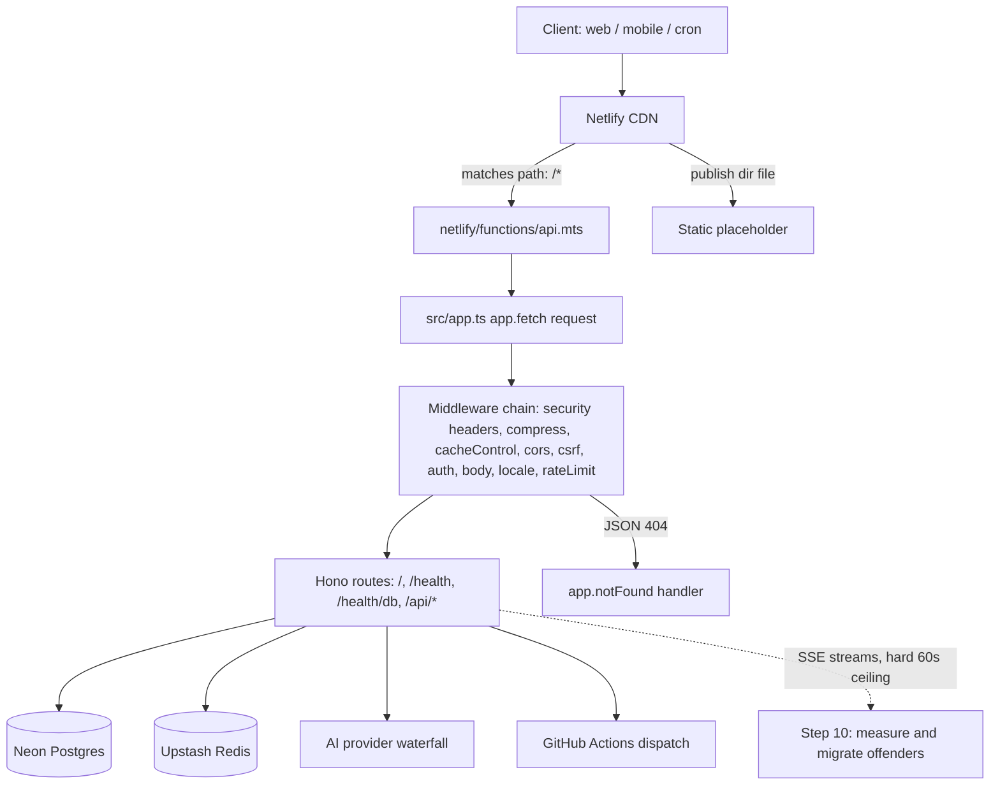
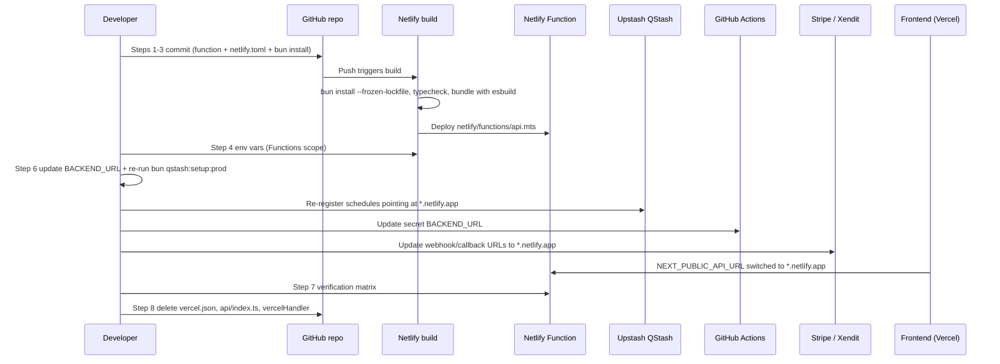
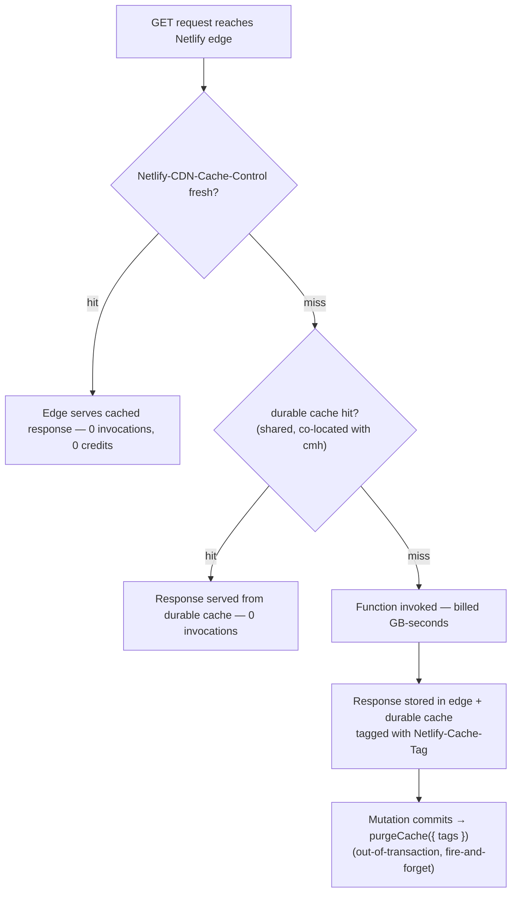

# Netlify Migration Roadmap

> **Status:** Implemented (dual-track — Netlify primary, Vercel retained as rollback)
> **Date:** 2026-10-03
> **Owner:** Backend / Taufik Nur Rahmanda

---

## 1. Summary Table

| # | Item | Priority | Status |
|---|------|----------|--------|
| 1 | Add Netlify Serverless Function entrypoint (`netlify/functions/api.mts`) | `P0` | ✅ Done |
| 2 | Add `netlify.toml` (build, functions, bundler, publish directory) | `P0` | ✅ Done |
| 3 | Force Bun dependency install (lockfile detection gap) | `P0` | ✅ Done |
| 4 | Migrate environment variables & secrets to Netlify (Functions scope) | `P0` | ⏳ Repo-side done — Netlify dashboard env scope is an operator action |
| 5 | Rename `IS_VERCEL` → `IS_SERVERLESS` runtime detection | `P1` | ✅ Done |
| 6 | Re-point all backend URLs (QStash, GitHub secret, payment webhooks, frontend) | `P0` | ⏳ Repo-side done — Stripe/Xendit/GitHub/Frontend re-pointing is an operator action |
| 7 | Verification & regression matrix (routing, auth, SSE, uploads, latency) | `P0` | ✅ Done (`bun run verify:deployment`) |
| 8 | Remove Vercel deployment artifacts and dead code | `P1` | ⏳ Scoped down — marker-guarded instead of deleted; rollback path is deliberate |
| 9 | Documentation sync (README, AGENTS.md, copilot instructions, `.env.example`) | `P1` | ✅ Done |
| 10 | Post-migration observability: 60s SSE ceiling & region latency baseline | `P2` | ⬜ Future — baseline captured by `verify:deployment`; alerting still open |
| 11 | Free-tier credit hygiene: deploy/bandwidth/request budget guardrails & usage alerts | `P1` | ⬜ Future |
| 12 | Wall-clock discipline audit (Netlify bills awaited time — dispatch slow work) | `P1` | ⬜ Future |
| 13 | Netlify-correct cache directives: retire inert `s-maxage` on `private`, add `Vary` guard | `P2` | ✅ Done |
| 14 | Edge + durable caching for public endpoints (`Netlify-CDN-Cache-Control`, `durable`) | `P2` | ✅ Done |
| 15 | Cache tags (`Netlify-Cache-Tag`) + `purgeCache()` wired into existing invalidation hooks | `P2` | ✅ Done |
| 16 | Scheduled/background functions & plan-gated levers (memory, vCPU, region) | `P3` | ⬜ Future / deferred — QStash remains the scheduler |

> Steps 1-10 are the migration itself. Steps 11-16 are **post-migration free-tier enhancements** — the Netlify equivalents of the optimizations in `docs/roadmap/VERCEL_FLUID_ACTIVE_CPU_OPTIMIZATION_ROADMAP.md`. Their full analysis, credit math, and design rationale live in [§11 Free-Tier Optimization Enhancements Plan](#11-free-tier-optimization-enhancements-plan).
>
> Platform artifact lifecycle (clean up Vercel / revert to Vercel / clean up Netlify) lives in [`docs/operations/DEPLOYMENT_PLATFORM_LIFECYCLE.md`](./../operations/DEPLOYMENT_PLATFORM_LIFECYCLE.md) and is scripted in `scripts/platform-cleanup.ts`.

---

## 2. Problem Statement

### Current State

- The repository was deployed to **Netlify** (Hono + Node.js runtime + Bun package manager) and every request returns Netlify's own **"Page not found"** page — not Hono's JSON 404.
- The repo contains a complete **Vercel deployment adapter** and **zero Netlify deployment files**:
  - `vercel.json:1-6` — rewrites `/(.*)` → `/api/index` (Vercel-only syntax, ignored by Netlify).
  - `api/index.ts:18` — thin re-export of `src/app.ts`'s default export (Vercel entrypoint convention).
  - `src/app.ts:263-416` — `vercelHandler`, a 170-line `IncomingMessage`/`ServerResponse` ↔ Web `Request`/`Response` adapter, exposed as the **default export**.
  - `netlify.toml` / `netlify/functions/**` — **absent** (glob over the repo returns no matches).
- `src/app.ts:166-175` defines `GET /` returning JSON. Since the deployed root returns Netlify's HTML 404 instead, **the request never reaches Hono** — Netlify has no function mapped to `/`.
- Netlify discovers functions from `netlify/functions/` and routes them only through the function's `config.path` or `netlify.toml` redirects. Neither exists, so Netlify serves its built-in 404.

### Pain Points

1. **Total routing failure (P0)** — every path (`/`, `/health`, `/api/*`) returns a platform 404. The backend is effectively offline on Netlify.
2. **Runtime-detection flag silently inverts (P1)** — `src/config/env.ts:10` exports `IS_VERCEL = Boolean(process.env.VERCEL || process.env.VERCEL_ENV)`. On Netlify this is `false`, which flips `src/utils/ai-logger.ts:22,97` and `src/utils/edge-group.ts:14,19,24` into **local-dev mode**: multi-KB LLM output dumps and `::group::` markers flood Netlify function logs and burn CPU on every AI call. The flag's real semantics are "am I on a serverless platform?", not "am I on Vercel?".
3. **Hard-coded Vercel URLs still drive live callbacks (P0)** — `.env.production:5` sets `BACKEND_URL=https://twistloom-backend.vercel.app`, which is the QStash destination (`src/cron/ensure-qstash-schedules.ts:103`) and the GitHub Actions callback (`on-demand-book-creation.yml`, `secrets.BACKEND_URL`). Payment webhook endpoints registered in the Stripe/Xendit dashboards also point at the Vercel domain. Scheduled jobs and payment callbacks would keep hitting a platform you are leaving.
4. **Platform limits differ from Vercel (P1)** — Netlify Serverless Functions: **60s synchronous/streaming ceiling**, 20 MB streamed response, 6 MB buffered payload (~4.5 MB binary after Base64), default region **`cmh` (Ohio)**, function Node version follows the **build** Node version.
5. **Dependency-install detection gap (P1)** — Netlify auto-detects Bun only from `bun.lockb`; this repo uses the modern text lockfile `bun.lock`, so the build falls back to `npm install` and silently ignores the lockfile.
6. **Vercel-era configuration scattered across the repo (P2)** — `src/config/constants.ts:7` (`APP_WEB_URL` → Vercel domain, **never imported anywhere**), `.env.example:326-329` (`VERCEL_URL`), `tsconfig.build.json:7,10,25` comments ("for Vercel deployment"), README sections 156-195 documenting the Vercel adapter as the deployment story.

### Goal

Route every request through Hono on Netlify with a single thin fetch wrapper, re-point all externally-registered callbacks, and delete the Vercel adapter and every Vercel-only artifact so exactly one deployment story remains in the repository.

---

## 3. Platform Comparison: Vercel (Hobby) vs. Netlify (Free Tier)

> **Context:** Twistloom-backend is moving from Vercel's legacy/hobby deployment model to Netlify's modern Serverless Functions (credit-based Free tier, active since September 2025). This section establishes the architectural and economic trade-offs of this migration.

### 3.1 Platform Feature & Limit Matrix

| Dimension | Vercel (Hobby Tier) | Netlify (Free Tier / 2026) | Twistloom Impact & Trade-Off |
| :--- | :--- | :--- | :--- |
| **Handler & Architecture** | Proprietary Node.js adapter (`vercelHandler`, 170 lines) converting `IncomingMessage` $\leftrightarrow$ Web `Request`. | Pure Web Standards API (`Request` $\rightarrow$ `Response`). Zero adapter code. | 🟢 **Major Gain:** Deletes 170 lines of glue code; `src/app.ts` becomes standard Hono. |
| **Compute Metering Model** | **Active CPU time only** (`[3ms CPU][await LLM 40s -> 0 CPU]`). | **Wall-clock duration $\times$ memory (GB)** (`[3ms CPU][await LLM 40s -> Billed 40s]`). | 🔴 **Major Drawback:** Awaited upstream time (LLM, Neon, QStash) is billed 100%. |
| **Function Execution Limit** | **15 seconds** default (Hobby); up to 60s only on specific configurations. | **60 seconds** synchronous & streaming (`ReadableStream`); **15 minutes** for background functions. | 🟢 **Gain:** 4x longer ceiling for interactive AI streams without premature timeouts. |
| **Quota & Billing Model** | **Independent generous buckets:**<br>• 100 GB Bandwidth<br>• 500k Edge Requests<br>• 4 CPU-hours execution<br>• 100 deploys/day | **Single pooled hard budget:**<br>**300 credits/month** shared across ALL meters:<br>• Bandwidth: 20 cred/GB (max 15 GB)<br>• Compute: 10 cred/GB-h (max 30 GB-h)<br>• Deploys: 15 cred/deploy (max 20 deploys)<br>• Requests: 2 cred/10k (max 1.5M) | 🔴 **Major Drawback:** 6.7x less bandwidth headroom (15 GB vs 100 GB). Heavy usage on one meter starves others. |
| **Account Exhaustion Behavior** | Soft limits / deployment throttling; site generally remains online. | **Hard Stop:** When 300 credits are exhausted, **ALL sites on the account pause immediately** (*"Site not available"*). | 🔴 **Critical Risk:** No auto-recharge on Free; requires rigorous credit hygiene (Step 11). |
| **Deploy Quota & Cost** | 100 deployments / day for free. | **15 credits per production deploy** (~20 deploys/month theoretical max). Previews cost 0 credits. | 🔴 **Drawback:** Pushing 10 production commits burns 50% of monthly budget! Batching required. |
| **Function Region & Latency** | **Free region selection** (supports `sin1` Singapore AWS co-located with Neon). | **Hard-pinned to `cmh` (Ohio, US East)**. Region selection is Pro-only ($19/mo). | 🔴 **Drawback:** Adds **~180–220ms round-trip latency** to Neon DB (`ap-southeast-1` Singapore). |
| **Edge & CDN Caching** | Edge caching with `s-maxage`; allows collapsing short status polls. | `private` **strictly disables shared CDN cache**; function responses uncached by default. Opt-in via `Netlify-CDN-Cache-Control` + `durable`. | 🟡 **Neutral/Trade-off:** No edge collapse for auth polls, but enables durable caching + on-demand cache tag purges. |
| **Cache Invalidation** | Redeploy required or paid platform features. | On-demand cache tag purging via `purgeCache({ tags })` from `@netlify/functions`. | 🟢 **Gain:** Precision cache tagging and instant programmatic purging for catalogue data. |
| **Background / Async Execution** | No native background tasks on Hobby; cron limited to 1 execution/day. | Built-in `context.waitUntil()`, Scheduled Functions (cron sweeps), 15m Background Functions. | 🟢 **Gain:** Better native primitives for post-response tasks and sweeps without third-party cron. |
| **Package Manager Detection** | Automatically detects `bun.lock` (text) and `bun.lockb` (binary). | Only detects `bun.lockb`; defaults to `npm install` unless stub `bun.lockb` is added. | 🟡 **Minor Friction:** Solved via an empty `bun.lockb` stub in repository root. |
| **Payload & Upload Size** | ~4.5 MB effective binary payload (Base64 over 6 MB raw). | ~4.5 MB effective binary payload (Base64 over 6 MB raw); 20 MB streamed response. | ⚪ **Identical:** Request upload limits and body constraints are functionally identical. |

---

### 3.2 What Twistloom GAINS (Benefits & Architectural Upgrades)

1. **Cleaner, Maintainable Application Core (Zero Hosting Adapter):**
   - On Vercel, `src/app.ts` carried a complex 170-line `vercelHandler` to bridge Node.js streams (`IncomingMessage`/`ServerResponse`) to the Web Fetch standard.
   - On Netlify Functions v2, the handler receives a spec-compliant Web `Request` and returns a Web `Response`. `src/app.ts` becomes a 100% platform-agnostic Hono app with a 5-line wrapper (`netlify/functions/api.mts`).
2. **60-Second Execution & Streaming Ceiling (vs. 15s Hobby):**
   - Vercel Hobby strictly killed serverless invocations after 15 seconds unless configured on special compute settings.
   - Netlify provides a full **60-second limit** for synchronous requests and streaming responses (`ReadableStream`), giving substantial headroom for LLM response streaming without dropped connections.
3. **Advanced Durable Caching & Precision Tag-Based Invalidation:**
   - Netlify's `durable` cache directive persists public API responses in a shared global store co-located with the function region, serving subsequent requests with 0 function invocations.
   - Cached responses can be tagged (`Netlify-Cache-Tag`) and purged on-demand (`purgeCache({ tags })`) directly after database mutations commit, ensuring instantaneous data consistency without waiting for TTL expiration.
4. **Native Background Primitives (`context.waitUntil` & Background Functions):**
   - Netlify passes `context.waitUntil()`, enabling Twistloom to run post-response cleanup, cache invalidations, and audit logging asynchronously without delaying the client's HTTP response.
   - 15-minute Background Functions provide a native fallback for async operations if GitHub Actions dispatch is unavailable.
5. **Decoupled Backend Infrastructure:**
   - Separating backend deployment from Vercel eliminates single-provider lock-in while preserving the frontend on Vercel (`twistloom-web.vercel.app`).

---

### 3.3 What Twistloom LOSES (Drawbacks, Risks & Critical Constraints)

1. **Wall-Clock Compute Billing (The Active-CPU Inversion):**
   - On Vercel Fluid, awaiting an external API (such as Google Gemini, Mistral, Cerebras, or Upstash) consumed **0 active CPU seconds**.
   - On Netlify, **every millisecond spent awaiting is billed at full rate** (10 credits / GB-hour). Long AI queries or slow database round trips directly burn compute credits.
   - *Mitigation:* Heavy book generation already dispatches asynchronously to GitHub Actions; status polling is protected by in-memory LRU deduplication (`coalescePoll`).
2. **Severely Reduced Bandwidth & Pooled Hard Quota (15 GB vs. 100 GB):**
   - Vercel Hobby provided a dedicated 100 GB bandwidth allowance.
   - Netlify Free provides a shared pool of 300 credits. At 20 credits/GB, spending the entire monthly quota on bandwidth yields only **15 GB** (a 6.7x reduction).
   - *Mitigation:* Global response compression (`hono/compress`) remains enabled for all non-trivial payloads; document export downloads (PDF, EPUB) must be monitored.
3. **The 15-Credit Production Deploy "Tax":**
   - Netlify charges **15 credits per successful production deploy** (~20 deploys max per month before exhausting the entire account budget).
   - *Mitigation:* Developers must abandon continuous push-to-main habits. Code changes must be batched into release PRs and tested on Deploy Previews (which cost 0 credits).
4. **Cross-Pacific Database Latency (+180–220ms per query):**
   - Vercel Hobby allowed free selection of the deployment region (`sin1` Singapore), co-locating the backend with Neon DB (`ap-southeast-1`).
   - Netlify Free **pins all functions to `cmh` (Ohio, US East)**. Changing regions requires a paid Pro plan ($19/mo). Every round trip to Neon now crosses the Pacific.
   - *Mitigation:* Heavy endpoints must batch SQL queries, leverage Drizzle prepared statements, and aggressively cache read data in Upstash Redis and Netlify Durable cache.
5. **Account-Wide Hard Pause on Overage:**
   - Exhausting the 300-credit pool pauses all sites on the account with an unbranded error page. There is no automatic overage billing on Free.
   - *Mitigation:* Establish strict manual usage reviews (Step 11) with personal alerts at 70% and 90% of cycle consumption.
6. **No Edge Collapsing on Authenticated Polls:**
   - Netlify CDN never caches `private` responses, rendering `s-maxage` inert. Status polling by authenticated users always reaches the serverless function.
   - *Mitigation:* Retain application-layer in-process coalescing (`src/services/poll-coalescing.ts`) as the primary dampener for polling bursts.

---

## 4. Intended Design & Rationale

### Design Alternatives

#### Alternative A: Netlify Edge Functions (Deno) via `hono/netlify`

The official Hono Netlify guide uses `netlify/edge-functions/index.ts` with `import { handle } from "hono/netlify"`.

**Pros:** Officially documented Hono path; edge-level latency; no 60s synchronous ceiling in the same shape.
**Cons:** Deno runtime — `pdfkit` (font loading via Node `fs`), `google-auth-library`, `stripe`, `docx`, `epub-gen-memory`, `@neondatabase/serverless` and the 19-provider AI SDK stack are Node-oriented; every dependency would need a runtime-compatibility audit; production was deliberately stabilized on Node.js after the earlier Bun/Vercel work.

#### Alternative B: Netlify Serverless Functions (Node.js) + thin fetch wrapper

`netlify/functions/api.mts` receives a Web `Request` and returns Hono's `Response` directly.

**Pros:** Node.js runtime matches today's production target; Netlify's modern Functions API is already Web-standard, so **no request conversion code is needed at all** (the entire 170-line `vercelHandler` has no equivalent); Hono routes/middleware untouched; smallest possible adapter (~5 lines); GitHub-Actions-based async generation pattern already handles long work.
**Cons:** 60s synchronous/streaming limit; default region `cmh`; esbuild bundling needs a check for `pdfkit` assets.

#### Alternative C: Keep `vercelHandler` + Netlify redirects

Point `[[redirects]]` at a shim that feeds the Vercel adapter.

**Pros:** No refactor of `src/app.ts`.
**Cons:** Netlify always passes a Web `Request`, so the adapter's `IncomingMessage` branch (`src/app.ts:286-333`) becomes permanently dead code — the opposite of a clean migration; the `ServerResponse` write path (`src/app.ts:360-392`) would also be unreachable.

### Recommended: Alternative B

Netlify's Functions API hands the handler a spec-compliant Web `Request` and accepts a Web `Response` — exactly Hono's native contract. This lets the migration **delete** the Vercel adapter rather than add a second one, leaving `src/app.ts` as a pure application module.

Target module boundary after cleanup:

```text
                         ┌─ src/server.bun.ts          local dev (Bun.serve)
                         │
src/app.ts (pure Hono) ──┼─ api/index.ts + vercel.json  Vercel   (deleted in Step 8)
  export const app       │
                         └─ netlify/functions/api.mts   Netlify  (production)
```

### Non-Breaking Guarantees

| Change | What it does NOT change | Why safe |
|--------|------------------------|----------|
| Add `netlify/functions/api.mts` | No Hono route, middleware, or handler code | Wrapper only calls `app.fetch()` |
| Add `netlify.toml` | No application logic | Build/routing metadata only |
| Force `bun install` in build command | No dependency versions | Honors the existing `bun.lock` |
| `IS_VERCEL` → `IS_SERVERLESS` | No behavior on Vercel during transition | `VERCEL` still satisfies the new check |
| Backend domain changes to `*.netlify.app` | CORS allow-list | Frontend stays on Vercel; `src/app.ts:80` keeps `https://twistloom-web.vercel.app` |
| Backend domain changes | Auth model (cookie + bearer) | Cookie is issued by the frontend origin; backend only verifies (`src/app.ts:122-147`) — still regression-tested in Step 7 |
| Delete `vercel.json` / `api/index.ts` / `vercelHandler` | Local dev (`bun dev`), cron scripts, `dist/` builds | Those consumers are separate files (`src/server.bun.ts`, `start:cron:*`) |
| Credit/transaction logic | Nothing touched | No changes under `src/services/credits.ts` |

---

## 5. Feasibility Analysis

| Dimension | Assessment |
|-----------|------------|
| **Effort** | Low — ~2-4 hours of code/config, plus one verification pass (Step 7) and a docs sweep (Step 9) |
| **Risk** | Medium — routing fix itself is trivial; risk lives in platform limits (60s SSE), `pdfkit` bundling, and external callback re-pointing |
| **Backend changes** | Minimal — one new file, one env-flag rename, one adapter deletion; zero route/middleware changes |
| **Dependencies** | Netlify site + env/secrets (Functions scope), Stripe/Xendit dashboard webhook URLs, QStash schedule re-registration, GitHub Actions secret `BACKEND_URL`, frontend `NEXT_PUBLIC_API_URL` |
| **Reversibility** | Fully reversible until Step 8 — Vercel files stay in place and the Vercel project can serve traffic until the Netlify verification matrix passes |

---

## 6. Flow Diagram (Mermaid)

### 5.1 Request flow on Netlify (target state)



### 5.2 Cutover sequence



---

## 7. Implementation Plan

### Step 1: Add Netlify Serverless Function entrypoint — ✅ Done

**Files:** `netlify/functions/api.mts` (**NEW**), `tsconfig.json:41`, `package.json:92-103`
**Effort:** Low

Netlify's modern Functions API passes a Web `Request` and execution `Context`, expecting a Web `Response` — Hono's native contract:

```ts
/**
 * Netlify Serverless Function entrypoint (Node.js runtime, ESM).
 *
 * Netlify passes a spec-compliant Web API Request and execution Context,
 * and expects a Web API Response, which maps directly to Hono's native
 * fetch interface. No IncomingMessage conversion is needed (unlike the legacy Vercel path).
 */
import type { Config, Context } from "@netlify/functions";
import { app } from "../../src/app.js";

export default async (request: Request, context: Context): Promise<Response> => {
  return app.fetch(request, {}, context);
};

export const config: Config = {
  path: "/*",
  preferStatic: true,
};
```

Notes:
- `.mts` guarantees ESM regardless of the nearest `package.json` `type` field (the repo already sets `"type": "module"`, but `.mts` removes ambiguity).
- `config.path = "/*"` uses URLPattern wildcard syntax and takes over `/`, `/health`, `/health/db`, `/api/*`, `/favicon.ico`, and the backward-compat redirects at `src/app.ts:220-221`.
- **`preferStatic: true`** ensures static files in `publish = "public"` (e.g. `public/robots.txt`, `favicon.ico`) are served directly by Netlify's CDN edge without invoking the function (saving compute credits and cold starts). Because `public/` has no `index.html`, `/`, `/health`, and `/api/*` fall through to Hono.
- Threading `context` into `app.fetch(request, {}, context)` grants Hono handlers and middleware access to `c.executionCtx.waitUntil(...)`, enabling post-response background work (cache purge, analytics, logs) without blocking client responses.
- Update `tsconfig.json:41` `include` to add `"netlify/**/*.mts"` so `bun run typecheck` validates the function entrypoint instead of silently skipping it.
- The `.js` import extension satisfies the repo's `lint:imports` rule; esbuild resolves `../../src/app.js` → `src/app.ts`. **Contingency:** if the Netlify bundler fails to substitute the extension, point the import at the compiled `../../dist/app.js` and make Step 2's build command emit `dist/` (`bun run build`) instead of `bun run typecheck`.
- Add `@netlify/functions` to `devDependencies` for the typed `Config` and `Context` exports (types only; it does not ship at runtime).

**Non-breaking:** `src/app.ts` is untouched in this step.

---

### Step 2: Add `netlify.toml` — ✅ Done

**Files:** `netlify.toml` (**NEW**), `public/robots.txt` (**NEW**)
**Effort:** Low

Put every deployment assumption under source control instead of Netlify dashboard settings:

```toml
[build]
  # Dependencies are installed via Bun in the native pre-build step
  # (triggered by the bun.lockb stub, see Step 3).
  # Build command fails early on type errors before bundling.
  command = "bun run typecheck"
  publish = "public"

[functions]
  directory = "netlify/functions"
  node_bundler = "esbuild"
  # pdfkit resolves AFM font data from its own package directory at runtime;
  # keep it out of the esbuild bundle and explicitly ship its data files.
  external_node_modules = ["pdfkit"]
  included_files = ["node_modules/pdfkit/js/data/**"]

[build.environment]
  NODE_VERSION = "24"
  BUN_VERSION = "1.3.14"
```

- **Routing stays inline** (`config.path` in Step 1). Do **not** also add a `[[redirects]]` catch-all — one routing mechanism only.
- **`publish = "public"`** with a placeholder `public/robots.txt` (`User-agent: *` / `Disallow: /`): an explicit, in-source publish directory prevents accidental static exposure of the repo root. Coupled with `preferStatic: true`, Netlify CDN serves `robots.txt` directly at edge for 0 credits.
- **Do not publish `dist/`** — it contains compiled JS, `.d.ts`, and source maps; publishing it would expose source. (`dist/` stays gitignored and remains only for the `start:cron:*` scripts in `package.json:42-50`.)
- Function Node version follows the build Node version (fallback Node 24). To pin it explicitly, set `AWS_LAMBDA_JS_RUNTIME=nodejs24.x` as a Netlify **UI/CLI** env var — it is ignored inside `netlify.toml`. (Node.js 24 is already the default on modern Netlify builds).
- `node_bundler = "esbuild"` is set explicitly rather than relying on the platform default, so bundling behavior is pinned in source.
- `included_files = ["node_modules/pdfkit/js/data/**"]` guarantees that `pdfkit` AFM font metrics are packaged into the Lambda archive alongside the external module, preventing runtime `ENOENT` font errors.

**Non-breaking:** no application code changes.

---

### Step 3: Force Bun dependency install via `bun.lockb` detection — ✅ Done

**Files:** `bun.lockb` stub (**NEW**), `netlify.toml` (Step 2), deploy log verification
**Effort:** Low

Netlify's documented build detector triggers Bun dependency installation only on `bun.lockb`; this repo uses the modern text lockfile `bun.lock`. Without intervention, Netlify falls back to `npm install` first, which wastes 1–2+ minutes of build time on every deploy before running any custom build command.

1. **Add a stub/empty `bun.lockb` file** in the repository root. Netlify's build detector sees `bun.lockb` and immediately selects Bun as the package manager, executing `bun install` directly during the pre-build dependency installation phase.
2. Bun recognizes `bun.lock` as the authoritative text lockfile and installs dependencies strictly matching it.
3. This completely avoids the redundant `npm install` step, cutting deploy duration and conserving Netlify build minutes.
4. `BUN_VERSION=1.3.14` (matches `"packageManager": "bun@1.3.14"` in `package.json:59`) and `NODE_VERSION=24` in `[build.environment]`.
5. **Verification:** in the Netlify deploy log confirm `bun install` runs natively during dependency installation (and `npm install` is bypassed entirely).

**Non-breaking:** dependency versions are unchanged; local `bun install` workflow is unchanged.

---

### Step 4: Migrate environment variables & secrets to Netlify — ⏳ Repo-side done

**Files:** `.env.example`, Netlify UI (Site configuration → Environment variables)
**Effort:** Medium (mechanical but high-blast-radius)

Copy from `.env.production` with **Functions scope** (build-time vars alone are not visible inside the function runtime):

| Group | Variables |
|-------|-----------|
| Core | `NODE_ENV=production`, `AUTH_SECRET`, `DATABASE_URL`, `DATABASE_READ_URL`, `FRONTEND_URL=https://twistloom-web.vercel.app`, `PORTAL_URL`, `BACKEND_URL=https://twistloom-backend.netlify.app` |
| Cache / rate limit | `UPSTASH_REDIS_REST_URL`, `UPSTASH_REDIS_REST_TOKEN` (and any `UPSTASH_*`) |
| Payments | `STRIPE_*`, `XENDIT_*`, `CRON_SECRET`, `QSTASH_TOKEN` |
| Email | `RESEND_*` |
| AI providers | `GOOGLE_AI_API_KEY`, `MISTRAL_API_KEY`, `GROQ_API_KEY`, `CEREBRAS_API_KEY`, `NVIDIA_API_KEY`, `OPENROUTER_API_KEY`, `COHERE_API_KEY`, `SAMBANOVA_*`, `OPENAI_API_KEY`, `ZAI_*`, `SILICONFLOW_*`, `AION_*`, `CHUTES_*`, `LLM7_*`, `MERCURY_*`, `JINA_API_KEY`, and the remaining provider keys listed in `.env.example` |
| Integrations | `GITHUB_WORKFLOW_TOKEN`, `GITHUB_REPO_*`, `IMAGEKIT_*`, `XENDIT_WEBHOOK_TOKEN` |
| Feature flags | `DISABLE_CPU_OPTIMIZATIONS` (leave unset → optimizations ON, `src/config/cpu-optimizations.ts:19-27`) |
| Runtime pin | `AWS_LAMBDA_JS_RUNTIME=nodejs24.x` (UI/CLI only) |

Critical details:
- **`NODE_ENV=production` must be set explicitly** — Netlify does not set `NODE_ENV` by default, and `IS_PRODUCTION` (`src/config/env.ts:4`) gates error-message redaction (`src/app.ts:230`) and other behavior. Leaving it unset deploys a "development" backend to production.
- **Delete `VERCEL_URL`** from the Netlify environment; `BACKEND_URL` becomes the only QStash destination source (`src/cron/ensure-qstash-schedules.ts:103`).
- Do not set `VERCEL`/`VERCEL_ENV` — Step 5's detection must evaluate honestly.
- `AUTH_URL` stays pointed at the frontend (Auth.js runs there).

**Non-breaking:** no code changes; the same variable names are read.

---

### Step 5: Rename `IS_VERCEL` → `IS_SERVERLESS` — ✅ Done

**Files:** `src/config/env.ts:9-11`, `src/utils/ai-logger.ts:8,22,97`, `src/utils/edge-group.ts:1,14,19,24`
**Effort:** Low

The flag gates "serverless log frugality", not Vercel membership. Rename it so Netlify satisfies the same check, with no deprecated alias left behind:

```ts
/** Cloud / Runtime environment detection: any serverless platform. */
export const IS_SERVERLESS = Boolean(process.env.VERCEL || process.env.VERCEL_ENV || process.env.NETLIFY);
export const IS_GITHUB_ACTIONS = Boolean(process.env.GITHUB_ACTIONS);
```

- Update both consumer files to import `IS_SERVERLESS` (`src/utils/ai-logger.ts` has 3 references at lines 8, 22, 97; `src/utils/edge-group.ts` has 4 references at lines 1, 14, 19, 24).
- Update comments that state "On Vercel…" to "On serverless platforms…" (`ai-logger.ts:20-21`, `edge-group.ts:9-10`, `cpu-optimizations.ts:7,11,16`).
- On Vercel (while it still exists) `process.env.VERCEL` keeps the behavior identical; on Netlify `process.env.NETLIFY` (set by the platform) restores log frugality.

**Non-breaking:** identical boolean value on Vercel; the only behavioral change is on Netlify, where it restores the intended production logging behavior.

---

### Step 6: Re-point all backend URLs — ⏳ Repo-side done

**Files:** `.env.production:5,71`, `.env.example:326-329`, `src/cron/ensure-qstash-schedules.ts:95-106`, `.github/workflows/on-demand-book-creation.yml`, external dashboards
**Effort:** Medium

External systems that hold a hard-coded Vercel URL must be updated — the repo alone cannot fix them:

1. **`.env.production`** — `BACKEND_URL=https://twistloom-backend.netlify.app`; delete the `VERCEL_URL` entry (and activate the already-commented Netlify block at `.env.production:102-113`).
2. **Netlify env UI** — same `BACKEND_URL` value (Step 4).
3. **QStash schedules** — re-run `bun qstash:setup:prod`. Registration is an upsert keyed by `Upstash-Schedule-Id` (`README.md:731`), so re-running repoints the existing schedules instead of duplicating them. `ensure-qstash-schedules.ts:106` hard-fails when neither `BACKEND_URL` nor `VERCEL_URL` is set — removing `VERCEL_URL` makes `BACKEND_URL` mandatory (good: explicit).
4. **GitHub Actions secret** — update `BACKEND_URL` used by `on-demand-book-creation.yml` (workflow callback/notify URL).
5. **Stripe Dashboard** — webhook endpoint → `https://twistloom-backend.netlify.app/api/payments/stripe/webhook` (`src/routes/payments.ts:590` verifies the signature; the endpoint path is unchanged).
6. **Xendit Dashboard** — invoice/recurring callback → `https://twistloom-backend.netlify.app/api/payments/xendit/webhook`.
7. **Frontend repo (`twistloom-web`)** — `NEXT_PUBLIC_API_URL` (or equivalent) → `https://twistloom-backend.netlify.app/api`.
8. **Mobile App repo (`twistloom-mobile`)** — `EXPO_PUBLIC_API_URL` (or API base URL) → `https://twistloom-backend.netlify.app/api`.
9. **Google Cloud Console (OAuth 2.0 Client ID)**:
   - In **Authorized JavaScript origins**: Add `https://twistloom-backend.netlify.app`.
   - In **Authorized redirect URIs**: Add `https://twistloom-backend.netlify.app/api/auth/callback/google` (if backend OAuth callback is configured).
   - In **OAuth consent screen**: Add `netlify.app` to **Authorized domains**.
10. **Apple Developer Portal (Sign in with Apple)**:
    - In Services IDs → Sign in with Apple: Add Primary Domain `twistloom-backend.netlify.app` and web return URLs.
11. **Google Play Console (Legal & Compliance URLs)**:
    - *App Content → Privacy Policy*: Verify URL is live (`https://twistloom-backend.netlify.app/privacy` or frontend `/privacy`).
    - *App Content → Terms of Service*: Update URL if pointing to backend.
    - *App Content → Data safety / Account Deletion*: Update web-based account deletion URL (mandatory Google Play policy).
12. **Apple App Store Connect (Compliance & Server Notifications)**:
    - Update Privacy Policy, Terms of Use (EULA), Support, and Account Deletion URLs.
    - *App Store Server Notifications (v2)*: Update Production & Sandbox URLs to `https://twistloom-backend.netlify.app/api/webhooks/apple`.
13. **`.env.example:326-329`** — replace the "Vercel Environment Variables" block with `BACKEND_URL` documentation.
14. **Keep** `https://twistloom-web.vercel.app` everywhere it appears (`src/app.ts:80`, `src/config/emails/base-layout.ts:30`, `src/services/social/extract-twistloom-link.ts:60`) — the frontend is not moving.

**Non-breaking:** no route paths change; only the host in front of them.

---

### Step 7: Verification & regression matrix — ✅ Done (runner shipped)

**Files:** none (execution checklist)
**Effort:** Medium

Run in this order, stopping at the first failure:

| # | Check | Command / action | Expected |
|---|-------|------------------|----------|
| 1 | Deploy log | Netlify deploy log | `bun install` runs; esbuild bundles without unresolved-import errors |
| 2 | Root | `curl -i https://twistloom-backend.netlify.app/` | Hono JSON: `{ "message": "Twistloom Backend", ... }` |
| 3 | Health | `curl -i .../health` | `{ "ok": true, ... }` |
| 4 | DB health | `curl -i .../health/db` | `{ "ok": true, "db": "up", "latencyMs": N }` — record `N` (Step 10 baseline) |
| 5 | Public API | `curl -i ".../api/books/stats"` | 200 JSON |
| 6 | 404 shape | `curl -i .../api/does-not-exist` | Hono's `{ "success": false, "error": "Not Found" }` — proves Hono, not Netlify, is answering |
| 7 | Anonymous web request | Frontend call with `Origin: https://twistloom-web.vercel.app` | 2xx, CORS headers present, `credentials` allowed |
| 8 | Authenticated web request | Logged-in read + mutation | 2xx; cookie identity resolved |
| 9 | Bearer mobile request | `Authorization: Bearer <JWT>` | 2xx |
| 10 | Hybrid cookie+bearer | Same user and conflicting user | Dual-verify passes / 401 on conflict (`src/app.ts:131-147`) |
| 11 | Logout / Google auth / guest migration | Manual | No origin-related regressions |
| 12 | CSRF | Cross-origin POST from a disallowed origin | 403; no-origin (server/webhook) POST passes |
| 13 | SSE smoke | One short streaming endpoint (`src/routes/pen.ts:876` or a prompt stream) | Chunks arrive incrementally, `done`/`end` emitted, no 60s truncation |
| 14 | Upload | Image upload near the limit | Accepted (effective ~4.5 MB binary, same as the Vercel assumption in `src/app.ts:303-305`) |
| 15 | PDF export | Trigger a document export (`src/services/document-generators/index.ts:10,139`) | 200 — proves `external_node_modules = ["pdfkit"]` shipped font data |
| 16 | Rate limit | Burst a public endpoint | 429 with `Retry-After`, Redis-backed (no in-memory counter) |
| 17 | Logs | Netlify function logs during an AI call | Single-line AI summaries, **no** `::group::` markers, **no** multi-KB output dumps (Step 5 regression) |
| 18 | Cron | Wait for the 5/10-minute QStash schedules | Logs show callbacks arriving at `*.netlify.app` |
| 19 | Payments | Test-mode Stripe + Xendit webhook | Signature/token verified, credits awarded exactly once |
| 20 | Cold start | First request after idle | Note TTFB; compare with the Vercel baseline |

**Non-breaking:** read-only checks except the explicit mutation/payment test cases.

---

### Step 8: Remove Vercel deployment artifacts and dead code — ⏳ Scoped down (rollback retained)

**Files:** `vercel.json`, `api/index.ts`, `src/app.ts:8,244-416`, `src/config/constants.ts:7`, `src/config/env.ts`
**Effort:** Low — execute **only after Step 7 is green** and the Vercel project is decommissioned

One cleanup commit, so no half-migrated state survives:

1. **Delete `vercel.json`** and **delete the entire `api/` directory** (`api/index.ts` is only a re-export of the adapter).
2. **Strip the adapter from `src/app.ts`:**
   - Remove `import type { IncomingMessage, ServerResponse } from "node:http"` (`src/app.ts:8`) — the file becomes pure Web-standard Hono.
   - Remove `export const config = { runtime: "nodejs" }` (`src/app.ts:263`) — Vercel-only.
   - Remove `vercelHandler` and its whole comment block (`src/app.ts:244-416`).
   - End the file with `export { app };` (already at `src/app.ts:418`) and add `export default app;` so any Hono framework preset gets the app itself rather than an adapter.
3. **Delete `APP_WEB_URL`** (`src/config/constants.ts:7`) — grep confirms it is exported and never imported anywhere in the repo. If a self-referencing backend URL is ever needed, it should come from `BACKEND_URL`, not a hard-coded constant.
4. **Finish the env rename** — remove `VERCEL`/`VERCEL_ENV` from `IS_SERVERLESS` only if the Vercel project is truly gone; otherwise keep `Boolean(process.env.NETLIFY || process.env.VERCEL)`. Either way there is no `IS_VERCEL` symbol left.
5. **Keep** `tsconfig.build.json` + `scripts/build.js` — they are **not** Vercel-only: `package.json:42-50` runs `bun dist/cron/*.js`. Only their Vercel-worded comments (`tsconfig.build.json:7,10,25`) need rewording.
6. **Do not touch** `src/server.bun.ts` (local dev), QStash/GitHub cron scripts, or any route/middleware file.

**Post-cleanup greps (must return zero hits outside `docs/` and the frontend domain):**

```powershell
Get-ChildItem -Recurse src,scripts -Include *.ts,*.js | Select-String -Pattern 'vercelHandler|IS_VERCEL|IncomingMessage'
```

**Non-breaking:** local `bun dev` (`src/server.bun.ts`), cron scripts, and `dist/` builds are untouched.

---

### Step 9: Documentation sync — ✅ Done

**Files:** `README.md`, `AGENTS.md` §2, `.github/copilot-instructions.md:15`, `.env.example`
**Effort:** Medium

| Location | Change |
|----------|--------|
| `README.md:27` | Badge: `vercel` → `netlify` |
| `README.md:48` | Backend URL → `https://twistloom-backend.netlify.app` |
| `README.md:62` | Runtime table row: Vercel Node.js → Netlify Serverless Functions (Node.js) |
| `README.md:121,131-134` | Migration-history rows referencing the Vercel adapter → mark as historical or remove |
| `README.md:156-195` | Rewrite the "Vercel deployment" section as "Netlify deployment" (entrypoint, `netlify.toml`, build command, runtime matrix row at line 172) |
| `README.md:236-237,390,407,975` | "Vercel" in strategy-pattern wording → "serverless"/"Netlify" (GitHub Actions + cron branches stay) |
| `README.md:513-515` | Example API URLs → Netlify domain |
| `README.md:731` | QStash paragraph: `BACKEND_URL` only (drop `VERCEL_URL`), Vercel Cron rationale → Netlify Scheduled Functions note |
| `README.md:872,875` | Project tree: remove `api/index.ts`, re-label `src/app.ts` as pure Hono app, add `netlify/functions/api.mts`, `netlify.toml` |
| `AGENTS.md` §2 | "Vercel Node.js Serverless runtime in production" → "Netlify Serverless Functions (Node.js) runtime in production" |
| `.github/copilot-instructions.md:15` | Same runtime statement |
| `.env.example:326-329` | Replace `VERCEL_URL` block with `BACKEND_URL` + Netlify notes (Step 6) |
| `docs/architecture/CSRF_PROTECTION.md` | Describes `*.vercel.app` wildcard origin logic that the code no longer implements (`src/app.ts:78-87` is an explicit allow-list) — align prose with the actual allow-list while updating hosts |

**Non-breaking:** documentation only.

---

### Step 10: Post-migration observability — ⬜ Future (baseline only)

**Files:** none required initially (measurement + possible follow-up roadmap)
**Effort:** Medium, ongoing

1. **60s SSE ceiling** — Netlify caps synchronous *and* streaming functions at 60s (20 MB streamed). Inventory the SSE endpoints and measure P95 duration:
   - `src/routes/books.ts:554, 1592, 5859, 7065, 7112`
   - `src/routes/pen.ts:876`
   - `src/routes/broadcasts.ts:79`
   - Book creation already dispatches to GitHub Actions with polling (`ASYNC_BOOK_CREATION_ROADMAP.md`) — any remaining stream that can exceed 60s should adopt the same dispatch → status-poll pattern rather than holding the connection open.
2. **Latency baseline** — record `/health/db` `latencyMs` (Step 7 check 4) and compare against the Vercel baseline. Default region is `cmh` (Ohio); changing region (`sin`, `nrt`, …) is a **Pro/Enterprise** setting and should only be changed if measurements against the Neon region justify it.
3. **Function metrics** — watch cold-start TTFB, error rate, and memory (default 1024 MB) with the full 19-provider dependency graph bundled.
4. **Payload limits** — 6 MB buffered / ~4.5 MB binary uploads, 20 MB streamed responses; confirm no endpoint relies on larger bodies.

---

### Step 11: Free-tier credit hygiene & usage guardrails — ⬜ Future

**Files:** Netlify UI (Usage & billing), `netlify.toml`, README (§ deploy discipline)
**Effort:** Low
**Deep dive:** §11.2 (budget anatomy), §11.4 (this step)

Netlify Free is a **hard 300-credit pool shared across every meter** — compute, bandwidth, web requests, and production deploys draw from the same balance, and exhaustion pauses **all** sites (visitors see "Site not available"). Establish guardrails before traffic arrives:

1. Pin the deploy habit: **15 credits per production deploy** (≈20/month theoretical max) — batch changes, verify via free Deploy Previews first; failed deploys and rollbacks cost 0.
2. Keep `compress()` enabled for all non-tiny bodies (bandwidth is **20 credits/GB ≈ 15 GB** total).
3. Subscribe to the **Usage & billing → Credit usage breakdown → Compute** view (and set a personal alert at ~70% of the cycle).

**Non-breaking:** no code change; configuration and process only.

---

### Step 12: Wall-clock discipline audit — ⬜ Future

**Files:** `src/routes/books.ts:206`, `src/services/document-generators/index.ts:10`, AI call sites, SSE routes
**Effort:** Medium
**Deep dive:** §11.1 (mental-model inversion), §11.4 (this step)

Netlify's compute meter is **wall-clock × 1 GB** — unlike Vercel Fluid, *awaited* time (LLM generation, PDF rendering, third-party APIs) is billed in full. Audit the request path:

1. Move any remaining slow upstream `await` out of the request path → GitHub Actions dispatch (existing pattern) or a background function.
2. Prefer status polling over held SSE for anything that can approach the 60s ceiling (each streamed second is a billed second).
3. Lazy-import heavy modules (`pdfkit`, `docx`, `epub-gen-memory`, AI SDK singletons) so cold-start/init time shrinks — `src/routes/books.ts:206` is a static import today; `src/app.ts:197` already shows the lazy pattern.

**Non-breaking:** no response-contract change; only *when* work happens.

---

### Step 13: Netlify-correct cache directives — ✅ Done

**Files:** `src/middleware/cache.ts:61-88`, `src/middleware/locale.ts:30-40` (Vary emission)
**Effort:** Low
**Deep dive:** §11.3 (mapping table), §11.4 (this step)

Two Vercel-era assumptions behave differently on Netlify and must be corrected before any edge caching is enabled:

1. **`private` disables Netlify's shared cache** — so the status-poll edge collapse (`private, max-age=1, s-maxage=1, stale-while-revalidate=2`, `src/middleware/cache.ts:65`) and the authenticated read hints (`private, max-age=5, stale-while-revalidate=30`, `:82`) produce **zero** edge invocations saved. Keep `private` for user-scoped responses (correct and required — Q8), but drop the dead `s-maxage` on line 65 so the header stops implying an edge collapse that does not exist; the real dampener for authenticated polls remains the app-layer `coalescePoll`/`getCoalesced` (P1.4), which is runtime-agnostic.
2. **Add a `Vary` guard before caching anything localized** — `extractLocale` derives content from `Accept-Language`, but no `Vary: Accept-Language` is emitted. Caching a localized public response without it would serve one language to every visitor.

**Non-breaking:** header semantics only; no body or status changes.

---

### Step 14: Edge + durable caching for public endpoints — ✅ Done

**Files:** `src/middleware/cache.ts:91-100`, NEW `src/utils/netlify-cache.ts` (header helper), public route handlers
**Effort:** Medium
**Deep dive:** §11.3 (mapping table), §11.4 (Step 14 + flow diagram)

Netlify does **not** cache function responses by default, and the opt-in header is `Netlify-CDN-Cache-Control` — most specific header wins, standard `Cache-Control` only reaches the visitor's browser. The public branch today (`src/middleware/cache.ts:94-99`) emits `public, max-age=…, s-maxage=…`, which saves browser bandwidth but still invokes the function on every cold request. For genuinely public, shareable responses set:

```http
# CDN-only: Netlify edge + durable cache; browser keeps its own shorter TTL
Netlify-CDN-Cache-Control: public, durable, max-age=30, stale-while-revalidate=120
Cache-Control: public, max-age=30, stale-while-revalidate=120
```

`durable` (serverless-only) stores the response in a shared cache co-located with the functions region, so other edge nodes stop invoking the function for the same content — the closest Netlify analog to "keep read traffic out of the serverless container", and every avoided invocation is **0 billed GB-seconds**.

Candidates: `GET /api/books/stats`, anonymous explore/catalogue endpoints, published-book metadata for logged-out readers, `GET /` and `/favicon.*`. Pre-flight checks per candidate:

1. **`GET` only** — Netlify caches only `GET`; everything else is ignored regardless of headers.
2. **No `Set-Cookie` / no user data on the response** — sensitive responses are skipped by the shared cache, and a cookie on a public route would also poison the cache key.
3. **`Vary: Accept-Language` present** if the body depends on `extractLocale` (`src/middleware/locale.ts:30`) — see Step 13.
4. **Verify on a deployed URL with `Cache-Status: "Netlify Edge"; hit` / `"Netlify Durable"; hit`** — `netlify dev` does not emulate the CDN cache, so a local miss is expected.

**Non-breaking:** public data only; authenticated responses stay `private` and uncached at the shared edge (see Q8).

---

### Step 15: Cache tags + on-demand purge — ✅ Done

**Files:** NEW `src/utils/netlify-cache.ts`, invalidation sites in `src/services/cache.ts` and book/page mutation services
**Effort:** Medium
**Deep dive:** §11.4 (this step)

Longer TTLs (Step 14) are only safe with fast invalidation:

1. Tag cacheable responses: `Netlify-Cache-Tag: explore, stats, book:<bookId>`.
2. Call `purgeCache({ tags: [...] })` from `@netlify/functions` alongside the existing Redis invalidations (`deleteCachePattern` / per-sort explore keys) — **after** the transaction commits, fire-and-forget, per AGENTS.md §3.3.3 (external side effects outside the transaction).
3. Observe the rate limit: each tag/site may be purged only **twice per 5 seconds** (HTTP 429 beyond that) — batch and throttle purges.

**Non-breaking:** additive headers plus an out-of-transaction side effect; Redis remains the app-level source of truth.

---

### Step 16: Scheduled/background functions & plan-gated levers — ⬜ Deferred

**Files:** optional `netlify/functions/sweep-*.mts` (**NEW**), `src/cron/ensure-qstash-schedules.ts` (only if replacing QStash)
**Effort:** Medium — much of it optional/deferred
**Deep dive:** §11.4 (this step)

| Lever | Availability | Note |
|-------|--------------|------|
| Netlify **Scheduled Functions** (cron) | Credit-based plans — verify Free eligibility | Could host the 5/10-minute sweeps (`sweep-credit-reservations`, `sweep-custom-actions`) natively instead of Upstash QStash; **30-second scheduled execution limit** fits sub-second sweeps. QStash already works, so this is optional consolidation, not a fix. |
| Netlify **Background Functions** | Credit-based plans — verify Free eligibility | 15-minute escape hatch for work that must exceed the 60s synchronous limit, as a fallback to GitHub Actions. Still billed for the full duration. |
| `context.waitUntil()` | All plans (functions deployed after 2025-03-20) | Post-response work without blocking the client — but billing includes the full duration, so use it for correctness (purge/logging), never as a cost saving. |
| Memory / vCPU tuning (1024→4096 MB) | **Pro/Enterprise only** | Not available on Free — duration is the only compute lever. |
| Function region (`cmh` → `sin`/`nrt`) | **Pro/Enterprise only** | Ties to Q6. |

**Non-breaking:** new function files only; no change to the Hono app unless QStash is deliberately retired.

---

## 8. Open Questions

### Q1. Netlify Edge Functions vs Serverless Functions — ✅ Decided

**Decision:** Serverless Functions on the Node.js runtime (Alternative B).

**Rationale:** The production stack (pdfkit, docx/epub, google-auth-library, Stripe, Neon, AI SDKs) was deliberately stabilized on Node.js; Edge would force a Deno compatibility audit across the whole dependency tree for no functional gain.

---

### Q2. Routing mechanism: inline `config.path` vs `netlify.toml` redirects — ✅ Decided

**Decision:** Inline `export const config = { path: "/*" }` in the function file.

**Rationale:** One routing mechanism, colocated with the handler, typed by `Config`. A `[[redirects]]` catch-all would duplicate routing across two files and risk shadow conflicts.

---

### Q3. When to delete the Vercel adapter — ✅ Decided

**Decision:** ~~Staged delete in a single Step 8 commit~~ → **scoped down to retention + deterministic markers.** `vercel.json`, `api/index.ts`, and `vercelHandler` stay in the repository as the rollback deployment; the adapter block in `src/app.ts` is wrapped in `__PLATFORM_VERCEL_ADAPTER_BEGIN__` / `__PLATFORM_VERCEL_ADAPTER_END__` markers so future removal is a scripted, reversible edit rather than a hand-edit.

**Rationale:** Reversibility during cutover, then zero dead or obsolete deployment code in the final state. Deletion is now an **explicit operator decision** — `bun platform:cleanup:vercel` (or `bun platform:cleanup:netlify` in the other direction) — never a side effect of the migration. See [`docs/operations/DEPLOYMENT_PLATFORM_LIFECYCLE.md`](./../operations/DEPLOYMENT_PLATFORM_LIFECYCLE.md).

---

### Q4. `pdfkit` under esbuild bundling — ✅ Decided

`src/services/document-generators/index.ts:10` statically imports `pdfkit`, which loads AFM font data from its package directory at runtime. Vercel's file-tracing included those assets automatically; esbuild does not.

- **(A)** `external_node_modules = ["pdfkit"]` — package ships unmodified with its data files. **Pros:** smallest change, fonts guaranteed. **Cons:** slightly larger artifact.
- **(B)** `included_files = ["node_modules/pdfkit/js/data/**"]` while keeping it external. **Pros:** guarantees AFM font files are packed into the Lambda zip even if file-pruning runs.
- **(C)** Lazy-import PDF generation only on the export route (`src/routes/books.ts:206`). **Pros:** smaller cold starts for the 99% path; prevents heavy generator initialization on simple API reads.

**Decision:** Combined A + B in `netlify.toml` (`external_node_modules` + `included_files`), plus C (lazy dynamic import in `books.ts`). Verified by Step 7 check 15.

---

### Q5. Bun lockfile detection — ✅ Decided

**Decision:** Keep `bun.lock` as the authoritative lockfile, but commit a lightweight `bun.lockb` stub in the repository root so Netlify's build detector natively executes `bun install`.

**Rationale:** Netlify's automated detector checks for `bun.lockb` to choose Bun. Committing a stub tricks the detector into selecting Bun natively, avoiding a redundant 1–2 minute `npm install` download on every deploy. Bun CLI will always prioritize and respect `bun.lock` when present.

---

### Q6. Function region — ⬜ Open

Default is `cmh` (US East / Ohio); region changes are Pro/Enterprise-only.

- **(A)** Keep `cmh` initially. **Pros:** zero config, Netlify's recommended default. **Cons:** possible extra RTT to Neon if the database is in Asia.
- **(B)** Set `sin` / `nrt` immediately. **Pros:** lower DB round-trip if Neon is in Singapore/Tokyo. **Cons:** paid-tier setting, worse TTFB for non-Asia clients, chosen without data.

**Recommendation:** Option A, then decide from the Step 7 check 4 / Step 10 measurements.

---

### Q7. Streams that can exceed 60 seconds — ⬜ Open

- **(A)** Monitor first, migrate only offenders. **Pros:** no speculative rework; the dispatch → poll pattern already exists. **Cons:** first long stream gets truncated at 60s.
- **(B)** Pre-emptively convert every SSE endpoint to dispatch + polling. **Pros:** no truncation risk. **Cons:** large speculative refactor; loses real-time token streaming (a core UX feature) for streams that actually finish in 20s.

**Recommendation:** Option A — measure P95 stream duration in Step 10 and move only the endpoints that exceed ~55s.

---

### Q8. Cache any authenticated/user-scoped response at Netlify's shared edge? — ⬜ Open

Context: Netlify's CDN is a **shared** cache, and `private` responses are explicitly not stored in it (§11.3). Enabling edge caching for authenticated reads would require dropping `private` or varying by cookie.

- **(A)** Never — keep every user-scoped response `private`; win invocation reductions only on public endpoints (Step 14). **Pros:** zero cross-user leak risk; session tokens are high-cardinality so hit rate would be poor anyway. **Cons:** authenticated reads always invoke the function (mitigated by app-layer coalescing + LRU caches already shipped).
- **(B)** Cookie-varied shared caching — `Netlify-Vary: cookie=<session cookie>` + `public`. **Pros:** edge hits for logged-in reads. **Cons:** one cache object per session (hit rate near zero), and any leak of a shared object is a security incident; also `Netlify-Vary` explicitly forbids varying on the whole `Cookie` header.
- **(C)** Split responses — cache only the deterministic, per-user-independent fragments (book metadata, published content) at the edge, keep the user-specific wrapper uncached. **Pros:** best of both. **Cons:** requires response decomposition — a larger refactor.

**Recommendation:** Option A now (with Option C revisited only if Step 11.5 metrics show authenticated read traffic dominating compute spend).

---

## 9. References & File Touch List

### New files

| File | Change |
|------|--------|
| `netlify/functions/api.mts` | **NEW** — Netlify function entrypoint (`app.fetch` + `path: "/*"` + `preferStatic: true` + `context`) |
| `netlify.toml` | **NEW** — build command, publish dir, functions dir, esbuild bundler, `external_node_modules`, `included_files`, env versions |
| `bun.lockb` | **NEW** — empty stub file to trigger Netlify's native Bun build-detection and eliminate redundant `npm install` |
| `public/robots.txt` | **NEW** — explicit placeholder publish directory (served at edge via `preferStatic: true`) |

### Backend code

| File | Change |
|------|--------|
| `src/app.ts:8,244-416` | Step 8 — remove `node:http` import, `export const config`, `vercelHandler`; add `export default app` |
| `src/config/env.ts:9-11` | Step 5 — `IS_VERCEL` → `IS_SERVERLESS` (adds `process.env.NETLIFY`) |
| `src/utils/ai-logger.ts:8,22,97` | Step 5 — import/use `IS_SERVERLESS`; reword Vercel-specific comments |
| `src/utils/edge-group.ts:1,14,19,24` | Step 5 — import/use `IS_SERVERLESS` |
| `src/config/cpu-optimizations.ts:7,11,16` | Step 5 — comment wording only (flag semantics unchanged) |
| `src/config/constants.ts:7` | Step 8 — delete dead `APP_WEB_URL` |
| `src/config/constants.ts:11-13` | Step 10 — note: `VERSION` reads `npm_package_version`, which may be absent in the Netlify function runtime (falls back to `"1.0.0"`); confirm acceptable or inline the version at build |
| `src/routes/books.ts:206` | Step 12 — change static `generateDocument` import to dynamic `await import(...)` in export handler to cut cold-start init wall-clock |

### Enhancement steps (11-16)

| File | Change |
|------|--------|
| `src/middleware/cache.ts:65` | Step 13 — drop dead `s-maxage` from the authenticated status-poll branch; document `private` as the Netlify contract |
| `src/middleware/cache.ts:91-100` | Step 14 — add `Netlify-CDN-Cache-Control` (+ `durable`) alongside `Cache-Control` on public catalogue routes |
| `src/middleware/locale.ts:30` | Step 13 — emit `Vary: Accept-Language` for locale-dependent public bodies |
| NEW `src/utils/netlify-cache.ts` | Steps 14-15 — header helper (`Netlify-CDN-Cache-Control`, `Netlify-Cache-Tag`, `Netlify-Vary`) + fail-open `purgeCache()` wrapper |
| `src/services/cache.ts:100,165,221`, `src/services/book.ts:268` | Step 15 — tag-based CDN purge beside the existing Redis invalidations |
| `src/routes/books.ts:206`, `src/services/document-generators/index.ts:10` | Step 12 — lazy-import heavy generators to cut init wall-clock |
| Netlify UI (Usage & billing, Observability) | Steps 11, §11.5 — credit and invocation targets; no repo artifact |

### Config & scripts

| File | Change |
|------|--------|
| `package.json` | Step 1 — add `@netlify/functions` as a **runtime dependency** (prod builds set `NODE_ENV=production`) + `netlify:*` / `verify:deployment` / `platform:*` scripts |
| `tsconfig.json`, `tsconfig.eslint.json` | Step 1 — include `netlify/**/*.mts` and `scripts/**/*.ts` |
| `tsconfig.build.json:7,10,25` | Step 8 — reword Vercel-specific comments (file itself stays; feeds `start:cron:*`) |
| `.env.example:326-329` + tail | Steps 4/6 — replace `VERCEL_URL` block with `BACKEND_URL` + Netlify notes; document optional `NETLIFY_SITE_ID` / `NETLIFY_AUTH_TOKEN` |
| `.env.production:5,71,102-113` | Step 6 — `BACKEND_URL` → Netlify domain, `VERCEL_URL` commented as rollback-only |
| `.github/workflows/on-demand-book-creation.yml` | Step 6 — update secret `BACKEND_URL` in GitHub settings |
| `public/robots.txt`, `bun.lockb` | Steps 2–3 — publish-directory seed; empty Bun-lockfile detection stub |
| `scripts/verify-deployment.ts` | Step 7 — automated regression matrix |
| `scripts/platform-cleanup.ts` | Step 8 — `status` / `vercel` / `netlify` / `restore` artifact lifecycle (dry-run by default, snapshot-before-apply) |
| `src/utils/netlify-cache.ts` | Steps 14–15 — `Netlify-CDN-Cache-Control`, cache tags, fail-open purge |

### Step 8 (scoped down): Vercel files retained — not deleted

Deletion was **re-scoped to retention** so the migration stays fully reversible. The files below are deliberately kept; removing them is an explicit command (`bun platform:cleanup:vercel`), never a side effect.

| File | Status |
|------|--------|
| `vercel.json` | Retained — Vercel-only rewrites, ignored by Netlify |
| `api/index.ts` (and `api/`) | Retained — re-export of the Vercel adapter (rollback entrypoint) |
| `src/app.ts` `vercelHandler` block | Retained, wrapped in `__PLATFORM_VERCEL_ADAPTER_BEGIN__` / `__PLATFORM_VERCEL_ADAPTER_END__` markers so future removal is deterministic |
| `tsconfig.json`, `tsconfig.build.json`, `src/config/constants.ts` comments | Reworded platform-neutral |

### Documentation

| File | Change |
|------|--------|
| `README.md` (badges, URLs, tech stack, migration scope, deployment sections, API examples, project tree) | Step 9 — deployment story, URLs, badges, runtime matrix, project tree |
| `AGENTS.md` §2 (Technology Stack) | Step 9 — production runtime → Netlify Serverless Functions (Node.js) |
| `.github/copilot-instructions.md` ("Runtime and tooling") | Step 9 — production runtime statement |
| `docs/architecture/CSRF_PROTECTION.md` | Step 9 — backend host → Netlify; `*.vercel.app` wildcard re-labelled as the **frontend** origin |
| `docs/roadmap/NETLIFY_MIGRATION_ROADMAP.md` | This document — update statuses as steps complete |
| `docs/operations/DEPLOYMENT_PLATFORM_LIFECYCLE.md` | **New** — Vercel cleanup / revert-to-Vercel / Netlify cleanup runbook |

### External (outside the repo)

| System | Change |
|--------|--------|
| Netlify UI | Env vars with Functions scope; `AWS_LAMBDA_JS_RUNTIME`; optional region |
| Upstash QStash | Schedules repointed via `bun qstash:setup:prod` |
| Stripe Dashboard | Webhook endpoint URL → Netlify domain |
| Xendit Dashboard | Callback URL → Netlify domain |
| GitHub repo secrets | `BACKEND_URL` → Netlify domain |
| `twistloom-web` repo | `NEXT_PUBLIC_API_URL` → Netlify domain |

### Codebase Findings

1. **`APP_WEB_URL` is dead code** — `src/config/constants.ts:7` is exported and never imported anywhere in the repository (repo-wide grep: 1 hit, the declaration). Remove it in Step 8 rather than updating it.
2. **`IS_VERCEL` is a misnamed serverless flag** — its consumers (`ai-logger`, `edge-group`) only care about log-frugality on serverless. Left as-is, a Netlify deploy silently degrades to local-dev logging verbosity (multi-KB AI dumps plus `::group::` markers in production logs).
3. **QStash has an implicit Vercel dependency** — `src/cron/ensure-qstash-schedules.ts:103` falls back to `VERCEL_URL`. Removing `VERCEL_URL` without setting `BACKEND_URL` turns into a hard failure at line 106; the pair must change together (Step 6).
4. **`NODE_ENV` is not set by Netlify by default** — `IS_PRODUCTION` would be `false` in production, loosening error messages (`src/app.ts:230`). Must be set explicitly in Step 4.
5. **`dist/` is not dead** — `package.json:42-50` (`start:cron:*`) runs compiled cron entrypoints, so `tsconfig.build.json`/`scripts/build.js` must survive the Vercel cleanup; only their Vercel wording changes.
6. **`VERSION` may silently fall back** — `src/config/constants.ts:13` reads `process.env.npm_package_version`, injected by a package-manager script at build time and unlikely to exist inside a Netlify function invocation; the reported version would pin to `"1.0.0"`.
7. **`.env.production:102-113` already contains commented Netlify values** — a previous partial migration attempt; consolidate instead of adding a second block.
8. **`pdfkit` is a static route-level import** — `src/routes/books.ts:206` → `src/services/document-generators/index.ts:10`, so it lands in every bundle and needs explicit bundler treatment (Q4).

---

## 10. Completion Status

Legend: ✅ Implemented & verified · ⏳ Partial / scoped down · ⬜ Future work · ⏩ Deferred

### Completed
- ✅ Root-cause diagnosis — confirmed no `netlify.toml` / `netlify/functions/*` exist; `vercel.json` + `api/index.ts` + `vercelHandler` (`src/app.ts:265`) are the only deployment adapter; platform 404 proven by the unreachable `GET /` handler (`src/app.ts:166`)
- ✅ Platform capability research — Netlify Functions API (`config.path` URLPattern routing, Web `Request`/`Response`), limits (60s sync/stream, 20 MB stream, 6 MB / ~4.5 MB binary payload, 15 min background), default region `cmh`, Node version follows build, `bun.lockb`-only Bun detection
- ✅ Free-tier capability research — credit-based billing model (300 credits/month hard pool, compute at 10 credits/GB-hour on **wall-clock** duration), shared-cache semantics of `private`, `durable` directive, `Netlify-CDN-Cache-Control` / `Netlify-Cache-Tag` / `purgeCache()`, plan-gated memory/vCPU/region — captured in §11
- ✅ **Step 1** — `netlify/functions/api.mts` (Web `Request` → `Response` via `app.fetch`, `config.path = "/*"`, `preferStatic`, executionCtx threaded from Netlify `Context`)
- ✅ **Step 2** — `netlify.toml` (build `bun run typecheck`, publish `public`, esbuild bundler, `external_node_modules`/`included_files` for `pdfkit`, `NODE_VERSION=24` / `BUN_VERSION=1.3.14`); `public/robots.txt` seeded
- ✅ **Step 3** — empty `bun.lockb` stub; `bun install --frozen-lockfile` verified green with `bun.lock` authoritative
- ✅ **Step 5** — `IS_VERCEL` → `IS_SERVERLESS` (`src/config/env.ts` now tests `VERCEL || NETLIFY`); consumers in `ai-logger.ts`, `edge-group.ts`, `cpu-optimizations.ts` updated; zero remaining `IS_VERCEL` references
- ✅ **Step 7** — `bun run verify:deployment -- <url>` ships 9 automated checks (routing, `/health/db`, CORS, CSRF, `Vary`, cache headers, SSE, `pdfkit` lazy path) + `--burst` rate-limit probe + manual checklist + TTFB baseline; non-zero exit on failure
- ✅ **Step 8 (scoped)** — Vercel artifacts **retained** for rollback; adapter block wrapped in `__PLATFORM_VERCEL_ADAPTER_*` markers; `tsconfig.build.json` / `tsconfig.json` / `src/config/constants.ts` comments made platform-neutral; destructive removal delegated to `bun platform:cleanup:vercel`
- ✅ **Step 9** — `README.md`, `AGENTS.md`, `.github/copilot-instructions.md`, `.env.example`, `docs/architecture/CSRF_PROTECTION.md` now describe Netlify as primary with Vercel as rollback
- ✅ **Step 13** — inert `s-maxage=1` removed from the `private` status-poll branch; `Vary: Accept-Language` guard added in `src/middleware/locale.ts`
- ✅ **Step 14** — `src/utils/netlify-cache.ts` emits `Netlify-CDN-Cache-Control` + `Netlify-Cache-Tag`; `applyPublicCdnCache(c, path)` is the single call site from `src/middleware/cache.ts` (GET/HEAD, 2xx, unauthenticated only)
- ✅ **Step 15** — `CATALOGUE_CACHE_TAGS` purge wired into `invalidateExploreCache()` in `src/services/cache.ts`; purge is fail-open (5s per-tag dedupe, no-op without `NETLIFY_AUTH_TOKEN`/`NETLIFY_SITE_ID` or without `process.env.NETLIFY`)
- ✅ **Repo-side Steps 4 & 6** — `.env.example` and `.env.production` re-pointed to `BACKEND_URL=https://twistloom-backend.netlify.app`; QStash registration accepts `BACKEND_URL` first with `VERCEL_URL` as legacy fallback; `generateDocument` lazy-imported (Step 12's highest-value item)

### In Progress
- ⏳ **Step 9 residual** — none; documentation sync complete
- ⏳ **Step 4 residual (operator)** — copy `.env.production` into the Netlify UI **Functions** environment scope (`NODE_ENV=production`, `AWS_LAMBDA_JS_RUNTIME=nodejs24.x`, all `*_KEY`/`*_SECRET`/`AUTH_SECRET`), plus optional `NETLIFY_SITE_ID` + `NETLIFY_AUTH_TOKEN` for tag purge
- ⏳ **Step 6 residual (operator)** — re-point `BACKEND_URL` GitHub secret, Stripe webhook endpoint, Xendit callback, `FRONTEND_URL`/`NEXTAUTH_URL` on the frontend, and run `bun qstash:setup:prod`

### Future / Deferred
- ⬜ Step 10 — SSE 60s ceiling & latency observability (baseline captured by `verify:deployment`; alerting/thresholds open)
- ⬜ Step 11 — free-tier credit hygiene & usage guardrails (Netlify UI → Usage & billing)
- ⬜ Step 12 — wall-clock discipline audit (only the `pdfkit` lazy import is shipped; full await-time audit open)
- ⬜ Step 16 — scheduled/background functions & plan-gated levers (memory, vCPU, region)
- ⏩ Step 8 completion — final Vercel project retirement (`bun platform:cleanup:vercel` + dashboard decommission) once Netlify is verified in production
- ⏩ Edge Functions (Deno) — deferred indefinitely; Node runtime is the deliberate target (Q1)
- ⏩ Pre-emptive SSE → polling conversion — deferred pending P95 measurements (Q7)
- ⏩ QStash → Netlify Scheduled Functions consolidation — deferred; QStash works and Free-plan eligibility is unverified (Step 16)

### How this migration was executed
Dual-track by design: every Netlify change landed **additively** while the Vercel path stayed deployable. `bun platform:status` reports the current mode; `bun platform:cleanup:vercel` / `bun platform:cleanup:netlify` execute the transitions (dry-run by default, idempotent, line-based, snapshot-before-apply), and `bun platform:restore` replays the snapshot to undo them. Full runbook: [`docs/operations/DEPLOYMENT_PLATFORM_LIFECYCLE.md`](./../operations/DEPLOYMENT_PLATFORM_LIFECYCLE.md).

---

## 11. Free-Tier Optimization Enhancements Plan

> **Research update (2026-10-05):** See the companion [Netlify Free-Tier Optimization Roadmap](NETLIFY_FREE_TIER_OPTIMIZATION_ROADMAP.md) for the combined Next.js + Hono budget, researched platform eligibility, and ordered assessment plan. It supersedes the independent budget targets and cache-cost examples below: CDN/durable hits avoid origin compute but still consume request/bandwidth credits. Existing implementation statuses in this migration document are retained pending the later code/deployment audit.

> **Scope:** post-migration Steps 11-16. This is the Netlify counterpart of [`VERCEL_FLUID_ACTIVE_CPU_OPTIMIZATION_ROADMAP.md`](./VERCEL_FLUID_ACTIVE_CPU_OPTIMIZATION_ROADMAP.md): it asks the same question one tier lower — *what optimization tricks does Netlify Free actually offer, what do they buy us in credits, and what do we lose versus Vercel?*
>
> Rates below come from Netlify's credit-based pricing (accounts activated after 2025-09-04). **Verify current rates in Netlify UI → Usage & billing before treating the numbers as budget law**; the structure (pooled hard limit, wall-clock compute) is what drives the design.

### 11.1 The mental-model inversion: Active CPU → GB-hour wall clock

```text
VERCEL FLUID (previous meter)                 NETLIFY CREDITS (current meter)
------------------------------------------  ------------------------------------------
Meter: active CPU only                       Meter: wall-clock runtime x memory (GB)
[exec 3ms][await LLM 45s -> 0 CPU]           [exec 3ms][await LLM 45s -> BILLED]
Budget: 4 CPU-h / 30 days (own meter)        Budget: 300 credits / month (ALL meters)
Knobs: Fluid CPU toggle, region              Free knobs: none (1024 MB, region cmh)
```

Compute price: **10 credits per GB-hour**. At the default 1024 MB, `credits = seconds / 360`:

| Duration of one invocation | Compute cost |
|---|---|
| 250 ms (status poll) | 0.0007 credits |
| 10 s (deep read) | 0.028 credits |
| 60 s (max SSE/sync call) | 0.167 credits |
| 1 hour | 10 credits |

**Consequences:**

| Lever | Vercel Fluid | Netlify credits |
|---|---|---|
| Cut CPU per request (middleware, crypto, gzip, parsing) | Directly reduces the meter | Only indirectly — less CPU = shorter wall-clock; still worth keeping |
| `await` LLM / PDF / third-party inside a request | **Free** while awaiting | **Billed** for the whole wait — the biggest structural regression |
| Avoid an invocation (cache hit, coalesced poll) | Saves CPU + overhead | Saves the **entire handler duration** — higher value per avoided request |
| Hold an SSE stream open | Billed only for active CPU | Billed for every held second — streams become a cost driver |
| Status-poll bursts | Damped by edge cache + LRU | LRU coalescing still works; edge `private` cache does not (§11.3) |
| Idle/warm function | ~0 | ~0 — no request, no duration (no per-second standby charge) |

### 11.2 The pooled 300-credit budget

Every meter draws from one balance — there is no separate bandwidth or compute allowance.

| Meter | Rate | What 300 credits buys |
|---|---|---|
| Compute | 10 credits / GB-hour (1 GB default) | ~30 hours of function runtime |
| Web requests | 2 credits / 10,000 | ~1.5 M requests |
| Web bandwidth | 20 credits / GB | ~15 GB egress |
| Production deploy | 15 credits | ~20 deploys |
| Deploy Preview / branch deploy | 0 | unlimited verification |
| Failed deploy / rollback | 0 | unlimited retries |

**Worked examples (Twistloom-shaped traffic):**

| Scenario | Meter draw | Share of the 300 pool |
|---|---|---|
| 100 k status polls x 250 ms | 69 credits (compute) | 23% |
| 1,000 SSE streams x 30 s | 83 credits (compute) | 28% |
| 1,000 SSE streams x 60 s | 167 credits (compute) | 56% |
| 500 k API GETs (requests meter) | 100 credits | 33% |
| 10 GB egress | 200 credits | 67% |
| 20 production deploys | 300 credits | 100% |

Two of these lines exhaust the month. **Exhaustion is a hard stop**: the account is paused and visitors see *"Site not available"* for every site on the account — the Netlify analog of Vercel's deployment pause, but pooled across the whole account. Free plans have no auto-recharge or credit packs (Personal/Pro add-ons only), so the only mitigation is consumption control (Step 11).

### 11.3 Vercel Fluid trick → Netlify equivalent

| Optimization from the Fluid roadmap | Netlify Free equivalent | Tracking |
|---|---|---|
| Active-CPU metering (awaits = 0 credits) | **No equivalent** — wall-clock x GB | §11.1, Step 12 |
| Reduced CPU per request (P1.x, P2.x) | Still valid, only indirectly | keep |
| Skip `compress()` on tiny polls (P2.5) | Same benefit (shorter duration) | shipped |
| Poll coalescing + `Retry-After` (P1.4) | Identical — in-process LRU | shipped |
| Session-verify cache 60 s (P2.4), ban LRU (P2.1) | Identical | shipped |
| Lightweight `/touch` heartbeat (P1.1) | Identical | shipped |
| Authenticated edge collapse `private, s-maxage` (P2.2) | **Inert** — Netlify never stores `private` in its shared cache | Step 13 |
| Status-poll `private, max-age=1, s-maxage=1` | **Inert** — same reason; app-layer coalescing is the remaining dampener | Step 13 |
| Public reads cached at the edge | Opt in with `Netlify-CDN-Cache-Control` (+ `durable`); `Cache-Control` alone only reaches the browser | Step 14 |
| Redis `deleteCachePattern` invalidation | Add `Netlify-Cache-Tag` + `purgeCache()` beside it | Step 15 |
| `DISABLE_CPU_OPTIMIZATIONS` master toggle | Keeps its meaning (gates coalescing/session cache/compress-skip); not tied to any Netlify meter | keep |
| Zero-compute `/health` (P5.2) | Carries over; optionally edge-cached | Step 14 |
| Adapter body-skip (P6.2) | **Dies with `vercelHandler`** — Netlify passes a Web `Request`; no `IncomingMessage` buffering at all | Step 8 |
| GitHub Actions dispatch for long work | Still mandatory (60 s sync limit) **and** now a direct credit saving | Step 12 |
| Vercel Observability | Netlify Observability (invocations, slowest functions) + `Cache-Status` + Usage dashboard | §11.5 |
| 4 CPU-h / 30-day hard pause | 300-credit hard pool → account pause | Step 11 |
| Fluid CPU toggle, region choice, memory tuning | **Pro/Enterprise only** (Free: 1024 MB, region `cmh`) | Step 16 |

### 11.4 Enhancement deep dives

#### Step 11 — credit hygiene

Process + dashboard only, zero code. Deploy at 15 credits is the most expensive single line item per change: verify on free Deploy Previews, batch commits, treat failed deploys and rollbacks as free. Keep `compress()` active for every non-tiny body (bandwidth is the second-largest meter). Watch **Usage & billing → Credit usage breakdown → Compute** and alert at 70% / 90% of the cycle — there is no public usage API on Free, so monitoring is a manual dashboard habit rather than a scriptable signal.

#### Step 12 — wall-clock discipline

One rule replaces the old Active-CPU assumption: **every awaited second inside a request path is a billed second.** Apply it:

1. Slow upstreams (LLM generation, PDF/EPUB rendering, third-party APIs) leave the request path for GitHub Actions dispatch or a background function.
2. Held SSE seconds are the most expensive seconds in the system — prefer status polling for anything that can approach the 60 s ceiling, and measure P95 stream duration first (Step 10, Q7).
3. Shrink cold-start/init wall-clock with lazy imports of heavy modules (`src/routes/books.ts:206` today; `src/app.ts:197` shows the pattern).
4. `context.waitUntil()` keeps work off the critical path but is **still billed for its full duration** — use it for correctness (purge, logging), never as a saving.

#### Step 13 — Netlify-correct cache directives

```ts
// BEFORE (Vercel): s-maxage collapses identical status polls at the edge
c.header("Cache-Control", "private, max-age=1, s-maxage=1, stale-while-revalidate=2");
// AFTER (Netlify): keep private (mandatory for user-scoped data), drop the dead
// shared-cache hint; poll bursts are damped by coalescePoll/getCoalesced instead
c.header("Cache-Control", "private, max-age=1, stale-while-revalidate=2");
```

Add `Vary: Accept-Language` wherever a body depends on `extractLocale` (`src/middleware/locale.ts:30`) — without it, caching a localized public response serves one language to every visitor.

#### Step 14 — edge + durable caching for public endpoints



Cache-key hygiene: only `GET` is cached; the **whole query string is part of the cache key** unless `Netlify-Vary: query=...` narrows it, so `utm_*`/`fbclid` variants would otherwise create one object per campaign URL — bound cardinality on catalogue routes. `durable` is serverless-only (we are serverless) and is co-located with the functions region, so cross-region hops stay off the hot path. Cached objects are invalidated per deploy by default; `Netlify-Cache-ID` opts a response out of that (only for aggregates that are safe to survive a deploy — confirm during implementation). Verify hits on a deployed URL via `Cache-Status`; `netlify dev` never emulates the CDN cache.

#### Step 15 — cache tags + purge

```ts
// response (Step 14 routes)
c.header("Netlify-Cache-Tag", `explore, sort:${sortBy}, page:${page}`);
// after the transaction commits — same placement as the existing Redis invalidation
purgeCache({ tags: [`book:${bookId}`] }).catch((err) =>
  console.warn("[NetlifyPurge] failed-open", err)
);
```

Wire these next to the existing `deleteCachePattern` calls (`src/services/cache.ts:100,165,221`, `src/services/book.ts:268`) so app-level Redis and CDN-level tags stay in lockstep. Constraints: each tag/site may be purged only **twice per 5 seconds** (HTTP 429 beyond that) — batch and throttle; and purge must fail open like every other cache side effect. Note `purgeCache` ships from `@netlify/functions`, which Step 1 added as a *dev*Dependency — Step 15 must either promote it to a runtime dependency or call the purge REST endpoint directly; decide at implementation time.

#### Step 16 — scheduled/background functions & plan-gated levers

Netlify offers its own cron (scheduled functions, **30-second execution cap**) and 15-minute background functions. Both are still billed at wall-clock, so they are consolidation options for the QStash sweeps (`sweep-credit-reservations`, `sweep-custom-actions`), not savings. Free-plan reality: **no** memory/vCPU tuning, **no** region selection (`cmh` fixed) — duration is the only compute lever on this tier, which is exactly why Steps 12 and 14 carry the economics.

### 11.5 Targets & observability

| Metric | Source | Target |
|---|---|---|
| Compute credits / day | Netlify UI → Usage & billing → Credit usage breakdown | <= 7 (~210/month, 30% headroom) |
| Production deploys / month | same dashboard | <= 15 (225 credits); verify via free Deploy Previews |
| Egress / month | Credit usage → Bandwidth | <= 10 GB |
| Edge/durable hit rate | `Cache-Status` sampled on Step 14 routes | >= 50% steady state |
| Most-invoked functions | Analytics & metrics → Observability | no read/poll route at the top of the list |
| Function p95 duration | Observability / function logs | polls <= 500 ms, reads <= 1 s; SSE duration measured (Step 10) |
| Usage alert | Netlify UI | 70% and 90% of the monthly pool |
| Coalescing/session-cache efficacy | existing P1.4 / P2.4 telemetry, `DISABLE_CPU_OPTIMIZATIONS` toggle | unchanged from the Fluid roadmap |

### 11.6 Sequencing

1. **Steps 11-12** immediately after cutover (P1) — they protect the budget and are cheap to apply.
2. **Step 13 before Step 14** — the `Vary` guard and dead-directive cleanup must land before anything is put in the shared cache.
3. **Step 15 after Step 14** — tags and purges only matter once caching is on; longer TTLs must never ship without them.
4. **Step 16** optional/deferred — QStash already works and Free-plan eligibility for scheduled functions is unverified.

### 11.7 Sources

- [Netlify — Caching overview](https://docs.netlify.com/build/caching/caching-overview/) (header precedence, `durable` directive, defaults, caution: `durable` is serverless-only)
- [Netlify Knowledge Base — How to control CDN caching on Netlify](https://www.netlify.com/knowledge-base/how-to-control-cdn-caching-on-netlify/) (`Netlify-CDN-Cache-Control` opt-in, `Netlify-Vary` / `Netlify-Cache-Tag` / `Cache-Status`, GET-only, query-string cache key, `netlify dev` non-emulation)
- [Netlify — Announcing durable caching](https://www.netlify.com/blog/announcing-durable-caching/)
- [Netlify Developers — Advanced caching made easy](https://developers.netlify.com/guides/advanced-caching-made-easy/) (`cdn-cache-control` package, `Netlify-Cache-Tag`)
- Netlify pricing/usage (credit rates, 300-credit Free pool, deploy/bandwidth/request meters) — re-verify in the account dashboard before budgeting

---

## 12. Platform Environment Variables & External Repointing Master Reference

### 12.1 Platform Environment Variables Matrix

| Environment Variable | Where Configured | Netlify Behavior | Vercel Behavior | Local Dev (`.env.local`) | CI (GitHub Actions) | Purpose & Sourcing |
| :--- | :--- | :--- | :--- | :--- | :--- | :--- |
| **`NODE_ENV`** | Dashboard | 🔴 **MANUAL** (Must set `production`) | 🟢 **AUTO** (`production`) | `development` / `test` | `test` / `production` | **Critical:** Netlify does NOT set `NODE_ENV` by default. If omitted on Netlify, runtime defaults to undefined, causing `IS_PRODUCTION=false` and disabling production security/cookie policies! |
| **`BACKEND_URL`** | Dashboard / `.env.production` | 🔴 **MANUAL** (`https://twistloom-backend.netlify.app`) | 🔴 **MANUAL** (`https://twistloom-backend.vercel.app`) | `http://localhost:3000` | Secrets (`secrets.BACKEND_URL`) | Base public URL of backend. Target destination for QStash schedules, webhooks, and self-callbacks. |
| **`NETLIFY`** | Injected by platform | 🟢 **AUTO** (`true`) | ⚪ *Absent* | ⚪ *Absent* | ⚪ *Absent* | Platform detection flag. Gates `IS_SERVERLESS` and Netlify CDN cache tagging. |
| **`SITE_ID`** | Injected by platform | 🟢 **AUTO** (Site UUID) | ⚪ *Absent* | ⚪ *Absent* | ⚪ *Absent* | Used internally by `@netlify/functions` `purgeCache()`. |
| **`NETLIFY_PURGE_API_TOKEN`** | Injected by platform | 🟢 **AUTO** (ambient token) | ⚪ *Absent* | ⚪ *Absent* | ⚪ *Absent* | Used by `@netlify/functions` to authenticate cache purge requests from functions. |
| **`NETLIFY_SITE_ID`** | External override | ⚪ *Not needed in runtime* | ⚪ *Absent* | Optional (CLI testing) | Optional (GitHub secret) | Site API ID. Only needed for Netlify CLI / GitHub Actions running external deploys or external cache purges. Found in: *Netlify UI → Site configuration → General → Site details → Site ID*. |
| **`NETLIFY_AUTH_TOKEN`** | External override | ⚪ *Not needed in runtime* | ⚪ *Absent* | Optional (CLI testing) | Optional (GitHub secret) | Personal Access Token (PAT). Needed for Netlify CLI or GitHub Actions to deploy from outside Netlify. Found in: *Netlify UI → User avatar → User settings → Applications → Personal access tokens → New access token*. |
| **`AWS_LAMBDA_JS_RUNTIME`** | Dashboard | 🟡 **OPTIONAL** (`nodejs24.x`) | ⚪ *Absent* | ⚪ *Absent* | ⚪ *Absent* | Pins the Lambda function execution environment to Node 24. |
| **`VERCEL` / `VERCEL_ENV`** | Injected by platform | ⚪ *Absent* (Do not set!) | 🟢 **AUTO** (`1` / `production`) | ⚪ *Absent* | ⚪ *Absent* | Vercel detection flags. Gates `IS_SERVERLESS` when on Vercel. |
| **`VERCEL_URL`** | Injected by platform | ⚪ *Absent* | 🟢 **AUTO** (host without scheme) | ⚪ *Absent* | ⚪ *Absent* | Legacy fallback for QStash URL resolution on Vercel. |
| **`DATABASE_URL`** | Dashboard / Secrets | 🔴 **MANUAL** | 🔴 **MANUAL** | 🔴 **MANUAL** | 🔴 **MANUAL** | Neon Postgres pooled connection string. |
| **`DATABASE_READ_URL`** | Dashboard / Secrets | 🔴 **MANUAL** | 🔴 **MANUAL** | 🔴 **MANUAL** | 🔴 **MANUAL** | Neon Postgres unpooled read connection string. |
| **`AUTH_SECRET`** | Dashboard / Secrets | 🔴 **MANUAL** | 🔴 **MANUAL** | 🔴 **MANUAL** | 🔴 **MANUAL** | NextAuth session encryption secret (`openssl rand -base64 32`). |
| **`AUTH_TRUST_HOST`** | Dashboard | 🔴 **MANUAL** (`true`) | 🔴 **MANUAL** (`true`) | `true` | `true` | Required behind reverse proxies (Netlify CDN / Vercel Edge). |
| **`MOBILE_ACCESS_SECRET`**| Dashboard / Secrets | 🔴 **MANUAL** | 🔴 **MANUAL** | 🔴 **MANUAL** | 🔴 **MANUAL** | Secret for signing mobile JWT bearer tokens. |
| **`FRONTEND_URL`** | Dashboard | 🔴 **MANUAL** (`https://twistloom-web.vercel.app`) | 🔴 **MANUAL** (`https://twistloom-web.vercel.app`) | `http://localhost:3001` | ⚪ *Absent* | Origin of the frontend application (for CORS and CSRF verification). |
| **`AUTH_URL`** | Dashboard | 🔴 **MANUAL** (`https://twistloom-web.vercel.app`) | 🔴 **MANUAL** (`https://twistloom-web.vercel.app`) | `http://localhost:3001` | ⚪ *Absent* | Canonical Auth.js URL. Points to the frontend where auth cookies are issued. |
| **`CRON_SECRET`** | Dashboard / Secrets | 🔴 **MANUAL** | 🔴 **MANUAL** | 🔴 **MANUAL** | 🔴 **MANUAL** | Bearer secret protecting `/api/cron/*` endpoints from unauthorized requests. |
| **`INTERNAL_SECRET`** | Dashboard / Secrets | 🔴 **MANUAL** | 🔴 **MANUAL** | 🔴 **MANUAL** | 🔴 **MANUAL** | Secret protecting internal service-to-service fire-and-forget invocations. |
| **`UPSTASH_REDIS_*`** | Dashboard / Secrets | 🔴 **MANUAL** | 🔴 **MANUAL** | 🔴 **MANUAL** | 🔴 **MANUAL** | Redis REST URL and token for caching and rate limiting. |
| **`QSTASH_*`** | Dashboard / Secrets | 🔴 **MANUAL** | 🔴 **MANUAL** | 🔴 **MANUAL** | 🔴 **MANUAL** | QStash client token and signing keys for cron authentication. |
| **AI Provider Keys** | Dashboard / Secrets | 🔴 **MANUAL** | 🔴 **MANUAL** | 🔴 **MANUAL** | 🔴 **MANUAL** | API keys for Gemini, Groq, Mistral, Cohere, Cerebras, Nvidia, Jina, etc. |
| **Payment Secrets** | Dashboard / Secrets | 🔴 **MANUAL** | 🔴 **MANUAL** | 🔴 **MANUAL** | 🔴 **MANUAL** | Stripe & Xendit secret keys and webhook signing tokens. |

---

### 12.2 Automatic vs. Manual Variables: Sourcing & Purpose

#### 1. Are `NETLIFY_SITE_ID` and `NETLIFY_AUTH_TOKEN` automatically added?
- **NO, they are NOT automatically added.**
- **Runtime Netlify Functions:** When your code executes inside a deployed Netlify Function, Netlify **automatically injects `SITE_ID` and an ambient `NETLIFY_PURGE_API_TOKEN`**. Therefore, the live backend function never needs `NETLIFY_SITE_ID` or `NETLIFY_AUTH_TOKEN` to run or purge cache tags.
- **External Tools (CI / CLI / Local):** If you deploy from GitHub Actions or local CLI, or trigger cache purges from an external script, those external runners have no ambient Netlify context. They require:
  - **`NETLIFY_SITE_ID`**: Identifies the target site. Copy from: *Netlify UI → Site configuration → General → Site details → Site ID*.
  - **`NETLIFY_AUTH_TOKEN`**: Authorizes the deployer. Generate from: *Netlify UI → User avatar (top right) → User settings → Applications → Personal access tokens → New access token*.

#### 2. What other Netlify-specific environment variables exist?
- **`NODE_ENV=production` (MANDATORY MANUAL):** Netlify's build and serverless environment deliberately leaves `NODE_ENV` undefined by default. You **must** manually create this variable in Netlify Site Configuration.
- **`AWS_LAMBDA_JS_RUNTIME=nodejs24.x` (OPTIONAL MANUAL):** Ensures the underlying Lambda execution engine is pinned to Node.js 24.
- **`BACKEND_URL=https://twistloom-backend.netlify.app` (MANDATORY MANUAL):** Establishes the authoritative public domain for all self-referencing operations.

---

### 12.3 Complete External Systems URL Repointing & Compliance Checklist

When transitioning production from Vercel to Netlify, update all external references to the new domain (`https://twistloom-backend.netlify.app`):

1. **Scheduled Background Jobs (Upstash QStash):**
   - Run `bun qstash:setup:prod` to re-register all 8 cron schedules with destination `https://twistloom-backend.netlify.app`.
2. **GitHub Actions CI/CD Secrets:**
   - Update `BACKEND_URL` in *GitHub Repo Settings → Secrets and variables → Actions* to `https://twistloom-backend.netlify.app`.
3. **Frontend Application (`twistloom-web` on Vercel):**
   - Update `NEXT_PUBLIC_API_URL` or `BACKEND_URL` to `https://twistloom-backend.netlify.app`.
   - If using Next.js rewrite proxy (`/api/backend/:path*` → `BACKEND_URL/api/:path*`), redeploy the frontend with the new target.
4. **Mobile Application (`twistloom-mobile` / Expo):**
   - Update `EXPO_PUBLIC_API_URL` or API base URL to `https://twistloom-backend.netlify.app`.
5. **Payment Gateways & Webhooks:**
   - **Stripe Dashboard:** Update webhook endpoint to `https://twistloom-backend.netlify.app/api/payments/stripe/webhook`.
   - **Xendit Dashboard:** Update invoice and payout callback URLs to `https://twistloom-backend.netlify.app/api/payments/xendit/webhook`.
6. **Identity Providers & OAuth:**
   - **Google Cloud Console:**
     - Under **Authorized JavaScript origins**: Add `https://twistloom-backend.netlify.app`.
     - Under **Authorized redirect URIs**: Add `https://twistloom-backend.netlify.app/api/auth/callback/google` (if backend OAuth callback is configured).
     - Under **OAuth consent screen**: Add `netlify.app` to **Authorized domains**.
   - **Apple Developer Portal:**
     - Under *Services IDs → Sign in with Apple*: Add `twistloom-backend.netlify.app` and web return URLs.
7. **App Store Legal & Compliance Requirements:**
   - **Google Play Console:**
     - *App Content → Privacy Policy*: Verify URL is live (`https://twistloom-backend.netlify.app/privacy` or frontend `/privacy`).
     - *App Content → Terms of Service*: Update URL if hosted on backend.
     - *App Content → Data safety / Account Deletion*: Update web-based account deletion URL (mandatory Google Play policy).
   - **Apple App Store Connect:**
     - *App Information*: Update Privacy Policy, Terms of Use (EULA), Support, and Account Deletion URLs.
     - *In-App Purchase → App Store Server Notifications (v2)*: Update Production & Sandbox URLs to `https://twistloom-backend.netlify.app/api/webhooks/apple`.

---

### 12.4 Dual-Track Operational Governance & Lifecycle Tooling

For complete procedures on:
- How the dual-track architecture functions
- How to permanently decommission Vercel when ready (`bun run platform:cleanup:vercel`)
- How to instantaneously roll back from Netlify to Vercel (`bun run platform:cleanup:netlify`)
- How to undo accidental deletions (`bun run platform:restore`)

See the dedicated operations guide: [`docs/operations/DEPLOYMENT_PLATFORM_LIFECYCLE.md`](./../operations/DEPLOYMENT_PLATFORM_LIFECYCLE.md).
