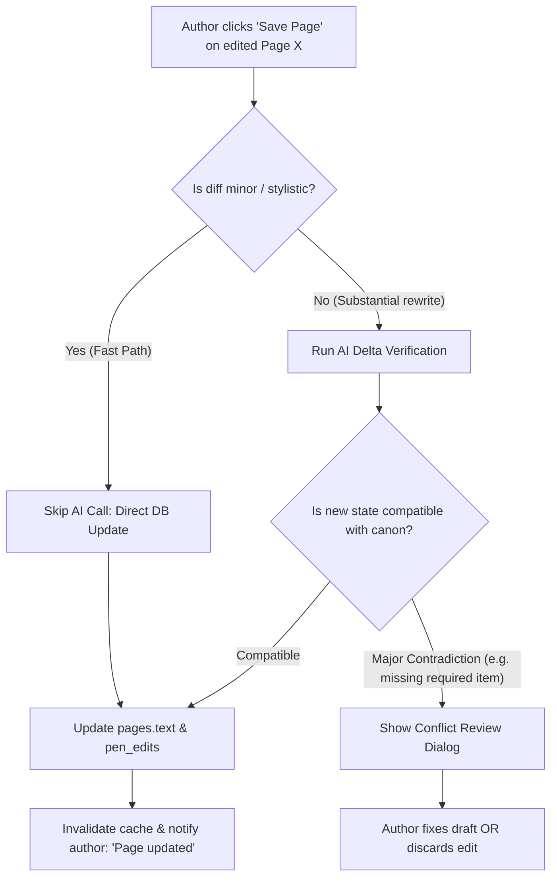

# Twistloom — Pen Post-Publish Page Prose Revision & Canon Verification Roadmap

**Date:** August 19, 2026  
**Status:** Complete (Phases 1–4 Shipped)  
**Scope:** Architecture and execution roadmap for enabling authors to edit finalized page prose in the Pen Co-Writing Editor while preserving engine canon invariants (story state deltas).

---

## Implementation Status (at a glance)

| Status | Phase | Scope | Key Deliverables & Files |
|---|---|---|---|
| ✅ **DONE** | **Phase 1: UX Action Separation** | Modal action clarity & button separation | `PageViewerModal.tsx` (`onEditPage`, `onBranch`, `onNavigate`/`onFocusEditor`), `messages/en.json`, `messages/id.json` |
| ✅ **DONE** | **Phase 2: Backend Edit API** | Ownership validation & DB update | `PATCH /api/pen/pages/:pageId/prose` in `routes/pen.ts`, `updatePenPageProse` in `services/pen.ts`, `PenApi.updatePageProse` in `pen-api.ts` |
| ✅ **DONE** | **Phase 3: Frontend Editor Mode** | In-place published page revision workspace | `editingPublishedPage` state & amber banner in `PenEditorClient.tsx`, live word/char counts, floating direction bar suppression |
| ✅ **DONE** | **Phase 4: AI Delta Gate & Conflict Review** | Heuristic diffing + AI canon invariance gate | `isPageProseDiffMinor`, `validatePublishedPageCanonInvariance`, `FinalizeVerificationDialog` integration for breaking plot conflicts |

---

## 1. Executive Summary & Core Philosophy

In traditional interactive storytelling engines, published pages are strictly immutable because downstream pages and AI memories depend on the state transitions established when those pages were published.

However, writers frequently need to:
1. **Fix typos, grammar, and formatting glitches** on past pages.
2. **Polish dialogue, sensory descriptions, and prose voice** without altering the underlying plot facts.
3. **Refine story pacing** while keeping all established canon intact.

### The Invariant Boundary
> **"Prose is flexible; canonical facts (state deltas) are the invariant boundary."**

Modifying prose on a published page is 100% safe as long as the new prose does not violate the canonical state delta (characters present, item acquisitions/losses, injuries, location pins) already committed to `story_states` and relied upon by downstream pages.

---

## 2. UX & UI Architecture

### 2.1 Explicit Separation of Actions in Page Peeks & Modals

In `PageViewerModal.tsx` and outline popovers, every published page will present two distinct, clearly separated primary actions:

```
┌─────────────────────────────────────────────────────────────────────────────┐
│ Page 2: The Whispering Woods                                                │
│ ...prose text excerpt...                                                    │
│                                                                             │
│ [ Close ]  [ Branch from here ]  [ ✏️ Edit this page ]  [ 🖋️ Continue from here ] │
└─────────────────────────────────────────────────────────────────────────────┘
```

1. **"Continue from here" / "Resume writing"** (`PenLine` icon):
   - Sets this page as the active parent (`session.currentPageId = pageId`) and switches/creates a draft slot to write the **next** page.
   - When viewing the page the author is *already* drafting after (e.g. viewing Page 2 while writing Page 3 draft), the button dynamically displays **"Resume writing"** (closing the modal and focusing the editor).
2. **"Edit this page"** (`Pencil` icon):
   - Switches `ProseEditor` into **"Editing Published Page X"** mode.
   - The author's current in-progress draft (e.g. Page 3) is safely preserved in its draft shelf slot.

### 2.2 Editor Modes (`PenEditorClient.tsx`)

`PenEditorClient` manages a top-level editor workspace state:

```ts
type EditorWorkspaceMode =
  | { mode: 'draft'; activeDraftId: string }
  | { mode: 'editing_published_page'; pageId: string; originalText: string; pageNumber: number };
```

When `mode === 'editing_published_page'`:
- The top header displays a distinct banner: `Editing Published Page 2 · [Cancel] [Save Page]`.
- `ProseEditor` loads the published page's content for in-place revision.
- Clicking **"Cancel"** exits edit mode and restores the active draft slot without saving.
- Clicking **"Save Page"** initiates the save and canon verification pipeline.

---

## 3. Backend Verification Architecture: Fast-Path vs. AI Delta Verification



### 3.1 Tier 1: 0-Cost Fast-Path (Lexical / Entity Diff)
Most post-publish edits are typo fixes, wording polishes, or minor dialogue changes. We detect these with zero LLM latency and zero credit cost:

1. **Entity Diffing**: Verify that the set of canonical entities mentioned (characters from `charactersPresent`, tracked items from `inventory`, places from `places`) remains identical.
2. **Length & Diff Distance**: If word count deviation is $< 15\%$ and no tracked entity keywords were removed or added, the backend skips the AI call entirely.
3. **Execution**: Immediately writes `pages.text` and records a `pen_edits` row (`editType: 'human_revised'`).

### 3.2 Tier 2: Slow-Path (AI Canon Delta Verification)
For larger rewrites (e.g. adding an entire new paragraph or drastically shifting dialogue):

1. **Delta Gate Execution**: The backend runs `proposePenStateUpdates` on the new prose.
2. **Invariance Check**: Compares the newly proposed state delta with the existing `story_states[pageId]`:
   - **Compatible**: All entities, inventory items, and injuries required by downstream pages remain satisfied $\rightarrow$ update commits seamlessly.
   - **Contradiction Detected**: If the new text introduces a breaking contradiction (e.g. an item needed on Page 3 is never obtained on Page 2, or a dead character appears alive), the backend returns `{ valid: false, violations }`.
3. **Conflict Resolution**: The frontend displays the existing **Finalize Verification Dialog** highlighting the conflict, allowing the author to fix the prose or proceed with an explicit override.

---

## 4. Database & API Contracts

### 4.1 `PATCH /api/pen/pages/:pageId/prose`

**Request Body:**
```json
{
  "text": "The updated published page prose...",
  "html": "<p>The updated published page prose...</p>",
  "force": false
}
```

**Response (Success):**
```json
{
  "status": "updated",
  "page": {
    "id": "page_123",
    "page": 2,
    "text": "The updated published page prose...",
    "updatedAt": "2026-08-19T13:15:00.000Z"
  }
}
```

**Response (Conflict - 422 / Needs Review):**
```json
{
  "status": "needs_review",
  "violations": [
    {
      "field": "inventory",
      "expected": "Brass Key acquired",
      "found": "Missing in revised prose",
      "severity": "high",
      "message": "Downstream Page 3 requires the Brass Key acquired on Page 2."
    }
  ]
}
```

---

## 5. Phased Implementation Plan

### ✅ Phase 1: UX Action Separation & Modal Clarification (Frontend)
- **Status:** **COMPLETE**
- **Changes Delivered:**
  - In `PageViewerModal.tsx`:
    - Distinct buttons rendered for **"Branch from here"** (`onBranch`), **"Edit this page"** (`onEditPage`), and **"Continue from here"** (`onNavigate`).
    - Smart label resolution: renders **"Resume writing"** (`onFocusEditor`) when `pageId === currentPageId` (closing modal and returning to active draft) vs. **"Continue from here"** (`onNavigate`) when viewing older pages.
  - Localized strings added to both `messages/en.json` and `messages/id.json` (`peekWriteHere`, `peekResumeWriting`, `editPageProse`, `editPageProseHint`, `pageUpdated`, `pageUpdateError`).

### ✅ Phase 2: Backend Edit Endpoint & Fast-Path Diffing (Backend)
- **Status:** **COMPLETE**
- **Changes Delivered:**
  - Route registered: `PATCH /api/pen/pages/:pageId/prose` in `Twistloom-backend/src/routes/pen.ts`.
  - Service implemented: `updatePenPageProse(userId, pageId, { text, html })` in `Twistloom-backend/src/services/pen.ts`:
    - Authenticated book ownership validation.
    - Updates `pages.text` and `pages.updatedAt`.
    - Atomically increments `books.canonVersion` so any in-flight drafts and subsequent AI calls incorporate the refreshed canon.
  - Frontend client method added: `updatePageProse(pageId, text)` on `PenApi` in `Twistloom-web/src/lib/services/pen-api.ts`.

### ✅ Phase 3: Frontend In-Place Editor Mode & Save Workflow (Frontend)
- **Status:** **COMPLETE**
- **Changes Delivered:**
  - `editingPublishedPage` workspace mode added to `PenEditorClient.tsx`:
    - Clicking **"Edit this page"** in `PageViewerModal` opens the page's prose directly in `ProseEditor`.
    - Displays an amber editing banner above `ProseEditor` with page number context, **Cancel**, and **Save page** buttons.
    - Word and character counts in the footer dynamically calculate from the active edited page text.
    - Floating direction input bar is cleanly hidden while in published page editing mode to prevent confusion with `/continue`.
    - Saving calls `penApi.updatePageProse`, invalidates React Query caches (`['pen', 'authorPage', pageId]`, `['pen', 'outline']`, `['pen', 'session', bookId]`), toasts success, and returns to the preserved active draft.
    - Canceling cleanly returns to the active draft without modifying the published page.

### ✅ Phase 4: AI Canon Delta Gate & Conflict Review (Backend + Frontend)
- **Status:** **COMPLETE**
- **Changes Delivered:**
  - **Heuristic Diff Gate (`isPageProseDiffMinor`)**:
    - Evaluates word delta ratio against `PEN_PAGE_EDIT_DIFF_TOLERANCE` ($15\%$).
    - Verifies that all tracked characters, places, and inventory items present in the original text remain preserved in the revised prose.
    - Minor edits commit immediately via the 0-cost fast-path.
  - **AI Canon Delta Recalculation & Invariance Gate (`validatePublishedPageCanonInvariance`)**:
    - When word deviation $> 15\%$ or entities differ, triggers AI state proposal (`buildPenStateProposalPrompt`) on the revised text.
    - Evaluates if required inventory items or characters from the original state were dropped while downstream child pages exist.
    - If high-severity contradictions are detected and `force !== true`, returns `{ status: 'needs_review', violations }` (HTTP 422).
  - **Conflict Review Dialog (`PenEditorClient.tsx`)**:
    - Surfaces breaking conflicts inside `FinalizeVerificationDialog` with highlighted excerpts and suggestions.
    - Supports **"Edit in draft"** (focuses prose editor to fix the excerpt) and **"Proceed anyway"** (`force = true` override).
    - When verified or forced, updates `pages.text`, syncs `story_states` (inventory, injuries, etc.), and bumps `books.canonVersion`.
