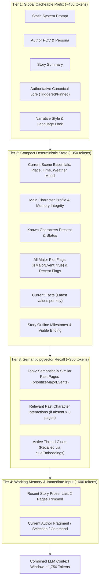
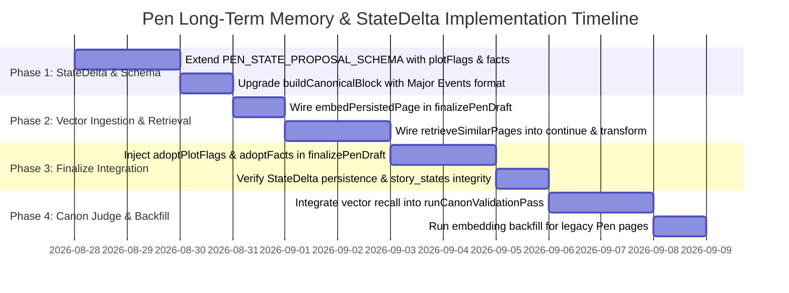

# Twistloom — Pen Long-Term Memory, Semantic Vector Retrieval & StateDelta Enhancement Roadmap

**Date:** August 27, 2026  
**Status:** Architectural Specification & Execution Roadmap (v1.0)  
**Target Files:**  
- `Twistloom-backend/src/utils/pen-prompt.ts`
- `Twistloom-backend/src/services/pen.ts`
- `Twistloom-backend/src/services/vector-memory.ts`
- `Twistloom-backend/src/utils/prompt.ts`
- `Twistloom-backend/src/db/schema.ts`
- `Twistloom-backend/src/types/pen.ts`
- `Twistloom-backend/src/types/story.ts`
- `Twistloom-backend/src/services/canon-validation.ts`

---

## Executive Summary

This document provides a comprehensive technical audit and architectural roadmap addressing **AI memory retention, token efficiency, StateDelta integrity, and semantic vector retrieval** within Twistloom's Pen (AI Co-Writing) ecosystem.

### Core Findings at a Glance

1. **Does Pen currently generate `plotFlags` in `StateDelta`?**
   - **NO.** In the current implementation of Pen (`pen-prompt.ts`, `services/pen.ts`), `PEN_STATE_PROPOSAL_SCHEMA` and `generatedStoryPage` omit `addPlotFlags`, `factUpdates`, `newThreads`, `addClues`, and `futureNoteAdd`.
   - Consequently, `extractStateDelta(...)` returns an empty array for `addPlotFlags`, and `state.plotFlags` **never accumulates new entries** across an authoring session.
   - For a 150-page story authored via Pen, `state.plotFlags` remains frozen in its initial (Page 1) state.

2. **Is Semantic Vector Embedding Applicable in Pen?**
   - **YES, and it is urgently needed.** 
   - Currently, Pen limits context strictly to `PEN_CONTEXT_PAGES = 2` plus keyword-triggered lore entries (`getTriggeredLoreEntries`).
   - Pen **fails to invoke** `embedPersistedPage(...)` or `embedStateDeltaEntities(...)` during `finalizePenDraft(...)`. As a result, pages finalized in Pen are invisible to vector memory unless retroactively processed by the background cron.
   - In loop-structured narratives (e.g., *Groundhog Day*, *Dark*, *Russian Doll*, psychological time-loops) or deep mysteries where Page 150 must recall Page 1 revelations, Pen experiences **complete amnesia** of past events unless the user explicitly authored a manual lore entry.

3. **How to Preserve Tokens & Prompt Cache While Enabling Infinite Memory?**
   - Naively dumping 150 pages or all historical state into the prompt blows past context budgets ($>60\text{k}$ tokens) and destroys provider-side prompt caching.
   - By adopting a **4-tier hybrid memory architecture** (Static Cache Prefix $\to$ Curated Canon & Major Plot Flags $\to$ Semantic Vector Retrieval $\to$ Sliding Prose Window), Pen can achieve **lossless long-range continuity across 150+ pages for under 1,800 total prompt tokens**, while maintaining $\ge 75\%$ prompt cache hit rates.

---

## 1. Deep Comparative Analysis: Interactive Engine vs. Pen Engine

| Dimension | Interactive Engine (`prompt.ts` / `generateNextPage`) | Pen Co-Writing Engine (`pen-prompt.ts` / `services/pen.ts`) | Evaluation / Gap in Pen |
|---|---|---|---|
| **Primary System Prompt** | Dynamic writing preset + rich game rules (`buildPresetSystemPrompt`), first-person thriller focus | Static const (`PEN_STORYTELLER_SYSTEM` / `PEN_TEXT_ADVENTURE_SYSTEM`), genre-agnostic, POV-flexible | **Pen Win:** Provider-side prompt caching is strictly optimized with zero interpolation in system prompt. |
| **Prose Window** | `MAX_PAGE_HISTORY = 3` full pages + selected actions + hints | `PEN_CONTEXT_PAGES = 2` full pages trimmed | **Gap:** 2 pages alone cannot sustain narrative callbacks beyond immediate scene transitions. |
| **Plot Flags & Major Events** | `formatRecentMajorEvents(plotFlags)` guarantees all `isMajorEvent: true` flags + recent plot flags are rendered (`MAX_OLDER_PLOT_FLAGS = 15`) | `buildCanonicalBlock` renders `state.plotFlags` if present, but **Pen never adds plot flags to state**! | **Severe Defect:** Because Pen never authors `addPlotFlags` in `StateDelta`, `state.plotFlags` is essentially empty for Pen books. |
| **Story Threads & Clues** | `formatActiveThreads(...)` renders active mystery threads + uses `clueEmbeddings` via `retrieveClues` for scrolled-out clues | Not included in `PEN_CONTINUE_SCHEMA`, `PEN_STATE_PROPOSAL_SCHEMA`, or `buildCanonicalBlock` | **Severe Defect:** Story threads and clues are completely absent from Pen's canonical block and state transitions. |
| **Semantic Vector Retrieval** | **Active on every turn:**<br>1. `retrieveSimilarPages`<br>2. `retrieveCharacterInteractions`<br>3. `retrievePlaceEvents`<br>4. `retrieveRelevantFutureNotes`<br>5. `retrieveClues` | **Completely Inactive:** 0 vector retrieval calls in `pen-prompt.ts` or `services/pen.ts`. | **Major Opportunity:** pgvector tables already exist in `schema.ts`; Pen just never queries them! |
| **Vector Ingestion (Write)** | Calls `embedPersistedPage(newPage)` and `embedStateDeltaEntities(newPage)` fire-and-forget after `persistPageWithState` | **Omitted:** `finalizePenDraft` does not call `embedPersistedPage` or `embedStateDeltaEntities`. | **Defect:** Published Pen pages do not get embedded immediately upon finalization. |
| **State Proposal & Finalize** | Model outputs `StateDeltaGeneration` with full delta schema (flags, inventory, injuries, threads, places, characters, plotFlags) | Model outputs `PenStateProposalResult` (inventory, injuries, scene essentials, outline milestones, action hint) | **Gap:** State proposal misses plot flags, facts, and thread clues. |

---

## 2. Examination of `pen-prompt.ts` Operations

### 2.1 `/continue` (`buildPenContinuePrompt`)
- **Current Flow:**  
  $$\text{System Prompt (Static)} + \text{Stable Sections (POV, Persona, Summary, Lore, Style, Language)} + \text{Context (Canon Block, 2 Pages Prose)} + \text{Fragment/Command}$$
- **Strengths:** 
  - Cache prefix alignment is exceptional. Stable-per-session sections precede volatile per-turn text.
  - Genre-agnostic and POV-flexible.
- **Weaknesses:**
  - `buildCanonicalBlock` outputs `PLOT FLAGS: ${flags.join(" | ")}`, but because `state.plotFlags` is empty, this line is almost always omitted.
  - No past scene recall: If the author writes on Page 150 *"I touched the grandfather clock in the basement again"*, the AI cannot retrieve what happened at the grandfather clock on Page 1 unless it was manually entered into Canonical Lore.

### 2.2 `/finalize/propose` (`buildPenStateProposalPrompt`)
- **Current Flow:**
  - AI accountant analyzes `CURRENT DRAFT` against `CURRENT SCENE` and `CURRENT INVENTORY & INJURIES`.
  - Proposes resulting inventory, injuries, scene essentials, outline beat completions, and reader choice hint.
- **Missing Elements:**
  - **`addPlotFlags`:** Does not infer whether the draft contains an important plot milestone or major turning point (`isMajorEvent: true`).
  - **`factUpdates`:** Does not extract discrete world facts (e.g., `"vault_passcode: 8841"` or `"silas_alliance: broken"`).
  - **`addClues` / `threadUpdates`:** Does not link discovered clues to active story threads.

### 2.3 Canon Checking & Delta Gate (`runFinalizeDeltaGate` & `runCanonValidationPass`)
- **Current Flow:**
  - Single-request self-reporting during `/continue`: Model returns `{ text, issues: [{ type, expected, found }] }`.
  - Delta gate on `/finalize`: Checks dirty spans and warns if spans were edited after AI generation.
  - Standalone canon pass (`services/canon-validation.ts`): Summarizes facts, plot flags (last 16), characters (last 24), and places (last 16).
- **Weaknesses:**
  - If `state.plotFlags` and `state.factsHistory` are starved of data during Pen authoring, the Canon Validation judge has no facts against which to detect contradictions!

---

## 3. The 4-Tier Memory Architecture for Pen

To achieve **reliable long-term memory across 150+ pages without exceeding context window limits or breaking prompt cache**, we define four distinct memory tiers:



### 3.1 Token Budget Breakdown for a 150-Page Pen Book

| Tier | Component | Selection Strategy | Est. Tokens | Prompt Cache Status |
|---|---|---|---|---|
| **Tier 1** | System Prompt + Persona + Lore + Style | Static const + triggered lore keywords | $400 - 550$ | **Cached** (hits provider cache across turns) |
| **Tier 2** | Scene + MC + Cast + Major Events + Facts + Outline | Deterministic extraction from `StoryState` | $300 - 450$ | Dynamic per page |
| **Tier 3** | Semantic Retrieval (Pages, Interactions, Clues) | pgvector cosine similarity ($> 0.72$) | $250 - 400$ | Dynamic on-demand |
| **Tier 4** | Last 2 Pages Prose + Author Fragment/Command | Immediate sliding window | $450 - 650$ | Volatile per turn |
| **Total** | **Full Continuation / Proposal Context** | **Hybrid deterministic + vector** | **$\approx 1,400 - 2,050$** | **$\ge 75\%$ prefix cache reuse** |

---

## 4. Solving the "Page 1 in Page 150" Loop Story Challenge

In a psychological time-loop or mystery novel, Page 1 often establishes a core anomaly:
> *Page 1: "The pocket watch was stopped at 11:14 PM, and the pendulum bore a microscopic etching of an ouroboros." (isMajorEvent: true)*

By Page 150, standard sliding-window prompts have forgotten this entirely. Here is how the hybrid architecture guarantees permanent recall:

### Mechanism A: Compact Major Event Compaction (Deterministic)
1. In `StoryState`, plot flags tagged with `isMajorEvent: true` are **never dropped** by pagination or trimming.
2. In `buildCanonicalBlock`, all major events are formatted as compact, one-line canonical anchors:
   ```text
   MAJOR STORY MILESTONES:
   - [p.1 | abandoned_clocktower] Found brass pocket watch stopped at 11:14 with ouroboros etching (MAJOR)
   - [p.42 | docks] Silas revealed that the clock mechanism controls the harbor sluice gates (MAJOR)
   - [p.118 | archive] Discovered Eliza is the clockmaker's granddaughter (MAJOR)
   ```
   *Cost:* Even with 15 major events across a 150-page epic, 15 lines consume only $\approx 220$ tokens!

### Mechanism B: Semantic Vector Search with `prioritizeMajorEvents`
When the author writes on Page 150:
> *"I rewound the silver mechanism, checking the etching beneath the glass..."*
1. Pen issues a vector query to `pageEmbeddings` using `retrieveSimilarPages(query, bookId, branchId, 150, 2, { prioritizeMajorEvents: true })`.
2. The vector distance engine detects high cosine similarity with Page 1's scene passage.
3. Pen injects a compact `RECALLED HISTORICAL CONTEXT` block into Tier 3:
   ```text
   RECALLED HISTORICAL CONTEXT:
   - Page 1 (Similarity: 0.88): Discovered the shattered pendulum and brass pocket watch stopped at 11:14 PM with the ouroboros mark.
   ```
4. The AI immediately recognizes the callback and continues the scene with 100% canon fidelity.

---

## 5. Required Technical Enhancements (Step-by-Step)

### Phase 1: Schema & Prompt Enhancements in `pen-prompt.ts`

#### 1.1 Extend `PEN_STATE_PROPOSAL_SCHEMA` with Plot Flags & Facts
Update `PenStateProposalResult` and `PEN_STATE_PROPOSAL_SCHEMA` to allow the state proposal call during `/finalize/propose` to detect major narrative events and factual revelations:

```typescript
// Twistloom-backend/src/utils/pen-prompt.ts

export type PenStateProposalPlotFlag = {
  fact: string;
  type: "clue" | "danger" | "discovery" | "event" | "relationship" | "psychological" | "world" | "other";
  isMajorEvent: boolean;
};

export type PenStateProposalFact = {
  key: string;
  value: string;
  type?: "lore" | "character" | "place" | "event" | "rule";
  reason?: string;
};

export type PenStateProposalResult = {
  inventory: PenStateProposalInventoryItem[];
  injuries: PenStateProposalInjury[];
  mood?: string;
  weather?: string;
  calendarDate?: string;
  timeOfDay?: string;
  keyEvents: string[];
  keyObjects: string[];
  outline?: PenStateProposalOutlineBeat[];
  /** NEW: Inferred plot flags from this page draft */
  plotFlags?: PenStateProposalPlotFlag[];
  /** NEW: Inferred permanent facts established on this page */
  facts?: PenStateProposalFact[];
  actionType?: string;
  actionHintText?: string;
  actionHintType?: string;
};
```

Add the corresponding JSON schema properties in `PEN_STATE_PROPOSAL_SCHEMA` and system prompt directives in `PEN_STATE_PROPOSAL_SYSTEM`:
- `plotFlags`: *"Extract 1–3 meaningful plot developments. Set isMajorEvent: true ONLY for critical revelations, major deaths, permanent world shifts, or foundational clues."*
- `facts`: *"Extract key: value facts that permanently change world state (e.g. 'safe_combination: 4092')."*

#### 1.2 Upgrade `buildCanonicalBlock` with Structured Flags & Facts Formatting
Align `buildCanonicalBlock` in `pen-prompt.ts` with `prompt.ts`'s proven formatting:
- Separate **Major Plot Events** (`isMajorEvent: true`) from minor recent plot flags.
- Display `ESTABLISHED FACTS` with latest values.
- If story threads exist, render `ACTIVE THREADS`.

```typescript
function formatPenPlotFlags(plotFlags: PlotFlag[]): string[] {
  if (!plotFlags || plotFlags.length === 0) return [];
  
  const majorFlags = plotFlags.filter(f => f.isMajorEvent);
  const recentMinorFlags = plotFlags.filter(f => !f.isMajorEvent).slice(-6);
  
  const lines: string[] = [];
  if (majorFlags.length > 0) {
    lines.push("MAJOR STORY MILESTONES (Do not contradict or forget):");
    majorFlags.forEach(f => {
      lines.push(`  - [p.${f.page}] [${f.type.toUpperCase()}] ${f.fact} (MAJOR)`);
    });
  }
  if (recentMinorFlags.length > 0) {
    lines.push("RECENT PLOT DEVELOPMENTS:");
    recentMinorFlags.forEach(f => {
      lines.push(`  - [p.${f.page}] [${f.type}] ${f.fact}`);
    });
  }
  return lines;
}
```

#### 1.3 Add Optional Semantic Vector Recall Block to `buildPenContinuePrompt`
Allow `buildPenContinuePrompt` and `buildPenTransformPrompt` to accept an optional `recalledContext?: string` parameter (populated by vector retrieval from `services/pen.ts`):

```typescript
function buildPenContextSections(canon: string, prose: string, recalledContext?: string): string[] {
  return [
    `CANONICAL STATE (do not contradict):\n${canon}`,
    ...(recalledContext?.trim() ? [`RECALLED HISTORICAL CONTEXT (semantic memory from earlier pages):\n${recalledContext.trim()}`] : []),
    `RECENT STORY:\n${prose}`,
  ];
}
```

---

### Phase 2: Service & Ingestion Updates in `services/pen.ts`

#### 2.1 Wire Semantic Vector Ingestion in `finalizePenDraft`
Directly after `persistPageWithState` and `insertStoryPage` resolve in `finalizePenDraft`:
```typescript
import { embedPersistedPage, embedStateDeltaEntities } from "./vector-memory.js";

// Inside finalizePenDraft Phase B:
newPage = await persistPageWithState({ ... });

// Fire-and-forget vector memory ingestion (matches prompt.ts generateNextPage):
embedPersistedPage(newPage);
embedStateDeltaEntities(newPage);
```

#### 2.2 Ingest Proposed Plot Flags into `generatedStoryPage`
In `finalizePenDraft`:
```typescript
// Map adopted plot flags into generatedStoryPage so extractStateDelta captures them:
const adoptedPlotFlags = Array.isArray(input.adoptPlotFlags)
  ? input.adoptPlotFlags.map(f => ({
      fact: f.fact,
      type: f.type,
      isMajorEvent: Boolean(f.isMajorEvent),
      page: pageNumber,
    }))
  : [];

if (adoptedPlotFlags.length > 0) {
  generatedStoryPage.addPlotFlags = adoptedPlotFlags;
}

const adoptedFacts = Array.isArray(input.adoptFacts)
  ? input.adoptFacts.map(f => ({
      key: f.key,
      value: f.value,
      type: f.type ?? "event",
      page: pageNumber,
      reason: f.reason,
    }))
  : [];

if (adoptedFacts.length > 0) {
  generatedStoryPage.factUpdates = adoptedFacts;
}
```

Now, when `resolvePageDelta` runs `extractStateDelta({ generatedStoryPage, expectedPageNumber, futureNoteKeys })`, `stateDelta.addPlotFlags` is populated, `processPlotFlagUpdates` appends them to `newState.plotFlags`, and `newState.isMajorEvent` is correctly stamped!

#### 2.3 Add Vector Retrieval to `continuePenDraft` and `transformPenSelection`
Before calling `buildPenContinuePrompt`:
```typescript
// Query pgvector for semantically relevant historical pages if book has >= 4 pages:
let recalledContext = "";
if (session.currentPageId && pageTexts.length >= 3) {
  const query = authorInput || (lastPage?.text ? lastPage.text.slice(0, 200) : "");
  if (query.trim().length > 10) {
    try {
      const similarPages = await retrieveSimilarPages(
        query,
        book.id,
        lastPage?.branchId ?? "main",
        pageNumber,
        2, // top 2 most relevant pages
        { prioritizeMajorEvents: true }
      );
      
      // Filter out pages that are already present in the recent prose window (last 2 pages)
      const recentPageNumbers = new Set(branch.pages.slice(-PEN_CONTEXT_PAGES).map(p => p.page));
      const distantMatches = similarPages.filter(p => !recentPageNumbers.has(p.page));
      
      if (distantMatches.length > 0) {
        recalledContext = distantMatches
          .map(p => `- Page ${p.page}: ${p.sourceText?.replace(/\n+/g, " ").slice(0, 250)}...`)
          .join("\n");
      }
    } catch (err) {
      console.warn("[continuePenDraft] Vector retrieval skipped:", err);
    }
  }
}
```

---

### Phase 3: Canon Validation & Judge Upgrades

#### 3.1 Deepen Canon Check with Semantic Vector Memory
In `src/services/canon-validation.ts` (`runCanonValidationPass`):
- Today, the judge only inspects the last 16 plot flags and 24 characters.
- Enhance the judge by querying `retrieveSimilarPages(draftText, bookId, branchId, currentPage, 3)` to feed the exact historical passages relevant to the draft being validated.
- This ensures that if the draft on Page 150 claims *"Silas was never a magistrate"*, vector retrieval pulls Page 2's introduction of Silas and the judge flags a `character_behavior` / `established_fact` high-severity violation.

---

## 6. Token Savings & Prompt Caching Protection Analysis

A primary objective is maintaining minimal token overhead while preventing amnesia.

### 6.1 Why Semantic Vector Retrieval Beats Full History Injection
- **Full History Approach (Naive):**
  - Page 150 history = 150 pages $\times 250\text{ words/page} \approx 50,000\text{ tokens}$.
  - Cost per continue request: $>\$0.05 - \$0.15$ per keystroke trigger. Exceeds rate limits and introduces severe hallucination ("lost in the middle").
- **Twistloom 4-Tier Approach (Optimized):**
  - Static Prefix: $450\text{ tokens}$ (Cached by provider at $75\%-90\%$ discount)
  - Major Milestones ($10-15$ flags): $180\text{ tokens}$
  - Vector Retrieval Top-2 Distant Snippets: $150\text{ tokens}$
  - Recent Prose (2 pages): $500\text{ tokens}$
  - **Net Uncached Volatile Tokens:** $\approx 830\text{ tokens}$.
  - **Total Cost Reduction:** $>96\%$ compared to raw context stuffing.

### 6.2 Provider Prompt Caching Invariant
Google Gemini and Anthropic Claude cache prompt prefixes starting from character 0. 
- Because `PEN_STORYTELLER_SYSTEM` and `PEN_TEXT_ADVENTURE_SYSTEM` are static constant strings, and `AUTHOR'S POV`, `AUTHOR'S PERSONA`, `STORY SUMMARY`, and `CANONICAL LORE` remain invariant across an author's entire writing session on a book, **the entire head of every Pen request is a stable cache hit**.
- Placing the dynamic vector retrieval (`RECALLED HISTORICAL CONTEXT`) directly before `RECENT STORY` ensures that all changes remain localized to the tail of the user prompt, preserving prefix cache validity across continuous `/continue` and `/transform` calls.

---

## 7. Phased Implementation Roadmap



| Phase | Milestone | Primary Files | Verification Criteria |
|---|---|---|---|
| **Phase 1** | **State Proposal Schema & Canon Block** | `utils/pen-prompt.ts`, `types/pen.ts` | `/finalize/propose` returns valid `plotFlags` and `facts`. Canonical block neatly renders Major Milestones vs Recent Developments. |
| **Phase 2** | **Vector Memory Ingestion & Read** | `services/pen.ts`, `services/vector-memory.ts` | Publishing via Pen inserts rows into `page_embeddings` and `character_embeddings`. `/continue` retrieves relevant past snippets for distant callbacks. |
| **Phase 3** | **StateDelta Accumulation in Finalize** | `services/pen.ts`, `utils/story.ts` | `state.plotFlags` monotonically accumulates across consecutive finalized Pen pages. `isMajorEvent` flags persist in `story_states`. |
| **Phase 4** | **Canon Validation & Legacy Backfill** | `services/canon-validation.ts`, `cron/backfill-embeddings.ts` | Canon judge correctly flags contradictions against Page 1 facts when testing Page 150. Backfill script covers historical Pen sessions. |

---

## 8. Summary of Answers to Core Architectural Questions

1. **Should we use semantic vector embedding in Pen?**  
   **Yes.** pgvector memory (`pageEmbeddings`, `characterEmbeddings`, `clueEmbeddings`) is fully supported in Twistloom's database architecture. Integrating it into Pen solves long-range continuity gaps at minimal token cost.
2. **Is vector embedding applicable in Pen?**  
   **Yes.** By embedding finalized pages upon publish and retrieving top-2 semantically relevant past scenes during `/continue` and `/transform`, Pen authors gain automated callbacks to distant story events without context window exhaustion.
3. **Does Pen already generate `plotFlags` in `StateDelta`?**  
   **No.** Pen currently leaves `addPlotFlags` undefined in state proposals and finalization. Implementing Phase 1 & Phase 3 will activate plot flag generation in Pen.
4. **How to guarantee Page 1 is remembered on Page 150 in "loop" stories?**  
   Through the dual anchor: **Compact Major Plot Flags** (`isMajorEvent: true` rendered permanently in the canonical block) combined with **Semantic Vector Retrieval** (`retrieveSimilarPages` with `prioritizeMajorEvents: true`).
