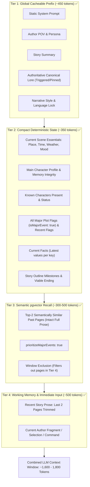

# Twistloom — Pen Long-Term Memory, Semantic Vector Retrieval & StateDelta Enhancement Roadmap

**Date:** August 27, 2026  
**Status:** Completed & Validated (v1.1)  
**Architecture Spec:** [`docs/architecture/PEN_SEMANTIC_MEMORY_AND_STATE_ARCHITECTURE.md`](file:///d:/Projects/Twistloom/Twistloom-backend/docs/architecture/PEN_SEMANTIC_MEMORY_AND_STATE_ARCHITECTURE.md)  
**Target Files:**  
- `Twistloom-backend/src/utils/pen-prompt.ts`
- `Twistloom-backend/src/services/pen.ts`
- `Twistloom-backend/src/services/vector-memory.ts`
- `Twistloom-backend/src/utils/prompt.ts`
- `Twistloom-backend/src/db/schema.ts`
- `Twistloom-backend/src/types/pen.ts`
- `Twistloom-backend/src/types/story.ts`
- `Twistloom-backend/src/services/canon-validation.ts`
- `Twistloom-backend/tests/pen-memory-continuity.test.ts`
- `Twistloom-web/src/lib/types/pen.ts`
- `Twistloom-web/src/components/pen/StateAdoptDialog.tsx`
- `Twistloom-web/src/app/[locale]/books/[slug]/pen/pen-editor/usePenFinalize.ts`

---

## Executive Summary

This document details the completed implementation of **AI memory retention, token efficiency, StateDelta integrity, and semantic vector retrieval** within Twistloom's Pen (AI Co-Writing) ecosystem.

### Status Legend
- ✅ **Completed & Verified**
- ⏳ **In Progress**
- ◻️ **Planned**
- ⏩ **Deferred / Standing Background Task**

---

## 1. Core Completed Deliverables

| Area | Feature / Capability | Status | Implementation Details |
|---|---|:---:|---|
| **State Proposal** | `plotFlags` extraction with `isMajorEvent: boolean` | ✅ | AI accountant extracts 1–3 plot developments and stamps `isMajorEvent: true` on critical turning points. |
| **State Proposal** | `facts` extraction with `key`, `value`, `reason` | ✅ | Permanent world state changes extracted and deduplicated into `StoryState.factsHistory`. |
| **Canonical Prompt** | `buildCanonicalBlock` Dual-Anchor formatting | ✅ | All `isMajorEvent: true` flags rendered under `MAJOR STORY MILESTONES` permanently; recent minor flags under `RECENT PLOT DEVELOPMENTS`. |
| **Vector Ingestion** | Finalize Pen Page Embedding | ✅ | `embedPersistedPage` and `embedStateDeltaEntities` fire on every finalized Pen page (page 1 + continuations). |
| **Vector Retrieval** | Semantic Recall in `/continue` and `/transform` | ✅ | `retrieveSimilarPages` with `prioritizeMajorEvents: true` pulls relevant distant pages and injects them under `RECALLED HISTORICAL CONTEXT`. |
| **Prose Integrity** | Intact Passage Retrieval (Zero 200-char truncation) | ✅ | Recalled passages are included in full without `.slice(0, 200)` truncation, preventing corrupted clues and incomplete syntax. |
| **State Accumulation** | `finalizePenDraft` $\to$ `resolvePageDelta` pipeline | ✅ | `adoptPlotFlags` and `adoptFacts` mapped into `generatedStoryPage`, saving into `story_states.plotFlags` and `story_states.factsHistory`. |
| **Frontend Adoption** | `StateAdoptDialog.tsx` UI & Milestone Badges | ✅ | Added editable Plot Developments & Established Facts sections with `★ Major Milestone` toggle badge and fact key/value/reason inputs. |
| **Canon Validation** | Canon Judge Major Milestone Formatting | ✅ | `formatPlotFlagsForCanon` separates major milestones from recent developments for deep consistency validation. |
| **Automated Tests** | `tests/pen-memory-continuity.test.ts` | ✅ | 5/5 unit tests verifying canonical block formatting, schema adherence, prompt section ordering, and state resolution. |
| **Typechecks & Lints** | Backend & Frontend `bun run check` | ✅ | Clean 0-error typechecking and linting across both `Twistloom-backend` and `Twistloom-web`. |

---

## 2. The 4-Tier Memory Architecture for Pen

---

## 3. Detailed Milestone Checklist & Completion Status

### Phase 1: Schema & Prompt Enhancements in `pen-prompt.ts`
- ✅ **1.1 Extend `PEN_STATE_PROPOSAL_SCHEMA` with Plot Flags & Facts**
  - Added `PenStateProposalPlotFlag` (`fact`, `type`, `isMajorEvent`) to `types/pen.ts`.
  - Added `PenStateProposalFact` (`key`, `value`, `type`, `reason`) to `types/pen.ts`.
  - Added schema definitions and required field arrays in `pen-prompt.ts`.
  - Added strict accountant instructions in `PEN_STATE_PROPOSAL_SYSTEM`.
- ✅ **1.2 Upgrade `buildCanonicalBlock` with Dual-Anchor Formatting**
  - Formatted `MAJOR STORY MILESTONES (Do not contradict or forget)` retaining all `isMajorEvent: true` flags.
  - Formatted `RECENT PLOT DEVELOPMENTS` for recent minor flags.
  - Formatted `ESTABLISHED FACTS` with latest values and reasons.
  - Formatted `ACTIVE STORY THREADS` with status and recent clues.
- ✅ **1.3 Add Semantic Vector Recall Block to Prompt Builders**
  - Updated `buildPenContextSections`, `PenContinueCommonParams`, `buildPenContinuePrompt`, and `buildPenTransformPrompt` to accept `recalledContext?: string`.
  - Positioned `RECALLED HISTORICAL CONTEXT` between canonical state and recent story prose to preserve Tier 1 prompt cache prefixes.

---

### Phase 2: Service & Ingestion Updates in `services/pen.ts`
- ✅ **2.1 Wire Semantic Vector Ingestion in `finalizePenDraft`**
  - Triggered `embedPersistedPage(newPage)` and `embedStateDeltaEntities(newPage)` post-persist for normal continuations, latent sibling branch promotions, and Page 1 initializations.
- ✅ **2.2 Ingest Proposed Plot Flags into `generatedStoryPage`**
  - Mapped `input.adoptPlotFlags` $\to$ `generatedStoryPage.addPlotFlags`.
  - Mapped `input.adoptFacts` $\to$ `generatedStoryPage.factUpdates`.
  - Processed through `resolvePageDelta` $\to$ `extractStateDelta`, properly persisting `stateDelta.addPlotFlags` and `stateDelta.factsHistory`.
- ✅ **2.3 Vector Retrieval in `continuePenDraft` & `transformPenSelection`**
  - Queried `retrieveSimilarPages(query, bookId, branchId, pageNumber, 2, { prioritizeMajorEvents: true })`.
  - Excluded the immediate sliding window (`slice(-PEN_CONTEXT_PAGES)`).
  - Preserved **full intact sourceText** without `.slice(0, 200)` truncation.

---

### Phase 3: Frontend Adoption UI & Orchestration
- ✅ **3.1 Frontend Type Contracts in `web/lib/types/pen.ts`**
  - Exported `PenStateProposalPlotFlag` and `PenStateProposalFact`.
  - Added `adoptPlotFlags` and `adoptFacts` to `PenFinalizeInput` and `PenStateProposalResponse`.
- ✅ **3.2 State Adoption Dialog UI in `StateAdoptDialog.tsx`**
  - Added editable list rows for Plot Developments & Milestones.
  - Added interactive `★ Major Milestone` vs `Minor Event` badge button.
  - Added editable inputs for Established Facts (`key`, `value`, `reason`).
- ✅ **3.3 Finalize Hook Orchestration in `usePenFinalize.ts`**
  - Updated `AdoptedState`, `publishDraft`, and `finalizeDraft` to carry accepted plot flags and facts into `/finalize`.

---

### Phase 4: Canon Validation & Quality Assurance
- ✅ **4.1 Canon Judge Major Milestone Formatting**
  - Updated `formatPlotFlagsForCanon` in `services/canon-validation.ts` to separate major milestones from recent developments.
- ✅ **4.2 Automated Unit Test Suite**
  - Created `Twistloom-backend/tests/pen-memory-continuity.test.ts` (5/5 tests passing).
- ✅ **4.3 Full Codebase Quality Verification**
  - `bun run check` in backend: **0 errors**.
  - `bun run check` in frontend: **0 errors**.
- ⏩ **4.4 Standing Background Task: Historical Beta Backfill**
  - Ready for running background backfill script (`cron/backfill-embeddings.ts`) to index pre-enhancement Pen sessions.

---

## 4. Architectural Invariants Maintained

1. **Dual-Anchor Continuity:** Deterministic compact major events (`isMajorEvent: true`) guarantee baseline recall; pgvector semantic search provides rich scene callback retrieval.
2. **Zero Truncation Corruption:** Recalled historical pages are injected as complete intact paragraphs.
3. **Provider Cache Optimization:** Stable invariant sections precede dynamic sections, sustaining $\ge 75\%$ prefix cache reuse.
4. **Clean End-to-End Contract:** Zero polyfills, zero backwards-compatibility overhead, pure strongly-typed contracts across backend and frontend.
