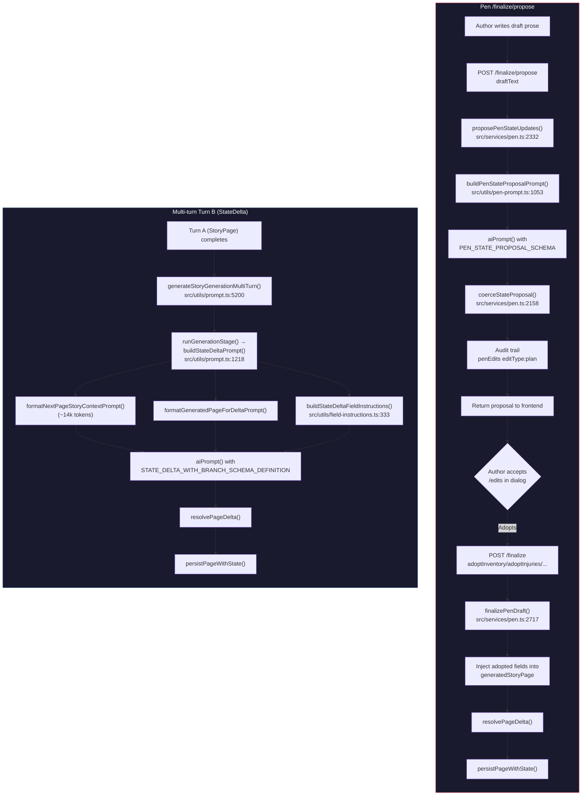

# Pen State Proposal vs Multi-turn Turn B: State Derivation DRY Roadmap

> **Created**: 2026-09-01
> **Scope**: Audit of overlapping state-derivation logic between Pen `/finalize/propose` and multi-turn Turn B (StateDelta), with a concrete DRY extraction plan.
> **Status**: Analysis complete; awaiting Open Questions decisions before implementation.

---

## 1. Executive Summary

Pen's `/finalize/propose` and multi-turn Turn B both perform the **same conceptual job**: read a story page and infer what changed in the story state (inventory, injuries, scene metadata, facts, flags). They diverge in execution model, schema scope, context budget, and human-in-the-loop flow — but share ~60% of their coercion logic and field semantics.

This roadmap proposes **3 targeted DRY extractions** (IMP-04, IMP-05, IMP-06) that eliminate duplicated validation/coercion code without unifying the two pipelines. Full unification is explicitly **not recommended** due to semantic and architectural differences documented in §3.

---

## 2. Status Matrix

| # | Item | Status | Owner |
|---|---|---|---|
| — | Core analysis & comparison | ✅ Complete | AI |
| — | Bug report §7 (brief summary) | ✅ Complete | AI |
| — | This roadmap document | ✅ Complete | AI |
| IMP-04 | Shared inventory/injury coercion | ⬜ Not started | TBD |
| IMP-05 | Shared field instruction fragments | ⬜ Not started | TBD |
| IMP-06 | Shared plot flag / fact coercion | ⬜ Not started | TBD |
| — | Open Question: Inventory semantics | ⏳ Pending decision | You |
| — | Open Question: Fact field naming | ⏳ Pending decision | You |
| — | Open Question: Implementation order | ⏳ Pending decision | You |

---

## 3. Architectural Comparison

### 3.1 High-Level Flow



### 3.2 Side-by-Side Comparison

| Dimension | Pen `/finalize/propose` | Multi-turn Turn B |
|---|---|---|
| **Entry point** | `POST /api/pen/sessions/:id/finalize/propose` | `generateStoryGenerationMultiTurn()` automatic after Turn A |
| **Service function** | `proposePenStateUpdates()` (`src/services/pen.ts:2332`) | `runGenerationStage()` (`src/utils/prompt.ts:5141`) |
| **Prompt builder** | `buildPenStateProposalPrompt()` (`src/utils/pen-prompt.ts:1053`) | `buildStateDeltaPrompt()` (`src/utils/prompt.ts:1218`) |
| **Schema** | `PEN_STATE_PROPOSAL_SCHEMA` (`src/utils/pen-prompt.ts:862`) | `STATE_DELTA_WITH_BRANCH_SCHEMA_DEFINITION` (`src/schema/story.ts:704`) |
| **Output semantics** | **Full replacement** — model returns COMPLETE resulting state | **Delta** — model returns only changes; engine merges |
| **Schema field count** | 13 fields | ~30 fields |
| **Context budget** | ~3–5k tokens (2 pages via `PEN_CONTEXT_PAGES`) | ~14k+ tokens (5 pages via `formatPreviousPagesForPrompt`) |
| **Prose context** | `buildProseContext()` (last 2 pages) | `formatPreviousPagesForPrompt()` (5 pages + current page) |
| **Canonical state** | `buildCanonicalBlock()` (compact rendered string) | `formatNextPageStoryContextPrompt()` (full structured context) |
| **Human review** | ✅ Proposal → author accepts/edits → adopts via `/finalize` | ❌ Fully automated |
| **Credit cost** | Free (`PEN_FINALIZE_PROPOSE` = 0) | Part of page generation credit |
| **Audit trail** | `penEdits` row with `editType: 'plan'` | No separate audit; embedded in generation |
| **Action classification** | ✅ Proposes `actionType` + `actionHint` (D-4 core) | ❌ Not in delta scope |
| **Vector memory** | ❌ Not used | ✅ `relevantPastEventsBlock` from pgvector |
| **Field instructions** | Inline in `PEN_STATE_PROPOSAL_SYSTEM` system prompt | `buildStateDeltaFieldInstructions()` (filtered `stage: 'delta'`) |

### 3.3 Field-Level Overlap Matrix

| Field | Pen Schema | Turn B Schema | Shape Match? | Semantic Match? | Notes |
|---|---|---|---|---|---|
| `inventory` | `PenStateProposalInventoryItem[]` | `INVENTORY_ITEM_SCHEMA[]` | ✅ Near-identical | ⚠️ Different | Pen = full replacement; Turn B = delta. Item shape overlaps ~80% |
| `injuries` | `PenStateProposalInjury[]` | `INJURY_SCHEMA[]` | ✅ Near-identical | ⚠️ Different | Pen = full replacement; Turn B = delta. Item shape overlaps ~80% |
| `mood` | `enum moods` | `enum moods` (page stage) | ✅ Identical | ✅ Identical | Both constrained to same enum |
| `weather` | `enum placeWeathers` | `enum placeWeathers` (page stage) | ✅ Identical | ✅ Identical | Both constrained to same enum |
| `calendarDate` | `string YYYY-MM-DD` | `string yyyy-MM-dd` | ✅ Identical | ✅ Identical | Same format |
| `timeOfDay` | `string` | `string` | ✅ Identical | ✅ Identical | Same semantics |
| `keyEvents` | `string[]` | `string[]` (page stage) | ✅ Identical | ✅ Identical | Both editorial scene metadata |
| `keyObjects` | `string[]` | `string[]` (page stage) | ✅ Identical | ✅ Identical | Both editorial scene metadata |
| `plotFlags` | `{fact, type, isMajorEvent}[]` | `addPlotFlags` (same shape) | ✅ Identical | ✅ Identical | Same schema structure |
| `facts` | `{key, value, type?, reason?}[]` | `factUpdates` (same + `page` field) | ⚠️ Near-identical | ✅ Identical | Pen omits `page`; Turn B includes it |
| `outline` | Top-level `outline[]` with `isDone`/`doneAtPage` | Nested in `viableEnding.outline` | ⚠️ Different nesting | ✅ Same concept | Pen surfaces as top-level; Turn B nests |
| `actionType` | `enum actionTypes` | ❌ Not in delta | — | — | Pen-only (D-4 core) |
| `actionHintText` | `string` | ❌ Not in delta | — | — | Pen-only (D-4 core) |
| `actionHintType` | `enum actionHintTypes` | ❌ Not in delta | — | — | Pen-only (D-4 core) |
| `newCharacters` | ❌ | `INITIAL_CHARACTER_SCHEMA[]` | — | — | Turn B-only |
| `updatedCharacters` | ❌ | `UPDATE_CHARACTER_SCHEMA[]` | — | — | Turn B-only |
| `relationshipUpdates` | ❌ | `RELATIONSHIP_UPDATE_SCHEMA[]` | — | — | Turn B-only |
| `newPlaces` / `updatedPlaces` | ❌ | Place schemas | — | — | Turn B-only |
| `contextHistory` | ❌ | `string` | — | — | Turn B-only |
| `newThreads` / `updateThreads` | ❌ | Thread schemas | — | — | Turn B-only |
| `futureNoteAdd` / `Remove` | ❌ | `FUTURE_NOTE_SCHEMA[]` | — | — | Turn B-only |
| `traumaTagAdd` / `Remove` | ❌ | `string[]` | — | — | Turn B-only |
| `flagUpdates` (psychological) | ❌ | `{type, level}[]` | — | — | Turn B-only |
| `viableEnding` | ❌ (separate `/ending` endpoint) | `VIABLE_ENDING_SCHEMA` | — | — | Turn B-only |
| `minutesPassed` | ❌ | `number` | — | — | Turn B-only |
| `branchNames` | ❌ | `string[]` | — | — | Turn B-only |

**Overlap summary**: 10 fields are identical or near-identical in shape and semantics. 3 fields (inventory, injuries, facts) share shape but differ in replacement-vs-delta semantics. 3 fields are Pen-only. ~17 fields are Turn B-only.

---

## 4. Prompt Architecture Comparison

### 4.1 Pen State Proposal Prompt


**Source file**: `src/utils/pen-prompt.ts:1053–1135`
**System prompt**: `PEN_STATE_PROPOSAL_SYSTEM` (static const, `src/utils/pen-prompt.ts:779–800`)
**Estimated tokens**: ~3–5k

### 4.2 Turn B StateDelta Prompt

```mermaid
flowchart LR
    subgraph TASK["Task prompt"]
        T1["formatStateDeltaTaskPrompt()<br/>src/utils/prompt.ts:3172"]
    end

    subgraph CONTEXT["Story context (~14k tokens)"]
        C1["CURRENT PHASE + phaseGoal"]
        C2["MAIN CHARACTER (POV)<br/>+ inventory + injuries"]
        C3["STORY CONTEXT<br/>(contextHistory + temporal)"]
        C4["RELEVANT PAST EVENTS<br/>(pgvector retrieval)"]
        C5["CURRENT FACTS"]
        C6["PREVIOUS PAGES<br/>(5 pages of prose)"]
        C7["CURRENT PAGE<br/>(the generated page)"]
        C8["CURRENT SITUATION"]
        C9["ACTION SELECTION"]
    end

    subgraph DELTA["Delta-specific"]
        D1["GENERATED PAGE:<br/>formatGeneratedPageForDeltaPrompt()"]
        D2["NARRATIVE RULES:<br/>formatNextPageNarrativePrompt()"]
        D3["FIELD INSTRUCTIONS:<br/>buildStateDeltaFieldInstructions()<br/>(delta-stage sections only)"]
    end

    TASK --> CONTEXT --> DELTA

    style TASK fill:#1a3a1a,stroke:#4ade80,color:#fff
    style CONTEXT fill:#1a2a3a,stroke:#60a5fa,color:#fff
    style DELTA fill:#3a1a2a,stroke:#f472b6,color:#fff
```



**Source file**: `src/utils/prompt.ts:1218–1229`
**Context builder**: `formatNextPageStoryContextPrompt()` (`src/utils/prompt.ts:3488`)
**Field instructions**: `buildStateDeltaFieldInstructions()` (`src/utils/field-instructions.ts:333`)
**Estimated tokens**: ~14k+

### 4.3 Shared Prompt Infrastructure

Both systems already share these building blocks:

| Component | Pen Usage | Turn B Usage | File |
|---|---|---|---|
| `buildCanonicalBlock()` | Direct call in `buildPenStateProposalPrompt` | Not used (uses `formatNextPageStoryContextPrompt` instead) | `src/utils/pen-prompt.ts:213` |
| `createNarrativeStyle()` |间接 via `buildStablePenSections` | Indirect via `formatNextPageNarrativePrompt` | `src/utils/narrative-style.ts` |
| `getStoryStateInfo()` | Indirect via `buildCanonicalBlock` | Direct in `formatNextPageStoryContextPrompt` | `src/utils/story.ts` |
| `resolvePageDelta()` | Called in `finalizePenDraft` after adoption | Called after Turn B completes | `src/utils/prompt.ts` |
| `advanceStoryState()` | Called in `finalizePenDraft` | Called before Turn B | `src/utils/story.ts` |
| `processPlotFlagUpdates()` | Applied via `resolvePageDelta` | Applied via `resolvePageDelta` | `src/utils/story.ts` |
| `processFactUpdates()` | Applied via `resolvePageDelta` | Applied via `resolvePageDelta` | `src/utils/story.ts` |

---

## 5. Coercion Logic Comparison

### 5.1 Inventory Coercion

| Step | Pen (`coerceStateProposalInventoryItem`) | Turn B (schema-level + `extractStateDelta`) |
|---|---|---|
| **Name validation** | `typeof r.name === "string"`, trim, non-empty | Schema `required: ['name']` |
| **Amount** | `Math.max(0, Math.floor(amountRaw))` if finite number, else fallback to existing | Schema `type: 'integer'`, auto-remove on 0 |
| **Traits** | Array of strings, capped at `PEN_FINALIZE_PROPOSE_MAX_TRAITS`, each trimmed/capped | Schema `items: buildTraitItemSchema(...)` |
| **Where** | String, trimmed, capped at `PEN_FINALIZE_PROPOSE_MAX_ITEM_LENGTH` | Schema `type: 'string'` |
| **Acquisition metadata** | `pageAcquired` from existing or `expectedPageNumber`; `placeId` from existing | `pageAcquired` required in schema; `placeId` optional |
| **Matching** | Case-insensitive name match against `currentState.inventory` | No matching (delta semantics — engine merges) |
| **Max items** | `PEN_FINALIZE_PROPOSE_MAX_INVENTORY_ITEMS` (route validation) | No explicit cap (schema-level) |

**Overlap**: ~80% of the item-level validation logic is identical. The key difference is matching against current state (Pen) vs. no matching (Turn B).

### 5.2 Injury Coercion

| Step | Pen (`coerceStateProposalInjury`) | Turn B (schema-level + `extractStateDelta`) |
|---|---|---|
| **Required fields** | `bodyPart` + `description` (strings, non-empty) | Schema `required: ['bodyPart', 'description', 'category', 'severity', 'decayPerPage']` |
| **Severity** | `Math.min(1, Math.max(0, severityRaw))` if finite number | Schema `type: 'number'` (0–1) |
| **Category** | Validated against `injuryCategories` enum | Schema `enum: [...injuryCategories]` |
| **Consequences** | String, trimmed, capped | Schema `type: 'string'` |
| **Decay** | ❌ Not in Pen schema | ✅ `decayPerPage` required in Turn B |
| **Acquisition metadata** | `pageAcquired` from existing or `expectedPageNumber` | `pageAcquired` required in schema |
| **Matching** | Case-insensitive bodyPart+description match | No matching (delta semantics) |

**Overlap**: ~70% of the validation logic is identical. Turn B requires `decayPerPage` (auto-decay engine); Pen doesn't expose it.

### 5.3 Plot Flag / Fact Coercion

| Step | Pen (`coerceStateProposal` lines 2231–2259) | Turn B (schema + `processPlotFlagUpdates` / `processFactUpdates`) |
|---|---|---|
| **Plot flag fact** | String, trimmed, capped at `PEN_ESSENTIALS_MAX_ITEM_LENGTH * 2` | Schema `type: 'string'` |
| **Plot flag type** | Validated against `plotFlagTypes`, fallback `"discovery"` | Schema `enum: [...plotFlagTypes]` |
| **Plot flag isMajorEvent** | `Boolean(raw.isMajorEvent)` | Schema `type: 'boolean'` |
| **Fact key** | Snake-cased, trimmed, lowercased, regex clean, capped at 60 chars | Schema `type: 'string'` (FACT_KEY_FORMAT) |
| **Fact value** | String, trimmed, capped at 200 chars | Schema `type: 'string'` |
| **Fact type** | Validated against `factTypes`, optional | Schema `enum: [...Object.keys(factTypes)]` |
| **Fact reason** | String, trimmed, capped at 200 chars | Schema `type: 'string'` |

**Overlap**: ~85% identical. Pen does more aggressive string cleaning (snake_case normalization, length caps); Turn B relies on schema-level constraints.

---

## 6. DRY Extraction Plan

### 6.1 IMP-04: Shared Inventory/Injury Coercion

**New file**: `src/utils/state-coercion.ts`

```typescript
// src/utils/state-coercion.ts

import type { InventoryItem, Injury, StoryState } from "../types/story.js";
import { injuryCategories } from "../types/character.js";

/** Options for inventory item coercion. */
export type InventoryCoercionOptions = {
  /** Max items to return. */
  maxItems: number;
  /** Max string length for name/where/traits. */
  maxLength: number;
  /** Max traits per item. */
  maxTraits: number;
  /** Page number to stamp on newly-acquired items. */
  pageNumber: number;
};

/**
 * Coerces raw AI output or author-adopted arrays into validated InventoryItem[].
 * Shared by Pen `/finalize/propose` and multi-turn Turn B.
 *
 * @param rawItems - Raw array from AI output or author adoption
 * @param currentState - Current story state for matching existing items (Pen: full replacement; Turn B: pass null for delta)
 * @param options - Coercion options (maxItems, maxLength, etc.)
 * @returns Validated InventoryItem array
 */
export function coerceInventoryItems(
  rawItems: unknown[],
  currentState: StoryState | null,
  options: InventoryCoercionOptions,
): InventoryItem[] { ... }

/** Options for injury coercion. */
export type InjuryCoercionOptions = {
  /** Max injuries to return. */
  maxItems: number;
  /** Max string length for bodyPart/description/consequences. */
  maxLength: number;
  /** Page number to stamp on newly-sustained injuries. */
  pageNumber: number;
};

/**
 * Coerces raw AI output or author-adopted arrays into validated Injury[].
 * Shared by Pen `/finalize/propose` and multi-turn Turn B.
 */
export function coerceInjuries(
  rawInjuries: unknown[],
  currentState: StoryState | null,
  options: InjuryCoercionOptions,
): Injury[] { ... }
```

**What moves**:
- `coerceStateProposalInventoryItem()` (`src/services/pen.ts:2051–2096`) → `coerceInventoryItems()`
- `coerceStateProposalInjury()` (`src/services/pen.ts:2105–2148`) → `coerceInjuries()`

**What stays in `pen.ts`**:
- `coerceStateProposal()` becomes a thin wrapper calling `coerceInventoryItems()` + `coerceInjuries()` + Pen-specific fields (outline, plotFlags, facts, actionType/hint)

**Callers**:
- `pen.ts:coerceStateProposal()` → passes `maxItems: PEN_FINALIZE_PROPOSE_MAX_INVENTORY_ITEMS`, `pageNumber: expectedPageNumber`
- `prompt.ts:extractStateDelta()` → passes `maxItems: MAX_INVENTORY_ITEM`, `pageNumber: currentPage`, `currentState: null` (delta semantics)

**Effort**: 1 hr | **Risk**: Low | **Priority**: P3

### 6.2 IMP-05: Shared Field Instruction Fragments

**Modified file**: `src/utils/field-instructions.ts`

Extract named instruction fragments for the overlapping fields:

```typescript
// src/utils/field-instructions.ts (additions)

/** Shared inventory field instruction — used by both Pen state proposal and Turn B delta. */
export const INVENTORY_FIELD_INSTRUCTIONS = `inventory
  - Items currently in MC's possession. Can include the amount, traits, and where it currently located.
  - Max ${MAX_INVENTORY_ITEM} different items. Only include that actually matters to the plot.
  - To remove an item, explicitly set its amount to 0 (system will auto-remove).
  - If no changes, output empty array or omit this field entirely.
  - Otherwise, MUST include all current items with updated values and/or new item if any.`;

/** Shared injuries field instruction — used by both Pen state proposal and Turn B delta. */
export const INJURIES_FIELD_INSTRUCTIONS = `injuries
  - Injuries are auto-decaying, ONLY update when character takes action that treats/worsens injury.
  - If an action is taken to heal, or anything made injury worse, update the injury severity and description accordingly.
  - If healed, set severity to 0 (system will auto-remove fully healed injuries).
  - If healed but leaves permanent scar/story relevance, move to character's appearance.
  - If no meaningful injury-related action occurs, output empty array or omit this field entirely.
  - Otherwise, MUST include all previous injuries with updated values and/or new injury if any.
  - consequences: update any that affect the storyline (e.g. "Can't run fast, can't lift heavy objects").`;

/** Shared plot flags field instruction fragment. */
export const PLOT_FLAGS_FIELD_INSTRUCTIONS = `addPlotFlags
  - Add ONLY for crucial story developments that impact narrative trajectory and become established canon (max 2 per page).
  - Do NOT add for temporary actions, routine events, minor clues, short-lived details, or if no lasting story state changed.
  - Use for major revelations, death, betrayal, irreversible decisions, or major shifts in story direction.
  - fact: describe the newly established story fact clearly and specifically (subject + verb + object).
  - isMajorEvent: true only for irreversible events or major turning points with lasting consequences.`;

/** Shared facts field instruction fragment. */
export const FACTS_FIELD_INSTRUCTIONS = `factUpdates
  - Represents long-term story memory, discoveries, or important established facts that influence future turns.
  - key: consistent snake_case. Type can be one of the FACT TYPE OPTIONS.
  - value: latest known state. Prefer concise value over long sentence.
  - reason: 1-sentence, why or how it happened or changed.
  - Facts should be objectively true within the story after this page ends.`;
```

**What changes**:
- `buildStateDeltaFieldInstructions()` replaces inline inventory/injuries/flags/facts text with references to the shared constants
- `PEN_STATE_PROPOSAL_SYSTEM` system prompt replaces its inline rules with references to the same shared constants (composed into the system prompt string)

**Effort**: 45 min | **Risk**: Low | **Priority**: P3

### 6.3 IMP-06: Shared Plot Flag / Fact Coercion

**New file**: `src/utils/state-coercion.ts` (extends IMP-04)

```typescript
// src/utils/state-coercion.ts (additions)

import type { PlotFlagType, FactType } from "../types/story.js";
import { plotFlagTypes, factTypes } from "../types/story.js";

/** Coerces raw AI output into validated plot flags. */
export function coercePlotFlags(rawFlags: unknown[]): Array<{
  fact: string;
  type: PlotFlagType;
  isMajorEvent: boolean;
}> { ... }

/** Coerces raw AI output into validated fact updates. */
export function coerceFactUpdates(rawFacts: unknown[]): Array<{
  key: string;
  value: string;
  type?: FactType;
  reason?: string;
}> { ... }
```

**What moves**:
- `coerceStateProposal` lines 2231–2259 (plotFlags loop) → `coercePlotFlags()`
- `coerceStateProposal` lines 2245–2259 (facts loop) → `coerceFactUpdates()`

**Callers**:
- `pen.ts:coerceStateProposal()` → calls `coercePlotFlags(output.plotFlags)` + `coerceFactUpdates(output.facts)`
- `prompt.ts:extractStateDelta()` → can call `coercePlotFlags()` + `coerceFactUpdates()` instead of relying solely on schema validation

**Effort**: 30 min | **Risk**: Low | **Priority**: P3

---

## 7. File Reference

| File | Role in Pen | Role in Turn B |
|---|---|---|
| `src/services/pen.ts` | `proposePenStateUpdates()` (L2332), `finalizePenDraft()` (L2717), `coerceStateProposal()` (L2158), `coerceStateProposalInventoryItem()` (L2051), `coerceStateProposalInjury()` (L2105) | — |
| `src/utils/pen-prompt.ts` | `buildPenStateProposalPrompt()` (L1053), `PEN_STATE_PROPOSAL_SYSTEM` (L779), `PEN_STATE_PROPOSAL_SCHEMA` (L862), `buildCanonicalBlock()` (L213) | — |
| `src/utils/prompt.ts` | — | `buildStateDeltaPrompt()` (L1218), `formatStateDeltaTaskPrompt()` (L3172), `formatNextPageStoryContextPrompt()` (L3488), `generateStoryGenerationMultiTurn()` (L5200) |
| `src/utils/field-instructions.ts` | — | `buildStateDeltaFieldInstructions()` (L333), `buildNextPageFieldInstructionSections()` (L45) |
| `src/schema/story.ts` | — | `STATE_DELTA_WITH_BRANCH_SCHEMA_DEFINITION` (L704), `INVENTORY_ITEM_SCHEMA` (L61), `INJURY_SCHEMA` (L88), `STORY_STATE_GENERATION_SCHEMA` (L557) |
| `src/utils/state-coercion.ts` | **NEW** — shared coercion functions | **NEW** — shared coercion functions |
| `src/types/story.ts` | `InventoryItem`, `Injury`, `PlotFlag`, `FactUpdate` types | Same types |

---

## 8. Open Questions

### OQ-1: Inventory Coercion — Should Pen adopt Turn B's delta semantics?

**Context**: Currently Pen uses **full replacement** semantics for inventory/injuries (the model returns the COMPLETE resulting inventory; the code must carry forward every item that persists). Turn B uses **delta** semantics (the model returns only changes; the engine merges via `resolvePageDelta`). The shared `coerceInventoryItems()` function needs to handle both patterns.

**Options**:

| Option | Approach | Pros | Cons |
|---|---|---|---|
| **A (Recommended)** | `coerceInventoryItems()` always does full-replacement coercion (matching current Pen behavior). Turn B continues using `resolvePageDelta` for merging after schema-level validation. | Simple; no behavior change; shared function handles the "validate raw items into typed objects" step that both paths need. | Turn B's schema-level validation stays separate (but that's fine — it's a thin layer). |
| **B** | `coerceInventoryItems()` accepts a `mode: 'full' | 'delta'` parameter and handles both. | Unified entry point. | Adds complexity; Turn B's delta merge is deeply integrated with `resolvePageDelta` and `extractStateDelta` — ripping it out risks regressions. |
| **C** | Don't extract shared coercion; keep Pen and Turn B separate. | Zero risk. | Perpetuates duplication. |

**Recommendation**: **Option A**. The shared function extracts the "validate raw AI output into typed `InventoryItem` / `Injury` objects" step. Both Pen and Turn B need this. The delta-merge step (`resolvePageDelta`) stays separate in `prompt.ts` — it's a different layer of the pipeline.

---

### OQ-2: Fact field naming — Align `facts` vs `factUpdates`?

**Context**: Pen's schema uses `facts` as the field name; Turn B uses `factUpdates`. The underlying shape is near-identical (both have `key`, `value`, `type?`, `reason?`; Turn B adds `page`).

**Options**:

| Option | Approach | Pros | Cons |
|---|---|---|---|
| **A (Recommended)** | Keep both names. The shared `coerceFactUpdates()` function takes a raw array and returns typed objects — callers map the result to their own field name. | No breaking changes; Pen's API contract stays stable; Turn B's schema stays stable. | Two names for the same concept (minor cosmetic). |
| **B** | Rename Pen's `facts` to `factUpdates` in `PEN_STATE_PROPOSAL_SCHEMA` and `PenStateProposalResult`. | Perfect alignment. | **Breaking change** for Pen frontend; requires coordinated deploy. |
| **C** | Rename Turn B's `factUpdates` to `facts` in `STATE_DELTA_SCHEMA_DEFINITION`. | Perfect alignment. | **Breaking change** for Turn B; touches core schema used by all generation paths. |

**Recommendation**: **Option A**. The naming difference is cosmetic and doesn't cause bugs. The shared coercion function abstracts over it.

---

### OQ-3: Implementation order — Sequential or parallel?

**Context**: IMP-04 (inventory/injury), IMP-05 (field instructions), IMP-06 (plot flags/facts) are independent extractions that don't block each other. However, IMP-04 creates the new `state-coercion.ts` file that IMP-06 extends.

**Options**:

| Option | Approach | Pros | Cons |
|---|---|---|---|
| **A (Recommended)** | IMP-04 first (creates `state-coercion.ts`), then IMP-06 (extends same file), then IMP-05 (independent file change). | Logical file creation order; IMP-06 reuses IMP-04's file. | Sequential; slightly slower. |
| **B** | All three in parallel as separate PRs. | Maximum speed. | IMP-06 PR depends on IMP-04's file existing; merge conflicts possible. |
| **C** | IMP-04 + IMP-06 in one PR (same file), IMP-05 as separate PR. | Balances cohesion and reviewability. | Larger PR for the coercion changes. |

**Recommendation**: **Option A** or **Option C**. If you prefer smaller PRs, go A. If you prefer fewer PRs, go C. IMP-05 is always independent.

---

### OQ-4: Should Turn B's schema-level inventory/injury validation be replaced with the shared coercer?

**Context**: Currently Turn B validates inventory/injuries via JSON schema constraints (`INVENTORY_ITEM_SCHEMA`, `INJURY_SCHEMA`) at the `aiPrompt` level, then `extractStateDelta` does minimal post-processing. The shared `coerceInventoryItems()` would add an explicit validation layer.

**Options**:

| Option | Approach | Pros | Cons |
|---|---|---|---|
| **A (Recommended)** | Keep Turn B's schema-level validation as-is. The shared coercer is used by Pen only (for now). Turn B can adopt it later as a separate task. | Zero risk to Turn B; incremental adoption. | Duplication stays in Turn B temporarily. |
| **B** | Replace Turn B's schema validation with `coerceInventoryItems()`. | Maximum DRY. | Higher risk; touches the core generation pipeline; needs thorough testing. |
| **C** | Add `coerceInventoryItems()` as a post-schema validation step in Turn B (belt-and-suspenders). | Extra safety. | Redundant validation; slight perf cost. |

**Recommendation**: **Option A** for initial implementation. Option B can be a follow-up task after the shared coercer is battle-tested in Pen.

---

## 9. Testing Strategy

### 9.1 Unit Tests for `state-coercion.ts`

- `coerceInventoryItems()`:
  - Valid items → correctly typed `InventoryItem[]`
  - Missing `name` → item dropped
  - `amount: 0` → item preserved (engine auto-removes later)
  - Exceeds `maxItems` → truncated
  - String length exceeds `maxLength` → trimmed
  - Non-finite `amount` → falls back to existing (Pen mode) or dropped (delta mode)
  - `traits` exceeding `maxTraits` → truncated
  - `pageAcquired` stamped correctly for new vs existing items

- `coerceInjuries()`:
  - Valid injuries → correctly typed `Injury[]`
  - Missing `bodyPart` or `description` → injury dropped
  - `severity` out of 0–1 range → clamped
  - Invalid `category` → falls back to existing or dropped
  - `pageAcquired` stamped correctly

- `coercePlotFlags()`:
  - Valid flags → correctly typed
  - Invalid `type` → fallback to `"discovery"`
  - Empty `fact` → dropped
  - `isMajorEvent` coerced to boolean

- `coerceFactUpdates()`:
  - Valid facts → correctly typed with snake_case key
  - Invalid key characters → cleaned
  - Missing `key` or `value` → dropped
  - `type` validated against `factTypes`

### 9.2 Integration Tests

- Pen `/finalize/propose` → verify proposal output unchanged (regression)
- Pen `/finalize` with adopted inventory → verify page publishes correctly
- Multi-turn Turn B generation → verify delta output unchanged (regression)

---

## 10. Rollout Plan

| Phase | What | Risk | Rollback |
|---|---|---|---|
| **1** | Create `src/utils/state-coercion.ts` with `coerceInventoryItems()` + `coerceInjuries()` | Low | Delete file; revert import changes |
| **2** | Refactor `pen.ts:coerceStateProposal()` to use shared coercers | Low | Revert to inline coercion |
| **3** | Extract shared field instruction fragments into `field-instructions.ts` | Low | Revert to inline strings |
| **4** | Add `coercePlotFlags()` + `coerceFactUpdates()` to `state-coercion.ts` | Low | Delete additions |
| **5** | Refactor `pen.ts:coerceStateProposal()` to use shared flag/fact coercers | Low | Revert to inline coercion |
| **6** | (Optional, follow-up) Adopt shared coercers in Turn B's `extractStateDelta` | Medium | Revert to schema-only validation |

---

## 11. Summary

| Category | Count |
|---|---|
| Shared infrastructure already in place | 7 components |
| New shared functions proposed | 4 (`coerceInventoryItems`, `coerceInjuries`, `coercePlotFlags`, `coerceFactUpdates`) |
| Shared field instruction fragments proposed | 4 (`INVENTORY_FIELD_INSTRUCTIONS`, `INJURIES_FIELD_INSTRUCTIONS`, `PLOT_FLAGS_FIELD_INSTRUCTIONS`, `FACTS_FIELD_INSTRUCTIONS`) |
| New files created | 1 (`src/utils/state-coercion.ts`) |
| Files modified | 2 (`src/services/pen.ts`, `src/utils/field-instructions.ts`) |
| Open questions | 4 (all with recommended options) |
| Estimated total effort | ~2.25 hours |
| Risk profile | Low (incremental extraction, no behavior change) |
