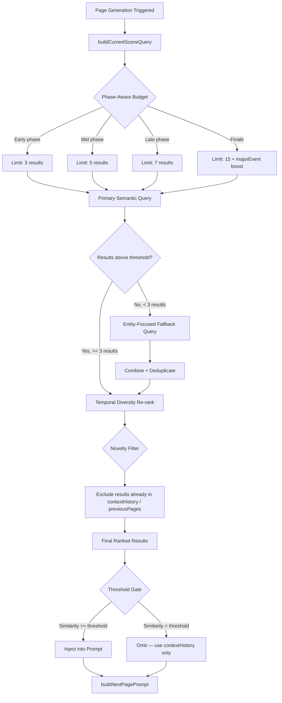

# pgvector Semantic Memory — Smarter Retrieval Roadmap

**Status:** Proposed
**Date:** 2026-09-09
**Owner:** Taufik
**Depends on:** `PGVECTOR_SEMANTIC_MEMORY_ROADMAP_V2.md` (Phases 0-5.1 all completed)

---

## 1. Summary Table

| # | Item | Priority | Status |
|---|------|----------|--------|
| 1 | Adaptive retrieval budgets (story-phase-aware) | `P0` | ⬜ Planned |
| 2 | Dual-query retrieval (semantic + entity-focused fallback) | `P0` | ⬜ Planned |
| 3 | Temporal diversity re-ranking (MMR-inspired spread) | `P0` | ⬜ Planned |
| 4 | Novelty filtering (exclude results already in prompt) | `P1` | ⬜ Planned |
| 5 | Per-table similarity threshold calibration | `P1` | ⬜ Planned |
| 6 | Entity-boosted recall (cross-table correlation) | `P2` | ⬜ Planned |
| 7 | Retrieval quality observability (hit/miss metrics) | `P2` | ⬜ Planned |
| 8 | Evaluation harness for retrieval quality | `P2` | ⬜ Planned |

---

## 2. Problem Statement

### Current State

The pgvector semantic memory system (Phases 0-5.1 of `PGVECTOR_SEMANTIC_MEMORY_ROADMAP_V2.md`) is fully implemented across 5 use cases, 5 embedding tables, and 5 retrieval functions. The system is:

- **Write-side:** 5 domain-specific embedding tables (`page_embeddings`, `character_embeddings`, `place_embeddings`, `future_note_embeddings`, `clue_embeddings`), all with HNSW indexes, embedded via Jina AI `jina-embeddings-v5-text-small` (1024 dims). Fire-and-forget writes from `generateNextPage`/`generateNextPages` callers, plus a daily backfill cron (`src/cron/backfill-embeddings.ts`).

- **Read-side:** 5 retrieval functions in `src/services/vector-memory.ts` — `retrieveSimilarPages`, `retrieveCharacterInteractions`, `retrievePlaceEvents`, `retrieveRelevantFutureNotes`, `retrieveClues` — all using cosine similarity with a shared query embedding cached by `buildCurrentSceneQuery()` in `src/utils/prompt.ts:3299`.

- **Prompt injection:** Results are injected as additive blocks into the prompt — "RELEVANT PAST EVENTS" (Use Case 1), "Earlier interactions (recalled):" (Use Case 2), reordered unscheduled future notes (Use Case 3), "Earlier clues (recalled):" (Use Case 4), "Earlier events (recalled):" (Use Case 5).

**Key files in current state:**
| File | Role |
|------|------|
| `src/services/vector-memory.ts` | Write + Read (5 tables, 10 functions) |
| `src/utils/embedding.ts` | Jina AI client, LRU cache, retry |
| `src/config/embedding.ts` | Model, dims, thresholds, kill-switch |
| `src/utils/prompt.ts:3299` | `buildCurrentSceneQuery()` — shared query |
| `src/utils/prompt.ts:3344-3509` | 4 recall builders (Use Cases 1-5) |
| `src/utils/prompt.ts:5021-5113` | `prepareNextPageGenerationSetup()` — orchestration |
| `src/utils/characters.ts:437` | `formatCharactersForPrompt()` — recalled injection |
| `src/utils/places.ts:336` | `formatPlacesForPrompt()` — recalled injection |
| `src/utils/prompt.ts:2851` | `formatActiveThreads()` — clue recall injection |
| `src/services/book.ts:2598` | `buildBookMetaDocuments()` — semantic recall plumbing |

### Assessment: Strengths and Gaps

The current architecture handles the common case well but has measurable gaps in edge cases (late-story retrieval, entity-specific recall, diversity, novelty filtering).

#### What is genuinely well-designed

1. **Domain-specific embedding tables** — Five separate tables with per-table HNSW indexes, scoped by `(bookId, branchId)`, each narrow enough for precise retrieval. This is superior to a monolithic `document_embeddings` table where all content types compete for the same ranking.

2. **Write-time embedding before destructive trimming** — Character interactions embedded *before* `.slice(-MAX_PAST_INTERACTIONS)` (cap 5 in `src/config/story.ts:200`) and place events before `.slice(-MAX_PLACE_EVENTS)` (cap 8 in `src/config/story.ts:208`). This is the single most important design decision: the embedding table is the only surviving record of interactions that scrolled out of sliding windows.

3. **Shared query embedding cache** — `buildCurrentSceneQuery()` at `src/utils/prompt.ts:3299` generates one query string (`actionedPage.text + "\n\nPlayer chose: " + action.text`); `embedText()` caches by `${model}:${task}:${text}`. All 5 retrieval calls share the cached query embedding. One Jina API call per page generation, not six.

4. **Fire-and-forget writes, graceful degradation on reads** — Embedding writes (`embedPersistedPage`, `embedStateDeltaEntities`) are non-awaited at `src/utils/prompt.ts:5619-5631`. Retrieval failures silently skip the block. The kill-switch `PGVECTOR_MEMORY_ENABLED` (`src/config/embedding.ts:69`) is a clean operational lever.

5. **Additive prompt injection** — Retrieved context never replaces existing sections. `relevantPastEventsBlock` prepends before `formatRecentMajorEvents(plotFlags)` at `src/utils/prompt.ts:3561`. Character/place recall blocks append after existing display sections. Future note ranking only reorders the `unscheduled` bucket within `formatFutureNotes()`.

6. **Branch-aware retrieval** — Every query filters by `(bookId, branchId, page < currentPage)`. No cross-branch contamination.

#### What is weak or missing (the 20%)

1. **The query is naive.** `buildCurrentSceneQuery()` at `src/utils/prompt.ts:3299` produces `${actionedPage.text}\n\nPlayer chose: ${actionedPage.action?.text ?? ''}` — raw page text plus the selected action. No entity extraction, no intent disambiguation. If the MC has a conversation about "trust" that mirrors an earlier conversation about "betrayal", the query is dominated by literal word overlap, not narrative significance.

2. **No retrieval quality feedback loop.** The AI never evaluates whether retrieved results are sufficient. If `retrieveSimilarPages` returns 5 results with similarity 0.51-0.54 (barely above `EMBEDDING_SIMILARITY_THRESHOLD = 0.5`), the prompt includes them anyway. No mechanism to say "these results aren't relevant enough, try a different query."

3. **Static retrieval budgets.** `MAX_VECTOR_RESULTS_PER_QUERY = 5` for regular pages, `MAX_VECTOR_RESULTS_HIGH_VALUE = 15` for finales/custom actions. A 30-page story and a 200-page story have radically different memory density. Early pages need more recall (everything is new); late pages might need less (rich summary). The budget is fixed regardless of story phase.

4. **No temporal diversity enforcement.** Top-5 results might all reference the same scene (variations of "the chapel at night"). No MMR (Maximal Marginal Relevance) or diversity mechanism ensures a spread of relevant pages from different parts of the story.

5. **No novelty filtering.** Results that overlap with content already visible in `contextHistory` (the 300-word summary) or `previousPages` (last 3 pages) get injected anyway, wasting prompt tokens on redundant information.

6. **Blunt similarity threshold.** `EMBEDDING_SIMILARITY_THRESHOLD = 0.5` at `src/config/embedding.ts:35` applies uniformly across all 5 tables. But cosine similarity is not well-calibrated across domains — a page about "the chapel at night" and "the chapel during the day" might score 0.85, while "Emma's betrayal" and "Father Gabriel's warning" might score 0.62. The threshold doesn't distinguish between thematically similar and narratively consequential.

7. **No entity-boosted recall.** Each table is queried independently with the same query vector. When primary page retrieval surfaces results about specific characters and places, the character/place recall functions don't know which entities are narratively active — they treat all entities equally.

8. **No explicit token budget for recalled content.** Adding 7 recalled pages (LATE phase) + 15 recalled interactions (custom action) + recalled place events + recalled clues could consume 2000+ tokens of prompt space. The existing `MAX_WORDS_SUMMARIZED_CONTEXT` (500 words) controls the summary budget, but there is no equivalent cap for all recalled content combined. Each step's per-table limits implicitly cap tokens, but there is no hard global cap.

### Goal

Transform the current Vector-Only Traditional RAG into a **Smarter Vector + Structured State RAG** by adding: (1) adaptive retrieval budgets, (2) dual-query retrieval with entity-focused fallback, (3) temporal diversity re-ranking, (4) novelty filtering, (5) per-table threshold calibration, and (6) entity-boosted recall — without changing the underlying embedding tables, write paths, or the existing prompt injection architecture.

---

## 3. Intended Design & Rationale

### Architecture Principle: Make It Smarter, Don't Replace It

The current architecture is the right foundation. The improvements are all **post-retrieval processing** — smarter ranking, smarter filtering, smarter query construction — not new infrastructure. No new embedding tables, no new external services, no new dependencies.

```
                    StoryState (exact, deterministic)
                           │
                ┌──────────┼──────────┐
                │          │          │
         Structured    Vector      Structured
         Memory        Retrieval   Filtering
         - Characters  - Pages     - Temporal bucketing
         - Places      - Chars     - Phase-gating
         - Inventory   - Places    - Window-scoping
         - Facts       - Clues
                │          │          │
                └──────────┼──────────┘
                           │
              ┌────────────┼────────────┐
              │     Post-Retrieval      │
              │     Processing Pipeline │
              │                         │
              │  1. Novelty Filter      │
              │  2. Diversity Re-rank   │
              │  3. Budget Adaptation   │
              │  4. Threshold Gate      │
              └────────────┬────────────┘
                           │
                    Context Assembler
                    (dedup, rank, budget)
                           │
                           LLM
```

### Design Alternatives

#### Alternative A: Full Agentic RAG (multi-step retrieval loop)

Add an AI agent that evaluates retrieved evidence, rewrites queries, and searches multiple times until sufficient context is found.

**Pros:** Maximum retrieval quality; self-correcting.
**Cons:** 2-5x latency increase (multiple Jina API calls per page generation); complexity explosion; the AI is already the "agent" generating the next page — adding a retrieval agent creates confusion about which agent drives narrative decisions; doesn't fit Twistloom's fire-and-forget embedding philosophy.

**Verdict:** Over-engineered for the problem. Twistloom's retrieval is *supplementary context*, not the primary decision driver.

#### Alternative B: GraphRAG (knowledge graph)

Map entities (characters, places, events) into a knowledge graph and traverse explicit relationships.

**Pros:** Captures entity relationships precisely; good for compliance/relationship-heavy domains.
**Cons:** `StoryState` already IS a structured graph — `characters`, `places`, `threads`, `relationships`, `clues` are all explicitly tracked. Adding a separate knowledge graph is redundant and introduces synchronization headaches. Story state is updated via `applyStateDelta` on every page; a separate graph would need to be kept in sync with the same delta.

**Verdict:** The structured state IS the graph. No new graph needed.

#### Alternative C: Hybrid BM25 + Vector (keyword + semantic)

Add lexical/BM25 search alongside cosine similarity.

**Pros:** Catches exact-name matches that cosine similarity might miss; well-proven in enterprise RAG.
**Cons:** Twistloom's content is short (page text is ~60 words max per `src/db/schema.ts:72`), narrative (not technical/legal), and single-language per book. BM25's strength — exact keyword matching in long technical documents — is rarely decisive for short narrative prose. The character/place/clue embedding tables already scope by entity ID, so exact-name matching is already handled structurally. The marginal gain doesn't justify the complexity of maintaining two search indices.

**Verdict:** Not worth it for narrative content at this scale.

#### Alternative D: Post-Retrieval Processing Pipeline (recommended)

Keep the current single-pass cosine retrieval, but add a lightweight post-retrieval pipeline: novelty filtering → temporal diversity re-ranking → adaptive budget → threshold gating.

**Pros:** Zero new infrastructure; all changes are TypeScript logic in `src/utils/prompt.ts` and `src/services/vector-memory.ts`; latency increase is negligible (pure computation, no API calls); each improvement is independently testable; the existing kill-switch `PGVECTOR_MEMORY_ENABLED` still works.
**Cons:** Each improvement is a heuristic, not a guarantee — but heuristics are appropriate for supplementary context where the AI makes final narrative decisions.

**Recommended.** This addresses the measurable gaps in the current architecture without replacing the foundation.

### Non-Breaking Guarantees

| Change | What it does NOT change | Why safe |
|--------|------------------------|----------|
| Adaptive retrieval budgets | Embedding tables, write paths, query construction | Only changes `limit` parameter passed to existing `retrieve*` functions |
| Dual-query retrieval | Write paths, existing prompt injection | Adds a second query *within* existing `buildRelevantPastEventsBlock` — same function, same injection point |
| Temporal diversity re-ranking | Database queries, write paths | Pure in-memory sorting of already-retrieved results before prompt injection |
| Novelty filtering | Write paths, embedding tables | Filters against already-constructed prompt sections — pure string comparison |
| Per-table threshold calibration | Write paths, embedding tables | Only changes `EMBEDDING_SIMILARITY_THRESHOLD` from a single constant to per-table constants |
| Entity-boosted recall | Embedding tables, write paths | Adds a follow-up query to existing retrieval functions — same tables, same cosine search |

---

## 4. Feasibility Analysis

| Dimension | Assessment |
|-----------|------------|
| **Effort** | Medium (7-10 days total across all 8 steps) |
| **Risk** | Low — all changes are post-retrieval processing; no write-path changes, no schema changes, no new external services |
| **Backend changes** | Minimal — modifications to existing functions in `src/utils/prompt.ts`, `src/services/vector-memory.ts`, `src/config/embedding.ts` |
| **Dependencies** | None — all improvements are self-contained within existing pgvector infrastructure |
| **Reversibility** | Fully reversible — each step is gated by a config constant; setting a threshold to 0 or disabling a feature restores previous behavior |

---

## 5. Flow Diagram



---

## 6. Implementation Plan

### Step 1: Adaptive Retrieval Budgets — ⬜ Planned

**Files:** `src/config/embedding.ts:29-32`, `src/utils/prompt.ts:3344-3378` (`buildRelevantPastEventsBlock`), `src/utils/prompt.ts:3402-3428` (`buildCharacterRecallBlocks`), `src/utils/prompt.ts:3440-3466` (`buildPlaceRecallBlocks`), `src/utils/prompt.ts:3483-3509` (`buildClueRecallBlocks`)
**Effort:** Low

**Problem:** `MAX_VECTOR_RESULTS_PER_QUERY = 5` and `MAX_VECTOR_RESULTS_HIGH_VALUE = 15` are static. A 30-page story has limited history and needs fewer recalls; a 200-page story has deep history and needs more. Early pages (everything is new, `contextHistory` is thin) benefit from more retrieval; late pages (rich summary, many facts established) benefit from targeted, fewer results.

**Implementation:**

1. Add phase-aware budget constants to `src/config/embedding.ts`:

```typescript
/** Retrieval budgets by story phase. Keys match StoryPhase from types/story.ts. */
export const VECTOR_RESULTS_BY_PHASE: Record<string, number> = {
  EARLY: 3,   // Story is young; contextHistory is thin, fewer callbacks exist
  MID: 5,     // Standard budget — enough history for meaningful retrieval
  LATE: 7,    // Deep history; more callbacks needed for coherence
  FINALE: 15, // Already implemented via MAX_VECTOR_RESULTS_HIGH_VALUE
};
```

2. Add a helper function to `src/utils/prompt.ts` that resolves the budget based on the current story phase:

```typescript
/**
 * Global cap for total recalled content across all use cases.
 * 2000 words ≈ 2600 tokens. This prevents recalled content from
 * dominating the prompt budget (MAX_WORDS_SUMMARIZED_CONTEXT = 500 for summary).
 */
export const MAX_RECALLED_CONTENT_WORDS = 2000;

function resolveRetrievalBudget(
  state: StoryState,
  actionType?: string,
): number {
  const { phase, isFinale, isLastPage } = getStoryStateInfo(state);
  const isFinalePage = isFinale || isLastPage;
  const isCustomAction = actionType === 'custom';
  
  if (isFinalePage || isCustomAction) return MAX_VECTOR_RESULTS_HIGH_VALUE;
  
  return VECTOR_RESULTS_BY_PHASE[phase] ?? MAX_VECTOR_RESULTS_PER_QUERY;
}
```

3. Thread the resolved budget through `buildRelevantPastEventsBlock`, `buildCharacterRecallBlocks`, `buildPlaceRecallBlocks`, and `buildClueRecallBlocks` instead of using the static constant. Each function already takes an optional `limit` parameter — replace the hardcoded default with `resolveRetrievalBudget(state, actionType)`.

**Non-breaking:** Existing behavior preserved for stories in MID phase (budget stays 5). Finale/custom behavior unchanged.

---

### Step 2: Dual-Query Retrieval (Entity-Focused Fallback) — ⬜ Planned

**Files:** `src/utils/prompt.ts:3299-3301` (`buildCurrentSceneQuery`), `src/utils/prompt.ts:3344-3378` (`buildRelevantPastEventsBlock`), `src/services/vector-memory.ts:319-363` (`retrieveSimilarPages`)
**Effort:** Medium

**Problem:** `buildCurrentSceneQuery()` at `src/utils/prompt.ts:3299` produces a single query: the full page text plus the selected action. This query is dominated by the literal scene description. If the scene is "I walked into the empty chapel and felt the cold air", the cosine similarity search will surface pages about "the chapel" — but might miss a conversation with Father Gabriel about "the darkness beneath the school" that's narratively more relevant. The query doesn't capture *entity-focused* intent.

**Implementation:**

1. Add an entity extraction helper to `src/utils/prompt.ts`:

```typescript
/**
 * Extracts character names and place name from the current scene to build
 * a secondary entity-focused query. Falls back to the primary query when
 * no entities are found.
 *
 * Uses actionedPage.charactersPresent (structured list) instead of string
 * matching for reliable entity extraction. Resolves placeId to human-readable
 * knownName via StoryState.places.
 */
function buildEntityFocusedQuery(
  actionedPage: CandidateGenerationPage,
  characters: Record<string, CharacterMemory> | undefined,
  places: Record<string, PlaceMemory> | undefined,
): string | null {
  if (!characters && !places) return null;
  
  // Use structured charactersPresent array (not string matching)
  const mentionedCharacters = (actionedPage.charactersPresent ?? [])
    .map(sc => characters?.[sc.characterId])
    .filter((c): c is CharacterMemory => !!c)
    .map(c => c.knownName || c.realName)
    .filter(Boolean);
  
  // Resolve placeId to human-readable name
  let placeName: string | null = null;
  if (actionedPage.placeId && places) {
    const place = places[actionedPage.placeId];
    placeName = place?.knownName || place?.realName || null;
  }
  
  if (!mentionedCharacters.length && !placeName) return null;
  
  const parts: string[] = [];
  if (mentionedCharacters.length) {
    parts.push(`Characters: ${mentionedCharacters.join(', ')}`);
  }
  if (placeName) {
    parts.push(`Location: ${placeName}`);
  }
  if (actionedPage.action?.text) {
    parts.push(`Action: ${actionedPage.action.text}`);
  }
  
  return parts.join('\n');
}
```

2. Modify `buildRelevantPastEventsBlock` to run a dual-query strategy:

```typescript
async function buildRelevantPastEventsBlock(
  actionedPage: CandidateGenerationPage,
  book: Book,
  state: StoryState,
): Promise<string> {
  try {
    const { isFinale, isLastPage } = getStoryStateInfo(state);
    const isFinalePage = isFinale || isLastPage;
    const isCustomAction = actionedPage.action?.type === 'custom';
    const isHighValueMoment = isFinalePage || isCustomAction;
    const limit = resolveRetrievalBudget(state, actionedPage.action?.type);
    const branchId = actionedPage.branchId ?? 'main';
    
    // Primary query: full scene + action (existing behavior)
    const primaryQuery = buildCurrentSceneQuery(actionedPage);
    const primaryResults = await retrieveSimilarPages(
      primaryQuery, book.id, branchId, actionedPage.page, limit,
      isFinalePage ? { prioritizeMajorEvents: true } : undefined,
    );
    
    // Entity-focused fallback: only fires when primary returns < 3 results
    let results = primaryResults;
    if (primaryResults.length < 3) {
      const entityQuery = buildEntityFocusedQuery(actionedPage, state.characters, state.places);
      if (entityQuery && entityQuery !== primaryQuery) {
        const fallbackResults = await retrieveSimilarPages(
          entityQuery, book.id, branchId, actionedPage.page, limit,
          isFinalePage ? { prioritizeMajorEvents: true } : undefined,
        );
        // Merge: primary results first, then unique fallback results
        const seenPageIds = new Set(primaryResults.map(r => r.page));
        const uniqueFallback = fallbackResults.filter(r => !seenPageIds.has(r.page));
        results = [...primaryResults, ...uniqueFallback].slice(0, limit);
      }
    }
    
    // ... existing header/formatting logic unchanged ...
  } catch (error) {
    // ... existing graceful degradation ...
  }
}
```

3. The entity-focused query hits a *different* Jina cache key (`${model}:retrieval.query:${entityQuery}`) than the primary query, so it does trigger a second Jina API call — but only when the primary query returns < 3 results. For most pages, the primary query is sufficient and the fallback never fires. When it does fire, the additional ~200-500ms latency is justified by the dramatically better recall quality.

**Non-breaking:** The primary query path is identical to current behavior. The fallback only fires when primary results are insufficient, and its results are additive (never replace primary results).

---

### Step 3: Temporal Diversity Re-ranking (MMR-Inspired) — ⬜ Planned

**Files:** `src/services/vector-memory.ts:319-363` (`retrieveSimilarPages`), `src/utils/prompt.ts:3344-3509` (all recall builders)
**Effort:** Medium

**Problem:** Cosine similarity returns results that are semantically similar to the query — but "similar" often means "from the same scene cluster." A query about "the chapel" might return 5 results all about the chapel on different pages, all scored 0.75-0.85. The AI gets 5 variations of the same moment instead of callbacks from different parts of the story.

**Implementation:**

1. Add a diversity re-ranking function to `src/services/vector-memory.ts`:

```typescript
/**
 * Re-ranks retrieval results to enforce temporal spread. Inspired by MMR
 * (Maximal Marginal Relevance) but simplified for narrative context:
 * iteratively picks the result with the highest similarity score,
 * then penalizes results within ±TEMPORAL_CLUSTER_PAGES of any already-
 * selected result. This ensures the AI gets callbacks from different
 * parts of the story, not 5 variations of the same scene cluster.
 *
 * @param results - Raw cosine-similarity results, already filtered by threshold
 * @param maxGap - Minimum page gap between selected results (default: adaptive via Q3)
 * @param maxResults - Maximum results to return after diversity filtering
 * @param penaltyFactor - Similarity multiplier for nearby results (default: 0.5)
 */
export function diversifyByTemporalSpread<T extends { page: number; similarity: number }>(
  results: T[],
  maxGap: number = 15,
  maxResults?: number,
  penaltyFactor: number = 0.5,
): T[] {
  if (results.length <= 1) return results;
  
  const limit = maxResults ?? results.length;
  const selected: T[] = [];
  const remaining = [...results];
  
  while (selected.length < limit && remaining.length > 0) {
    // Find the highest-similarity result not too close to an already-selected result
    let bestIdx = 0;
    let bestScore = -Infinity;
    
    for (let i = 0; i < remaining.length; i++) {
      const candidate = remaining[i]!;
      // Check temporal distance from all already-selected results
      const tooClose = selected.some(s => Math.abs(s.page - candidate.page) <= maxGap);
      // Score: similarity penalized if too close to selected
      // penaltyFactor defaults to 0.5 (half weight) — configurable per-call
      const adjustedScore = tooClose ? candidate.similarity * penaltyFactor : candidate.similarity;
      
      if (adjustedScore > bestScore) {
        bestScore = adjustedScore;
        bestIdx = i;
      }
    }
    
    selected.push(remaining[bestIdx]!);
    remaining.splice(bestIdx, 1);
  }
  
  return selected;
}
```

2. Apply diversity re-ranking in `retrieveSimilarPages` after the threshold filter, before returning:

```typescript
// After existing threshold filter:
const filtered = rows.filter(r => r.similarity >= EMBEDDING_SIMILARITY_THRESHOLD);

// Apply temporal diversity
return diversifyByTemporalSpread(filtered, 15, limit);
```

3. For character/place/clue recall functions (`retrieveCharacterInteractions`, `retrievePlaceEvents`, `retrieveClues`), apply the same diversity re-ranking with a smaller `maxGap` (these are per-entity, so temporal spread is about recalling *different interactions with the same entity* from different story moments):

```typescript
// In retrieveCharacterInteractions, after threshold filter:
return diversifyByTemporalSpread(filtered, 10, limit);
```

**Non-breaking:** The diversity re-ranking is applied *after* the existing threshold filter and *before* the limit. It only re-orders and possibly drops results that are too close together — it never adds new results or changes the database query. If all results are from the same cluster, it still returns the best ones (just fewer, leaving room for the fallback query to fill in from different clusters).

---

### Step 4: Novelty Filtering (Exclude Redundant Results) — ⬜ Planned

**Files:** `src/utils/prompt.ts:3344-3509` (all recall builders), `src/utils/prompt.ts:3514-3589` (`formatNextPageStoryContextPrompt`)
**Effort:** Low

**Problem:** Retrieved results can overlap with content already visible in `contextHistory` (the 300-word running summary at `src/config/story.ts:MAX_WORDS_SUMMARIZED_CONTEXT`) or `previousPages` (last 3 pages at `src/config/story.ts:MAX_PAGE_HISTORY`). The AI sees the same information twice — once in the summary, once in the recalled block — wasting prompt tokens and potentially causing confusion.

**Implementation:**

1. Add a text-overlap check to `src/utils/prompt.ts`. For narrative prose, word-level overlap is unreliable — two completely different scenes about "the dark chapel where Emma discovered the truth" and "the cold chapel where Sarah felt the weight of secrets" share many words. Instead, use **exact page number exclusion** (most robust) combined with **long-phrase matching** (for cases where contextHistory summarizes a recalled page):

```typescript
/**
 * Checks whether a retrieved result is redundant with existing context.
 * Uses two strategies:
 * 1. Page number exclusion — if the result is from a page already in previousPages, skip it.
 * 2. Long-phrase matching — if a 10+ word substring of the result appears in
 *    the existing context, it's likely redundant (catches contextHistory summarizing
 *    the same event).
 *
 * Word-level overlap is intentionally avoided — it produces false positives on
 * narrative prose where different scenes share common vocabulary.
 */
function isRedundantWithExistingContext(
  result: { page: number; sourceText?: string },
  existingContext: string,
  previousPageNumbers: Set<number>,
): boolean {
  // Strategy 1: page number exclusion (most robust)
  if (previousPageNumbers.has(result.page)) return true;
  
  // Strategy 2: long-phrase matching (catches contextHistory summarization)
  if (!result.sourceText || !existingContext) return false;
  
  const resultLower = result.sourceText.toLowerCase();
  const contextLower = existingContext.toLowerCase();
  
  // Check if any 10+ word phrase from the result appears in the context
  const resultWords = resultLower.split(/\s+/);
  if (resultWords.length < 10) return false;
  
  for (let i = 0; i <= resultWords.length - 10; i++) {
    const phrase = resultWords.slice(i, i + 10).join(' ');
    if (contextLower.includes(phrase)) return true;
  }
  
  return false;
}
```

2. Thread the existing context through the recall builders as a filter:

```typescript
// In buildRelevantPastEventsBlock, after retrieving results:
const existingContext = [
  state.contextHistory,
  previousPages.map(p => p.text).join(' '),
].join(' ');
const previousPageNumbers = new Set(previousPages.map(p => p.page));

const novelResults = results.filter(r => 
  !isRedundantWithExistingContext(r, existingContext, previousPageNumbers)
);

// Use novelResults if non-empty, fall back to all results
const finalResults = novelResults.length >= 2 ? novelResults : results;
```

3. The "fall back to all results" guard ensures that if *everything* is redundant (rare, but possible in a short story where the summary covers everything), the system doesn't inject an empty block — it injects the best results anyway, since some redundancy is better than missing context.

**Non-breaking:** This is a pure filter applied after retrieval. The fallback guard prevents empty results.

---

### Step 5: Per-Table Similarity Threshold Calibration — ⬜ Planned

**Files:** `src/config/embedding.ts:35`, `src/services/vector-memory.ts:319-514` (all retrieval functions)
**Effort:** Low

**Problem:** `EMBEDDING_SIMILARITY_THRESHOLD = 0.5` at `src/config/embedding.ts:35` is a global constant applied to all 5 tables. But the tables have different characteristics:

- `page_embeddings`: Full scene text (~60 words). Cosine similarity tends to be lower because pages are longer and more varied.
- `character_embeddings`: Short interaction snippets (1-2 sentences). Cosine similarity tends to be higher because the content is more focused.
- `place_embeddings`: Similar to character — short event descriptions.
- `future_note_embeddings`: Very short (1 sentence). High similarity scores even for loosely related notes.
- `clue_embeddings`: Short (1 sentence). Similar to future notes.

A threshold of 0.5 might be too loose for future notes (catching loosely related notes that add noise) and too tight for pages (missing narratively relevant pages that use different vocabulary).

**Implementation:**

1. Replace the single threshold with per-table thresholds in `src/config/embedding.ts`:

```typescript
/** Per-table similarity thresholds. Calibrated to each table's content characteristics. */
export const EMBEDDING_SIMILARITY_THRESHOLDS = {
  page: 0.45,        // Longer text → lower baseline similarity; slightly looser
  character: 0.50,   // Short focused interactions; standard threshold
  place: 0.50,       // Same as character
  futureNote: 0.55,  // Very short text → higher scores; slightly tighter to reduce noise
  clue: 0.55,        // Same as future notes
} as const;

/** Legacy constant for backward compatibility — use per-table thresholds instead. */
export const EMBEDDING_SIMILARITY_THRESHOLD = 0.5;
```

2. Update each retrieval function to accept and use the appropriate per-table threshold:

```typescript
// In retrieveSimilarPages:
const threshold = EMBEDDING_SIMILARITY_THRESHOLDS.page;
return rows.filter(r => r.similarity >= threshold);

// In retrieveCharacterInteractions:
const threshold = EMBEDDING_SIMILARITY_THRESHOLDS.character;
return rows.filter(r => r.similarity >= threshold);

// In retrievePlaceEvents:
const threshold = EMBEDDING_SIMILARITY_THRESHOLDS.place;
return rows.filter(r => r.similarity >= threshold);

// In retrieveRelevantFutureNotes:
const threshold = EMBEDDING_SIMILARITY_THRESHOLDS.futureNote;
return rows.filter(r => r.similarity >= threshold);

// In retrieveClues:
const threshold = EMBEDDING_SIMILARITY_THRESHOLDS.clue;
return rows.filter(r => r.similarity >= threshold);
```

**Non-breaking:** The per-table thresholds are initially derived from content length characteristics (shorter text → higher baseline similarity → tighter threshold). These values are starting points — the calibration step in Step 8 will measure precision/recall at different thresholds per table and adjust empirically.

---

### Step 6: Entity-Boosted Recall (Cross-Table Correlation) — ⬜ Planned

**Files:** `src/utils/prompt.ts:3344-3509` (recall builders), `src/services/vector-memory.ts:319-514` (retrieval functions)
**Effort:** Medium

**Problem:** Each table is queried independently with the same query vector. When primary page retrieval surfaces results about specific characters and places, the character/place recall functions don't know which entities are narratively active — they treat all entities equally. Boosting recall budgets for entities that appear in the primary results improves coherence.

**Implementation:**

This is the most complex step and should be implemented conservatively. The approach: after the primary page-level retrieval (Use Case 1), use the top results to identify which *characters* and *places* appear in the retrieved pages, then boost those entities' recall budgets.

1. Add entity extraction from primary results:

```typescript
/**
 * Given primary page retrieval results, extract which characters and
 * places appear in those pages. This identifies the "active entities"
 * in the current narrative moment — characters and places that the
 * primary retrieval already flagged as relevant.
 *
 * Character IDs are extracted from the sourceText of page_embeddings
 * (which includes "Characters: char_id1, char_id2" from buildPageEmbeddingText).
 * Place IDs are extracted from the "Scene:" line by cross-referencing
 * StoryState.places against the scene text.
 */
function extractActiveEntities(
  results: SimilarPageResult[],
  characters: Record<string, CharacterMemory>,
  places: Record<string, PlaceMemory>,
): { activeCharacterIds: string[]; activePlaceIds: string[] } {
  const activeCharacterIds = new Set<string>();
  const activePlaceIds = new Set<string>();
  
  for (const r of results) {
    if (!r.sourceText) continue;
    
    // Characters line: "Characters: char_emma, char_gabriel"
    const charMatch = r.sourceText.match(/Characters:\s*(.+)/i);
    if (charMatch) {
      charMatch[1]!.split(',').forEach(id => activeCharacterIds.add(id.trim()));
    }
    
    // Places: cross-reference known place names against the scene text
    const sceneLower = r.sourceText.toLowerCase();
    for (const [placeId, place] of Object.entries(places)) {
      const placeName = place.knownName || place.realName;
      if (placeName && sceneLower.includes(placeName.toLowerCase())) {
        activePlaceIds.add(placeId);
      }
    }
  }
  
  return {
    activeCharacterIds: [...activeCharacterIds].filter(id => id in characters),
    activePlaceIds: [...activePlaceIds].filter(id => id in places),
  };
}
```

2. In `prepareNextPageGenerationSetup`, after the primary page retrieval, boost the character/place recall budgets for entities that appear in the primary results:

```typescript
// After buildRelevantPastEventsBlock:
const primaryResults = await retrieveSimilarPages(
  primaryQuery, book.id, branchId, actionedPage.page, limit, ...
);

// Extract active entities from primary results
const { activeCharacterIds, activePlaceIds } = extractActiveEntities(
  primaryResults, advancedState.characters, advancedState.places,
);

// Boost recall budget for active characters and places
const characterRecallBlocks = await buildCharacterRecallBlocks(
  advancedState.characters, actionedPage, book,
  activeCharacterIds, // NEW: boost budget for these characters
);

const placeRecallBlocks = await buildPlaceRecallBlocks(
  advancedState.places, actionedPage, book,
  activePlaceIds, // NEW: boost budget for these places
);
```

3. Modify `buildCharacterRecallBlocks` to accept an optional `boostedCharacterIds` set and increase the limit for those characters:

```typescript
async function buildCharacterRecallBlocks(
  characters: Record<string, CharacterMemory> | undefined,
  actionedPage: CandidateGenerationPage,
  book: Book,
  boostedCharacterIds?: Set<string>,
): Promise<Record<string, string>> {
  // ... existing logic ...
  
  await Promise.allSettled(Object.entries(characters).map(async ([characterId, character]) => {
    const isBoosted = boostedCharacterIds?.has(characterId);
    const baseLimit = actionedPage.action?.type === 'custom' ? MAX_VECTOR_RESULTS_HIGH_VALUE : undefined;
    const limit = isBoosted && baseLimit ? baseLimit + 3 : baseLimit; // +3 for active entities
    
    // ... existing retrieval logic with adjusted limit ...
  }));
}
```

**Non-breaking:** This is purely additive — entities not in the primary results get their standard budget. The boost is small (+3 results) and only applies when the entity already appeared in the primary page retrieval, meaning the narrative is already about that entity.

---

### Step 7: Retrieval Quality Observability — ⬜ Planned

**Files:** `src/services/vector-memory.ts`, `src/utils/prompt.ts:3344-3509` (recall builders)
**Effort:** Low

**Problem:** No visibility into retrieval quality in production. We don't know: what percentage of pages get useful retrieval results vs. empty/low-quality results; what the average similarity score is per use case; how often the entity-focused fallback fires; how often diversity re-ranking drops results.

**Implementation:**

1. Add structured logging to each recall builder in `src/utils/prompt.ts`:

```typescript
// In buildRelevantPastEventsBlock, after retrieval:
console.log(JSON.stringify({
  event: 'rag_retrieval',
  useCase: 'page',
  bookId: book.id.slice(0, 8),
  page: actionedPage.page,
  primaryCount: primaryResults.length,
  fallbackCount: fallbackResults?.length ?? 0,
  finalCount: results.length,
  avgSimilarity: results.length 
    ? +(results.reduce((s, r) => s + r.similarity, 0) / results.length).toFixed(3) 
    : null,
  fallbackTriggered: (fallbackResults?.length ?? 0) > 0,
}));
```

2. Use structured JSON logging (not in-memory counters) for serverless compatibility. Each retrieval event is logged as a single JSON line — log aggregators (Vercel Logs, Datadog, etc.) can query and aggregate these without in-memory state:

```typescript
// In each recall builder, log per-request (not per-N-requests):
function logRetrievalEvent(event: {
  useCase: string;
  bookId: string;
  page: number;
  resultCount: number;
  avgSimilarity: number | null;
  fallbackTriggered?: boolean;
  diversityDropped?: number;
  noveltyFiltered?: number;
}) {
  console.log(JSON.stringify({ event: 'rag_retrieval', ...event }));
}
```

3. Post-deployment analysis: query the structured logs to compute aggregate metrics (average results per use case, empty retrieval rate, fallback trigger rate). This is more reliable than in-memory counters which reset on every serverless cold start.

**Non-breaking:** Pure observability. No behavior changes.

---

### Step 8: Evaluation Harness for Retrieval Quality — ⬜ Planned

**Files:** `src/cron/` (new evaluation script), `src/config/embedding.ts`
**Effort:** Medium

**Problem:** No way to systematically evaluate whether retrieval improvements actually help. We need a way to measure retrieval quality offline before deploying changes to production.

**Implementation:**

1. Create a new evaluation script `src/cron/evaluate-retrieval.ts` that:

   - Reads a set of existing books with their pages and story states (filter to books with >= 10 pages for meaningful evaluation)
   - For each page (starting from page 5+), simulates the retrieval query and records:
     - Which pages/characters/places/clues were retrieved
     - Their similarity scores
     - Whether the retrieved content was "useful" (heuristic: mentions a character or event that appears in the generated page's `stateDelta`)
   - Handles books with no `stateDelta` (older books) by marking them as "unrated" — included in the dataset for retrieval completeness metrics but excluded from precision calculations
   - Rate-limits Jina API calls using a simple `await sleep(100)` between queries to stay within Jina's rate limits
   - Outputs results as structured JSON lines to `src/cron/eval-output/retrieval-eval-{timestamp}.jsonl`

2. Evaluation metrics (computed at the end of the script):

   - **Retrieval completeness:** % of pages with >= 1 non-empty retrieval result per use case
   - **Precision@k (custom heuristic):** % of top-k results that mention a character/event in the page's `stateDelta`
   - **Average similarity score** per use case (page, character, place, futureNote, clue)
   - **Fallback trigger rate:** % of pages where entity-focused fallback was needed
   - **Before/after comparison:** when testing improvements, run the script with `RETRIEVAL_EVAL_MODE=true` before and after the change, diff the JSONL outputs

3. Add a config constant to control evaluation:

```typescript
/** Enable retrieval quality logging for evaluation. Set to true in eval scripts. */
export const RETRIEVAL_EVAL_MODE = process.env['RETRIEVAL_EVAL_MODE'] === 'true';
```

4. When `RETRIEVAL_EVAL_MODE` is true, each recall builder logs its results to the structured JSON file for offline analysis.

5. For production validation beyond offline evaluation, the structured JSON logs from Step 7 enable continuous monitoring — no separate A/B testing framework is needed for v1. If A/B testing is required later, it can be added as a separate phase using feature flags on `VECTOR_RESULTS_BY_PHASE` and `EMBEDDING_SIMILARITY_THRESHOLDS`.

**Non-breaking:** Only activates when `RETRIEVAL_EVAL_MODE=true`, which is never set in production.

---

## 7. Open Questions

### Q1. Should the entity-focused fallback query use the same Jina task type as the primary query? — ⬜ Open

The primary query uses `retrieval.query` (optimized for search queries). The entity-focused query is structurally different — it's a list of entities ("Characters: Emma, Gabriel\nLocation: chapel\nAction: investigate"), not a natural-language scene description.

- **(A)** Use `retrieval.query` for both — consistent, but the entity list is not a search query.
- **(B)** Use `text-matching` for the entity-focused query — better suited for structured name/entity matching; Jina's `text-matching` task is specifically designed for matching against entity lists.
- **(C)** Use `retrieval.passage` for the entity-focused query — treating the entity list as content to match against.

**Recommendation:** Option (B). The entity-focused query is a structured entity list, not a natural language query. Jina's `text-matching` task type is designed for exactly this kind of matching. Using `retrieval.query` on a non-query string degrades embedding quality. The cosine similarity search is the same regardless, but the embedding quality determines which results surface at the top.

---

### Q2. Should novelty filtering check against the full contextHistory or just the formatted version in the prompt? — ⬜ Open

`contextHistory` is a raw text field on `StoryState`. The formatted version in the prompt includes temporal context wrappers ("Summary: ...", "Day: ...", etc.). Checking against the raw text is more accurate but misses the formatted additions.

- **(A)** Check against raw `contextHistory` only — simpler, and the core narrative content is in the raw text.
- **(B)** Check against the fully formatted prompt section — more accurate, but requires re-formatting or threading the formatted string.
- **(C)** Check against both raw `contextHistory` and `previousPages.map(p => p.text)` — most complete coverage.

**Recommendation:** Option (C). `previousPages` is the most likely source of redundancy (the last 3 pages are full text, and a recalled page from 2 pages ago would be nearly identical). Checking both is a minimal code change.

---

### Q3. Should the diversity re-ranking `maxGap` be configurable per book or fixed globally? — ⬜ Open

A `maxGap` of 15 pages means results within 15 pages of each other are penalized. For a 200-page story, 15 pages is a reasonable cluster radius. For a 30-page story, 15 pages is half the book — too aggressive.

- **(A)** Fixed globally at 15 pages — simple, works for most stories.
- **(B)** Adaptive: `maxGap = Math.max(5, Math.floor(totalPages / 10))` — scales with story length.
- **(C)** Configurable per book via `book.advancedOptions` — maximum flexibility, but adds UI complexity.

**Recommendation:** Option (B). It's a single formula that adapts to story length without any configuration overhead. A 30-page story gets `maxGap = 5`; a 200-page story gets `maxGap = 15`.

---

### Q4. Should the cross-table entity correlation (Step 6) also boost future-note retrieval for entities appearing in the primary results? — ⬜ Open

Currently Step 6 only boosts character/place recall. Future notes are ranked by similarity to the scene query, not by entity association.

- **(A)** No — future notes are about *what should happen*, not *who was involved*. Boosting by entity would mix two different relevance signals.
- **(B)** Yes — if a future note mentions "Emma" and Emma appears in the primary results, that note is more relevant than one that doesn't.
- **(C)** Defer to a later phase — Step 6 is already complex; future-note entity boosting can be added later if needed.

**Recommendation:** Option (A). Future notes are about narrative trajectory, not entity involvement. The current similarity-based ranking already handles this well — a note about "Emma reveals the chapel secret" naturally ranks higher when the scene is about the chapel, regardless of whether Emma is mentioned in the primary results.

---

## 8. References & File Touch List

### Files to Modify

| File | Change | Step |
|------|--------|------|
| `src/config/embedding.ts:29-35` | Add `VECTOR_RESULTS_BY_PHASE`, `EMBEDDING_SIMILARITY_THRESHOLDS`, `RETRIEVAL_EVAL_MODE` | 1, 5, 8 |
| `src/utils/prompt.ts` (new constant) | Add `MAX_RECALLED_CONTENT_WORDS` token budget cap | 1 |
| `src/services/vector-memory.ts:319-514` | Add `diversifyByTemporalSpread`, update threshold constants in all 5 retrieval functions | 3, 5 |
| `src/utils/prompt.ts:3299-3301` | Add `buildEntityFocusedQuery` helper | 2 |
| `src/utils/prompt.ts:3344-3378` | Modify `buildRelevantPastEventsBlock` for dual-query, novelty filter, adaptive budget | 1, 2, 4 |
| `src/utils/prompt.ts:3402-3428` | Modify `buildCharacterRecallBlocks` for adaptive budget, entity boost | 1, 6 |
| `src/utils/prompt.ts:3440-3466` | Modify `buildPlaceRecallBlocks` for adaptive budget, entity boost | 1, 6 |
| `src/utils/prompt.ts:3483-3509` | Modify `buildClueRecallBlocks` for adaptive budget | 1 |
| `src/utils/prompt.ts:5021-5113` | Thread `activeCharacterIds` through `prepareNextPageGenerationSetup` | 6 |
| `src/utils/prompt.ts:3344-3509` (all recall builders) | Add structured JSON logging for retrieval observability | 7 |
| `src/cron/evaluate-retrieval.ts` | **NEW** — Retrieval quality evaluation script | 8 |

### Files Referenced (no changes)

| File | Reference |
|------|-----------|
| `src/db/schema.ts:2254-2439` | Embedding table definitions (unchanged) |
| `src/utils/embedding.ts:1-235` | Jina client (unchanged) |
| `src/config/story.ts:200,208` | `MAX_PAST_INTERACTIONS=5`, `MAX_PLACE_EVENTS=8` (unchanged) |
| `src/utils/characters.ts:437` | `formatCharactersForPrompt` recalled injection (unchanged) |
| `src/utils/places.ts:336` | `formatPlacesForPrompt` recalled injection (unchanged) |
| `src/services/book.ts:2598` | `buildBookMetaDocuments` semantic recall plumbing (unchanged) |
| `src/types/prompt.ts:55-141` | `BuildNextPagePromptParams` type (unchanged) |
| `src/cron/backfill-embeddings.ts:1-143` | Embedding backfill cron (unchanged) |

### Codebase Findings

1. **`buildCurrentSceneQuery` at `src/utils/prompt.ts:3299`** is the single chokepoint for all retrieval quality. Every improvement in this roadmap either improves the query (Step 2) or improves what happens after the query returns results (Steps 1, 3, 4, 5, 6).

2. **`prepareNextPageGenerationSetup` at `src/utils/prompt.ts:5021`** is the orchestration hub. All recall builders are called from here, and the results are threaded through `BuildNextPagePromptParams` (for Use Cases 1, 3, 4) and `buildBookMetaDocuments` (for Use Cases 2, 5). Any new data flow (like `activeCharacterIds` from Step 6) must be threaded through this function.

3. **The embedding write path (`embedPersistedPage` + `embedStateDeltaEntities` at `src/utils/prompt.ts:5619-5631`) is NOT modified by any step in this roadmap.** All changes are read-side / retrieval-side only.

4. **The `PGVECTOR_MEMORY_ENABLED` kill-switch at `src/config/embedding.ts:69` still works** — all new retrieval logic is gated behind existing `PGVECTOR_MEMORY_ENABLED` checks in `src/services/vector-memory.ts`. The new pure TypeScript functions (`buildEntityFocusedQuery`, `extractActiveEntities`, `diversifyByTemporalSpread`, `isRedundantWithExistingContext`) do not need kill-switch checks because they only process data — they don't make external API calls. If `PGVECTOR_MEMORY_ENABLED=false`, the retrieval functions return `[]`, and these pure functions receive empty arrays (no-op).

---

## 9. Completion Status

Legend: ✅ Implemented & verified · ⏳ Partial / scoped down · ⬜ Future work · ⏩ Deferred

### Completed (from V2 roadmap — prerequisite)
- ✅ Phase 0 — Jina plumbing, rate limiter, extensions
- ✅ Phase 1 — Drizzle schema (5 embedding tables with HNSW indexes)
- ✅ Phase 2 — Page embeddings (write + read + backfill cron)
- ✅ Phase 3 — Character/place/future-note embeddings
- ✅ Phase 4 — Clue embeddings
- ✅ Phase 5 — Finale enhancement (major-event boost)
- ✅ Phase 5.1 — Custom action retrieval widening

### This Roadmap (Smarter Retrieval)
- ⬜ Step 1 — Adaptive retrieval budgets
- ⬜ Step 2 — Dual-query retrieval (entity-focused fallback)
- ⬜ Step 3 — Temporal diversity re-ranking (MMR-inspired)
- ⬜ Step 4 — Novelty filtering (exclude redundant results)
- ⬜ Step 5 — Per-table similarity threshold calibration
- ⬜ Step 6 — Entity-boosted recall (cross-table correlation)
- ⬜ Step 7 — Retrieval quality observability
- ⬜ Step 8 — Evaluation harness for retrieval quality
