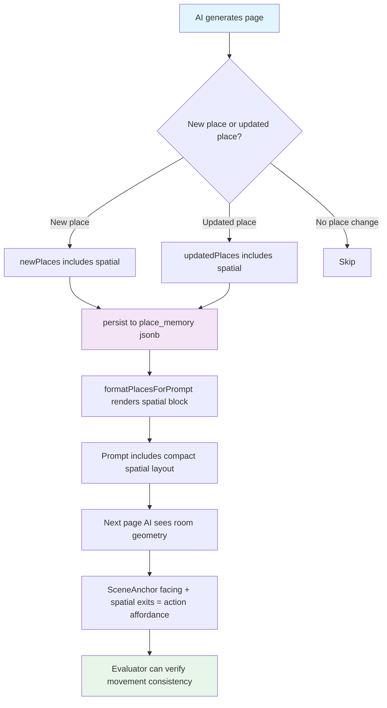

# Place Spatial Memory Roadmap

> **Status:** In Progress
> **Date:** 2026-09-11
> **Owner:** Twistloom Backend

---

## 1. Summary Table

| # | Item | Priority | Status |
|---|------|----------|--------|
| 1 | Define `SpatialDirection`, `PlaceExitTarget`, `PlaceSpatialMemory` types | `P0` | ✅ Done |
| 2 | Add `spatial?` field to `PlaceMemory` type | `P0` | ✅ Done |
| 3 | Add `SPATIAL_SCHEMA` to AI JSON schemas (`INITIAL_PLACE_PROPERTIES`, `UPDATE_PLACE_SCHEMA`) | `P0` | ✅ Done |
| 4 | Add `spatial` field instruction in `buildNextPageFieldInstructionSections` | `P0` | ✅ Done |
| 5 | Render spatial block in `formatPlacesForPrompt` | `P0` | ✅ Done |
| 6 | Inject previous page spatial context into `formatPreviousPageEntry` | `P1` | ✅ Done |
| 7 | Update `firstBookFieldInstructions` for initial place spatial | `P1` | ✅ Done |
| 8 | Smoke test: generate 5-page book with spatial consistency | `P1` | ⬜ Planned |

---

## 2. Problem Statement

### Current State

Twistloom maintains three distinct spatial knowledge systems, each partial:

1. **Inter-place navigation** — `PlaceMemory.knownConnections` (`src/types/places.ts:165`) stores directed graph edges between places (targetId, travelTime, routeType, obstacles). Serialized as "Known routes" in `formatPlacesForPrompt` (`src/utils/places.ts:398-403`).

2. **End-of-page physical snapshot** — `SceneAnchor` (`src/types/story.ts:1069`) captures MC posture, facing, targets, and constraints at page end. Stored on `StateDelta.sceneAnchor` (`src/types/story.ts:1401`). Serialized into prompt via `formatPreviousPageEntry` (`src/utils/prompt.ts`).

3. **Place description** — `PlaceMemory.traits`, `keyObjects`, `hints` (`src/types/places.ts:128-150`) carry scattered prose descriptions of what exists in a place. Serialized as "Traits", "Key objects", "Hints" in `formatPlacesForPrompt` (`src/utils/places.ts:370-394`).

### Pain Points

1. **No intra-place spatial layout.** The AI knows "Bedroom connects to Corridor" but does not know "the door is on the north wall." Every page, the model re-infers room geometry from prose context, producing teleportation bugs (door moves from north to south between pages) and action affordance errors (MC "crosses to the window" when the window is behind them).

2. **Spatial information is scattered and redundant.** A door's existence may appear in `keyObjects` ("wooden door"), in `hints` ("north wall has door"), in `traits` ("door: connects to corridor"), and in `knownConnections` — all as independent prose fragments. The AI must mentally reconstruct the spatial graph from these disconnected pieces each page.

3. **SceneAnchor lacks room context.** `SceneAnchor.facing: "north"` is meaningless without knowing what is to the north. The evaluator cannot verify "MC faces the exit" because it does not know where exits are located within the room.

4. **Action affordance is prose-guessed.** The `actions` field instruction (`src/utils/field-instructions.ts:182-197`) requires actions to start from `sceneAnchor` exactly, but the model has no structured data about what objects are within reach from a given position — it guesses from scattered prose, producing physically impossible actions.

### Goal

Add a minimal, token-efficient intra-place spatial memory that tells the AI and evaluator **where things are relative to each other** within a room, enabling consistent movement, camera continuity, and physically grounded action affordance — without adding schema complexity or prompt token overhead.

---

## 3. Intended Design & Rationale

### Design Alternatives

#### Alternative A: Extend `PlaceConnection` with direction fields

Add `sourceDirection` and `targetDirection` to `PlaceConnection` (`src/types/places.ts:165`).

```typescript
type PlaceConnection = {
  sourceDirection?: SpatialDirection;  // "north" — exit is on the north wall
  targetDirection?: SpatialDirection;  // "south" — entrance is on the south wall
  // ...existing fields
};
```

**Pros:** No new type; reuses existing schema.
**Cons:** Conflates intra-place layout (stable geography) with inter-place navigation (dynamic route state: obstacles, accessibility). Requires reverse-engineering room layout from N connection edges. Breaks the TODO's principle that spatial = stable geography, connections = dynamic navigation.

#### Alternative B: Full coordinate system (x, y, z)

Store absolute positions for every feature and exit.

**Pros:** Mathematically precise; enables distance calculations.
**Cons:** Massive schema complexity; forces every place to have coordinates; meaningless for open spaces (forests, city squares); requires geometric reasoning the LLM cannot reliably perform; token-heavy.

#### Alternative C: `PlaceSpatialMemory` with `features` + `exits` (Recommended)

A dedicated spatial sub-object on `PlaceMemory` with two partial records keyed by 6-direction enum.

```typescript
type PlaceSpatialMemory = {
  features?: Partial<Record<SpatialDirection, string>>;
  exits?: Partial<Record<SpatialDirection, { to: string; via?: string }>>;
};
```

**Pros:** Clean semantic separation (what exists vs. where you can go); Partial records store only known information; 6 directions cover 99% of thriller locations; serializes to ~5-8 tokens per place; stable geography independent of dynamic state.
**Cons:** One new optional nested type; AI must learn to populate it (but leverages existing `newPlaces`/`updatedPlaces` output path).

### Recommended: Alternative C

This follows the TODO document's analysis (`TODO-place-spatial-chatgpt.md`) which explicitly recommended `features + exits {to, via}` over all alternatives. The design is grounded in three principles:

1. **PlaceMemory tells the AI what exists. SpatialMemory tells the AI where it exists. StoryState tells the AI what condition it is in.** — Three clean layers, no conflation.

2. **Store facts that matter, not placeholders for facts that don't exist.** — `Partial<Record<...>>` means a forest clearing with only one exit stores one entry, not four empty strings.

3. **Stable geography, dynamic condition.** — Whether a door is locked belongs in `PlaceConnection.obstacles` or `factUpdates`, not in spatial memory. The geography is canon; its state evolves per-branch.

### Non-Breaking Guarantees

| Change | What it does NOT change | Why safe |
|--------|------------------------|----------|
| Add `spatial?` to `PlaceMemory` | Existing `PlaceMemory` fields, `knownConnections`, `traits` | Optional field; existing places have `spatial: undefined` |
| Add `SPATIAL_SCHEMA` to AI schemas | Existing `INITIAL_PLACE_PROPERTIES`, `UPDATE_PLACE_SCHEMA` required fields | New optional property; AI may omit it |
| Add spatial field instruction | Existing field instructions for all other fields | New section in `buildNextPageFieldInstructionSections`, not modifying existing ones |
| Render spatial in `formatPlacesForPrompt` | Existing serialization order and format | New section inserted between "Traits" and "Key events"; skipped when `spatial` is undefined |
| No DB migration | `story_states.places` jsonb column | `spatial` is a new optional key in existing jsonb; no column change |
| No new AI output field | `StateDeltaGeneration`, `StoryPageGeneration` | Spatial is set through `newPlaces`/`updatedPlaces`, not a top-level field |

---

## 4. Feasibility Analysis

| Dimension | Assessment |
|-----------|------------|
| **Effort** | Low-Medium (~3-4 hours across types, schema, prompt, serialization) |
| **Risk** | Low — optional field on existing jsonb; all existing books continue working unchanged |
| **Backend changes** | Minimal — 5 files touched, zero DB migration |
| **Dependencies** | None — builds on existing `PlaceMemory` jsonb persistence and `formatPlacesForPrompt` |
| **Reversibility** | Fully reversible — remove the field, all existing data unaffected |

---

## 5. Flow Diagram



---

## 6. Implementation Plan

### Step 1: Define spatial types — ⬜ Planned

**Files:** `src/types/places.ts:101-193`
**Effort:** Low

Add three new types before `PlaceMemory`:

```typescript
/** Six canonical spatial directions for intra-place layout. */
export const spatialDirections = ['north', 'east', 'south', 'west', 'up', 'down'] as const;
export type SpatialDirection = typeof spatialDirections[number];

/** A traversable exit from a place in a given direction. */
export type PlaceExitTarget = {
  /** Target place ID. */
  to: string;
  /** Feature the exit goes through (e.g., "oak door", "stairs"). Optional. */
  via?: string;
};

/**
 * Stable intra-place spatial layout.
 *
 * Stores the physical geometry of a place: what features exist on each
 * wall/surface, and which directions contain traversable exits. This is
 * STABLE GEOGRAPHY — it does not change when a door is locked or a
 * passage collapses (those belong in PlaceConnection.obstacles or factUpdates).
 *
 * Partial records: only store directions that have meaningful features
 * or exits. A forest clearing with one exit south stores
 * `{ exits: { south: { to: 'forest-path' } } }`, not four empty strings.
 *
 * Cardinal directions are canonical hidden world coordinates. The AI
 * does NOT need to use compass directions in prose — write naturally.
 */
export type PlaceSpatialMemory = {
  /** Physical features on each wall/surface (e.g., "oak door", "window overlooking yard", "bed"). */
  features?: Partial<Record<SpatialDirection, string>>;
  /** Traversable exits from this place, keyed by direction. */
  exits?: Partial<Record<SpatialDirection, PlaceExitTarget>>;
};
```

Add `spatial?` to `PlaceMemory` at `src/types/places.ts:101`:

```typescript
export type PlaceMemory = {
  // ...existing fields...
  /** Stable intra-place spatial layout. Optional — omitted for places without meaningful geometry. */
  spatial?: PlaceSpatialMemory;
  /** Place connections to build a spatial graph */
  knownConnections: PlaceConnection[];
};
```

**Non-breaking:** `spatial` is optional; all existing `PlaceMemory` values remain valid with `spatial: undefined`.

---

### Step 2: Add AI JSON schemas — ⬜ Planned

**Files:** `src/schema/story.ts:166-209`, `src/schema/story.ts:366-396`
**Effort:** Low

Define the spatial sub-schema after `PLACE_KEY_OBJECT_SCHEMA` (line ~149):

```typescript
export const SPATIAL_DIRECTION_SCHEMA: AIJsonProperty = {
  type: 'object',
  properties: {
    features: {
      type: 'object',
      description: 'Physical features on each wall or surface. Omit directions with no notable feature.',
      properties: Object.fromEntries(
        spatialDirections.map(d => [d, { type: 'string', description: `Feature on the ${d} wall/surface (e.g., "oak door", "window overlooking yard").` }])
      ),
      additionalProperties: false,
    },
    exits: {
      type: 'object',
      description: 'Traversable exits keyed by direction. Omit directions with no exit.',
      properties: Object.fromEntries(
        spatialDirections.map(d => [d, {
          type: 'object',
          properties: {
            to: { type: 'string', description: 'Target place ID.' },
            via: { type: 'string', description: 'Feature the exit goes through (e.g., "oak door", "stairs").' },
          },
          required: ['to'],
          additionalProperties: false,
        }])
      ),
      additionalProperties: false,
    },
  },
  additionalProperties: false,
};
```

Add `spatial` to `INITIAL_PLACE_PROPERTIES` (`src/schema/story.ts:166`):

```typescript
export const INITIAL_PLACE_PROPERTIES: Record<keyof NewPlace, AIJsonProperty> = {
  // ...existing properties...
  spatial: SPATIAL_DIRECTION_SCHEMA,
};
```

Add `spatial` to `UPDATE_PLACE_SCHEMA` properties (`src/schema/story.ts:366`):

```typescript
export const UPDATE_PLACE_SCHEMA: AIJsonProperty = {
  ...INITIAL_PLACE_SCHEMA,
  properties: {
    ...placeUpdateProperties,
    spatial: SPATIAL_DIRECTION_SCHEMA,  // full replacement, not partial update
    // ...existing update properties...
  },
  required: ['placeId'] satisfies (keyof PlaceUpdate)[],
};
```

**Non-breaking:** `spatial` is optional in both schemas. Existing AI responses without `spatial` continue to validate. The `satisfies Record<keyof NewPlace, AIJsonProperty>` on `INITIAL_PLACE_PROPERTIES` will require `spatial` to be present once `NewPlace` gains the field — this is a compile-time safety net, not a runtime change.

---

### Step 3: Add field instruction for spatial — ⬜ Planned

**Files:** `src/utils/field-instructions.ts:231-248`
**Effort:** Low

Add a spatial sub-section inside the existing `newPlaces/updatedPlaces` field instruction block (line 231). Append to the existing `text` string:

```
  - spatial (optional): intra-place layout when the place has meaningful geometry.
    - features: what is on each wall/surface (e.g., north: "oak door", south: "window overlooking yard").
    - exits: traversable connections keyed by direction (e.g., north: { to: "upstairs-hallway", via: "oak door" }).
    - Only populate when the place has walls, distinct surfaces, or clear directional structure.
    - Omit for open spaces (fields, plazas) or places without meaningful geometry.
    - Omit directions with no notable feature or exit.
    - Do NOT include dynamic state (locked, blocked) — use placeConnections.obstacles for that.
    - Directions are hidden world coordinates. Prose writes naturally without compass terms.
```

**Non-breaking:** New instruction section; existing field instructions unchanged.

---

### Step 4: Render spatial block in `formatPlacesForPrompt` — ⬜ Planned

**Files:** `src/utils/places.ts:336-407`
**Effort:** Low

Insert spatial rendering between "Traits" (line 374) and "Key events" (line 380). Only render when `place.spatial` exists and has at least one feature or exit:

```typescript
// Spatial layout (compact format)
const spatial = place.spatial;
if (spatial?.features || spatial?.exits) {
  const DIR_LABEL: Record<string, string> = {
    north: 'N', east: 'E', south: 'S', west: 'W', up: 'U', down: 'D'
  };
  const spatialLines: string[] = [];
  for (const dir of spatialDirections) {
    const feat = spatial.features?.[dir];
    const exit = spatial.exits?.[dir];
    if (!feat && !exit) continue;
    const parts: string[] = [];
    if (feat) parts.push(feat);
    if (exit) parts.push(`→ ${exit.via ? exit.via + ' → ' : ''}${exit.to}`);
    spatialLines.push(`    ${DIR_LABEL[dir]}: ${parts.join(' ')}`);
  }
  if (spatialLines.length) {
    lines.push('  - Spatial:');
    spatialLines.forEach(l => lines.push(l));
  }
}
```

Resulting prompt format:

```
  - Spatial:
    N: oak door → Corridor
    E: wardrobe, mirror
    S: window overlooking yard
    W: bed
```

~5-8 tokens per place. Replaces equivalent scattered entries in `keyObjects` and `traits` that redundantly describe spatial layout.

**Non-breaking:** Spatial block is only rendered when `place.spatial` exists. Existing places without spatial data render identically to today.

---

### Step 5: Inject previous page spatial context — ⬜ Planned

**Files:** `src/utils/prompt.ts` (formatPreviousPageEntry area)
**Effort:** Medium

When rendering the previous page entry for next-page generation, include the previous page's place spatial layout if available. This gives the next-page writer explicit room geometry:

```
→ Scene anchor: standing, facing north (toward oak door → Corridor)
Spatial (Bedroom): N: door → Corridor | S: window | W: bed
```

This replaces the current pattern where the AI must infer "what is the MC facing?" from prose alone. Combined with `SceneAnchor.facing`, the writer knows:

- MC posture and orientation (from SceneAnchor)
- What is in each direction (from PlaceSpatialMemory)
- Which direction leads where (from PlaceSpatialMemory exits)

**Non-breaking:** Only rendered when previous page's place has spatial data.

---

### Step 6: Update first-book field instructions — ⬜ Planned

**Files:** `src/utils/field-instructions.ts` (firstBookFieldInstructions, line 351)
**Effort:** Low

Add spatial guidance to the `initialPlace` section:

```
- spatial (optional): intra-place layout if the place has meaningful geometry.
  - features: physical items on each wall/surface.
  - exits: traversable connections keyed by direction.
  - Omit for open spaces or places without clear directional structure.
```

**Non-breaking:** New optional field in first-page creation.

---

### Step 7: Smoke test — ⬜ Planned

**Files:** N/A (manual verification)
**Effort:** Medium

Generate a 5-page psychological thriller book with:
- A room that has exits in multiple directions (e.g., bedroom with door north, window south)
- MC moving between rooms
- Verify: door position stays consistent across pages
- Verify: MC facing direction matches spatial layout
- Verify: action choices respect spatial constraints
- Verify: no teleportation of features between pages

Test with at least two providers (frontier + mid-tier) to verify spatial instruction compliance.

---

## 7. Open Questions

### Q1. Should spatial be populated on first page creation or only on revisit? — ⬜ Open

**Context:** On page 1, the AI creates `initialPlace` with `spatial` — establishing the room geometry before the MC has explored it. On later pages, `updatedPlaces` can refine or correct spatial data.

- **(A)** Always populate on creation — AI establishes geometry immediately; reviewer corrects on revisit.
  - **Pros:** Spatial data available from page 1; maximizes consistency.
  - **Cons:** AI may invent geometry that contradicts the narrative.

- **(B)** Only populate when MC has physically explored the room — withhold until exploration.
  - **Pros:** Only stores verified geometry.
  - **Cons:** Loses spatial data for 2-3 pages after discovery; harder to maintain consistency.

- **(C)** Populate on creation with a conservative "features visible from entrance" subset — extend on exploration.
  - **Pros:** Balance between immediate availability and accuracy.
  - **Cons:** Slightly more complex instruction.

**Recommendation:** Option A. The AI already invents room geometry on every page via prose — making it explicit and structured is strictly better than implicit prose inference. The evaluator and scene anchor provide verification gates.

---

### Q2. Should spatial updates be full replacement or incremental? — ⬜ Open

**Context:** When `updatedPlaces` includes `spatial`, should it replace the entire spatial object or merge incrementally?

- **(A)** Full replacement — AI writes the complete spatial object for the place.
  - **Pros:** Simple; no merge logic needed; spatial is small enough to regenerate.
  - **Cons:** AI must re-emit unchanged features.

- **(B)** Incremental merge — AI writes only changed directions; existing ones preserved.
  - **Pros:** Lower token cost on updates; less risk of accidentally losing features.
  - **Cons:** Requires merge logic; harder to reason about "what does the final spatial look like?"

**Recommendation:** Option A. Spatial objects are tiny (3-6 directions, ~20-40 tokens). Full replacement eliminates merge bugs and is consistent with how `keyObjects` and `traits` are already handled (full replacement via `updateTraits` array, not incremental merge). The field instruction should say "write the complete spatial layout for this place."

---

### Q3. How does spatial interact with `keyObjects` and `traits`? — ✅ Decided

**Decision:** Spatial is orthogonal to `keyObjects` and `traits`. Spatial describes **where** things are; `keyObjects` describes **what** objects have narrative significance; `traits` describes **sensory/atmospheric** properties.

Example:
- `spatial.features.north: "oak door"` — the door is on the north wall
- `keyObjects: ["rusted key"]` — a key with plot significance (location tracked separately via `where` field)
- `traits: ["smell: old paper"]` — atmospheric quality, not spatially anchored

The field instruction should state: "Use spatial for physical layout and directional relationships. Use keyObjects for plot-relevant items regardless of position. Use traits for sensory/atmospheric properties."

---

## 8. References & File Touch List

### Backend Files

| File | Change |
|------|--------|
| `src/types/places.ts:101-193` | Add `SpatialDirection`, `PlaceExitTarget`, `PlaceSpatialMemory` types; add `spatial?` to `PlaceMemory` |
| `src/schema/story.ts:39-72` | Add `SPATIAL_DIRECTION_SCHEMA` constant (after `SCENE_ANCHOR_SCHEMA`) |
| `src/schema/story.ts:166-209` | Add `spatial` to `INITIAL_PLACE_PROPERTIES` |
| `src/schema/story.ts:366-396` | Add `spatial` to `UPDATE_PLACE_SCHEMA` properties |
| `src/utils/field-instructions.ts:231-248` | Add spatial sub-section to `newPlaces/updatedPlaces` field instruction |
| `src/utils/field-instructions.ts:351-458` | Add spatial guidance to `firstBookFieldInstructions.initialPlace` |
| `src/utils/places.ts:336-407` | Render spatial block in `formatPlacesForPrompt` |
| `src/utils/prompt.ts` | Inject spatial context in `formatPreviousPageEntry` |

### Reference Documents

| Document | Relevance |
|----------|-----------|
| `TODO-place-spatial-chatgpt.md` | Original proposal and design rationale for `PlaceSpatialMemory` |
| `docs/roadmap/EMBODIED_SCENE_CONTINUITY_ROADMAP.md` | Phase 3 `sceneAnchor` persistence + evaluator verification (spatial enables this) |
| `docs/roadmap/done/PROMPT_TOKEN_OPTIMIZATION_ROADMAP.md` | Token optimization philosophy; spatial replaces scattered prose (~neutral impact) |
| `src/types/story.ts:1069-1083` | `SceneAnchor` type — complementary system |
| `src/types/places.ts:165-174` | `PlaceConnection` — inter-place navigation (distinct from intra-place spatial) |
| `src/db/schema.ts:264` | `places` jsonb column — `spatial` persists here with zero migration |

---

## 9. Completion Status

Legend: ✅ Implemented & verified · ⏳ Partial / scoped down · ⬜ Future work · ⏩ Deferred

### Completed
- ✅ Design analysis — alternatives evaluated, recommendation selected (this document)

### Future / Deferred
- ⬜ Step 1: Define spatial types
- ⬜ Step 2: Add AI JSON schemas
- ⬜ Step 3: Add field instruction
- ⬜ Step 4: Render spatial in `formatPlacesForPrompt`
- ⬜ Step 5: Inject spatial context in previous page entry
- ⬜ Step 6: Update first-book field instructions
- ⬜ Step 7: Smoke test generation
