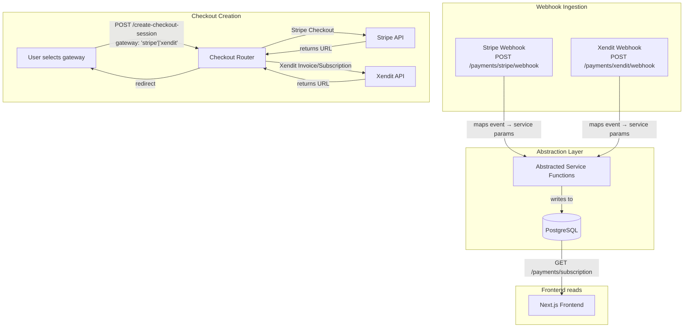
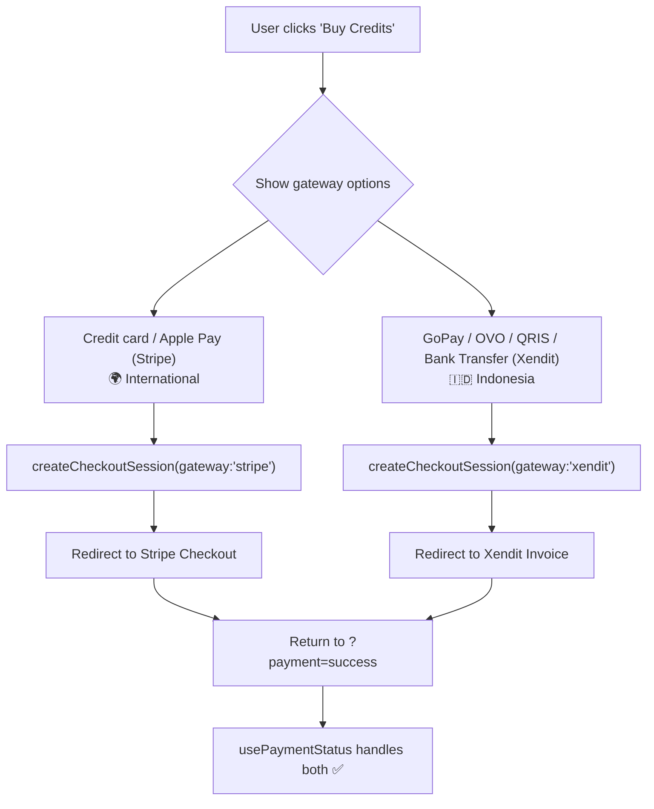

# Stripe + Xendit Gateway-Agnostic Payment Architecture — Implementation Roadmap

**Status:** ⏳ Proposed — not yet implemented
**Scope:** Both `twistloom-web` (Next.js frontend) and `twistloom-backend` (Hono.js/Express backend)
**Stack:** Stripe Node SDK · Xendit Node SDK · PostgreSQL (Neon) · Drizzle ORM · TypeScript

---

## Table of Contents

1. [Feasibility Assessment](#1-feasibility-assessment)
2. [Why Gateway-Agnostic Database Architecture](#2-why-gateway-agnostic-database-architecture)
3. [Current Coupling Inventory](#3-current-coupling-inventory)
4. [Database Schema: Rename Migration](#4-database-schema-rename-migration)
5. [Backend: Gateway Abstraction Layer](#5-backend-gateway-abstraction-layer)
6. [Backend: Xendit Route Handlers](#6-backend-xendit-route-handlers)
7. [Backend: Subscription Service Decoupling](#7-backend-subscription-service-decoupling)
8. [Frontend: Types & API Service Updates](#8-frontend-types--api-service-updates)
9. [Frontend: Gateway Selector UX](#9-frontend-gateway-selector-ux)
10. [Frontend: Region Detection & Pricing Display](#10-frontend-region-detection--pricing-display)
11. [Open Questions & Recommendations](#11-open-questions--recommendations)
12. [Implementation Sequencing](#12-implementation-sequencing)

---

## 1. Feasibility Assessment

### Verdict: Fully Feasible, Moderate Effort (~2–3 weeks for a single developer)

**Why it works:**
- The existing architecture already treats the **database as the source of truth** for subscription/credit state, not Stripe. Webhooks write to the DB; everything else reads from the DB. This is exactly the foundation a gateway-agnostic design needs — we just need to abstract *how* the DB gets written.
- The `PAYMENTS_ARCHITECTURE_BACKEND.md` §1 states the principle explicitly: *"The backend is the single source of truth."* The frontend is already a pure consumer of backend API responses.
- Stripe and Xendit share the same conceptual model for subscriptions: plan → checkout → webhook → lifecycle management. The mapping is direct, not forced.
- Xendit's hosted Checkout UI and Invoice API follow the same **server-generates-URL → client-redirects → webhook** flow as Stripe Checkout, so the frontend redirect/return-url contract (`?payment=success` / `?subscription=success`) works unchanged.

**What makes it non-trivial:**
- **One thing this document doesn't address, worth resolving before anything else here**: whether Twistloom's business entity is registered in a country Stripe fully supports. Stripe has Indonesia in a restricted "Preview" access tier, not full support (limited Connect/subscription functionality, gated onboarding) — this came up earlier reviewing the payment strategy generally. If the entity is Indonesia-registered, this isn't just a reason to add Xendit alongside Stripe — Stripe's own side of this architecture might have its own constraints worth confirming don't already exist today, independent of anything Xendit-related.
- **Schema renaming:** Current column names (`stripeCustomerId`, `stripeSubscriptionId`, etc.) are hardcoded across the entire backend. A migration is needed to make them gateway-agnostic + a `gateway` discriminator column.
- **Service layer refactor:** `createSubscription()` / `renewSubscription()` / `cancelSubscription()` in `src/services/subscription.ts` take Stripe-specific parameters. These need a gateway abstraction layer — either strategy pattern or a thin switch.
- **Idempotency needs provider scoping.** `stripeEventId` uniqueness works because Stripe event IDs are globally unique. Xendit event IDs are also unique *per provider*, but a Stripe event ID could theoretically collide with a Xendit one. The unique constraint must become `(provider, provider_event_id)` composite.
- **Xendit subscriptions have no Customer Portal equivalent.** The Stripe portal is used for plan changes, payment method updates, and invoice history. Xendit has no hosted portal — you either build your own management UI or delegate to Xendit dashboard. This is the biggest UX gap.
- **IDR pricing & conversion.** Xendit's primary currency is IDR. You need a conversion strategy — either a fixed exchange rate with periodic updates, or separate IDR-local pricing (e.g., Rp 150,000/mo instead of $9.99).

### Effort Estimate (high-level)

| Layer | Effort | Risk |
|-------|--------|------|
| Schema migration | Low | Low — additive columns + rename, no backfill for new columns |
| Backend abstraction layer | Medium | Medium — service refactor is mechanical but affects all subscription/credit routes |
| Xendit integration (Server + Webhooks) | Medium | Low-medium — well-documented API, standard webhook pattern |
| Frontend types & API | Low | Low — mostly renaming and adding gateway field |
| Frontend gateway selector | Medium | Low — new UI component, region detection |
| Frontend pricing display | Low | Low — i18n currency formatting already exists |
| Customer Portal alternative | Medium-High | Medium — Xendit has no hosted portal, need local management or redirect to Xendit dashboard |
| Testing | Medium | Medium — Stripe test clocks + Xendit test mode |
| **Total** | **~2-3 weeks** | |

---

## 2. Why Gateway-Agnostic Database Architecture

The core insight (as described in your `TODO-stripe-xendit-payment-subscription.md` research) is:

> *"Do not rely on Stripe's dashboard to know if someone is a VIP. Instead, standardise your user/subscription tables to accept inputs from both webhook pipelines."*

This is already the stated principle in `PAYMENTS_ARCHITECTURE_BACKEND.md` §1. But the *implementation* contradicts it at the schema level — all columns are named after Stripe concepts, and service functions accept Stripe-specific parameter types.

The fix is to **add a `gateway` discriminator** and **rename Stripe-specific columns to generic names** so that a Xendit webhook handler writes to exactly the same columns as the Stripe webhook handler, with only `gateway = 'xendit'` to distinguish them.



---

## 3. Current Coupling Inventory

### 3.1 Database Schema (backend `src/db/schema.ts`)

| Table | Column | Stripe-specific? | Used how? |
|-------|--------|-----------------|-----------|
| `users` | `stripe_customer_id` | ✅ Named after Stripe | Set on first subscription checkout; read by portal/checkout endpoints |
| `subscriptions` | `stripe_subscription_id` | ✅ Named after Stripe | UNIQUE NOT NULL — primary external ID for lifecycle updates |
| `subscriptions` | `stripe_customer_id` | ✅ Named after Stripe | References Stripe customer object |
| `subscriptions` | `stripe_price_id` | ✅ Named after Stripe | Which price the subscription uses |
| `transactions` | `payment_intent_id` | ✅ Named after Stripe concept | UNIQUE — idempotency + refund lookup |
| `transactions` | `stripe_event_id` | ✅ Named after Stripe | UNIQUE — idempotency |
| `subscriptionTransactions` | `stripe_invoice_id` | ✅ Named after Stripe | UNIQUE — renewal idempotency |
| `subscriptionTransactions` | `stripe_event_id` | ✅ Named after Stripe | UNIQUE — subscription event idempotency |
| `webhookDeliveries` | `event_id` | ⚠️ Generic name | Already gateway-agnostic by name |
| (missing) | No `gateway` column | ❌ No discriminator | Can't tell which provider a row came from |

### 3.2 Backend Config (Stripe IDs hardcoded)

| File | Field | Content |
|------|-------|---------|
| `src/config/credits.ts` | `CREDIT_PACKS[].priceId` | `price_1TSq8C...` (Stripe Price ID) |
| `src/config/credits.ts` | `CREDIT_PACKS[].productId` | `prod_URjb...` (Stripe Product ID) |
| `src/config/credits.ts` | `CREDIT_PACKS[].priceUSD` | USD-only price |
| `src/config/subscription.ts` | `VIP_SUBSCRIPTION.priceId` | `process.env.STRIPE_VIP_PRICE_ID` |
| `src/config/subscription.ts` | `VIP_SUBSCRIPTION.productId` | `process.env.STRIPE_VIP_PRODUCT_ID` |
| `src/config/subscription.ts` | `VIP_SUBSCRIPTION.priceUSD` | USD-only price |

### 3.3 Backend Services (Stripe parameter shapes)

| Function | File | Stripe-specific params |
|----------|------|----------------------|
| `createSubscription()` | `src/services/subscription.ts:78` | `stripeSubscriptionId`, `stripeCustomerId`, `stripePriceId` |
| `updateSubscription()` | `src/services/subscription.ts:186` | `stripeSubscriptionId` |
| `renewSubscription()` | `src/services/subscription.ts:248` | `stripeSubscriptionId`, `stripeInvoiceId` |
| `cancelSubscription()` | `src/services/subscription.ts:308` | `stripeSubscriptionId` |
| `awardCredits()` | `src/services/credits.ts:545` | `paymentIntentId`, `stripeEventId` |

### 3.4 Backend Routes (Stripe-specific endpoints)

| Route | Why Stripe-specific |
|-------|-------------------|
| `POST /payments/stripe/webhook` | ✅ Obviously — Stripe signature verification |
| `POST /payments/create-checkout-session` | ⚠️ Uses Stripe SDK directly — no gateway param |
| `POST /payments/create-subscription-checkout` | ⚠️ Uses Stripe SDK directly |
| `POST /payments/create-trial-checkout-session` | ⚠️ Uses Stripe SDK directly — trial is Stripe feature |
| `GET /payments/subscription/portal` | ⚠️ Uses `stripe.billingPortal.sessions.create()` |
| `POST /payments/subscription/cancel` | ⚠️ Uses `stripe.subscriptions.update()` |

### 3.5 Frontend Types (Stripe names leaked to frontend)

| File | Type | Stripe-specific field |
|------|------|---------------------|
| `src/lib/types/api/subscription.ts:50` | `UserSubscription` | `stripeSubscriptionId: string` |
| `src/lib/types/api/subscription.ts:35` | `SubscriptionPlan` | `priceId: string` (Stripe Price ID) |
| `src/lib/types/api/subscription.ts:36` | `SubscriptionPlan` | `productId: string` (Stripe Product ID) |
| `src/lib/types/payments.ts:10` | `CreditPack` | `priceUSD: number` (hardcoded USD) |
| `src/lib/types/payments.ts:11` | `CreditPack` | `priceId: string` (Stripe Price ID) |

### 3.6 Frontend Components (USD hardcoding)

| File | Line | What |
|------|------|------|
| `CreditPurchaseModal.tsx:142-143` | Hardcoded `Intl.NumberFormat('en-US', { currency: 'USD' })` |
| `VipPricingCard.tsx:16` | Reads `priceUSD` directly with no gateway awareness |
| `DashboardActivitiesClient.tsx:200-201` | Displays `amountUsd.toFixed(2)` |
| `i18n.ts:76-77` | **Already gateway-agnostic** — `en: USD`, `id: IDR` per locale |

### 3.7 URL Return Contract (Already Gateway-Agnostic ✅)

| Flow | Success Param | Cancel Param | Gateway-agnostic? |
|------|--------------|-------------|-------------------|
| Credit pack purchase | `?payment=success` | `?payment=cancel` | ✅ Yes |
| Subscription (regular + trial) | `?subscription=success` | `?subscription=cancel` | ✅ Yes |

These don't need to change. The webhook is what writes to the DB, regardless of which gateway processed payment.

### 3.8 Backend issue: `awardCredits()` ignores `paymentIntentId` / `stripeEventId`

**Severity: Critical** — documented in `PAYMENTS_ARCHITECTURE_BACKEND.md` §12.1. The `paymentIntentId` and `stripeEventId` fields are passed as options but **never written into the SQL insert**. This means the unique-constraint idempotency backstop (Layer 3) is non-functional for credit-pack purchases. Need to read the relevant code to confirm the exact state.

This must be fixed during the gateway-agnostic migration since we'll be touching the same code paths.

---

## 4. Database Schema: Rename Migration

**Goal:** Make all externally-facing column names gateway-agnostic. Add a `gateway` discriminator.

### 4.1 Migration Strategy

**Phase 1 — Add new columns (no downtime, additive):**
- Add `gateway` column (default `'stripe'`) to `subscriptions`, `transactions`, `subscriptionTransactions`
- Add generic-named parallel columns
- Keep old columns during transition

**Phase 2 — Backfill & dual-write:**
- Existing Stripe rows keep `gateway = 'stripe'`
- New code writes to both old and new columns during transition

**Phase 3 — Drop old columns (after deploy + verification):**
- Remove old stripe-named columns
- Rename new columns to final names if not already

### 4.2 Recommended Final Schema

```sql
-- users table
ALTER TABLE users RENAME COLUMN stripe_customer_id TO customer_id;
-- (customer_id stores Stripe cus_xxx OR Xendit customer ID depending on gateway)

-- subscriptions table
ALTER TABLE subscriptions ADD COLUMN gateway text NOT NULL DEFAULT 'stripe';
ALTER TABLE subscriptions RENAME COLUMN stripe_subscription_id TO provider_subscription_id;
ALTER TABLE subscriptions RENAME COLUMN stripe_customer_id TO provider_customer_id;
ALTER TABLE subscriptions RENAME COLUMN stripe_price_id TO provider_price_id;
-- Drop old UNIQUE on stripe_subscription_id, add UNIQUE (gateway, provider_subscription_id)

-- transactions table
ALTER TABLE transactions ADD COLUMN gateway text NOT NULL DEFAULT 'stripe';
ALTER TABLE transactions RENAME COLUMN payment_intent_id TO provider_payment_id;
ALTER TABLE transactions RENAME COLUMN stripe_event_id TO provider_event_id;
-- Drop old UNIQUE constraints, add UNIQUE (gateway, provider_payment_id) / (gateway, provider_event_id)

-- subscription_transactions table
ALTER TABLE subscription_transactions ADD COLUMN gateway text NOT NULL DEFAULT 'stripe';
ALTER TABLE subscription_transactions RENAME COLUMN stripe_invoice_id TO provider_invoice_id;
ALTER TABLE subscription_transactions RENAME COLUMN stripe_event_id TO provider_event_id;
-- Drop old UNIQUE constraints, add new composite UNIQUE

-- webhook_deliveries (already generic — add gateway)
ALTER TABLE webhook_deliveries ADD COLUMN gateway text NOT NULL DEFAULT 'stripe';
-- Change UNIQUE (event_id) to UNIQUE (gateway, event_id)
```

### 4.3 Drizzle ORM Schema Updates

**`src/db/schema.ts` changes:**

```typescript
// users table
customerId: text("customer_id").unique(),  // was stripe_customer_id

// subscriptions table
gateway: text("gateway").$type<'stripe' | 'xendit'>().notNull().default('stripe'),
providerSubscriptionId: text("provider_subscription_id").notNull(),  // was stripe_subscription_id
providerCustomerId: text("provider_customer_id").notNull(),         // was stripe_customer_id
providerPriceId: text("provider_price_id").notNull(),               // was stripe_price_id
// UNIQUE constraint becomes: unique("subscriptions_provider_unique").on(t.gateway, t.providerSubscriptionId)

// transactions table
gateway: text("gateway").$type<'stripe' | 'xendit'>().notNull().default('stripe'),
providerPaymentId: text("provider_payment_id"),   // was payment_intent_id
providerEventId: text("provider_event_id"),       // was stripe_event_id
// UNIQUE becomes: unique("transactions_provider_payment_unique").on(t.gateway, t.providerPaymentId)

// subscription_transactions table
gateway: text("gateway").$type<'stripe' | 'xendit'>().notNull().default('stripe'),
providerInvoiceId: text("provider_invoice_id"),   // was stripe_invoice_id
providerEventId: text("provider_event_id"),       // was stripe_event_id
// UNIQUE becomes: unique("sub_tx_provider_invoice_unique").on(t.gateway, t.providerInvoiceId)

// webhook_deliveries
gateway: text("gateway").notNull().default('stripe'),
// UNIQUE becomes: unique("webhook_deliveries_gateway_event_unique").on(t.gateway, t.eventId)
```

### 4.4 Migration Script (Drizzle)

```typescript
// drizzle/stripe-xendit-migration.ts
import { sql } from 'drizzle-orm';

// Phase 1: Add new columns
await dbWrite.execute(sql`
  ALTER TABLE users ADD COLUMN IF NOT EXISTS customer_id text;
  UPDATE users SET customer_id = stripe_customer_id WHERE stripe_customer_id IS NOT NULL;
`);

await dbWrite.execute(sql`
  ALTER TABLE subscriptions ADD COLUMN IF NOT EXISTS gateway text NOT NULL DEFAULT 'stripe';
  ALTER TABLE subscriptions ADD COLUMN IF NOT EXISTS provider_subscription_id text;
  ALTER TABLE subscriptions ADD COLUMN IF NOT EXISTS provider_customer_id text;
  ALTER TABLE subscriptions ADD COLUMN IF NOT EXISTS provider_price_id text;
  
  UPDATE subscriptions SET
    provider_subscription_id = stripe_subscription_id,
    provider_customer_id = stripe_customer_id,
    provider_price_id = stripe_price_id;
`);

// ... same pattern for other tables
```

---

## 5. Backend: Gateway Abstraction Layer

### 5.1 Service Function Interface Redesign

Current `createSubscription()` takes Stripe-specific params:

```typescript
// Current (Stripe-coupled)
export async function createSubscription(params: {
  userId: string;
  stripeSubscriptionId: string;   // 👎
  stripeCustomerId: string;       // 👎
  stripePriceId: string;          // 👎
  currentPeriodStart: Date;
  currentPeriodEnd: Date;
  isTrial?: boolean;
  trialEnd?: Date | null;
}): Promise<void>
```

Target — gateway-agnostic interface:

```typescript
// Target (gateway-agnostic)
export interface SubscriptionParams {
  userId: string;
  gateway: 'stripe' | 'xendit';
  /** Gateway-specific subscription/plan ID (Stripe sub_xxx, Xendit plan ID) */
  providerSubscriptionId: string;
  /** Gateway-specific customer ID (Stripe cus_xxx, Xendit customer ID) */
  providerCustomerId: string;
  /** Gateway-specific price/plan ID */
  providerPriceId: string;
  currentPeriodStart: Date;
  currentPeriodEnd: Date;
  isTrial?: boolean;
  trialEnd?: Date | null;
}

export async function createSubscription(params: SubscriptionParams): Promise<void>
```

Same pattern for `renewSubscription()`, `cancelSubscription()`, `updateSubscription()`.

### 5.2 AwardCreditsOptions Redesign

```typescript
// Target (gateway-agnostic)
interface AwardCreditsOptions {
  type: TransactionType;
  gateway?: 'stripe' | 'xendit';   // NEW — defaults to 'stripe'
  notificationType: string;
  notificationTitle: string;
  notificationMessage: string;
  notificationData?: Record<string, unknown>;
  metadata?: Record<string, unknown>;
  amountCents?: number | null;
  context?: string;
  /** Gateway-specific payment ID (stripe pi_xxx, xendit payment_id) */
  providerPaymentId?: string;      // was paymentIntentId
  /** Gateway-specific event ID */
  providerEventId?: string;        // was stripeEventId
  tx?: DBTransaction;
}
```

**Critical fix:** Must actually write `gateway`, `providerPaymentId`, and `providerEventId` to the transaction insert — the current code passes them but never inserts them (see PAYMENTS_ARCHITECTURE_BACKEND.md §12.1).

### 5.3 Gateway-Agnostic Checkout Routes

Instead of separate endpoints per gateway for checkout, add a `gateway` parameter to the existing endpoints:

```typescript
router.post("/create-checkout-session", requireAuth, async (c) => {
  const { packId, gateway = 'stripe', returnUrl } = c.get("body");
  
  // Validate
  if (!['stripe', 'xendit'].includes(gateway)) {
    return cValidationError(c, "Invalid gateway");
  }
  
  const user = c.get("user")!;
  
  let result: CheckoutUrlResponse;
  if (gateway === 'stripe') {
    result = await createStripeCheckoutSession(user, packId, returnUrl);
  } else {
    result = await createXenditCheckoutSession(user, packId, returnUrl);
  }
  
  return c.json(result);
});
```

Same for subscription checkout:

```typescript
router.post("/create-subscription-checkout", requireAuth, async (c) => {
  const { gateway = 'stripe', returnUrl } = c.get("body");
  
  if (gateway === 'xendit') {
    return c.json(await createXenditSubscriptionSession(user, returnUrl));
  }
  return c.json(await createStripeSubscriptionSession(user, returnUrl));
});
```

### 5.4 Why Not Strategy Pattern for v1?

A full strategy/abstract-factory pattern (one `PaymentGateway` interface with `StripeGateway` / `XenditGateway` implementations) is architecturally cleaner but adds overhead. For v1, a **thin switch** in each route/function suffices:

```typescript
// Pragmatic v1: thin switch, no abstract class
function getGateway(gateway: 'stripe' | 'xendit'): GatewayImpl {
  // Returns module with { createCheckout, createSubscription, cancelSubscription, ... }
}
```

**Refine to strategy pattern in a follow-up** once the Xendit integration is stable and you need a third gateway. The switch pattern is easy to extract later (Extract Interface refactoring) and doesn't require changing any production code paths during initial Xendit rollout.

---

## 6. Backend: Xendit Route Handlers

### 6.1 One-Time Credit Pack Purchase (Xendit Invoice API)

**Endpoint:** `POST /payments/create-checkout-session` (with `gateway: 'xendit'`)

```
Xendit Invoice API flow:
1. Backend creates invoice via POST /v2/invoices
2. Returns invoice.invoice_url
3. User redirects to Xendit hosted page
4. Xendit sends webhook to POST /payments/xendit/webhook on payment
```

**Xendit invoice body:**
```json
{
  "external_id": "credit-pack-{userId}-{packId}-{timestamp}",
  "amount": 500000,  // IDR cents (Rp 150,000 = 150000)
  "currency": "IDR",
  "payer_email": "user@example.com",
  "description": "Investigator Pack (150 credits)",
  "success_redirect_url": "https://...?payment=success",
  "failure_redirect_url": "https://...?payment=cancel",
  "customer": {
    "given_names": "User Name",
    "email": "user@example.com"
  },
  "items": [{
    "name": "Investigator Pack",
    "quantity": 1,
    "price": 150000,
    "category": "Credit Pack"
  }]
}
```

**Xendit Node SDK:**

⚠ **CORRECTED — the sample below was written against an old SDK generation.** `xendit-node` is currently at v7.0.0, described by Xendit as an OpenAPI-generated client — a different generation from the hand-written SDK this pattern (`import Xendit from`, flat `Invoice.create({...})`) matches. Confirmed against the current README and `docs/Invoice.md`:

```typescript
// Correct current (v7.0.0) usage — named import, not default
import { Xendit } from 'xendit-node';
import type { CreateInvoiceRequest, Invoice } from 'xendit-node/invoice/models';

const xenditClient = new Xendit({ secretKey: process.env.XENDIT_SECRET_KEY! });
const { Invoice: InvoiceClient } = xenditClient;

const data: CreateInvoiceRequest = {
  externalId: `credit-pack-${userId}-${packId}-${Date.now()}`,
  amount: idrAmount,
  currency: 'IDR',
  description: 'Investigator Pack (150 credits)',
  invoiceDuration: 172800, // seconds — confirmed field, not in the original sample at all
  // payerEmail / successRedirectUrl / failureRedirectUrl are very likely valid fields too,
  // but weren't in the minimal SDK example — confirm the full CreateInvoiceRequest shape
  // directly (`docs/invoice/CreateInvoiceRequest.md` in the SDK repo) before relying on them.
};

const response: Invoice = await InvoiceClient.createInvoice({ data }); // note: createInvoice(), nested `data`, not create({...fields})
// response.invoiceUrl (confirm exact field casing directly — see note below)
```

Two things worth flagging precisely, not glossing over:
- The method is `createInvoice()` taking a nested `{ data }` object, not `create()` taking the fields directly — a real structural difference from the original sample, not just a naming nit.
- The confirmed SDK-level request/callback objects use **camelCase** (`externalId`, `payerEmail`, `paidAmount`) — the original sample's JSON body used snake_case (`external_id`, `payer_email`). If building requests through the SDK, use camelCase. If hand-rolling raw `fetch()` calls against the REST endpoint directly (a legitimate alternative — see Q8), the raw API's actual casing convention needs its own direct check; don't assume it matches the SDK's TypeScript interface.

### 6.2 Subscription (Xendit Subscription API)

⚠ **This entire section needs direct verification against Xendit's live API reference before implementation — treat everything below as a starting hypothesis, not confirmed fact.** Here's exactly what I could and couldn't confirm:

- **Confirmed real and current**: Xendit "Subscriptions" is a genuine, actively-documented product (docs dated as recently as April 2026) — this isn't a deprecated or hallucinated feature.
- **Confirmed the actual model is different from what's described below**: the real flow is two-step, not one. A payment method gets tokenized first (via a separate Payment Method/Payment Token creation flow), *then* a recurring plan is created that references that token's ID and charges it on a schedule (confirmed field names like `paymentMethods` / payment token IDs with retry ordering, in the real Create/Update Subscription Plan API). That's structurally different from "create a Payment Session with type: SUBSCRIPTION, get back one URL, done" — there's a tokenization step this document doesn't account for.
- **Not confirmed**: the exact webhook event name strings below (`payment_session.completed`, `recurring_plan.activated`, `recurring.cycle.succeeded`, `recurring_plan.inactivated`). The vocabulary direction is plausible — Xendit's actual recurring plan IDs are prefixed `repl-`, so "recurring plan" terminology is real — but I don't have a source confirming these specific event strings, and I'd rather say that plainly than pass off a plausible guess as verified.

Given this is the part of the whole document with the most money riding on it being right, and the part I have the least confidence in, I'd treat resolving this — directly, against Xendit's actual API reference or a support conversation, not another round of search-based reconstruction — as a hard prerequisite before Phase 2/3 of the implementation sequencing below, not something to discover mid-build.

**Endpoint:** `POST /payments/create-subscription-checkout` (with `gateway: 'xendit'`)

```
Xendit Subscription flow:
1. Backend creates Payment Session with type: "SUBSCRIPTION"
2. Returns session.payment_link_url or component_sdk_key
3. User redirected to Xendit Checkout UI to link payment method
4. Xendit sends webhooks:
   - payment_session.completed
   - recurring_plan.activated → createSubscription()
   - recurring.cycle.succeeded → renewSubscription()
   - recurring.plan.inactivated → cancelSubscription()
```

**Key Xendit subscription considerations:**
- `trial_period_days` is NOT a native Xendit parameter (unlike Stripe). Need to manually set `anchor_date` to `now + 30 days` or build trial logic into the application layer (create subscription plan, grant credits, if not converted after 30 days → deactivate).
- **Recommended:** Skip Xendit subscription trial v1. Offer trial only via Stripe. For Xendit, go directly to paid subscription.
- Auto-debit only works for specific payment channels (cards, some e-wallets). For Virtual Accounts and QRIS, Xendit sends payment links each cycle.

**Xendit subscription pricing:**
```typescript
// Fixed price for Xendit subscriptions
export const XENDIT_SUBSCRIPTION = {
  amountIdr: 150000,           // Rp 150,000 (~$9.99 equivalent)
  currency: 'IDR',
  interval: 'MONTH',
  intervalCount: 1,
};
```

### 6.3 Xendit Webhook Handler

**New route:** `POST /payments/xendit/webhook`

```typescript
router.post("/xendit/webhook", async (c) => {
  // 1. Verify callback token from header
  // ⚠ CORRECTED: Xendit's actual header is `x-callback-token`, not `xendit-callback-token`.
  // Confirmed across Xendit's own webhook/callback docs (Payment Token webhooks, Terminal API
  // callbacks, general Integration Security and Handling Webhooks pages) — this header name is
  // consistent platform-wide, not product-specific. As originally written, this check would
  // silently never match a real Xendit request.
  const callbackToken = c.req.header("x-callback-token");
  if (callbackToken !== process.env.XENDIT_WEBHOOK_TOKEN) {
    return c.status(401).json({ error: "Invalid callback token" });
  }
  
  // 2. Rate limit (shared or separate from Stripe)
  const webhookRateLimit = await checkRateLimit('xendit-webhook-global', { ... });
  
  // 3. Track delivery
  let webhookDeliveryId = await trackWebhookDelivery(event.id, 'xendit');
  
  // 4. Process event
  const event = await c.req.json();
  switch (event.event) {
    case 'invoice.paid':
      await handleXenditInvoicePaid(event);
      break;
    case 'recurring_plan.activated':
      await handleXenditPlanActivated(event);
      break;
    case 'recurring.cycle.succeeded':
      await handleXenditCycleSucceeded(event);
      break;
    case 'recurring_plan.inactivated':
      await handleXenditPlanInactivated(event);
      break;
  }
  
  return c.json({ received: true });
});
```

### 6.4 IDR Pricing Configuration

**`src/config/xendit.ts`** (new file):

```typescript
/**
 * Xendit-specific configuration for IDR pricing and payment channels
 */
export const XENDIT_CONFIG = {
  secretKey: process.env.XENDIT_SECRET_KEY || '',
  webhookToken: process.env.XENDIT_WEBHOOK_TOKEN || '',
  
  /** Exchange rate: USD → IDR (fixed rate, update periodically) */
  usdToIdrRate: parseInt(process.env.XENDIT_USD_TO_IDR_RATE || '15500'),
  
  /** Xendit-specific credit pack prices in IDR (separate from Stripe USD prices) */
  creditPacks: [
    {
      id: 'observer',
      amountIdr: 45000,     // ~$2.99 equivalent
      description: 'Observer Pack',
    },
    {
      id: 'investigator',
      amountIdr: 125000,    // ~$7.99 equivalent
      description: 'Investigator Pack',
    },
    {
      id: 'mastermind',
      amountIdr: 310000,    // ~$19.99 equivalent
      description: 'Mastermind Pack',
    },
  ] as const,
  
  /** Xendit subscription price in IDR */
  subscription: {
    amountIdr: 150000,       // Rp 150,000 (~$9.99 equivalent)
    currency: 'IDR' as const,
    interval: 'MONTH' as const,
    intervalCount: 1,
  },
  
  /** Available payment channels for Xendit Indonesia */
  availableChannels: [
    'VIRTUAL_ACCOUNT_BCA',
    'VIRTUAL_ACCOUNT_MANDIRI',
    'VIRTUAL_ACCOUNT_BNI',
    'VIRTUAL_ACCOUNT_BRI',
    'EWALLET_OVO',
    'EWALLET_DANA',
    'EWALLET_SHOPEEPAY',
    'QRIS',
    'CREDIT_CARD',
  ],
} as const;
```

**Backend `GET /payments/credit-packs` returns gateway-aware response:**

```typescript
router.get("/credit-packs", async (c) => {
  const gateway = c.req.query("gateway") || 'stripe';
  
  if (gateway === 'xendit') {
    // Return packs with IDR prices
    return c.json(CREDIT_PACKS.map(pack => ({
      ...pack,
      priceUSD: undefined, // or keep for reference
      priceIdr: getXenditPackPrice(pack.id),
      currency: 'IDR',
      gateway: 'xendit',
    })));
  }
  
  // Default: Stripe packs with USD prices
  return c.json(CREDIT_PACKS.map(pack => ({
    ...pack,
    currency: 'USD',
    gateway: 'stripe',
  })));
});
```

### 6.5 Customer Portal

Stripe has `billingPortal.sessions.create()`. Xendit has no equivalent.

**Recommendation:**
- **Stripe users:** Continue using `POST /payments/subscription/portal` → redirects to Stripe Customer Portal (unchanged ✅)
- **Xendit users:** Build a local "Manage Subscription" page inside the app that shows:
  - Current plan & status
  - Payment method info
  - Cancel subscription button
  - Invoice history (from Xendit cycles)
  
  Or, simplify v1: redirect Xendit users to the Xendit dashboard via a direct link (less polished, zero build).

---

## 7. Backend: Subscription Service Decoupling

### 7.1 Current `createSubscription()` Flow

Stripe webhook `customer.subscription.created` → `handleSubscriptionCreated()` reads Stripe subscription object → calls `createSubscription()` with Stripe parameters → writes DB.

### 7.2 Target Flow (Gateway-Agnostic)

Both Stripe and Xendit webhook handlers call the same **abstracted** `createSubscription()` with `gateway` field:

```typescript
// Stripe webhook handler maps to generic params
async function handleSubscriptionCreated(event: Stripe.Event) {
  const subscription = event.data.object as Stripe.Subscription;
  await createSubscription({
    userId: subscription.metadata.userId,
    gateway: 'stripe',
    providerSubscriptionId: subscription.id,      // "sub_xxx"
    providerCustomerId: subscription.customer as string, // "cus_xxx"
    providerPriceId: subscription.items.data[0].price.id,
    currentPeriodStart: new Date(subscription.current_period_start * 1000),
    currentPeriodEnd: new Date(subscription.current_period_end * 1000),
    isTrial: subscription.status === 'trialing',
    trialEnd: subscription.trial_end ? new Date(subscription.trial_end * 1000) : null,
  });
}

// Xendit webhook handler maps to same generic params
async function handleXenditPlanActivated(event: any) {
  const plan = event.data;
  await createSubscription({
    userId: plan.metadata.userId,   // must set metadata when creating subscription session
    gateway: 'xendit',
    providerSubscriptionId: plan.id,  // "plan_xxx" (Xendit plan ID)
    providerCustomerId: plan.customer_id,
    providerPriceId: plan.id,  // or specific price tier
    currentPeriodStart: new Date(plan.activated_at),
    currentPeriodEnd: new Date(plan.next_cycle_date), // approximate
    isTrial: false,  // Xendit doesn't have native trial — application-layer if needed
    trialEnd: null,
  });
}
```

### 7.3 Cancel Subscription

Stripe: `stripe.subscriptions.update(subscriptionId, { cancel_at_period_end: true })`
Xendit: `Invoice.deactivatePlan(planId)` or manual deactivation

Both should lead to `subscriptions.cancel_at_period_end = true` in the DB. The actual cancellation (status change) happens via webhook in both cases.

```typescript
router.post("/subscription/cancel", requireAuth, async (c) => {
  const userId = c.get("user")!.id;
  
  const subscription = await dbRead
    .select({
      id: subscriptions.id,
      providerSubscriptionId: subscriptions.providerSubscriptionId,
      gateway: subscriptions.gateway,
      status: subscriptions.status,
    })
    .from(subscriptions)
    .innerJoin(users, eq(users.subscriptionId, subscriptions.id))
    .where(and(
      eq(users.userId, userId),
      inArray(subscriptions.status, ['active', 'trialing']),
    ))
    .limit(1);
  
  if (subscription.length === 0) return cNotFoundError(c, "No active subscription found");
  
  const sub = subscription[0];
  
  if (sub.gateway === 'stripe') {
    await getStripe().subscriptions.update(sub.providerSubscriptionId, { cancel_at_period_end: true });
  } else {
    // Xendit: deactivate the plan or set cancel_at_period_end
    // Implementation depends on whether we use Xendit auto-debit or manual invoice cycle
  }
  
  await dbWrite.update(subscriptions)
    .set({ cancelAtPeriodEnd: true })
    .where(eq(subscriptions.id, sub.id));
  
  return c.json({ success: true, message: "Subscription will be canceled at period end" });
});
```

---

## 8. Frontend: Types & API Service Updates

### 8.1 Type Renames

**`src/lib/types/api/subscription.ts`:**

```typescript
// BEFORE
export interface UserSubscription {
  id: string;
  stripeSubscriptionId: string;   // 👎
  status: SubscriptionStatus;
  currentPeriodStart: string;
  currentPeriodEnd: string;
  cancelAtPeriodEnd: boolean;
  monthlyCredits: number;
  isTrial?: boolean;
  trialEnd: string | null;
}

export interface SubscriptionPlan {
  id: string;
  name: string;
  description: string;
  priceUSD: number;     // 👎 USD-only
  priceId: string;      // 👎 Stripe Price ID
  productId: string;    // 👎 Stripe Product ID
  monthlyCredits: number;
  checkInMultiplier: number;
  benefits: string[];
}
```

```typescript
// AFTER
export interface UserSubscription {
  id: string;
  gateway: 'stripe' | 'xendit';           // NEW
  providerSubscriptionId: string;          // was stripeSubscriptionId
  status: SubscriptionStatus;
  currentPeriodStart: string;
  currentPeriodEnd: string;
  cancelAtPeriodEnd: boolean;
  monthlyCredits: number;
  isTrial?: boolean;
  trialEnd: string | null;
}

export interface SubscriptionPlan {
  id: string;
  name: string;
  description: string;
  priceUSD?: number;        // Stripe USD price (optional for xendit)
  priceIdr?: number;        // NEW — Xendit IDR price
  currency: 'USD' | 'IDR';  // NEW
  gateway: 'stripe' | 'xendit';  // NEW
  monthlyCredits: number;
  checkInMultiplier: number;
  benefits: string[];
}
```

**`src/lib/types/payments.ts`:**

```typescript
// AFTER
export interface CreditPack {
  id: string;
  title: string;
  tagline: string;
  description: string;
  credits: number;
  priceUSD?: number;         // Stripe USD price (optional)
  priceIdr?: number;         // NEW — Xendit IDR price
  currency?: 'USD' | 'IDR';  // NEW
  gateway?: 'stripe' | 'xendit';  // NEW
  priceId?: string;          // Stripe Price ID (keep for stripe)
  productId?: string;        // Stripe Product ID (keep for stripe)
  badge: string | null;
  color: "gray" | "blue" | "purple" | "green" | "yellow" | "red";
}

export interface CheckoutUrlResponse {
  url: string;
  sessionId: string;
  gateway?: 'stripe' | 'xendit';  // NEW
}
```

### 8.2 API Service Updates

**`src/lib/services/payments-api.ts`:**

```typescript
// Add gateway parameter
async createCheckoutSession(
  packId: string,
  returnUrl?: string,
  gateway?: 'stripe' | 'xendit'  // NEW
): Promise<CheckoutUrlResponse> {
  return this.client.post<CheckoutUrlResponse>('/payments/create-checkout-session', {
    packId,
    returnUrl,
    gateway,     // NEW — backend route will dispatch based on this
  });
}

// Add new method for fetching credit packs by gateway
async getCreditPacks(gateway?: 'stripe' | 'xendit'): Promise<CreditPack[]> {
  const params = gateway ? `?gateway=${gateway}` : '';
  return this.client.get<CreditPack[]>(`/payments/credit-packs${params}`);
}
```

**`src/lib/services/subscription-api.ts`:**

```typescript
// Add gateway parameter to createSession
async createSession(
  request: CreateSubscriptionSessionRequest & { gateway?: 'stripe' | 'xendit' }
): Promise<CreateSubscriptionSessionResponse> {
  return this.client.post<CreateSubscriptionSessionResponse>(
    '/payments/create-subscription-checkout', request
  );
}
```

### 8.3 `usePaymentStatus` Hook — Already Gateway-Agnostic ✅

The `usePaymentStatus` hook watches for `?payment=success` / `?payment=cancel` in the URL. Since both Stripe and Xendit return users to the same redirect URL with the same query params, **no changes needed here**.

### 8.4 `SubscriptionStatusMessage` — Already Gateway-Agnostic ✅

Watchers `?subscription=success` / `?subscription=cancel`. Same contract for both gateways. **No changes needed**.

---

## 9. Frontend: Gateway Selector UX

### 9.1 Checkout Flow with Gateway Selection

**Pattern: Two payment options at checkout**



**Recommended UX approach:**

For **credit packs**, add a gateway toggle in the `CreditPurchaseModal`:

```tsx
// CreditPurchaseModal.tsx — gateway selector
const [selectedGateway, setSelectedGateway] = useState<'stripe' | 'xendit'>('stripe');

// Region-aware default
const locale = useLocale();
useEffect(() => {
  if (locale === 'id') setSelectedGateway('xendit');
}, [locale]);

// In the purchase handler
const handlePurchase = async (pkg: CreditPack) => {
  const { url } = await paymentsApi.createCheckoutSession(pkg.id, window.location.href, selectedGateway);
  // ... existing redirect logic
};
```

For **subscriptions**, the `VipUpgradeModal` gets a gateway toggle:

```tsx
// VipUpgradeModal.tsx or similar
const handleUpgrade = async () => {
  // Pass gateway preference to backend
  const result = await subscriptionApi.createSession({ 
    returnUrl: window.location.href,
    gateway: selectedGateway,
  });
  window.location.href = result.url;
};
```

### 9.2 Pricing Display Per Gateway

**`CreditPurchaseModal.tsx`:**

```typescript
const formatPrice = (pkg: CreditPack, locale: string) => {
  if (locale === 'id' && pkg.priceIdr) {
    return new Intl.NumberFormat('id-ID', { 
      style: 'currency', 
      currency: 'IDR',
      maximumFractionDigits: 0, // IDR typically has no decimal
    }).format(pkg.priceIdr);
  }
  return new Intl.NumberFormat('en-US', { 
    style: 'currency', 
    currency: 'USD' 
  }).format(pkg.priceUSD!);
};
```

The `CURRENCY_FORMAT_OPTIONS` in `src/lib/config/i18n.ts` already has `en: USD` and `id: IDR` — use this locale-aware formatting instead of hardcoded USD:

```typescript
const CURRENCY_FORMAT_OPTIONS: Record<Locale, Intl.NumberFormatOptions> = {
  en: { style: 'currency', currency: 'USD' },
  id: { style: 'currency', currency: 'IDR' },
};

// Usage
const formatPrice = (amount: number, locale: Locale) => {
  return new Intl.NumberFormat(locale, CURRENCY_FORMAT_OPTIONS[locale]).format(amount);
};
```

### 9.3 Payment Method Icons Per Gateway

Add visual indicators showing available payment methods:

```tsx
// Gateway payment methods display
const GATEWAY_INFO = {
  stripe: {
    label: 'Credit Card / Apple Pay',
    icon: '💳',
    subtitle: 'International payment',
    methods: ['Visa', 'Mastercard', 'Apple Pay', 'Google Pay'],
  },
  xendit: {
    label: 'Indonesian Payment Methods',
    icon: '🇮🇩',
    subtitle: 'Local banks & e-wallets',
    methods: ['BCA', 'Mandiri', 'OVO', 'GoPay', 'DANA', 'QRIS'],
  },
} as const;
```

---

## 10. Frontend: Region Detection & Pricing Display

### 10.1 Automatic Gateway Selection

**Option A: IP-based detection (recommended for v1)**
- Use `@vercel/functions` `geolocation` or a lightweight GeoIP service
- Set default gateway based on country
- Indonesia → Xendit, Rest of world → Stripe

```typescript
// In a layout or checkout component
import { geolocation } from '@vercel/functions';

// In an API route or server component
const geo = geolocation(request);
const isIndonesian = geo.country === 'ID';
```

**Option B: Locale-based detection (simpler v1)**
- Since `next-intl` already handles locale negotiation, repurpose the `locale` to set gateway defaults

```typescript
const locale = useLocale();
const defaultGateway = locale === 'id' ? 'xendit' : 'stripe';
```

**Option C: User preference (stored in settings)**
- Let users explicitly choose their preferred gateway
- Store in user profile or localStorage

### 10.2 Transaction History: Amount Display

Current: `DashboardActivitiesClient.tsx` shows `amountUsd.toFixed(2)`.
After: Show amount with currency from the API:

```typescript
// Backend returns:
interface Transaction {
  // ...existing fields
  gateway?: 'stripe' | 'xendit';
  amountIdr?: number | null;  // NEW
  amountUsd?: number | null;
}

// Frontend display:
{tx.amountIdr != null && (
  <span>{formatIdr(tx.amountIdr)}</span>
)}
{tx.amountUsd != null && (
  <span>{formatUsd(tx.amountUsd)}</span>
)}
```

---

## 11. Open Questions & Recommendations

### Q1: IDR Pricing Strategy — Fixed exchange rate or separate IDR pricing?

| Option | Pros | Cons | Recommendation |
|--------|------|------|---------------|
| **A: Fixed rate** (1 USD = 15,500 IDR, manual updates) | Simple, one price source of truth | Exchange rate drifts, need manual updates | **Recommended for v1** — configure `XENDIT_USD_TO_IDR_RATE` env var, update monthly |
| **B: Separate IDR pricing** (Rp 150,000/mo independent of $9.99) | Local-optimized, no FX dependency | Two prices to maintain, parity debates | Consider for v2 if Indonesian pricing strategy diverges from US |

**Recommendation:** Start with **Option A** (fixed rate). Add `XENDIT_USD_TO_IDR_RATE` env var. Update rate quarterly or when USD-IDR moves >5%.

### Q2: Schema migration — Rename columns or add parallel Xendit columns?

| Option | Pros | Cons |
|--------|------|------|
| **A: Rename Stripe columns to generic names** | Clean schema, one column per concept | Migration churn in codebase, rename + drop cycle |
| **B: Add parallel `xendit_xxx` columns** | Zero migration risk, Stripe code untouched | Schema bloat (two columns for same concept), most columns NULL |

**Recommendation:** **Option A** (rename). The churn is mechanical (find-and-replace) and the result is a clean schema that won't require another migration for a third gateway. Renames run in three phases (add new → dual-write → drop old) so zero downtime.

### Q3: Xendit free trial — Skip or build?

| Option | Pros | Cons |
|--------|------|------|
| **A: Skip Xendit trial (v1)** | Ship faster, less complexity | Indonesian users can't trial VIP before paying |
| **B: Application-layer trial** (grant credits, cron to revoke) | Feature parity | Build cron-based revocation, payment method still needed at signup |
| **C: Xendit native subscription + deferred start** | Uses Xendit scheduler | Not a true trial (no "cancel before charge" UX), non-standard behavior |

**Recommendation:** **Option A** for v1. The Stripe trial already exists for international users. For v1 Xendit, go directly to paid subscription. Revisit based on Indonesian user feedback. If trial is essential, implement **Option B** (application-layer) — it's the same pattern the Stripe trial cron already uses (`vip-expiration.ts`).

### Q4: Xendit subscription management — Build local portal or redirect to dashboard?

| Option | Pros | Cons |
|--------|------|------|
| **A: Build local "Manage Subscription" page** | UX control, no Stripe dependency for Xendit users | Build effort (payment method display, invoice history, cancel flow) |
| **B: Redirect to Xendit dashboard** | Zero build | Xendit branded, users leave your app, not self-serve |
| **C: Stripe Portal for Stripe, Xendit Dashboard link for Xendit** | Best-of-both for each gateway | Two different experiences — confusing for users with both |

**Recommendation:** **Option A** but keep it minimal for v1:
- Cancel subscription (calls backend → deactivates Xendit plan)
- Display current status and period end
- Link to Xendit dashboard for invoice history (external redirect)

The Stripe Customer Portal remains unchanged for Stripe subscribers.

### Q5: Frontend gateway selector UX — Radio buttons or IP-auto-select?

| Option | Pros | Cons |
|--------|------|------|
| **A: Radio button toggle** | User choice, transparent | Extra UI decision, may confuse some users |
| **B: IP/locale auto-select with manual override** | Smart default, less friction | Needs IP detection or locale mapping |

**Recommendation:** **Option B** with **manual override**. Auto-select based on locale (simple, already available): if `locale === 'id'`, default to Xendit but show a subtle "Pay with" dropdown to switch. This gives Indonesian users a frictionless default while letting anyone choose whichever gateway they prefer.

### Q6: Same credit packs for both gateways or different?

Both gateways should offer the same credit pack values (50, 150, 500 credits). Only the price currency differs (USD vs IDR equivalent).

**Recommendation:** Same credit amounts for both gateways. The `GET /payments/credit-packs` endpoint returns different price `currency` per gateway.

### Q7: Existing Stripe-only rows — migration strategy?

All existing rows (subscriptions, transactions, subscriptionTransactions, webhookDeliveries) have `gateway = 'stripe'` by default. The `customer_id` column gets backfilled from `stripe_customer_id` during migration. **No data loss.**

### Q8: Xendit Node SDK — use official package?

The official Xendit Node.js SDK (`xendit-node`) is well-maintained but research indicates some developers prefer raw `fetch()` for simpler endpoints (Invoice API in particular). 

**Recommendation:** Use `xendit-node` SDK for subscription management (complex API), raw `fetch()` for simpler Invoice API calls. Or use raw `fetch()` for everything to minimize dependencies. Both work.

---

## 12. Implementation Sequencing

### Phase 1: Foundation (Days 1-3)

| Step | What | Who |
|------|------|-----|
| 1.1 | Database migration: add `gateway` column + rename columns | Backend |
| 1.2 | Update Drizzle ORM schema (`schema.ts`) | Backend |
| 1.3 | Fix `awardCredits()` paymentIntentId/stripeEventId write bug | Backend |
| 1.4 | Rename all service function params (subscription.ts, credits.ts) | Backend |
| 1.5 | Update all route references to use renamed columns | Backend |

### Phase 2: Xendit Backend Integration (Days 3-7)

| Step | What | Who |
|------|------|-----|
| 2.1 | Create `src/config/xendit.ts` | Backend |
| 2.2 | Implement Xendit Invoice API service (credit packs) | Backend |
| 2.3 | Implement Xendit Subscription API service (subscriptions) | Backend |
| 2.4 | Implement Xendit webhook handler (`POST /payments/xendit/webhook`) | Backend |
| 2.5 | Add gateway parameter to checkout route dispatchers | Backend |
| 2.6 | Update `GET /payments/credit-packs` for gateway-aware response | Backend |
| 2.7 | Update `GET /payments/subscription` and cancel routes | Backend |
| 2.8 | Add Xendit env vars to `.env.example` | Backend |

### Phase 3: Xendit Backend — Subscription Services (Days 5-8, overlaps P2)

| Step | What | Who |
|------|------|-----|
| 3.1 | `handleXenditPlanActivated()` → calls `createSubscription()` with `gateway: 'xendit'` | Backend |
| 3.2 | `handleXenditCycleSucceeded()` → calls `renewSubscription()` with `gateway: 'xendit'` | Backend |
| 3.3 | `handleXenditPlanInactivated()` → calls `cancelSubscription()` with `gateway: 'xendit'` | Backend |
| 3.4 | `handleXenditInvoicePaid()` → calls `awardCredits()` with `gateway: 'xendit'` | Backend |

### Phase 4: Frontend Types & API (Days 8-10)

| Step | What | Who |
|------|------|-----|
| 4.1 | Update `UserSubscription` — rename fields, add `gateway` | Frontend |
| 4.2 | Update `CreditPack` — add `priceIdr`, `currency`, `gateway` | Frontend |
| 4.3 | Update `SubscriptionPlan` — add `currency`, `gateway` | Frontend |
| 4.4 | Add `gateway` param to `payments-api.ts` methods | Frontend |
| 4.5 | Add `gateway` param to `subscription-api.ts` methods | Frontend |

### Phase 5: Frontend Gateway Selector & Pricing (Days 10-14)

| Step | What | Who |
|------|------|-----|
| 5.1 | Add gateway selector UI component | Frontend |
| 5.2 | Update `CreditPurchaseModal` — gateway toggle, IDR pricing display | Frontend |
| 5.3 | Update `VipUpgradeModal` — gateway toggle for subscription | Frontend |
| 5.4 | Implement locale-aware price formatting | Frontend |
| 5.5 | Update `DashboardActivitiesClient` — gateway-agnostic amount display | Frontend |
| 5.6 | Update `VipPricingCard` — gateway-aware price display | Frontend |

### Phase 6: Testing & Polish (Days 14-17)

| Step | What | Who |
|------|------|-----|
| 6.1 | Stripe Credit Pack: test with Xendit test mode | Both |
| 6.2 | Xendit Credit Pack: test Invoice API + webhook | Both |
| 6.3 | Stripe subscription: regression test | Both |
| 6.4 | Xendit subscription: test plan creation + cycle | Both |
| 6.5 | Test gateway selector on frontend with both locales | Frontend |
| 6.6 | Security review: Xendit webhook validation | Backend |
| 6.7 | Update architecture docs | Both |

### Phase 7: Soft Launch (Days 17-19)

| Step | What |
|------|------|
| 7.1 | Deploy schema migration (Phase 1) first — additive only |
| 7.2 | Deploy backend changes behind env gate (`XENDIT_ENABLED`) |
| 7.3 | Enable Xendit for test mode |
| 7.4 | Monitor webhook delivery success rates for both gateways |

---

## File Change Summary

### Backend (`twistloom-backend`) — New Files

| File | Purpose |
|------|---------|
| `src/config/xendit.ts` | Xendit-specific IDR pricing, payment channels, env vars |
| `src/services/xendit.ts` | Xendit API wrapper functions (Invoice, Subscription SDK calls) |
| `src/utils/xendit.ts` | Xendit singleton + webhook verification |

### Backend (`twistloom-backend`) — Modified Files

| File | Changes |
|------|---------|
| `src/db/schema.ts` | Rename columns + `gateway` discriminator |
| `src/routes/payments.ts` | Gateway parameter in checkout routes, new Xendit webhook route |
| `src/services/subscription.ts` | Generic param names, `gateway` field |
| `src/services/credits.ts` | Fix `awardCredits()` insert (write `paymentIntentId`/`stripeEventId`), add `gateway` |
| `src/types/subscription.ts` | Generic param types |
| `src/types/credits.ts` | `CreditPack.gateway`, `AwardCreditsOptions.gateway` |
| `src/config/credits.ts` | Optional `priceIdr` field on packs |
| `src/config/subscription.ts` | `SubscriptionConfig` gains `currency` option |
| `.env.example` | Xendit env vars |

### Frontend (`twistloom-web`) — Modified Files

| File | Changes |
|------|---------|
| `src/lib/types/api/subscription.ts` | Rename `stripeSubscriptionId` → `providerSubscriptionId`, add `gateway`, `currency` |
| `src/lib/types/payments.ts` | Add `priceIdr`, `currency`, `gateway` to `CreditPack` |
| `src/lib/services/payments-api.ts` | Add `gateway` param to `createCheckoutSession()` and `getCreditPacks()` |
| `src/lib/services/subscription-api.ts` | Add `gateway` to `createSession()` |
| `src/components/modals/credit-purchase/CreditPurchaseModal.tsx` | Gateway selector, locale-aware formatting |
| `src/components/vip/VipPricingCard.tsx` | Gateway-aware display |
| `src/components/vip/useVipActions.ts` | Pass `gateway` to subscription checkout |
| `src/components/dashboard/DashboardActivitiesClient.tsx` | Gateway-agnostic amount display |

### Frontend — No Changes Needed ✅

| File | Why unchanged |
|------|---------------|
| `src/lib/hooks/query/usePaymentStatus.ts` | URL params `?payment=success/cancel` are gateway-agnostic |
| `src/components/subscription/SubscriptionStatusMessage.tsx` | URL params `?subscription=success/cancel` are gateway-agnostic |
| `src/lib/hooks/query/useSubscription.ts` | Reads from same backend endpoint, which handles gateway internally |
| `src/lib/hooks/query/useTrialEligibility.ts` | Trial eligibility is server-side only |
| `src/lib/config/i18n.ts` | Currency format options already locale-aware (USD/IDR) |

---

*Generated: 2026-07-24 · This is a draft roadmap. Review the [Open Questions](#11-open-questions--recommendations) section and provide decisions before implementation begins.*
